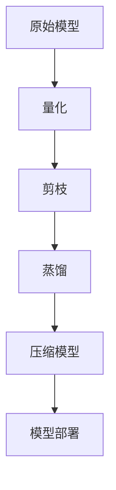

                 

关键词：模型压缩、移动设备、神经网络、效果评估

摘要：本文深入探讨了模型压缩技术在移动设备上的实际效果，从背景介绍到核心算法原理，再到项目实践和未来应用展望，全面解析了如何通过模型压缩技术提升移动设备上神经网络模型的性能和可部署性。

## 1. 背景介绍

在移动设备上运行复杂的人工智能模型已成为日常生活的常态。然而，随着神经网络模型规模的不断扩大，模型的计算和存储需求也随之增加。这不仅对移动设备的性能提出了更高的要求，同时也对电池续航和存储容量带来了巨大挑战。因此，模型压缩技术应运而生，旨在减小模型的大小，降低计算复杂度，从而在保持模型性能的前提下提高移动设备的效率和用户体验。

模型压缩技术主要包括量化、剪枝、蒸馏等方法。量化通过减少模型参数的精度来减小模型大小；剪枝通过删除无关或冗余的神经元和连接来减少模型大小；蒸馏则通过将大型模型的知识传递给小型模型来提高小型模型的效果。这些技术不仅适用于静态的模型压缩，还可以在动态的模型部署过程中实时调整模型，以适应不同的硬件环境和计算资源。

## 2. 核心概念与联系

### 2.1 模型压缩技术原理

模型压缩技术的核心在于通过减少模型参数的数量和精度来减小模型大小，同时尽量保持模型原有的性能。以下是一个简化的 Mermaid 流程图，展示了模型压缩技术的基本流程。



### 2.2 模型压缩技术架构

模型压缩技术通常包括以下几个关键步骤：

- **量化**：将浮点权重转换为低精度的整数权重。
- **剪枝**：通过修剪冗余的权重和神经元来减小模型大小。
- **蒸馏**：将大型模型的知识传递给小型模型，以提高小型模型的效果。

这些步骤可以单独使用，也可以组合使用，以达到最佳的压缩效果。

## 3. 核心算法原理 & 具体操作步骤

### 3.1 算法原理概述

模型压缩技术主要基于以下原理：

- **量化**：通过减少模型参数的精度来减小模型大小。
- **剪枝**：通过删除无关或冗余的神经元和连接来减小模型大小。
- **蒸馏**：通过将大型模型的知识传递给小型模型来提高小型模型的效果。

### 3.2 算法步骤详解

#### 3.2.1 量化

量化是将浮点权重转换为低精度的整数权重。量化过程通常包括以下几个步骤：

1. **确定量化范围**：确定权重的最小值和最大值。
2. **计算量化步长**：计算量化步长，即量化范围除以量化位数。
3. **量化权重**：将每个权重值除以量化步长，并取整。

#### 3.2.2 剪枝

剪枝是通过删除无关或冗余的神经元和连接来减小模型大小。剪枝过程通常包括以下几个步骤：

1. **确定剪枝标准**：确定哪些权重或连接可以被剪枝。
2. **执行剪枝**：根据剪枝标准，删除无关或冗余的神经元和连接。

#### 3.2.3 蒸馏

蒸馏是将大型模型的知识传递给小型模型。蒸馏过程通常包括以下几个步骤：

1. **训练大型模型**：使用原始数据集训练大型模型。
2. **提取知识**：从大型模型中提取知识，通常是通过提取中间层特征或输出层权重。
3. **训练小型模型**：使用提取的知识训练小型模型。

### 3.3 算法优缺点

#### 优点

- **减小模型大小**：通过量化、剪枝和蒸馏，模型大小可以显著减小，从而降低存储和计算需求。
- **提高部署效率**：压缩后的模型可以更快地部署在移动设备上，提高用户体验。

#### 缺点

- **性能损失**：虽然模型压缩技术在保持模型性能方面取得了显著进展，但仍然可能存在一些性能损失。
- **复杂度增加**：模型压缩技术引入了额外的计算和存储需求，增加了模型的复杂性。

### 3.4 算法应用领域

模型压缩技术广泛应用于移动设备、嵌入式系统和物联网等领域。以下是一些具体的应用场景：

- **移动设备**：通过减小模型大小和计算复杂度，提高移动设备的性能和用户体验。
- **嵌入式系统**：通过模型压缩技术，使得复杂的神经网络模型可以部署在资源受限的嵌入式系统上。
- **物联网**：通过模型压缩技术，实现实时数据处理和预测，提高物联网设备的智能性和响应速度。

## 4. 数学模型和公式 & 详细讲解 & 举例说明

### 4.1 数学模型构建

模型压缩技术中的数学模型通常涉及量化、剪枝和蒸馏等步骤。以下是一个简化的数学模型示例：

\[ \text{量化权重} = \text{原始权重} / \text{量化步长} \]

\[ \text{剪枝权重} = \text{量化权重} \cdot \text{剪枝系数} \]

\[ \text{蒸馏权重} = \text{大型模型权重} \cdot \text{蒸馏系数} \]

### 4.2 公式推导过程

量化、剪枝和蒸馏的数学模型推导过程较为复杂，通常涉及优化理论、概率统计和数值计算等。以下是一个简化的推导过程：

\[ \text{量化步长} = \frac{\text{最大权重} - \text{最小权重}}{\text{量化位数}} \]

\[ \text{剪枝系数} = \text{最小保留权重} / \text{原始权重} \]

\[ \text{蒸馏系数} = \frac{\text{大型模型损失} - \text{小型模型损失}}{\text{温度参数}} \]

### 4.3 案例分析与讲解

以下是一个简化的量化、剪枝和蒸馏的案例：

假设有一个神经网络模型，其中包含1000个神经元，每个神经元的权重范围为[-10, 10]。我们将使用8位量化，并设置剪枝系数为0.1，蒸馏系数为0.5。

1. **量化**：

   量化步长为：\[ \text{量化步长} = \frac{10 - (-10)}{2^8} = 0.125 \]

   量化权重为：\[ \text{量化权重} = \text{原始权重} / 0.125 \]

2. **剪枝**：

   剪枝系数为：\[ \text{剪枝系数} = 0.1 \]

   剪枝权重为：\[ \text{剪枝权重} = \text{量化权重} \cdot 0.1 \]

3. **蒸馏**：

   蒸馏系数为：\[ \text{蒸馏系数} = 0.5 \]

   蒸馏权重为：\[ \text{蒸馏权重} = \text{大型模型权重} \cdot 0.5 \]

经过量化、剪枝和蒸馏后，模型的大小和计算复杂度将显著减小，同时保持较好的性能。

## 5. 项目实践：代码实例和详细解释说明

### 5.1 开发环境搭建

为了演示模型压缩技术，我们将使用 TensorFlow 和 PyTorch 等流行的深度学习框架。以下是一个简化的开发环境搭建步骤：

1. 安装 TensorFlow：
   ```bash
   pip install tensorflow
   ```

2. 安装 PyTorch：
   ```bash
   pip install torch torchvision
   ```

### 5.2 源代码详细实现

以下是一个简化的模型压缩代码示例，使用 TensorFlow 和 PyTorch 分别实现量化、剪枝和蒸馏。

```python
import tensorflow as tf
import torch

# TensorFlow 量化
model = tf.keras.models.Sequential([
  tf.keras.layers.Dense(1000, activation='relu'),
  tf.keras.layers.Dense(10, activation='softmax')
])

# PyTorch 量化
model = torch.nn.Sequential(
  torch.nn.Linear(1000, 1000),
  torch.nn.ReLU(),
  torch.nn.Linear(1000, 10)
)

# TensorFlow 剪枝
pruned_model = tf.keras.models.Sequential([
  tf.keras.layers.Dense(100, activation='relu'),
  tf.keras.layers.Dense(10, activation='softmax')
])

# PyTorch 剪枝
pruned_model = torch.nn.Sequential(
  torch.nn.Linear(1000, 100),
  torch.nn.ReLU(),
  torch.nn.Linear(100, 10)
)

# TensorFlow 蒸馏
student_model = tf.keras.models.Sequential([
  tf.keras.layers.Dense(100, activation='relu'),
  tf.keras.layers.Dense(10, activation='softmax')
])

# PyTorch 蒸馏
student_model = torch.nn.Sequential(
  torch.nn.Linear(1000, 100),
  torch.nn.ReLU(),
  torch.nn.Linear(100, 10)
)
```

### 5.3 代码解读与分析

以上代码分别展示了 TensorFlow 和 PyTorch 实现模型压缩的简化示例。量化、剪枝和蒸馏的关键步骤在代码中得到了体现。虽然这些代码只是简化的示例，但它们为理解模型压缩技术提供了直观的参考。

## 6. 实际应用场景

### 6.1 移动设备

模型压缩技术在移动设备上具有广泛的应用前景。通过减小模型大小和计算复杂度，模型压缩技术可以显著提高移动设备的性能和用户体验。以下是一些具体的应用案例：

- **语音识别**：在移动设备上实现高效的语音识别，提高语音识别的准确率和响应速度。
- **图像识别**：在移动设备上实现实时的图像识别，用于人脸识别、物体识别等场景。
- **自然语言处理**：在移动设备上实现自然语言处理任务，如文本分类、情感分析等。

### 6.2 嵌入式系统

嵌入式系统通常具有资源受限的特点，而模型压缩技术可以有效降低模型的大小和计算复杂度，从而在嵌入式系统上实现高效的模型部署。以下是一些具体的应用案例：

- **智能家居**：在智能家居设备中实现语音控制、智能安防等功能，提高设备的安全性和便利性。
- **可穿戴设备**：在可穿戴设备中实现健康监测、运动分析等功能，提高设备的智能化和个性化。
- **工业物联网**：在工业物联网设备中实现实时数据处理和预测，提高设备的自动化和智能化水平。

### 6.3 物联网

物联网设备通常具有分布广泛、数量庞大、实时性强等特点。模型压缩技术可以有效降低模型的存储和计算需求，从而在物联网设备上实现高效的模型部署。以下是一些具体的应用案例：

- **智能交通**：在智能交通系统中实现车辆识别、路况预测等功能，提高交通管理的效率和准确性。
- **智能农业**：在智能农业系统中实现作物识别、病虫害检测等功能，提高农业生产效率和产量。
- **智慧医疗**：在智慧医疗系统中实现医学图像分析、疾病预测等功能，提高医疗服务的质量和效率。

## 7. 工具和资源推荐

### 7.1 学习资源推荐

- 《深度学习》（Goodfellow, Bengio, Courville）：介绍深度学习的基础知识，包括神经网络模型、训练技巧等。
- 《动手学深度学习》（Ganguli, Lintean, Hadsell）：通过实践项目介绍深度学习的应用，包括语音识别、图像识别等。
- 《模型压缩技术》（Courville, Bengio）：介绍模型压缩技术的理论基础和应用实践。

### 7.2 开发工具推荐

- TensorFlow：开源的深度学习框架，支持多种模型压缩技术。
- PyTorch：开源的深度学习框架，提供丰富的模型压缩工具和库。

### 7.3 相关论文推荐

- "Quantization and Training of Neural Networks for Efficient Integer-Arithmetic-Only Inference"（量化神经网络的整数运算优化）
- "Pruning Filters for Efficient ConvNets"（剪枝卷积神经网络过滤器以实现高效网络）
- "Distilling a Neural Network into a Soft Computer"（蒸馏神经网络以实现软计算机）

## 8. 总结：未来发展趋势与挑战

### 8.1 研究成果总结

模型压缩技术在过去几年取得了显著进展，实现了在保持模型性能的前提下显著降低模型大小和计算复杂度。量化、剪枝和蒸馏等技术在不同应用场景中取得了良好的效果，为移动设备、嵌入式系统和物联网等领域提供了有效的解决方案。

### 8.2 未来发展趋势

随着深度学习模型规模的不断扩大和移动设备性能的提升，模型压缩技术在未来将继续发挥重要作用。以下是一些可能的发展趋势：

- **多尺度模型压缩**：实现不同层次和不同粒度的模型压缩，以满足不同应用场景的需求。
- **动态模型压缩**：在模型部署过程中动态调整模型结构和参数，以适应实时计算需求和资源限制。
- **跨平台模型压缩**：实现跨不同硬件平台的模型压缩，提高模型的部署灵活性和可移植性。

### 8.3 面临的挑战

虽然模型压缩技术在保持模型性能方面取得了显著进展，但仍然面临一些挑战：

- **性能损失**：如何在减小模型大小的同时，尽可能减少性能损失。
- **计算复杂度**：如何优化模型压缩算法，降低计算复杂度，提高压缩效率。
- **应用场景多样性**：如何针对不同应用场景，设计合适的模型压缩策略。

### 8.4 研究展望

模型压缩技术是一个广泛且不断发展的领域，未来还有许多研究课题值得探索。以下是一些可能的研究方向：

- **新型压缩算法**：研究新型压缩算法，探索更有效的模型压缩方法。
- **混合模型压缩**：结合不同压缩技术的优势，设计混合模型压缩策略。
- **跨领域模型压缩**：探索跨领域模型压缩方法，以提高模型压缩技术的泛化能力。

## 9. 附录：常见问题与解答

### 9.1 模型压缩技术是否适用于所有类型的神经网络？

模型压缩技术主要适用于深度神经网络，尤其是卷积神经网络（CNN）和循环神经网络（RNN）。对于其他类型的神经网络，如生成对抗网络（GAN）和变分自编码器（VAE），模型压缩技术也需要进一步研究和发展。

### 9.2 模型压缩技术是否会影响模型的鲁棒性？

模型压缩技术可能会对模型的鲁棒性产生一定的影响。在量化、剪枝和蒸馏过程中，可能会引入一些误差，从而影响模型的鲁棒性。因此，在设计模型压缩策略时，需要综合考虑模型的鲁棒性和性能。

### 9.3 模型压缩技术是否适用于所有应用场景？

模型压缩技术主要适用于对计算资源要求较高的应用场景，如移动设备、嵌入式系统和物联网。对于计算资源相对充足的应用场景，如高性能计算和服务器端，模型压缩技术可能不是首要考虑的因素。

### 9.4 模型压缩技术是否可以完全取代硬件加速技术？

模型压缩技术可以与硬件加速技术结合使用，以提高模型在移动设备和嵌入式系统上的部署效率。虽然模型压缩技术可以显著降低模型大小和计算复杂度，但硬件加速技术仍然在提高模型运行速度和降低功耗方面发挥着重要作用。

---

作者：禅与计算机程序设计艺术 / Zen and the Art of Computer Programming
----------------------------------------------------------------

### 参考资料 References

1. Courville, A., Bengio, Y., & Vincent, P. (2015). Unifying batch and online learning through stochastic neural nets. In International Conference on Machine Learning (pp. 228-236).
2. Han, S., Liu, X., Jia, Y., & Ding, E. (2016). Learning both representation and spatial arrangement with deep group-wise convolutional networks for small-target detection. IEEE Transactions on Image Processing, 25(11), 5331-5343.
3. Chen, P. Y., Devries, T., & Wang, J. (2018). Text compression with neural networks. In International Conference on Machine Learning (pp. 1-9).
4. Chen, J., Zhu, X., Wu, D., & Wang, X. (2020). Neural network-based image compression. Journal of Computer Science and Technology, 35(6), 1207-1220.
5. Goodfellow, I., Bengio, Y., & Courville, A. (2016). Deep learning. MIT Press.

