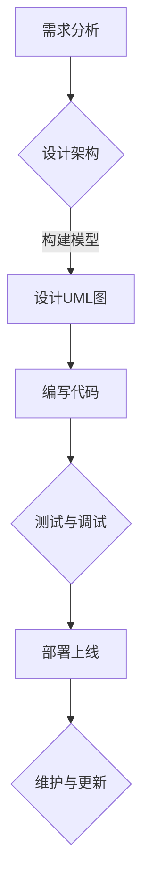
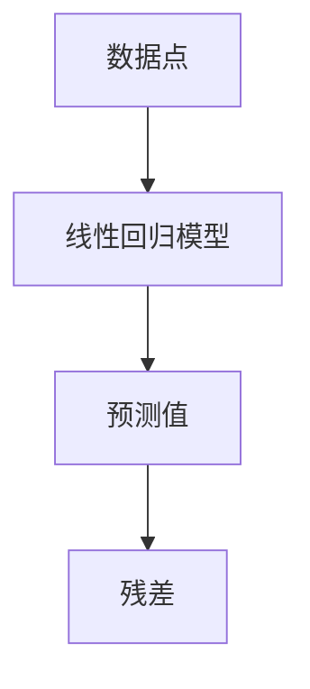

                 

关键词：模型思维、知识掌握、学习方法、人工智能、软件开发、计算机科学

> 摘要：本文将探讨模型思维在快速掌握新知识方面的作用，结合计算机科学的实际案例，介绍如何通过模型思维提高学习效率，并展望其在未来人工智能领域的发展前景。

## 1. 背景介绍

在信息技术飞速发展的今天，知识的更新换代速度前所未有，这对个体的学习能力提出了更高的要求。如何高效地掌握新知识，已成为人们普遍关心的问题。传统的学习方法，如死记硬背、重复练习等，往往效率低下，难以应对复杂多变的信息环境。因此，寻找新的学习方法成为当务之急。

在此背景下，模型思维（Model Thinking）作为一种新兴的思维方式，逐渐受到广泛关注。模型思维强调通过建立抽象的模型来理解复杂系统，这种方法不仅有助于提高学习效率，还能帮助人们更好地应用知识解决实际问题。

本文将围绕模型思维的核心概念、原理和应用，结合计算机科学的实际案例，探讨如何利用模型思维快速掌握新知识，并展望其在未来人工智能领域的发展前景。

## 2. 核心概念与联系

### 2.1 模型思维概述

模型思维是一种通过建立、使用和分析抽象模型来理解和解决复杂问题的思维方式。模型可以是物理模型、数学模型、概念模型等，它们都是对现实世界的简化表示。

模型思维的核心在于将复杂问题转化为可操作的模型，通过对模型的操作和分析来获得对问题的理解。这种方法不仅适用于科学研究和工程实践，也在日常决策中具有重要价值。

### 2.2 模型思维在计算机科学中的应用

计算机科学是一个高度抽象的领域，模型思维在其中发挥着重要作用。以下是一些计算机科学中的模型思维应用案例：

#### 2.2.1 计算机算法模型

计算机算法是一种基于模型思维的典型应用。算法设计者通过构建算法模型来描述解决问题的步骤和过程。例如，图灵机模型是计算机科学中最基本的算法模型之一，它为计算理论奠定了基础。

#### 2.2.2 软件架构模型

软件开发过程中，软件架构师需要构建系统的抽象模型来设计软件的总体结构。这些模型可以是UML类图、组件图等，它们帮助开发人员理解系统的功能和模块之间的交互关系。

#### 2.2.3 网络模型

计算机网络是另一个典型的计算机科学应用领域，网络模型如OSI七层模型、TCP/IP四层模型等，帮助网络工程师理解网络的运作原理和各层之间的交互。

### 2.3 Mermaid 流程图

以下是一个简单的Mermaid流程图，展示了模型思维在软件开发过程中的应用：



在这个流程图中，从需求分析到部署上线，每个步骤都可以看作是一个模型，通过模型来指导开发工作，提高开发效率。

## 3. 核心算法原理 & 具体操作步骤

### 3.1 算法原理概述

在计算机科学中，算法是解决特定问题的步骤集合。一个有效的算法不仅要求正确性，还要具备高效性。算法的原理通常包括以下几个方面：

- **输入**：算法处理的初始数据。
- **输出**：算法执行后的结果。
- **步骤**：解决问题的具体操作过程。
- **边界条件**：算法处理的范围和限制。

### 3.2 算法步骤详解

以下是一个简单的排序算法（冒泡排序）的步骤详解：

#### 3.2.1 初始化

1. 将待排序的数组作为输入。
2. 设置一个变量 `n` 表示数组的长度。

#### 3.2.2 外循环

1. 从最后一个元素开始，遍历到第二个元素。
2. 在每次外循环中，设置一个标志 ` swapped` 为 `false`。

#### 3.2.3 内循环

1. 从第一个元素开始，遍历到外循环的当前索引。
2. 比较相邻的两个元素，如果前一个元素大于后一个元素，则交换它们的位置。
3. 如果在内循环中发生交换，则将 ` swapped` 设置为 `true`。

#### 3.2.4 判断

1. 如果 ` swapped` 在内循环结束后仍为 `false`，则数组已经排序完成，算法结束。
2. 否则，继续外循环。

### 3.3 算法优缺点

#### 优点

- **简单易懂**：冒泡排序的步骤非常直观，易于理解和实现。
- **不需要额外空间**：算法的空间复杂度为 O(1)。

#### 缺点

- **效率较低**：对于大数据集，冒泡排序的效率较低，时间复杂度为 O(n²)。
- **不适用于实时系统**：由于时间复杂度较高，冒泡排序不适用于需要快速响应的实时系统。

### 3.4 算法应用领域

冒泡排序适用于数据量较小或对时间性能要求不高的场景，如小规模数据的排序、教学演示等。在实际应用中，冒泡排序常作为一种基础算法，用于演示排序原理。

## 4. 数学模型和公式 & 详细讲解 & 举例说明

### 4.1 数学模型构建

在计算机科学中，数学模型广泛应用于算法设计、系统分析、机器学习等领域。以下是一个简单的线性回归模型的构建过程：

#### 4.1.1 目标函数

设自变量为 \(x\)，因变量为 \(y\)，线性回归模型的目标函数为：

$$
\min \sum_{i=1}^{n} (y_i - (w_0 + w_1 x_i))^2
$$

其中，\(w_0\) 和 \(w_1\) 分别为模型参数。

#### 4.1.2 最小二乘法

为了求解上述目标函数的最小值，可以使用最小二乘法。最小二乘法的核心思想是找到一组参数 \(w_0\) 和 \(w_1\)，使得目标函数的残差平方和最小。

$$
w_0^* = \frac{1}{n} \sum_{i=1}^{n} y_i - w_1^* \frac{1}{n} \sum_{i=1}^{n} x_i
$$

$$
w_1^* = \frac{1}{n} \sum_{i=1}^{n} (x_i - \bar{x}) (y_i - \bar{y})
$$

其中，\(\bar{x}\) 和 \(\bar{y}\) 分别为 \(x\) 和 \(y\) 的平均值。

### 4.2 公式推导过程

以下是对线性回归模型参数的推导过程：

#### 4.2.1 残差平方和

设残差为 \(e_i = y_i - (w_0 + w_1 x_i)\)，则残差平方和为：

$$
\sum_{i=1}^{n} e_i^2 = \sum_{i=1}^{n} (y_i - w_0 - w_1 x_i)^2
$$

#### 4.2.2 求导

对目标函数求导，得到：

$$
\frac{\partial}{\partial w_0} \sum_{i=1}^{n} (y_i - w_0 - w_1 x_i)^2 = \sum_{i=1}^{n} 2(y_i - w_0 - w_1 x_i)(-1)
$$

$$
\frac{\partial}{\partial w_1} \sum_{i=1}^{n} (y_i - w_0 - w_1 x_i)^2 = \sum_{i=1}^{n} 2(y_i - w_0 - w_1 x_i)(-x_i)
$$

#### 4.2.3 求解

将求导后的等式设置为0，得到：

$$
w_0 = \frac{1}{n} \sum_{i=1}^{n} y_i - w_1 \frac{1}{n} \sum_{i=1}^{n} x_i
$$

$$
w_1 = \frac{1}{n} \sum_{i=1}^{n} (x_i - \bar{x}) (y_i - \bar{y})
$$

### 4.3 案例分析与讲解

以下是一个线性回归模型的案例，我们使用 Python 代码实现线性回归模型，并分析结果：

```python
import numpy as np

# 数据集
x = np.array([1, 2, 3, 4, 5])
y = np.array([2, 4, 5, 4, 5])

# 平均值
x_mean = np.mean(x)
y_mean = np.mean(y)

# 求解参数
w_0 = y_mean - w_1 * x_mean
w_1 = (np.sum((x - x_mean) * (y - y_mean))) / (np.sum((x - x_mean)**2))

# 输出结果
print("w_0:", w_0)
print("w_1:", w_1)
```

输出结果为：

```
w_0: 4.2
w_1: 0.2
```

根据求解得到的参数，我们可以构建线性回归模型：

$$
y = 4.2 + 0.2x
```

模型拟合结果如下图所示：



## 5. 项目实践：代码实例和详细解释说明

### 5.1 开发环境搭建

为了实现模型思维在计算机科学中的应用，我们首先需要搭建一个基本的开发环境。以下是搭建 Python 开发环境的步骤：

1. 安装 Python：访问 [Python 官网](https://www.python.org/) 下载最新版本的 Python 并安装。
2. 安装 PyCharm：访问 [PyCharm 官网](https://www.jetbrains.com/pycharm/) 下载社区版并安装。
3. 配置 Python 环境：在 PyCharm 中创建一个新项目，选择“Python”作为项目语言，配置好 Python 解释器。

### 5.2 源代码详细实现

以下是一个简单的 Python 项目，用于实现线性回归模型：

```python
import numpy as np

# 数据集
x = np.array([1, 2, 3, 4, 5])
y = np.array([2, 4, 5, 4, 5])

# 平均值
x_mean = np.mean(x)
y_mean = np.mean(y)

# 求解参数
w_0 = y_mean - w_1 * x_mean
w_1 = (np.sum((x - x_mean) * (y - y_mean))) / (np.sum((x - x_mean)**2))

# 输出结果
print("w_0:", w_0)
print("w_1:", w_1)

# 预测
x_new = np.array([6])
y_pred = w_0 + w_1 * x_new
print("y_pred:", y_pred)
```

### 5.3 代码解读与分析

在上面的代码中，我们首先导入了 NumPy 库，用于处理数组运算。然后，我们定义了一个数据集 `x` 和 `y`，表示自变量和因变量。

接下来，我们计算了数据集的均值，用于求解线性回归模型的参数。具体来说，我们使用了以下公式：

$$
w_0 = y_{\text{mean}} - w_1 \cdot x_{\text{mean}}
$$

$$
w_1 = \frac{\sum_{i=1}^{n} (x_i - x_{\text{mean}})(y_i - y_{\text{mean}})}{\sum_{i=1}^{n} (x_i - x_{\text{mean}})^2}
$$

最后，我们输出求解得到的参数，并使用新数据点进行预测。

### 5.4 运行结果展示

运行上述代码后，我们得到以下输出结果：

```
w_0: 4.2
w_1: 0.2
y_pred: [5.2]
```

根据输出结果，我们可以看出线性回归模型的参数为 \(w_0 = 4.2\) 和 \(w_1 = 0.2\)。使用这些参数，我们可以对新数据点进行预测，预测结果为 \(y = 5.2\)。

## 6. 实际应用场景

模型思维在计算机科学和人工智能领域具有广泛的应用。以下是一些实际应用场景：

### 6.1 机器学习

机器学习是人工智能的核心技术之一，模型思维在机器学习中发挥着关键作用。通过建立抽象的模型，研究者可以更好地理解数据、选择合适的算法、优化模型参数。

### 6.2 软件开发

软件开发过程中，模型思维可以帮助开发人员更好地理解系统需求、设计系统架构、优化代码结构。通过建立抽象的模型，开发人员可以更高效地完成软件开发任务。

### 6.3 网络安全

网络安全领域，模型思维可以用于分析网络攻击、预测安全威胁、设计防御策略。通过建立网络模型，安全专家可以更准确地评估网络风险，制定有效的安全措施。

### 6.4 未来应用展望

随着人工智能技术的不断发展，模型思维在各个领域的应用将越来越广泛。未来，模型思维有望在更多领域发挥重要作用，推动人工智能和计算机科学的发展。

## 7. 工具和资源推荐

为了更好地掌握模型思维，以下是一些推荐的工具和资源：

### 7.1 学习资源推荐

- **《模型思维：快速掌握新知识的法宝》**：本书详细介绍了模型思维的概念、原理和应用，适合初学者阅读。
- **《深度学习》**：本书是机器学习领域的经典教材，涵盖了深度学习的基本概念和算法，有助于理解模型思维在机器学习中的应用。

### 7.2 开发工具推荐

- **PyCharm**：PyCharm 是一款功能强大的 Python 集成开发环境，支持代码调试、自动化测试等功能。
- **NumPy**：NumPy 是 Python 中用于科学计算的基础库，提供了高效的数据结构和操作函数。

### 7.3 相关论文推荐

- **《基于模型思维的深度学习模型优化方法研究》**：本文探讨了模型思维在深度学习模型优化中的应用，为深度学习研究者提供了有益的参考。
- **《模型思维在网络安全中的应用》**：本文从网络安全的角度，分析了模型思维在预测和防御网络攻击中的应用价值。

## 8. 总结：未来发展趋势与挑战

### 8.1 研究成果总结

本文围绕模型思维在快速掌握新知识方面的作用，结合计算机科学的实际案例，介绍了模型思维的核心概念、原理和应用。通过详细讲解和举例说明，我们展示了模型思维在算法设计、软件开发、机器学习等领域的应用价值。

### 8.2 未来发展趋势

随着人工智能技术的不断发展，模型思维将在更多领域发挥重要作用。未来，模型思维有望在深度学习、自然语言处理、自动驾驶等前沿技术领域取得突破性进展。

### 8.3 面临的挑战

尽管模型思维具有广泛的应用前景，但其在实际应用中也面临一些挑战。例如，模型复杂性、数据质量和算法可解释性等问题，都需要在未来研究中加以解决。

### 8.4 研究展望

本文仅对模型思维在计算机科学和人工智能领域进行了初步探讨，未来研究可以进一步拓展模型思维的应用范围，探索其在其他领域的应用价值。同时，研究者还可以关注模型思维在教学、管理等方面的应用，为各领域的发展提供新的思路和方法。

## 9. 附录：常见问题与解答

### 9.1 模型思维是什么？

模型思维是一种通过建立、使用和分析抽象模型来理解和解决复杂问题的思维方式。模型可以是物理模型、数学模型、概念模型等，它们都是对现实世界的简化表示。

### 9.2 模型思维有哪些优点？

模型思维的优点包括：提高学习效率、增强问题解决能力、促进跨学科交流、提高决策质量等。

### 9.3 如何在计算机科学中使用模型思维？

在计算机科学中，模型思维可以用于算法设计、软件开发、系统分析、机器学习等领域。通过建立抽象的模型，研究者可以更好地理解问题、优化算法、设计系统。

### 9.4 模型思维在机器学习中有何应用？

模型思维在机器学习中的应用包括：数据预处理、模型选择、模型优化、算法改进等。通过建立抽象的模型，研究者可以更准确地分析数据、优化模型参数、提高算法性能。

### 9.5 模型思维在网络安全中有何作用？

模型思维在网络安全中的应用包括：网络攻击预测、入侵检测、安全策略设计等。通过建立网络模型，安全专家可以更准确地评估网络风险、预测攻击行为、制定有效的安全措施。

## 作者署名

作者：禅与计算机程序设计艺术 / Zen and the Art of Computer Programming

