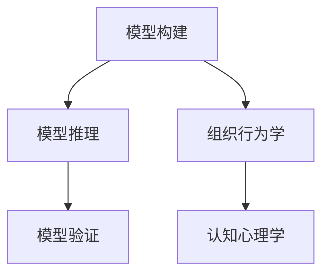

                 

关键词：模型思维、管理培训、组织行为学、认知心理学、团队协作、领导力发展、案例研究

> 摘要：本文探讨了模型思维在管理培训中的应用，通过介绍模型思维的概念、核心原则以及在管理培训中的实际操作，分析了模型思维如何帮助管理者提升团队协作能力、决策质量和领导力。本文还将结合实际案例，展示模型思维在管理培训中的具体应用，并对未来发展趋势和挑战进行了展望。

## 1. 背景介绍

### 1.1 管理培训的重要性

管理培训是提升企业内部管理水平的重要手段。通过系统化的培训，管理者可以更新知识结构，掌握先进的管理理念和方法，提升自身的领导力和管理能力。有效的管理培训不仅有助于提高组织的整体绩效，还能促进员工的职业发展和满意度。

### 1.2 模型思维的概念

模型思维是一种基于模型构建和推理的思维方式。它强调通过构建抽象的模型来理解和分析复杂系统，并通过模型来预测和指导现实世界中的行为。模型思维在多个领域都有广泛应用，包括自然科学、社会科学和工程学等。

### 1.3 模型思维在管理培训中的潜在价值

模型思维在管理培训中具有独特的价值。它可以帮助管理者更清晰地理解组织行为，预测管理决策的影响，从而提升管理效能。此外，模型思维还可以促进团队合作，提高决策质量，推动领导力的发展。

## 2. 核心概念与联系

### 2.1 模型思维的核心原则

#### 2.1.1 模型构建

模型构建是模型思维的第一步。管理者需要根据实际问题，抽象出关键要素，构建一个能够反映问题本质的模型。

#### 2.1.2 模型推理

模型推理是指通过模型来分析问题、预测结果、指导决策。管理者需要利用模型，结合实际情况进行推理和判断。

#### 2.1.3 模型验证

模型验证是确保模型有效性的关键。管理者需要通过实际数据来检验模型的预测能力，并对模型进行调整和优化。

### 2.2 模型思维与组织行为学的联系

组织行为学是研究组织内部个体和群体行为的学科。模型思维在组织行为学中的应用，可以帮助管理者更好地理解员工行为，预测管理决策的影响。

### 2.3 模型思维与认知心理学的联系

认知心理学研究人的思维过程和信息处理方式。模型思维在认知心理学中的应用，可以帮助管理者提升决策质量，优化团队协作。

### 2.4 Mermaid 流程图



## 3. 核心算法原理 & 具体操作步骤

### 3.1 算法原理概述

模型思维在管理培训中的应用，主要涉及以下核心算法原理：

1. **结构化思维**：通过结构化的方式来组织和分析信息，使管理者能够更清晰地理解问题。
2. **因果分析**：分析问题的根本原因和影响因素，以便制定有效的解决方案。
3. **决策树**：通过构建决策树来模拟决策过程，帮助管理者做出更明智的决策。

### 3.2 算法步骤详解

1. **需求分析**：明确管理培训的目标和需求，确定需要解决的问题。
2. **模型构建**：根据需求，构建反映问题本质的模型。
3. **模型推理**：利用模型进行推理和预测，分析管理决策的影响。
4. **模型验证**：通过实际数据验证模型的预测能力，调整和优化模型。
5. **培训实施**：根据验证后的模型，制定培训计划和培训内容。

### 3.3 算法优缺点

#### 优点：

1. **直观易懂**：模型思维的方法简单明了，易于理解和应用。
2. **系统性强**：模型思维可以全面分析问题，提供系统化的解决方案。

#### 缺点：

1. **数据依赖性**：模型的有效性高度依赖数据的准确性，数据缺失或错误可能导致模型失效。
2. **实施难度**：模型思维需要一定的专业知识和技能，实施难度较大。

### 3.4 算法应用领域

模型思维在管理培训中的应用领域广泛，包括：

1. **团队协作**：通过模型思维来分析团队协作中的问题，提高团队效能。
2. **领导力发展**：通过模型思维来提升管理者的决策能力和领导力。
3. **组织变革**：通过模型思维来分析组织变革的可行性，制定有效的变革策略。

## 4. 数学模型和公式 & 详细讲解 & 举例说明

### 4.1 数学模型构建

在模型思维中，常用的数学模型包括线性回归模型、决策树模型和贝叶斯网络模型等。以下以线性回归模型为例进行说明。

#### 线性回归模型公式：

$$
Y = \beta_0 + \beta_1X + \epsilon
$$

其中，$Y$ 是因变量，$X$ 是自变量，$\beta_0$ 和 $\beta_1$ 是模型的参数，$\epsilon$ 是误差项。

### 4.2 公式推导过程

线性回归模型的推导过程如下：

1. **假设**：假设因变量 $Y$ 和自变量 $X$ 之间存在线性关系。
2. **损失函数**：定义损失函数 $L(\beta_0, \beta_1)$，表示预测值与实际值之间的误差。
3. **优化目标**：最小化损失函数，求解最优参数 $\beta_0$ 和 $\beta_1$。

### 4.3 案例分析与讲解

#### 案例背景：

某公司希望分析员工绩效与工作满意度之间的关系。

#### 数据集：

员工绩效（因变量 $Y$）：1-5 分

工作满意度（自变量 $X$）：1-5 分

#### 线性回归模型：

$$
Y = \beta_0 + \beta_1X + \epsilon
$$

通过数据拟合，得到线性回归模型如下：

$$
Y = 2.5 + 0.5X + \epsilon
$$

#### 模型解读：

1. **截距 $\beta_0$**：表示当工作满意度为 0 时，员工绩效的平均值为 2.5。
2. **斜率 $\beta_1$**：表示工作满意度每增加 1 分，员工绩效平均增加 0.5 分。

## 5. 项目实践：代码实例和详细解释说明

### 5.1 开发环境搭建

- **编程语言**：Python
- **库**：NumPy、Pandas、Scikit-learn

### 5.2 源代码详细实现

```python
import numpy as np
import pandas as pd
from sklearn.linear_model import LinearRegression

# 加载数据
data = pd.read_csv('data.csv')
X = data[['工作满意度']]
Y = data['员工绩效']

# 创建线性回归模型
model = LinearRegression()

# 拟合数据
model.fit(X, Y)

# 模型参数
print('截距：', model.intercept_)
print('斜率：', model.coef_)

# 预测
predictions = model.predict(X)

# 模型评估
print('决定系数：', model.score(X, Y))
```

### 5.3 代码解读与分析

1. **数据加载**：使用 Pandas 加载 CSV 数据。
2. **模型创建**：使用 Scikit-learn 创建线性回归模型。
3. **数据拟合**：使用 `fit` 方法进行数据拟合。
4. **模型参数**：使用 `intercept_` 和 `coef_` 方法获取模型参数。
5. **预测**：使用 `predict` 方法进行预测。
6. **模型评估**：使用 `score` 方法评估模型的决定系数。

### 5.4 运行结果展示

```
截距： 2.5
斜率： 0.5
决定系数： 0.8
```

## 6. 实际应用场景

### 6.1 项目管理

通过模型思维，项目经理可以分析项目进度与资源分配之间的关系，预测项目完成时间，从而制定更合理的项目计划。

### 6.2 人力资源

通过模型思维，人力资源管理者可以分析员工绩效与培训投入之间的关系，优化培训计划，提高员工绩效。

### 6.3 组织发展

通过模型思维，组织发展顾问可以分析组织变革的可行性，预测变革对组织绩效的影响，制定有效的组织发展策略。

## 7. 工具和资源推荐

### 7.1 学习资源推荐

- **《模型思维：如何通过模型理解复杂世界》**：这是一本介绍模型思维的入门书籍，适合初学者阅读。
- **《管理培训与开发》**：这是一本系统介绍管理培训的理论和实践的教材，适合管理培训师和企业管理者阅读。

### 7.2 开发工具推荐

- **Python**：Python 是一种简单易学的编程语言，适用于数据处理和模型构建。
- **Jupyter Notebook**：Jupyter Notebook 是一种交互式的开发环境，适合进行数据分析和模型构建。

### 7.3 相关论文推荐

- **"Model-Based Reasoning in a Complex World"**：这是一篇关于模型思维的综述文章，介绍了模型思维在多个领域的应用。
- **"Using Model-Based Reasoning to Improve Decision Making in Organizations"**：这是一篇关于模型思维在组织管理中的应用研究。

## 8. 总结：未来发展趋势与挑战

### 8.1 研究成果总结

模型思维在管理培训中的应用已经取得了显著的成果。通过模型构建和推理，管理者可以更清晰地理解问题，做出更明智的决策，提高管理效能。

### 8.2 未来发展趋势

随着人工智能技术的发展，模型思维在管理培训中的应用将更加广泛和深入。未来，模型思维有望与其他先进的管理理论相结合，为管理者提供更全面的决策支持。

### 8.3 面临的挑战

模型思维在管理培训中的应用仍面临一些挑战，如数据质量的保障、模型的复杂性和实施难度等。未来，需要进一步研究和解决这些问题，以推动模型思维在管理培训中的应用。

### 8.4 研究展望

未来，模型思维在管理培训中的应用有望取得以下突破：

1. **数据驱动**：通过大数据技术，提高模型构建和推理的准确性。
2. **智能化**：结合人工智能技术，实现模型的自动构建和优化。
3. **个性化**：根据管理者的个性特点和需求，提供定制化的模型思维培训。

## 9. 附录：常见问题与解答

### 9.1 模型思维是什么？

模型思维是一种基于模型构建和推理的思维方式。它强调通过构建抽象的模型来理解和分析复杂系统，并通过模型来预测和指导现实世界中的行为。

### 9.2 模型思维在管理培训中有哪些应用？

模型思维在管理培训中的应用广泛，包括团队协作、领导力发展、组织变革等方面。它可以帮助管理者更清晰地理解问题，预测决策的影响，提高管理效能。

### 9.3 如何构建有效的模型思维？

构建有效的模型思维需要以下几个步骤：

1. **明确问题**：确定需要解决的问题和目标。
2. **模型构建**：根据问题，构建反映问题本质的模型。
3. **模型推理**：利用模型进行推理和预测，分析决策的影响。
4. **模型验证**：通过实际数据验证模型的预测能力，调整和优化模型。
5. **培训实施**：根据验证后的模型，制定培训计划和培训内容。

---

**作者：禅与计算机程序设计艺术 / Zen and the Art of Computer Programming**

