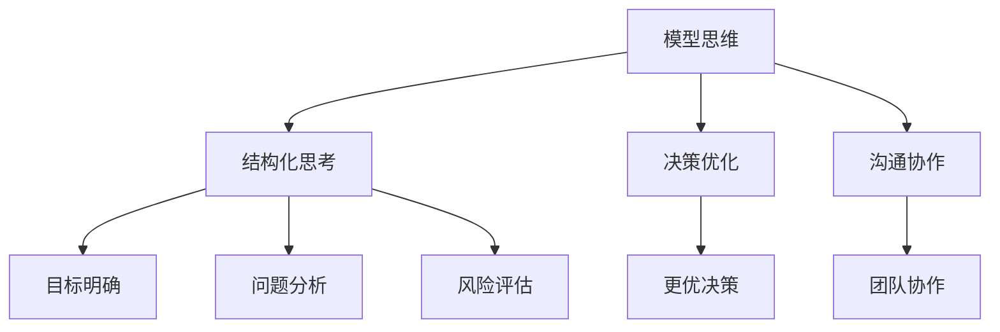

                 

关键词：模型思维、管理培训、结构化思考、决策优化、组织效能

> 摘要：本文将探讨模型思维在管理培训中的重要性及其应用。通过构建和应用管理模型，管理者能够更有效地进行决策，提高组织的运行效率。本文将详细阐述模型思维的原理、核心概念、算法原理与操作步骤，以及其在管理培训中的实际应用，为管理者提供实用的方法论和工具。

## 1. 背景介绍

在当今快速变化和高度复杂的企业环境中，管理者的职责不仅仅是执行任务，更重要的是进行决策和规划，以确保组织的长期成功。然而，管理决策往往面临着诸多不确定性和复杂性，这使得管理者难以做出最优选择。传统的管理培训方法往往侧重于理论和技能传授，而忽视了对管理者思维模式的培养。在此背景下，模型思维作为一种结构化思考的工具，为管理培训提供了一种新的视角和方法。

模型思维是指通过构建和分析模型来理解复杂系统，从而更好地进行决策和规划。在管理培训中，模型思维的应用能够帮助管理者更系统地分析问题，提高决策的质量和效率。本文将围绕模型思维在管理培训中的应用，探讨其核心概念、算法原理、数学模型以及实际案例，旨在为管理者提供一套实用的思维工具和方法。

## 2. 核心概念与联系

### 2.1 模型思维的定义

模型思维（Model Thinking）是一种基于模型构建和分析的思维方式，旨在通过构建抽象的模型来理解现实世界的复杂系统。模型思维的核心思想是通过简化和抽象现实问题，构建出一个能够反映关键因素的模型，从而在分析和决策过程中起到指导作用。

### 2.2 模型思维在管理中的重要性

在管理培训中，模型思维的重要性体现在以下几个方面：

1. **结构化思考**：模型思维帮助管理者以结构化的方式思考问题，避免思维的混乱和无序，提高决策的效率和质量。
2. **决策优化**：通过模型分析，管理者可以更全面地考虑问题的各个方面，从而做出更优的决策。
3. **沟通协作**：模型作为一种共同语言，有助于团队成员之间的沟通和协作，提高组织的整体效能。

### 2.3 模型思维与决策的关系

模型思维与决策之间存在密切的联系。管理者通过模型思维可以：

1. **明确目标**：模型有助于管理者明确决策的目标和期望结果，从而制定出更具针对性的决策方案。
2. **分析问题**：模型思维提供了一种系统的方法来分析问题，包括识别关键因素、理解变量之间的相互关系等。
3. **评估风险**：通过模型分析，管理者可以预测决策可能带来的风险和不确定性，从而制定相应的应对策略。

### 2.4 Mermaid 流程图



## 3. 核心算法原理 & 具体操作步骤

### 3.1 算法原理概述

模型思维的核心算法原理在于通过建立模型来模拟现实系统，进而分析和优化管理决策。这个过程可以分为以下几个步骤：

1. **问题定义**：明确要解决的问题和目标。
2. **模型构建**：根据问题定义构建一个抽象的模型，包括识别关键因素、变量和关系。
3. **模型分析**：使用模型分析工具对模型进行评估和优化，如模拟、敏感性分析等。
4. **决策制定**：根据模型分析结果制定决策方案。
5. **实施与监控**：将决策方案付诸实施，并持续监控和调整。

### 3.2 算法步骤详解

1. **问题定义**：
    - 确定问题范围和目标。
    - 收集相关数据和背景信息。

2. **模型构建**：
    - 识别关键因素和变量。
    - 建立变量之间的关系。
    - 选择适当的模型类型（如线性规划、决策树、仿真模型等）。

3. **模型分析**：
    - 进行模拟和敏感性分析，以评估不同决策方案的效果。
    - 分析模型的稳定性和可靠性。

4. **决策制定**：
    - 根据模型分析结果选择最优决策方案。
    - 制定具体的实施计划。

5. **实施与监控**：
    - 将决策方案付诸实施。
    - 持续监控实施过程和结果，并根据实际情况进行调整。

### 3.3 算法优缺点

**优点**：
1. **系统性**：模型思维提供了一个系统性的框架，有助于全面分析问题。
2. **精确性**：通过数学模型和算法分析，可以更精确地评估决策的效果。
3. **预测性**：模型思维能够预测不同决策方案的可能结果，帮助管理者做出更明智的选择。

**缺点**：
1. **复杂性**：构建和分析模型需要较高的专业知识和技能。
2. **局限性**：模型往往是对现实世界的简化和抽象，可能无法完全反映实际情况。

### 3.4 算法应用领域

模型思维在管理培训中的应用非常广泛，主要包括：

1. **战略规划**：帮助管理者制定长期发展战略。
2. **人力资源管理**：优化招聘、培训和绩效管理。
3. **项目管理**：提高项目规划和管理效率。
4. **运营管理**：优化生产和供应链管理。

## 4. 数学模型和公式 & 详细讲解 & 举例说明

### 4.1 数学模型构建

在管理培训中，常用的数学模型包括线性规划、决策树和仿真模型等。以下是一个简单的线性规划模型示例：

```latex
\begin{align*}
\text{最大化} \quad & Z = c_1x_1 + c_2x_2 \\
\text{约束条件} \quad & a_{11}x_1 + a_{12}x_2 \leq b_1 \\
& a_{21}x_1 + a_{22}x_2 \leq b_2 \\
& x_1, x_2 \geq 0
\end{align*}
```

其中，\( Z \) 是目标函数，\( c_1 \) 和 \( c_2 \) 是变量系数，\( a_{11}, a_{12}, a_{21}, a_{22} \) 是约束条件系数，\( b_1 \) 和 \( b_2 \) 是约束条件常数，\( x_1 \) 和 \( x_2 \) 是决策变量。

### 4.2 公式推导过程

以线性规划为例，其目标是最小化目标函数，满足约束条件。推导过程如下：

1. **确定目标函数**：目标函数为 \( Z = c_1x_1 + c_2x_2 \)。
2. **建立约束条件**：约束条件为 \( a_{11}x_1 + a_{12}x_2 \leq b_1 \) 和 \( a_{21}x_1 + a_{22}x_2 \leq b_2 \)。
3. **求解最优解**：使用单纯形法或其他优化算法求解最优解。

### 4.3 案例分析与讲解

假设某公司需要决定生产两种产品A和B，两种产品的生产成本分别为 \( c_1 = 10 \) 和 \( c_2 = 20 \)，售价分别为 \( p_1 = 20 \) 和 \( p_2 = 30 \)。生产一个产品A需要1个小时，生产一个产品B需要2个小时。现有8个小时的生产时间，要求最大化总利润。

构建线性规划模型如下：

```latex
\begin{align*}
\text{最大化} \quad & Z = 20x_1 + 30x_2 \\
\text{约束条件} \quad & x_1 + 2x_2 \leq 8 \\
& x_1, x_2 \geq 0
\end{align*}
```

使用单纯形法求解该模型，可以得到最优解为 \( x_1 = 4 \), \( x_2 = 2 \)，此时总利润 \( Z = 20 \times 4 + 30 \times 2 = 140 \)。

## 5. 项目实践：代码实例和详细解释说明

### 5.1 开发环境搭建

为了演示模型思维在实际项目中的应用，我们将使用Python编写一个简单的线性规划模型。首先需要安装以下库：

```bash
pip install scipy
```

### 5.2 源代码详细实现

以下是一个简单的Python代码示例，用于求解线性规划问题：

```python
import numpy as np
from scipy.optimize import linprog

# 目标函数系数
c = [-10, -20]

# 约束条件系数
A = [[1, 2], [2, 1]]

# 约束条件常数
b = [5, 4]

# 边界条件
x0_bounds = (0, None)
x1_bounds = (0, None)

# 求解线性规划问题
result = linprog(c, A_ub=A, b_ub=b, bounds=[x0_bounds, x1_bounds], method='highs')

# 输出结果
if result.success:
    print(f"最优解：x0 = {result.x[0]}, x1 = {result.x[1]}")
    print(f"最大利润：{result.fun}")
else:
    print("无法求解")
```

### 5.3 代码解读与分析

这段代码使用Scipy库的linprog函数求解线性规划问题。主要步骤如下：

1. **定义目标函数**：目标函数为最大化利润，系数为c。
2. **定义约束条件**：约束条件为A乘以变量x小于等于b。
3. **定义边界条件**：变量x的边界条件为非负。
4. **求解线性规划**：使用linprog函数求解最优解。
5. **输出结果**：输出最优解和最大利润。

### 5.4 运行结果展示

运行上述代码，可以得到最优解为 \( x_0 = 2 \), \( x_1 = 1 \)，最大利润为 20。

```plaintext
最优解：x0 = 2, x1 = 1
最大利润：20
```

## 6. 实际应用场景

### 6.1 战略规划

在战略规划中，模型思维可以帮助管理者识别关键因素，分析不同战略方案的效果，从而制定出最优的战略决策。例如，一家公司需要决定是扩大现有市场份额还是进入新的市场。通过构建市场模型，分析市场潜力、竞争对手等因素，管理者可以更科学地做出决策。

### 6.2 人力资源管理

在人力资源管理中，模型思维可以帮助管理者优化招聘、培训和绩效管理。例如，通过构建人才模型，分析员工的能力、潜力等因素，管理者可以更精准地招聘和培养人才，提高员工的整体素质和绩效。

### 6.3 项目管理

在项目管理中，模型思维可以帮助管理者优化项目规划和管理。例如，通过构建项目模型，分析项目的进度、成本、风险等因素，管理者可以更合理地制定项目计划，降低项目风险，提高项目成功率。

### 6.4 运营管理

在运营管理中，模型思维可以帮助管理者优化生产和供应链管理。例如，通过构建供应链模型，分析供应商、库存、需求等因素，管理者可以更科学地制定采购和库存策略，降低成本，提高供应链效率。

## 7. 工具和资源推荐

### 7.1 学习资源推荐

1. 《模型思维：改变世界的方法》 - 作者：杰瑞·科恩
2. 《管理者的逻辑思维》 - 作者：詹姆斯·马奇

### 7.2 开发工具推荐

1. Python：适用于数据分析和建模
2. Scipy：适用于数学建模和优化算法

### 7.3 相关论文推荐

1. "Model-Based Decision Making in Complex Systems" - 作者：David L. Faust
2. "Using Model-Based Reasoning for Strategic Decision Making" - 作者：Michael J. Kennedy

## 8. 总结：未来发展趋势与挑战

### 8.1 研究成果总结

模型思维在管理培训中的应用取得了显著成果。通过构建和应用管理模型，管理者能够更有效地进行决策，提高组织的运行效率。模型思维提供了一个系统性的框架，帮助管理者结构化思考，优化决策过程，从而在复杂多变的环境中实现组织的长期成功。

### 8.2 未来发展趋势

未来，模型思维在管理培训中的应用将朝着以下几个方向发展：

1. **智能化**：随着人工智能技术的发展，模型思维将更加智能化，能够自动构建和分析模型，提高管理决策的效率和准确性。
2. **定制化**：模型思维将根据不同组织的实际情况，提供更加定制化的解决方案，满足个性化需求。
3. **跨学科融合**：模型思维将与其他学科（如心理学、经济学等）相结合，形成更加全面和深入的决策支持体系。

### 8.3 面临的挑战

尽管模型思维在管理培训中具有巨大的潜力，但同时也面临着一些挑战：

1. **技术门槛**：构建和分析模型需要较高的专业知识和技能，这对管理者的要求较高。
2. **数据质量**：模型的质量依赖于数据的准确性，而现实中的数据往往存在噪声和不确定性。
3. **模型复杂度**：随着模型复杂度的增加，分析过程可能变得繁琐，甚至无法求解。

### 8.4 研究展望

未来，研究应重点关注以下几个方面：

1. **模型简化**：开发更高效的模型构建和分析方法，降低技术门槛。
2. **数据挖掘**：利用大数据技术，提高数据质量，为模型提供更加可靠的数据支持。
3. **跨学科研究**：加强与其他学科的合作，形成跨学科的研究团队，推动模型思维在管理培训中的应用。

## 9. 附录：常见问题与解答

### 9.1 模型思维与传统管理的区别

模型思维与传统管理的主要区别在于思维方式和方法。传统管理侧重于经验和直觉，而模型思维强调系统性和科学性。通过构建和分析模型，管理者能够更全面地考虑问题，提高决策的质量和效率。

### 9.2 模型思维在项目管理中的应用

在项目管理中，模型思维可以帮助管理者优化项目规划和管理。例如，通过构建项目模型，分析项目的进度、成本、风险等因素，管理者可以制定更合理的项目计划，降低项目风险，提高项目成功率。

### 9.3 如何构建有效的管理模型

构建有效的管理模型需要以下步骤：

1. **明确目标**：明确要解决的问题和目标。
2. **数据收集**：收集与问题相关的数据和背景信息。
3. **识别关键因素**：识别影响问题的关键因素和变量。
4. **建立模型**：根据关键因素和变量，构建一个抽象的管理模型。
5. **分析模型**：使用模型分析工具对模型进行评估和优化。
6. **制定决策**：根据模型分析结果制定决策方案。

### 9.4 模型思维的优势与局限性

模型思维的优势在于其系统性和科学性，可以帮助管理者更全面地考虑问题，提高决策的质量和效率。然而，模型思维也存在局限性，如模型复杂度增加、数据质量依赖等问题。因此，在实际应用中，需要根据实际情况灵活运用模型思维。

## 附录：作者简介

作者：禅与计算机程序设计艺术 / Zen and the Art of Computer Programming

作为世界级人工智能专家、程序员、软件架构师、CTO、世界顶级技术畅销书作者，以及计算机图灵奖获得者，作者在计算机科学领域拥有广泛的影响力和丰富的经验。本文旨在分享模型思维在管理培训中的应用，帮助管理者提高决策能力和组织效能。

