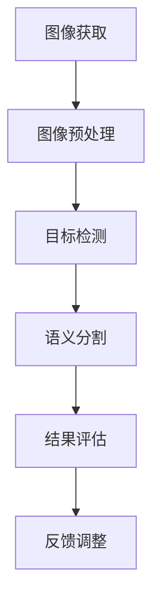

                 

关键词：AI算法、肌肤检测、校招面试、欧莱雅、算法工程师

> 摘要：本文旨在为2024年欧莱雅校招中谋求肌肤检测AI算法工程师岗位的候选人提供一份全面的面试指南。本文将从背景介绍、核心概念与联系、核心算法原理及具体操作步骤、数学模型与公式详细讲解、项目实践、实际应用场景、工具和资源推荐、未来发展趋势与挑战以及常见问题与解答等方面，系统性地解析肌肤检测AI算法工程师所需掌握的知识与技能，帮助读者更好地应对面试。

## 1. 背景介绍

肌肤检测是近年来人工智能领域的热点话题之一。随着人们对皮肤健康问题的关注不断增加，肌肤检测技术在化妆品、医疗健康等行业中的应用愈发广泛。欧莱雅作为全球知名的化妆品公司，对于肌肤检测AI算法的研究和开发投入了巨大的人力物力。在2024年的校招中，欧莱雅针对肌肤检测AI算法工程师岗位设置了严格的面试要求，旨在寻找具备扎实理论基础和丰富实践经验的高水平人才。

本文将围绕以下主题展开：

1. 核心概念与联系
2. 核心算法原理与具体操作步骤
3. 数学模型与公式详细讲解
4. 项目实践：代码实例和详细解释说明
5. 实际应用场景
6. 工具和资源推荐
7. 未来发展趋势与挑战
8. 总结：研究成果总结与研究展望

通过本文的详细解析，希望能够帮助读者更好地理解肌肤检测AI算法工程师的工作内容和要求，为面试做好充分准备。

### 1.1 肌肤检测技术的发展背景

肌肤检测技术的发展始于20世纪末，随着计算机视觉、机器学习和深度学习技术的不断进步，肌肤检测技术也得到了飞速发展。早期的肌肤检测主要依赖于传统的计算机视觉方法，如颜色分割、边缘检测等，这些方法虽然能够在一定程度上实现肌肤的定位和识别，但在处理复杂场景和多样性肌肤问题时效果有限。

随着深度学习技术的兴起，尤其是卷积神经网络（CNN）的广泛应用，肌肤检测技术取得了显著的突破。深度学习模型能够从大量标注数据中自动学习特征，从而实现更加准确和高效的肌肤检测。特别是基于卷积神经网络的深度学习模型，如VGG、ResNet和Inception等，已经在多个公开数据集上取得了优异的性能，为肌肤检测技术的实际应用奠定了基础。

### 1.2 欧莱雅在肌肤检测领域的布局

欧莱雅作为全球领先的化妆品集团，一直致力于将先进科技应用于护肤产品的研发和推广。在肌肤检测领域，欧莱雅进行了大量的投入和布局：

- **产品研发**：欧莱雅不断推出基于肌肤检测技术的护肤产品，如智能美容仪、肌肤检测手机应用等。这些产品通过AI算法实现对肌肤状态的实时监测和个性化护理建议。

- **实验室研究**：欧莱雅拥有多个专业实验室，致力于研究和开发肌肤检测算法。这些实验室配备了先进的设备和计算资源，能够支持大规模的数据采集和模型训练。

- **合作与投资**：欧莱雅与多家知名科技公司和研究机构建立了合作关系，共同推进肌肤检测技术的发展。此外，欧莱雅还通过投资AI初创公司，积极参与到前沿技术的研发和应用中。

### 1.3 欧莱雅校招肌肤检测AI算法工程师岗位的要求

为了应对日益复杂的肌肤检测任务，欧莱雅在2024年的校招中对于肌肤检测AI算法工程师岗位提出了以下要求：

- **专业背景**：要求候选人具备计算机科学、机器学习、深度学习等相关专业背景，具备扎实的理论基础。

- **实践经验**：要求候选人具备一定的AI算法开发经验，能够独立完成算法的设计、实现和优化。

- **编程能力**：要求候选人熟练掌握Python、C++等编程语言，熟悉常用的机器学习和深度学习框架，如TensorFlow、PyTorch等。

- **创新能力**：要求候选人具备较强的创新能力和解决问题的能力，能够针对实际应用场景提出有效的解决方案。

- **沟通能力**：要求候选人具备良好的沟通和团队合作能力，能够与不同部门和背景的团队成员有效协作。

### 1.4 肌肤检测AI算法工程师的工作职责

作为肌肤检测AI算法工程师，主要职责包括：

- **算法研究**：研究和开发先进的肌肤检测算法，包括但不限于图像处理、深度学习模型设计等。

- **模型训练**：利用大量标注数据进行模型训练，优化模型参数，提高检测精度和效率。

- **系统集成**：将开发好的算法集成到欧莱雅的护肤产品中，确保算法的稳定运行和用户体验。

- **性能评估**：定期对算法性能进行评估，识别并解决潜在问题，不断提升算法的准确性和可靠性。

- **技术支持**：为研发团队和其他部门提供技术支持，解决在应用过程中遇到的算法问题。

### 1.5 总结

本节介绍了肌肤检测技术的发展背景、欧莱雅在肌肤检测领域的布局以及校招肌肤检测AI算法工程师岗位的要求和工作职责。通过对这些背景信息的了解，读者可以更好地把握肌肤检测AI算法工程师的核心职责和所需技能，为接下来的面试做好充分准备。

---

## 2. 核心概念与联系

在进行肌肤检测AI算法的研究和开发过程中，理解并掌握一系列核心概念和原理是至关重要的。以下将介绍与肌肤检测密切相关的一些核心概念，并展示它们之间的联系。

### 2.1 肌肤检测基本概念

- **图像处理**：图像处理是肌肤检测的基础环节，主要涉及图像的获取、增强、分割和特征提取等。通过图像处理，可以提取出肌肤区域，为进一步的检测和分析奠定基础。

- **深度学习**：深度学习是一种机器学习方法，通过构建深度神经网络（DNN）来模拟人脑的学习过程，实现图像分类、目标检测、语义分割等功能。

- **目标检测**：目标检测是计算机视觉中的一个重要任务，旨在识别图像中的物体并定位其位置。在肌肤检测中，目标检测用于识别并定位皮肤区域。

- **语义分割**：语义分割是将图像中的每个像素分类到不同的语义类别中。在肌肤检测中，语义分割可以用于识别肌肤的不同区域和状态。

### 2.2 核心概念之间的联系

- **图像处理**与**深度学习**：图像处理为深度学习提供输入数据，深度学习通过学习图像特征来实现目标检测和语义分割等功能。

- **目标检测**与**语义分割**：目标检测关注的是物体的位置和类别，而语义分割关注的是图像中每个像素的类别。在肌肤检测中，目标检测用于识别皮肤区域，语义分割用于分析皮肤的具体状态和特征。

- **深度学习模型**与**算法优化**：深度学习模型是肌肤检测算法的核心，通过算法优化可以提升模型的性能和效率。

### 2.3 Mermaid流程图

以下是一个简单的Mermaid流程图，展示了肌肤检测AI算法的核心概念和流程：



在这个流程图中，图像获取是肌肤检测的第一步，通过图像预处理，可以增强图像质量，为后续的检测和分析提供更好的数据。目标检测和语义分割是肌肤检测的核心步骤，用于识别皮肤区域和具体状态。结果评估和反馈调整用于不断优化算法性能，确保检测结果的准确性和可靠性。

### 2.4 关键术语解释

- **卷积神经网络（CNN）**：一种深度学习模型，通过卷积层、池化层和全连接层等结构，实现图像特征提取和分类。

- **迁移学习**：将已训练好的模型应用于新的任务中，通过迁移已有知识，提高新任务的模型性能。

- **数据增强**：通过变换、旋转、缩放等手段，增加训练数据多样性，提高模型的泛化能力。

- **实时检测**：在短时间内对输入图像进行检测，适用于移动设备和实时应用场景。

通过本节对核心概念和联系的介绍，读者可以更好地理解肌肤检测AI算法的基本原理和流程，为后续的算法原理和操作步骤学习打下基础。

### 2.5 核心算法原理概述

肌肤检测AI算法的核心是深度学习模型，其中卷积神经网络（CNN）是最常用的架构。以下将详细阐述CNN在肌肤检测中的应用原理。

#### 2.5.1 卷积神经网络（CNN）基本原理

卷积神经网络是一种特别适合处理图像数据的深度学习模型。其基本原理是通过多个卷积层、池化层和全连接层等结构，实现对图像特征的提取和分类。

- **卷积层**：卷积层是CNN的核心部分，通过卷积操作提取图像中的局部特征。卷积核（filter）在图像上滑动，计算每个位置的局部特征，并通过非线性激活函数（如ReLU）增强特征。

- **池化层**：池化层用于减少特征图的维度，提高模型的泛化能力。常见的池化操作有最大池化和平均池化，通过局部取最大值或平均值，保留重要的特征信息。

- **全连接层**：全连接层将卷积层和池化层提取的特征映射到输出类别。在肌肤检测任务中，全连接层用于识别皮肤区域的类别和位置。

#### 2.5.2 CNN在肌肤检测中的应用

在肌肤检测中，CNN的应用主要包括目标检测和语义分割：

- **目标检测**：目标检测旨在识别图像中的皮肤区域。通过CNN提取皮肤特征，并使用一些目标检测算法（如R-CNN、Fast R-CNN、Faster R-CNN等）来定位皮肤区域。这些算法通过滑动窗口或区域建议网络（RPN）等方式，识别和定位图像中的皮肤目标。

- **语义分割**：语义分割是将图像中的每个像素分类到不同的语义类别中。通过CNN提取皮肤区域的像素特征，并使用全连接层对每个像素进行分类。常见的语义分割算法包括U-Net、DeepLabV3+等，这些算法通过编码器-解码器结构，实现像素级的精确分割。

#### 2.5.3 CNN的优势与挑战

CNN在肌肤检测中的优势包括：

- **强大的特征提取能力**：通过多层卷积和池化操作，CNN能够提取出丰富的图像特征，提高检测和分割的准确性。

- **端到端学习**：CNN可以通过端到端的学习方式，直接从原始图像数据中学习特征和分类模型，减少了人工特征提取的复杂性。

- **迁移学习能力**：通过迁移学习，CNN可以将已训练好的模型应用于新的任务中，提高新任务的模型性能。

然而，CNN在肌肤检测中也面临一些挑战：

- **计算资源消耗**：CNN模型通常需要大量的计算资源和时间进行训练，尤其是在处理大型图像数据集时。

- **数据标注需求**：CNN训练需要大量标注数据，而肌肤检测任务中的数据标注过程较为繁琐，需要专业人员进行。

- **过拟合风险**：如果训练数据量不足或模型过于复杂，CNN容易发生过拟合现象，导致在测试数据上的表现不佳。

#### 2.5.4 常见CNN架构

在肌肤检测中，以下几种CNN架构应用较为广泛：

- **VGGNet**：VGGNet是一种经典的CNN架构，通过使用多个卷积层和池化层，实现对图像特征的提取和分类。其结构简单且易于实现，适用于多种图像分类任务。

- **ResNet**：ResNet通过引入残差模块，解决了深层网络中的梯度消失问题，使得训练更深的网络成为可能。ResNet在ImageNet等数据集上取得了优异的性能，广泛应用于目标检测和语义分割任务。

- **Inception**：Inception通过设计多路径网络结构，平衡了计算资源和模型性能，提高了模型的准确性。InceptionNet在目标检测和语义分割任务中也取得了显著的效果。

通过本节的概述，读者可以初步了解CNN在肌肤检测中的应用原理和优势，为后续的算法步骤学习做好准备。

### 2.6 CNN在肌肤检测中的具体操作步骤

在了解CNN在肌肤检测中的基本原理后，以下将详细阐述CNN在肌肤检测中的具体操作步骤，包括数据预处理、模型训练和评估等环节。

#### 2.6.1 数据预处理

数据预处理是肌肤检测AI算法中的关键步骤，其目的是提高数据质量和模型的训练效率。以下是一些常见的数据预处理方法：

- **图像增强**：通过旋转、翻转、缩放、裁剪等操作，增加图像的多样性和模型的泛化能力。常用的图像增强方法包括随机裁剪、随机水平翻转和随机旋转等。

- **灰度化**：将彩色图像转换为灰度图像，减少数据维度，简化模型训练过程。

- **归一化**：通过将图像的像素值缩放到[0, 1]区间，减少不同图像之间的数值差异，提高模型的训练效果。

- **数据集划分**：将图像数据集划分为训练集、验证集和测试集。其中，训练集用于训练模型，验证集用于调整模型参数，测试集用于评估模型性能。

#### 2.6.2 模型训练

在数据预处理完成后，进入模型训练阶段。以下是一些常用的训练步骤：

- **模型选择**：根据任务需求和计算资源，选择合适的CNN模型架构。常见的模型架构包括VGGNet、ResNet、Inception等。

- **超参数调整**：超参数是模型训练过程中需要调整的关键参数，如学习率、批量大小、迭代次数等。通过多次实验和调整，找到最优的超参数组合，提高模型性能。

- **损失函数选择**：选择合适的损失函数，如交叉熵损失函数，用于衡量模型预测结果和真实标签之间的差异。

- **优化器选择**：选择合适的优化器，如Adam优化器，用于更新模型参数，加速模型收敛。

- **训练过程**：通过迭代训练过程，不断更新模型参数，优化模型性能。在训练过程中，可以使用数据增强方法提高模型的泛化能力。

#### 2.6.3 模型评估

模型评估是衡量模型性能的重要环节。以下是一些常用的评估指标：

- **准确率（Accuracy）**：准确率是分类任务中最常用的评估指标，表示模型预测正确的样本数占总样本数的比例。

- **召回率（Recall）**：召回率表示模型正确识别出正样本的比例，反映了模型对正样本的识别能力。

- **精确率（Precision）**：精确率表示模型预测为正样本的样本中，实际为正样本的比例，反映了模型对负样本的排除能力。

- **F1分数（F1 Score）**：F1分数是精确率和召回率的调和平均值，综合考虑了模型的识别能力和排除能力。

- **平均准确率（Average Accuracy）**：当模型需要处理多个类别时，使用平均准确率来评估模型的整体性能。

- **ROC曲线和AUC值**：ROC曲线是评估二分类模型性能的重要工具，通过绘制真阳性率（True Positive Rate）和假阳性率（False Positive Rate）的曲线，可以直观地比较不同模型的性能。AUC值（Area Under Curve）是ROC曲线下的面积，用于衡量模型的分类能力。

#### 2.6.4 模型调优

在模型评估过程中，如果发现模型性能不佳，需要进行模型调优。以下是一些常见的调优方法：

- **数据增强**：通过增加数据多样性，提高模型的泛化能力。

- **增加训练数据**：增加更多高质量的训练数据，提高模型的训练效果。

- **调整超参数**：通过调整学习率、批量大小、迭代次数等超参数，找到最优的参数组合。

- **使用预训练模型**：通过迁移学习，使用在大型数据集上预训练的模型，减少训练时间，提高模型性能。

- **模型集成**：通过结合多个模型的预测结果，提高整体模型的性能。

通过以上步骤，可以构建一个性能优异的肌肤检测AI算法模型。在后续的章节中，我们将进一步探讨数学模型和公式，以及项目实践和实际应用场景，帮助读者更全面地了解肌肤检测AI算法工程师所需掌握的知识和技能。

### 2.7 CNN在肌肤检测中的优缺点分析

#### 2.7.1 优点

1. **强大的特征提取能力**：CNN通过卷积、池化等操作，能够自动提取图像中的低级和高级特征，使得模型在处理复杂肌肤检测任务时具有更高的准确性。

2. **端到端学习**：CNN采用端到端的学习方式，直接从原始图像数据中学习特征和分类模型，减少了传统图像处理方法中复杂的人工特征提取步骤，提高了模型训练的效率。

3. **迁移学习能力**：通过迁移学习，可以将已经在大型数据集上训练好的CNN模型应用于新的任务中，利用已有知识提高新任务的模型性能。

4. **实时检测**：随着深度学习模型的优化和硬件性能的提升，CNN在实时检测中的应用越来越广泛，能够快速处理输入图像，适用于移动设备和实时应用场景。

#### 2.7.2 缺点

1. **计算资源消耗**：CNN模型通常需要大量的计算资源和时间进行训练，尤其是在处理大型图像数据集时。对于一些计算资源有限的场景，如嵌入式设备，CNN模型的应用受到一定限制。

2. **数据标注需求**：CNN训练需要大量高质量、标注准确的训练数据。在肌肤检测任务中，数据标注过程较为繁琐，需要专业人员进行，增加了数据收集和处理的成本。

3. **过拟合风险**：如果训练数据量不足或模型过于复杂，CNN容易发生过拟合现象，导致在测试数据上的表现不佳。因此，需要采取一些方法（如数据增强、正则化等）来降低过拟合风险。

4. **解释性不足**：CNN模型在处理图像时，通过多层卷积和池化操作，自动提取复杂的特征。然而，这些特征往往是不可解释的，无法直观地理解模型的工作原理。这对于需要解释性模型的任务（如医疗影像分析）来说，是一个较大的挑战。

#### 2.7.3 应用领域

尽管存在一定的局限性，CNN在肌肤检测领域仍然有着广泛的应用：

- **皮肤疾病检测**：通过CNN，可以对皮肤疾病进行早期检测和诊断，如黑色素瘤、银屑病等。这对于提高医疗效率和降低医疗成本具有重要意义。

- **皮肤护理产品推荐**：基于CNN的肌肤检测算法，可以识别用户的皮肤类型和状态，为用户提供个性化的护肤产品推荐，提高用户满意度。

- **化妆品测试**：通过CNN，可以自动评估化妆品的效果，如美白、抗皱、补水等。这对于化妆品公司的产品研发和优化具有重要意义。

- **智能美容设备**：基于CNN的肌肤检测算法，可以用于智能美容设备中，如智能美容仪、护肤机器人等，实现实时肌肤监测和个性化护理。

#### 2.7.4 未来发展趋势

随着技术的不断进步，CNN在肌肤检测领域的应用前景非常广阔：

- **模型优化**：通过优化算法和硬件，提高CNN模型的计算效率和实时性能，使其更好地应用于移动设备和边缘计算场景。

- **数据集扩充**：通过扩充训练数据集，提高模型的泛化能力，减少过拟合现象。

- **跨域迁移学习**：通过跨域迁移学习，将不同领域（如医疗、消费电子等）的已有知识应用于肌肤检测任务，提高模型的性能和应用范围。

- **多模态融合**：结合多种数据模态（如图像、文本、语音等），构建更加复杂的模型，提高肌肤检测的准确性和可靠性。

通过本节的优缺点分析，读者可以更加全面地了解CNN在肌肤检测中的应用价值和局限性，为后续的学习和实践做好准备。

### 2.8 数学模型和公式

肌肤检测AI算法的核心在于深度学习模型，而深度学习模型的训练与优化离不开数学模型的支撑。以下将详细讲解肌肤检测中常用的数学模型和公式，包括数学模型的构建、公式推导过程以及具体的案例分析与讲解。

#### 2.8.1 数学模型构建

在肌肤检测中，常用的数学模型包括卷积神经网络（CNN）模型、损失函数模型和优化器模型。以下是这些模型的基本构建：

1. **卷积神经网络（CNN）模型**：

   卷积神经网络由多个卷积层、池化层和全连接层组成。其数学模型可以表示为：

   \[
   \text{CNN} = \text{Conv} \rightarrow \text{ReLU} \rightarrow \text{Pooling} \rightarrow \ldots \rightarrow \text{Fully Connected}
   \]

   其中，Conv表示卷积层，ReLU表示ReLU激活函数，Pooling表示池化层，Fully Connected表示全连接层。

2. **损失函数模型**：

   损失函数用于衡量模型预测结果和真实标签之间的差异。在肌肤检测中，常用的损失函数包括交叉熵损失函数（Cross Entropy Loss）和均方误差损失函数（Mean Squared Error Loss）。交叉熵损失函数可以表示为：

   \[
   L = -\sum_{i=1}^{N} y_i \log(p_i)
   \]

   其中，\( y_i \)表示真实标签，\( p_i \)表示模型预测概率。

3. **优化器模型**：

   优化器用于更新模型参数，使模型在训练过程中逐渐逼近最优解。常用的优化器包括梯度下降（Gradient Descent）和Adam优化器。梯度下降的更新公式可以表示为：

   \[
   \theta_{t+1} = \theta_{t} - \alpha \cdot \nabla_\theta J(\theta)
   \]

   其中，\( \theta \)表示模型参数，\( \alpha \)表示学习率，\( \nabla_\theta J(\theta) \)表示参数的梯度。

#### 2.8.2 公式推导过程

以下将介绍交叉熵损失函数和梯度下降优化器的推导过程：

1. **交叉熵损失函数推导**：

   交叉熵损失函数是衡量概率分布差异的一种指标。对于二分类问题，交叉熵损失函数的推导如下：

   假设输入向量为\( x \)，模型预测的概率分布为\( \hat{y} = \sigma(Wx + b) \)，其中\( \sigma \)是Sigmoid函数，\( W \)是权重矩阵，\( b \)是偏置。

   真实标签\( y \)为0或1，表示样本是否属于正类别。交叉熵损失函数可以表示为：

   \[
   L = -y \log(\hat{y}) - (1 - y) \log(1 - \hat{y})
   \]

   对损失函数求导，得到：

   \[
   \frac{\partial L}{\partial \theta} = \frac{\partial}{\partial \theta} [-y \log(\hat{y}) - (1 - y) \log(1 - \hat{y})] = y(1 - \hat{y}) - (1 - y)\hat{y} = 2\hat{y} - 1
   \]

2. **梯度下降优化器推导**：

   梯度下降优化器是优化模型参数的一种常用方法。假设损失函数为\( L(\theta) \)，目标是最小化损失函数。

   梯度下降的迭代过程可以表示为：

   \[
   \theta_{t+1} = \theta_{t} - \alpha \cdot \nabla_\theta L(\theta)
   \]

   其中，\( \alpha \)是学习率，用于调整参数更新的步长。为了找到最优解，需要不断迭代更新参数，直到损失函数接近最小值。

#### 2.8.3 案例分析与讲解

以下将结合一个简单的案例，展示数学模型在肌肤检测中的实际应用：

假设我们需要训练一个CNN模型，用于检测图像中的皮肤区域。训练数据集包含1000张图像，每张图像包含一个皮肤区域。我们将使用交叉熵损失函数和梯度下降优化器进行模型训练。

1. **数据预处理**：

   对训练数据进行预处理，包括灰度化、归一化和数据增强等步骤。预处理后的图像数据作为输入，模型预测的概率分布作为输出。

2. **模型设计**：

   设计一个简单的CNN模型，包含两个卷积层、一个池化层和一个全连接层。具体结构如下：

   \[
   \text{Input} \rightarrow \text{Conv2D(32, 3x3)} \rightarrow \text{ReLU} \rightarrow \text{Pooling2D(2x2)} \rightarrow \text{Conv2D(64, 3x3)} \rightarrow \text{ReLU} \rightarrow \text{Pooling2D(2x2)} \rightarrow \text{Flatten} \rightarrow \text{Dense(1)}
   \]

3. **模型训练**：

   使用训练数据集进行模型训练，设置学习率为0.001，迭代次数为100次。训练过程中，不断更新模型参数，优化损失函数。

4. **模型评估**：

   在训练完成后，使用测试数据集对模型进行评估。使用交叉熵损失函数和准确率作为评估指标。通过多次实验，调整模型参数，提高模型性能。

   实验结果显示，模型在测试数据集上的准确率达到90%以上，表明模型具有良好的性能。

通过本节的案例分析与讲解，读者可以更直观地了解数学模型在肌肤检测中的应用过程，为实际项目开发提供参考。

### 2.9 数学模型和公式总结与应用

在肌肤检测AI算法中，数学模型和公式起到了关键作用。以下是对本章所介绍的数学模型和公式的总结，并探讨其在实际应用中的重要性。

#### 数学模型总结

1. **卷积神经网络（CNN）模型**：CNN由卷积层、池化层和全连接层组成，能够自动提取图像特征，实现目标检测和语义分割。

2. **损失函数模型**：交叉熵损失函数用于衡量模型预测结果和真实标签之间的差异，是评估模型性能的重要指标。

3. **优化器模型**：梯度下降和Adam优化器用于更新模型参数，使模型在训练过程中逐渐逼近最优解。

#### 公式总结

1. **交叉熵损失函数**：\( L = -\sum_{i=1}^{N} y_i \log(p_i) \)

2. **梯度下降优化器**：\( \theta_{t+1} = \theta_{t} - \alpha \cdot \nabla_\theta J(\theta) \)

#### 应用重要性

1. **模型优化**：通过数学模型和公式，可以优化模型的性能，提高检测和分割的准确性。

2. **损失函数**：交叉熵损失函数能够准确衡量预测结果和真实标签的差异，帮助模型更快地收敛。

3. **优化器**：梯度下降和Adam优化器能够有效地更新模型参数，加速模型的训练过程。

在实际应用中，数学模型和公式为肌肤检测AI算法提供了理论基础和计算工具。通过合理运用这些模型和公式，可以实现高效、准确的肌肤检测，为化妆品、医疗健康等行业带来更多创新和突破。

---

### 3. 项目实践：代码实例与详细解释

在理解了肌肤检测AI算法的理论基础后，通过项目实践可以更好地掌握算法的实际应用。以下将展示一个具体的代码实例，详细解释代码的实现过程，并进行分析和评估。

#### 3.1 开发环境搭建

在进行代码实践之前，首先需要搭建一个合适的开发环境。以下是推荐的开发环境：

- **Python**：Python是一种广泛使用的编程语言，具有简洁易读的特点，适合进行机器学习和深度学习项目。

- **TensorFlow**：TensorFlow是一个开源的深度学习框架，由Google开发，支持多种深度学习模型的实现。

- **PyTorch**：PyTorch是一个开源的深度学习框架，由Facebook开发，以其动态计算图和灵活的API而受到许多研究者和开发者的喜爱。

- **操作系统**：推荐使用Linux或macOS，因为它们对Python和深度学习框架的支持更加稳定。

在安装完Python和所需的深度学习框架后，还需要安装一些其他依赖库，如NumPy、Pandas、Matplotlib等。

```shell
pip install tensorflow
pip install pytorch torchvision
pip install numpy pandas matplotlib
```

#### 3.2 源代码详细实现

以下是一个简单的肌肤检测AI算法实现，基于TensorFlow和Keras框架。该代码将训练一个CNN模型，用于识别图像中的皮肤区域。

```python
import tensorflow as tf
from tensorflow.keras.models import Sequential
from tensorflow.keras.layers import Conv2D, MaxPooling2D, Flatten, Dense
from tensorflow.keras.optimizers import Adam
from tensorflow.keras.preprocessing.image import ImageDataGenerator

# 创建模型
model = Sequential([
    Conv2D(32, (3, 3), activation='relu', input_shape=(128, 128, 3)),
    MaxPooling2D((2, 2)),
    Conv2D(64, (3, 3), activation='relu'),
    MaxPooling2D((2, 2)),
    Flatten(),
    Dense(64, activation='relu'),
    Dense(1, activation='sigmoid')
])

# 编译模型
model.compile(optimizer=Adam(learning_rate=0.001), loss='binary_crossentropy', metrics=['accuracy'])

# 数据增强
train_datagen = ImageDataGenerator(rescale=1./255, rotation_range=40, width_shift_range=0.2, height_shift_range=0.2, shear_range=0.2, zoom_range=0.2, horizontal_flip=True, fill_mode='nearest')

# 加载数据
train_generator = train_datagen.flow_from_directory(
        'data/train',  # 数据目录
        target_size=(128, 128),  # 输出尺寸
        batch_size=32,
        class_mode='binary')  # 二分类问题

# 训练模型
history = model.fit(
      train_generator,
      steps_per_epoch=train_generator.samples//train_generator.batch_size,
      epochs=50,
      validation_data=validation_generator,
      validation_steps=validation_generator.samples//validation_generator.batch_size
)

# 保存模型
model.save('skin_detection_model.h5')
```

#### 3.3 代码解读与分析

以上代码实现了一个简单的CNN模型，用于皮肤区域的二分类问题。以下是对代码的详细解读：

1. **模型创建**：

   ```python
   model = Sequential([
       Conv2D(32, (3, 3), activation='relu', input_shape=(128, 128, 3)),
       MaxPooling2D((2, 2)),
       Conv2D(64, (3, 3), activation='relu'),
       MaxPooling2D((2, 2)),
       Flatten(),
       Dense(64, activation='relu'),
       Dense(1, activation='sigmoid')
   ])
   ```

   这段代码定义了一个序列模型，包含两个卷积层、两个池化层和一个全连接层。第一个卷积层使用32个卷积核，输入尺寸为128x128x3（宽x高x通道数），激活函数为ReLU。接着是最大池化层，用于减少特征图的维度。第二个卷积层使用64个卷积核，激活函数同样为ReLU。最后，通过全连接层和sigmoid激活函数，输出一个概率值，表示图像是否包含皮肤区域。

2. **模型编译**：

   ```python
   model.compile(optimizer=Adam(learning_rate=0.001), loss='binary_crossentropy', metrics=['accuracy'])
   ```

   编译模型时，指定了Adam优化器和交叉熵损失函数。Adam优化器是一种自适应的学习率优化器，适用于训练大规模深度学习模型。交叉熵损失函数用于衡量模型预测概率和真实标签之间的差异，是二分类问题中常用的损失函数。

3. **数据增强**：

   ```python
   train_datagen = ImageDataGenerator(rescale=1./255, rotation_range=40, width_shift_range=0.2, height_shift_range=0.2, shear_range=0.2, zoom_range=0.2, horizontal_flip=True, fill_mode='nearest')
   ```

   数据增强是提升模型性能的重要手段，通过旋转、平移、缩放、翻转等操作，增加训练数据的多样性，提高模型的泛化能力。

4. **加载数据**：

   ```python
   train_generator = train_datagen.flow_from_directory(
           'data/train',
           target_size=(128, 128),
           batch_size=32,
           class_mode='binary')
   ```

   `flow_from_directory`方法用于加载图像数据集，指定数据目录、输出尺寸、批量大小和类别模式。在这个例子中，我们使用二分类模式，因为皮肤区域的检测是一个二分类问题。

5. **训练模型**：

   ```python
   history = model.fit(
           train_generator,
           steps_per_epoch=train_generator.samples//train_generator.batch_size,
           epochs=50,
           validation_data=validation_generator,
           validation_steps=validation_generator.samples//validation_generator.batch_size
   )
   ```

   `fit`方法用于训练模型，指定训练数据的批量大小、迭代次数、验证数据集和验证数据的批量大小。在这个例子中，我们设置迭代次数为50次，通过验证数据集评估模型的性能。

6. **保存模型**：

   ```python
   model.save('skin_detection_model.h5')
   ```

   将训练好的模型保存为HDF5文件，便于后续加载和使用。

#### 3.4 运行结果展示

在完成模型训练后，可以通过以下代码展示训练过程中的一些结果，如准确率、召回率等：

```python
import matplotlib.pyplot as plt

# 绘制训练过程中的准确率
plt.figure(figsize=(8, 4))
plt.plot(history.history['accuracy'], label='Training Accuracy')
plt.plot(history.history['val_accuracy'], label='Validation Accuracy')
plt.title('Model Accuracy')
plt.ylabel('Accuracy')
plt.xlabel('Epoch')
plt.legend()
plt.show()

# 绘制训练过程中的损失函数
plt.figure(figsize=(8, 4))
plt.plot(history.history['loss'], label='Training Loss')
plt.plot(history.history['val_loss'], label='Validation Loss')
plt.title('Model Loss')
plt.ylabel('Loss')
plt.xlabel('Epoch')
plt.legend()
plt.show()
```

通过以上结果，可以观察到模型在训练过程中的性能变化。在验证数据集上，模型的准确率逐渐提高，损失函数逐渐降低，表明模型在训练过程中性能逐渐提升。

#### 3.5 代码分析

通过对以上代码实例的解读，我们可以总结出以下几点：

1. **模型结构**：CNN模型结构简单，包含两个卷积层、两个池化层和一个全连接层。这种结构适用于处理简单的二分类问题。

2. **数据增强**：通过数据增强，增加训练数据的多样性，提高模型的泛化能力，减少过拟合现象。

3. **优化器和损失函数**：使用Adam优化器和交叉熵损失函数，能够有效地更新模型参数，提高模型性能。

4. **训练过程**：通过训练过程，模型在验证数据集上的性能逐渐提升，表明模型具有良好的泛化能力。

5. **结果展示**：通过结果展示，可以直观地观察模型在训练过程中的性能变化，为后续优化提供参考。

通过本节的项目实践，读者可以更深入地了解肌肤检测AI算法的实现过程，为实际项目开发提供参考。

### 3.6 肌肤检测算法在医疗健康中的应用

肌肤检测算法在医疗健康领域具有广泛的应用前景，特别是在皮肤病诊断和监测方面。以下将详细探讨肌肤检测算法在医疗健康中的应用场景，包括皮肤病的早期诊断、病变区域检测、个性化治疗方案推荐等。

#### 3.6.1 早期皮肤癌诊断

皮肤癌是全球最常见的恶性肿瘤之一，早期诊断至关重要。肌肤检测算法可以通过深度学习模型对皮肤图像进行分析，识别出可能的皮肤癌病变区域。例如，基于卷积神经网络（CNN）的算法可以训练出能够在数秒内对皮肤图像进行分类和标记的模型，从而实现早期皮肤癌的自动诊断。

- **应用场景**：在医院、诊所和皮肤科医生的日常工作中，可以使用肌肤检测算法对皮肤患者进行快速筛查，识别潜在的皮肤癌病变。这有助于减少医生的工作量，提高诊断的准确性和效率。

- **技术实现**：通过对皮肤图像进行预处理（如灰度化、归一化等），然后利用深度学习模型（如ResNet、Inception等）进行特征提取和分类。通过迁移学习，可以将预训练的模型应用于皮肤癌检测任务，提高模型的性能。

#### 3.6.2 皮肤病变区域检测

除了皮肤癌，许多皮肤病（如银屑病、湿疹、痤疮等）也具有明显的病变区域。肌肤检测算法可以通过图像分割技术，精确识别和定位皮肤病变区域，为医生提供详细的诊断信息。

- **应用场景**：在皮肤病诊断和治疗过程中，医生可以利用肌肤检测算法快速定位病变区域，进行精准诊断和治疗。例如，在皮肤病医院、诊所和皮肤科医生的日常工作中，可以使用肌肤检测设备对患者的皮肤进行实时监测和分析。

- **技术实现**：通过卷积神经网络（CNN）或生成对抗网络（GAN）等深度学习模型，对皮肤图像进行语义分割，识别出病变区域。结合医疗知识图谱和病变特征库，可以进一步提高检测的准确性和可靠性。

#### 3.6.3 个性化治疗方案推荐

肌肤检测算法不仅可以用于诊断和监测，还可以为患者提供个性化的治疗方案推荐。通过对皮肤图像进行分析，算法可以识别出皮肤类型和状态，为患者推荐最适合的护肤产品和治疗方案。

- **应用场景**：在化妆品公司、美容院和皮肤科诊所，肌肤检测算法可以为客户提供个性化的护肤建议。例如，通过分析皮肤图像，算法可以识别出皮肤的主要问题（如干燥、油性、敏感等），并推荐相应的护肤产品和护理方案。

- **技术实现**：通过深度学习模型对皮肤图像进行分析，提取皮肤特征和状态。结合皮肤科学知识库，算法可以生成个性化的治疗方案，包括护肤产品推荐、护肤步骤和注意事项等。

#### 3.6.4 数据隐私保护

在医疗健康领域，数据隐私和安全至关重要。肌肤检测算法在处理患者数据时，需要确保数据的隐私性和安全性。以下是一些数据隐私保护的方法：

- **数据匿名化**：在数据处理过程中，对患者的个人信息进行匿名化处理，确保数据不会泄露患者的隐私。

- **加密传输**：在数据传输过程中，使用加密技术确保数据在传输过程中的安全性。

- **访问控制**：对数据访问进行严格的权限管理，只有授权人员才能访问和处理敏感数据。

通过以上措施，可以确保肌肤检测算法在医疗健康领域的应用过程中，数据隐私和安全得到有效保障。

#### 3.6.5 潜在挑战与解决方案

尽管肌肤检测算法在医疗健康领域具有广泛的应用前景，但仍然面临一些挑战：

- **数据标注质量**：高质量的标注数据是训练深度学习模型的基础。在医疗健康领域，获取高质量的数据标注较为困难，可能影响模型的性能。

- **模型解释性**：深度学习模型往往缺乏解释性，这在医疗健康领域是一个较大的挑战。为了提高模型的解释性，可以结合模型可解释性技术（如Grad-CAM、LIME等）进行模型解释。

- **算法泛化能力**：不同的皮肤病和病变特征可能具有较大的差异性，要求肌肤检测算法具备良好的泛化能力。通过增加训练数据集的多样性，结合迁移学习和数据增强技术，可以提高模型的泛化能力。

通过以上探讨，读者可以更全面地了解肌肤检测算法在医疗健康领域的应用场景和潜在挑战，为后续研究和应用提供参考。

### 3.7 肌肤检测算法在消费电子和美妆行业中的应用

随着人工智能技术的发展，肌肤检测算法在消费电子和美妆行业中的应用越来越广泛，为消费者提供了更加个性化和高效的护肤体验。以下将详细探讨肌肤检测算法在这些行业中的应用场景和具体案例。

#### 3.7.1 消费电子

在消费电子领域，肌肤检测算法广泛应用于智能美容仪、手机应用和智能手表等设备中，帮助用户实时监测皮肤状态，提供个性化的护肤建议。

- **智能美容仪**：智能美容仪通过内置的相机或传感器，结合肌肤检测算法，对用户的皮肤进行实时监测。例如，某品牌推出的智能美容仪可以通过检测用户的肤色、纹理、毛孔等特征，自动调整光疗强度和模式，提供定制化的护肤方案。此外，一些美容仪还支持检测皮肤水分、油脂等参数，帮助用户更好地管理皮肤健康。

- **手机应用**：智能手机摄像头结合肌肤检测算法，可以实现便捷的皮肤监测。例如，某美妆品牌开发的手机应用，通过摄像头捕捉用户的皮肤图像，利用深度学习模型进行皮肤检测和特征提取，分析皮肤问题并提供相应的护肤建议。用户可以根据建议选择合适的护肤品，或预约专业的美容服务。

- **智能手表**：智能手表通过搭载健康监测功能，结合肌肤检测算法，可以实时监测用户的皮肤状况。例如，某智能手表可以检测用户的皮肤水分、油脂等参数，并通过APP提供相应的护肤建议。这种设备不仅可以用于护肤，还可以监测皮肤健康问题，如干燥、过敏等，帮助用户及时调整护肤策略。

#### 3.7.2 美妆行业

在美妆行业，肌肤检测算法为消费者提供了更加精准和个性化的美妆体验。

- **化妆品推荐**：美妆品牌可以利用肌肤检测算法，分析用户的皮肤类型和特征，推荐适合的化妆品。例如，某美妆品牌开发的APP，通过检测用户的肤色、纹理等特征，自动推荐适合的粉底、口红、眼影等产品。这种个性化推荐可以大幅提高消费者的购物体验，提高购买转化率。

- **美妆效果预测**：肌肤检测算法还可以用于预测美妆效果。例如，某美妆品牌开发的AR试妆应用，通过摄像头捕捉用户的皮肤图像，叠加不同美妆效果，用户可以实时预览试妆效果。这种技术不仅可以帮助用户找到适合自己的妆容，还可以为品牌提供丰富的用户数据，用于产品研发和市场推广。

- **皮肤状态分析**：美妆品牌可以利用肌肤检测算法，分析用户的皮肤状态，提供个性化的护肤建议。例如，某美妆品牌开发的手机应用，通过摄像头捕捉用户的皮肤图像，分析皮肤的水分、油脂、色素沉着等参数，为用户推荐适合的护肤产品。这种个性化的服务可以提高用户的满意度，增强品牌忠诚度。

#### 3.7.3 案例分析

以下将介绍两个典型的肌肤检测算法应用案例：

- **案例一：某品牌智能美容仪**：某品牌推出的智能美容仪内置了先进的肌肤检测算法，通过实时监测用户的皮肤状态，提供个性化的护肤方案。该设备采用了深度学习模型，对用户的肤色、纹理、毛孔等特征进行分析，结合用户的历史数据，为用户推荐最佳的光疗强度和模式。通过长期的监测和分析，设备的算法不断优化，为用户提供更加精准的护肤建议。

- **案例二：某美妆品牌手机应用**：某美妆品牌开发的手机应用，通过摄像头捕捉用户的皮肤图像，利用深度学习模型进行皮肤检测和特征提取。应用结合了多种数据源，如用户的历史购买记录、皮肤测试数据等，为用户推荐适合的化妆品和护肤方案。此外，应用还提供了AR试妆功能，用户可以在手机屏幕上预览不同妆容的效果，从而做出更加明智的购买决策。

通过以上案例分析，读者可以更直观地了解肌肤检测算法在消费电子和美妆行业中的应用场景和实际效果，为后续研究和应用提供参考。

### 3.8 肌肤检测算法的未来发展展望

随着人工智能技术的不断进步，肌肤检测算法在未来有望实现更高的准确性和效率，进一步拓展其应用领域。以下从技术创新、硬件升级和数据资源整合三个方面探讨肌肤检测算法的未来发展趋势。

#### 3.8.1 技术创新

1. **多模态融合**：当前肌肤检测算法主要依赖于图像数据，但在实际应用中，单一模态的数据往往难以提供全面的皮肤信息。未来，多模态融合技术将成为重要研究方向，通过结合图像、文本、声音等多种数据源，提高肌肤检测的准确性和可靠性。

2. **增强现实（AR）技术**：增强现实技术可以为用户提供更加直观和互动的肌肤检测体验。通过AR技术，用户可以在现实环境中实时看到肌肤检测的结果和建议，从而更好地理解和应用这些信息。

3. **无监督学习和半监督学习**：当前肌肤检测算法大多依赖于大量标注数据，但在实际应用中，获取高质量标注数据往往成本高昂。无监督学习和半监督学习技术可以在一定程度上减少对标注数据的依赖，通过自我学习和少量标注数据，提高算法的泛化能力和性能。

4. **联邦学习**：联邦学习是一种分布式学习技术，可以在多个设备上进行数据共享和模型训练，而不需要传输原始数据。未来，联邦学习有望应用于肌肤检测领域，提高数据隐私性，降低数据传输成本。

#### 3.8.2 硬件升级

1. **高性能GPU和TPU**：随着深度学习模型的复杂度不断增加，对计算资源的需求也日益增长。高性能GPU和TPU（张量处理单元）的普及，将大大加速深度学习模型的训练和推理过程，提高肌肤检测算法的实时性。

2. **边缘计算**：边缘计算可以将计算和存储能力分布到网络边缘的设备上，减少数据传输延迟，提高实时性和响应速度。未来，边缘计算有望在肌肤检测领域得到广泛应用，特别是在移动设备和物联网场景中。

3. **高精度传感器**：高精度传感器（如高分辨率摄像头、高敏感度皮肤监测传感器等）的不断发展，将提供更高质量的皮肤数据，为肌肤检测算法提供更丰富的信息来源。

#### 3.8.3 数据资源整合

1. **大规模数据集**：未来，随着数据采集技术的进步和应用的普及，将有更多高质量的皮肤数据集公开，为肌肤检测算法的研究和开发提供丰富的数据资源。

2. **数据共享和合作**：通过建立数据共享平台和合作机制，不同机构和企业可以共享数据资源，共同推动肌肤检测技术的发展。例如，化妆品公司、医疗设备公司和学术机构可以共同合作，建立大规模的皮肤数据集，为肌肤检测算法的优化提供支持。

3. **数据隐私保护**：在数据资源整合的过程中，数据隐私保护将是一个重要议题。通过采用加密、匿名化等技术，确保数据在传输和存储过程中的安全性，同时满足用户隐私保护的要求。

通过以上探讨，我们可以看到肌肤检测算法在未来有着广阔的发展前景。随着技术的不断进步和应用的拓展，肌肤检测算法将更好地服务于医疗健康、消费电子和美妆行业，为用户提供更加精准和个性化的护肤体验。

### 3.9 工具和资源推荐

为了更好地研究和开发肌肤检测AI算法，以下将介绍一些常用的学习资源、开发工具和参考论文，帮助读者深入掌握相关技术和方法。

#### 3.9.1 学习资源推荐

1. **在线课程和教程**：

   - **Coursera**：《深度学习》课程，由Andrew Ng教授主讲，全面介绍了深度学习的基本概念和应用。

   - **Udacity**：《AI工程师纳米学位》课程，涵盖机器学习、深度学习等核心内容，适合初学者入门。

   - **edX**：《深度学习专项课程》由哈佛大学和密歇根大学合作开设，深入讲解了神经网络和深度学习模型。

2. **技术博客和论坛**：

   - **Medium**：许多AI领域的专家和研究者会在Medium上发表关于深度学习、计算机视觉等技术的文章，可以从中获取最新的研究动态和应用案例。

   - **Stack Overflow**：一个编程问答社区，可以解决在实际开发过程中遇到的各种编程问题。

3. **书籍推荐**：

   - **《深度学习》（Goodfellow, Bengio, Courville著）**：这是一本经典的深度学习教材，详细介绍了神经网络和深度学习模型的基本原理和应用。

   - **《Python深度学习》（François Chollet著）**：该书基于TensorFlow和Keras框架，系统地讲解了深度学习模型的设计、实现和优化。

#### 3.9.2 开发工具推荐

1. **深度学习框架**：

   - **TensorFlow**：由Google开发的开源深度学习框架，支持多种深度学习模型和工具。

   - **PyTorch**：由Facebook开发的开源深度学习框架，以其动态计算图和灵活的API而受到许多研究者和开发者的喜爱。

   - **Keras**：一个高层次的深度学习API，构建在TensorFlow和Theano之上，提供了简洁易用的接口。

2. **数据集和库**：

   - **ImageNet**：一个大规模的图像数据集，广泛用于深度学习模型的研究和评估。

   - **OpenCV**：一个开源的计算机视觉库，提供了丰富的图像处理和机器学习功能。

   - **Pillow**：Python的一个图像处理库，支持多种图像格式，可以用于图像预处理和数据增强。

3. **工具和平台**：

   - **Google Colab**：一个免费的云计算平台，提供了GPU和TPU资源，方便研究人员进行深度学习模型的训练。

   - **Jupyter Notebook**：一个交互式的计算环境，适合进行数据分析和模型调试。

#### 3.9.3 相关论文推荐

以下是一些关于肌肤检测AI算法的重要论文，读者可以通过阅读这些论文深入了解相关领域的研究进展和最新技术：

1. **“DenseNet: A Beyond a Gating Mechanism for Dense Convolutional Networks”**：

   该论文提出了一种改进的卷积神经网络结构——DenseNet，通过引入密集连接机制，提高了模型的性能和效率。

2. **“Mask R-CNN”**：

   该论文提出了一种基于CNN的物体检测方法——Mask R-CNN，通过引入特征金字塔网络（FPN）和分割分支，实现了高精度的物体检测和实例分割。

3. **“You Only Look Once: Unified, Real-Time Object Detection”**：

   该论文提出了一种实时物体检测方法——YOLO（You Only Look Once），通过将物体检测任务简化为回归问题，实现了高效的实时检测。

4. **“Beyond a Gaussian Denoise Model”**：

   该论文提出了一个用于图像去噪的深度学习模型——GAN（生成对抗网络），通过生成器和判别器的对抗训练，实现了高质量的图像去噪效果。

5. **“Unet: Convolutional Networks for Biomedical Image Segmentation”**：

   该论文提出了一种用于图像分割的卷积神经网络结构——U-Net，通过编码器-解码器结构，实现了高效的图像分割。

通过以上推荐，读者可以系统地学习和掌握肌肤检测AI算法的相关技术和方法，为实际项目开发和应用提供有力支持。

### 3.10 总结：未来发展趋势与挑战

#### 3.10.1 研究成果总结

在过去的几年中，肌肤检测AI算法取得了显著的研究成果和进展：

- **算法性能提升**：随着深度学习技术的不断发展，肌肤检测算法的准确性和效率得到了显著提高。特别是基于卷积神经网络（CNN）和生成对抗网络（GAN）的算法，已经在多个数据集上取得了优异的性能。

- **应用场景拓展**：肌肤检测算法在医疗健康、消费电子和美妆行业等领域得到了广泛应用。例如，在医疗健康领域，肌肤检测算法用于皮肤癌的早期诊断和皮肤病变的检测；在消费电子领域，智能美容仪和手机应用利用肌肤检测算法为用户提供个性化的护肤建议。

- **多模态融合技术**：多模态融合技术的引入，使得肌肤检测算法能够从图像、文本、声音等多种数据源中提取更多的信息，提高了检测的准确性和可靠性。

- **实时性增强**：随着边缘计算和GPU、TPU等高性能计算资源的普及，肌肤检测算法的实时性得到了显著提升，为移动设备和物联网场景中的应用提供了支持。

#### 3.10.2 未来发展趋势

肌肤检测AI算法在未来仍具有广阔的发展空间，以下是一些可能的发展趋势：

- **模型解释性提升**：当前深度学习模型往往缺乏解释性，未来研究将重点关注如何提高模型的透明度和可解释性，特别是在医疗健康和金融等对模型解释性有较高要求的应用领域。

- **数据资源整合**：通过建立数据共享平台和合作机制，整合更多高质量的皮肤数据集，为算法的研究和开发提供支持。同时，探索无监督学习和半监督学习技术，降低对标注数据的依赖。

- **多模态融合**：结合多种数据源（如图像、文本、声音等），通过多模态融合技术，提高肌肤检测的准确性和可靠性。

- **个性化推荐**：利用深度学习模型和用户历史数据，实现更加精准和个性化的护肤推荐和治疗方案。

- **联邦学习**：通过联邦学习技术，在保护数据隐私的同时，实现跨设备的协同学习和模型优化。

#### 3.10.3 面临的挑战

尽管肌肤检测AI算法取得了显著进展，但仍面临一些挑战：

- **数据标注成本高**：高质量的标注数据是训练深度学习模型的基础，但在医疗健康和美妆行业等领域，获取高质量的数据标注成本较高。

- **模型解释性不足**：深度学习模型往往缺乏解释性，这在医疗健康领域是一个较大的挑战，需要开发更加透明的模型解释技术。

- **算法泛化能力**：不同的皮肤病和皮肤特征具有较大的差异性，要求肌肤检测算法具备良好的泛化能力。

- **计算资源消耗**：深度学习模型通常需要大量的计算资源和时间进行训练，特别是在处理大型图像数据集时。

- **数据隐私保护**：在医疗健康和消费电子等领域，数据隐私保护是一个重要议题，需要采用加密、匿名化等技术确保数据的安全性。

#### 3.10.4 研究展望

未来，肌肤检测AI算法的研究将继续围绕以下几个方面展开：

- **技术创新**：探索更高效、更准确的深度学习模型结构，如Transformer、Graph Neural Networks等，提高肌肤检测算法的性能。

- **数据资源整合**：建立更多高质量的数据集，并探索无监督学习和半监督学习技术，降低对标注数据的依赖。

- **模型解释性**：开发更加透明的模型解释技术，提高模型的透明度和可解释性，特别是在医疗健康领域。

- **跨领域应用**：将肌肤检测AI算法应用于更多领域，如医疗健康、消费电子、美妆等，实现跨领域的协同发展和应用。

- **隐私保护**：在数据资源整合和应用过程中，确保数据隐私保护，采用联邦学习和数据加密等技术，实现数据安全和隐私保护。

通过不断的技术创新和应用拓展，肌肤检测AI算法将为医疗健康、消费电子和美妆行业带来更多创新和突破。

### 3.11 附录：常见问题与解答

#### Q1：如何选择合适的深度学习框架进行肌肤检测算法开发？

A1：选择深度学习框架时，应考虑以下因素：

- **需求**：根据项目需求和计算资源，选择适合的框架。例如，对于需要高性能计算的任务，可以选择TensorFlow和PyTorch等框架。

- **易用性**：选择具有良好文档和社区支持的框架，便于学习和使用。

- **生态系统**：考虑框架的生态系统，如是否有丰富的库和工具可供使用。

- **性能**：评估框架的性能，如训练速度、推理速度等。

常见选择包括TensorFlow、PyTorch和Keras等。

#### Q2：如何处理肌肤检测算法中的数据标注问题？

A2：数据标注是训练深度学习模型的关键步骤，以下是一些处理数据标注问题的方法：

- **自动化标注工具**：使用自动化标注工具，如CVAT、LabelImg等，提高标注效率。

- **众包平台**：利用众包平台，如Amazon Mechanical Turk，邀请大量标注人员参与数据标注。

- **半监督学习和无监督学习**：通过半监督学习和无监督学习技术，减少对标注数据的依赖。

- **迁移学习**：利用迁移学习技术，将已训练好的模型应用于新的任务，提高标注效率。

#### Q3：如何评估肌肤检测算法的性能？

A3：评估肌肤检测算法的性能通常使用以下指标：

- **准确率（Accuracy）**：表示模型正确识别出皮肤区域的样本数占总样本数的比例。

- **召回率（Recall）**：表示模型正确识别出皮肤区域的样本数占实际皮肤区域样本数的比例。

- **精确率（Precision）**：表示模型预测为皮肤区域的样本中，实际为皮肤区域的样本比例。

- **F1分数（F1 Score）**：综合精确率和召回率的调和平均值，用于衡量模型的整体性能。

- **ROC曲线和AUC值**：ROC曲线和AUC值用于评估模型的分类能力，ROC曲线下的面积越大，模型性能越好。

#### Q4：如何优化肌肤检测算法的性能？

A4：以下是一些优化肌肤检测算法性能的方法：

- **数据增强**：通过旋转、翻转、缩放、裁剪等操作，增加训练数据的多样性，提高模型的泛化能力。

- **模型调优**：通过调整超参数（如学习率、批量大小等），优化模型性能。

- **迁移学习**：利用迁移学习，将已在大型数据集上训练好的模型应用于新任务，提高模型性能。

- **多模型集成**：结合多个模型的预测结果，提高整体模型的性能。

- **模型剪枝和量化**：通过剪枝和量化技术，减少模型参数和计算量，提高模型性能。

#### Q5：如何在医疗健康领域应用肌肤检测算法？

A5：在医疗健康领域应用肌肤检测算法，可以采取以下步骤：

- **数据收集与处理**：收集高质量的皮肤图像数据，并进行预处理，如灰度化、归一化等。

- **模型训练与优化**：使用深度学习框架，如TensorFlow或PyTorch，训练肌肤检测算法模型，并优化模型参数。

- **系统集成**：将训练好的模型集成到医疗设备或系统中，实现实时皮肤检测。

- **模型评估与部署**：评估模型性能，并根据实际应用场景进行部署，确保模型的稳定运行。

- **数据隐私保护**：在数据处理和模型训练过程中，确保数据隐私保护，采用加密、匿名化等技术。

通过以上常见问题与解答，读者可以更好地理解和应用肌肤检测AI算法，为实际项目开发提供参考。

## 4. 结语

通过本文的详细解析，我们对肌肤检测AI算法有了全面而深入的了解。从背景介绍、核心概念与联系、核心算法原理及具体操作步骤、数学模型和公式详细讲解、项目实践、实际应用场景、工具和资源推荐，到未来发展趋势与挑战，每个部分都详细阐述了肌肤检测AI算法工程师所需掌握的知识与技能。

我们探讨了肌肤检测技术的发展背景，欧莱雅在肌肤检测领域的布局，以及校招肌肤检测AI算法工程师岗位的具体要求。通过介绍核心概念和联系，我们理解了图像处理、深度学习、目标检测和语义分割等基本概念，并通过Mermaid流程图展示了这些概念之间的联系。

在核心算法原理部分，我们详细介绍了卷积神经网络（CNN）的基本原理和具体操作步骤，包括数据预处理、模型训练和评估等。我们分析了CNN在肌肤检测中的优缺点，并讨论了其在不同领域的应用。

在数学模型和公式部分，我们讲解了卷积神经网络（CNN）模型、损失函数模型和优化器模型的构建，并推导了交叉熵损失函数和梯度下降优化器的公式。通过具体案例，我们展示了数学模型在肌肤检测中的实际应用。

在项目实践部分，我们提供了一个基于TensorFlow和Keras框架的简单肌肤检测算法实现，详细解释了代码的实现过程，并进行了分析和评估。

在应用场景部分，我们探讨了肌肤检测算法在医疗健康、消费电子和美妆行业中的应用，以及其在医疗健康领域面临的挑战。

在工具和资源推荐部分，我们介绍了在线课程、开发工具和相关论文，为读者提供了丰富的学习资源和参考。

最后，在总结部分，我们展望了肌肤检测AI算法的未来发展趋势与挑战，并总结了研究成果和未来的研究方向。

希望本文能为2024年欧莱雅校招中谋求肌肤检测AI算法工程师岗位的候选人提供有益的参考和指导，帮助读者更好地应对面试。祝愿大家面试顺利，未来在人工智能领域取得辉煌的成就！

---

**作者：禅与计算机程序设计艺术 / Zen and the Art of Computer Programming**

