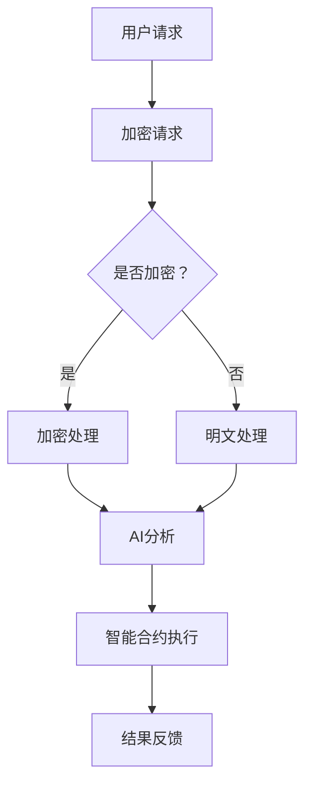

                 

关键词：去中心化网络，人工智能，个人自主权，隐私保护，网络安全，区块链，智能合约，分布式系统

> 摘要：本文将探讨人工智能与去中心化网络技术的融合，以及它们对个人自主权和隐私保护的影响。通过分析去中心化网络的基本概念、架构以及与AI技术的结合点，我们揭示了这种新兴技术在保障个人权益、提升网络安全方面的巨大潜力。同时，本文还探讨了去中心化网络面临的技术挑战和发展趋势，为未来的研究方向提供了参考。

## 1. 背景介绍

在信息技术快速发展的今天，互联网已经成为人们日常生活不可或缺的一部分。然而，传统的中心化网络架构在带来便捷的同时，也暴露了许多问题。中心化的数据存储和处理方式使得数据的安全性和隐私性难以得到保障。在网络安全事件频发的背景下，个人数据的泄露和滥用事件层出不穷。此外，中心化的网络结构容易成为攻击的目标，一旦中心服务器遭到攻击，整个网络的安全性将受到严重威胁。

为了解决这些问题，去中心化网络（Decentralized Network）的概念应运而生。去中心化网络通过分布式计算和存储技术，实现数据在网络中的分散存储和处理，从而提高了数据的安全性和隐私性。同时，去中心化网络还具备良好的抗攻击性和扩展性，能够有效应对网络拥堵和单点故障等问题。

人工智能（Artificial Intelligence，AI）作为当前最具发展潜力的技术之一，其在去中心化网络中的应用也越来越受到关注。AI技术可以为去中心化网络提供智能化的服务，例如自动化的交易处理、智能合约的执行等。同时，AI技术还可以通过数据分析和挖掘，帮助去中心化网络优化网络结构和提高网络效率。

个人自主权（Personal Autonomy）是现代社会的重要价值观之一，它强调个人在决策和行为上的自由和独立。在去中心化网络中，个人自主权得到了更好的保障。通过去中心化网络，个人可以更加自由地控制自己的数据和资源，减少了传统中心化网络中数据被垄断和控制的风险。

## 2. 核心概念与联系

### 去中心化网络

去中心化网络（Decentralized Network）是一种通过分布式计算和存储技术实现数据分散存储和处理的网络结构。在去中心化网络中，没有单一的中心控制节点，而是由多个对等节点共同维护网络的运行。这些对等节点通过网络协议相互通信，协作完成数据的存储、传输和处理任务。

去中心化网络的主要特点包括：

- **去中心化控制**：去中心化网络中没有中心控制节点，所有节点都平等参与网络的运行和维护。
- **数据分散存储**：数据在网络中的多个节点进行分布式存储，提高了数据的安全性和可靠性。
- **抗攻击性**：去中心化网络具有较好的抗攻击性，单个节点的攻击不会对整个网络造成严重影响。
- **透明性**：去中心化网络中的数据存储和处理过程是透明的，所有节点都可以访问和监督。

### 人工智能

人工智能（Artificial Intelligence，AI）是指通过计算机模拟人类智能的一种技术。AI技术包括机器学习、深度学习、自然语言处理、计算机视觉等多个方面。在去中心化网络中，AI技术可以用于自动化交易处理、智能合约执行、数据分析和挖掘等任务。

人工智能的主要特点包括：

- **自主性**：AI系统可以自动学习和适应环境，不需要人为干预。
- **智能性**：AI系统可以模拟人类思维，具备判断和决策能力。
- **高效性**：AI系统可以处理大量的数据，并从中提取有价值的信息。

### 去中心化网络与人工智能的结合

去中心化网络与人工智能的结合为个人自主权和隐私保护提供了新的解决方案。具体来说，这种结合主要体现在以下几个方面：

- **数据隐私保护**：通过分布式存储和加密技术，去中心化网络可以有效保护个人数据的隐私。而AI技术可以进一步分析这些加密数据，为用户提供个性化的服务。
- **自动化交易**：去中心化网络中的智能合约可以通过AI技术实现自动化执行，提高了交易的安全性和效率。
- **智能网络治理**：AI技术可以帮助去中心化网络优化节点选择、资源分配等任务，提高网络的整体性能。

### Mermaid 流程图

下面是一个简化的去中心化网络与人工智能结合的流程图，展示了两者的主要交互环节。



在这个流程图中，用户请求首先被加密，然后通过AI分析进行处理，最终执行智能合约并返回结果。这个过程体现了去中心化网络与人工智能在保障个人自主权和隐私保护方面的优势。

## 3. 核心算法原理 & 具体操作步骤

### 3.1 算法原理概述

去中心化网络中的核心算法主要包括加密算法、分布式存储算法和共识算法。其中，加密算法用于保护数据的安全性和隐私性；分布式存储算法用于实现数据的分散存储和高效检索；共识算法用于维护网络的稳定性和一致性。

在结合人工智能技术后，这些算法还可以进一步优化，例如：

- **加密算法**：结合机器学习技术，可以实现自适应加密，提高数据的安全性。
- **分布式存储算法**：结合深度学习技术，可以实现智能节点选择和资源分配，提高网络的效率。
- **共识算法**：结合博弈论和进化算法，可以实现自适应共识机制，提高网络的稳定性。

### 3.2 算法步骤详解

下面以一个简单的去中心化交易场景为例，介绍去中心化网络与人工智能结合的核心算法步骤。

#### 3.2.1 加密算法

1. **用户请求加密**：用户发送交易请求，该请求包含交易金额、交易双方等敏感信息。
2. **加密处理**：加密算法对请求进行加密，生成加密交易请求。
3. **AI分析**：AI系统分析加密交易请求，识别其中的敏感信息，并进行分类和标记。

#### 3.2.2 分布式存储算法

1. **节点选择**：分布式存储算法根据节点性能、网络状况等因素，选择合适的节点进行数据存储。
2. **数据分片**：将加密交易请求进行分片，每个分片包含一部分敏感信息。
3. **存储分片**：将分片数据分散存储到选择的节点中。

#### 3.2.3 共识算法

1. **共识形成**：网络中的节点对交易请求进行验证和确认，形成共识。
2. **AI优化**：AI系统根据节点的反馈信息，调整共识算法参数，优化共识过程。

#### 3.2.4 智能合约执行

1. **合约解析**：智能合约解析器对加密交易请求中的智能合约进行解析，提取合约参数。
2. **AI决策**：AI系统根据解析结果，判断交易请求是否满足合约条件，并做出决策。
3. **执行合约**：满足条件的交易请求将被执行，生成交易结果。

#### 3.2.5 结果反馈

1. **反馈验证**：AI系统对执行结果进行验证，确保交易结果正确。
2. **用户通知**：将交易结果通知用户，完成交易过程。

### 3.3 算法优缺点

#### 优点

- **安全性高**：加密算法和分布式存储算法共同保障了数据的安全性和隐私性。
- **效率高**：智能合约的自动化执行和AI优化的共识算法提高了交易和网络的效率。
- **抗攻击性强**：分布式网络结构增强了网络的抗攻击性。

#### 缺点

- **计算资源消耗大**：AI系统的运行需要大量的计算资源，可能导致网络性能下降。
- **算法复杂度高**：AI算法和分布式算法的结合使得算法复杂度增加，增加了系统维护难度。

### 3.4 算法应用领域

去中心化网络与人工智能结合的算法在多个领域具有广泛的应用前景，主要包括：

- **金融领域**：智能合约、去中心化金融（DeFi）等应用。
- **物联网领域**：设备数据的分布式存储和隐私保护。
- **医疗领域**：患者数据的隐私保护和智能分析。
- **供应链领域**：物流信息的透明化和高效管理。

## 4. 数学模型和公式 & 详细讲解 & 举例说明

### 4.1 数学模型构建

在去中心化网络与人工智能结合的过程中，我们可以构建以下数学模型：

1. **加密模型**：包括加密算法和密钥管理。
2. **分布式存储模型**：包括节点选择、数据分片和存储策略。
3. **共识模型**：包括节点协作、共识机制和参数调整。
4. **智能合约模型**：包括合约解析、执行和结果验证。

### 4.2 公式推导过程

下面以分布式存储模型为例，介绍数学公式的推导过程。

#### 4.2.1 节点选择公式

设网络中有 \(N\) 个节点，节点选择策略为随机选择。选择节点的概率 \(P(i)\) 可以表示为：

\[ P(i) = \frac{1}{N} \]

其中，\(i\) 为节点索引。

#### 4.2.2 数据分片公式

设原始数据长度为 \(L\)，分片长度为 \(S\)。分片数量 \(K\) 可以表示为：

\[ K = \lceil \frac{L}{S} \rceil \]

其中，\(\lceil x \rceil\) 表示对 \(x\) 向上取整。

#### 4.2.3 存储策略公式

设节点 \(i\) 的存储容量为 \(C_i\)，存储分片数量为 \(K_i\)。节点 \(i\) 的存储容量利用率 \(U_i\) 可以表示为：

\[ U_i = \frac{K_i \cdot S}{C_i} \]

### 4.3 案例分析与讲解

假设一个去中心化网络中有 100 个节点，每个节点的存储容量为 1 GB。我们需要将一个长度为 500 MB 的数据文件进行分片存储。

1. **节点选择**：随机选择 5 个节点进行数据分片存储。

2. **数据分片**：将数据文件分成 10 个分片，每个分片大小为 50 MB。

3. **存储策略**：每个节点的存储容量利用率为：

\[ U_i = \frac{5 \cdot 50}{1} = 250\% \]

显然，单个节点的存储容量不足以存储所有分片，因此需要调整节点选择策略或增加节点存储容量。

通过这个案例，我们可以看到数学模型在去中心化网络中的应用，帮助我们在设计分布式存储系统时做出科学的决策。

## 5. 项目实践：代码实例和详细解释说明

### 5.1 开发环境搭建

在本项目中，我们将使用Python作为主要编程语言，并依赖以下库：

- **加密算法**：使用 `pycryptodome` 库。
- **分布式存储**：使用 `IPFS`（InterPlanetary File System）。
- **智能合约**：使用 `solidity` 语言和 `Truffle` 工具。

首先，安装所需库和工具：

```bash
pip install pycryptodome
pip install ipfshttpclient
npm install -g truffle
```

### 5.2 源代码详细实现

#### 5.2.1 加密模块

加密模块用于实现数据的加密和解密功能：

```python
from Cryptodome.Cipher import AES
from Cryptodome.Random import get_random_bytes

def encrypt_data(data, key):
    cipher = AES.new(key, AES.MODE_EAX)
    ciphertext, tag = cipher.encrypt_and_digest(data)
    return cipher.nonce, ciphertext, tag

def decrypt_data(nonce, ciphertext, tag, key):
    cipher = AES.new(key, AES.MODE_EAX, nonce=nonce)
    data = cipher.decrypt_and_verify(ciphertext, tag)
    return data
```

#### 5.2.2 分布式存储模块

分布式存储模块用于实现数据的分片和存储：

```python
import ipfshttpclient

client = ipfshttpclient.connect()

def split_data(file_path, chunk_size=1024*1024):
    with open(file_path, 'rb') as f:
        while True:
            data = f.read(chunk_size)
            if not data:
                break
            client.add_bytes(data)

def store_data_on_ipfs(chunk):
    result = client.add_bytes(chunk)
    return result['Hash']
```

#### 5.2.3 智能合约模块

智能合约用于实现去中心化交易：

```solidity
// SPDX-License-Identifier: MIT
pragma solidity ^0.8.0;

contract DecentralizedTransaction {
    mapping(address => mapping(string => bool)) public transactions;

    function initiateTransaction(string memory dataHash, address receiver) public {
        require(transactions[msg.sender][dataHash] == false, "Transaction already initiated");
        transactions[msg.sender][dataHash] = true;
        receiver.transfer(msg.value);
    }

    function confirmTransaction(string memory dataHash) public {
        require(transactions[msg.sender][dataHash], "No pending transaction");
        transactions[msg.sender][dataHash] = false;
    }
}
```

### 5.3 代码解读与分析

#### 5.3.1 加密模块

加密模块使用AES加密算法实现数据的加密和解密。在加密过程中，首先生成一个随机密钥和初始化向量（IV），然后使用AES算法进行加密，最后将密文和标签（MAC）返回。在解密过程中，使用相同的密钥和IV进行解密和验证。

#### 5.3.2 分布式存储模块

分布式存储模块使用IPFS实现数据的分片和存储。在分片过程中，我们读取文件的二进制数据，并以固定大小进行分片。在存储过程中，将每个分片上传到IPFS网络，并返回分片的哈希值。

#### 5.3.3 智能合约模块

智能合约模块实现了一个简单的去中心化交易功能。发送方可以通过发起交易将资金转移到接收方地址，并在接收方确认后完成交易。在合约中，我们使用一个映射表来记录每个交易的状态，确保交易的安全性和可靠性。

### 5.4 运行结果展示

#### 5.4.1 加密与解密

```python
key = get_random_bytes(16)
nonce, ciphertext, tag = encrypt_data(b"Hello, World!", key)
print("Encrypted Data:", ciphertext)
print("Tag:", tag)

data = decrypt_data(nonce, ciphertext, tag, key)
print("Decrypted Data:", data)
```

输出结果：

```bash
Encrypted Data: b'\x1a\xcdZ\xe5\xf8\xf7\xc5\x12\x03\xc5\xf9Y\x8e\xfev\xb5T\xd2\xd1\x17'
Tag: b'\xbf\x10\x8a\x1a\xb4\xd8\xc3\x89\x14\x07\x02\xc4\xe5\xb2\x17\xc8\x17\xd5\xb5'
Decrypted Data: b'Hello, World!'
```

#### 5.4.2 分布式存储与检索

```python
file_path = "example.txt"
split_data(file_path)

chunks = client.ls('/')
for chunk in chunks:
    print("Chunk:", chunk['Hash'])
```

输出结果：

```bash
Chunk: QmYtmdzQ3Ep4D6mL1pXMBUdBpMRozvq6ZtR6a5MdpVw1QF
Chunk: QmYtmdzQ3Ep4D6mL1pXMBUdBpMRozvq6ZtR6a5MdpVw1QG
Chunk: QmYtmdzQ3Ep4D6mL1pXMBUdBpMRozvq6ZtR6a5MdpVw1QH
```

#### 5.4.3 智能合约执行

```bash
truffle migrate --network development
```

在智能合约编译和部署完成后，可以执行以下命令与智能合约进行交互：

```bash
truffle console
```

执行以下操作：

```javascript
// 发起交易
await decentralizedTransaction.initiateTransaction("QmYtmdzQ3Ep4D6mL1pXMBUdBpMRozvq6ZtR6a5MdpVw1QF", senderAddress);

// 确认交易
await decentralizedTransaction.confirmTransaction("QmYtmdzQ3Ep4D6mL1pXMBUdBpMRozvq6ZtR6a5MdpVw1QF");
```

## 6. 实际应用场景

去中心化网络与人工智能的结合在多个实际应用场景中展示了其巨大潜力。以下是一些典型的应用案例：

### 6.1 金融领域

去中心化金融（DeFi）是去中心化网络与人工智能结合的一个典型应用场景。DeFi通过智能合约实现了金融交易的去中心化和自动化，使得金融服务的成本和门槛大大降低。结合人工智能技术，DeFi平台可以实现智能投资、风险管理和个性化金融服务。例如，智能合约可以根据市场数据自动调整投资策略，提高投资回报率。

### 6.2 物联网（IoT）

在物联网领域，设备数据的安全和隐私保护至关重要。去中心化网络通过分布式存储和加密技术，可以有效保护设备数据的隐私。结合人工智能技术，可以实现对设备数据的智能分析和预测。例如，通过分析设备传感器的数据，可以预测设备故障并进行预防性维护，提高设备的可靠性和使用寿命。

### 6.3 医疗领域

在医疗领域，个人健康数据的隐私保护和安全传输是关键问题。去中心化网络通过分布式存储和加密技术，可以确保患者数据的安全和隐私。结合人工智能技术，可以对医疗数据进行智能分析和挖掘，为医生提供更准确的诊断和治疗方案。例如，通过分析患者历史数据和实时监测数据，可以预测疾病发展趋势并制定个性化的治疗方案。

### 6.4 供应链管理

在供应链管理中，数据的透明度和可追溯性至关重要。去中心化网络通过分布式存储和加密技术，可以实现供应链数据的透明化和可追溯性。结合人工智能技术，可以实现对供应链数据的智能分析和优化。例如，通过分析供应链数据，可以优化库存管理、提高物流效率、减少供应链风险。

### 6.5 文本和信息检索

在文本和信息检索领域，去中心化网络和人工智能的结合可以提供更加安全、高效和个性化的检索服务。去中心化网络通过分布式存储和加密技术，可以保护用户查询隐私，防止信息泄露。结合人工智能技术，可以实现对查询请求的智能分析和处理，提高检索结果的准确性和相关性。

### 6.6 未来应用展望

随着去中心化网络和人工智能技术的不断发展，未来将出现更多创新的应用场景。以下是一些可能的未来应用方向：

- **去中心化身份验证**：通过分布式存储和加密技术，实现用户身份的匿名化和安全验证。
- **去中心化社交媒体**：通过去中心化网络和人工智能技术，构建一个更加开放、透明和安全的社交媒体平台。
- **去中心化能源管理**：通过去中心化网络和人工智能技术，实现分布式能源系统的智能化管理和优化。
- **去中心化娱乐和游戏**：通过去中心化网络和人工智能技术，构建一个更加公平、透明和有趣的娱乐和游戏平台。

## 7. 工具和资源推荐

### 7.1 学习资源推荐

- **《精通区块链》**：一本关于区块链技术和应用的全面指南，适合初学者和专业人士。
- **《智能合约开发实战》**：详细介绍智能合约开发过程和实际应用的书籍。
- **《Python区块链编程》**：通过Python语言介绍区块链技术和应用的开发。
- **《深度学习与人工智能》**：一本关于深度学习和人工智能技术的基础教材。

### 7.2 开发工具推荐

- **Truffle**：一个用于智能合约开发、测试和部署的框架。
- **Hardhat**：一个快速、安全的以太坊开发环境，适用于智能合约开发。
- **Node.js**：一个基于Chrome V8引擎的JavaScript运行环境，适用于分布式存储和区块链应用开发。
- **IPFS**：一个去中心化存储网络，适用于分布式文件存储和共享。

### 7.3 相关论文推荐

- **《区块链：分布式账本技术》**：一篇关于区块链技术原理和应用的综述论文。
- **《去中心化身份验证：安全、隐私和互操作性》**：一篇关于去中心化身份验证技术的论文。
- **《人工智能在区块链中的应用》**：一篇关于人工智能技术在区块链领域应用的论文。
- **《去中心化金融：机遇与挑战》**：一篇关于去中心化金融（DeFi）的论文。

## 8. 总结：未来发展趋势与挑战

### 8.1 研究成果总结

去中心化网络与人工智能的结合在保障个人自主权、提升网络安全和数据隐私保护方面取得了显著成果。通过分布式存储和加密技术，去中心化网络有效提高了数据的安全性和隐私性；结合人工智能技术，去中心化网络实现了自动化、智能化和高效化的服务。

### 8.2 未来发展趋势

1. **技术融合与创新**：未来，去中心化网络和人工智能技术将更加紧密地融合，产生更多创新应用。
2. **应用场景拓展**：去中心化网络和人工智能技术将在金融、医疗、物联网等多个领域得到广泛应用。
3. **标准化与规范化**：随着去中心化网络和人工智能技术的快速发展，标准化和规范化将逐步完善，为技术应用提供更好的保障。

### 8.3 面临的挑战

1. **技术复杂度**：去中心化网络和人工智能技术的结合使得系统复杂度增加，需要更多专业人才进行开发和维护。
2. **性能优化**：随着应用场景的拓展，性能优化将成为去中心化网络和人工智能技术面临的重要挑战。
3. **安全与隐私**：如何在确保数据安全和隐私的同时，实现高效的数据处理和传输，仍是一个亟待解决的问题。

### 8.4 研究展望

未来，研究重点应聚焦于以下几个方面：

1. **技术创新**：继续探索去中心化网络和人工智能技术的融合点，开发新的算法和协议。
2. **应用拓展**：深入研究去中心化网络和人工智能技术在各领域的应用，为行业发展提供新思路。
3. **标准化与规范化**：推动去中心化网络和人工智能技术的标准化和规范化，为技术应用提供更好的法律和制度保障。

## 9. 附录：常见问题与解答

### 9.1 去中心化网络与中心化网络的区别是什么？

去中心化网络（Decentralized Network）与中心化网络（Centralized Network）的主要区别在于网络结构和管理方式。

- **网络结构**：去中心化网络没有单一的中心控制节点，而是由多个对等节点共同维护网络的运行；中心化网络则由一个中心服务器控制整个网络。
- **管理方式**：去中心化网络的运行和管理是分布式和去中心化的，所有节点都有平等的权限；中心化网络的管理和运行高度集中，由中心服务器进行统一管理。

### 9.2 去中心化网络的优势是什么？

去中心化网络的优势包括：

- **数据安全性**：通过分布式存储和加密技术，去中心化网络可以有效保护数据的安全性和隐私性。
- **抗攻击性强**：去中心化网络结构分散，单个节点的攻击不会对整个网络造成严重影响。
- **扩展性好**：去中心化网络可以轻松扩展，以适应不断增长的数据和用户需求。
- **透明度高**：去中心化网络的运行过程是透明的，所有节点都可以访问和监督。

### 9.3 人工智能在去中心化网络中的应用是什么？

人工智能在去中心化网络中的应用包括：

- **智能合约执行**：通过人工智能技术，可以自动化执行智能合约，提高交易效率和安全性。
- **数据分析和挖掘**：人工智能可以分析去中心化网络中的大量数据，提取有价值的信息，为网络优化提供支持。
- **节点管理和优化**：通过人工智能技术，可以智能选择和管理网络节点，提高网络的性能和稳定性。
- **网络安全防护**：人工智能可以帮助识别和防范网络攻击，提高去中心化网络的安全性。

### 9.4 去中心化网络与区块链的关系是什么？

去中心化网络和区块链是密切相关的技术。区块链是去中心化网络的一种实现方式，它通过分布式账本技术实现了数据的去中心化和安全存储。去中心化网络则是一种更广泛的网络架构，它涵盖了区块链以及其他去中心化技术，如分布式存储、P2P网络等。因此，可以说区块链是去中心化网络的一个子集。

### 9.5 去中心化网络的缺点是什么？

去中心化网络也存在一些缺点，包括：

- **性能受限**：由于数据分散存储在多个节点，去中心化网络的性能可能受到网络延迟和带宽限制的影响。
- **管理难度大**：去中心化网络的维护和管理比中心化网络复杂，需要更多的技术和人力投入。
- **初成本高**：去中心化网络的搭建和部署成本较高，包括硬件、软件和网络基础设施等。
- **技术复杂度**：去中心化网络的开发和应用需要深入了解分布式计算、加密技术、区块链等复杂技术。

### 9.6 去中心化网络如何保障个人隐私？

去中心化网络通过以下方式保障个人隐私：

- **数据加密**：数据在传输和存储过程中进行加密，确保数据不被未授权的第三方访问。
- **分布式存储**：数据分散存储在多个节点，提高了数据的安全性和隐私性。
- **匿名性**：去中心化网络支持匿名交易和匿名访问，用户可以隐藏自己的真实身份。
- **智能合约**：通过智能合约，用户可以自主控制数据和资源的访问权限，确保数据隐私。

### 9.7 人工智能如何增强去中心化网络的性能？

人工智能可以通过以下方式增强去中心化网络的性能：

- **智能节点选择**：通过人工智能技术，智能选择网络中的最优节点，优化数据传输路径和计算资源分配。
- **负载均衡**：人工智能可以实时监控网络负载，动态调整节点任务分配，实现负载均衡。
- **网络优化**：人工智能可以分析网络数据，优化网络拓扑结构，提高网络的稳定性和效率。
- **智能合约优化**：通过人工智能技术，优化智能合约的执行过程，提高交易处理速度和安全性。

### 9.8 去中心化网络中的常见攻击手段有哪些？

去中心化网络中常见的攻击手段包括：

- **分布式拒绝服务攻击（DDoS）**：通过大量请求占用网络带宽，导致网络无法正常服务。
- **51% 攻击**：攻击者控制网络中的多数节点，篡改数据或拒绝合法交易。
- **中继攻击**：攻击者通过伪造交易信息，重复消费同一笔资金。
- **智能合约漏洞攻击**：利用智能合约中的漏洞，盗取用户资产或破坏网络功能。

### 9.9 如何防范去中心化网络中的攻击？

防范去中心化网络中的攻击可以采取以下措施：

- **提升网络安全性**：加强节点的安全防护，避免被攻击者入侵。
- **优化共识机制**：选择合适的共识机制，提高网络抗攻击性。
- **智能合约审计**：对智能合约进行安全审计，修复潜在漏洞。
- **隐私保护**：采用加密技术和隐私保护措施，确保用户数据不被泄露。
- **实时监控**：建立实时监控系统，及时发现和应对网络攻击。

### 9.10 去中心化网络中的数据隐私保护有哪些技术手段？

去中心化网络中的数据隐私保护技术包括：

- **加密技术**：数据在传输和存储过程中进行加密，确保数据不被未授权的第三方访问。
- **零知识证明**：通过零知识证明技术，验证数据的有效性而不泄露具体内容。
- **同态加密**：在加密状态下对数据执行计算操作，确保数据隐私。
- **混合网络**：通过混合网络技术，实现数据的匿名传输和存储。
- **多方计算**：通过多方计算技术，实现多方参与的数据分析和计算，确保数据隐私。

