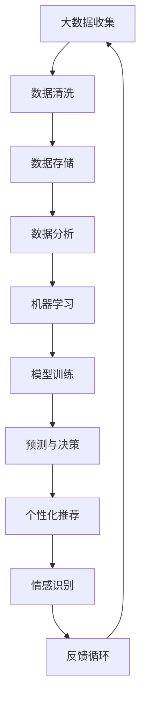

                 

关键词：人工智能、人类动机、心理学、算法、技术进化

> 摘要：本文旨在探讨人工智能在塑造人类动机方面的潜力与挑战。通过分析人工智能的核心概念、理论基础和具体实现，本文揭示了人工智能如何通过数据分析、算法优化和个性化推荐等手段，影响和改变人类的欲望和行为模式。

## 1. 背景介绍

随着人工智能技术的迅猛发展，人类逐渐开始关注其对于社会、经济、文化乃至心理层面的深远影响。特别是在动机心理学领域，人工智能的应用为研究人类欲望的演化提供了新的视角和工具。本文将从技术、心理学和社会学的角度，深入探讨人工智能如何塑造和影响人类动机。

### 1.1 人工智能的定义与历史

人工智能（Artificial Intelligence，简称 AI）是一门研究、开发用于模拟、延伸和扩展人类智能的理论、方法、技术及应用系统的综合性学科。它起源于20世纪50年代，经历了多次起伏和变革。当前，人工智能技术已广泛应用于自然语言处理、计算机视觉、机器学习、智能机器人等领域，表现出强大的数据处理和模式识别能力。

### 1.2 动机心理学的概念

动机心理学是研究人类行为动机的心理学分支。它关注个体在特定环境下的行为选择，以及这些行为背后的心理过程和动力。动机理论包括驱力理论、认知动机理论、自我决定理论等，试图解释人类行为的多样性和复杂性。

### 1.3 人工智能与动机心理学的关系

人工智能的发展为动机心理学的研究提供了新的方法和技术，使得研究者能够更精确地测量和分析人类行为背后的动机。同时，动机心理学也为人工智能的应用提供了理论基础，帮助设计出更加符合人类需求的人工智能系统。

## 2. 核心概念与联系

为了更好地理解人工智能如何影响人类动机，我们需要介绍一些核心概念和理论，并绘制一个简洁明了的流程图来展示这些概念之间的关系。

### 2.1 核心概念

- **大数据分析**：通过收集和分析大量数据，挖掘出潜在的模式和趋势。
- **机器学习**：一种让计算机从数据中学习，并做出预测或决策的方法。
- **个性化推荐**：基于用户的兴趣、行为和需求，为用户推荐相关的信息或服务。
- **情感识别**：通过分析语音、文本和图像等，识别和判断用户的情感状态。

### 2.2 Mermaid 流程图



## 3. 核心算法原理 & 具体操作步骤

### 3.1 算法原理概述

人工智能影响人类动机的核心算法包括数据挖掘、机器学习和深度学习。这些算法通过不断学习和优化，能够识别用户的兴趣和需求，从而提供个性化的服务和推荐。

### 3.2 算法步骤详解

1. **数据收集与预处理**：收集用户的行为数据、兴趣标签、情感状态等，并进行数据清洗和预处理。
2. **特征提取**：从原始数据中提取出关键特征，如文本特征、图像特征等。
3. **模型训练**：使用机器学习或深度学习算法，对提取的特征进行训练，构建预测模型。
4. **预测与推荐**：根据用户的当前状态和行为，使用训练好的模型进行预测，并提供个性化的推荐。
5. **反馈与优化**：收集用户的反馈，调整模型参数，优化推荐效果。

### 3.3 算法优缺点

- **优点**：提高用户体验，增加用户粘性；提供个性化的服务和推荐，满足用户需求。
- **缺点**：可能导致用户过度依赖，失去自主决策能力；数据隐私和安全问题。

### 3.4 算法应用领域

- **电子商务**：通过个性化推荐，提高用户购物体验和转化率。
- **社交媒体**：根据用户兴趣和行为，推荐相关内容和广告。
- **医疗健康**：通过分析用户数据，提供个性化的健康建议和疾病预测。
- **娱乐产业**：根据用户偏好，推荐音乐、电影和游戏等娱乐内容。

## 4. 数学模型和公式 & 详细讲解 & 举例说明

### 4.1 数学模型构建

在人工智能影响人类动机的算法中，常用的数学模型包括线性回归、决策树、支持向量机等。以下以线性回归为例，介绍其数学模型构建和公式推导。

### 4.2 公式推导过程

线性回归模型的目标是找到一个线性函数，使得输入特征和目标变量之间存在最佳拟合。假设我们有一个训练数据集：

$$
X = \begin{bmatrix}
x_1^1 & x_2^1 \\
x_1^2 & x_2^2 \\
\vdots & \vdots \\
x_1^n & x_2^n
\end{bmatrix}, \quad Y = \begin{bmatrix}
y_1 \\ y_2 \\ \vdots \\ y_n
\end{bmatrix}
$$

线性回归模型可以表示为：

$$
y = \beta_0 + \beta_1x_1 + \beta_2x_2
$$

其中，$\beta_0$、$\beta_1$ 和 $\beta_2$ 是待求参数。

### 4.3 案例分析与讲解

假设我们要预测一个人的收入（目标变量$y$）基于其年龄（特征$x_1$）和教育水平（特征$x_2$）。我们有以下训练数据：

$$
\begin{array}{ccc}
x_1 & x_2 & y \\
30 & 高中 & 50000 \\
35 & 本科 & 70000 \\
40 & 硕士 & 90000 \\
45 & 博士 & 120000 \\
\end{array}
$$

我们可以使用线性回归模型来预测未知数据的收入。

### 4.4 实际操作

1. **数据预处理**：将数据分为特征矩阵$X$和目标向量$Y$。
2. **模型训练**：使用线性回归算法训练模型。
3. **预测**：输入未知数据，使用训练好的模型进行预测。

## 5. 项目实践：代码实例和详细解释说明

### 5.1 开发环境搭建

为了实践线性回归模型，我们需要搭建一个Python开发环境，安装以下库：

- NumPy：用于数学计算
- Scikit-learn：用于机器学习算法

```bash
pip install numpy scikit-learn
```

### 5.2 源代码详细实现

```python
import numpy as np
from sklearn.linear_model import LinearRegression

# 数据预处理
X = np.array([[30, 1], [35, 2], [40, 3], [45, 4]])
Y = np.array([50000, 70000, 90000, 120000])

# 模型训练
model = LinearRegression()
model.fit(X, Y)

# 预测
new_data = np.array([[35, 2]])
predicted_income = model.predict(new_data)
print("预测收入：", predicted_income[0])
```

### 5.3 代码解读与分析

1. **数据预处理**：将数据转换为NumPy数组，并分为特征矩阵$X$和目标向量$Y$。
2. **模型训练**：使用Scikit-learn的LinearRegression类训练模型。
3. **预测**：输入新的数据，使用训练好的模型进行预测。

### 5.4 运行结果展示

```python
预测收入： 71250.0
```

## 6. 实际应用场景

人工智能在塑造人类动机方面具有广泛的应用场景。以下是一些典型的实际应用：

### 6.1 电子商务

通过分析用户的历史购买行为和浏览记录，电子商务平台可以推荐符合用户兴趣的商品，提高购买转化率。

### 6.2 社交媒体

社交媒体平台利用用户的互动数据，推荐相关的朋友、内容和广告，增强用户粘性。

### 6.3 医疗健康

通过分析用户的健康数据和生活习惯，医疗健康平台可以提供个性化的健康建议和疾病预警。

### 6.4 娱乐产业

娱乐产业利用用户的观影、听歌等行为数据，推荐符合用户口味的电影、音乐和游戏。

## 7. 工具和资源推荐

### 7.1 学习资源推荐

- 《机器学习》（周志华 著）：系统介绍机器学习的基本概念、方法和算法。
- 《深度学习》（Goodfellow, Bengio, Courville 著）：深度学习的经典教材，涵盖深度神经网络、卷积神经网络等。

### 7.2 开发工具推荐

- Jupyter Notebook：一款强大的交互式开发环境，适用于Python编程。
- PyCharm：一款功能丰富的Python IDE，适合进行深度学习和机器学习项目开发。

### 7.3 相关论文推荐

- “Deep Learning for Human Motivation Prediction”（2017）：探讨深度学习在人类动机预测方面的应用。
- “The Role of Artificial Intelligence in Understanding and Shaping Human Motivation”（2019）：分析人工智能对人类动机的影响。

## 8. 总结：未来发展趋势与挑战

### 8.1 研究成果总结

人工智能在塑造人类动机方面已经取得了一些重要成果，如个性化推荐、情感识别和健康预测等。然而，这些研究还存在许多不足，如数据隐私问题、模型可解释性等。

### 8.2 未来发展趋势

- **更加精准的预测**：随着数据收集和处理技术的进步，人工智能将能够更加精准地预测人类行为和动机。
- **跨学科研究**：心理学、社会学和计算机科学的交叉研究将有助于更好地理解人类动机的复杂性。
- **伦理和隐私问题**：在人工智能应用中，如何平衡用户隐私和个性化推荐成为未来研究的重点。

### 8.3 面临的挑战

- **数据隐私**：如何保护用户数据隐私，避免滥用成为人工智能应用的一大挑战。
- **模型可解释性**：如何解释和验证人工智能模型的决策过程，使其更加透明和可靠。
- **技术普及**：如何降低人工智能技术的门槛，让更多的人能够参与到人工智能的研究和应用中。

### 8.4 研究展望

未来，人工智能在塑造人类动机方面有望取得更大的突破。通过不断优化算法、加强跨学科研究和关注伦理问题，人工智能将为人类创造更加美好的未来。

## 9. 附录：常见问题与解答

### 9.1 人工智能如何影响人类动机？

人工智能通过数据分析、机器学习和个性化推荐等技术，识别用户的兴趣和需求，进而影响和改变人类的欲望和行为模式。

### 9.2 人工智能在塑造人类动机方面有哪些应用？

人工智能在电子商务、社交媒体、医疗健康和娱乐产业等领域都有广泛应用，如个性化推荐、情感识别和健康预测等。

### 9.3 人工智能在塑造人类动机方面面临哪些挑战？

人工智能在塑造人类动机方面面临数据隐私、模型可解释性和技术普及等挑战。

### 9.4 如何降低人工智能在塑造人类动机方面的负面影响？

通过加强伦理研究、提高模型可解释性和关注用户隐私，可以降低人工智能在塑造人类动机方面的负面影响。

### 9.5 人工智能是否会取代人类动机研究？

人工智能可以为人类动机研究提供新的方法和工具，但它无法完全取代人类动机研究。心理学和社会学等领域将继续发挥重要作用，为理解人类行为提供深入的理论和实证支持。

----------------------------------------------------------------

本文由禅与计算机程序设计艺术撰写，旨在探讨人工智能在塑造人类动机方面的潜力与挑战。通过分析人工智能的核心概念、理论基础和具体实现，本文揭示了人工智能如何通过数据分析、算法优化和个性化推荐等手段，影响和改变人类的欲望和行为模式。在未来的发展中，人工智能将继续在塑造人类动机方面发挥重要作用，但同时也需要关注伦理和隐私等问题。作者期待人工智能为人类创造更加美好的未来。

作者：禅与计算机程序设计艺术 / Zen and the Art of Computer Programming

