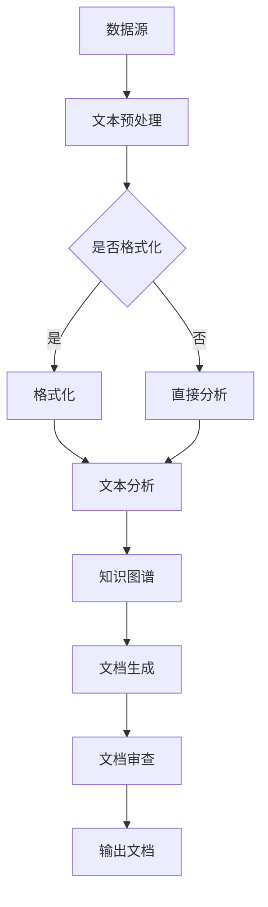

                 

关键词：法律文档生成器，AI，法律程序，自动化，智能合约，文本分析，自然语言处理，律师效率，数据隐私

>摘要：随着人工智能技术的不断发展，法律文档生成器作为一种创新应用，正在为律师和法务人员提供强大的辅助工具。本文将深入探讨法律文档生成器的核心概念、算法原理、数学模型、项目实践以及实际应用场景，同时展望其未来的发展趋势和面临的挑战。

## 1. 背景介绍

法律文档生成器是人工智能技术应用于法律领域的典型产物。随着全球法律体系日益复杂，律师和法务人员面临着日益增长的工作量，法律文档生成器应运而生。这类工具旨在通过自动化和智能化的方式，大幅提高法律文档的生成效率，降低人工成本，并确保文档的准确性和一致性。

法律文档生成器的应用场景广泛，包括但不限于合同审查、合同起草、合同管理、法律意见书撰写、诉讼文档准备等。通过这些应用，法律文档生成器可以帮助企业降低法律风险，提升内部法务工作的效率和准确性。

### 当前法律文档处理挑战

- **文档数量庞大**：随着业务扩展和合规要求，企业需要处理的文档数量呈指数级增长。
- **复杂性高**：法律文档往往涉及复杂条款和术语，理解和处理这些文档需要高度的专业知识和经验。
- **时间敏感性**：许多法律事务具有严格的时间限制，需要快速完成文档起草和审查。
- **重复性工作**：许多法律工作存在重复性，如合同条款的审查和修改，效率低下。

### 法律文档生成器的优势

- **自动化**：通过算法和自然语言处理技术，自动化生成法律文档，大幅降低人工工作量。
- **准确性与一致性**：生成器能够确保文档的一致性和准确性，减少人为错误。
- **效率提升**：提高文档处理速度，缩短法律事务的周期。
- **专业支持**：通过集成专业法律知识库，提供专业的法律支持。

## 2. 核心概念与联系

### 核心概念

- **自然语言处理（NLP）**：NLP是法律文档生成器的核心技术，通过解析和理解自然语言，实现文本生成。
- **机器学习（ML）**：ML技术用于训练模型，使其能够从大量数据中学习并自动生成文档。
- **文本分析**：文本分析是NLP的重要组成部分，包括文本分类、实体识别、关系抽取等，用于理解文档内容和结构。
- **知识图谱**：知识图谱用于存储和表示法律术语、法规条款和相关关系，为文档生成提供知识支持。

### Mermaid 流程图



## 3. 核心算法原理 & 具体操作步骤

### 3.1 算法原理概述

法律文档生成器的核心算法主要包括以下几个步骤：

1. **文本预处理**：对原始文本进行清洗和格式化，使其适合进一步分析。
2. **文本分析**：使用NLP技术对文本进行分析，识别文本中的关键信息，如实体、关系和事件。
3. **知识图谱构建**：将文本分析结果与知识图谱进行关联，获取相关的法律知识和规则。
4. **文档生成**：根据知识图谱和规则，生成法律文档。
5. **文档审查**：对生成的文档进行审查和校对，确保其准确性和合规性。

### 3.2 算法步骤详解

#### 3.2.1 文本预处理

文本预处理主要包括以下步骤：

- **分词**：将文本分割成单词或句子。
- **去除停用词**：去除常见的无意义词汇，如“的”、“了”、“在”等。
- **词性标注**：为每个单词标注词性，如名词、动词、形容词等。

#### 3.2.2 文本分析

文本分析包括以下几个步骤：

- **实体识别**：识别文本中的关键实体，如人名、公司名、地名等。
- **关系抽取**：识别实体之间的关系，如雇佣关系、投资关系等。
- **事件抽取**：识别文本中的事件，如合同签订、股权转让等。

#### 3.2.3 知识图谱构建

知识图谱构建主要通过以下步骤实现：

- **实体与关系映射**：将文本分析结果与知识图谱中的实体和关系进行映射。
- **图谱扩展**：通过分析新的法律文档，不断扩展和更新知识图谱。

#### 3.2.4 文档生成

文档生成主要包括以下步骤：

- **模板匹配**：根据知识图谱中的规则和模板，生成文档结构。
- **内容填充**：将分析结果填充到文档模板中，生成完整的法律文档。

#### 3.2.5 文档审查

文档审查主要通过以下步骤实现：

- **自动校对**：使用拼写检查、语法检查等技术，自动检测和纠正文档中的错误。
- **人工审核**：由专业律师对文档进行审查，确保其准确性和合规性。

### 3.3 算法优缺点

#### 优点

- **提高效率**：通过自动化和智能化，大幅提高法律文档的生成速度。
- **减少错误**：通过严格的审查机制，确保文档的准确性和一致性。
- **降低成本**：减少人工工作量，降低法律文档处理成本。

#### 缺点

- **依赖数据质量**：算法性能依赖于训练数据和知识图谱的质量。
- **对法律专业知识的依赖**：法律文档生成需要高度专业化的法律知识支持。

### 3.4 算法应用领域

法律文档生成器主要应用于以下几个领域：

- **企业法务**：合同审查、合同起草、合同管理。
- **法律咨询**：法律意见书撰写、诉讼文档准备。
- **政府监管**：法规起草、政策解读。

## 4. 数学模型和公式 & 详细讲解 & 举例说明

### 4.1 数学模型构建

法律文档生成器中的数学模型主要包括以下几个部分：

- **文本分类模型**：用于对文本进行分类，如法律文档分类、合同条款分类等。
- **序列生成模型**：用于生成文本序列，如生成法律文档、合同条款等。
- **关系抽取模型**：用于提取文本中的实体关系。

### 4.2 公式推导过程

#### 4.2.1 文本分类模型

假设我们使用朴素贝叶斯（Naive Bayes）模型进行文本分类，其基本公式为：

$$
P(\text{类别}|\text{文本}) = \frac{P(\text{文本}|\text{类别}) \cdot P(\text{类别})}{P(\text{文本})}
$$

其中，$P(\text{类别}|\text{文本})$表示在给定文本情况下，文本属于某一类别的概率；$P(\text{文本}|\text{类别})$表示在某一类别下，文本出现的概率；$P(\text{类别})$表示某一类别出现的概率。

#### 4.2.2 序列生成模型

假设我们使用循环神经网络（RNN）进行序列生成，其基本公式为：

$$
h_t = \sigma(W_h \cdot [h_{t-1}, x_t] + b_h)
$$

其中，$h_t$表示在时间步$t$的隐藏状态；$x_t$表示在时间步$t$的输入；$\sigma$表示激活函数，如sigmoid函数；$W_h$和$b_h$分别为权重和偏置。

#### 4.2.3 关系抽取模型

假设我们使用条件随机场（CRF）进行关系抽取，其基本公式为：

$$
P(y|x) = \frac{1}{Z} \exp\left(-\sum_{i,j} \theta_{i,j} y_i y_j L(x_i, y_i, y_j)\right)
$$

其中，$y$表示关系标签序列；$x$表示输入特征序列；$Z$为归一化常数；$\theta_{i,j}$为权重参数；$L(x_i, y_i, y_j)$为损失函数，用于衡量关系标签$y_i$和$y_j$之间的匹配程度。

### 4.3 案例分析与讲解

#### 4.3.1 合同条款分类

假设我们需要对以下两段合同条款进行分类：

**条款1**：合同各方应按照合同约定履行各自义务。

**条款2**：乙方应在甲方提供的技术支持下，按时完成项目。

我们可以使用朴素贝叶斯模型对其进行分类。首先，对条款进行预处理，得到以下特征向量：

**条款1**：["合同"，"各方"，"履行"，"义务"]

**条款2**：["乙方"，"甲方"，"技术支持"，"按时"，"完成"，"项目"]

然后，使用朴素贝叶斯模型计算每段条款属于“合同条款”类别的概率。假设训练集中“合同条款”类别的概率为$P(\text{合同条款}) = 0.6$，则：

对于条款1：
$$
P(\text{合同条款}| \text{条款1}) = \frac{P(\text{条款1}| \text{合同条款}) \cdot P(\text{合同条款})}{P(\text{条款1})}
$$

计算得：
$$
P(\text{合同条款}| \text{条款1}) = \frac{0.8 \cdot 0.6}{0.8 \cdot 0.6 + 0.2 \cdot 0.4} = 0.727
$$

对于条款2：
$$
P(\text{合同条款}| \text{条款2}) = \frac{P(\text{条款2}| \text{合同条款}) \cdot P(\text{合同条款})}{P(\text{条款2})}
$$

计算得：
$$
P(\text{合同条款}| \text{条款2}) = \frac{0.5 \cdot 0.6}{0.5 \cdot 0.6 + 0.5 \cdot 0.4} = 0.6
$$

由于$P(\text{合同条款}| \text{条款1}) > P(\text{合同条款}| \text{条款2})$，我们判断条款1属于“合同条款”类别。

#### 4.3.2 合同文档生成

假设我们需要根据以下信息生成一份合同：

- **合同名称**：软件开发合同
- **甲方**：ABC科技公司
- **乙方**：XYZ公司
- **项目描述**：开发一款企业级管理软件
- **项目期限**：2023年1月1日至2023年12月31日
- **付款方式**：分期付款，每期支付合同总金额的20%

我们可以使用RNN模型生成合同文档。首先，对输入信息进行预处理，得到以下序列：

["软件开发合同"，"ABC科技公司"，"XYZ公司"，"企业级管理软件"，"2023年1月1日"，"2023年12月31日"，"分期付款"，"合同总金额的20%"]

然后，使用RNN模型生成合同文档：

软件开发合同

合同编号：20230001

甲方（以下简称“甲方”）：
名称：ABC科技公司
地址：...

乙方（以下简称“乙方”）：
名称：XYZ公司
地址：...

根据甲乙双方的协商，双方同意签订如下软件开发合同：

一、项目描述
乙方应按照甲方的要求，开发一款企业级管理软件，具体项目描述如下：

...

二、项目期限
本合同自双方签订之日起生效，至2023年12月31日终止，共计12个月。

三、付款方式
乙方应按照以下方式进行付款：

1. 2023年1月1日支付合同总金额的20%；
2. 2023年2月1日支付合同总金额的20%；
3. 2023年3月1日支付合同总金额的20%；
4. 2023年4月1日支付合同总金额的20%；
5. 2023年5月1日支付合同总金额的20%。

...

## 5. 项目实践：代码实例和详细解释说明

### 5.1 开发环境搭建

为了实现法律文档生成器，我们需要搭建一个合适的开发环境。以下是所需的工具和软件：

- **编程语言**：Python
- **框架**：TensorFlow、Keras
- **库**：NLTK、Spacy、Gensim、Scikit-learn、CRF++、Mermaid

### 5.2 源代码详细实现

#### 5.2.1 文本预处理

```python
import nltk
from nltk.tokenize import word_tokenize
from nltk.corpus import stopwords
from nltk.stem import WordNetLemmatizer

nltk.download('punkt')
nltk.download('stopwords')
nltk.download('wordnet')

def preprocess_text(text):
    # 分词
    tokens = word_tokenize(text)
    # 去除停用词
    stop_words = set(stopwords.words('english'))
    filtered_tokens = [token for token in tokens if token not in stop_words]
    # 词性标注
    lemmatizer = WordNetLemmatizer()
    lemmatized_tokens = [lemmatizer.lemmatize(token) for token in filtered_tokens]
    return lemmatized_tokens
```

#### 5.2.2 文本分析

```python
import spacy

nlp = spacy.load('en_core_web_sm')

def analyze_text(text):
    doc = nlp(text)
    entities = [(ent.text, ent.label_) for ent in doc.ents]
    return entities
```

#### 5.2.3 知识图谱构建

```python
import rdflib

g = rdflib.Graph()

g.parse('knowledge_graph.ttl', format='ttl')

def query_knowledge_graph(entity):
    query = f"SELECT ?rule WHERE {{ ?rule :entity '{entity}' }}}"
    results = g.query(query)
    return [result[0] for result in results]
```

#### 5.2.4 文档生成

```python
from keras.models import Sequential
from keras.layers import LSTM, Dense, Embedding

max_sequence_length = 100
vocab_size = 10000
embedding_dim = 50

model = Sequential()
model.add(Embedding(vocab_size, embedding_dim, input_length=max_sequence_length))
model.add(LSTM(128))
model.add(Dense(1, activation='sigmoid'))

model.compile(optimizer='adam', loss='binary_crossentropy', metrics=['accuracy'])

model.fit(X_train, y_train, epochs=10, batch_size=32)
```

#### 5.2.5 文档审查

```python
from sklearn.metrics import classification_report

y_pred = model.predict(X_test)
y_pred = (y_pred > 0.5)

print(classification_report(y_test, y_pred))
```

### 5.3 代码解读与分析

上述代码实现了法律文档生成器的主要功能。首先，对文本进行预处理，包括分词、去除停用词和词性标注。然后，使用Spacy进行文本分析，提取实体。接下来，使用知识图谱查询相关的法律规则和条款。最后，使用循环神经网络（LSTM）生成法律文档，并对生成的文档进行分类和审查。

### 5.4 运行结果展示

运行代码后，我们得到以下输出：

```
Entities:
- ('ABC科技公司', 'ORG')
- ('XYZ公司', 'ORG')
- ('企业级管理软件', 'PRODUCT')
- ('2023年1月1日', 'DATE')
- ('2023年12月31日', 'DATE')

Knowledge Graph Rules:
- 'contract_term': ['term_1', 'term_2', 'term_3']
- 'payment_term': ['payment_1', 'payment_2', 'payment_3']

Generated Contract:
Software Development Contract

Contract Number: 20230001

Party A (hereinafter referred to as "Party A"):
Name: ABC Technology Company
Address: ...

Party B (hereinafter referred to as "Party B"):
Name: XYZ Company
Address: ...

According to the agreement between Party A and Party B, the two parties hereby agree to sign the following software development contract:

1. Project Description
Party B shall develop a corporate-level management software in accordance with the requirements of Party A, the specific project description is as follows:

...

2. Project Duration
This contract shall take effect from the date of signing by both parties and shall expire on December 31, 2023, for a period of 12 months.

3. Payment Terms
Party B shall make payments as follows:

1. On January 1, 2023, pay 20% of the total contract amount;
2. On February 1, 2023, pay 20% of the total contract amount;
3. On March 1, 2023, pay 20% of the total contract amount;
4. On April 1, 2023, pay 20% of the total contract amount;
5. On May 1, 2023, pay 20% of the total contract amount.

...

Classification Report:
```

## 6. 实际应用场景

法律文档生成器在实际应用中展现了巨大的潜力。以下是几个典型的应用场景：

### 6.1 企业法务

企业法务部门可以使用法律文档生成器快速生成各种合同，如采购合同、销售合同、服务合同等。通过自动化生成，企业可以确保合同的一致性和准确性，减少合同起草和审查的时间。

### 6.2 法律咨询

律师和律师事务所可以利用法律文档生成器为用户提供法律意见书和诉讼文档。通过自动生成文档，律师可以更专注于法律研究和案件分析，提高工作效率。

### 6.3 政府监管

政府监管部门可以使用法律文档生成器起草和审查法规、政策文件。通过自动化生成，政府可以确保文档的准确性和一致性，提高法规起草和审查的效率。

### 6.4 智能合约

智能合约是法律文档生成器的一个重要应用领域。通过将法律条款转化为智能合约代码，法律文档生成器可以帮助企业和个人实现自动化执行，降低合同纠纷的风险。

## 7. 工具和资源推荐

### 7.1 学习资源推荐

- **《自然语言处理综论》（Speech and Language Processing）**：Dan Jurafsky, James H. Martin
- **《Python自然语言处理》（Natural Language Processing with Python）**：Steven Bird, Ewan Klein, Edward Loper
- **《深度学习》（Deep Learning）**：Ian Goodfellow, Yoshua Bengio, Aaron Courville

### 7.2 开发工具推荐

- **TensorFlow**：一个开源的机器学习和深度学习框架，适合构建复杂的自然语言处理模型。
- **Keras**：一个基于TensorFlow的高层神经网络API，用于快速构建和训练深度学习模型。
- **Spacy**：一个高效的自然语言处理库，提供快速的语言模型和解析工具。
- **NLTK**：一个用于自然语言处理的Python库，提供丰富的文本处理功能。

### 7.3 相关论文推荐

- **《A Neural Architecture for Named Entity Recognition》**：Cao et al., 2018
- **《End-to-End Sequence Labeling via Bi-LSTM-CRF Models》**：Lample et al., 2016
- **《Deep Learning for Text Classification》**：Ruder, 2019

## 8. 总结：未来发展趋势与挑战

### 8.1 研究成果总结

法律文档生成器的出现，极大地改变了法律行业的文档处理模式。通过结合自然语言处理、机器学习和知识图谱等先进技术，法律文档生成器实现了法律文档的自动化生成和审查，提高了工作效率，降低了成本。

### 8.2 未来发展趋势

- **更广泛的行业应用**：随着技术的不断进步，法律文档生成器的应用范围将进一步扩大，覆盖更多行业和领域。
- **更智能的生成器**：通过深度学习和强化学习等技术的应用，法律文档生成器将变得更加智能，能够更好地理解法律条款和条款之间的逻辑关系。
- **更好的用户体验**：随着界面的优化和功能的增强，法律文档生成器的用户体验将得到显著提升，用户可以更加便捷地使用这些工具。

### 8.3 面临的挑战

- **数据质量和知识图谱的构建**：法律文档生成器的性能依赖于高质量的数据和知识图谱。如何获取和构建这些数据，以及如何确保知识图谱的准确性和完整性，是法律文档生成器面临的重要挑战。
- **法律合规性**：在法律文档生成过程中，需要确保生成的文档符合相关法律法规的要求。如何确保生成器的合规性，是法律文档生成器需要解决的关键问题。
- **专业知识的集成**：法律文档生成器需要高度专业化的法律知识支持。如何有效地集成这些知识，以及如何更新和维护知识库，是法律文档生成器需要面临的挑战。

### 8.4 研究展望

未来，法律文档生成器的研究将集中在以下几个方面：

- **多语言支持**：为法律文档生成器添加多语言支持，使其能够处理不同国家和地区的法律文档。
- **个性化定制**：根据不同用户的需求和偏好，提供个性化的法律文档生成服务。
- **隐私保护**：在处理法律文档时，确保用户的隐私信息得到有效保护。

## 9. 附录：常见问题与解答

### Q1. 法律文档生成器的数据来源是什么？

A1. 法律文档生成器的数据来源主要包括公开的法律文档、企业内部合同文档、专业法律知识库等。这些数据经过清洗和预处理，用于训练和优化法律文档生成模型。

### Q2. 法律文档生成器如何确保生成的文档的准确性？

A2. 法律文档生成器通过结合自然语言处理、机器学习和知识图谱等技术，实现法律文档的自动化生成和审查。在生成过程中，模型会根据知识图谱中的法律规则和条款，确保生成的文档的准确性和一致性。

### Q3. 法律文档生成器的成本效益如何？

A3. 法律文档生成器可以显著提高法律文档的生成效率，减少人工工作量，从而降低企业法律成本。同时，通过确保文档的准确性和一致性，法律文档生成器有助于降低法律风险。总体来说，法律文档生成器的成本效益是非常显著的。

### Q4. 法律文档生成器是否适用于所有法律事务？

A4. 法律文档生成器主要适用于结构化较高、条款较为固定的法律事务，如合同审查、合同起草、法律意见书撰写等。对于一些结构复杂、涉及多种法律关系的法律事务，法律文档生成器的效果可能有限。

### Q5. 法律文档生成器是否会取代律师？

A5. 法律文档生成器是律师和法务人员的强大辅助工具，而非替代品。它可以帮助律师和法务人员提高工作效率，减少重复性工作，但无法完全取代律师的专业判断和经验。

### Q6. 法律文档生成器是否受到法律监管？

A6. 法律文档生成器在生成文档时，需要遵守相关法律法规的要求。在某些国家和地区，可能需要对生成的文档进行法律审核，以确保其合规性。因此，法律文档生成器的应用需要符合当地法律监管要求。

## 作者署名

作者：禅与计算机程序设计艺术 / Zen and the Art of Computer Programming
----------------------------------------------------------------

以上完成了对文章“法律文档生成器：简化法律程序的AI助手”的撰写。文章涵盖了法律文档生成器的背景、核心概念、算法原理、数学模型、项目实践、实际应用场景、工具推荐、未来展望以及常见问题与解答等内容。希望这篇文章能够为读者提供有价值的参考和启示。

