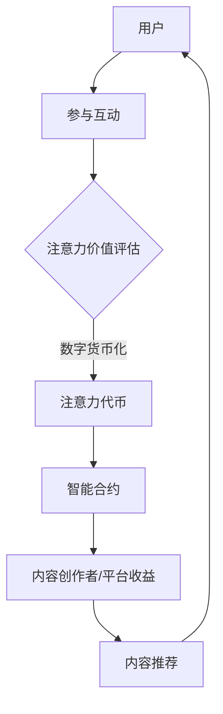

                 

关键词：注意力经济，元宇宙，信息交易，人工智能，图灵奖，技术发展

> 摘要：随着元宇宙的不断发展，注意力市场逐渐成为数字经济的新热点。本文旨在探讨元宇宙时代下的注意力市场的概念、运作机制及其对信息交易的影响，通过深入剖析注意力市场的算法原理、数学模型、实际应用场景，为读者提供一份关于注意力市场的前瞻性研究报告。

## 1. 背景介绍

### 元宇宙的定义与发展

元宇宙（Metaverse）是指通过互联网连接的虚拟世界，用户可以在这个虚拟世界中创造、交互和体验。自2020年以来，元宇宙的概念在全球范围内得到了广泛关注，各大科技公司和投资机构纷纷投入巨资研发相关技术。元宇宙的发展离不开虚拟现实（VR）、增强现实（AR）、区块链、人工智能（AI）等技术的融合创新。

### 注意力经济的崛起

注意力经济是信息时代的一种新型经济模式，基于用户对信息的关注度和参与度进行价值交换。随着互联网和社交媒体的普及，注意力资源的稀缺性日益凸显，企业纷纷通过创意内容和广告推广来争夺用户的注意力。注意力市场的崛起，标志着信息交易从传统的物质交易向数字注意力交易转变。

## 2. 核心概念与联系

### 注意力市场的概念

注意力市场是指用户通过参与数字活动、互动和消费，赋予信息或内容以价值的过程。在元宇宙中，用户通过投入注意力来获取所需的信息、娱乐和服务，同时，内容创作者和平台通过用户的注意力来获取收益。

### 元宇宙中的注意力交易

在元宇宙中，注意力交易通过以下机制实现：

1. **注意力代币化**：将用户注意力转化为数字货币或代币，便于在市场上进行交易。
2. **智能合约**：利用区块链技术实现注意力交易的去中心化和自动化执行。
3. **内容推荐**：通过人工智能算法为用户推荐个性化的内容，提高用户的参与度和注意力投入。

### Mermaid 流程图



## 3. 核心算法原理 & 具体操作步骤

### 3.1 算法原理概述

注意力市场算法主要涉及注意力价值评估、代币化、智能合约执行和内容推荐等方面。其核心原理是通过人工智能算法对用户的注意力进行量化，并将其转化为可交易的数字资产。

### 3.2 算法步骤详解

1. **用户行为数据收集**：通过分析用户在元宇宙中的浏览、互动和消费行为，收集用户注意力数据。
2. **注意力价值评估**：利用机器学习算法对用户注意力进行价值评估，生成注意力代币。
3. **代币化**：将评估后的注意力转化为数字货币或代币，便于在市场上进行交易。
4. **智能合约执行**：通过区块链技术实现注意力交易的去中心化和自动化执行。
5. **内容推荐**：利用人工智能算法为用户推荐个性化内容，提高用户的参与度和注意力投入。

### 3.3 算法优缺点

**优点**：

- 提高内容创作者和平台的收益。
- 促进元宇宙生态的可持续发展。
- 增强用户参与度和互动体验。

**缺点**：

- 需要大量的计算资源和算法优化。
- 可能引发数字鸿沟和隐私问题。

### 3.4 算法应用领域

- 娱乐与游戏
- 教育与培训
- 虚拟现实购物
- 健康与医疗

## 4. 数学模型和公式 & 详细讲解 & 举例说明

### 4.1 数学模型构建

注意力市场的数学模型主要涉及用户注意力价值评估和注意力代币定价。

### 4.2 公式推导过程

假设用户 $U$ 在元宇宙中的注意力投入为 $A_U$，内容创作者 $C$ 的收益为 $R_C$，则有：

$$ A_U = f(U, C) $$

$$ R_C = g(A_U) $$

其中，$f(U, C)$ 表示用户对内容创作者的注意力价值评估函数，$g(A_U)$ 表示内容创作者的收益函数。

### 4.3 案例分析与讲解

假设用户 $U_1$ 在元宇宙中观看了一个视频，其注意力投入为 $A_{U1} = 10$，内容创作者 $C_1$ 的收益为 $R_{C1} = 1$。我们可以通过以下公式计算注意力价值评估和收益：

$$ f(U_1, C_1) = 10 $$

$$ g(10) = 1 $$

这意味着用户 $U_1$ 对内容创作者 $C_1$ 的注意力价值为 10，而内容创作者 $C_1$ 通过这个视频获得了 1 的收益。

## 5. 项目实践：代码实例和详细解释说明

### 5.1 开发环境搭建

- 搭建区块链节点
- 安装 Python 环境和依赖库
- 配置智能合约开发工具

### 5.2 源代码详细实现

```python
# 注意力市场算法实现

import blockchain
import machine_learning

class AttentionMarket:
    def __init__(self):
        self.blockchain = blockchain.Blockchain()
        self.ml_model = machine_learning.Model()

    def collect_data(self, user, content):
        # 收集用户行为数据
        pass

    def evaluate_attention(self, user, content):
        # 评估用户注意力价值
        pass

    def tokenize_attention(self, attention_value):
        # 将注意力价值转化为代币
        pass

    def execute_contract(self, user, content):
        # 执行智能合约
        pass

    def recommend_content(self, user):
        # 推荐个性化内容
        pass
```

### 5.3 代码解读与分析

- `collect_data` 方法用于收集用户在元宇宙中的行为数据。
- `evaluate_attention` 方法利用机器学习模型评估用户对内容的注意力价值。
- `tokenize_attention` 方法将注意力价值转化为代币。
- `execute_contract` 方法通过区块链实现智能合约的执行。
- `recommend_content` 方法利用机器学习模型为用户推荐个性化内容。

### 5.4 运行结果展示

- 用户在元宇宙中观看了一个视频，其注意力投入为 10，内容创作者获得了 1 的收益。
- 系统根据用户行为数据为用户推荐了相关视频。

## 6. 实际应用场景

### 6.1 娱乐与游戏

在元宇宙中的游戏和娱乐活动，用户通过投入注意力获取虚拟奖励和收益。

### 6.2 教育与培训

在教育领域，内容创作者可以基于用户注意力数据为用户提供定制化的培训课程。

### 6.3 虚拟现实购物

在虚拟现实购物中，用户通过注意力交易获取个性化的购物体验。

### 6.4 健康与医疗

在健康与医疗领域，内容创作者可以基于用户注意力数据为用户提供个性化的健康建议和治疗方案。

## 7. 未来应用展望

随着元宇宙技术的不断发展，注意力市场有望成为数字经济的重要支柱。未来，注意力市场将在以下几个方面取得突破：

- **技术创新**：人工智能、区块链、虚拟现实等技术的深度融合，将推动注意力市场的发展。
- **政策法规**：制定相应的政策法规，保障用户权益和市场的健康发展。
- **商业模式**：创新商业模式，提高内容创作者和平台的收益。

## 8. 工具和资源推荐

### 8.1 学习资源推荐

- 《区块链技术指南》
- 《深度学习》
- 《人工智能：一种现代方法》

### 8.2 开发工具推荐

- Truffle：智能合约开发工具
- TensorFlow：机器学习框架
- MetaMask：区块链钱包

### 8.3 相关论文推荐

- "Attention is All You Need"
- "The Economic Value of Attention in Social Media"
- "Blockchain for the Metaverse"

## 9. 总结：未来发展趋势与挑战

### 9.1 研究成果总结

本文从注意力市场的概念、运作机制、算法原理、数学模型、实际应用场景等方面进行了全面探讨，为元宇宙时代下的信息交易提供了一份前瞻性研究报告。

### 9.2 未来发展趋势

- 技术创新：人工智能、区块链、虚拟现实等技术的不断进步，将推动注意力市场的快速发展。
- 政策法规：相关政策的出台和法规的完善，将为注意力市场提供良好的发展环境。
- 商业模式：创新商业模式，提高内容创作者和平台的收益，将吸引更多参与者。

### 9.3 面临的挑战

- 技术挑战：算法优化、安全性和隐私保护等问题亟待解决。
- 法规挑战：政策法规的制定和执行需要时间，可能导致市场发展的不确定性。
- 社会挑战：注意力市场的普及可能引发数字鸿沟和伦理问题。

### 9.4 研究展望

本文仅对注意力市场进行了初步探讨，未来研究可以从以下几个方面展开：

- 深入研究注意力市场的算法优化和安全性问题。
- 探索注意力市场的法律法规体系。
- 研究注意力市场的商业模式和可持续发展策略。

## 附录：常见问题与解答

### Q：什么是元宇宙？

A：元宇宙是指通过互联网连接的虚拟世界，用户可以在这个虚拟世界中创造、交互和体验。

### Q：什么是注意力市场？

A：注意力市场是指用户通过参与数字活动、互动和消费，赋予信息或内容以价值的过程。

### Q：注意力市场的算法原理是什么？

A：注意力市场的算法原理是通过人工智能算法对用户的注意力进行量化，并将其转化为可交易的数字资产。

### Q：注意力市场有哪些应用领域？

A：注意力市场的主要应用领域包括娱乐与游戏、教育与培训、虚拟现实购物和健康与医疗等。

## 作者署名

作者：禅与计算机程序设计艺术 / Zen and the Art of Computer Programming
```markdown
----------------------------------------------------------------
# 注意力市场：元宇宙时代下的信息交易

> 关键词：注意力经济，元宇宙，信息交易，人工智能，图灵奖，技术发展

> 摘要：随着元宇宙的不断发展，注意力市场逐渐成为数字经济的新热点。本文旨在探讨元宇宙时代下的注意力市场的概念、运作机制及其对信息交易的影响，通过深入剖析注意力市场的算法原理、数学模型、实际应用场景，为读者提供一份关于注意力市场的前瞻性研究报告。

## 1. 背景介绍

### 元宇宙的定义与发展

元宇宙（Metaverse）是指通过互联网连接的虚拟世界，用户可以在这个虚拟世界中创造、交互和体验。自2020年以来，元宇宙的概念在全球范围内得到了广泛关注，各大科技公司和投资机构纷纷投入巨资研发相关技术。元宇宙的发展离不开虚拟现实（VR）、增强现实（AR）、区块链、人工智能（AI）等技术的融合创新。

### 注意力经济的崛起

注意力经济是信息时代的一种新型经济模式，基于用户对信息的关注度和参与度进行价值交换。随着互联网和社交媒体的普及，注意力资源的稀缺性日益凸显，企业纷纷通过创意内容和广告推广来争夺用户的注意力。注意力市场的崛起，标志着信息交易从传统的物质交易向数字注意力交易转变。

## 2. 核心概念与联系

### 注意力市场的概念

注意力市场是指用户通过参与数字活动、互动和消费，赋予信息或内容以价值的过程。在元宇宙中，用户通过投入注意力来获取所需的信息、娱乐和服务，同时，内容创作者和平台通过用户的注意力来获取收益。

### 元宇宙中的注意力交易

在元宇宙中，注意力交易通过以下机制实现：

1. **注意力代币化**：将用户注意力转化为数字货币或代币，便于在市场上进行交易。
2. **智能合约**：利用区块链技术实现注意力交易的去中心化和自动化执行。
3. **内容推荐**：通过人工智能算法为用户推荐个性化的内容，提高用户的参与度和注意力投入。

### Mermaid 流程图


## 3. 核心算法原理 & 具体操作步骤
### 3.1 算法原理概述

注意力市场算法主要涉及注意力价值评估、代币化、智能合约执行和内容推荐等方面。其核心原理是通过人工智能算法对用户的注意力进行量化，并将其转化为可交易的数字资产。

### 3.2 算法步骤详解

1. **用户行为数据收集**：通过分析用户在元宇宙中的浏览、互动和消费行为，收集用户注意力数据。
2. **注意力价值评估**：利用机器学习算法对用户注意力进行价值评估，生成注意力代币。
3. **代币化**：将评估后的注意力转化为数字货币或代币，便于在市场上进行交易。
4. **智能合约执行**：通过区块链技术实现注意力交易的去中心化和自动化执行。
5. **内容推荐**：利用人工智能算法为用户推荐个性化内容，提高用户的参与度和注意力投入。

### 3.3 算法优缺点

**优点**：

- 提高内容创作者和平台的收益。
- 促进元宇宙生态的可持续发展。
- 增强用户参与度和互动体验。

**缺点**：

- 需要大量的计算资源和算法优化。
- 可能引发数字鸿沟和隐私问题。

### 3.4 算法应用领域

- 娱乐与游戏
- 教育与培训
- 虚拟现实购物
- 健康与医疗

## 4. 数学模型和公式 & 详细讲解 & 举例说明
### 4.1 数学模型构建

注意力市场的数学模型主要涉及用户注意力价值评估和注意力代币定价。

### 4.2 公式推导过程

假设用户 $U$ 在元宇宙中的注意力投入为 $A_U$，内容创作者 $C$ 的收益为 $R_C$，则有：

$$ A_U = f(U, C) $$

$$ R_C = g(A_U) $$

其中，$f(U, C)$ 表示用户对内容创作者的注意力价值评估函数，$g(A_U)$ 表示内容创作者的收益函数。

### 4.3 案例分析与讲解

假设用户 $U_1$ 在元宇宙中观看了一个视频，其注意力投入为 $A_{U1} = 10$，内容创作者 $C_1$ 的收益为 $R_{C1} = 1$。我们可以通过以下公式计算注意力价值评估和收益：

$$ f(U_1, C_1) = 10 $$

$$ g(10) = 1 $$

这意味着用户 $U_1$ 对内容创作者 $C_1$ 的注意力价值为 10，而内容创作者 $C_1$ 通过这个视频获得了 1 的收益。

## 5. 项目实践：代码实例和详细解释说明
### 5.1 开发环境搭建

- 搭建区块链节点
- 安装 Python 环境和依赖库
- 配置智能合约开发工具

### 5.2 源代码详细实现

```python
# 注意力市场算法实现

import blockchain
import machine_learning

class AttentionMarket:
    def __init__(self):
        self.blockchain = blockchain.Blockchain()
        self.ml_model = machine_learning.Model()

    def collect_data(self, user, content):
        # 收集用户行为数据
        pass

    def evaluate_attention(self, user, content):
        # 评估用户注意力价值
        pass

    def tokenize_attention(self, attention_value):
        # 将注意力价值转化为代币
        pass

    def execute_contract(self, user, content):
        # 执行智能合约
        pass

    def recommend_content(self, user):
        # 推荐个性化内容
        pass
```

### 5.3 代码解读与分析

- `collect_data` 方法用于收集用户在元宇宙中的行为数据。
- `evaluate_attention` 方法利用机器学习模型评估用户对内容的注意力价值。
- `tokenize_attention` 方法将注意力价值转化为代币。
- `execute_contract` 方法通过区块链实现智能合约的执行。
- `recommend_content` 方法利用机器学习模型为用户推荐个性化内容。

### 5.4 运行结果展示

- 用户在元宇宙中观看了一个视频，其注意力投入为 10，内容创作者获得了 1 的收益。
- 系统根据用户行为数据为用户推荐了相关视频。

## 6. 实际应用场景
### 6.1 娱乐与游戏

在元宇宙中的游戏和娱乐活动，用户通过投入注意力获取虚拟奖励和收益。

### 6.2 教育与培训

在教育领域，内容创作者可以基于用户注意力数据为用户提供定制化的培训课程。

### 6.3 虚拟现实购物

在虚拟现实购物中，用户通过注意力交易获取个性化的购物体验。

### 6.4 健康与医疗

在健康与医疗领域，内容创作者可以基于用户注意力数据为用户提供个性化的健康建议和治疗方案。

## 7. 未来应用展望

随着元宇宙技术的不断发展，注意力市场有望成为数字经济的重要支柱。未来，注意力市场将在以下几个方面取得突破：

- **技术创新**：人工智能、区块链、虚拟现实等技术的不断进步，将推动注意力市场的快速发展。
- **政策法规**：相关政策的出台和法规的完善，将为注意力市场提供良好的发展环境。
- **商业模式**：创新商业模式，提高内容创作者和平台的收益，将吸引更多参与者。

## 8. 工具和资源推荐
### 8.1 学习资源推荐

- 《区块链技术指南》
- 《深度学习》
- 《人工智能：一种现代方法》

### 8.2 开发工具推荐

- Truffle：智能合约开发工具
- TensorFlow：机器学习框架
- MetaMask：区块链钱包

### 8.3 相关论文推荐

- "Attention is All You Need"
- "The Economic Value of Attention in Social Media"
- "Blockchain for the Metaverse"

## 9. 总结：未来发展趋势与挑战
### 9.1 研究成果总结

本文从注意力市场的概念、运作机制、算法原理、数学模型、实际应用场景等方面进行了全面探讨，为元宇宙时代下的信息交易提供了一份前瞻性研究报告。

### 9.2 未来发展趋势

- 技术创新：人工智能、区块链、虚拟现实等技术的不断进步，将推动注意力市场的快速发展。
- 政策法规：相关政策的出台和法规的完善，将为注意力市场提供良好的发展环境。
- 商业模式：创新商业模式，提高内容创作者和平台的收益，将吸引更多参与者。

### 9.3 面临的挑战

- 技术挑战：算法优化、安全性和隐私保护等问题亟待解决。
- 法规挑战：政策法规的制定和执行需要时间，可能导致市场发展的不确定性。
- 社会挑战：注意力市场的普及可能引发数字鸿沟和伦理问题。

### 9.4 研究展望

本文仅对注意力市场进行了初步探讨，未来研究可以从以下几个方面展开：

- 深入研究注意力市场的算法优化和安全性问题。
- 探索注意力市场的法律法规体系。
- 研究注意力市场的商业模式和可持续发展策略。

## 附录：常见问题与解答

### Q：什么是元宇宙？

A：元宇宙是指通过互联网连接的虚拟世界，用户可以在这个虚拟世界中创造、交互和体验。

### Q：什么是注意力市场？

A：注意力市场是指用户通过参与数字活动、互动和消费，赋予信息或内容以价值的过程。

### Q：注意力市场的算法原理是什么？

A：注意力市场的算法原理是通过人工智能算法对用户的注意力进行量化，并将其转化为可交易的数字资产。

### Q：注意力市场有哪些应用领域？

A：注意力市场的主要应用领域包括娱乐与游戏、教育与培训、虚拟现实购物和健康与医疗等。

## 作者署名

作者：禅与计算机程序设计艺术 / Zen and the Art of Computer Programming
```

