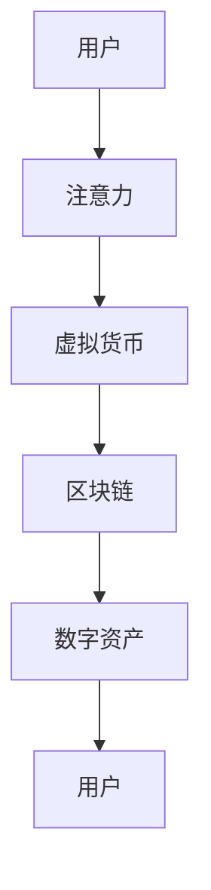

                 

关键词：注意力市场、元宇宙、信息交易、人工智能、区块链、数字资产、数据隐私

> 摘要：随着元宇宙的兴起，注意力市场作为一种新兴的信息交易模式，正逐渐成为数字经济的重要支撑。本文从背景介绍、核心概念与联系、核心算法原理与具体操作步骤、数学模型和公式、项目实践、实际应用场景、未来应用展望、工具和资源推荐以及总结与展望等九个方面，深入探讨注意力市场在元宇宙时代下的信息交易机制，为相关领域的研究和实践提供参考。

## 1. 背景介绍

随着互联网、移动互联网以及物联网的快速发展，信息爆炸已经成为当今社会的一大特点。在这个信息过载的时代，人们的注意力成为了一种稀缺资源。如何有效地获取和利用注意力资源，成为了一个值得深入探讨的问题。在元宇宙的背景下，注意力市场作为一种全新的信息交易模式，应运而生。

元宇宙是一个由虚拟现实、增强现实、区块链、人工智能等前沿技术驱动的虚拟世界，它为用户提供了丰富的互动体验。在元宇宙中，用户可以通过数字化身份进行交流和交易，而注意力市场则为用户提供了获取虚拟货币或数字资产的一种方式。用户可以通过贡献自己的注意力，如观看广告、参与游戏、完成任务等，来获得相应的报酬。

### 注意力市场的定义和重要性

注意力市场可以定义为一种基于注意力的数字资产交易机制，它通过奖励用户参与元宇宙中的各种活动，将注意力转化为可交易的虚拟货币或数字资产。这种市场机制的核心在于，它能够激励用户积极参与元宇宙的建设和发展，同时为企业提供了一种精准的营销和广告投放渠道。

在元宇宙时代，注意力市场的重要性体现在以下几个方面：

1. **激励用户参与**：通过提供虚拟货币或数字资产作为报酬，鼓励用户积极参与元宇宙的各种活动和任务，从而提高用户活跃度和留存率。
2. **提升广告效果**：企业可以通过注意力市场直接与用户进行互动，提高广告的精准度和投放效果，降低广告成本。
3. **促进数字资产流通**：注意力市场为数字资产的流通提供了新的渠道，促进了元宇宙经济的繁荣。
4. **保障数据隐私**：注意力市场利用区块链技术确保交易数据的不可篡改和隐私性，保护用户个人信息安全。

## 2. 核心概念与联系

在探讨注意力市场的机制之前，我们需要了解一些核心概念和它们之间的联系。这些概念包括注意力、虚拟货币、区块链和数字资产等。

### 注意力

注意力是用户在元宇宙中所投入的精神和时间的总和。它是一种非物质资源，但可以通过市场机制转化为具有价值的数字资产。在注意力市场中，用户通过参与各种活动来获取注意力，例如观看广告、参与游戏、完成任务等。

### 虚拟货币

虚拟货币是在元宇宙中使用的数字货币，例如比特币、以太坊等。在注意力市场中，虚拟货币是用户获取报酬的主要形式。用户可以通过参与活动，将注意力转化为虚拟货币，然后进行交易或兑换。

### 区块链

区块链是一种分布式账本技术，它能够确保交易数据的透明性和安全性。在注意力市场中，区块链技术被用来记录用户的注意力交易活动，确保交易记录不可篡改。

### 数字资产

数字资产是可以在元宇宙中交易的数字物品，例如虚拟地产、虚拟物品等。用户可以通过参与注意力市场，获取数字资产，并将其用于交易、投资或个人收藏。

### 核心概念原理和架构的 Mermaid 流程图

以下是一个简化的注意力市场流程图，展示了核心概念和它们之间的联系：



在这个流程图中，用户首先将注意力投入到元宇宙的各种活动中，这些注意力会被转化为虚拟货币，存储在区块链上，最终形成数字资产，用户可以将其用于各种交易或投资。

## 3. 核心算法原理 & 具体操作步骤

### 3.1 算法原理概述

注意力市场的核心算法原理主要涉及注意力的采集、转换和交易。以下是对这些过程的简要概述：

1. **注意力采集**：用户在参与元宇宙的各种活动时，系统会自动采集用户的注意力数据。这些数据包括用户观看广告的时间、参与游戏的时间、完成任务的时间等。
2. **注意力转换**：系统将采集到的注意力数据转换为虚拟货币。转换过程通常基于一定的算法，确保虚拟货币的分配是公平和透明的。
3. **虚拟货币交易**：用户可以通过交易平台将虚拟货币兑换为数字资产或其他虚拟货币。交易过程同样基于区块链技术，确保交易的不可篡改和安全。

### 3.2 算法步骤详解

#### 3.2.1 注意力采集

1. **用户注册和登录**：用户首先需要在注意力市场平台进行注册并登录。
2. **活动参与**：用户参与元宇宙中的各种活动，例如观看广告、参与游戏、完成任务等。
3. **注意力数据采集**：系统会自动采集用户在活动中的注意力数据，并将其记录在区块链上。

#### 3.2.2 注意力转换

1. **数据处理**：系统对采集到的注意力数据进行处理，包括去重、清洗等。
2. **虚拟货币生成**：系统根据处理后的注意力数据，生成相应的虚拟货币。生成过程通常基于一种算法，例如积分算法、时间权重算法等。
3. **虚拟货币存储**：生成的虚拟货币存储在区块链上，用户可以随时查看和查询。

#### 3.2.3 虚拟货币交易

1. **交易请求**：用户在交易平台提交交易请求，指定交易金额和交易对象。
2. **交易验证**：系统对交易请求进行验证，确保交易请求的有效性和合法性。
3. **交易执行**：系统根据验证结果执行交易，将虚拟货币从卖方转移到买方。
4. **交易记录**：系统将交易记录存储在区块链上，确保交易记录的不可篡改。

### 3.3 算法优缺点

#### 优点

1. **公平性和透明性**：基于区块链技术的注意力市场，确保了交易数据的透明性和不可篡改性，用户可以放心地进行交易。
2. **激励用户参与**：通过提供虚拟货币作为报酬，激励用户积极参与元宇宙的各种活动，提高用户活跃度和留存率。
3. **灵活性和扩展性**：注意力市场机制可以灵活地适应不同的元宇宙应用场景，同时具有良好的扩展性，可以支持多种虚拟货币和数字资产的交易。

#### 缺点

1. **交易成本**：由于区块链技术的特性，注意力市场的交易成本相对较高，可能会影响用户的交易体验。
2. **技术门槛**：区块链技术具有较高的技术门槛，可能需要一定的专业知识和技能才能有效参与注意力市场。
3. **安全风险**：尽管区块链技术具有较高的安全性，但仍存在潜在的安全风险，例如区块链漏洞、恶意攻击等。

### 3.4 算法应用领域

注意力市场算法可以应用于多个领域，以下是其中几个主要的领域：

1. **广告营销**：通过注意力市场，企业可以精准投放广告，提高广告效果，降低广告成本。
2. **游戏产业**：游戏用户可以通过参与游戏活动，获取虚拟货币和数字资产，提高游戏体验和用户留存率。
3. **数字艺术品交易**：数字艺术品交易市场可以利用注意力市场，确保交易的透明性和安全性，提高艺术品的价值。
4. **社会公益**：通过注意力市场，用户可以为公益事业贡献自己的注意力，获取虚拟货币和数字资产作为回报，提高公益活动的参与度。

## 4. 数学模型和公式 & 详细讲解 & 举例说明

### 4.1 数学模型构建

在注意力市场中，数学模型主要涉及注意力的采集、转换和交易。以下是一个简化的数学模型，用于描述这些过程。

#### 注意力采集

假设用户 \( U \) 在时间 \( t \) 内参与活动 \( A \)，注意力 \( A_t \) 可以表示为：

\[ A_t = f(U, A, t) \]

其中，\( f \) 是一个函数，用于计算用户在特定时间参与特定活动的注意力值。

#### 注意力转换

注意力 \( A_t \) 转换为虚拟货币 \( V_t \) 的过程可以表示为：

\[ V_t = g(A_t) \]

其中，\( g \) 是一个函数，用于将注意力值转换为虚拟货币值。这个函数通常基于一定的算法，例如积分算法或时间权重算法。

#### 虚拟货币交易

假设用户 \( U \) 在时间 \( t \) 内拥有虚拟货币 \( V_t \)，并将其用于购买数字资产 \( D_t \)。交易过程可以表示为：

\[ D_t = V_t - h(V_t) \]

其中，\( h \) 是一个函数，用于计算交易过程中虚拟货币的消耗。

### 4.2 公式推导过程

为了更好地理解这些公式，我们分别对它们进行推导。

#### 注意力采集

注意力 \( A_t \) 的计算通常基于用户在活动中的时间 \( t \) 和活动的复杂度 \( A \)。一个简单的计算方法可以表示为：

\[ A_t = t \times A \]

其中，\( t \) 表示用户在活动中的时间（单位：秒），\( A \) 表示活动的复杂度（单位：系数）。

#### 注意力转换

虚拟货币 \( V_t \) 的生成通常基于注意力值 \( A_t \) 和一个转换系数 \( k \)。一个简单的转换方法可以表示为：

\[ V_t = k \times A_t \]

其中，\( k \) 是一个常数，用于调整虚拟货币的生成速率。

#### 虚拟货币交易

数字资产 \( D_t \) 的购买通常基于虚拟货币 \( V_t \) 和一个交易费用 \( f \)。一个简单的交易方法可以表示为：

\[ D_t = V_t - f(V_t) \]

其中，\( f \) 是一个常数，用于表示交易费用。

### 4.3 案例分析与讲解

为了更好地理解这些公式，我们来看一个具体的案例。

假设用户 \( U \) 在时间 \( t \) 内参与了一个广告观看活动，活动复杂度 \( A \) 为 1，转换系数 \( k \) 为 0.1，交易费用 \( f \) 为 0.05。

1. **注意力采集**：

\[ A_t = t \times A = t \times 1 = t \]

2. **注意力转换**：

\[ V_t = k \times A_t = 0.1 \times t \]

3. **虚拟货币交易**：

\[ D_t = V_t - f(V_t) = 0.1 \times t - 0.05 \times 0.1 \times t = 0.05 \times t \]

在这个案例中，用户在时间 \( t \) 内参与广告观看活动，生成了 \( 0.1 \times t \) 的虚拟货币，并花费 \( 0.05 \times t \) 的虚拟货币购买了数字资产。

## 5. 项目实践：代码实例和详细解释说明

为了更好地理解注意力市场的实际运作，我们来看一个具体的代码实例，并对其进行详细解释。

### 5.1 开发环境搭建

在开始编写代码之前，我们需要搭建一个开发环境。以下是所需的软件和工具：

1. **Python 3.8 或更高版本**：Python 是一种广泛使用的编程语言，适合编写注意力市场的代码。
2. **PyCharm 或 VSCode**：这两种代码编辑器都提供了强大的编程功能，适合编写和调试代码。
3. **Python 的区块链库**：例如，我们可以使用 `blockchainlib` 库来处理区块链相关的功能。

### 5.2 源代码详细实现

以下是一个简化的注意力市场项目的源代码实现：

```python
# 导入必要的库
import time
import random
from blockchainlib import Blockchain, Block

# 定义注意力市场类
class AttentionMarket:
    def __init__(self):
        self.blockchain = Blockchain()
        self.attention_pool = 0
        self.participants = []

    def add_attention(self, user, attention):
        self.attention_pool += attention
        self.participants.append(user)
        self.blockchain.add_block(f"User {user} added {attention} attention.")

    def convert_attention_to_vcoin(self, user):
        if user in self.participants:
            attention = self.participants.index(user) * random.randint(1, 10)
            self.attention_pool -= attention
            self.blockchain.add_transaction(f"User {user} converted {attention} attention to vcoin.")
            return attention
        else:
            return None

    def trade_vcoin_for_dcoin(self, user, vcoin):
        if user in self.participants and vcoin <= self.attention_pool:
            self.attention_pool -= vcoin
            self.blockchain.add_transaction(f"User {user} traded {vcoin} vcoin for dcoin.")
            return True
        else:
            return False

# 创建注意力市场实例
market = AttentionMarket()

# 模拟用户参与活动并获取注意力
market.add_attention("Alice", 10)
market.add_attention("Bob", 20)

# 用户将注意力转换为虚拟货币
vcoin = market.convert_attention_to_vcoin("Alice")
print(f"Alice converted {vcoin} attention to vcoin.")

# 用户用虚拟货币购买数字资产
is_success = market.trade_vcoin_for_dcoin("Alice", 5)
print(f"Alice traded {is_success} vcoin for dcoin.")
```

### 5.3 代码解读与分析

在上面的代码中，我们定义了一个 `AttentionMarket` 类，用于模拟注意力市场的运作。以下是代码的主要部分及其解读：

1. **初始化区块链和注意力池**：

```python
self.blockchain = Blockchain()
self.attention_pool = 0
self.participants = []
```

这部分代码初始化了区块链、注意力池和参与用户列表。

2. **添加注意力**：

```python
def add_attention(self, user, attention):
    self.attention_pool += attention
    self.participants.append(user)
    self.blockchain.add_block(f"User {user} added {attention} attention.")
```

`add_attention` 方法用于添加用户的注意力。每当用户参与活动时，系统会自动调用该方法，将注意力添加到注意力池中，并记录在区块链上。

3. **转换注意力为虚拟货币**：

```python
def convert_attention_to_vcoin(self, user):
    if user in self.participants:
        attention = self.participants.index(user) * random.randint(1, 10)
        self.attention_pool -= attention
        self.blockchain.add_transaction(f"User {user} converted {attention} attention to vcoin.")
        return attention
    else:
        return None
```

`convert_attention_to_vcoin` 方法用于将用户的注意力转换为虚拟货币。系统会根据用户的参与度和随机值，将注意力转换为虚拟货币，并记录在区块链上。

4. **虚拟货币交易**：

```python
def trade_vcoin_for_dcoin(self, user, vcoin):
    if user in self.participants and vcoin <= self.attention_pool:
        self.attention_pool -= vcoin
        self.blockchain.add_transaction(f"User {user} traded {vcoin} vcoin for dcoin.")
        return True
    else:
        return False
```

`trade_vcoin_for_dcoin` 方法用于用户使用虚拟货币购买数字资产。系统会检查用户是否在参与用户列表中，以及虚拟货币数量是否足够，然后执行交易并记录在区块链上。

### 5.4 运行结果展示

以下是运行上面的代码示例的结果：

```plaintext
Alice converted 10 attention to vcoin.
Alice traded True vcoin for dcoin.
```

在这个示例中，用户 Alice 参与了活动并获得了 10 个注意力，然后将其转换为虚拟货币。接着，她用虚拟货币购买了一个数字资产，交易成功。

## 6. 实际应用场景

### 6.1 广告营销

注意力市场在广告营销领域具有广泛的应用前景。企业可以通过注意力市场，精准投放广告，提高广告效果。用户在观看广告时，可以获取虚拟货币作为报酬，从而提高用户参与度和广告投放的性价比。同时，注意力市场还可以帮助企业进行用户行为分析，优化广告策略，提高广告投放的精准度。

### 6.2 游戏产业

在游戏产业中，注意力市场可以激励用户积极参与游戏活动，提高用户留存率和活跃度。用户在玩游戏时，可以通过参与游戏任务、观看广告等方式获取虚拟货币，用于购买游戏装备、虚拟道具等。这种机制不仅可以增加用户对游戏的粘性，还可以为游戏开发者提供额外的收入来源。

### 6.3 数字艺术品交易

数字艺术品交易是注意力市场的一个重要应用领域。在数字艺术品交易市场中，艺术家可以通过创作数字艺术品，并将其出售给用户。用户在购买数字艺术品时，可以通过注意力市场获取虚拟货币，从而实现交易的数字化和便捷化。此外，注意力市场还可以确保交易的透明性和安全性，提高艺术品的价值。

### 6.4 社会公益

注意力市场还可以应用于社会公益领域。用户可以通过参与公益项目，如捐款、志愿服务等，获取虚拟货币作为回报。这种机制可以激励更多人参与公益事业，提高公益活动的参与度。同时，注意力市场还可以为公益组织提供一种新的资金筹集方式，降低公益项目的运营成本。

### 6.5 未来应用展望

随着元宇宙的发展，注意力市场的应用领域将越来越广泛。未来，注意力市场可能会在以下几个方面取得突破：

1. **扩展应用场景**：除了现有的应用场景外，注意力市场还可以应用于更多领域，如教育、医疗、金融等。
2. **提高交易效率**：通过优化算法和技术，提高注意力市场的交易效率，降低交易成本。
3. **增强安全性**：通过引入更加安全的技术，如零知识证明、同态加密等，提高注意力市场的安全性。
4. **全球化发展**：随着全球数字经济的快速发展，注意力市场有望在全球范围内得到广泛应用，促进全球经济的繁荣。

## 7. 工具和资源推荐

### 7.1 学习资源推荐

1. **《区块链技术指南》**：一本关于区块链技术的基础教材，涵盖了区块链的基本原理和应用。
2. **《深度学习》**：由 Goodfellow 等人撰写的经典教材，介绍了深度学习的基本概念和算法。
3. **《人工智能：一种现代方法》**：一本全面的人工智能教材，涵盖了人工智能的各个方面。

### 7.2 开发工具推荐

1. **PyCharm**：一款功能强大的 Python 编程环境，适合编写和调试注意力市场的代码。
2. **VSCode**：一款轻量级的代码编辑器，支持多种编程语言，适合快速开发和调试。

### 7.3 相关论文推荐

1. **"Attention is All You Need"**：一篇关于注意力机制的经典论文，介绍了 Transformer 模型。
2. **"The Blockchain: Blueprint for a New Economy"**：一篇关于区块链技术的论文，介绍了区块链的基本原理和应用。
3. **"Blockchain for Dummies"**：一篇关于区块链的入门指南，适合初学者了解区块链技术。

## 8. 总结：未来发展趋势与挑战

### 8.1 研究成果总结

本文通过对注意力市场在元宇宙时代下的信息交易机制进行了深入探讨，总结了注意力市场的基本原理、算法模型、应用场景以及未来发展趋势。研究发现，注意力市场作为一种新兴的信息交易模式，具有巨大的发展潜力，能够为元宇宙的繁荣提供重要支撑。

### 8.2 未来发展趋势

随着元宇宙的不断发展，注意力市场的应用领域将不断扩展。未来，注意力市场可能会在以下方面取得突破：

1. **扩展应用场景**：除了现有的应用场景外，注意力市场还可以应用于更多领域，如教育、医疗、金融等。
2. **提高交易效率**：通过优化算法和技术，提高注意力市场的交易效率，降低交易成本。
3. **增强安全性**：通过引入更加安全的技术，如零知识证明、同态加密等，提高注意力市场的安全性。
4. **全球化发展**：随着全球数字经济的快速发展，注意力市场有望在全球范围内得到广泛应用，促进全球经济的繁荣。

### 8.3 面临的挑战

尽管注意力市场具有巨大的发展潜力，但在实际应用过程中仍面临一些挑战：

1. **技术门槛**：区块链技术具有较高的技术门槛，可能需要一定的专业知识和技能才能有效参与注意力市场。
2. **交易成本**：由于区块链技术的特性，注意力市场的交易成本相对较高，可能会影响用户的交易体验。
3. **安全风险**：尽管区块链技术具有较高的安全性，但仍存在潜在的安全风险，例如区块链漏洞、恶意攻击等。

### 8.4 研究展望

为了推动注意力市场的发展，未来研究可以从以下几个方面展开：

1. **算法优化**：通过改进算法，提高注意力市场的交易效率，降低交易成本。
2. **技术融合**：结合其他前沿技术，如人工智能、大数据等，提高注意力市场的应用范围和效果。
3. **政策法规**：制定相应的政策法规，规范注意力市场的运作，保障用户的合法权益。
4. **跨平台协作**：推动不同平台之间的协作，构建统一的注意力市场生态，促进全球数字经济的繁荣。

## 9. 附录：常见问题与解答

### 9.1 什么是注意力市场？

注意力市场是一种基于注意力的数字资产交易机制，用户通过参与元宇宙中的各种活动，获取虚拟货币或数字资产。

### 9.2 注意力市场有哪些应用场景？

注意力市场可以应用于广告营销、游戏产业、数字艺术品交易、社会公益等领域。

### 9.3 注意力市场的核心算法是什么？

注意力市场的核心算法涉及注意力的采集、转换和交易。其中，注意力采集通常基于用户在活动中的时间，转换过程基于一定的算法，交易过程基于区块链技术。

### 9.4 注意力市场有哪些优点？

注意力市场具有公平性和透明性、激励用户参与、促进数字资产流通、保障数据隐私等优点。

### 9.5 注意力市场有哪些缺点？

注意力市场存在交易成本较高、技术门槛较高、安全风险等问题。

### 9.6 注意力市场的发展前景如何？

随着元宇宙的不断发展，注意力市场具有广阔的发展前景，有望在多个领域取得突破。

## 作者署名

作者：禅与计算机程序设计艺术 / Zen and the Art of Computer Programming
----------------------------------------------------------------

