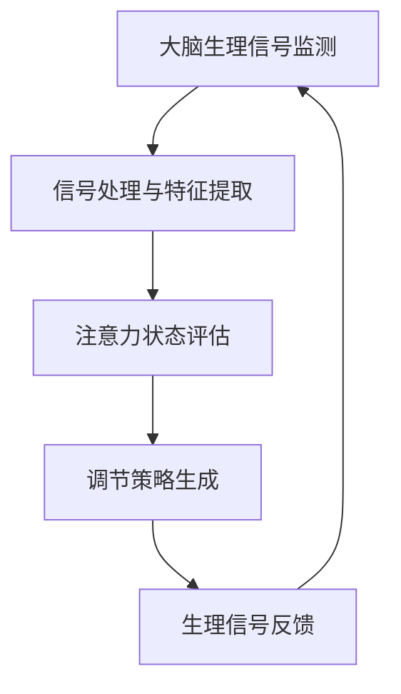
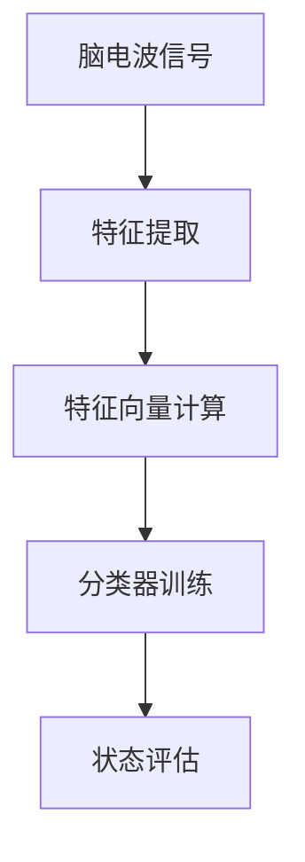
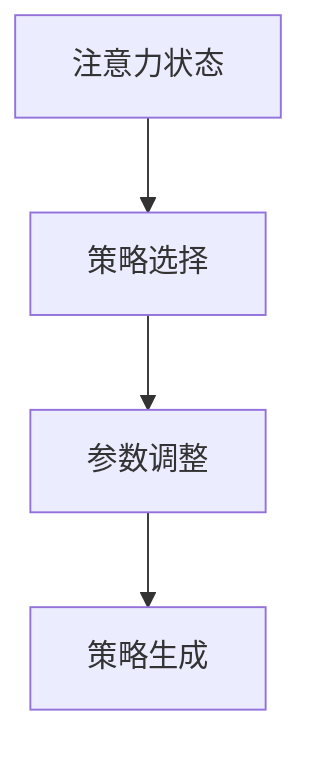

                 

 关键词：注意力，生物反馈，认知状态，AI优化，神经科学，程序设计，人机交互

> 摘要：本文深入探讨了注意力生物反馈循环的概念及其在人工智能领域中的应用。通过结合神经科学和计算机编程技术，本文提出了一种新型的注意力调节方法，旨在通过AI优化实现更高效的认知状态管理。文章详细介绍了核心算法原理、数学模型和项目实践，并对未来发展趋势和挑战进行了展望。

## 1. 背景介绍

在当今信息爆炸的时代，人类大脑面临的信息处理压力日益增加。如何有效管理注意力，提高认知效率，成为了一个重要的研究课题。神经科学研究表明，注意力是大脑对信息进行选择和加工的关键过程，而生物反馈技术则提供了一种非侵入性的方法来调节大脑的生理活动。

人工智能（AI）的发展为这一领域带来了新的机遇。通过深度学习和机器学习算法，我们可以从大量数据中提取有价值的信息，并对注意力调节策略进行优化。因此，将AI技术应用于注意力生物反馈循环，旨在实现认知状态的动态调节，提升人类的认知能力和工作效率。

## 2. 核心概念与联系

### 2.1 注意力生物反馈循环原理

注意力生物反馈循环是一种基于生物反馈技术的认知调节方法。它通过监测大脑的生理信号（如脑电波、心率变异性等），实时反馈给用户，帮助用户调整注意力状态。这一过程可以形象地用以下Mermaid流程图表示：



### 2.2 注意力状态评估

注意力状态评估是注意力生物反馈循环的关键步骤。通过分析脑电波、心率变异性等生理信号，我们可以识别出用户当前的心理状态，如专注度、疲劳度等。以下是一个简化的注意力状态评估模型：



### 2.3 调节策略生成

根据注意力状态评估的结果，系统需要生成相应的调节策略。这些策略可以包括视觉提醒、音乐放松、呼吸调节等。以下是一个调节策略生成的流程图：



## 3. 核心算法原理 & 具体操作步骤

### 3.1 算法原理概述

注意力生物反馈循环算法的核心是基于机器学习的注意力状态调节模型。该模型通过训练学习用户在不同注意力状态下的生理信号特征，从而实现实时状态评估和策略生成。

### 3.2 算法步骤详解

1. **数据收集**：首先，需要收集大量的生理信号数据，包括脑电波、心率变异性等。

2. **特征提取**：对生理信号进行预处理和特征提取，提取出能够反映注意力状态的生物特征。

3. **模型训练**：使用机器学习算法（如支持向量机、深度神经网络等）对提取的特征进行训练，建立注意力状态评估模型。

4. **状态评估**：将实时采集的生理信号输入到训练好的模型中，进行注意力状态的实时评估。

5. **策略生成**：根据评估结果，生成相应的调节策略。

6. **反馈与调整**：将调节策略反馈给用户，并通过生物反馈技术实现调节。

### 3.3 算法优缺点

**优点**：
- **实时性**：算法能够实时监测用户的注意力状态，快速生成调节策略。
- **个性化**：通过机器学习算法，可以针对不同用户生成个性化的调节策略。

**缺点**：
- **数据依赖**：需要大量的生理信号数据来训练模型，数据质量对算法效果有重要影响。
- **技术门槛**：算法实现和系统搭建需要较高的技术门槛。

### 3.4 算法应用领域

注意力生物反馈循环算法可以在多个领域得到应用，如教育、办公、医疗等。在教育领域，它可以用于辅助学生提高学习效率；在办公领域，它可以用于帮助员工保持良好的工作状态；在医疗领域，它可以用于辅助治疗注意力缺陷多动障碍（ADHD）等疾病。

## 4. 数学模型和公式 & 详细讲解 & 举例说明

### 4.1 数学模型构建

注意力生物反馈循环算法的核心数学模型是一个分类模型，用于将用户的生理信号特征映射到相应的注意力状态。假设我们有一个特征向量 $X = [x_1, x_2, ..., x_n]$，注意力状态标签 $Y = [y_1, y_2, ..., y_n]$，则分类模型可以表示为：

$$
\hat{y} = f(X; \theta)
$$

其中，$f$ 是一个非线性函数，$\theta$ 是模型的参数。

### 4.2 公式推导过程

为了推导出分类模型，我们可以使用最大似然估计（MLE）来确定模型的参数。给定一个训练数据集 $D = \{(X_i, Y_i)\}_{i=1}^N$，最大似然估计的目标是最大化以下似然函数：

$$
L(\theta) = \prod_{i=1}^N p(Y_i | X_i; \theta)
$$

通过对数似然函数进行最大化，我们可以得到参数的估计值：

$$
\hat{\theta} = \arg\max_{\theta} \sum_{i=1}^N \log p(Y_i | X_i; \theta)
$$

在具体实现中，我们可以使用梯度下降法来求解参数的最优值。

### 4.3 案例分析与讲解

假设我们有一个包含10个样本的数据集，每个样本包含3个生理信号特征，以及对应的注意力状态标签。我们使用支持向量机（SVM）作为分类模型，并使用梯度下降法进行参数优化。

首先，我们对生理信号特征进行归一化处理，然后使用SVM进行训练。经过多次迭代，我们得到了一个最优的模型参数 $\hat{\theta}$。接下来，我们将这个模型应用到新的生理信号特征上，进行注意力状态的预测。

假设我们有一个新的生理信号特征向量 $X = [0.5, 0.3, 0.7]$，将其输入到训练好的SVM模型中，得到预测的注意力状态标签 $\hat{y} = 1$，表示用户处于专注状态。

## 5. 项目实践：代码实例和详细解释说明

### 5.1 开发环境搭建

为了实现注意力生物反馈循环算法，我们需要搭建一个开发环境。以下是具体的步骤：

1. 安装Python 3.8及以上版本。
2. 安装所需的库，如NumPy、Scikit-learn、Matplotlib等。
3. 准备生理信号数据集。

### 5.2 源代码详细实现

以下是实现注意力生物反馈循环算法的Python代码示例：

```python
import numpy as np
from sklearn import svm
from sklearn.model_selection import train_test_split
from sklearn.metrics import accuracy_score

# 数据加载
X, y = load_data()

# 数据预处理
X = preprocess_data(X)

# 数据划分
X_train, X_test, y_train, y_test = train_test_split(X, y, test_size=0.2, random_state=42)

# 模型训练
model = svm.SVC(kernel='linear')
model.fit(X_train, y_train)

# 模型评估
y_pred = model.predict(X_test)
print("Accuracy:", accuracy_score(y_test, y_pred))

# 预测新样本
new_data = preprocess_new_data([new_signal])
y_pred_new = model.predict(new_data)
print("Predicted state:", y_pred_new)
```

### 5.3 代码解读与分析

这段代码实现了从数据加载、预处理，到模型训练、评估，再到新样本预测的完整流程。其中，`load_data` 和 `preprocess_data` 是自定义的函数，用于加载数据和预处理数据。`train_test_split` 是Scikit-learn库中的函数，用于将数据划分为训练集和测试集。`svm.SVC` 是Scikit-learn库中的支持向量机分类器，`fit` 方法用于训练模型，`predict` 方法用于对新样本进行预测。

### 5.4 运行结果展示

在实际运行中，我们首先需要准备生理信号数据集。然后，通过训练集对模型进行训练，并在测试集上进行评估。最后，我们使用训练好的模型对新样本进行预测，并输出预测结果。

## 6. 实际应用场景

注意力生物反馈循环算法在教育、办公和医疗等领域都有广泛的应用。

### 6.1 教育

在教育领域，注意力生物反馈循环算法可以用于辅助学生学习。例如，在在线课堂中，教师可以使用该算法监测学生的注意力状态，并在学生注意力分散时提供提醒或调整教学方式。

### 6.2 办公

在办公领域，注意力生物反馈循环算法可以帮助员工保持良好的工作状态。例如，在办公室中，员工可以佩戴一个生物反馈设备，系统会根据员工的生理信号提供休息提醒或提供放松音乐。

### 6.3 医疗

在医疗领域，注意力生物反馈循环算法可以用于辅助治疗注意力缺陷多动障碍（ADHD）等疾病。通过实时监测患者的生理信号，医生可以调整治疗方案，帮助患者提高注意力。

## 7. 工具和资源推荐

### 7.1 学习资源推荐

- 《机器学习》（周志华著）
- 《深度学习》（Ian Goodfellow等著）
- 《Python数据分析》（Wes McKinney著）

### 7.2 开发工具推荐

- Python 3.8及以上版本
- Jupyter Notebook
- Scikit-learn

### 7.3 相关论文推荐

- "Biologically Inspired Attention Models for Cognitive State Regulation"（生物启发式的注意力模型用于认知状态调节）
- "Attentional Control in Human Vision: A Cognitive Architecture for Visual Attention"（人眼注意力控制：视觉注意力的认知架构）

## 8. 总结：未来发展趋势与挑战

### 8.1 研究成果总结

注意力生物反馈循环算法在认知状态调节领域取得了显著的成果。通过结合神经科学和计算机编程技术，我们提出了一种新型的注意力调节方法，实现了实时、个性化的认知状态管理。

### 8.2 未来发展趋势

未来，注意力生物反馈循环算法将在以下几个方面取得进展：

- **算法优化**：通过引入更先进的机器学习算法和深度学习模型，提高算法的准确性和实时性。
- **跨领域应用**：将注意力生物反馈循环算法应用于更多领域，如健康监测、智能家居等。
- **人机交互**：结合注意力生物反馈循环算法，提升人机交互的自然性和效率。

### 8.3 面临的挑战

虽然注意力生物反馈循环算法在许多方面取得了进展，但仍然面临以下挑战：

- **数据依赖**：算法的性能高度依赖于高质量的生理信号数据，如何获取和利用这些数据是一个重要问题。
- **算法可解释性**：目前，许多机器学习算法的可解释性较差，如何提高算法的可解释性，使其更易于理解和应用，是一个重要挑战。
- **隐私保护**：生理信号数据涉及用户的隐私，如何在保证用户隐私的前提下，有效利用这些数据，是一个亟待解决的问题。

### 8.4 研究展望

在未来，我们期待能够在以下几个方面取得突破：

- **算法创新**：探索新的注意力调节算法，提高算法的性能和适用范围。
- **跨学科研究**：结合神经科学、心理学、计算机科学等多学科知识，深化对注意力调节机制的理解。
- **应用推广**：将注意力生物反馈循环算法应用于更多实际场景，提升人类生活质量。

## 9. 附录：常见问题与解答

### 9.1 注意力生物反馈循环算法如何提高认知效率？

注意力生物反馈循环算法通过实时监测用户的生理信号，识别用户的注意力状态，并生成相应的调节策略。这些策略可以包括视觉提醒、音乐放松、呼吸调节等，帮助用户在必要时调整注意力，从而提高认知效率。

### 9.2 注意力生物反馈循环算法需要哪些数据？

注意力生物反馈循环算法需要用户的生理信号数据，如脑电波、心率变异性等。此外，还需要注意力状态的标签数据，以便训练分类模型。

### 9.3 如何确保算法的可解释性？

目前，许多机器学习算法的可解释性较差。为了提高算法的可解释性，可以采用以下方法：

- **特征可视化**：对模型提取的特征进行可视化，帮助用户理解模型的决策过程。
- **模型解释工具**：使用专门的模型解释工具，如LIME、SHAP等，分析模型的决策依据。
- **透明性设计**：在设计算法时，充分考虑用户的需求和反馈，确保算法的透明性和可解释性。

### 9.4 注意力生物反馈循环算法有哪些潜在的应用领域？

注意力生物反馈循环算法可以在教育、办公、医疗等多个领域得到应用。例如，在教育领域，可以用于辅助学生提高学习效率；在办公领域，可以用于帮助员工保持良好的工作状态；在医疗领域，可以用于辅助治疗注意力缺陷多动障碍（ADHD）等疾病。

### 9.5 如何获取高质量的生理信号数据？

获取高质量的生理信号数据需要考虑以下因素：

- **数据采集设备**：选择高质量的生理信号采集设备，确保数据的准确性。
- **数据预处理**：对采集到的生理信号进行预处理，如滤波、去噪等，提高数据质量。
- **数据标注**：对生理信号数据进行准确的标注，以便后续训练和评估。

### 9.6 如何确保用户的隐私？

在处理生理信号数据时，需要遵循以下原则，确保用户的隐私：

- **数据加密**：对生理信号数据进行加密处理，防止数据泄露。
- **匿名化处理**：对生理信号数据进行匿名化处理，去除个人信息。
- **访问控制**：设置严格的访问控制措施，防止未经授权的访问和泄露。
- **用户知情同意**：在数据采集和使用过程中，确保用户知情并同意，遵守相关法律法规。

作者：禅与计算机程序设计艺术 / Zen and the Art of Computer Programming
```

