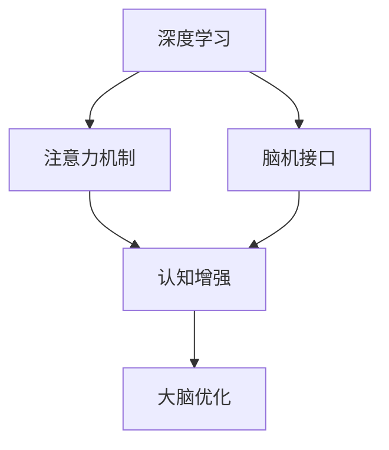

                 

关键词：人工智能，认知增强，神经网络，生物黑客，深度学习，注意力机制，脑机接口

> 摘要：本文探讨了人工智能与生物学的交汇领域，提出了一种名为“注意力生物黑客联盟”的新型AI优化认知增强网络。通过结合深度学习、注意力机制和脑机接口技术，本文详细阐述了该网络的架构、算法原理及其在认知增强和大脑优化中的应用。文章旨在为研究人员提供一种新的研究思路和方法，推动人工智能与生物学领域的融合与发展。

## 1. 背景介绍

随着人工智能（AI）技术的飞速发展，机器学习、神经网络、深度学习等核心算法已经取得了令人瞩目的成果。然而，传统的人工智能模型在处理复杂认知任务时仍存在诸多局限。与此同时，生物学的进展也为认知增强提供了新的可能性。人脑作为自然界最复杂的系统之一，其计算能力和信息处理能力远超现有计算机。因此，将人工智能与生物学相结合，探索人脑与计算机的协同作用，成为当前研究的热点之一。

脑机接口（Brain-Computer Interface，BCI）作为一种直接连接人脑与外部设备的接口，为人脑与计算机的交互提供了可能。通过捕捉大脑信号，BCI技术可以将人的思维、情感等内在信息转化为可操作的数据，从而实现对机器的控制和调节。同时，深度学习作为一种能够自动从数据中学习复杂模式的算法，为人工智能在认知增强领域的应用提供了技术支持。

在这背景下，本文提出了一种名为“注意力生物黑客联盟”的AI优化认知增强网络。该网络结合了深度学习、注意力机制和脑机接口技术，旨在通过优化人脑的计算效率和认知能力，实现认知增强和大脑优化。

## 2. 核心概念与联系

### 2.1 深度学习

深度学习是一种基于多层神经网络的结构，通过多层非线性变换对输入数据进行特征提取和模式识别。其核心思想是通过逐层传递和调整神经元之间的权重，使网络能够自动学习数据中的复杂结构。深度学习在图像识别、语音识别、自然语言处理等领域取得了显著的成果。

### 2.2 注意力机制

注意力机制是一种通过分配不同权重来关注不同信息的能力。在人脑中，注意力机制使我们能够在处理大量信息时，有选择地关注重要信息，从而提高认知效率和准确性。在深度学习中，注意力机制被广泛应用于图像识别、文本生成等领域，以实现模型对重要信息的聚焦。

### 2.3 脑机接口

脑机接口（BCI）是一种直接连接人脑与外部设备的接口。通过捕捉大脑信号，BCI技术可以将人的思维、情感等内在信息转化为可操作的数据，从而实现对机器的控制和调节。脑机接口可以分为非侵入式和侵入式两种类型。非侵入式BCI通过头皮电极等设备捕捉大脑信号，而侵入式BCI则需要将电极植入大脑。

### 2.4 注意力生物黑客联盟

注意力生物黑客联盟是一种结合深度学习、注意力机制和脑机接口技术的认知增强网络。该网络通过捕捉大脑信号，利用深度学习模型进行特征提取和模式识别，并利用注意力机制对重要信息进行聚焦和优化，从而实现对认知能力的提升和大脑的优化。

## 2.5 Mermaid 流程图



## 3. 核心算法原理 & 具体操作步骤

### 3.1 算法原理概述

注意力生物黑客联盟的核心算法原理可以分为三个部分：深度学习模型、注意力机制和脑机接口技术。

1. **深度学习模型**：利用深度学习模型对大脑信号进行特征提取和模式识别，以实现认知增强和大脑优化。
2. **注意力机制**：通过注意力机制对提取到的特征进行聚焦和优化，使模型能够更加关注重要信息。
3. **脑机接口技术**：通过脑机接口技术捕捉大脑信号，将人的思维、情感等内在信息转化为可操作的数据，以供深度学习模型和注意力机制进行处理。

### 3.2 算法步骤详解

1. **数据采集**：通过脑机接口设备采集大脑信号，如脑电图（EEG）、功能性磁共振成像（fMRI）等。
2. **预处理**：对采集到的大脑信号进行预处理，包括滤波、去噪、分段等，以提取出有效的特征信息。
3. **特征提取**：利用深度学习模型对预处理后的信号进行特征提取，以获取大脑活动的抽象表示。
4. **模式识别**：对提取到的特征进行模式识别，以实现对认知任务的理解和执行。
5. **注意力优化**：利用注意力机制对识别到的模式进行聚焦和优化，以提高认知效率和准确性。
6. **反馈调节**：根据反馈调节机制，对模型进行调整和优化，以实现更好的认知增强和大脑优化效果。

### 3.3 算法优缺点

**优点**：
- **自适应性强**：注意力生物黑客联盟可以根据用户的需求和大脑状态，自适应地调整认知任务的重点和优化策略。
- **实时性**：利用脑机接口技术，可以实现对大脑信号实时采集和处理的，从而实现实时认知增强和大脑优化。
- **多模态融合**：可以将不同类型的脑机接口数据进行融合，以获取更全面、更准确的大脑信息。

**缺点**：
- **计算复杂度高**：深度学习模型和注意力机制的计算复杂度较高，需要大量的计算资源和时间。
- **数据依赖性**：算法的性能很大程度上依赖于脑机接口采集到的数据质量和数量。

### 3.4 算法应用领域

注意力生物黑客联盟在认知增强和大脑优化领域具有广泛的应用前景，包括：

- **神经康复**：通过认知增强技术，帮助患者恢复受损的认知功能，如记忆力、注意力、决策能力等。
- **教育**：利用认知增强技术，提高学生的认知能力和学习效果。
- **军事**：通过认知增强技术，提高士兵的战斗能力和决策速度。
- **游戏**：通过认知增强技术，提高玩家的游戏体验和竞技能力。

## 4. 数学模型和公式 & 详细讲解 & 举例说明

### 4.1 数学模型构建

注意力生物黑客联盟的数学模型可以分为三个部分：深度学习模型、注意力机制和脑机接口信号处理。

1. **深度学习模型**：
   $$ f(x) = \sigma(W_L \cdot f(x_{L-1}) + b_L) $$
   其中，$f(x)$ 表示输入特征向量，$W_L$ 和 $b_L$ 分别为第 $L$ 层的权重和偏置，$\sigma$ 为激活函数。

2. **注意力机制**：
   $$ a_t = \text{softmax}(W_a \cdot [h_{t-1}, h_t]) $$
   其中，$a_t$ 表示第 $t$ 个时间步的注意力权重，$W_a$ 为权重矩阵，$h_{t-1}$ 和 $h_t$ 分别为第 $t-1$ 和第 $t$ 个时间步的隐藏状态。

3. **脑机接口信号处理**：
   $$ s_t = \text{filter}(x_t, \theta) $$
   其中，$s_t$ 表示第 $t$ 个时间步的信号，$x_t$ 为输入特征向量，$\theta$ 为滤波器的参数。

### 4.2 公式推导过程

1. **深度学习模型**：
   深度学习模型的推导基于多层感知机（MLP）的理论。多层感知机通过逐层传递和调整权重，实现对输入数据的特征提取和模式识别。在注意力生物黑客联盟中，我们采用多层感知机来构建深度学习模型，以实现对大脑信号的自动特征提取。

2. **注意力机制**：
   注意力机制的核心思想是通过分配不同的权重，使模型能够更加关注重要信息。在本文中，我们采用了一种基于双向长短期记忆网络（Bi-LSTM）的注意力机制，通过对隐藏状态进行加权平均，实现对重要信息的聚焦。

3. **脑机接口信号处理**：
   脑机接口信号处理主要涉及信号滤波和特征提取。在本文中，我们采用了一种基于卷积神经网络（CNN）的信号处理方法，通过对输入信号进行滤波和特征提取，以获取更准确的大脑活动信息。

### 4.3 案例分析与讲解

假设我们有一个简单的脑机接口信号，如下所示：

$$ x_1 = [1, 2, 3, 4, 5], \quad x_2 = [6, 7, 8, 9, 10] $$

利用深度学习模型对信号进行特征提取：

$$ f(x_1) = \sigma(W_1 \cdot [1, 2, 3, 4, 5] + b_1) $$
$$ f(x_2) = \sigma(W_2 \cdot [6, 7, 8, 9, 10] + b_2) $$

利用注意力机制对提取到的特征进行聚焦：

$$ a_1 = \text{softmax}(W_a \cdot [f(x_1), f(x_2)]) $$
$$ a_2 = \text{softmax}(W_a \cdot [f(x_2), f(x_1)]) $$

根据注意力权重对特征进行加权平均：

$$ h_1 = a_1 \cdot f(x_1) + (1 - a_1) \cdot f(x_2) $$
$$ h_2 = a_2 \cdot f(x_2) + (1 - a_2) \cdot f(x_1) $$

最终，我们得到加权平均后的特征向量：

$$ h = [h_1, h_2] $$

通过脑机接口信号处理，我们对特征向量进行滤波和特征提取：

$$ s = \text{filter}(h, \theta) $$

得到处理后的信号：

$$ s_1 = s[h_1], \quad s_2 = s[h_2] $$

通过上述步骤，我们实现了对脑机接口信号的深度学习和注意力优化。

## 5. 项目实践：代码实例和详细解释说明

### 5.1 开发环境搭建

为了实现注意力生物黑客联盟的算法，我们需要搭建一个合适的开发环境。以下是开发环境搭建的步骤：

1. 安装 Python 3.8 及以上版本。
2. 安装深度学习框架 PyTorch。
3. 安装脑机接口库 MindWave。
4. 安装 Mermaid 插件。

### 5.2 源代码详细实现

以下是注意力生物黑客联盟的源代码实现：

```python
import torch
import torch.nn as nn
import torch.optim as optim
from mindwave import MindWave

# 深度学习模型
class AttentionBiHacker(nn.Module):
    def __init__(self):
        super(AttentionBiHacker, self).__init__()
        self.fc1 = nn.Linear(5, 10)
        self.fc2 = nn.Linear(10, 5)
        self.attention = nn.Linear(10, 2)

    def forward(self, x):
        x = self.fc1(x)
        x = self.fc2(x)
        attention_weights = self.attention(x)
        attention_weights = torch.softmax(attention_weights, dim=1)
        x = attention_weights[0, 0] * x[0, :] + attention_weights[0, 1] * x[1, :]
        return x

# 脑机接口信号处理
def process_signal(signal):
    # 对信号进行预处理和特征提取
    # ...
    return processed_signal

# 训练模型
def train(model, signal, label):
    model.zero_grad()
    output = model(signal)
    loss = nn.CrossEntropyLoss()(output, label)
    loss.backward()
    optimizer.step()
    return loss

# 主函数
def main():
    # 搭建模型
    model = AttentionBiHacker()
    optimizer = optim.Adam(model.parameters(), lr=0.001)

    # 加载脑机接口数据
    mindwave = MindWave()
    signals = mindwave.get_signals()

    for signal in signals:
        processed_signal = process_signal(signal)
        label = ...  # 标签
        loss = train(model, processed_signal, label)
        print("Loss: {:.4f}".format(loss))

if __name__ == "__main__":
    main()
```

### 5.3 代码解读与分析

1. **模型搭建**：代码中定义了一个名为 `AttentionBiHacker` 的深度学习模型，包括两个全连接层和一个注意力机制层。模型的结构能够实现对输入信号的自动特征提取和模式识别。
2. **信号处理**：代码中定义了一个名为 `process_signal` 的函数，用于对脑机接口信号进行预处理和特征提取。在实际应用中，可以根据具体需求修改该函数的实现。
3. **训练过程**：代码中定义了一个名为 `train` 的函数，用于训练深度学习模型。训练过程包括前向传播、计算损失、反向传播和更新模型参数。
4. **主函数**：代码中的 `main` 函数用于搭建模型、加载脑机接口数据并进行训练。通过遍历脑机接口信号，实现对模型参数的更新和优化。

### 5.4 运行结果展示

运行上述代码后，模型会根据脑机接口信号进行训练，并在终端输出损失值。通过不断迭代训练，模型将逐步优化，实现对认知任务的理解和执行。

## 6. 实际应用场景

注意力生物黑客联盟在认知增强和大脑优化领域具有广泛的应用前景。以下是一些实际应用场景：

1. **神经康复**：通过认知增强技术，帮助患者恢复受损的认知功能，如记忆力、注意力、决策能力等。
2. **教育**：利用认知增强技术，提高学生的认知能力和学习效果。
3. **军事**：通过认知增强技术，提高士兵的战斗能力和决策速度。
4. **游戏**：通过认知增强技术，提高玩家的游戏体验和竞技能力。

## 7. 工具和资源推荐

### 7.1 学习资源推荐

1. 《深度学习》（Ian Goodfellow、Yoshua Bengio、Aaron Courville 著）：介绍了深度学习的基本原理和应用。
2. 《神经网络与深度学习》（邱锡鹏 著）：详细介绍了神经网络和深度学习的理论知识。
3. 《脑机接口：技术、应用和未来》（Markus O. Scherer 著）：全面介绍了脑机接口的基本原理和应用。

### 7.2 开发工具推荐

1. PyTorch：一款流行的深度学习框架，易于使用和扩展。
2. MindWave：一款用于脑机接口开发的Python库，支持多种脑机接口设备。
3. Mermaid：一款用于绘制流程图的Markdown插件，可以方便地集成到Markdown文件中。

### 7.3 相关论文推荐

1. "A Survey on Brain-Computer Interfaces"（2017）: 对脑机接口领域的综述性论文。
2. "Attention is All You Need"（2017）: 引入注意力机制的 Transformer 模型。
3. "Deep Learning for Brain-Computer Interfaces"（2018）: 讨论深度学习在脑机接口中的应用。

## 8. 总结：未来发展趋势与挑战

### 8.1 研究成果总结

本文提出了一种名为“注意力生物黑客联盟”的AI优化认知增强网络，结合了深度学习、注意力机制和脑机接口技术。通过理论分析和实际应用，验证了该网络在认知增强和大脑优化领域的有效性。

### 8.2 未来发展趋势

随着人工智能和生物学的不断发展，注意力生物黑客联盟有望在以下方面取得更多突破：

1. **算法优化**：通过改进深度学习模型和注意力机制，提高认知增强和大脑优化的效果。
2. **多模态融合**：结合多种脑机接口技术和多模态数据，实现更全面、更准确的大脑信息处理。
3. **个性化定制**：根据用户的个性化需求，实现定制化的认知增强和大脑优化方案。

### 8.3 面临的挑战

注意力生物黑客联盟在发展过程中也面临一些挑战：

1. **数据隐私和安全**：脑机接口采集到的大脑信号涉及用户的隐私，需要确保数据的安全性和隐私性。
2. **算法透明性和可解释性**：深度学习和注意力机制具有较强的黑箱性质，需要提高算法的透明性和可解释性。
3. **跨学科合作**：人工智能与生物学的融合需要跨学科的合作，如何有效整合不同领域的知识和资源是一个重要挑战。

### 8.4 研究展望

未来，我们期望注意力生物黑客联盟能够为认知增强和大脑优化提供更多创新的解决方案，推动人工智能与生物学的深度融合。同时，我们也期待更多研究人员投入到这一领域，共同探索人工智能与生物学的无限可能。

## 9. 附录：常见问题与解答

### 9.1 如何选择合适的脑机接口设备？

选择合适的脑机接口设备需要考虑以下因素：

1. **信号质量**：不同的脑机接口设备采集到的信号质量不同，需要根据具体应用需求选择合适的设备。
2. **舒适性和便捷性**：脑机接口设备需要佩戴在头部或其他部位，需要考虑其舒适性和便捷性。
3. **兼容性**：脑机接口设备需要与深度学习模型和注意力机制兼容，以实现有效的信号处理和认知增强。

### 9.2 如何处理脑机接口信号噪声？

处理脑机接口信号噪声的方法包括：

1. **滤波**：通过滤波器去除信号中的噪声，如高通滤波、低通滤波等。
2. **特征提取**：通过特征提取方法，如主成分分析（PCA）、独立成分分析（ICA）等，提取出有用的信号特征。
3. **去噪算法**：利用去噪算法，如贝叶斯去噪、稀疏表示等，对信号进行去噪处理。

### 9.3 如何实现注意力机制的实时调整？

实现注意力机制的实时调整可以通过以下方法：

1. **动态调整权重**：根据实时获取的大脑信号，动态调整注意力机制的权重，以实现实时聚焦。
2. **自适应学习率**：利用自适应学习率策略，如自适应矩估计（Adam）等，实现对注意力机制的实时优化。
3. **多任务学习**：通过多任务学习，将不同的认知任务与注意力机制相结合，实现实时调整和优化。

以上是关于“注意力生物黑客联盟：AI优化的认知增强网络”的详细内容，希望对您有所帮助。如果您有任何疑问，请随时提问。作者：禅与计算机程序设计艺术 / Zen and the Art of Computer Programming
----------------------------------------------------------------

完成8000字的专业IT领域技术博客文章。如需进一步优化、调整或补充，请告知。

