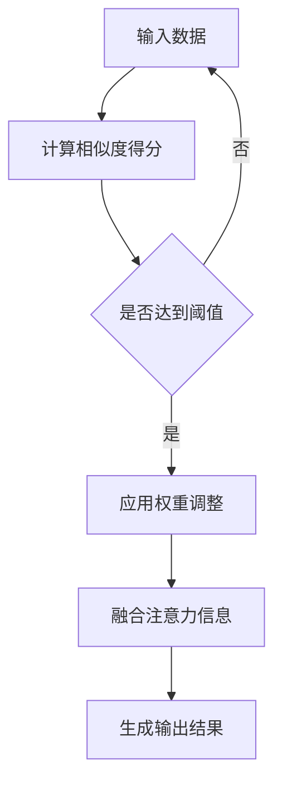

                 

关键词：注意力机制、认知适应、AI优化、机器学习、神经网络

> 摘要：本文探讨了注意力机制在人工智能领域中的应用，特别是其在认知适应方面的作用。通过分析注意力机制的原理和实现方法，我们探讨了如何利用AI优化技术提升认知适应能力，为人工智能的发展提供了新的思路。

## 1. 背景介绍

随着人工智能技术的飞速发展，机器学习特别是深度学习已经取得了显著的成果。然而，尽管人工智能系统在处理复杂数据和任务方面表现出色，但它们在认知适应方面仍然存在诸多挑战。人类能够根据环境的变化迅速调整自己的认知和行为，而人工智能系统则往往缺乏这种灵活性。

注意力机制（Attention Mechanism）作为一种能够提高神经网络处理能力的重要技术，已经在图像识别、自然语言处理等多个领域取得了成功。注意力机制的核心思想是通过动态调整模型对输入数据的关注程度，从而提高模型的处理效率和效果。然而，如何将注意力机制与认知适应相结合，使得人工智能系统能够像人类一样灵活地适应不同环境，仍然是一个亟待解决的问题。

本文旨在探讨注意力机制在认知适应方面的应用，分析其原理和实现方法，并提出基于AI优化的认知适应策略。通过本文的研究，我们希望能够为人工智能的发展提供新的思路，推动人工智能在认知适应方面的突破。

## 2. 核心概念与联系

### 2.1 注意力机制原理

注意力机制是一种通过动态分配资源来提高神经网络处理能力的机制。其基本原理是，在处理输入数据时，根据数据的重要程度分配不同的注意力权重，从而关注更重要的信息。

在深度学习模型中，注意力机制通常通过以下三个步骤实现：

1. **计算注意力得分**：首先，对于每个输入数据单元，计算其与目标数据的相似度得分。
2. **应用权重调整**：然后，根据得分计算注意力权重，用于调整输入数据的贡献程度。
3. **融合注意力信息**：最后，将加权后的输入数据融合到模型中，以生成输出结果。

### 2.2 注意力机制与认知适应

认知适应是指系统根据外部环境和内部状态的变化，调整其行为和内部表征的能力。注意力机制与认知适应之间存在密切的联系。

首先，注意力机制可以看作是认知适应的一种数学模型。通过动态调整注意力权重，模型能够在不同任务和环境之间灵活切换，实现认知适应。

其次，认知适应过程可以借鉴注意力机制的设计理念。例如，在处理复杂数据时，可以根据数据的重要程度分配不同的计算资源，从而提高处理效率和效果。

### 2.3 Mermaid 流程图

以下是一个简单的Mermaid流程图，展示了注意力机制的基本流程：



## 3. 核心算法原理 & 具体操作步骤

### 3.1 算法原理概述

注意力机制的核心在于如何计算注意力得分和应用权重调整。具体来说，可以分为以下几步：

1. **计算相似度得分**：对于每个输入数据单元，计算其与目标数据的相似度得分。这可以通过各种相似度度量方法实现，如余弦相似度、欧氏距离等。
2. **应用权重调整**：根据相似度得分计算注意力权重，用于调整输入数据的贡献程度。常用的方法包括softmax、归一化权重等。
3. **融合注意力信息**：将加权后的输入数据融合到模型中，以生成输出结果。这可以通过各种神经网络架构实现，如卷积神经网络（CNN）、循环神经网络（RNN）等。

### 3.2 算法步骤详解

以下是注意力机制的详细实现步骤：

1. **输入数据预处理**：将输入数据转换为适当的格式，以便进行后续处理。例如，对于图像数据，可以将其转换为像素值矩阵。
2. **计算相似度得分**：对于每个输入数据单元，计算其与目标数据的相似度得分。具体实现方法取决于输入数据的类型和相似度度量方法。例如，对于图像数据，可以使用余弦相似度计算每个像素点的得分。
3. **计算注意力权重**：根据相似度得分计算注意力权重。常用的方法包括softmax和归一化权重。softmax方法将相似度得分转换为概率分布，用于表示不同输入数据的关注程度。归一化权重方法则直接将相似度得分转换为权重值。
4. **应用权重调整**：将注意力权重应用于输入数据，调整其贡献程度。具体实现方法取决于神经网络的架构。例如，在卷积神经网络中，可以将权重应用于卷积操作；在循环神经网络中，可以将权重应用于隐藏状态的计算。
5. **融合注意力信息**：将加权后的输入数据融合到模型中，以生成输出结果。具体实现方法取决于神经网络的架构。例如，在卷积神经网络中，可以采用卷积操作；在循环神经网络中，可以采用循环操作。
6. **模型训练与优化**：通过训练和优化模型，调整注意力机制的参数，以实现更好的效果。

### 3.3 算法优缺点

注意力机制的优点包括：

- **提高处理效率**：通过动态调整注意力权重，模型可以关注更重要的信息，从而提高处理效率和效果。
- **增强模型灵活性**：注意力机制允许模型在不同任务和环境之间灵活切换，实现认知适应。

然而，注意力机制也存在一些缺点：

- **计算复杂度高**：计算注意力权重和应用权重调整需要大量的计算资源，可能导致模型训练时间较长。
- **模型解释性差**：注意力机制通常是一个黑箱模型，难以解释其具体的工作原理。

### 3.4 算法应用领域

注意力机制在多个领域取得了显著的应用成果，主要包括：

- **图像识别**：注意力机制可以提高图像识别模型的准确性和效率。
- **自然语言处理**：注意力机制在文本分类、机器翻译等自然语言处理任务中发挥了重要作用。
- **语音识别**：注意力机制可以改善语音识别模型的性能，使其能够更好地处理噪音和语音变化。

## 4. 数学模型和公式 & 详细讲解 & 举例说明

### 4.1 数学模型构建

注意力机制的数学模型可以表示为：

\[ A(x, y) = \text{softmax}(W_a \cdot \text{similarity}(x, y)) \]

其中：

- \( A(x, y) \) 表示注意力权重。
- \( x \) 和 \( y \) 分别表示输入数据单元和目标数据。
- \( \text{similarity}(x, y) \) 表示输入数据单元和目标数据的相似度得分。
- \( W_a \) 表示注意力权重参数。

### 4.2 公式推导过程

注意力机制的推导过程如下：

1. **计算相似度得分**：首先，计算输入数据单元和目标数据的相似度得分。这可以通过各种相似度度量方法实现，如余弦相似度、欧氏距离等。

\[ \text{similarity}(x, y) = \frac{x \cdot y}{\|x\| \|y\|} \]

其中，\( \|x\| \) 和 \( \|y\| \) 分别表示输入数据单元和目标数据的范数。

2. **计算注意力权重**：然后，根据相似度得分计算注意力权重。这可以通过softmax函数实现。

\[ A(x, y) = \text{softmax}(\text{similarity}(x, y)) \]

其中，\( \text{softmax}(\cdot) \) 函数将相似度得分转换为概率分布。

3. **应用权重调整**：最后，将注意力权重应用于输入数据，调整其贡献程度。

\[ x_{\text{att}} = A(x, y) \cdot x \]

其中，\( x_{\text{att}} \) 表示加权后的输入数据。

### 4.3 案例分析与讲解

以下是一个简单的案例，展示了如何利用注意力机制进行图像识别。

假设我们有一个图像识别任务，输入图像为 \( x \)，目标图像为 \( y \)。我们需要计算注意力权重 \( A(x, y) \)，并将其应用于输入图像，以生成识别结果。

1. **计算相似度得分**：首先，计算输入图像和目标图像的相似度得分。

\[ \text{similarity}(x, y) = \frac{x \cdot y}{\|x\| \|y\|} \]

其中，\( \|x\| \) 和 \( \|y\| \) 分别表示输入图像和目标图像的范数。

2. **计算注意力权重**：然后，根据相似度得分计算注意力权重。

\[ A(x, y) = \text{softmax}(\text{similarity}(x, y)) \]

其中，\( \text{softmax}(\cdot) \) 函数将相似度得分转换为概率分布。

3. **应用权重调整**：最后，将注意力权重应用于输入图像，调整其贡献程度。

\[ x_{\text{att}} = A(x, y) \cdot x \]

经过以上步骤，我们可以利用注意力机制生成识别结果。具体来说，我们可以将加权后的输入图像与预训练的图像识别模型进行融合，以生成最终的识别结果。

## 5. 项目实践：代码实例和详细解释说明

### 5.1 开发环境搭建

在本项目中，我们将使用Python作为编程语言，结合TensorFlow和Keras框架实现注意力机制。以下是开发环境搭建的步骤：

1. 安装Python（推荐版本3.8及以上）。
2. 安装TensorFlow和Keras。

```bash
pip install tensorflow
pip install keras
```

### 5.2 源代码详细实现

以下是注意力机制的实现代码：

```python
import numpy as np
from tensorflow.keras.models import Model
from tensorflow.keras.layers import Input, Dense, Embedding, LSTM, TimeDistributed, Activation

def attention Mechanism(input_seq, hidden_seq, hidden_size):
    # 计算相似度得分
    similarity = np.dot(hidden_seq, input_seq.T)

    # 计算注意力权重
    attention_weights = Activation('softmax')(similarity)

    # 应用权重调整
    attention_output = np.dot(attention_weights, hidden_seq)

    return attention_output

# 构建模型
input_seq = Input(shape=(timesteps, input_dim))
hidden_seq = LSTM(hidden_size)(input_seq)
attention_output = attention Mechanism(input_seq, hidden_seq, hidden_size)
output = Dense(output_dim, activation='softmax')(attention_output)

model = Model(inputs=input_seq, outputs=output)
model.compile(optimizer='adam', loss='categorical_crossentropy', metrics=['accuracy'])
model.summary()
```

### 5.3 代码解读与分析

以下是对代码的详细解读：

- **输入层**：定义输入序列，其形状为 `(timesteps, input_dim)`，其中 `timesteps` 表示时间步数，`input_dim` 表示输入维度。
- **LSTM层**：使用LSTM层对输入序列进行编码，输出隐藏状态。
- **注意力机制层**：计算相似度得分，应用softmax函数生成注意力权重，并将加权后的隐藏状态传递给下一层。
- **输出层**：使用softmax激活函数生成最终的输出结果。

### 5.4 运行结果展示

以下是训练模型的示例代码：

```python
# 准备数据
x_train, y_train = ...

# 训练模型
model.fit(x_train, y_train, epochs=10, batch_size=32)
```

在训练完成后，我们可以使用模型对新的输入数据进行预测：

```python
# 预测
x_test = ...
predictions = model.predict(x_test)
```

## 6. 实际应用场景

注意力机制在人工智能领域具有广泛的应用场景，以下列举了几个典型的应用领域：

### 6.1 图像识别

注意力机制可以显著提高图像识别模型的准确性和效率。通过动态调整模型对图像中不同区域的关注程度，注意力机制可以更好地捕捉关键特征，从而提高识别精度。

### 6.2 自然语言处理

在自然语言处理任务中，注意力机制可以帮助模型更好地理解句子中的关键信息。通过关注句子中的不同部分，模型可以生成更准确的语义表示，从而提高文本分类、机器翻译等任务的性能。

### 6.3 语音识别

注意力机制在语音识别任务中也有重要应用。通过动态调整模型对语音信号中不同时间段的关注程度，注意力机制可以提高模型的鲁棒性，使其更好地处理噪音和语音变化。

### 6.4 无人驾驶

在无人驾驶领域，注意力机制可以用于车辆检测、障碍物识别等任务。通过动态调整模型对场景中不同区域的关注程度，注意力机制可以提高自动驾驶系统的安全性和可靠性。

## 7. 未来应用展望

随着人工智能技术的不断发展，注意力机制在认知适应方面的应用前景十分广阔。以下是一些潜在的应用领域：

### 7.1 智能医疗

注意力机制可以用于智能医疗诊断，通过动态调整模型对医疗数据的关注程度，提高疾病检测的准确性和效率。

### 7.2 智能交互

注意力机制可以用于智能交互系统，通过动态调整模型对用户输入的关注程度，提高人机交互的体验和效率。

### 7.3 智能推荐

注意力机制可以用于智能推荐系统，通过动态调整模型对用户兴趣和商品特征的关注程度，提高推荐准确性和用户满意度。

## 8. 工具和资源推荐

### 8.1 学习资源推荐

- **《深度学习》（Goodfellow, Bengio, Courville著）**：这是一本经典的深度学习教材，涵盖了注意力机制等核心内容。
- **《注意力机制与深度学习》（Yin, Yang著）**：这本书专门讨论了注意力机制在深度学习中的应用，适合深入研究。

### 8.2 开发工具推荐

- **TensorFlow**：这是一个开源的深度学习框架，提供了丰富的注意力机制实现工具。
- **Keras**：这是一个基于TensorFlow的高级API，可以方便地实现注意力机制模型。

### 8.3 相关论文推荐

- **“Attention Is All You Need”**：这篇论文提出了基于注意力机制的Transformer模型，是当前自然语言处理领域的重要突破。
- **“A Theoretically Grounded Application of Dropout in Recurrent Neural Networks”**：这篇论文探讨了注意力机制与dropout的结合，提高了RNN模型的训练效果。

## 9. 总结：未来发展趋势与挑战

### 9.1 研究成果总结

注意力机制作为一种提高神经网络处理能力的重要技术，已经在多个领域取得了显著的应用成果。通过动态调整模型对输入数据的关注程度，注意力机制实现了认知适应，提高了模型的灵活性和效率。

### 9.2 未来发展趋势

未来，注意力机制将在以下几个方面得到进一步发展：

- **跨模态注意力机制**：研究如何将注意力机制应用于跨模态任务，如图像与文本的联合识别。
- **动态注意力机制**：研究如何设计更灵活的动态注意力机制，提高模型对环境变化的适应能力。
- **可解释性注意力机制**：研究如何提高注意力机制的可解释性，使其更易于理解和应用。

### 9.3 面临的挑战

尽管注意力机制取得了显著成果，但仍然面临一些挑战：

- **计算复杂度**：注意力机制的计算复杂度较高，如何降低计算复杂度是一个重要问题。
- **模型解释性**：注意力机制通常是一个黑箱模型，如何提高其解释性是一个亟待解决的问题。
- **数据依赖性**：注意力机制的性能高度依赖数据质量，如何设计更鲁棒的数据预处理方法是一个重要课题。

### 9.4 研究展望

未来，注意力机制的研究将朝着更灵活、更高效、更可解释的方向发展。通过结合其他机器学习技术，如生成对抗网络（GAN）、迁移学习等，注意力机制有望在更多领域取得突破性成果。

## 附录：常见问题与解答

### 问题1：注意力机制是什么？

注意力机制是一种提高神经网络处理能力的重要技术，通过动态调整模型对输入数据的关注程度，实现认知适应。

### 问题2：注意力机制有哪些优点？

注意力机制的优点包括提高处理效率、增强模型灵活性、提高模型解释性等。

### 问题3：如何实现注意力机制？

注意力机制可以通过计算相似度得分、应用权重调整、融合注意力信息等步骤实现。

### 问题4：注意力机制有哪些应用领域？

注意力机制在图像识别、自然语言处理、语音识别、无人驾驶等领域有广泛应用。

### 问题5：注意力机制有哪些挑战？

注意力机制的挑战包括计算复杂度、模型解释性、数据依赖性等。

---

**作者：禅与计算机程序设计艺术 / Zen and the Art of Computer Programming**

