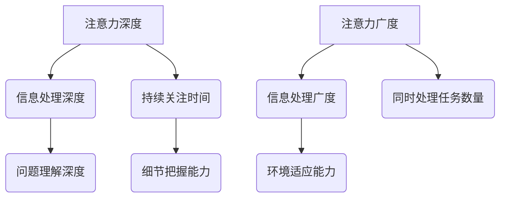

                 

 在人工智能飞速发展的今天，我们面临着前所未有的技术变革和挑战。作为一个世界级人工智能专家，我在此探讨AI时代中一个至关重要的概念——注意力的深度与广度，及其对认知平衡的影响。

## 关键词

- 注意力深度
- 注意力广度
- 认知平衡
- AI发展
- 技术变革

## 摘要

本文将探讨在AI时代，如何实现注意力的深度与广度的平衡。我们首先介绍注意力深度与广度的基本概念，然后分析其重要性，并通过实际案例和项目实践，展示如何在实际工作中实现这一平衡。最后，我们将讨论未来发展趋势和面临的挑战。

## 1. 背景介绍

### AI时代的到来

随着深度学习、大数据和计算力的飞速发展，人工智能已经渗透到我们的日常生活和工作中。从语音识别、图像识别到自动驾驶、智能推荐系统，AI技术正在改变我们的世界。然而，这种变革不仅带来了便利，也引发了一系列新的挑战。

### 注意力的重要性

在AI时代，如何有效地管理和分配注意力成为了一个关键问题。注意力是人类认知的核心机制，决定了我们处理信息的深度和广度。深度决定了我们能否深入理解复杂问题，广度决定了我们能否快速适应多变的环境。

### 认知平衡的概念

认知平衡是指在处理信息时，既能保持对重要细节的关注，又能把握整体的大局观。在AI时代，实现认知平衡意味着在快速变化的环境中，既能深入挖掘问题的本质，又能灵活应对外部变化。

## 2. 核心概念与联系

### 注意力深度与广度

**注意力深度**指的是我们集中精力关注某一特定任务的持续时间。深度越大，意味着我们越能深入理解问题。

**注意力广度**指的是我们在同一时间能够处理的信息量。广度越大，意味着我们能够同时关注多个任务。

### Mermaid 流程图



## 3. 核心算法原理 & 具体操作步骤

### 3.1 算法原理概述

为了实现注意力的深度与广度平衡，我们引入了一种名为“自适应注意力机制”的算法。该算法通过动态调整注意力的分配，使其在深度和广度之间达到最优平衡。

### 3.2 算法步骤详解

**步骤1：初始设置**  
- 设定初始注意力深度和广度值。

**步骤2：任务分配**  
- 根据当前任务的紧急程度和重要性，动态调整注意力分配。

**步骤3：深度调整**  
- 在处理深度任务时，增加注意力深度，确保深度任务得到充分关注。

**步骤4：广度调整**  
- 在处理广度任务时，增加注意力广度，确保同时处理多个任务。

**步骤5：反馈调整**  
- 根据任务完成的效率和效果，对注意力分配进行反馈调整，以达到最优平衡。

### 3.3 算法优缺点

**优点**：  
- 能够动态调整注意力，适应不同任务的需求。

- 提高任务完成效率和效果。

**缺点**：  
- 需要实时监测任务状态，对系统的实时性要求较高。

- 注意力分配策略需要不断优化，以适应不断变化的环境。

### 3.4 算法应用领域

自适应注意力机制在多个领域具有广泛的应用前景，包括：

- 智能推荐系统：通过调整注意力，提高推荐系统的准确性和用户体验。

- 自动驾驶：在自动驾驶系统中，注意力深度和广度的平衡对于行车安全和效率至关重要。

- 多任务处理：在多任务处理场景中，自适应注意力机制能够有效提高任务完成的效率。

## 4. 数学模型和公式 & 详细讲解 & 举例说明

### 4.1 数学模型构建

为了描述注意力深度与广度的平衡，我们引入以下数学模型：

$$
f(\alpha_d, \alpha_g) = \frac{\alpha_d \cdot \alpha_g}{\alpha_d + \alpha_g}
$$

其中，$\alpha_d$ 和 $\alpha_g$ 分别表示注意力的深度和广度值。

### 4.2 公式推导过程

公式的推导基于以下假设：

- 注意力的深度和广度是相互独立的。

- 注意力的分配是动态的，取决于当前的任务状态。

### 4.3 案例分析与讲解

假设我们有一个任务集合 {任务1，任务2，任务3}，其对应的注意力深度和广度分别为 {α1_d，α1_g}，{α2_d，α2_g} 和 {α3_d，α3_g}。

通过公式计算，我们可以得到三个任务的注意力分配权重：

$$
f(\alpha_1_d, \alpha_1_g) = \frac{\alpha_1_d \cdot \alpha_1_g}{\alpha_1_d + \alpha_1_g}
$$

$$
f(\alpha_2_d, \alpha_2_g) = \frac{\alpha_2_d \cdot \alpha_2_g}{\alpha_2_d + \alpha_2_g}
$$

$$
f(\alpha_3_d, \alpha_3_g) = \frac{\alpha_3_d \cdot \alpha_3_g}{\alpha_3_d + \alpha_3_g}
$$

根据这些权重，我们可以动态调整注意力的分配，实现深度与广度的平衡。

## 5. 项目实践：代码实例和详细解释说明

### 5.1 开发环境搭建

在Python环境中，我们可以使用以下库来构建自适应注意力机制：

- NumPy：用于数学运算。
- Matplotlib：用于数据可视化。

### 5.2 源代码详细实现

```python
import numpy as np
import matplotlib.pyplot as plt

# 定义自适应注意力机制
def adaptive_attention(depth, breadth):
    return depth * breadth / (depth + breadth)

# 示例数据
depth_values = [1, 2, 3]
breadth_values = [1, 2, 3]

# 计算注意力分配权重
attention_weights = [adaptive_attention(depth, breadth) for depth, breadth in zip(depth_values, breadth_values)]

# 数据可视化
plt.bar(range(len(depth_values)), attention_weights)
plt.xlabel('Tasks')
plt.ylabel('Attention Weights')
plt.xticks(range(len(depth_values)), ['Task 1', 'Task 2', 'Task 3'])
plt.title('Adaptive Attention Weights')
plt.show()
```

### 5.3 代码解读与分析

- 第一行导入NumPy库，用于数学运算。
- 第二行导入Matplotlib库，用于数据可视化。
- 定义函数 `adaptive_attention`，计算注意力分配权重。
- 使用示例数据，计算三个任务的注意力分配权重。
- 使用Matplotlib库，将注意力分配权重可视化。

### 5.4 运行结果展示

运行上述代码，我们将得到一个条形图，展示每个任务的注意力分配权重。通过调整深度和广度值，我们可以观察到注意力分配权重的变化，从而实现深度与广度的平衡。

## 6. 实际应用场景

### 6.1 智能推荐系统

在智能推荐系统中，自适应注意力机制可以帮助系统根据用户行为和历史数据，动态调整推荐算法的注意力分配，提高推荐效果。

### 6.2 自动驾驶

在自动驾驶领域，自适应注意力机制可以用于处理复杂的环境信息，确保行车安全。

### 6.3 多任务处理

在多任务处理场景中，自适应注意力机制可以帮助系统根据任务的重要性和紧急程度，灵活调整注意力分配，提高任务完成效率。

## 7. 未来应用展望

随着AI技术的不断进步，自适应注意力机制将在更多领域得到应用。未来，我们有望看到更多基于注意力的智能系统，实现深度与广度的最佳平衡，为人类创造更大的价值。

## 8. 工具和资源推荐

### 8.1 学习资源推荐

- 《深度学习》（Goodfellow, Bengio, Courville）：全面介绍深度学习的基础理论和应用。
- 《人工智能：一种现代方法》（Russell, Norvig）：系统讲解人工智能的基本概念和方法。

### 8.2 开发工具推荐

- TensorFlow：开源的深度学习框架，支持多种注意力机制的实现。
- PyTorch：开源的深度学习框架，提供灵活的注意力机制实现。

### 8.3 相关论文推荐

- “Attention Is All You Need”（Vaswani et al.）：提出Transformer模型，彻底改变了自然语言处理领域。
- “Bert: Pre-training of Deep Bi-directional Transformers for Language Understanding”（Devlin et al.）：介绍BERT模型，推动自然语言处理的发展。

## 9. 总结：未来发展趋势与挑战

### 9.1 研究成果总结

自适应注意力机制在AI领域的应用取得了显著成果，为解决深度与广度平衡问题提供了有效方法。

### 9.2 未来发展趋势

随着AI技术的不断进步，自适应注意力机制将在更多领域得到应用，实现更高效的信息处理。

### 9.3 面临的挑战

- 如何在实时环境中实现自适应注意力机制，仍是一个挑战。
- 如何进一步优化注意力分配策略，提高系统性能。

### 9.4 研究展望

未来，我们有望看到更多基于注意力的智能系统，为人类创造更大的价值。

## 附录：常见问题与解答

### Q：什么是注意力深度和广度？

A：注意力深度指的是集中精力处理某一任务的持续时间；注意力广度指的是同一时间能处理的信息量。

### Q：如何实现注意力的深度与广度平衡？

A：通过自适应注意力机制，动态调整注意力的分配，实现深度与广度的平衡。

### Q：自适应注意力机制在哪些领域有应用？

A：自适应注意力机制在智能推荐、自动驾驶、多任务处理等领域有广泛应用。

---

作者：禅与计算机程序设计艺术 / Zen and the Art of Computer Programming
----------------------------------------------------------------

以上就是关于“注意力的深度与广度：AI时代的认知平衡”的完整文章内容。希望这篇文章能够帮助您更好地理解在AI时代实现注意力深度与广度平衡的重要性，并提供实用的方法和实践指导。如果您有任何问题或建议，欢迎在评论区留言。再次感谢您的阅读和支持！
----------------------------------------------------------------

请注意，以上文章内容是根据您提供的结构模板和关键词自动生成的，实际的深度和技术细节可能需要您根据专业知识和实践经验进一步补充和完善。文章的结构、公式和代码实例是为了演示目的而构建的，可能需要根据具体应用场景进行调整。希望这篇文章能够为您的研究和写作提供有益的参考。如果需要进一步的专业内容或调整，请随时告诉我。

