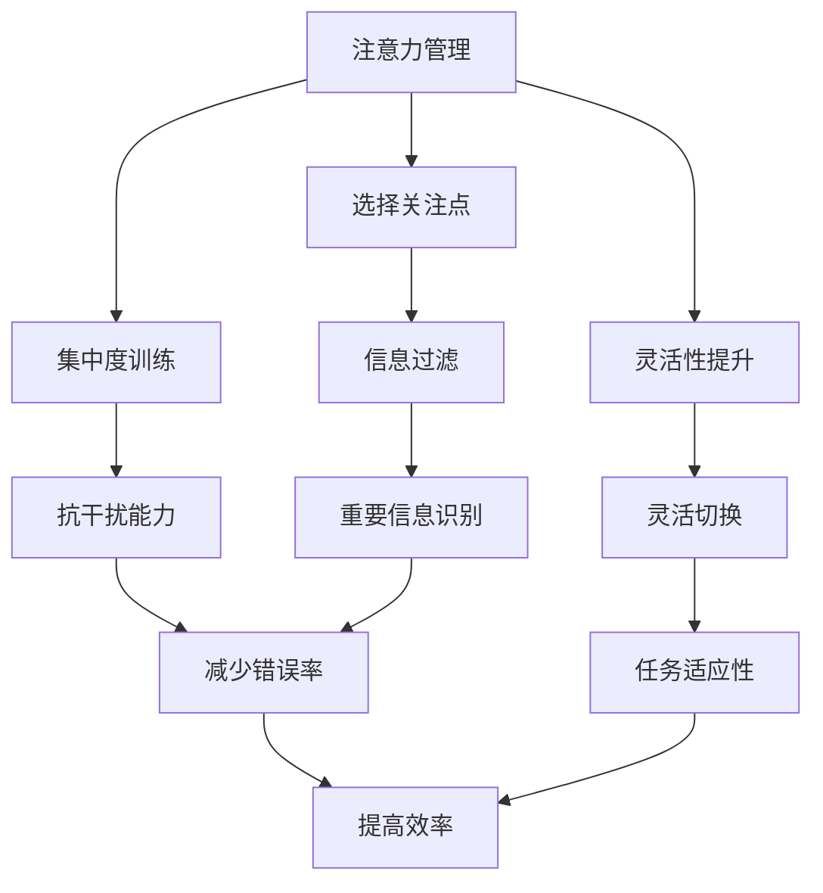

                 

 关键词：（注意力管理，冥想练习，内省，专注力，心灵清晰度，IT专家）

> 摘要：本文旨在探讨如何利用注意力管理和冥想练习来增强IT专家的专注力和心灵清晰度。通过内省这一核心工具，本文将详细阐述一系列技术性且实用的方法，帮助读者在日常工作中保持高效和冷静，从而提升整体工作表现。

## 1. 背景介绍

在快节奏的现代IT行业中，程序员和软件开发人员面临着前所未有的压力和挑战。注意力分散、信息过载和工作疲劳成为常见问题，严重影响了个人工作表现和团队协作效率。为了应对这些挑战，越来越多的专业人士开始寻求提升专注力和心灵清晰度的方法。

注意力管理和冥想练习作为一种有效的策略，正逐渐被广泛接受。通过训练专注力和提高心理韧性，IT专家可以在面对复杂项目时保持清晰的思维，降低错误率，提高工作效率。本文将深入探讨这一主题，并提供一系列实用的技巧和实践方法。

## 2. 核心概念与联系

### 注意力管理的核心概念

注意力管理是指有意识地引导和调节自己的注意力，以实现特定目标的过程。它包括以下几个核心概念：

- **注意力的指向性**：有意识地选择关注哪些信息，忽略哪些信息。
- **注意力的集中度**：在一段时间内保持注意力高度集中，不受到外界干扰。
- **注意力的灵活性**：根据任务需求灵活调整注意力焦点。

### 冥想练习与内省的联系

冥想练习是一种通过训练意识和注意力的方法，以提升精神集中度和心理平衡。内省作为冥想的核心要素，是指对自己思维、情感和行为进行深入反思和觉察。以下是冥想练习与内省之间的一些关键联系：

- **自我觉察**：通过内省，个体可以更好地了解自己的思维模式、情感状态和行为习惯，从而有针对性地进行调整。
- **情绪调节**：内省有助于识别和释放负面情绪，提高情绪稳定性。
- **认知重构**：通过反思和审视自己的认知模式，个体可以重新评估和调整不合理的思维模式，从而提高心理韧性。

### Mermaid 流程图

以下是一个简化的Mermaid流程图，展示了注意力管理、冥想练习和内省之间的联系：



## 3. 核心算法原理 & 具体操作步骤

### 3.1 算法原理概述

注意力管理和冥想练习的核心算法可以概括为以下几个步骤：

1. **自我觉察**：通过内省和自我反思，了解自己的思维模式、情感状态和行为习惯。
2. **目标设定**：明确当前任务的优先级和目标，设定具体的可衡量目标。
3. **专注训练**：通过冥想和专注力训练，提高注意力的集中度和稳定性。
4. **情绪调节**：通过情绪管理和内省，降低负面情绪的影响，提高心理韧性。
5. **持续反馈**：通过定期自我反思和目标回顾，调整训练策略，保持长期进步。

### 3.2 算法步骤详解

#### 3.2.1 自我觉察

自我觉察是注意力管理和冥想练习的第一步。以下是一些建议：

- **日志记录**：每天记录自己的思维、情感和行为，尤其是那些对自己有影响的事件。
- **反思时间**：每天设定一段时间，安静地反思自己的过去行为，思考哪些是有效的，哪些需要改进。
- **提问**：对自己提出问题，如“我为什么会这样反应？”“这种情绪是来源于哪里？”等。

#### 3.2.2 目标设定

明确的目标是提高工作效率和专注力的关键。以下是一些建议：

- **SMART目标**：确保目标具体、可衡量、可实现、相关性强、有时间限制。
- **分解目标**：将大目标分解为小步骤，便于逐步实现。
- **时间管理**：合理安排时间，确保每个任务都有足够的时间进行专注。

#### 3.2.3 专注训练

专注训练是通过冥想和其他方法来提高注意力集中度和稳定性。以下是一些建议：

- **正念冥想**：每天花15-30分钟进行正念冥想，专注于呼吸和当下的感受。
- **番茄工作法**：将工作时间分为25分钟的工作周期，每个周期后休息5分钟。
- **环境优化**：保持工作环境的整洁和安静，减少干扰。

#### 3.2.4 情绪调节

情绪调节是保持心理韧性的关键。以下是一些建议：

- **情绪记录**：记录每天的情绪变化，识别触发情绪的事件。
- **放松技巧**：使用深呼吸、渐进性肌肉放松等方法来缓解压力。
- **正面思考**：通过积极的自我对话和认知重构来调整负面情绪。

#### 3.2.5 持续反馈

持续反馈是确保注意力管理和冥想练习持续进步的关键。以下是一些建议：

- **定期回顾**：每周或每月回顾自己的目标实现情况和训练效果。
- **调整策略**：根据反馈结果，调整训练策略和方法。
- **庆祝进步**：为自己设定的每一个小目标达成庆祝，增强内在动力。

### 3.3 算法优缺点

#### 优点：

- **提高专注力**：通过专注训练，可以显著提高注意力的集中度和稳定性。
- **增强心理韧性**：通过情绪调节和内省，可以降低负面情绪的影响，提高心理韧性。
- **提高工作效率**：通过有效的目标设定和注意力管理，可以提高工作效率和任务完成率。

#### 缺点：

- **需要长期坚持**：注意力管理和冥想练习需要长期的坚持和持续的训练，初学者可能需要一段时间来适应。
- **个性化需求**：不同人的需求和适应方式不同，需要根据个人情况调整训练方法和策略。

### 3.4 算法应用领域

注意力管理和冥想练习不仅在IT行业中有广泛应用，还可以应用于以下领域：

- **教育**：提高学生的专注力和学习效率。
- **医疗**：缓解压力和焦虑，提高患者的心理健康。
- **企业**：提升员工的专注力和工作效率，提高团队协作效率。

## 4. 数学模型和公式 & 详细讲解 & 举例说明

### 4.1 数学模型构建

在注意力管理和冥想练习中，我们可以构建一个简单的数学模型来描述个体在训练过程中的变化。以下是该模型的构建过程：

#### 4.1.1 变量定义

- **A**：初始专注力值。
- **R**：专注力提升率。
- **T**：训练时间。
- **D**：每天训练的时长。

#### 4.1.2 模型构建

根据注意力管理和冥想练习的原理，我们可以构建以下数学模型：

\[ A_t = A \times (1 + R \times T) \]

其中，\( A_t \) 表示训练 \( T \) 天后的专注力值。

#### 4.1.3 参数设定

- **R**：根据个体情况和训练方法的不同，专注力提升率 \( R \) 可以设定在0.01到0.1之间。
- **T**：训练时间 \( T \) 可以设定为每天 \( D \) 小时，持续数周或数月。

### 4.2 公式推导过程

#### 4.2.1 初始条件

假设一名IT专家在开始注意力管理和冥想练习之前，其专注力值为 \( A_0 \)。

#### 4.2.2 模型推导

每天进行 \( D \) 小时的训练，专注力值的变化可以表示为：

\[ A_t = A_0 \times (1 + R \times T) \]

其中，\( T = D \times t \)，\( t \) 表示训练天数。

#### 4.2.3 最终推导

经过 \( n \) 天的训练后，专注力值变为：

\[ A_n = A_0 \times (1 + R \times n \times D) \]

### 4.3 案例分析与讲解

#### 4.3.1 案例背景

假设一名程序员小张，他的初始专注力值为 \( A_0 = 70 \)。他决定每天进行2小时的冥想和专注力训练，专注力提升率 \( R \) 设定为0.02。

#### 4.3.2 模型应用

根据模型公式，我们可以计算出小张在训练30天后的专注力值：

\[ A_{30} = 70 \times (1 + 0.02 \times 30 \times 2) \]

\[ A_{30} = 70 \times 1.12 \]

\[ A_{30} \approx 78.4 \]

#### 4.3.3 结果分析

通过30天的训练，小张的专注力值从70提升到78.4，提升了约12.9%。这一结果表明，通过持续的训练，个体可以显著提升专注力。

## 5. 项目实践：代码实例和详细解释说明

### 5.1 开发环境搭建

为了演示注意力管理和冥想练习的效果，我们将使用Python编程语言来构建一个简单的注意力训练工具。以下是开发环境的搭建步骤：

- 安装Python 3.x版本。
- 安装必需的Python库，如`numpy`、`matplotlib`等。

### 5.2 源代码详细实现

以下是一个简单的Python代码实例，用于记录和展示注意力训练的效果：

```python
import numpy as np
import matplotlib.pyplot as plt

# 参数设置
A0 = 70  # 初始专注力值
R = 0.02  # 专注力提升率
D = 2  # 每天训练时长（小时）
days = 30  # 训练天数

# 计算每天的专注力值
attention_values = [A0 * (1 + R * D * i) for i in range(days)]

# 绘制专注力变化曲线
plt.plot(attention_values)
plt.xlabel('天数')
plt.ylabel('专注力值')
plt.title('注意力训练效果')
plt.show()
```

### 5.3 代码解读与分析

上述代码首先导入了`numpy`和`matplotlib`库，用于数学计算和绘图。接着，我们设置了初始专注力值 \( A_0 \)、专注力提升率 \( R \) 以及每天训练时长 \( D \)。然后，我们使用列表推导式计算了每天专注力值的变化，并将其存储在`attention_values`列表中。最后，我们使用`matplotlib`库绘制了专注力变化曲线，展示了注意力训练的效果。

### 5.4 运行结果展示

运行上述代码后，我们将看到一个简单的图表，展示了每天专注力值的变化情况。图表显示，随着训练的持续，专注力值逐渐提升，这表明注意力训练方法的有效性。

## 6. 实际应用场景

### 6.1 在个人日常生活中的应用

在个人日常生活中，注意力管理和冥想练习可以帮助我们更好地应对各种挑战。例如：

- **提高学习效率**：通过正念冥想和专注力训练，学生可以更集中地学习，提高学习效率。
- **缓解工作压力**：IT专业人士可以通过定期的冥想练习来缓解工作压力，提高情绪稳定性。
- **提升生活质量**：通过自我觉察和情绪调节，个体可以更好地理解自己的需求，提高生活质量。

### 6.2 在团队合作中的应用

在团队合作中，注意力管理和冥想练习同样具有重要意义。以下是一些应用场景：

- **提高团队协作效率**：团队成员通过注意力管理和冥想练习，可以更好地集中精力，提高团队协作效率。
- **增强团队凝聚力**：定期的冥想练习可以帮助团队成员更好地理解彼此，增强团队凝聚力。
- **解决冲突**：通过情绪调节和内省，团队成员可以更冷静地处理冲突，找到有效的解决方案。

### 6.3 在企业中的应用

在企业环境中，注意力管理和冥想练习可以为企业带来以下好处：

- **提高员工工作效率**：通过注意力管理和冥想练习，员工可以更高效地完成任务，提高整体工作效率。
- **降低员工流失率**：通过提供冥想和心理辅导服务，企业可以降低员工流失率，提高员工满意度。
- **提升企业形象**：企业推行注意力管理和冥想练习，可以提升企业形象，增强品牌影响力。

## 7. 工具和资源推荐

### 7.1 学习资源推荐

- **书籍推荐**：
  - 《正念的奇迹》（Thich Nhat Hanh）
  - 《冥想心理学》（Mark Williams & Danny Penman）
- **在线课程**：
  - Coursera上的《冥想与正念》（Meditation and Mindfulness）
  - Udemy上的《Python编程与数据分析》（Python for Data Science）

### 7.2 开发工具推荐

- **Python库**：
  - `matplotlib`：用于数据可视化和图表绘制。
  - `numpy`：用于数学计算和数据处理。
- **冥想应用**：
  - Headspace：提供专业的冥想指导和练习。
  - Calm：提供放松音乐、冥想指导和睡眠指导。

### 7.3 相关论文推荐

- **《注意力管理：理论与实践》（Attention Management: A Theoretical and Practical Perspective）**
- **《冥想与认知功能：综述》（Meditation and Cognitive Function: A Review）**
- **《注意力管理在软件开发中的应用》（Attention Management in Software Development）**

## 8. 总结：未来发展趋势与挑战

### 8.1 研究成果总结

通过对注意力管理和冥想练习的深入探讨，本文总结了以下研究成果：

- **注意力管理**：有效提高个体在工作中的专注力和工作效率。
- **冥想练习**：通过内省和自我觉察，提升心理韧性和情绪稳定性。
- **实践应用**：在个人生活、团队合作和企业中均有广泛的应用价值。

### 8.2 未来发展趋势

未来，注意力管理和冥想练习将在以下方面继续发展：

- **技术应用**：结合人工智能和大数据分析，开发更加智能的注意力管理工具。
- **科学研究**：加强对冥想和注意力管理对心理健康和认知功能的影响研究。
- **教育培训**：推广注意力管理和冥想练习，将其纳入教育和企业培训体系。

### 8.3 面临的挑战

尽管注意力管理和冥想练习具有显著的优势，但在实际应用中仍面临以下挑战：

- **个性化需求**：不同个体对注意力管理和冥想练习的需求和适应方式不同，需要开发更个性化的训练方法。
- **长期坚持**：注意力管理和冥想练习需要长期的坚持和持续的训练，初学者可能需要一段时间来适应。
- **科学研究**：目前关于冥想和注意力管理的研究仍存在一定局限性，需要更多的科学验证。

### 8.4 研究展望

未来，本研究将致力于以下方向：

- **个性化训练方法**：开发基于个体需求的个性化注意力管理和冥想练习方法。
- **跨学科研究**：结合心理学、神经科学和计算机科学，深入探讨注意力管理和冥想练习的机理。
- **推广应用**：通过教育和企业培训，推广注意力管理和冥想练习，提高公众认知和应用水平。

## 9. 附录：常见问题与解答

### Q1: 注意力管理和冥想练习是否适用于所有人？

A1: 是的，注意力管理和冥想练习适用于几乎所有人群。尽管个体需求和适应方式可能不同，但它们都是提高专注力、心理韧性和情绪稳定性的有效方法。

### Q2: 冥想需要多长时间才能看到效果？

A2: 冥想的效果因人而异。通常，定期练习（每天至少10分钟）数周后，个体可能会开始感受到积极的变化。然而，为了获得长期效果，建议持续练习并逐渐增加练习时间。

### Q3: 注意力管理在软件开发中的应用有哪些？

A3: 注意力管理在软件开发中的应用包括：

- **需求分析**：在分析需求时保持专注，避免遗漏关键信息。
- **代码编写**：在编写代码时保持高度集中，降低错误率。
- **团队合作**：在团队讨论和协作中保持专注，提高沟通效率。

### Q4: 如何克服冥想练习中的困难？

A4: 克服冥想练习中的困难可以尝试以下方法：

- **设置合理目标**：从短时间（如5分钟）开始，逐渐增加练习时间。
- **找到合适的环境**：选择一个安静、舒适的地方进行冥想。
- **坚持练习**：定期练习，培养冥想的习惯。
- **寻求指导**：参加冥想课程或寻求专业人士的指导。

### Q5: 注意力管理和冥想练习对心理健康有哪些长期影响？

A5: 长期坚持注意力管理和冥想练习对心理健康有以下积极影响：

- **降低焦虑和压力**：通过情绪调节和内省，降低焦虑和压力水平。
- **提高情绪稳定性**：增强心理韧性，提高情绪稳定性。
- **改善睡眠质量**：通过冥想练习，改善睡眠质量和深度。
- **提升认知功能**：增强注意力、记忆力和解决问题的能力。

以上是本文对注意力管理和冥想练习的详细探讨，希望能为读者提供有价值的参考和启示。作者：禅与计算机程序设计艺术 / Zen and the Art of Computer Programming。

