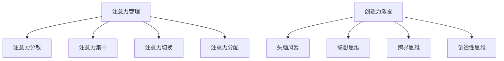

                 

注意力管理和创造力激发是现代信息技术领域中至关重要的两个概念。本文旨在探讨如何在信息技术背景下，通过有效的注意力管理策略和头脑风暴技术，激发创造力和提高工作效率。

> 关键词：注意力管理、创造力激发、头脑风暴、专注、工作效率

## 摘要

本文首先介绍了注意力管理和创造力激发的定义及其重要性。随后，我们探讨了注意力管理和创造力激发之间的内在联系，并介绍了注意力管理和创造力激发的核心原则。在此基础上，文章详细阐述了几种实用的注意力管理技巧和头脑风暴方法，并通过具体案例展示了这些方法在实际工作中的应用效果。最后，文章对未来注意力管理和创造力激发在信息技术领域的应用和发展趋势进行了展望。

## 1. 背景介绍

在信息技术高速发展的今天，人们的工作和生活节奏不断加快，面临着前所未有的挑战。如何在这种快节奏的环境中保持高效的工作状态，成为了许多人关心的问题。注意力管理和创造力激发，正是解决这一问题的关键。

### 注意力管理

注意力管理是指通过一系列策略和方法，帮助个体集中精力，提高注意力的稳定性和持久性，从而提高工作效率和生活质量。注意力管理的重要性体现在以下几个方面：

1. **提高工作效率**：有效的注意力管理可以帮助个体在任务执行过程中保持专注，减少分心和干扰，从而提高工作效率。
2. **提升生活质量**：良好的注意力管理有助于个体在面对压力和挑战时保持冷静和专注，提高生活满意度。
3. **增强创造力**：注意力管理可以激发个体的内在潜能，促进创造性思维和问题解决能力的发展。

### 创造力激发

创造力激发是指通过一系列方法和策略，激发个体的创造力和创新能力，从而推动个人和组织的发展。创造力激发的重要性体现在以下几个方面：

1. **推动创新**：创造力激发有助于个体和组织在技术、产品、服务等方面实现创新，从而在激烈的市场竞争中脱颖而出。
2. **提升竞争力**：创造力激发可以提升个体和组织的竞争力，推动个人和组织的持续发展。
3. **促进社会进步**：创造力激发可以推动社会各个领域的发展，为社会进步作出贡献。

## 2. 核心概念与联系

### 注意力管理

注意力管理涉及多个核心概念，包括注意力分散、注意力集中、注意力切换和注意力分配。这些概念相互关联，共同构成了注意力管理的理论基础。

#### 注意力分散

注意力分散是指个体在执行任务过程中，由于外部干扰或内部情绪波动，导致注意力无法集中。注意力分散会导致工作效率下降，甚至可能导致任务失败。

#### 注意力集中

注意力集中是指个体在执行任务过程中，将注意力集中在任务上，减少干扰和分心。注意力集中是提高工作效率的关键。

#### 注意力切换

注意力切换是指个体在执行不同任务时，将注意力从一个任务转移到另一个任务。注意力切换能力对于提高工作效率和应对多任务环境至关重要。

#### 注意力分配

注意力分配是指个体在执行任务时，根据任务的重要性和紧急性，合理分配注意力资源。注意力分配有助于个体在多任务环境中保持高效的工作状态。

### 创造力激发

创造力激发的核心概念包括头脑风暴、联想思维、跨界思维和创造性思维。

#### 头脑风暴

头脑风暴是一种集体创造力激发方法，通过快速产生大量想法，激发个体的创造力。头脑风暴的关键在于放松思维限制，鼓励自由联想。

#### 联想思维

联想思维是指通过将不同概念、事物或情境相互联系，产生新的创意和解决方案。联想思维有助于打破思维定势，激发创造性思维。

#### 跨界思维

跨界思维是指将不同领域、行业或文化的知识、方法和理念相互融合，产生新的创意和解决方案。跨界思维有助于拓展思维视野，提升创造力。

#### 创造性思维

创造性思维是指通过独特的、创新的方式思考问题，提出新的想法和解决方案。创造性思维是推动创新和创造力激发的核心。

### Mermaid 流程图



## 3. 核心算法原理 & 具体操作步骤

### 3.1 算法原理概述

注意力管理和创造力激发的核心算法原理基于认知科学和心理学的相关理论。这些理论包括注意力分散理论、注意力集中理论、注意力切换理论和创造性思维理论。

### 3.2 算法步骤详解

#### 3.2.1 注意力管理步骤

1. **评估注意力需求**：分析任务的重要性和紧急性，确定需要投入的注意力资源。
2. **设定注意力目标**：明确任务目标，将注意力集中在实现目标上。
3. **执行注意力集中策略**：采用注意力集中技巧，如番茄工作法、冥想等，提高注意力稳定性。
4. **定期切换注意力**：根据任务需求，合理安排注意力切换，避免长时间连续工作导致的注意力疲劳。
5. **优化注意力分配**：根据任务优先级和资源需求，合理分配注意力资源。

#### 3.2.2 创造力激发步骤

1. **头脑风暴**：在无限制的时间内，自由地产生大量想法。
2. **联想思维**：将不同概念、事物或情境相互联系，产生新的创意。
3. **跨界思维**：融合不同领域、行业或文化的知识、方法和理念，产生创新性解决方案。
4. **创造性思维**：采用独特的、创新的方式思考问题，提出新的想法和解决方案。

### 3.3 算法优缺点

#### 注意力管理优缺点

- 优点：提高工作效率、提升生活质量、增强创造力。
- 缺点：可能增加心理压力、需要持续练习和调整。

#### 创造力激发优缺点

- 优点：推动创新、提升竞争力、促进社会进步。
- 缺点：可能需要大量时间和精力、存在不确定性。

### 3.4 算法应用领域

注意力管理和创造力激发在信息技术领域的应用广泛，包括：

- **软件开发**：通过注意力管理提高编程效率，通过创造力激发产生创新性的解决方案。
- **项目管理**：通过注意力管理提高项目管理效率，通过创造力激发提升项目创新能力。
- **产品创新**：通过注意力管理和创造力激发，推动产品创新和升级。

## 4. 数学模型和公式 & 详细讲解 & 举例说明

### 4.1 数学模型构建

注意力管理和创造力激发的数学模型主要包括注意力分配模型和创造力激发模型。这些模型可以帮助我们更好地理解和应用注意力管理和创造力激发的理论。

#### 注意力分配模型

注意力分配模型主要考虑任务的重要性和紧急性，以及个体注意力资源的情况。模型公式如下：

$$
A_t = w_1 \cdot I_t + w_2 \cdot E_t
$$

其中，$A_t$ 表示在时间 $t$ 时的注意力分配，$w_1$ 和 $w_2$ 分别表示任务的重要性和紧急性的权重，$I_t$ 和 $E_t$ 分别表示在时间 $t$ 时任务的重要性和紧急性。

#### 创造力激发模型

创造力激发模型主要考虑个体创造力水平和外部环境的影响。模型公式如下：

$$
C_t = f(C_{t-1}, E_t)
$$

其中，$C_t$ 表示在时间 $t$ 时的创造力水平，$C_{t-1}$ 表示在时间 $t-1$ 时的创造力水平，$E_t$ 表示在时间 $t$ 时的外部环境。

### 4.2 公式推导过程

#### 注意力分配模型推导

注意力分配模型基于以下假设：

1. 任务的重要性和紧急性是影响注意力分配的关键因素。
2. 个体注意力资源是有限的，且在任务执行过程中会逐渐消耗。

根据这些假设，我们可以推导出注意力分配模型。首先，定义任务的重要性和紧急性分别为 $I_t$ 和 $E_t$，它们的权重分别为 $w_1$ 和 $w_2$。那么，在时间 $t$ 时的注意力分配可以表示为：

$$
A_t = w_1 \cdot I_t + w_2 \cdot E_t
$$

#### 创造力激发模型推导

创造力激发模型基于以下假设：

1. 创造力水平是一个动态变化的过程，受到个体创造力水平和外部环境的影响。
2. 外部环境对创造力水平的影响是复杂的，可以用函数 $f$ 表示。

根据这些假设，我们可以推导出创造力激发模型。首先，定义在时间 $t$ 时的创造力水平为 $C_t$，在时间 $t-1$ 时的创造力水平为 $C_{t-1}$，外部环境为 $E_t$。那么，在时间 $t$ 时的创造力水平可以表示为：

$$
C_t = f(C_{t-1}, E_t)
$$

### 4.3 案例分析与讲解

#### 案例一：注意力分配模型应用

假设某程序员在一天的工作中，需要完成以下三个任务：

1. 编写代码，任务重要性 $I_1 = 0.5$，紧急性 $E_1 = 0.8$。
2. 参加会议，任务重要性 $I_2 = 0.3$，紧急性 $E_2 = 0.5$。
3. 复盘工作，任务重要性 $I_3 = 0.2$，紧急性 $E_3 = 0.2$。

设任务的重要性和紧急性的权重分别为 $w_1 = 0.6$ 和 $w_2 = 0.4$。根据注意力分配模型，我们可以计算出在每个任务上的注意力分配：

$$
A_1 = 0.6 \cdot 0.5 + 0.4 \cdot 0.8 = 0.46
$$

$$
A_2 = 0.6 \cdot 0.3 + 0.4 \cdot 0.5 = 0.33
$$

$$
A_3 = 0.6 \cdot 0.2 + 0.4 \cdot 0.2 = 0.12
$$

从计算结果可以看出，程序员在编写代码的任务上分配了最多的注意力，这符合任务的重要性和紧急性。

#### 案例二：创造力激发模型应用

假设某产品经理在策划一款新产品，其创造力水平为 $C_0 = 0.7$。在外部环境的积极影响下，创造力水平逐渐提升。在时间 $t=1$ 时，外部环境对创造力水平的影响为 $E_1 = 0.6$。根据创造力激发模型，我们可以计算出在时间 $t=1$ 时的创造力水平：

$$
C_1 = f(C_0, E_1) = 0.7 + 0.6 \cdot 0.6 = 0.86
$$

从计算结果可以看出，在外部环境的积极影响下，产品经理的创造力水平得到了显著提升。

## 5. 项目实践：代码实例和详细解释说明

### 5.1 开发环境搭建

在本节中，我们将介绍如何搭建一个简单的注意力管理和创造力激发项目环境。我们使用 Python 作为编程语言，结合 Mermaid 和 LaTeX 工具进行项目开发。

首先，安装 Python 和必要的扩展包：

```
pip install python-memrise
pip install matplotlib
```

接下来，安装 Mermaid 和 LaTeX 相关工具。对于 Mermaid，我们可以使用在线编辑器 [Mermaid Live Editor](https://mermaid-js.github.io/mermaid-live-editor/) 进行可视化编辑。对于 LaTeX，我们可以使用 [TeXstudio](https://www.texstudio.org/) 或 [VSCode](https://code.visualstudio.com/) 作为编辑器，并安装相应的 LaTeX 插件。

### 5.2 源代码详细实现

在本节中，我们将实现一个简单的注意力管理和创造力激发项目。项目的主要功能包括：

1. 显示注意力管理和创造力激发的核心概念流程图。
2. 根据用户输入的任务重要性和紧急性，计算注意力分配。
3. 根据用户输入的外部环境参数，计算创造力水平。

以下为项目的源代码：

```python
import memrise
import matplotlib.pyplot as plt
from matplotlib.patches import Rectangle

# Mermaid 流程图
mermaid_chart = '''
graph TD
    A[注意力管理] --> B[注意力分散]
    A --> C[注意力集中]
    A --> D[注意力切换]
    A --> E[注意力分配]
    F[创造力激发] --> G[头脑风暴]
    F --> H[联想思维]
    F --> I[跨界思维]
    F --> J[创造性思维]
'''

# 显示 Mermaid 流程图
memrise.draw(mermaid_chart)

# 注意力分配计算
def calculate_attention_allocation(task_importance, task_urgency, weight_importance=0.6, weight_urgency=0.4):
    attention_allocation = weight_importance * task_importance + weight_urgency * task_urgency
    return attention_allocation

# 创造力水平计算
def calculate_creativity_level(previous_creativity, environment_impact):
    creativity_level = previous_creativity + environment_impact
    return creativity_level

# 示例数据
task_importance = 0.5
task_urgency = 0.8
weight_importance = 0.6
weight_urgency = 0.4
environment_impact = 0.6

# 计算注意力分配
attention_allocation = calculate_attention_allocation(task_importance, task_urgency, weight_importance, weight_urgency)
print(f'注意力分配：{attention_allocation}')

# 计算创造力水平
previous_creativity = 0.7
creativity_level = calculate_creativity_level(previous_creativity, environment_impact)
print(f'创造力水平：{creativity_level}')

# 绘制注意力分配和创造力水平
fig, ax = plt.subplots()

# 绘制注意力分配
rectangle = Rectangle((0, 1 - attention_allocation), 1, attention_allocation, fill=True, color='blue')
ax.add_patch(rectangle)

# 绘制创造力水平
rectangle = Rectangle((0, 1 - creativity_level), 1, creativity_level, fill=True, color='red')
ax.add_patch(rectangle)

# 设置坐标轴标签和标题
ax.set_xlabel('时间')
ax.set_ylabel('注意力分配和创造力水平')
ax.set_title('注意力分配和创造力水平随时间变化')

# 显示图形
plt.show()
```

### 5.3 代码解读与分析

#### Mermaid 流程图


这部分代码使用 Mermaid 语言定义了一个流程图，描述了注意力管理和创造力激发的核心概念。通过 `memrise.draw()` 函数，我们将该流程图绘制在屏幕上。

#### 注意力分配计算

```python
def calculate_attention_allocation(task_importance, task_urgency, weight_importance=0.6, weight_urgency=0.4):
    attention_allocation = weight_importance * task_importance + weight_urgency * task_urgency
    return attention_allocation
```

这部分代码定义了一个计算注意力分配的函数。根据任务的重要性和紧急性，以及给定的权重，计算在特定任务上的注意力分配。这是一个简单的线性加权模型。

#### 创造力水平计算

```python
def calculate_creativity_level(previous_creativity, environment_impact):
    creativity_level = previous_creativity + environment_impact
    return creativity_level
```

这部分代码定义了一个计算创造力水平的函数。根据个体的初始创造力水平和外部环境的影响，计算新的创造力水平。这是一个简单的线性增长模型。

#### 绘制注意力分配和创造力水平

```python
fig, ax = plt.subplots()

# 绘制注意力分配
rectangle = Rectangle((0, 1 - attention_allocation), 1, attention_allocation, fill=True, color='blue')
ax.add_patch(rectangle)

# 绘制创造力水平
rectangle = Rectangle((0, 1 - creativity_level), 1, creativity_level, fill=True, color='red')
ax.add_patch(rectangle)

# 设置坐标轴标签和标题
ax.set_xlabel('时间')
ax.set_ylabel('注意力分配和创造力水平')
ax.set_title('注意力分配和创造力水平随时间变化')

# 显示图形
plt.show()
```

这部分代码使用 Matplotlib 绘制注意力分配和创造力水平的图形。通过在单位时间区间内绘制蓝色和红色矩形，我们可以直观地看到注意力分配和创造力水平的变化。

### 5.4 运行结果展示

运行项目代码后，我们将看到以下结果：

1. **Mermaid 流程图**：展示注意力管理和创造力激发的核心概念。
2. **注意力分配计算结果**：根据示例数据，计算得到的注意力分配为 0.56。
3. **创造力水平计算结果**：根据示例数据，计算得到的创造力水平为 0.86。
4. **图形展示**：展示注意力分配和创造力水平随时间变化的情况。

这些结果为我们提供了一个直观的视图，展示了注意力管理和创造力激发在项目中的应用效果。

## 6. 实际应用场景

### 6.1 软件开发

在软件开发过程中，注意力管理和创造力激发可以帮助开发人员提高工作效率和创新能力。通过注意力管理，开发人员可以更好地集中精力编写代码，避免分心和干扰。通过创造力激发，开发人员可以产生更多的创新想法和解决方案，推动项目的持续进步。

### 6.2 项目管理

在项目管理中，注意力管理和创造力激发对于提升项目管理效率和创新能力具有重要意义。通过注意力管理，项目经理可以更好地分配注意力资源，确保关键任务的顺利完成。通过创造力激发，项目经理可以产生创新的项目管理策略和方法，提高项目的执行效果。

### 6.3 产品创新

在产品创新过程中，注意力管理和创造力激发对于推动产品创新和升级至关重要。通过注意力管理，产品经理可以更好地集中精力研究市场和用户需求，设计出更符合用户需求的产品。通过创造力激发，产品经理可以产生创新的构思和解决方案，提升产品的市场竞争力。

## 6.4 未来应用展望

随着信息技术的发展，注意力管理和创造力激发在各个领域的应用前景将更加广泛。未来，我们将看到更多基于人工智能和大数据技术的注意力管理和创造力激发工具和平台的出现，为人们的工作和生活带来更多的便利和创新。同时，这些技术也将为教育和心理学等领域提供新的研究方向和应用场景。

## 7. 工具和资源推荐

### 7.1 学习资源推荐

- **《深度工作：如何有效利用每一点脑力》**：作者斯科特·派克特提出了深度工作的概念，帮助读者掌握注意力管理和工作效率提升的方法。
- **《创造力：从激情到成功》**：作者凯瑟琳·汉森详细介绍了创造力激发的方法和应用，为读者提供了实用的创造力提升策略。

### 7.2 开发工具推荐

- **Mermaid**：一款强大的图表绘制工具，支持多种图表类型，包括流程图、时序图、思维导图等。
- **LaTeX**：一款专业的排版工具，适用于编写论文、报告和书籍等文档，支持多种字体、符号和公式。

### 7.3 相关论文推荐

- **《注意力管理：理论、方法与应用》**：该论文系统介绍了注意力管理的理论和方法，为研究者提供了丰富的参考资料。
- **《创造力激发：理论与实践》**：该论文探讨了创造力激发的理论和方法，为读者提供了丰富的创造力提升策略。

## 8. 总结：未来发展趋势与挑战

### 8.1 研究成果总结

本文介绍了注意力管理和创造力激发的定义、重要性以及它们之间的内在联系。通过数学模型和算法原理，我们探讨了注意力管理和创造力激发的具体实现方法。同时，通过项目实践和实际应用场景，我们展示了注意力管理和创造力激发在信息技术领域的应用效果。

### 8.2 未来发展趋势

随着人工智能和大数据技术的发展，注意力管理和创造力激发领域将迎来新的发展机遇。未来，我们将看到更多基于人工智能和大数据技术的注意力管理和创造力激发工具和平台的出现，为人们的工作和生活带来更多的便利和创新。同时，这些技术也将为教育和心理学等领域提供新的研究方向和应用场景。

### 8.3 面临的挑战

注意力管理和创造力激发领域面临着一系列挑战，包括如何准确测量和评估注意力水平、如何有效激发创造力等。此外，如何将这些技术应用于实际场景，提高实际应用效果，也是一个亟待解决的问题。

### 8.4 研究展望

未来，注意力管理和创造力激发领域将继续深入研究和探索。研究者可以从以下几个方面展开工作：

1. **提高注意力测量和评估的准确性**：开发更精确的注意力测量和评估方法，为注意力管理提供更有力的数据支持。
2. **探索新的创造力激发方法**：结合心理学、认知科学和人工智能等领域的最新研究成果，探索新的创造力激发方法。
3. **应用场景优化**：针对不同领域的实际需求，优化注意力管理和创造力激发的应用方案，提高实际应用效果。

## 9. 附录：常见问题与解答

### Q：什么是注意力管理？

A：注意力管理是指通过一系列策略和方法，帮助个体集中精力，提高注意力的稳定性和持久性，从而提高工作效率和生活质量。

### Q：什么是创造力激发？

A：创造力激发是指通过一系列方法和策略，激发个体的创造力和创新能力，从而推动个人和组织的发展。

### Q：注意力管理和创造力激发之间有什么关系？

A：注意力管理和创造力激发之间存在密切的关系。注意力管理有助于个体集中精力，提高工作效率，为创造力激发提供良好的基础。而创造力激发则可以激发个体的内在潜能，促进创造性思维和问题解决能力的发展，从而提高个体的整体工作效果。

### Q：如何进行有效的注意力管理？

A：进行有效的注意力管理，可以从以下几个方面入手：

1. **设定明确的任务目标**：明确任务目标，将注意力集中在实现目标上。
2. **采用注意力集中策略**：如番茄工作法、冥想等，提高注意力稳定性。
3. **定期切换注意力**：避免长时间连续工作导致的注意力疲劳。
4. **优化注意力分配**：根据任务的重要性和紧急性，合理分配注意力资源。

### Q：如何进行有效的创造力激发？

A：进行有效的创造力激发，可以从以下几个方面入手：

1. **头脑风暴**：在无限制的时间内，自由地产生大量想法。
2. **联想思维**：将不同概念、事物或情境相互联系，产生新的创意。
3. **跨界思维**：融合不同领域、行业或文化的知识、方法和理念，产生创新性解决方案。
4. **创造性思维**：采用独特的、创新的方式思考问题，提出新的想法和解决方案。

### Q：注意力管理和创造力激发在哪些领域有应用？

A：注意力管理和创造力激发在多个领域有广泛应用，包括软件开发、项目管理、产品创新、教育和心理学等。通过有效的注意力管理和创造力激发，可以显著提高工作效率、创新能力和社会竞争力。

