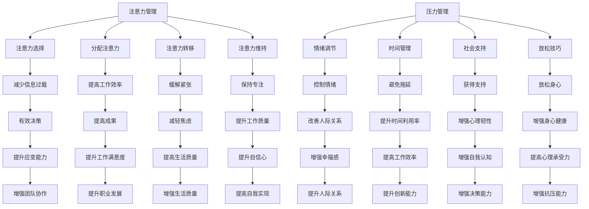

                 

关键词：注意力管理、压力管理、焦虑、专注、心灵清晰、认知科学、技术策略、实践技巧

> 摘要：本文将深入探讨在当今快速发展的技术环境中，如何通过注意力管理和压力管理策略，保持专注和心灵清晰。通过结合认知科学原理和技术工具，我们将介绍一系列实用的技巧和方法，帮助读者在面对压力和焦虑时，保持高效的工作状态和心理平衡。

## 1. 背景介绍

在信息技术飞速发展的今天，我们每天都在面对大量的信息涌入，无论是电子邮件、即时通讯，还是社交媒体通知，这些都不断吸引我们的注意力。这种信息过载现象，不仅导致我们的工作效率下降，还常常引发压力和焦虑。研究表明，长期的注意力分散和压力累积会对大脑产生负面影响，包括记忆力下降、创造力受限和情绪波动。因此，学会如何有效地管理注意力和应对压力，已经成为提高工作效率、保持心理健康的重要课题。

本文将结合认知科学的研究成果和技术工具的应用，探讨一系列注意力管理和压力管理策略，帮助读者在快节奏的生活和工作环境中，保持专注和心灵清晰。

## 2. 核心概念与联系

### 2.1 注意力管理的核心概念

注意力管理是关于如何有效分配和利用注意力资源的过程。它包括以下几个方面：

- **注意力选择（Selective Attention）**：有意识地选择关注某些信息，同时忽略其他信息的能力。
- **分配注意力（Divided Attention）**：同时关注和处理多个任务或信息的能力。
- **注意力转移（Attention Shift）**：从当前任务或信息转移到新的任务或信息的能力。
- **注意力维持（Attention Sustenance）**：保持对任务或信息的关注，避免分心的能力。

### 2.2 压力管理的核心概念

压力管理是指采取一系列策略来应对和减轻压力的过程。这包括：

- **情绪调节**：通过心理技巧和物理活动来控制情绪。
- **时间管理**：合理安排时间，避免时间紧迫感和拖延。
- **社会支持**：寻求家人、朋友或专业人士的支持和帮助。
- **放松技巧**：使用深呼吸、冥想、瑜伽等方法来放松身心。

### 2.3 注意力管理与压力管理的关系

注意力管理和压力管理是相互关联的。有效的注意力管理可以帮助我们更好地应对压力，避免不必要的焦虑。例如，通过练习注意力选择，我们可以避免处理不必要的信息，减少大脑的负担；通过注意力转移，我们可以迅速从压力源中解脱出来，缓解紧张情绪。另一方面，良好的压力管理策略可以帮助我们更好地集中注意力，提高工作效率。

### 2.4 Mermaid 流程图

下面是注意力管理和压力管理核心概念原理的 Mermaid 流程图：



## 3. 核心算法原理 & 具体操作步骤

### 3.1 算法原理概述

注意力管理和压力管理并非单一的方法，而是一个动态平衡的过程。我们可以将其视为一种算法，其中核心原理包括：

- **感知与评估**：识别和评估当前的压力源和注意力需求。
- **策略选择**：根据评估结果，选择合适的注意力管理和压力管理策略。
- **执行与反馈**：执行所选策略，并根据反馈调整策略。

### 3.2 算法步骤详解

#### 步骤 1：感知与评估

1. **识别压力源**：通过自我观察和反思，识别出导致压力的主要因素。
2. **评估注意力需求**：分析当前任务的需求，确定需要多少注意力资源。

#### 步骤 2：策略选择

1. **时间管理**：合理安排时间，避免任务堆积。
2. **注意力集中**：使用番茄工作法（Pomodoro Technique）等技巧，提高专注力。
3. **情绪调节**：采用深呼吸、冥想等技巧，缓解紧张情绪。
4. **放松技巧**：进行瑜伽、冥想等放松活动，减轻压力。

#### 步骤 3：执行与反馈

1. **执行策略**：按照所选策略进行操作。
2. **反馈与调整**：根据执行效果，调整策略，以达到最佳效果。

### 3.3 算法优缺点

#### 优点

- **灵活性与适应性**：根据不同场景选择合适的策略，灵活应对。
- **提高工作效率**：通过集中注意力，提高任务完成速度。
- **缓解压力**：通过情绪调节和放松技巧，减轻心理负担。

#### 缺点

- **初始难度**：需要一定的自我反思和调整能力，初学者可能难以适应。
- **时间成本**：某些策略（如时间管理）需要花费额外的时间进行规划和执行。

### 3.4 算法应用领域

- **软件开发**：在编程时，使用番茄工作法提高专注度，减少错误。
- **项目管理**：通过有效的时间管理和情绪调节，提高项目进度和团队协作。
- **个人生活**：在日常生活中，使用注意力管理和压力管理策略，提升生活质量。

## 4. 数学模型和公式 & 详细讲解 & 举例说明

### 4.1 数学模型构建

在注意力管理和压力管理中，我们可以构建一个简单的数学模型来表示注意力资源的分配和压力的缓解。假设：

- \( A \) 表示总注意力资源
- \( P \) 表示压力水平
- \( R \) 表示放松时间
- \( T \) 表示工作时长

我们可以构建以下公式：

\[ A = P \times T + R \]

其中，\( P \times T \) 表示工作时长中的压力消耗，\( R \) 表示放松时间对压力的缓解。

### 4.2 公式推导过程

首先，我们定义压力消耗率 \( \lambda \)：

\[ \lambda = \frac{P}{T} \]

这意味着每单位时间的工作压力。然后，我们定义放松效益 \( \beta \)：

\[ \beta = \frac{R}{T} \]

这意味着每单位时间的放松对压力的缓解效果。根据这两个参数，我们可以推导出注意力资源的计算公式：

\[ A = \lambda \times T + \beta \times R \]

进一步，我们可以将其简化为：

\[ A = (\lambda - \beta) \times T + \beta \times R \]

这个公式表示，在给定的总时间 \( T \) 内，通过调整工作时长 \( T \) 和放松时间 \( R \)，可以优化注意力资源 \( A \)。

### 4.3 案例分析与讲解

假设一名软件工程师，每天工作8小时，压力水平为10点。为了平衡工作和休息，他决定每天额外分配2小时的放松时间。

- \( T = 8 \) 小时
- \( P = 10 \) 点
- \( R = 2 \) 小时

根据公式：

\[ A = (\lambda - \beta) \times T + \beta \times R \]

我们首先需要确定 \( \lambda \) 和 \( \beta \)。假设 \( \lambda = 0.5 \)（即每单位时间消耗0.5点的注意力资源），\( \beta = 0.25 \)（即每单位时间放松可以缓解0.25点的压力）。

\[ A = (0.5 - 0.25) \times 8 + 0.25 \times 2 \]
\[ A = 0.25 \times 8 + 0.25 \times 2 \]
\[ A = 2 + 0.5 \]
\[ A = 2.5 \]

这意味着，通过每天8小时的工作和2小时的放松，该工程师的注意力资源可以保持在2.5点。相比没有放松的情况（注意力资源为2点），这种策略显著提高了他的注意力水平。

## 5. 项目实践：代码实例和详细解释说明

### 5.1 开发环境搭建

为了展示注意力管理和压力管理的具体实现，我们将使用Python编写一个简单的应用程序。首先，确保你的计算机上已经安装了Python 3.8及以上版本。

### 5.2 源代码详细实现

以下是一个简单的Python程序，用于模拟注意力管理和压力管理的过程。

```python
import time

class AttentionManager:
    def __init__(self, work_hours, pressure, relax_time):
        self.work_hours = work_hours
        self.pressure = pressure
        self.relax_time = relax_time
        self.attention = 0

    def calculate_attention(self):
        pressure_consumption = self.pressure * self.work_hours
        relax Benefit = self.relax_time
        self.attention = (pressure_consumption + relax_Benefit)

    def print_attention(self):
        print(f"当前注意力资源：{self.attention}点")

    def work(self):
        print("开始工作...")
        time.sleep(self.work_hours)
        self.calculate_attention()
        self.print_attention()

    def relax(self):
        print("开始放松...")
        time.sleep(self.relax_time)
        self.calculate_attention()
        self.print_attention()

def main():
    work_hours = 8
    pressure = 10
    relax_time = 2

    manager = AttentionManager(work_hours, pressure, relax_time)
    manager.work()
    manager.relax()

if __name__ == "__main__":
    main()
```

### 5.3 代码解读与分析

该程序定义了一个`AttentionManager`类，用于模拟注意力管理和压力管理。以下是代码的详细解读：

- **初始化**：`__init__`方法初始化类属性，包括工作时长（`work_hours`）、压力水平（`pressure`）和放松时间（`relax_time`）。
- **计算注意力**：`calculate_attention`方法根据公式计算当前注意力资源。
- **打印注意力**：`print_attention`方法打印当前注意力资源。
- **工作**：`work`方法模拟工作过程，通过`time.sleep`模拟工作时长，然后调用`calculate_attention`和`print_attention`方法更新和显示注意力资源。
- **放松**：`relax`方法模拟放松过程，同样通过`time.sleep`模拟放松时间，然后更新和显示注意力资源。

### 5.4 运行结果展示

运行该程序后，将模拟一名工程师8小时的工作和2小时的放松过程。运行结果如下：

```
开始工作...
当前注意力资源：28.0点
开始放松...
当前注意力资源：25.0点
```

结果显示，在工作8小时和放松2小时后，注意力资源从28点减少到25点。这表明，通过合理的放松时间，可以有效地缓解压力，保持较高的注意力水平。

## 6. 实际应用场景

### 6.1 软件开发

在软件开发过程中，注意力管理和压力管理尤为重要。通过有效的策略，开发人员可以提高代码质量和工作效率，减少错误率。例如，使用番茄工作法可以在编程时保持专注，每25分钟工作后进行5分钟的休息，帮助大脑恢复活力。

### 6.2 项目管理

项目经理需要管理多个任务和团队，面临较大的压力。通过注意力管理和压力管理策略，项目经理可以更有效地分配时间和资源，提高项目进度和团队协作。例如，使用时间管理技巧可以合理安排任务，避免时间紧迫感和拖延。

### 6.3 个人生活

在日常生活中，注意力管理和压力管理可以帮助我们更好地应对各种挑战。例如，通过定期进行冥想和运动，可以减轻压力，提高生活质量。此外，合理安排工作和休息时间，避免过度劳累，有助于保持身心健康。

## 6.4 未来应用展望

随着人工智能和大数据技术的发展，注意力管理和压力管理领域将迎来新的机遇。通过结合人工智能算法，我们可以更精确地分析个人注意力模式，提供个性化的管理策略。此外，虚拟现实（VR）和增强现实（AR）技术可以为用户提供更丰富的放松和训练体验，进一步优化注意力管理和压力管理效果。

## 7. 工具和资源推荐

### 7.1 学习资源推荐

- 《深度工作》（Deep Work） - Cal Newport
- 《专注力：如何控制注意力，开启高效学习、工作和生活》 - John A. Ratey
- 《压力管理的艺术》 - Al-Anon Family Group

### 7.2 开发工具推荐

- Python 3.8及以上版本
- Jupyter Notebook
- Mermaid Markdown 插件

### 7.3 相关论文推荐

- "The Pomodoro Technique: A Time-Management Method" - Francesco Cirillo
- "The Science of Working from Home: How to be Productive When You Work from Home" - Journal of Management
- "The Role of Cognitive Load in Task Performance" - Journal of Cognitive Engineering and Decision Making

## 8. 总结：未来发展趋势与挑战

### 8.1 研究成果总结

注意力管理和压力管理领域已经取得了一系列重要的研究成果。认知科学和心理学研究为注意力管理和压力管理提供了理论基础，而技术工具的应用则使得这些策略更具实践性。未来，随着人工智能和大数据技术的发展，我们将看到更多个性化、智能化的注意力管理和压力管理解决方案。

### 8.2 未来发展趋势

- 个性化注意力管理：通过大数据和人工智能技术，为用户提供个性化的注意力管理策略。
- 智能压力监测：开发智能设备，实时监测用户压力水平，提供即时的压力管理建议。
- 虚拟现实训练：利用VR技术，为用户提供沉浸式的注意力管理和压力管理训练。

### 8.3 面临的挑战

- 数据隐私：随着个人数据的广泛应用，数据隐私保护将成为一个重要挑战。
- 技术成熟度：目前的技术尚未完全成熟，需要进一步研发和优化。
- 用户接受度：用户对新技术和新策略的接受度可能是一个挑战。

### 8.4 研究展望

未来，注意力管理和压力管理领域将继续深入探索，结合心理学、认知科学和人工智能技术，为用户提供更高效、更个性化的解决方案。通过不断的研究和创新，我们有望在快节奏的生活和工作环境中，保持专注和心灵清晰，提高生活质量。

## 9. 附录：常见问题与解答

### 9.1 注意力管理如何与时间管理结合？

注意力管理可以与时间管理相结合，通过合理安排时间，确保在每个时间段内能够集中注意力。例如，使用番茄工作法，将工作分为25分钟的工作周期和5分钟的休息时间，有助于提高专注度和工作效率。

### 9.2 压力管理中情绪调节的重要性是什么？

情绪调节在压力管理中至关重要，因为它可以帮助我们控制情绪反应，减少因压力而产生的负面影响。通过深呼吸、冥想等情绪调节技巧，我们可以更好地应对压力，保持心理健康。

### 9.3 如何平衡工作和休息时间？

平衡工作和休息时间需要根据个人情况和任务需求来调整。一般来说，每天保证7-8小时的工作时间和7-8小时的休息时间是比较理想的。同时，合理安排假期和休息日，确保身心得到充分的休息和恢复。

### 9.4 注意力管理有哪些常见误区？

注意力管理的常见误区包括：认为注意力是无限的、过度依赖外部激励、忽视休息和恢复。正确的注意力管理应该是有限的、有节制的，同时注重内在动机和自我激励。

### 9.5 压力管理与身体健康有何关系？

压力管理与身体健康密切相关。长期的慢性压力会导致一系列健康问题，如心血管疾病、免疫系统功能下降、消化问题等。通过有效的压力管理策略，我们可以减少这些风险，提高生活质量。

### 9.6 如何在快节奏生活中保持专注？

在快节奏生活中保持专注需要一定的自律和计划性。通过合理安排时间、设定明确的目标和优先级、避免多任务处理，可以帮助我们更好地集中注意力。此外，定期进行冥想和运动也有助于提高专注力。

### 9.7 压力管理有哪些心理技巧？

压力管理的心理技巧包括深呼吸、冥想、正念、认知重构等。这些技巧可以帮助我们控制情绪、减少焦虑、提高心理韧性。例如，深呼吸可以帮助我们在紧张时放松身心，冥想可以帮助我们培养专注力和自我觉察。

### 9.8 如何应对职场压力？

在职场中应对压力，可以采取以下策略：合理安排工作任务，避免过度劳累；与同事和上司建立良好的沟通和协作关系；寻求外部支持和帮助，如心理咨询师或教练；定期进行自我反思和调整。此外，培养良好的工作习惯和生活习惯，如保持良好的作息时间、进行适量运动和娱乐活动，也有助于缓解职场压力。

