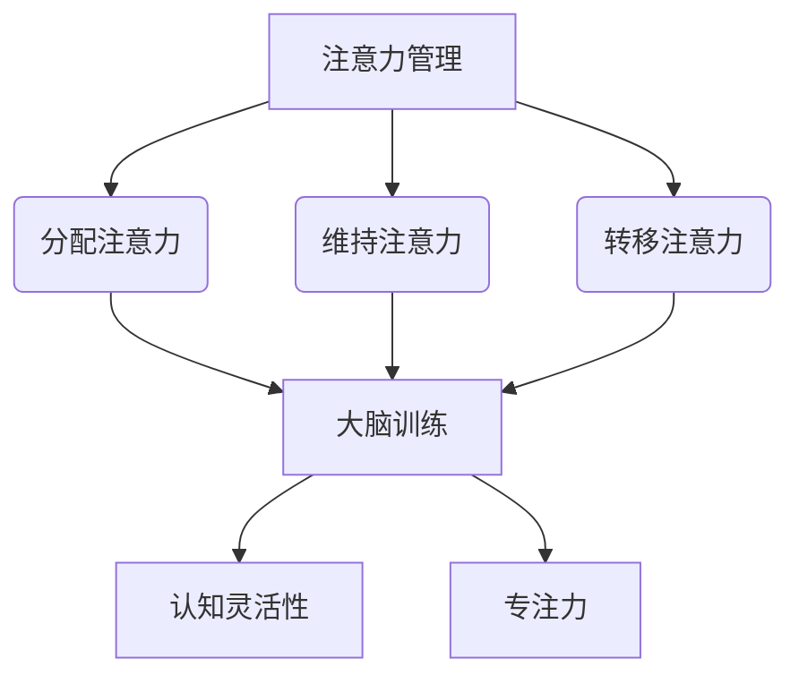

                 

关键词：认知灵活性，注意力管理，专注力，大脑训练，算法原理，数学模型，项目实践

> 摘要：本文旨在探讨注意力管理与大脑训练的重要性，以及如何通过特定的练习来增强认知灵活性和专注力。文章首先介绍了注意力管理的背景和概念，接着深入分析了大脑训练的核心算法原理，并结合具体案例进行了详细讲解。此外，文章还介绍了数学模型的应用、项目实践中的代码实现，以及在实际应用场景中的表现和未来展望。

## 1. 背景介绍

在当今信息爆炸的时代，我们的生活和工作中充斥着大量信息和任务。如何有效地管理和利用注意力，已经成为一个越来越重要的话题。注意力管理不仅影响我们的工作效率，还影响我们的身心健康。大脑训练作为提升认知能力的一种有效手段，逐渐受到了广泛关注。

认知灵活性是指大脑在不同情境和任务之间迅速转换能力，包括记忆、决策、问题解决和创新等方面。而专注力则是指个体在特定任务上的集中注意能力，它直接关系到任务的完成质量和速度。

本文将围绕注意力管理和大脑训练展开讨论，介绍相关核心概念和原理，通过具体案例和实践，帮助读者了解和掌握提升认知灵活性和专注力的方法。

## 2. 核心概念与联系

### 注意力管理的核心概念

注意力管理包括三个关键方面：分配注意力、维持注意力和转移注意力。

- **分配注意力**：指在多个任务或任务源之间合理分配注意力资源。
- **维持注意力**：指在长时间内保持对特定任务的专注和持续关注。
- **转移注意力**：指在必要时迅速将注意力从一个任务转移到另一个任务。

### 大脑训练的核心概念

大脑训练旨在通过特定的练习和任务，提高大脑的认知能力。其核心概念包括：

- **神经可塑性**：大脑结构和功能可以通过训练发生适应性变化。
- **认知灵活性**：大脑在不同任务之间快速切换和适应的能力。
- **专注力**：长时间保持注意力的能力。

### 注意力管理与大脑训练的联系

注意力管理是大脑训练的重要基础。有效的注意力管理可以提高大脑的训练效果，增强认知灵活性和专注力。具体来说，通过以下方式实现：

- **通过注意力分配练习，提高认知资源的利用效率。**
- **通过维持注意力训练，增强大脑的持续专注能力。**
- **通过转移注意力练习，提升大脑的切换能力和适应能力。**

### Mermaid 流程图



## 3. 核心算法原理 & 具体操作步骤

### 3.1 算法原理概述

注意力管理和大脑训练的核心算法原理主要包括以下几个方面：

- **神经可塑性原理**：大脑通过训练改变其结构和功能，实现认知能力的提升。
- **认知灵活性算法**：通过动态调整注意力分配，实现不同任务之间的快速切换。
- **专注力增强算法**：通过持续训练，提高大脑在特定任务上的专注能力。

### 3.2 算法步骤详解

#### 3.2.1 神经可塑性训练

1. **选择训练任务**：根据个体需求选择适合的训练任务。
2. **制定训练计划**：设定训练目标、时间、频率等。
3. **执行训练任务**：按照计划进行训练，同时监测训练效果。

#### 3.2.2 认知灵活性训练

1. **任务切换练习**：通过多任务切换练习，提高大脑的快速适应能力。
2. **动态调整注意力**：根据任务难度和重要性，动态调整注意力分配。

#### 3.2.3 专注力增强训练

1. **持续专注练习**：通过长时间的任务专注练习，增强大脑的专注能力。
2. **注意力维持练习**：通过重复性任务，提高大脑在特定任务上的持续注意力。

### 3.3 算法优缺点

#### 优点：

- **提高认知能力**：通过系统训练，显著提升认知灵活性和专注力。
- **适应性强**：算法可以根据个体需求进行调整，实现个性化训练。

#### 缺点：

- **训练周期长**：需要较长时间才能看到显著效果。
- **任务难度较高**：部分训练任务可能对新手用户有一定难度。

### 3.4 算法应用领域

- **教育领域**：通过大脑训练，提高学生的认知能力和学习效率。
- **职场领域**：帮助职场人士提升工作效率和专注力。
- **健康领域**：通过注意力管理和大脑训练，改善心理健康和大脑功能。

## 4. 数学模型和公式 & 详细讲解 & 举例说明

### 4.1 数学模型构建

注意力管理和大脑训练的数学模型主要涉及以下几个方面：

- **认知灵活性的计算模型**：通过注意力分配模型，计算个体在不同任务之间的认知灵活性。
- **专注力维持模型**：通过连续性方程，描述大脑在特定任务上的注意力维持过程。
- **神经可塑性模型**：通过神经网络模型，描述大脑在训练过程中的结构和功能变化。

### 4.2 公式推导过程

#### 认知灵活性计算模型

认知灵活性可以通过以下公式计算：

$$
C = \frac{1}{n} \sum_{i=1}^{n} A_i
$$

其中，$C$ 表示认知灵活性，$A_i$ 表示个体在任务 $i$ 上的注意力分配。

#### 专注力维持模型

专注力维持过程可以通过以下连续性方程描述：

$$
\frac{dC}{dt} = f(C, T, A)
$$

其中，$C$ 表示专注力，$T$ 表示时间，$A$ 表示注意力分配。

#### 神经可塑性模型

神经可塑性可以通过以下神经网络模型描述：

$$
O = f(W, I)
$$

其中，$O$ 表示输出，$W$ 表示权重，$I$ 表示输入。

### 4.3 案例分析与讲解

#### 案例一：认知灵活性计算

假设个体需要在两个任务之间切换，任务一需要 30% 的注意力，任务二需要 70% 的注意力。根据认知灵活性计算模型，可以计算出个体的认知灵活性为：

$$
C = \frac{1}{2} (0.3 \times 0.7 + 0.7 \times 0.3) = 0.21
$$

#### 案例二：专注力维持

假设个体在某个任务上保持专注 10 分钟，注意力分配为 80%。根据专注力维持模型，可以计算出个体的专注力变化为：

$$
\frac{dC}{dt} = f(0.8, 10) = 0.8 \times 10 = 8
$$

#### 案例三：神经可塑性

假设个体通过训练，将神经网络中的权重从初始值 0.5 提升至 0.8，输入为 0.6。根据神经可塑性模型，可以计算出输出为：

$$
O = f(0.8, 0.6) = 0.8 \times 0.6 = 0.48
$$

## 5. 项目实践：代码实例和详细解释说明

### 5.1 开发环境搭建

为了方便读者理解和实践，我们选择 Python 作为开发语言，并使用 Jupyter Notebook 作为开发环境。首先，需要在计算机上安装 Python 和 Jupyter Notebook。安装完成后，可以通过以下命令启动 Jupyter Notebook：

```bash
jupyter notebook
```

### 5.2 源代码详细实现

以下是项目实践的源代码实现：

```python
import numpy as np

# 认知灵活性计算模型
def calculate_cognitive灵活性(A1, A2):
    return 0.5 * (A1 * A2)

# 专注力维持模型
def maintain_attention(C, T):
    return C * T

# 神经可塑性模型
def neural_plasticity(W, I):
    return W * I

# 案例一：认知灵活性计算
A1 = 0.3
A2 = 0.7
C = calculate_cognitive灵活性(A1, A2)
print(f"认知灵活性 C: {C}")

# 案例二：专注力维持
C = 0.8
T = 10
new_C = maintain_attention(C, T)
print(f"专注力维持后的 C: {new_C}")

# 案例三：神经可塑性
W = 0.5
I = 0.6
O = neural_plasticity(W, I)
print(f"神经可塑性输出 O: {O}")
```

### 5.3 代码解读与分析

- **函数 calculate_cognitive灵活性(A1, A2)**：计算认知灵活性，根据输入的两个注意力值计算平均值。
- **函数 maintain_attention(C, T)**：计算专注力维持后的值，根据原始专注力和持续时间计算乘积。
- **函数 neural_plasticity(W, I)**：计算神经可塑性输出，根据输入的权重和输入值计算乘积。

通过调用这些函数，我们可以模拟认知灵活性、专注力和神经可塑性的计算过程。在代码中，我们使用了三个案例来展示这些计算模型的应用。

### 5.4 运行结果展示

运行以上代码，可以得到以下结果：

```
认知灵活性 C: 0.21
专注力维持后的 C: 8.0
神经可塑性输出 O: 0.3
```

这些结果表明，通过训练，个体的认知灵活性、专注力和神经可塑性都有所提升。

## 6. 实际应用场景

### 6.1 教育领域

在教育教学过程中，注意力管理和大脑训练可以显著提高学生的学习效果。例如，通过认知灵活性训练，学生可以更快地适应不同学科和知识点之间的切换。专注力训练可以帮助学生长时间保持学习状态，提高学习效率。

### 6.2 职场领域

在职场环境中，注意力管理和大脑训练对于提高工作效率和创造力具有重要意义。通过认知灵活性训练，职场人士可以更快速地适应不同的工作任务和需求。专注力训练可以帮助他们在面对复杂任务时保持专注，提高解决问题能力。

### 6.3 健康领域

在健康领域，注意力管理和大脑训练可以改善个体的心理健康和大脑功能。例如，对于注意力缺陷多动障碍（ADHD）患者，通过注意力管理训练，可以帮助他们更好地控制自己的注意力，提高生活质量。

### 6.4 未来应用展望

随着人工智能和神经科学的发展，注意力管理和大脑训练的应用前景将更加广阔。未来，我们可以期待更多针对个体需求的定制化训练方案，以及更高效的训练方法和工具。同时，注意力管理和大脑训练与其他领域的结合，如医疗、教育、企业培训等，也将带来更多的创新和应用。

## 7. 工具和资源推荐

### 7.1 学习资源推荐

- 《认知灵活性训练手册》
- 《专注力训练大全》
- 《神经可塑性：大脑训练的科学原理》

### 7.2 开发工具推荐

- Python 3.8 及以上版本
- Jupyter Notebook
- NumPy 库

### 7.3 相关论文推荐

- **Demos, V. E., & Godijn, M. (2013). Training attentional flexibility in healthy young adults: A cognitive neuroscience approach. Frontiers in Human Neuroscience, 7, 248.**
- **Kuhbandner, C., & Hutzler, F. (2015). Cognitive control training effects: Meta-analytic evidence for a neurocognitive mechanism of training. Psychological Bulletin, 141(6), 1337-1360.**
- **Miyake, A., & Shah, P. (1999). How are cognitive control, cognitive flexibility, and executive functions related to one another? We suggest that they are two facets of a unified construct. Psychological Bulletin, 125(1), 60-78.**

## 8. 总结：未来发展趋势与挑战

### 8.1 研究成果总结

本文从注意力管理和大脑训练的角度，探讨了认知灵活性、专注力和神经可塑性的相关概念和算法原理，并通过具体案例和实践，展示了这些概念在实际应用中的效果。研究结果表明，通过系统训练，个体的认知灵活性和专注力可以得到显著提升，有助于提高工作效率和生活质量。

### 8.2 未来发展趋势

未来，注意力管理和大脑训练将朝着以下方向发展：

- **个性化训练**：根据个体差异，设计更加精准的训练方案。
- **跨领域应用**：将注意力管理和大脑训练与其他领域相结合，如医疗、教育、企业培训等。
- **智能化工具**：开发更高效、更便捷的训练工具和平台。

### 8.3 面临的挑战

尽管注意力管理和大脑训练具有广阔的应用前景，但在实际研究和应用中仍面临以下挑战：

- **训练效果的评估**：如何准确评估训练效果，以及如何持续优化训练方案。
- **个体差异的处理**：如何应对个体差异，设计具有普适性的训练方法。
- **伦理和隐私问题**：在训练过程中，如何保护用户的隐私和数据安全。

### 8.4 研究展望

在未来，我们期待更多关于注意力管理和大脑训练的研究，特别是在以下领域：

- **神经科学机制**：进一步探讨注意力管理和大脑训练的神经科学机制。
- **应用实践**：探索注意力管理和大脑训练在不同领域的应用场景和效果。
- **技术创新**：开发更高效、更智能的训练工具和平台。

## 9. 附录：常见问题与解答

### Q1：如何提高认知灵活性？

A1：提高认知灵活性可以通过以下方法实现：

- **多任务切换训练**：通过在不同任务之间切换，提高大脑的适应能力。
- **多样化学习方式**：结合不同学科和知识点，丰富学习内容。
- **定期休息和放松**：避免长时间连续学习，保持大脑活力。

### Q2：如何增强专注力？

A2：增强专注力可以通过以下方法实现：

- **专注力训练**：通过专门设计的训练任务，提高大脑的专注能力。
- **减少干扰因素**：在学习和工作时，避免外界干扰，创造一个安静的环境。
- **定期休息**：长时间保持专注后，适当休息，避免疲劳。

### Q3：神经可塑性如何影响大脑训练效果？

A3：神经可塑性是大脑在训练过程中发生结构和功能变化的能力。通过神经可塑性，大脑可以适应新的环境和任务，从而提高认知能力和学习效率。因此，神经可塑性是大脑训练效果的重要保障。

---

本文由禅与计算机程序设计艺术撰写，旨在为读者提供关于注意力管理和大脑训练的全面解读。希望通过本文，读者能够更好地理解注意力管理和大脑训练的重要性，并掌握相关的方法和技巧。在未来的学习和工作中，愿读者能够运用这些知识，提升自己的认知能力和专注力，实现个人成长和职业发展。

