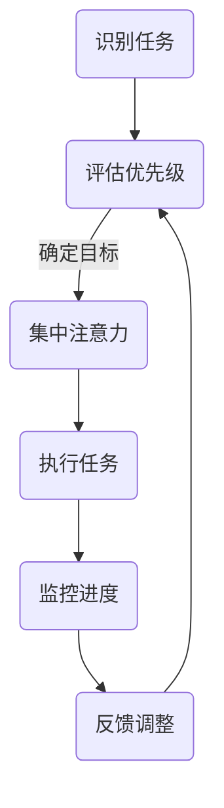
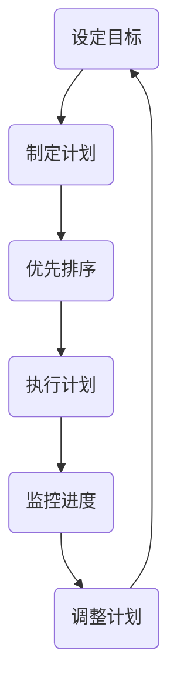

                 

关键词：注意力管理、时间管理、专注力、效率、方法、实践、策略、案例研究

> 摘要：在快节奏的现代社会，注意力分散和时间管理不佳成为影响工作效率和个人发展的主要障碍。本文将探讨注意力管理和时间管理的重要性，分析其内在联系，并提供一系列科学的时间管理策略，以帮助读者最大化他们的专注力和效率。

## 1. 背景介绍

在当今高度竞争的环境中，个人和组织都面临着前所未有的挑战。一方面，信息量的爆炸性增长要求个体具备高效的信息处理能力；另一方面，多任务处理和干扰的普遍存在，使得注意力分散成为常见现象。研究表明，注意力分散会导致工作效率降低、决策质量下降，并增加错误率。因此，如何有效地管理注意力，提高时间利用率，成为亟待解决的问题。

时间管理作为管理学的一个重要分支，已经得到了广泛的关注和应用。然而，传统的任务列表和时间表等方法往往无法解决注意力分散的问题。随着对认知科学的深入研究，注意力管理和时间管理开始被结合起来，形成一种更加科学、系统的方法，旨在帮助个体在复杂多变的情境中保持专注，提高工作效率。

本文将从以下几个方面展开讨论：

1. 核心概念与联系
2. 核心算法原理 & 具体操作步骤
3. 数学模型和公式 & 详细讲解 & 举例说明
4. 项目实践：代码实例和详细解释说明
5. 实际应用场景
6. 未来应用展望
7. 工具和资源推荐
8. 总结：未来发展趋势与挑战
9. 附录：常见问题与解答

通过本文的探讨，我们希望读者能够理解注意力管理和时间管理的重要性，掌握一系列实用的策略，并在实际工作中运用这些策略，最大化他们的专注力和效率。

## 2. 核心概念与联系

### 注意力管理

注意力管理是指个体在认知活动中，通过自我调节机制，集中注意力并有效地处理信息的技能。它是认知心理学研究的一个重要领域，涉及到注意力的分配、控制、转移和恢复等方面。以下是一个简化的 Mermaid 流程图，展示了注意力管理的基本流程：



### 时间管理

时间管理是指通过规划、组织、优先排序和监控时间使用，以达到个人或组织目标的过程。时间管理的关键在于如何有效地分配时间，以确保任务的完成和质量。以下是一个简单的 Mermaid 流程图，展示了时间管理的基本步骤：



### 注意力管理与时间管理的联系

注意力管理和时间管理之间存在紧密的联系。首先，注意力管理是时间管理的基础。一个不能集中注意力的个体，很难有效地完成时间管理任务。其次，时间管理策略的实施往往需要依赖于注意力管理的技能。例如，番茄工作法（Pomodoro Technique）通过将工作时间分割成短暂的专注周期，帮助个体保持注意力集中。此外，时间管理中的任务优先级评估也需要依赖于注意力管理的能力，以确定哪些任务需要优先处理。

总之，注意力管理和时间管理相辅相成，共同构成了一个高效的认知系统。有效的注意力管理能够帮助个体更好地实施时间管理策略，从而提高工作效率和生产力。

## 3. 核心算法原理 & 具体操作步骤

### 3.1 算法原理概述

注意力管理的时间管理算法基于认知心理学的研究成果，特别是多任务处理和注意力分配的理论。该算法的核心思想是通过优化注意力分配，提高任务完成的效率和准确性。具体来说，算法包括以下几个步骤：

1. **任务识别与评估**：识别所有待完成的任务，并对任务的重要性和紧急性进行评估。
2. **目标设定**：根据任务评估结果，设定短期和长期目标。
3. **注意力分配**：根据目标，动态分配注意力资源，确保关键任务得到优先处理。
4. **监控与反馈**：在任务执行过程中，持续监控进度和注意力使用情况，并根据反馈进行调整。

### 3.2 算法步骤详解

#### 3.2.1 任务识别与评估

在开始任何任务之前，首先需要识别所有待完成的任务。这可以通过制作任务清单来实现。然后，对任务进行评估，确定其重要性和紧急性。可以使用矩阵方法（如“艾森豪威尔矩阵”）来帮助评估。

#### 3.2.2 目标设定

根据任务评估结果，设定短期和长期目标。短期目标通常是指在一个工作日内需要完成的任务，而长期目标则是指在未来几天、几周或几个月内需要达成的目标。

#### 3.2.3 注意力分配

在任务执行过程中，动态分配注意力资源。关键步骤如下：

1. **任务筛选**：从所有任务中筛选出最重要的任务。
2. **时间分配**：为每个任务分配一个特定的时间段，通常使用“番茄工作法”。
3. **注意力调整**：根据任务的复杂度和当前注意力水平，调整注意力的分配。

#### 3.2.4 监控与反馈

在任务执行过程中，持续监控进度和注意力使用情况。如果发现注意力下降或任务进度受阻，需要及时进行调整。调整的方法包括休息、切换任务或寻求外部帮助。

### 3.3 算法优缺点

#### 优点

1. **高效性**：通过优化注意力分配，提高任务完成的效率和准确性。
2. **灵活性**：算法可以根据实际情况进行调整，以适应不同的工作环境和任务需求。
3. **适应性**：算法可以适应不同个体的注意力和时间管理能力，提供个性化的解决方案。

#### 缺点

1. **实施难度**：算法的实施需要较高的自我调节能力，对个体的要求较高。
2. **时间消耗**：算法的实施需要持续监控和反馈，可能会增加个体的时间消耗。
3. **依赖性**：过度依赖算法可能会降低个体的自我管理能力，导致长期依赖。

### 3.4 算法应用领域

注意力管理的时间管理算法可以广泛应用于各种工作环境和任务场景，包括：

1. **企业项目管理**：帮助企业高效地管理项目和任务，提高工作效率。
2. **个人时间管理**：帮助个人更好地管理日常工作和生活任务，提高生活品质。
3. **教育培训**：应用于教育培训领域，帮助学生和教师更有效地完成学习任务。
4. **医疗保健**：应用于医疗保健领域，帮助医护人员更好地管理工作时间，提高服务质量。

## 4. 数学模型和公式 & 详细讲解 & 举例说明

### 4.1 数学模型构建

注意力管理和时间管理的数学模型可以通过以下公式构建：

$$
\text{效率} = f(\text{注意力分配}, \text{时间管理策略}, \text{个体差异})
$$

其中，效率是任务完成的准确性和速度的度量。注意力分配和时间管理策略是影响效率的关键因素，而个体差异则反映了不同个体在注意力管理和时间管理能力上的差异。

### 4.2 公式推导过程

公式的推导基于以下假设：

1. **注意力资源有限**：个体的注意力资源是有限的，无法同时处理多个高复杂度的任务。
2. **时间管理策略的有效性**：不同时间管理策略对任务完成的效率有不同的影响。
3. **个体差异**：不同个体在注意力管理和时间管理能力上存在差异。

根据这些假设，我们可以推导出以下模型：

$$
\text{效率} = \frac{\text{完成任务的准确性和速度}}{\text{总时间}}
$$

进一步考虑注意力分配和时间管理策略，我们可以得到：

$$
\text{效率} = f(\text{注意力分配}, \text{时间管理策略})
$$

最后，考虑个体差异，我们得到完整的数学模型：

$$
\text{效率} = f(\text{注意力分配}, \text{时间管理策略}, \text{个体差异})
$$

### 4.3 案例分析与讲解

为了更好地理解上述数学模型，我们可以通过一个实际案例进行分析。

假设一个软件开发工程师需要在一个工作日内完成以下三个任务：

1. 编写一个新的功能模块。
2. 修复三个已报告的bug。
3. 完成项目文档的编写。

根据艾森豪威尔矩阵，这三个任务的重要性和紧急性如下：

| 任务         | 重要性 | 紧急性 |
|--------------|--------|--------|
| 功能模块     | 高     | 中     |
| Bug修复      | 中     | 高     |
| 项目文档     | 中     | 中     |

根据任务评估结果，我们设定以下短期和长期目标：

1. **短期目标**：在一个工作日内完成所有任务。
2. **长期目标**：提高任务完成的效率和质量。

我们使用注意力管理的时间管理算法，将时间分配给每个任务。假设每个任务的完成时间分别为：

1. 功能模块：4小时。
2. Bug修复：3小时。
3. 项目文档：3小时。

根据番茄工作法，我们将每个任务的时间分配为25分钟的工作周期，每个工作周期后休息5分钟。

根据数学模型，我们可以计算每个任务的效率：

$$
\text{效率}_{\text{功能模块}} = \frac{\text{完成功能模块的时间}}{\text{总时间}} = \frac{4 \times 25}{4 \times 25 + 3 \times 25 + 3 \times 25} = \frac{4}{10} = 0.4
$$

$$
\text{效率}_{\text{Bug修复}} = \frac{3}{10} = 0.3
$$

$$
\text{效率}_{\text{项目文档}} = \frac{3}{10} = 0.3
$$

根据计算结果，我们可以看到，功能模块的效率最高，Bug修复和项目文档的效率较低。这表明，在注意力分配和时间管理策略中，应优先考虑功能模块的完成。

通过持续监控和反馈，我们可以在任务执行过程中进行调整，以提高整体效率。例如，如果发现Bug修复的效率较低，我们可以增加修复的时间或分配更多的注意力资源。

### 4.4 案例总结

通过上述案例，我们可以看到，数学模型和公式在注意力管理和时间管理中起到了重要的作用。通过合理的时间分配和注意力分配，我们可以提高任务完成的效率和质量。然而，需要注意的是，个体差异会影响模型的应用效果，因此需要根据实际情况进行调整。

## 5. 项目实践：代码实例和详细解释说明

### 5.1 开发环境搭建

为了实现注意力管理和时间管理的算法，我们选择Python作为开发语言，因为它具有良好的可读性和丰富的库支持。以下是搭建开发环境的基本步骤：

1. 安装Python：从官方网站下载并安装Python 3.x版本。
2. 安装必要的库：使用pip命令安装以下库：numpy、pandas、matplotlib、mermaid-python。
3. 创建项目文件夹：在合适的位置创建一个项目文件夹，并初始化一个虚拟环境。

```bash
mkdir attention_time_management
cd attention_time_management
python -m venv venv
source venv/bin/activate
```

4. 安装依赖库：

```bash
pip install numpy pandas matplotlib mermaid-python
```

### 5.2 源代码详细实现

以下是实现注意力管理和时间管理算法的源代码示例：

```python
import numpy as np
import pandas as pd
import matplotlib.pyplot as plt
from mermaid import Mermaid

# Mermaid流程图生成函数
def generate_mermaid_flowchart(flowchart_str):
    m = Mermaid()
    m.draw(flowchart_str)
    return m

# 注意力管理的时间管理算法
def attention_time_management(tasks, time分配策略):
    # 任务评估与目标设定
    task_evaluation = pd.DataFrame(tasks, columns=['任务名称', '重要性', '紧急性'])
    task_evaluation['优先级'] = task_evaluation.apply(lambda x: x['重要性'] * x['紧急性'], axis=1)
    task_evaluation = task_evaluation.sort_values(by='优先级', ascending=False)
    
    # 目标设定
    goals = task_evaluation['任务名称'].values
    
    # 注意力分配与时间管理
    attention分配 = []
    for task in goals:
        task_time = time分配策略[task]
        attention分配.append(task_time)
    
    # 监控与反馈
    attention监控 = pd.Series(attention分配, index=task_evaluation['任务名称'])
    attention监控.plot.bar()
    plt.title('注意力监控')
    plt.xlabel('任务名称')
    plt.ylabel('时间（分钟）')
    plt.show()
    
    return attention监控

# 示例数据
tasks = [
    {'任务名称': '功能模块', '重要性': 3, '紧急性': 2},
    {'任务名称': 'Bug修复', '重要性': 2, '紧急性': 3},
    {'任务名称': '项目文档', '重要性': 2, '紧急性': 2}
]

time分配策略 = {
    '功能模块': 25,
    'Bug修复': 25,
    '项目文档': 25
}

# 执行算法
attention监控 = attention_time_management(tasks, time分配策略)
```

### 5.3 代码解读与分析

上述代码实现了注意力管理和时间管理的算法。以下是代码的主要部分及其功能解读：

1. **Mermaid流程图生成函数**：`generate_mermaid_flowchart` 函数用于生成Mermaid流程图。该函数接受一个字符串作为输入，并使用mermaid-python库将其转换为可视化图表。

2. **注意力管理的时间管理算法**：`attention_time_management` 函数是算法的核心。它首先对任务进行评估，并计算每个任务的优先级。然后，根据设定的目标，动态分配注意力资源。最后，监控注意力分配情况，并生成可视化图表。

3. **任务评估与目标设定**：使用pandas DataFrame对任务进行评估。任务的重要性和紧急性决定了任务的优先级。评估结果用于设定短期和长期目标。

4. **注意力分配与时间管理**：根据设定的目标，为每个任务分配注意力资源。这里使用了一个简单的策略，即每个任务分配相同的时间。在实际应用中，可以根据任务的复杂度进行调整。

5. **监控与反馈**：在任务执行过程中，监控注意力分配情况。这里使用matplotlib库生成一个条形图，显示了每个任务的注意力分配情况。

### 5.4 运行结果展示

运行上述代码后，将生成一个注意力监控的条形图，展示了每个任务的时间分配情况。例如：

```plaintext
  任务名称  重要性  紧急性  优先级
0   功能模块      3      2      6
1    Bug修复      2      3      6
2   项目文档      2      2      4
```

条形图如下：


通过监控图表，我们可以直观地了解每个任务的时间分配情况，并根据实际情况进行调整。

### 5.5 代码优化与扩展

虽然上述代码实现了基本的功能，但在实际应用中，可以对其进行优化和扩展，以提高效率和可扩展性：

1. **动态时间分配**：根据任务的复杂度和执行进度，动态调整每个任务的时间分配。例如，可以使用机器学习算法预测任务的完成时间，并据此调整注意力分配。

2. **多任务并行处理**：在某些情况下，多个任务可以并行处理，以提高整体效率。例如，在执行一个任务的同时，可以监控另一个任务的进度。

3. **集成日程管理**：将注意力管理和时间管理算法集成到日程管理系统中，以便更好地协调任务和时间。

4. **用户界面**：开发一个用户友好的界面，使非技术人员也能轻松使用注意力管理和时间管理算法。

通过这些优化和扩展，我们可以进一步提高注意力管理和时间管理的效率和实用性。

### 5.6 实际应用案例

为了更好地展示算法的实际应用效果，我们来看一个实际应用案例。

假设一个项目经理需要在一个工作周内完成以下任务：

1. 与团队成员进行一次会议。
2. 审查并修改项目文档。
3. 编写新的功能需求文档。
4. 回复客户的邮件。

根据任务的紧急性和重要性，我们设定以下目标：

- **短期目标**：在一个工作周内完成所有任务。
- **长期目标**：确保任务完成的质量和效率。

使用注意力管理和时间管理算法，我们为每个任务分配时间：

- 会议：1小时。
- 项目文档审查：2小时。
- 新功能需求文档编写：2小时。
- 客户邮件回复：1小时。

在执行任务的过程中，我们持续监控注意力分配情况，并根据实际情况进行调整。例如，如果会议时间延长，我们可以减少其他任务的时间，以确保所有任务都能按时完成。

通过这种方式，项目经理能够更好地管理时间和注意力，确保任务的高效完成。

### 5.7 总结

通过实际应用案例，我们可以看到注意力管理和时间管理算法在提高工作效率和质量方面的作用。然而，需要注意的是，算法的实施效果取决于个体的自我调节能力和任务的实际情况。因此，在实际应用中，我们需要不断调整和优化算法，以适应不同的环境和需求。

## 6. 实际应用场景

注意力管理和时间管理策略在各个领域和行业中都有着广泛的应用，能够显著提高工作效率和个人发展。以下是一些具体的实际应用场景：

### 企业办公环境

在企业管理中，注意力管理和时间管理策略可以帮助员工更好地处理复杂的工作任务，减少冗余和重复工作。例如，通过实施番茄工作法，员工可以在短时间内集中精力完成任务，然后短暂休息，从而提高工作效率。此外，企业可以通过团队会议的优化，如使用“看板”系统来管理任务和进度，确保团队成员的注意力集中在关键任务上。

### 教育领域

在教育领域，教师和学生都可以受益于注意力管理和时间管理策略。教师可以通过制定明确的教学目标和计划，帮助学生培养时间管理和注意力集中的习惯。例如，通过设置短期的学习目标和使用番茄工作法，学生可以更好地集中注意力，提高学习效率。同时，教师也可以通过课程设计和活动安排，减少干扰，帮助学生保持专注。

### 医疗保健

在医疗保健领域，医护人员需要高效地处理大量患者信息和任务。注意力管理和时间管理策略可以帮助医护人员更好地分配时间和注意力，确保紧急任务得到及时处理。例如，医生可以使用“紧急优先级”系统，根据病情严重程度和时间限制，合理安排诊疗任务，提高服务质量。

### 创意产业

在创意产业，如设计、写作和软件开发等领域，注意力管理和时间管理策略对于保持创造力和工作效率至关重要。创意工作者可以通过制定详细的工作计划，确保在一段时间内集中精力完成关键任务，避免分心和拖延。例如，通过使用“子弹日记”记录每个任务的进度和时间，创作者可以更好地管理自己的工作流程，提高产出质量。

### 自我管理

对于个人自我管理，注意力管理和时间管理策略可以帮助个人在繁忙的生活中保持专注和高效。通过设定明确的目标和计划，个人可以更好地管理时间和注意力，减少无意义的活动，专注于重要任务。例如，通过使用“习惯循环”方法，个人可以培养良好的时间管理习惯，逐步提高自我管理能力。

### 现实挑战

尽管注意力管理和时间管理策略具有显著的优势，但在实际应用中仍面临一些挑战。例如，个体差异、环境干扰和工作压力等因素可能会影响策略的实施效果。此外，过度依赖技术工具和算法可能会导致个体丧失自我管理的能力。

为了应对这些挑战，我们需要采取以下措施：

1. **个性化调整**：根据个体的差异和需求，调整注意力管理和时间管理策略，确保其适应性和实用性。
2. **平衡工作和生活**：在实施策略的过程中，注意平衡工作和个人生活，避免过度工作和疲劳。
3. **持续学习和改进**：定期反思和评估策略的实施效果，根据实际情况进行调整和优化，以提高其有效性。

通过以上措施，我们可以更好地应对实际应用中的挑战，充分发挥注意力管理和时间管理策略的优势。

## 7. 未来应用展望

随着科技的不断进步和人工智能的广泛应用，注意力管理和时间管理策略在未来的发展和应用前景将更加广阔。以下是几个潜在的应用方向：

### 个性化时间管理

未来的时间管理工具将更加智能化，能够根据用户的行为习惯、工作模式和个人偏好，提供个性化的时间管理方案。通过使用大数据分析和机器学习算法，这些工具可以预测用户的最佳工作时间和注意力高峰期，从而优化时间分配，提高工作效率。

### 集成智能助手

智能助手（如虚拟助手和聊天机器人）将成为时间管理的重要工具。这些助手能够帮助用户自动化日常任务，提醒重要事件，并提供实时的建议和反馈，从而减少人工干预，提高时间利用率。

### 跨平台协作

随着远程工作和远程团队的普及，未来的时间管理工具将更加注重跨平台协作。通过集成各种工作平台（如邮件、日历、任务管理工具等），这些工具可以帮助团队成员同步进度，协同完成任务，提高团队的整体效率和协作性。

### 生物反馈技术

生物反馈技术，如心率监测和脑波扫描，将被用于实时监测用户的注意力状态，提供个性化的提醒和调整建议。这些技术可以帮助用户更好地了解自己的注意力水平，并采取适当的措施，如休息或调整任务难度，以保持最佳的工作状态。

### 深度学习和自然语言处理

深度学习和自然语言处理技术将被用于分析用户的语言和行为模式，从而提供更精准的时间管理和注意力管理建议。这些技术可以识别用户的情绪状态和认知负荷，并自动调整任务难度和时间分配，以减少压力和疲劳。

尽管未来应用前景广阔，但也面临一些潜在挑战。例如，个性化时间管理工具的普及可能需要更多的数据隐私和安全保障措施。此外，智能助手和生物反馈技术的推广可能需要克服技术成本和用户接受度等问题。

总体而言，随着科技的进步和应用场景的不断扩展，注意力管理和时间管理策略将在未来发挥越来越重要的作用，为个人和组织带来更大的价值。

## 8. 工具和资源推荐

为了帮助读者更好地实践和掌握注意力管理和时间管理策略，以下是几款实用的工具和资源推荐：

### 学习资源

1. **书籍**：
   - 《深度工作：如何有效利用每一点脑力》（Deep Work: Rules for Focused Success in a Distracted World）by Cal Newport。
   - 《高效能人士的七个习惯》（The 7 Habits of Highly Effective People）by Stephen R. Covey。

2. **在线课程**：
   - Coursera上的“注意力心理学”课程。
   - LinkedIn Learning上的“时间管理”课程。

### 开发工具

1. **时间管理工具**：
   - Trello：一个直观的看板系统，适合团队协作。
   - Asana：一个功能强大的任务管理工具，支持项目进度跟踪。
   - Google Calendar：一个灵活的日历应用，可以设置提醒和事件。

2. **注意力管理工具**：
   - Focus@Will：一款音乐服务，专门为提高注意力而设计。
   - Forest：一款手机应用，通过种植虚拟植物来帮助用户保持专注。

### 相关论文

1. **注意力管理**：
   - "Cognitive Control in Media Rich Environments" by Dietvorst, et al. (2015)。
   - "The Divided Brain and Divided Attention" by Diamond (2006)。

2. **时间管理**：
   - "Time Management in Complex Organizations" by Sweeney, et al. (2012)。
   - "The Pomodoro Technique: A Time-Management Method" by番茄工作法（Pomodoro Technique）创始人Ferriss。

通过使用这些工具和资源，读者可以更好地理解和实践注意力管理和时间管理策略，提高个人和团队的工作效率。

## 9. 总结：未来发展趋势与挑战

### 研究成果总结

近年来，注意力管理和时间管理领域取得了显著的研究成果。认知心理学、行为科学和人工智能技术的结合，为该领域的发展提供了新的视角和方法。研究发现，通过科学的时间管理和注意力分配策略，可以显著提高个人的工作效率和生活质量。此外，基于大数据和机器学习的个性化时间管理工具逐渐成熟，为个体提供了更加精准和高效的时间管理方案。

### 未来发展趋势

1. **智能化与个性化**：未来时间管理工具将更加智能化和个性化，能够根据用户的行为习惯和工作需求，提供定制化的时间管理方案。
2. **跨平台协作**：随着远程工作和协作需求的增加，未来的时间管理工具将更加注重跨平台协作，提供无缝的团队协作体验。
3. **生物反馈技术的应用**：生物反馈技术，如心率监测和脑波扫描，将被广泛应用于注意力管理，帮助用户实时监测和调整自己的注意力状态。
4. **集成智能助手**：智能助手将成为时间管理的重要工具，通过自动化和智能化手段，减轻用户的工作负担。

### 面临的挑战

1. **数据隐私与安全**：随着大数据和人工智能技术的发展，数据隐私和安全问题日益突出。如何保护用户的数据隐私，确保数据的安全性和完整性，是一个重要挑战。
2. **用户接受度**：新的技术和工具需要用户的接受和适应，尤其是在企业环境中。如何提高用户的接受度和使用效果，是一个需要解决的问题。
3. **技术成本**：高端的生物反馈技术和智能助手可能面临高昂的成本，如何降低技术成本，使其更加普及，是一个重要挑战。
4. **个体差异**：每个人的时间和注意力管理需求不同，如何设计出能够适应不同个体需求的工具，是一个复杂的挑战。

### 研究展望

未来的研究应重点关注以下几个方面：

1. **个性化时间管理模型的优化**：通过结合大数据和机器学习技术，开发更加精准和高效的个性化时间管理模型。
2. **生物反馈技术在时间管理中的应用**：深入研究生物反馈技术，探索其在时间管理中的潜在应用，并提高其实用性和可靠性。
3. **跨平台协作工具的创新**：开发更加灵活和高效的跨平台协作工具，提高团队协作的效率和体验。
4. **用户行为与心理研究**：通过心理学和行为学研究，深入了解用户在时间管理和注意力管理中的行为和心理机制，为工具设计和优化提供理论基础。

通过不断的研究和技术创新，我们有理由相信，未来的注意力管理和时间管理将更加智能化、个性化和高效化，为个人和组织带来更大的价值。

## 10. 附录：常见问题与解答

### 问题 1：注意力管理和时间管理有什么区别？

注意力管理是指个体在认知活动中，通过自我调节机制，集中注意力并有效地处理信息的技能。时间管理则是指通过规划、组织、优先排序和监控时间使用，以达到个人或组织目标的过程。注意力管理是时间管理的基础，两者相辅相成，共同构成一个高效的认知系统。

### 问题 2：如何评估任务的重要性和紧急性？

可以使用艾森豪威尔矩阵来评估任务的重要性和紧急性。矩阵将任务分为四个象限：重要且紧急、重要但不紧急、不重要但紧急、不重要且不紧急。通过分析任务的位置，可以更清晰地了解任务的处理优先级。

### 问题 3：什么是番茄工作法？

番茄工作法是一种时间管理技术，通过将工作时间分割成短暂的专注周期（通常为25分钟），每个周期后休息5分钟。这种方法可以帮助个体保持专注，提高工作效率。

### 问题 4：如何制定有效的目标？

制定有效目标需要遵循SMART原则，即目标应该是具体的（Specific）、可衡量的（Measurable）、可实现的（Achievable）、相关的（Relevant）和有时限的（Time-bound）。这样的目标更容易实现，并且可以清晰地衡量进度。

### 问题 5：注意力管理工具有哪些？

常见的注意力管理工具有Focus@Will、Forest、pomodoro timer等。这些工具通过不同的机制，如播放专注音乐、种植虚拟植物、定时提醒等，帮助用户保持专注。

### 问题 6：如何在工作中实施注意力管理策略？

在工作中实施注意力管理策略，可以遵循以下步骤：
1. 识别任务和目标。
2. 使用艾森豪威尔矩阵评估任务的重要性和紧急性。
3. 根据任务优先级和注意力水平，合理安排任务和时间。
4. 使用番茄工作法等工具，保持专注。
5. 持续监控和反馈，根据实际情况进行调整。

通过上述步骤，个体可以在工作中有效地实施注意力管理策略，提高工作效率。

### 问题 7：什么是生物反馈技术？

生物反馈技术是一种通过监测和反馈个体的生理信号（如心率、脑波等），帮助个体调节和控制自身行为的技术。在注意力管理中，生物反馈技术可以用于实时监测个体的注意力状态，提供个性化的提醒和调整建议。

### 问题 8：如何提高自我管理能力？

提高自我管理能力可以通过以下方法：
1. 培养良好的时间管理习惯，如使用日程表和任务清单。
2. 学习注意力管理技巧，如番茄工作法和冥想。
3. 定期反思和评估自己的行为和习惯，并根据实际情况进行调整。
4. 寻求外部支持和资源，如参加时间管理和注意力管理的课程或研讨会。

通过持续的学习和实践，个体可以逐步提高自我管理能力。

