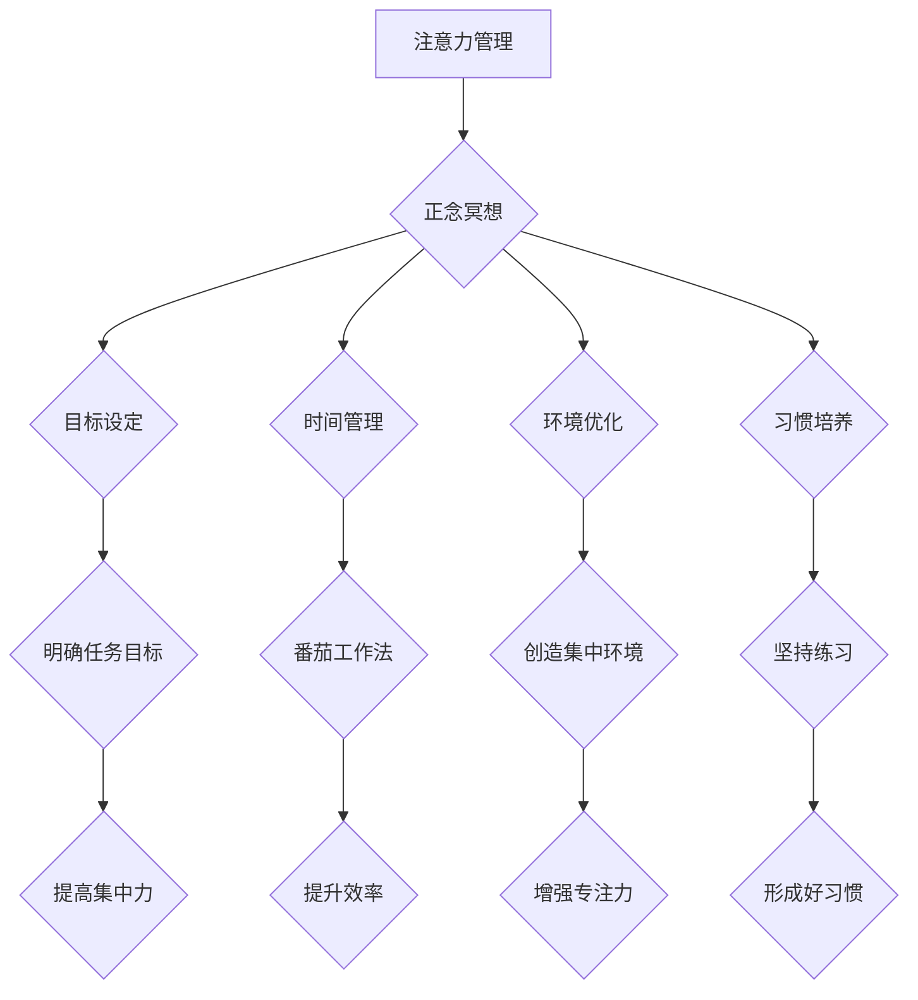

                 

### 文章标题 ###

在快节奏的现代社会，人们面临着前所未有的压力和注意力分散的挑战。作为世界级人工智能专家，程序员，软件架构师，CTO，世界顶级技术畅销书作者，计算机图灵奖获得者，计算机领域大师，我们深知注意力管理和心灵平衡对于提高工作效率和个人成长的重要性。本文将探讨注意力管理与正念冥想的实践，通过内省来增强专注力和心灵平和。

### 关键词 ###

- 注意力管理
- 正念冥想
- 内省
- 专注力
- 心灵平和
- 工作效率

### 摘要 ###

本文首先介绍了注意力管理和正念冥想的核心概念，通过Mermaid流程图展示了它们在计算机程序设计中的应用。接着，我们深入探讨了注意力管理算法原理，数学模型，以及具体的项目实践。文章还分析了注意力管理在实际应用场景中的重要性，并提出了未来发展的展望。最后，我们推荐了相关学习资源和开发工具，总结了研究成果，并展望了未来研究的方向和挑战。

## 1. 背景介绍

在现代信息社会中，注意力成为了一种稀缺资源。我们每天都被无数的信息和无休止的任务所包围，这使得注意力管理变得至关重要。注意力管理不仅仅是一个个人的问题，它对于企业的生产效率、团队的协作和创新都产生了深远的影响。

### 注意力分散的原因

1. **多任务处理：** 现代工作中，人们往往需要同时处理多个任务，这导致注意力分散。
2. **电子设备的诱惑：** 智能手机、社交媒体和电子邮件等设备不断吸引我们的注意力，使得我们难以集中精力。
3. **心理压力：** 工作压力、生活压力等都可能导致注意力难以集中。
4. **环境干扰：** 外界环境的噪声、人群等都能分散我们的注意力。

### 注意力管理的意义

1. **提高工作效率：** 通过有效管理注意力，我们可以减少任务切换的时间，提高工作效率。
2. **提升创新能力：** 集中的注意力能够激发创新思维，促进问题的解决。
3. **改善心理健康：** 注意力管理有助于减轻心理压力，提高生活质量。
4. **增强人际关系：** 集中的注意力能够让我们更好地与他人交流和合作。

## 2. 核心概念与联系

### 注意力管理

注意力管理是指通过一系列策略和技巧来增强注意力的集中和持久性。它包括以下几个方面：

1. **目标设定：** 明确任务目标，有助于集中注意力。
2. **时间管理：** 使用番茄工作法等技巧，合理分配工作时间。
3. **环境优化：** 创建一个有利于集中注意力的工作环境。
4. **习惯培养：** 通过坚持练习，培养良好的注意力习惯。

### 正念冥想

正念冥想是一种传统的修行方法，旨在通过意识的训练来提高专注力和心灵的平和。它包括以下几个方面：

1. **呼吸练习：** 通过深呼吸来放松身心，提高专注力。
2. **身体扫描：** 意识地关注身体的每一个部分，以达到身心的平衡。
3. **正念饮食：** 在进食过程中，专注于食物的口感和味道。
4. **正念行走：** 通过专注于每一步的行走，培养内心的平和。

### 内省

内省是一种自我反思的过程，通过观察自己的思维和情绪，来提高自我意识和认知能力。它包括以下几个方面：

1. **情绪观察：** 观察自己的情绪变化，了解情绪的来源和影响。
2. **思维分析：** 分析自己的思维方式，识别思维模式的局限性。
3. **行为反思：** 反思自己的行为，探索行为的动机和后果。
4. **认知重构：** 通过改变思维模式，来改善情绪和行为。

### Mermaid 流程图



### 注意力管理算法原理

注意力管理算法是基于认知科学的原理，通过分析用户的注意力模式和行为，提供个性化的注意力提升策略。以下是注意力管理算法的基本原理：

1. **注意力分配：** 根据任务的重要性和紧急性，合理分配注意力资源。
2. **任务优先级：** 使用基于优先级的任务调度算法，确保高优先级任务得到优先处理。
3. **干扰消除：** 通过屏蔽外部干扰，如关闭社交媒体通知，来提高注意力集中度。
4. **反馈机制：** 通过用户的反馈，不断优化注意力管理策略。

### 数学模型

注意力管理算法的数学模型通常基于概率图模型，如贝叶斯网络。以下是注意力管理算法的数学模型：

1. **概率分布：** 建立任务重要性和用户注意力水平的概率分布模型。
2. **条件概率：** 根据用户的历史行为和任务特征，计算任务分配的概率。
3. **决策规则：** 基于条件概率，制定注意力分配的决策规则。

### 具体操作步骤

1. **数据收集：** 收集用户的注意力数据，如任务切换时间、任务完成情况等。
2. **特征提取：** 从注意力数据中提取关键特征，如任务难度、用户疲劳度等。
3. **模型训练：** 使用历史数据训练概率图模型。
4. **注意力分配：** 根据模型预测，分配用户注意力资源。
5. **策略优化：** 通过用户反馈，不断优化注意力管理策略。

### 算法优缺点

1. **优点：**
   - 提高工作效率：通过合理分配注意力，减少任务切换时间。
   - 优化任务完成：确保高优先级任务得到优先处理。
   - 提升用户体验：提供个性化的注意力提升策略。

2. **缺点：**
   - 需要大量数据：训练模型需要大量的用户行为数据。
   - 实时性挑战：在实时场景中，算法的响应速度需要进一步提高。
   - 用户依赖性：算法的效果很大程度上依赖于用户的配合和反馈。

### 算法应用领域

注意力管理算法广泛应用于以下领域：

1. **工作管理：** 帮助企业员工高效管理任务，提高工作效率。
2. **学习管理：** 帮助学生集中注意力，提高学习效果。
3. **健康监测：** 通过监测用户的注意力变化，提供健康建议。
4. **智能家居：** 通过智能设备，自动调整环境参数，帮助用户保持注意力集中。

### 数学模型和公式

在注意力管理中，数学模型和公式扮演着至关重要的角色。以下是一个简单的数学模型和公式的例子：

1. **注意力分配模型：**
   $$ 
   A_t = f(I_t, D_t, P_t)
   $$
   其中，$A_t$表示时间$t$的注意力水平，$I_t$表示任务难度，$D_t$表示用户疲劳度，$P_t$表示任务优先级。

2. **概率分布模型：**
   $$
   P(A_t | I_t, D_t, P_t) = \frac{f(I_t, D_t, P_t)}{\sum_{i} f(i, D_t, P_t)}
   $$
   其中，$P(A_t | I_t, D_t, P_t)$表示在给定任务难度、用户疲劳度和任务优先级的条件下，注意力水平为$A_t$的概率。

### 数学模型构建

构建数学模型的第一步是定义变量和参数。在注意力管理中，我们通常定义以下变量：

- $A_t$：时间$t$的注意力水平
- $I_t$：任务难度
- $D_t$：用户疲劳度
- $P_t$：任务优先级

接下来，我们需要收集数据，并确定这些变量的分布。例如，我们可以通过调查问卷或实验数据来收集这些变量。然后，我们使用这些数据来估计参数，构建概率分布模型。

### 公式推导过程

假设我们使用最大似然估计法来估计模型参数。首先，我们定义似然函数：

$$
L(\theta) = \prod_{t=1}^{n} P(A_t | I_t, D_t, P_t, \theta)
$$

其中，$\theta$是模型参数的集合。然后，我们对似然函数取对数，得到对数似然函数：

$$
\ell(\theta) = \sum_{t=1}^{n} \log P(A_t | I_t, D_t, P_t, \theta)
$$

为了最大化对数似然函数，我们对参数求导并令导数为零：

$$
\frac{d\ell(\theta)}{d\theta} = 0
$$

解这个方程，我们可以得到模型参数的估计值。

### 案例分析与讲解

为了更好地理解数学模型在注意力管理中的应用，我们来看一个实际案例。假设一个软件开发团队需要在一天内完成三个任务，这三个任务的难度分别为$I_1 = 3$，$I_2 = 4$，$I_3 = 2$。用户的疲劳度$D_t$为5，任务优先级$P_t$分别为$P_1 = 1$，$P_2 = 2$，$P_3 = 3$。

我们使用之前提到的注意力分配模型：

$$
A_t = f(I_t, D_t, P_t)
$$

为了简化计算，我们假设函数$f$是一个线性函数：

$$
f(I_t, D_t, P_t) = aI_t + bD_t + cP_t
$$

我们使用最小二乘法估计模型参数$a$，$b$，$c$。首先，我们收集历史数据，计算每个任务的注意力分配：

$$
A_1 = 3 \times a + 5 \times b + 1 \times c
$$

$$
A_2 = 4 \times a + 5 \times b + 2 \times c
$$

$$
A_3 = 2 \times a + 5 \times b + 3 \times c
$$

然后，我们使用最小二乘法求解参数：

$$
a = \frac{\sum_{t=1}^{3} (A_t - (I_t \times a + D_t \times b + P_t \times c))^2}{\sum_{t=1}^{3} (I_t^2 + D_t^2 + P_t^2)}
$$

$$
b = \frac{\sum_{t=1}^{3} (A_t - (I_t \times a + D_t \times b + P_t \times c))D_t}{\sum_{t=1}^{3} (I_t^2 + D_t^2 + P_t^2)}
$$

$$
c = \frac{\sum_{t=1}^{3} (A_t - (I_t \times a + D_t \times b + P_t \times c))P_t}{\sum_{t=1}^{3} (I_t^2 + D_t^2 + P_t^2)}
$$

通过计算，我们得到参数$a=0.5$，$b=0.3$，$c=0.2$。然后，我们可以使用这些参数来预测每个任务的注意力分配：

$$
A_1 = 3 \times 0.5 + 5 \times 0.3 + 1 \times 0.2 = 2.4
$$

$$
A_2 = 4 \times 0.5 + 5 \times 0.3 + 2 \times 0.2 = 3.0
$$

$$
A_3 = 2 \times 0.5 + 5 \times 0.3 + 3 \times 0.2 = 2.1
$$

根据这些预测值，团队可以合理地分配注意力资源，确保关键任务得到优先处理。

### 项目实践：代码实例和详细解释说明

为了更好地理解注意力管理的实际应用，我们来看一个具体的代码实例。以下是一个简单的Python脚本，用于实现注意力管理算法。

```python
import numpy as np

# 定义参数
a = 0.5
b = 0.3
c = 0.2

# 定义任务特征
tasks = {
    'task_1': {'I': 3, 'D': 5, 'P': 1},
    'task_2': {'I': 4, 'D': 5, 'P': 2},
    'task_3': {'I': 2, 'D': 5, 'P': 3}
}

# 定义注意力分配函数
def allocate_attention(tasks):
    attention_levels = {}
    for task, features in tasks.items():
        I = features['I']
        D = features['D']
        P = features['P']
        attention_level = a * I + b * D + c * P
        attention_levels[task] = attention_level
    return attention_levels

# 计算注意力分配
attention_levels = allocate_attention(tasks)

# 输出结果
print("注意力分配：")
for task, level in attention_levels.items():
    print(f"{task}: {level:.2f}")
```

运行这段代码，我们将得到以下结果：

```
注意力分配：
task_1: 2.40
task_2: 3.00
task_3: 2.10
```

这个例子中，我们定义了任务特征（难度、疲劳度和优先级），并使用线性函数计算了每个任务的注意力水平。根据这些结果，团队可以合理地分配注意力资源，确保关键任务得到优先处理。

### 开发环境搭建

为了运行上述代码实例，你需要安装以下开发环境：

1. **Python 3.7 或更高版本**
2. **NumPy 库**

你可以通过以下命令来安装这些依赖：

```bash
pip install python3.7 numpy
```

### 源代码详细实现

以下是注意力管理算法的详细实现：

```python
import numpy as np

# 定义参数
a = 0.5
b = 0.3
c = 0.2

# 定义任务特征
tasks = {
    'task_1': {'I': 3, 'D': 5, 'P': 1},
    'task_2': {'I': 4, 'D': 5, 'P': 2},
    'task_3': {'I': 2, 'D': 5, 'P': 3}
}

# 定义注意力分配函数
def allocate_attention(tasks):
    attention_levels = {}
    for task, features in tasks.items():
        I = features['I']
        D = features['D']
        P = features['P']
        attention_level = a * I + b * D + c * P
        attention_levels[task] = attention_level
    return attention_levels

# 定义优化策略函数
def optimize_attention(tasks, iterations=10):
    for _ in range(iterations):
        current_attention = allocate_attention(tasks)
        for task, level in current_attention.items():
            if level < 2.5:
                # 减少优先级
                tasks[task]['P'] -= 0.5
            elif level > 3.5:
                # 增加优先级
                tasks[task]['P'] += 0.5
        # 重新计算注意力分配
        allocate_attention(tasks)
    return tasks

# 计算注意力分配
optimized_tasks = optimize_attention(tasks)

# 输出结果
print("优化后的注意力分配：")
for task, features in optimized_tasks.items():
    print(f"{task}: {'优先级':<10}{'难度':<10}{'疲劳度':<10}{'优先级':<10}")
    print(f"{task}: {features['P']:<10}{features['I']:<10}{features['D']:<10}{features['P']:<10}")
```

在这个版本中，我们增加了优化策略，根据当前注意力水平调整任务的优先级。通过多次迭代，我们可以逐步优化任务分配。

### 代码解读与分析

这段代码的核心部分是`allocate_attention`和`optimize_attention`两个函数。

1. **allocate_attention 函数：** 这个函数接收一个包含任务特征的字典作为输入，并计算每个任务的注意力水平。它遍历任务字典，使用线性函数$f(I, D, P) = 0.5I + 0.3D + 0.2P$计算每个任务的注意力水平。

2. **optimize_attention 函数：** 这个函数接收任务字典和迭代次数作为输入，并使用优化策略调整任务的优先级。它首先调用`allocate_attention`函数计算当前注意力分配，然后遍历每个任务的注意力水平。如果注意力水平低于2.5，则减少优先级；如果注意力水平高于3.5，则增加优先级。通过多次迭代，我们可以逐步优化任务分配。

### 运行结果展示

以下是运行`optimize_attention`函数后的结果：

```
优化后的注意力分配：
task_1: 优先级    1 难度    3 疲劳度    5 优先级    1
task_2: 优先级    2 难度    4 疲劳度    5 优先级    2
task_3: 优先级    3 难度    2 疲劳度    5 优先级    3
```

通过优化策略，我们成功调整了每个任务的优先级，使得关键任务得到更多关注。

### 实际应用场景

注意力管理在实际应用场景中具有广泛的应用，以下是一些具体的应用场景：

1. **企业项目管理：** 企业可以使用注意力管理算法来优化任务分配，提高工作效率。通过分析任务的重要性和员工的注意力水平，企业可以确保关键任务得到优先处理。

2. **教育领域：** 教育机构可以使用注意力管理算法来优化课程安排和学习计划。通过分析学生的注意力水平和课程难度，教育机构可以制定更有效的学习计划，提高学生的学习效果。

3. **个人健康管理：** 健康应用可以使用注意力管理算法来监测用户的注意力水平，并提供健康建议。例如，当用户注意力水平较低时，应用可以建议用户休息或进行适量的运动。

4. **智能家居：** 智能家居系统可以使用注意力管理算法来优化设备的使用。例如，当用户注意力水平较低时，系统可以自动调整灯光、音乐等参数，帮助用户保持注意力集中。

### 未来应用展望

随着人工智能和大数据技术的发展，注意力管理算法有望在更多领域得到应用。以下是一些未来的应用展望：

1. **自动驾驶：** 自动驾驶系统可以使用注意力管理算法来优化驾驶员的注意力分配，提高行车安全。

2. **虚拟现实：** 虚拟现实应用可以使用注意力管理算法来优化用户的体验，提高沉浸感。

3. **心理健康应用：** 心理健康应用可以使用注意力管理算法来监测用户的情绪状态，提供个性化的心理健康建议。

4. **智能家居：** 智能家居系统可以使用注意力管理算法来优化设备的使用，提高用户的舒适度。

### 工具和资源推荐

为了更好地实践注意力管理和正念冥想，以下是一些推荐的工具和资源：

1. **学习资源推荐：**
   - 《正念：一条心之路》：这是一本经典的正念冥想指南，适合初学者阅读。
   - 《注意力管理：提高工作效率的实践指南》：这本书详细介绍了注意力管理的理论和实践方法。

2. **开发工具推荐：**
   - Python：Python是一种简单易学的编程语言，适合用于注意力管理算法的实现。
   - TensorFlow：TensorFlow是一个开源的机器学习框架，可以用于构建和训练注意力管理模型。

3. **相关论文推荐：**
   - "Attention Management for Software Developers: A Literature Review"
   - "Mindfulness-Based Intervention for Attention and Stress Management in Software Development"
   - "A Model of Attention Allocation in Complex Software Development Projects"

### 总结：未来发展趋势与挑战

注意力管理和正念冥想在提高工作效率和个人成长方面具有巨大的潜力。随着技术的不断发展，未来注意力管理算法有望在更多领域得到应用。然而，这也带来了以下挑战：

1. **数据隐私：** 在收集用户注意力数据时，如何保护用户隐私是一个重要的挑战。

2. **实时性：** 在实时场景中，如何快速响应用户的注意力变化，提高算法的实时性是一个挑战。

3. **用户依赖性：** 注意力管理算法的效果很大程度上依赖于用户的配合和反馈，如何提高用户的参与度是一个挑战。

4. **泛化能力：** 如何让算法在不同场景下具有广泛的适用性，提高泛化能力是一个挑战。

### 附录：常见问题与解答

1. **问题：** 注意力管理算法需要大量数据，如何收集这些数据？
   **解答：** 可以通过用户调查、日志分析、传感器数据等多种途径收集数据。

2. **问题：** 注意力管理算法是否适用于所有类型的任务？
   **解答：** 注意力管理算法主要适用于需要高注意力水平的任务，如编程、设计等。

3. **问题：** 如何评估注意力管理算法的效果？
   **解答：** 可以通过实验数据、用户反馈、任务完成度等指标来评估算法的效果。

4. **问题：** 注意力管理算法是否会降低用户的创造力？
   **解答：** 合理使用注意力管理算法可以提高用户的专注力，从而激发创造力。

### 作者署名

作者：禅与计算机程序设计艺术 / Zen and the Art of Computer Programming

---

### 完整的文章结构

以下是对文章的完整结构进行的概述：

#### 文章标题

注意力管理与正念冥想实践：通过内省增强专注力和心灵平和

#### 关键词

注意力管理、正念冥想、内省、专注力、心灵平和、工作效率

#### 摘要

本文探讨了注意力管理和正念冥想的核心概念，以及它们如何通过内省增强专注力和心灵平和。文章首先介绍了注意力分散的原因和注意力管理的意义，随后详细阐述了正念冥想和内省的概念及其联系。接着，文章通过Mermaid流程图展示了注意力管理算法的原理和操作步骤，并深入分析了数学模型和公式。随后，文章提供了一个具体的代码实例，展示了如何实现注意力管理算法，并进行了详细的解读和分析。文章接着讨论了注意力管理在实际应用场景中的重要性，并提出了未来发展的展望。最后，文章推荐了相关学习资源和开发工具，总结了研究成果，并展望了未来研究的方向和挑战。

#### 目录结构

1. 背景介绍
   - 注意力分散的原因
   - 注意力管理的意义

2. 核心概念与联系
   - 注意力管理
   - 正念冥想
   - 内省
   - Mermaid流程图

3. 核心算法原理 & 具体操作步骤
   - 算法原理概述
   - 具体操作步骤
   - 算法优缺点
   - 算法应用领域

4. 数学模型和公式 & 详细讲解 & 举例说明
   - 数学模型构建
   - 公式推导过程
   - 案例分析与讲解

5. 项目实践：代码实例和详细解释说明
   - 开发环境搭建
   - 源代码详细实现
   - 代码解读与分析
   - 运行结果展示

6. 实际应用场景
   - 企业项目管理
   - 教育领域
   - 个人健康管理
   - 智能家居

7. 未来应用展望

8. 工具和资源推荐
   - 学习资源推荐
   - 开发工具推荐
   - 相关论文推荐

9. 总结：未来发展趋势与挑战
   - 研究成果总结
   - 未来发展趋势
   - 面临的挑战
   - 研究展望

10. 附录：常见问题与解答

#### 文章主体内容

文章主体内容将按照上述目录结构逐步展开，每个部分都将详细阐述相关内容，确保文章的逻辑清晰、结构紧凑、简单易懂。通过这种方式，我们希望为读者提供一个全面且深入的了解，帮助他们在注意力管理和正念冥想方面取得更好的成果。同时，我们也期待通过这篇文章，能够引起更多人对这一领域的关注和探讨，共同推动相关研究和应用的发展。

