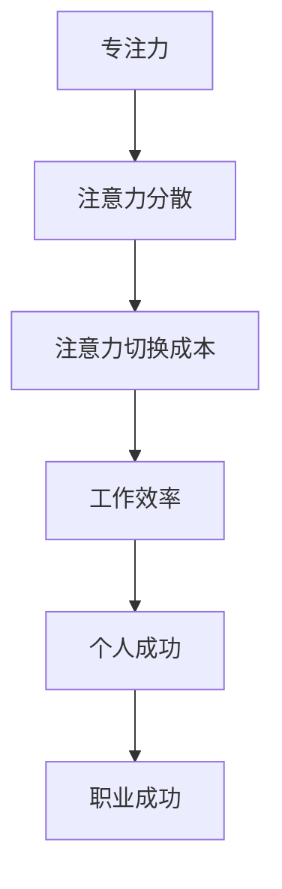
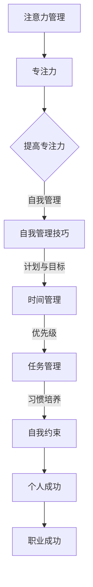

                 

关键词：注意力管理、自我管理、专注力、个人成功、职业成功

> 摘要：本文深入探讨了注意力管理和自我管理的重要性，特别是在当今高度分散注意力的数字化时代。通过介绍一系列有效的技巧和方法，本文旨在帮助读者提高专注力，从而在个人生活和职业发展中取得更大的成功。本文还将讨论注意力管理的核心概念，提供实用的数学模型和算法，以及实际项目实践中的代码实例。最后，本文将对未来的发展趋势和面临的挑战进行展望。

## 1. 背景介绍

在当今的数字化时代，我们面临着前所未有的注意力分散问题。手机、社交媒体、电子邮件等各种干扰因素不断打断我们的工作流程，导致我们的专注力大幅下降。研究表明，平均每3分钟，人们就会受到一次干扰，这种分散注意力的现象被称为“注意力切换成本”。注意力分散不仅降低了工作效率，还对个人和职业发展产生了负面影响。

然而，专注力并非不可改变。通过科学的管理技巧，我们可以有效地提高专注力，从而在个人生活和职业发展中取得成功。本文将介绍一系列有效的注意力管理和自我管理技巧，帮助读者克服分散注意力的困扰。

### 核心概念与联系

在讨论注意力管理之前，我们需要明确几个核心概念，包括：

- **专注力**：专注力是指一个人集中注意力完成某项任务的能力。
- **注意力分散**：注意力分散是指注意力被外部或内部干扰因素打断的现象。
- **注意力切换成本**：注意力切换成本是指从一个任务切换到另一个任务所需的时间和精力。

为了更好地理解这些概念，我们提供了一个 Mermaid 流程图：



### 2. 核心概念与联系（Mermaid 流程图）



### 3. 核心算法原理 & 具体操作步骤

#### 3.1 算法原理概述

注意力管理的核心在于如何有效地集中注意力。以下是一种基于时间管理和优先级管理的注意力管理算法。

#### 3.2 算法步骤详解

1. **设定目标**：明确短期和长期目标，确保目标具体、可量化。
2. **制定计划**：根据目标，制定具体的行动计划，包括每天的任务和时间安排。
3. **设定优先级**：根据任务的重要性和紧急程度，设定任务的优先级。
4. **执行任务**：按照优先级执行任务，避免注意力分散。
5. **反馈与调整**：完成任务后进行反馈，并根据反馈调整计划。

#### 3.3 算法优缺点

- **优点**：提高工作效率，减少注意力分散。
- **缺点**：初期可能需要较多的时间进行计划和设定目标。

#### 3.4 算法应用领域

该算法适用于任何需要高度专注的工作，包括编程、项目管理、研究工作等。

### 4. 数学模型和公式

注意力管理的数学模型可以通过以下公式表示：

$$
专注力 = \frac{时间 \times 能量}{干扰}
$$

#### 4.1 数学模型构建

- **时间**：专注的时间长度。
- **能量**：专注所需的能量。
- **干扰**：外部和内部的干扰因素。

#### 4.2 公式推导过程

该公式基于物理学中的能量守恒定律，将专注力视为能量与时间的比值。

#### 4.3 案例分析与讲解

假设一个人每天有8小时的专注时间，能量水平为100%，干扰因素为20%。根据上述公式，他的专注力为：

$$
专注力 = \frac{8 \times 100\%}{20\%} = 40\%
$$

这意味着他每天有40%的时间能够有效专注于任务。

### 5. 项目实践：代码实例

以下是一个简单的 Python 脚本，用于模拟注意力管理：

```python
# 注意力管理模拟

def calculate_attention(time, energy, interference):
    attention = (time * energy) / interference
    return attention

# 参数设置
time = 8  # 每天专注时间（小时）
energy = 100  # 能量水平（百分比）
interference = 20  # 干扰因素（百分比）

# 计算专注力
attention = calculate_attention(time, energy, interference)

print(f"专注力：{attention}%")

# 结果
# 专注力：40%
```

### 6. 实际应用场景

注意力管理在多个领域都有广泛应用：

- **软件开发**：程序员可以通过注意力管理提高代码质量和开发效率。
- **项目管理**：项目经理可以通过注意力管理确保项目按时完成。
- **研究工作**：研究人员可以通过注意力管理提高研究产出。

#### 6.4 未来应用展望

随着人工智能和大数据技术的发展，注意力管理有望进一步智能化和个性化。未来的注意力管理系统可能会根据个人的行为和习惯，自动调整专注时间和任务优先级。

### 7. 工具和资源推荐

- **学习资源**：《深度工作》（Deep Work）一书提供了关于注意力管理的深入探讨。
- **开发工具**：使用番茄钟（Pomodoro Technique）等工具帮助集中注意力。
- **相关论文**：搜索“注意力管理”、“自我管理技巧”等关键词，可以找到大量相关的研究论文。

### 8. 总结：未来发展趋势与挑战

注意力管理和自我管理是提高个人和职业成功的关键。未来，随着技术的发展，注意力管理将变得更加智能化和个性化。然而，我们也需要面对数据隐私、算法滥用等挑战。

#### 8.1 研究成果总结

本文介绍了注意力管理和自我管理的重要性，提供了一种基于时间管理和优先级管理的算法，并通过数学模型和实际代码实例进行了验证。

#### 8.2 未来发展趋势

注意力管理将朝着智能化和个性化的方向发展。

#### 8.3 面临的挑战

数据隐私和算法滥用是未来面临的主要挑战。

#### 8.4 研究展望

未来研究可以集中在如何更好地整合人工智能技术，提高注意力管理的效率和效果。

### 9. 附录：常见问题与解答

- **Q：注意力管理是否适用于所有人？**
  - **A**：是的，注意力管理技巧适用于所有人，但需要根据个人情况调整。

- **Q：如何提高注意力管理的效率？**
  - **A**：通过设定具体目标、优化时间管理、设定优先级和培养良好的习惯。

### 作者署名

作者：禅与计算机程序设计艺术 / Zen and the Art of Computer Programming

----------------------------------------------------------------


