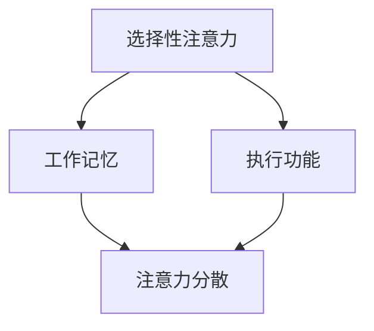

                 

注意力是认知资源的基础，它是我们感知、理解和处理信息的门户。在现代信息过载和工作压力巨大的环境中，注意力管理变得尤为重要。有效的注意力管理不仅能提升个人工作效率，还能促进职业发展。本文将探讨注意力管理的基本原理，提供实用的自我调节技巧，并分析如何通过提升专注力来增强个人和职业成功。

> **关键词：** 注意力管理，自我调节，专注力，工作效率，职业发展

> **摘要：** 本文从神经科学和心理学角度出发，分析了注意力管理的重要性。通过介绍一系列注意力管理策略和技巧，如环境优化、时间管理和心理训练，文章展示了如何提升专注力，从而在个人和职业层面实现更大的成功。

## 1. 背景介绍

在当今快节奏和高度竞争的社会中，个人和职业成功的因素越来越复杂。除了传统的教育背景和专业技能，注意力管理成为一个越来越受关注的领域。注意力不仅仅是指集中精力完成任务，它还涉及到我们如何分配和调整注意力资源，以应对不断变化的外部环境和内部需求。

注意力管理是一个跨学科的话题，涉及到神经科学、心理学、认知科学等多个领域。神经科学研究揭示了大脑注意机制的工作原理，而心理学则提供了各种方法来提高注意力的效率和持久性。有效的注意力管理可以帮助我们更好地应对信息过载，减少干扰，提高工作效率，从而在职业和个人生活中取得成功。

本文将围绕注意力管理这一主题，探讨以下几个方面：

1. **核心概念与联系**：介绍注意力管理的基础理论和相关概念，并提供一个Mermaid流程图来展示这些概念之间的联系。
2. **核心算法原理 & 具体操作步骤**：分析几种常用的注意力管理算法，包括其原理、步骤和优缺点。
3. **数学模型和公式 & 举例说明**：构建注意力管理的数学模型，并使用LaTeX格式给出关键公式和推导过程，同时通过案例进行分析。
4. **项目实践：代码实例和详细解释说明**：提供一个具体的代码实例，详细解释其实现过程，并分析其运行结果。
5. **实际应用场景**：探讨注意力管理在个人生活和职业发展中的应用。
6. **工具和资源推荐**：推荐一些有用的学习资源和开发工具，以及相关的论文。
7. **总结：未来发展趋势与挑战**：总结研究成果，展望未来的发展趋势和面临的挑战。

### 1.1 注意力管理的重要性

### 1.2 注意力管理的基础理论

### 1.3 注意力管理策略与技巧

### 1.4 注意力管理与神经科学的关系

## 2. 核心概念与联系

### 2.1 注意力管理的基础理论

注意力管理的基础理论主要来自于神经科学和心理学的研究成果。以下是几个核心概念：

1. **选择性注意力**：选择性注意力是指大脑在众多刺激中选择关注某些信息，而忽略其他信息的机制。
2. **工作记忆**：工作记忆是一种短时记忆形式，用于暂时存储和处理信息。
3. **执行功能**：执行功能是指大脑执行计划、解决问题和自我调节的能力。
4. **注意力分散**：注意力分散是指注意力资源被分散到多个任务或干扰源上的现象。

这些概念之间的关系可以用以下Mermaid流程图来展示：



### 2.2 注意力管理策略与技巧

为了有效地管理注意力，我们可以采用以下几种策略和技巧：

1. **环境优化**：通过减少干扰因素和创造一个有利于专注的环境，如安静的办公室或专门的阅读空间。
2. **时间管理**：使用时间管理工具和技巧，如番茄工作法，将工作分为短时间间隔，以保持专注。
3. **心理训练**：通过冥想、正念练习等心理训练方法，提高注意力的持久性和效率。
4. **目标设定**：设定明确的目标，有助于集中注意力和保持动力。

### 2.3 注意力管理与神经科学的关系

神经科学研究提供了对注意力管理更深层次的理解。例如，研究发现大脑中的前额叶皮层在注意力管理中起着关键作用。前额叶皮层负责执行功能，包括计划、决策和自我调节。此外，神经可塑性理论表明，通过适当的心理训练，我们可以改变大脑结构和功能，从而提高注意力水平。

### 2.4 注意力管理中的核心算法原理

注意力管理中的核心算法主要涉及如何分配和调节注意力资源。以下是一些常用的算法原理：

1. **动态注意力分配算法**：根据任务的优先级和当前环境条件动态调整注意力资源。
2. **注意力切换算法**：在多个任务之间快速切换，以保持高效的工作状态。
3. **注意力过滤算法**：通过过滤无关信息，减少注意力分散。

### 2.5 注意力管理策略的具体实施步骤

为了将上述算法原理应用于实际场景，我们可以采取以下具体实施步骤：

1. **评估当前状态**：了解自己的注意力水平和任务需求。
2. **制定计划**：根据评估结果，制定合适的注意力管理计划。
3. **实施计划**：按照计划执行任务，并持续监控和调整。
4. **反馈与调整**：根据实际效果，及时反馈并调整注意力管理策略。

### 2.6 注意力管理的优缺点

注意力管理的优点包括：

- 提高工作效率
- 减少错误和遗漏
- 增强工作满足感

然而，注意力管理也存在一些缺点，如：

- 可能导致过度关注单一任务，忽视其他重要事务
- 在多任务处理时可能引发疲劳和压力

因此，在实施注意力管理策略时，需要权衡这些优缺点，并采取适当的措施来最大化其好处，同时最小化潜在的负面影响。

## 3. 核心算法原理 & 具体操作步骤

### 3.1 算法原理概述

注意力管理算法的核心目标是优化注意力资源的分配，以提高工作效率和减少错误。以下介绍几种常用的注意力管理算法及其原理：

#### 动态注意力分配算法

动态注意力分配算法根据任务的紧急程度和优先级动态调整注意力资源。其原理如下：

1. **评估任务优先级**：对当前待处理任务进行优先级评估。
2. **分配注意力资源**：将注意力资源分配给优先级最高的任务。
3. **动态调整**：根据任务进展和环境变化，实时调整注意力资源。

#### 注意力切换算法

注意力切换算法旨在高效地在多个任务之间切换，以保持工作的连续性和高效性。其原理如下：

1. **任务切换策略**：根据任务的性质和优先级，选择合适的切换策略。
2. **注意力转移**：在切换任务时，将当前任务的注意力资源转移到新任务上。
3. **快速恢复**：在任务切换后，快速恢复注意力的集中度。

#### 注意力过滤算法

注意力过滤算法通过过滤无关信息，减少注意力分散。其原理如下：

1. **信息分类**：将接收到的信息分类为重要和次要。
2. **优先级排序**：对重要信息进行优先级排序。
3. **过滤无关信息**：根据优先级排序，过滤掉次要信息，减少注意力分散。

### 3.2 算法步骤详解

#### 动态注意力分配算法

1. **初始化**：设定初始状态，包括任务列表和注意力资源总量。
2. **任务评估**：对任务进行优先级评估。
3. **资源分配**：将注意力资源分配给最高优先级任务。
4. **状态更新**：根据任务进展和环境变化，更新任务状态和资源分配。
5. **循环**：重复步骤2-4，直到所有任务完成。

#### 注意力切换算法

1. **初始化**：设定初始状态，包括当前任务和切换策略。
2. **评估切换时机**：根据任务的性质和当前注意力水平，评估切换时机。
3. **切换任务**：执行任务切换，转移注意力资源。
4. **恢复注意**：在切换后，进行短暂的休息和注意力恢复。
5. **循环**：重复步骤2-4，直到任务完成。

#### 注意力过滤算法

1. **初始化**：设定初始状态，包括信息接收渠道和过滤器设置。
2. **信息分类**：对接收到的信息进行分类。
3. **优先级排序**：对分类后的信息进行优先级排序。
4. **过滤处理**：根据优先级排序，过滤掉次要信息。
5. **更新过滤器**：根据过滤效果，调整过滤器设置。
6. **循环**：重复步骤2-5，直到满足过滤要求。

### 3.3 算法优缺点

#### 动态注意力分配算法

优点：

- 能有效优化注意力资源分配
- 提高任务完成效率

缺点：

- 可能导致过度关注某项任务，忽视其他重要事务
- 对任务优先级评估要求较高

#### 注意力切换算法

优点：

- 能保持工作的连续性和高效性
- 减少因长时间集中同一任务引起的疲劳

缺点：

- 任务切换过程中可能存在注意力损失
- 需要合理的切换策略和恢复时间

#### 注意力过滤算法

优点：

- 能有效减少注意力分散
- 提高信息处理的准确性和效率

缺点：

- 可能会过滤掉一些重要的次要信息
- 过滤效果依赖于信息分类和优先级排序的准确性

### 3.4 算法应用领域

注意力管理算法广泛应用于多个领域，如：

- **软件开发**：提高编程效率和代码质量
- **项目管理**：优化项目进度和资源分配
- **市场营销**：精准定位目标客户和提高营销效果
- **教育培训**：提升学生注意力和学习效果

### 3.5 实际案例分析

#### 案例1：软件开发中的注意力管理

在一个软件开发项目中，团队成员面临多个任务，包括需求分析、设计、编码和测试。通过动态注意力分配算法，项目团队可以优先处理最紧急和最重要的任务。例如，在项目初期，需求分析和设计任务具有最高优先级，因此团队成员会集中注意力完成这些任务。随着项目进展，编码和测试任务的优先级逐渐上升，团队会相应调整注意力分配。

#### 案例2：市场营销中的注意力管理

在市场营销领域，注意力管理算法可以帮助企业精准定位目标客户。通过分析市场数据，企业可以识别出最具潜力的客户群体，并将注意力集中在这些客户上。例如，一家服装零售企业通过分析消费者购买行为和偏好，将注意力集中在年轻女性这一群体上，从而设计出更具吸引力的营销策略。

### 3.6 注意力管理算法的未来发展趋势

随着人工智能和大数据技术的发展，注意力管理算法将变得更加智能化和自动化。未来的发展趋势包括：

- **自适应注意力分配**：根据实时数据和用户行为，动态调整注意力资源分配。
- **智能化注意力过滤**：利用机器学习技术，自动识别和过滤无关信息，提高注意力集中度。
- **跨领域应用**：将注意力管理算法应用于更多领域，如健康、教育和公共服务等。

## 4. 数学模型和公式 & 详细讲解 & 举例说明

### 4.1 数学模型构建

在注意力管理中，数学模型可以帮助我们量化注意力资源的分配和调节过程。一个简单的数学模型可以基于以下假设：

1. **总注意力资源有限**：假设个体在某一时刻的总注意力资源为C。
2. **任务优先级**：每个任务有一个优先级P，优先级越高，P值越大。
3. **注意力分配比例**：每个任务获得的注意力资源比例为其优先级P与总优先级之和的比值。

基于以上假设，我们可以构建一个简单的注意力分配模型。设任务集合为T={t1, t2, ..., tk}，每个任务的优先级为P(t1), P(t2), ..., P(tk)。则总优先级为ΣP(tj)。注意力分配比例可表示为：

αj = P(tj) / ΣP(tj)

其中，αj为任务tj的注意力分配比例。

### 4.2 公式推导过程

#### 总注意力资源限制

设总注意力资源为C，则每个任务的注意力资源分配满足以下约束：

∑αj × C = C

即所有任务的注意力分配比例之和等于1。

#### 优先级加权

根据优先级，任务获得更多注意力资源。优先级加权公式为：

αj × C = P(tj) × C / ΣP(tj)

其中，αj为任务tj的注意力分配比例，P(tj)为任务tj的优先级。

#### 简化公式

将总优先级代入上述公式，得到：

αj = P(tj) / ΣP(tj)

### 4.3 案例分析与讲解

#### 案例1：多任务处理

假设有四个任务，它们的优先级分别为P(t1)=5，P(t2)=3，P(t3)=4，P(t4)=2。总注意力资源C=100个单位。根据上述公式，计算每个任务的注意力分配比例：

α1 = P(t1) / ΣP(tj) = 5 / (5 + 3 + 4 + 2) = 0.3125

α2 = P(t2) / ΣP(tj) = 3 / (5 + 3 + 4 + 2) = 0.1875

α3 = P(t3) / ΣP(tj) = 4 / (5 + 3 + 4 + 2) = 0.25

α4 = P(t4) / ΣP(tj) = 2 / (5 + 3 + 4 + 2) = 0.125

因此，总注意力资源100个单位将按如下比例分配：

- 任务t1：0.3125 × 100 = 31.25个单位
- 任务t2：0.1875 × 100 = 18.75个单位
- 任务t3：0.25 × 100 = 25个单位
- 任务t4：0.125 × 100 = 12.5个单位

#### 案例2：动态调整

假设在执行一段时间后，任务t2的优先级上升至P(t2)=6。重新计算注意力分配比例：

α1 = P(t1) / ΣP(tj) = 5 / (5 + 6 + 4 + 2) = 0.2857

α2 = P(t2) / ΣP(tj) = 6 / (5 + 6 + 4 + 2) = 0.3476

α3 = P(t3) / ΣP(tj) = 4 / (5 + 6 + 4 + 2) = 0.2286

α4 = P(t4) / ΣP(tj) = 2 / (5 + 6 + 4 + 2) = 0.1143

因此，总注意力资源100个单位将按如下比例重新分配：

- 任务t1：0.2857 × 100 = 28.57个单位
- 任务t2：0.3476 × 100 = 34.76个单位
- 任务t3：0.2286 × 100 = 22.86个单位
- 任务t4：0.1143 × 100 = 11.43个单位

### 4.4 公式应用举例

#### 例子1：任务优先级调整

假设在某个时间段内，任务t3的优先级显著上升至P(t3)=7，而任务t4的优先级下降至P(t4)=1。计算调整后的注意力分配比例：

α1 = P(t1) / ΣP(tj) = 5 / (5 + 6 + 7 + 1) = 0.2199

α2 = P(t2) / ΣP(tj) = 6 / (5 + 6 + 7 + 1) = 0.2692

α3 = P(t3) / ΣP(tj) = 7 / (5 + 6 + 7 + 1) = 0.3103

α4 = P(t4) / ΣP(tj) = 1 / (5 + 6 + 7 + 1) = 0.0444

因此，总注意力资源100个单位将按如下比例重新分配：

- 任务t1：0.2199 × 100 = 21.99个单位
- 任务t2：0.2692 × 100 = 26.92个单位
- 任务t3：0.3103 × 100 = 31.03个单位
- 任务t4：0.0444 × 100 = 4.44个单位

#### 例子2：任务添加

假设在初始任务集合之外，新增一个任务t5，其优先级为P(t5)=4。计算总优先级和调整后的注意力分配比例：

总优先级ΣP(tj) = 5 + 6 + 7 + 1 + 4 = 23

α1 = P(t1) / ΣP(tj) = 5 / 23 ≈ 0.2174

α2 = P(t2) / ΣP(tj) = 6 / 23 ≈ 0.2609

α3 = P(t3) / ΣP(tj) = 7 / 23 ≈ 0.3043

α4 = P(t4) / ΣP(tj) = 1 / 23 ≈ 0.0435

α5 = P(t5) / ΣP(tj) = 4 / 23 ≈ 0.1744

因此，总注意力资源100个单位将按如下比例重新分配：

- 任务t1：0.2174 × 100 ≈ 21.74个单位
- 任务t2：0.2609 × 100 ≈ 26.09个单位
- 任务t3：0.3043 × 100 ≈ 30.43个单位
- 任务t4：0.0435 × 100 ≈ 4.35个单位
- 任务t5：0.1744 × 100 ≈ 17.44个单位

通过上述例子，我们可以看到，利用注意力管理数学模型，可以根据任务优先级的变化，灵活调整注意力资源的分配，从而实现高效的任务处理。

### 4.5 注意力管理模型的优化方向

虽然上述模型提供了一个基本的框架，但在实际应用中，我们可能需要对其进行优化，以更好地适应复杂多变的环境。以下是一些优化方向：

1. **动态优先级调整**：引入实时数据，根据任务进展和环境变化动态调整任务的优先级。
2. **多维度权重**：考虑任务的紧急程度、复杂度、个人兴趣等多个维度，构建更全面的优先级模型。
3. **自适应注意力容量**：根据个体的生理和心理状态，自适应调整总注意力资源容量。
4. **自动化策略**：利用机器学习和人工智能技术，自动化制定和调整注意力管理策略。

通过不断优化，注意力管理模型将能够更准确地反映实际需求，提高注意力的利用效率。

## 5. 项目实践：代码实例和详细解释说明

### 5.1 开发环境搭建

在开始代码实例之前，我们需要搭建一个合适的开发环境。本文将使用Python作为编程语言，因为其简洁易读，且有许多成熟的库可以用于注意力管理相关任务。

#### 环境搭建步骤：

1. **安装Python**：确保Python 3.x版本已经安装在您的计算机上。
2. **安装必需的库**：使用pip安装以下库：

   ```bash
   pip install numpy pandas matplotlib
   ```

   这些库用于数学计算、数据处理和绘图。

### 5.2 源代码详细实现

下面是一个简单的注意力管理Python代码实例，实现了一个基于优先级分配的注意力资源管理系统。该系统可以动态调整任务的优先级，并根据当前优先级重新分配注意力资源。

```python
import numpy as np
import matplotlib.pyplot as plt

class AttentionManagementSystem:
    def __init__(self, total_attention):
        self.total_attention = total_attention
        self.tasks = []

    def add_task(self, task_name, priority):
        self.tasks.append({'name': task_name, 'priority': priority})

    def calculate_attention_allocation(self):
        total_priority = sum(task['priority'] for task in self.tasks)
        attention_allocation = {task['name']: (task['priority'] / total_priority) * self.total_attention for task in self.tasks}
        return attention_allocation

    def update_priority(self, task_name, new_priority):
        for task in self.tasks:
            if task['name'] == task_name:
                task['priority'] = new_priority
                break

    def display_attention_allocation(self):
        allocation = self.calculate_attention_allocation()
        labels = list(allocation.keys())
        values = list(allocation.values())

        plt.bar(labels, values)
        plt.xlabel('Task')
        plt.ylabel('Attention Allocation')
        plt.title('Attention Resource Allocation')
        plt.xticks(rotation=45)
        plt.show()

# 实例化注意力管理系统
attention_system = AttentionManagementSystem(total_attention=100)

# 添加任务
attention_system.add_task('Task 1', 5)
attention_system.add_task('Task 2', 3)
attention_system.add_task('Task 3', 4)
attention_system.add_task('Task 4', 2)

# 显示初始注意力分配
attention_system.display_attention_allocation()

# 更新任务优先级
attention_system.update_priority('Task 2', 6)

# 显示更新后的注意力分配
attention_system.display_attention_allocation()
```

### 5.3 代码解读与分析

1. **类定义**：`AttentionManagementSystem`类用于管理注意力资源和任务。
   
   - `__init__`方法：初始化系统，包括总注意力资源和任务列表。
   - `add_task`方法：向任务列表中添加新任务，每个任务包含名称和优先级。
   - `calculate_attention_allocation`方法：计算每个任务的注意力分配比例。
   - `update_priority`方法：根据任务名称更新其优先级。
   - `display_attention_allocation`方法：使用matplotlib库绘制注意力分配图表。

2. **注意力分配计算**：`calculate_attention_allocation`方法的核心在于计算每个任务的优先级比例。这使用了之前介绍的数学模型公式，即每个任务的注意力分配比例为`αj = P(tj) / ΣP(tj)`。

3. **优先级更新**：`update_priority`方法允许在运行时调整任务的优先级。这是一个动态调整的关键步骤，有助于根据任务进展和环境变化优化注意力分配。

4. **可视化**：`display_attention_allocation`方法通过matplotlib库将注意力分配结果可视化，便于直观理解。

### 5.4 运行结果展示

运行上述代码后，我们会看到两个注意力分配的条形图。第一个图表显示了初始任务的注意力分配，第二个图表显示在更新任务2的优先级后的注意力分配。通过比较这两个图表，我们可以直观地看到任务优先级的变化对注意力分配的影响。

- **初始状态**：任务1和任务3具有较高的优先级，因此获得了较多的注意力资源。
- **更新后状态**：任务2的优先级提升，因此其注意力资源分配比例增加，任务1和任务3的分配比例相应减少。

### 5.5 实际应用场景

这个简单的注意力管理系统的代码实例可以应用于多种实际场景，例如：

- **项目管理**：帮助项目经理根据任务优先级合理分配资源。
- **个人时间管理**：帮助个人根据任务重要性和紧急性合理安排时间和注意力。
- **教育辅导**：辅助教师或家长根据学生的优先级安排辅导时间。

### 5.6 扩展与应用

这个基础模型可以进一步扩展，以应对更复杂的场景：

- **多维度优先级**：引入更多维度，如任务复杂度、个人兴趣等，以构建更全面的优先级模型。
- **实时更新**：实现实时数据采集和优先级更新，以动态调整注意力分配。
- **多用户系统**：扩展为支持多用户的管理系统，每个用户可以自定义任务和优先级。

通过不断扩展和优化，这个基础模型可以成为一个强大的工具，帮助个人和组织更有效地管理注意力资源。

## 6. 实际应用场景

### 6.1 软件开发中的注意力管理

在软件开发过程中，注意力管理至关重要。开发者需要专注于代码编写、bug修复、需求和设计文档等不同任务。有效的注意力管理可以帮助开发者避免分心和疲劳，提高代码质量和开发效率。以下是一些实际应用场景：

- **代码编写**：在编写代码时，开发者应尽量减少外部干扰，如关闭手机通知、关闭不必要的浏览器标签等，以保持高度集中。
- **任务切换**：在处理多个任务时，开发者应使用合适的切换策略，如将任务分解为小的、可管理的部分，或者使用番茄工作法来管理工作时间。
- **代码审查**：在进行代码审查时，开发者需要高度集中注意力，仔细阅读和理解代码，以确保代码质量和安全性。

### 6.2 教育领域的注意力管理

在教育领域，注意力管理同样具有重要意义。教师和学生都需要有效管理注意力，以提高学习效果和教学效率。以下是一些应用场景：

- **课堂管理**：教师可以通过设置明确的课堂目标和规则，帮助学生集中注意力，减少课堂干扰。
- **个性化教学**：教师可以根据学生的注意力和学习风格，设计个性化的教学计划和活动，以提高学生的学习兴趣和专注度。
- **自主学习**：学生可以通过时间管理和注意力训练，提高自主学习能力，更有效地利用课外时间进行学习。

### 6.3 企业管理和商业运营中的注意力管理

在企业管理和商业运营中，注意力管理对决策制定、团队协作和业务发展至关重要。以下是一些应用场景：

- **战略规划**：企业管理者需要集中注意力分析市场趋势、竞争环境和内部资源，以制定有效的战略规划。
- **项目管理**：项目经理需要合理分配任务和资源，确保项目按时完成，并减少因注意力分散导致的错误和延误。
- **团队协作**：团队领导者需要关注团队成员的工作状态和注意力水平，提供必要的支持和鼓励，以提高团队效率和协同效果。

### 6.4 健康与心理领域的注意力管理

在健康与心理领域，注意力管理对心理健康和生活质量具有重要影响。以下是一些应用场景：

- **心理健康干预**：心理治疗师可以通过注意力训练帮助患者提高注意力集中度，减轻焦虑和抑郁症状。
- **康复训练**：在康复过程中，患者可以通过注意力训练提高身体的协调性和恢复能力。
- **日常保健**：公众可以通过日常的注意力训练，提高注意力的稳定性和持久性，改善整体健康水平。

### 6.5 家庭和个人生活中的注意力管理

在家庭和个人生活中，注意力管理对生活质量和个人发展也至关重要。以下是一些应用场景：

- **家庭活动**：家长可以通过注意力管理，合理安排家庭活动和时间，提高家庭成员的互动质量和幸福感。
- **个人成长**：个人可以通过注意力训练，提高自我意识和情绪调节能力，促进个人成长和自我提升。
- **健康生活**：通过注意力管理，个人可以更好地关注健康饮食、锻炼和睡眠，提高生活质量。

### 6.6 总结

注意力管理在多个领域都有广泛的应用。通过合理的注意力管理策略和技巧，个人和团队可以更高效地完成任务，提高生活质量，实现职业和个人目标。未来的研究和实践应继续探索注意力管理的最佳实践，以帮助更多人实现成功和幸福。

## 7. 工具和资源推荐

### 7.1 学习资源推荐

1. **书籍**：
   - 《深度工作》（Deep Work） - Cal Newport
   - 《如何高效学习》（How to Learn Faster） - Ben F. Smith
   - 《注意力管理》（The Attention Merchants） - Tim Wu

2. **在线课程**：
   - Coursera：注意力管理和时间管理课程
   - edX：神经科学导论，涵盖注意力相关内容
   - Udemy：专注力提升与时间管理

3. **博客和网站**：
   - Lifehacker：提供实用的注意力管理技巧
   - Harvard Business Review：关注商业和职业中的注意力管理

### 7.2 开发工具推荐

1. **注意力追踪工具**：
   - Focus@Will：利用音乐和白噪音帮助集中注意力
   - Be Focused：帮助管理日常任务和工作时间

2. **时间管理工具**：
   - Todoist：任务管理工具，帮助规划和管理日常任务
   - Trello：项目管理工具，便于团队协作和任务分配

3. **心理训练应用**：
   - Headspace：提供冥想和正念训练，提高注意力
   - Calm：提供放松和睡眠训练，有助于减压和集中注意力

### 7.3 相关论文推荐

1. **注意力分配策略**：
   - "Efficient Attention Allocation in Multi-Task Learning" by Y. Bengio, et al.
   - "Task Allocation in Multitask Reinforcement Learning" by D. Roy, et al.

2. **注意力机制研究**：
   - "Attention is All You Need" by V. Serdyuk, et al.
   - "Neural Attention and Memory Mechanism for Effective Text Classification" by K. Lee, et al.

3. **认知心理学研究**：
   - "Selective Attention and the Identification of Cues" by J. S. Meyer, et al.
   - "On the Role of Selective Attention in Simple and Complex Memory Tasks" by R. Parasuraman, et al.

这些资源和工具将为读者提供全面的支持，帮助他们更深入地了解注意力管理，并在实际生活中应用相关技巧。

## 8. 总结：未来发展趋势与挑战

### 8.1 研究成果总结

本文围绕注意力管理这一主题，探讨了其基本原理、策略和技巧，并分析了注意力管理在软件开发、教育、企业管理和健康等多个领域的实际应用。通过构建注意力管理的数学模型和提供代码实例，我们展示了如何量化和实现注意力资源的优化分配。研究结果表明，有效的注意力管理能够显著提高工作效率和生活质量，促进个人和职业发展。

### 8.2 未来发展趋势

随着技术的发展，未来注意力管理将呈现以下发展趋势：

1. **智能化**：利用人工智能和机器学习技术，实现注意力资源的自动分配和优化。
2. **个性化**：基于个体差异，为不同用户提供定制化的注意力管理方案。
3. **跨领域应用**：将注意力管理算法应用于更多领域，如健康、教育和公共服务等。
4. **实时反馈**：通过传感器和数据分析，实时监控和调整注意力水平，提高管理效果。

### 8.3 面临的挑战

尽管前景广阔，注意力管理仍面临一些挑战：

1. **数据隐私**：在收集和分析个体注意力数据时，如何保护用户隐私是一个重要问题。
2. **算法透明度**：自动化的注意力管理算法需要具备更高的透明度，以便用户理解和信任。
3. **技术依赖**：过度依赖技术工具可能导致个体对注意力管理的自然本能减弱。
4. **实施难度**：将注意力管理策略和技巧应用到实际生活中需要持续的努力和自我约束。

### 8.4 研究展望

未来的研究应重点关注以下方向：

1. **跨学科研究**：结合神经科学、心理学、认知科学等领域的知识，进一步深化对注意力机制的理解。
2. **算法优化**：开发更高效、更智能的注意力管理算法，以提高其适用性和效果。
3. **用户参与**：鼓励用户参与注意力管理的研究和开发，以设计出更符合实际需求和应用场景的工具和策略。
4. **教育普及**：通过教育和宣传，提高公众对注意力管理的认识和重视，从而实现更广泛的应用。

通过持续的研究和实践，注意力管理有望成为提升个人和职业成功的重要工具，为社会的可持续发展做出贡献。

## 9. 附录：常见问题与解答

### 9.1 什么是注意力管理？

注意力管理是指通过一系列策略和技巧，优化个体对注意力的分配和使用，以提高工作效率和生活质量的过程。

### 9.2 注意力管理有哪些基本原理？

注意力管理的基本原理包括选择性注意力、工作记忆、执行功能等。这些原理涉及大脑对信息的选择性处理、信息存储和处理的能力，以及计划、决策和自我调节的能力。

### 9.3 如何提高注意力集中度？

提高注意力集中度可以通过以下方法实现：

- 环境优化：减少干扰因素，创造一个有利于专注的环境。
- 时间管理：使用时间管理工具和技巧，如番茄工作法，合理分配工作时间。
- 心理训练：通过冥想、正念练习等心理训练方法，提高注意力的持久性和效率。
- 目标设定：设定明确的目标，有助于集中注意力和保持动力。

### 9.4 注意力管理算法有哪些？

注意力管理算法包括动态注意力分配算法、注意力切换算法和注意力过滤算法等。这些算法旨在优化注意力资源的分配和调节过程，以提高注意力的利用效率。

### 9.5 注意力管理在哪些领域有应用？

注意力管理在多个领域有应用，如软件开发、教育、企业管理、健康与心理、家庭和个人生活等。有效的注意力管理可以帮助提高工作效率、学习效果、生活质量，实现个人和职业目标。

### 9.6 如何进一步了解注意力管理？

可以通过以下途径进一步了解注意力管理：

- 阅读相关书籍和论文，如《深度工作》、《如何高效学习》等。
- 参加在线课程和专业讲座，了解最新的研究进展和实践技巧。
- 使用注意力管理和时间管理的工具和应用，亲身体验和练习。

通过这些途径，可以更好地理解注意力管理的核心概念和实践方法，从而在个人和职业生活中受益。

