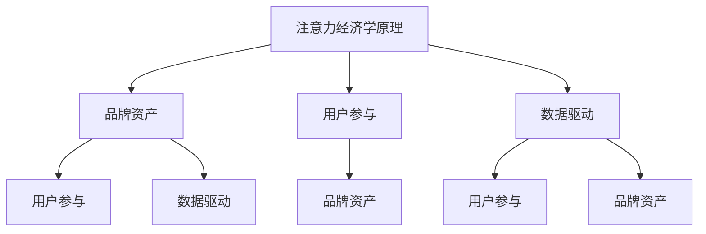

                 

关键词：注意力经济、品牌建设、营销策略、用户参与、数据驱动

> 摘要：本文深入探讨了注意力经济下的品牌建设策略，分析了当前品牌营销面临的挑战和机遇。通过结合前沿技术，提出了以用户参与和数据驱动为核心的品牌建设方法，旨在为企业和营销人员提供切实可行的策略和工具，以在激烈的市场竞争中脱颖而出。

## 1. 背景介绍

### 注意力经济的兴起

随着互联网和社交媒体的迅猛发展，信息爆炸和用户注意力的稀缺成为了当今市场的主要特征。人们被海量信息淹没，注意力成为一种宝贵的资源。因此，注意力经济应运而生，它强调的是如何通过吸引和保持用户的注意力来创造经济价值。

### 品牌建设的困境

在注意力经济时代，品牌建设面临着前所未有的挑战。传统的品牌建设方法往往依赖于广告投放和大规模的市场推广，但这些方法在分散的注意力经济环境中效果有限。品牌如何与用户建立深层次的联系，如何有效地利用有限的注意力资源，成为了品牌建设的关键问题。

### 营销策略的变革

注意力经济的兴起促使营销策略发生了深刻变革。从以产品为中心到以用户为中心，从单向传播到双向互动，品牌需要重新思考其与用户的关系，采用更加创新和互动的营销策略。

## 2. 核心概念与联系

为了更好地理解注意力经济下的品牌建设，我们需要明确几个核心概念，并展示它们之间的关系。

### 注意力经济学原理

注意力经济学认为，注意力是一种有限的资源，用户会根据自身需求和兴趣分配注意力。因此，品牌需要创造价值来吸引和留住用户的注意力。

### 品牌资产

品牌资产是指品牌在消费者心中的认知和情感价值。品牌资产包括品牌知名度、品牌偏好和品牌忠诚度等指标。在注意力经济中，品牌资产成为品牌竞争的核心。

### 用户参与

用户参与是指用户在品牌互动过程中的积极参与和贡献。用户参与度高，意味着品牌能够更好地吸引和保持用户的注意力。

### 数据驱动

数据驱动是指利用数据分析来指导品牌建设和营销策略。通过收集和分析用户数据，品牌能够更好地理解用户需求和行为，从而制定出更加精准的营销策略。

### Mermaid 流程图



## 3. 核心算法原理 & 具体操作步骤

### 3.1 算法原理概述

在注意力经济下，品牌建设的关键在于如何有效地吸引和保持用户的注意力。这需要一套系统的算法来指导品牌营销策略。核心算法主要包括以下几个方面：

1. **用户行为分析**：通过数据分析技术，分析用户的行为和兴趣，为用户提供个性化的内容和服务。
2. **内容推荐**：根据用户行为数据，推荐符合用户兴趣的内容，提高用户的参与度和满意度。
3. **用户反馈机制**：建立有效的用户反馈机制，及时调整品牌营销策略，以更好地满足用户需求。

### 3.2 算法步骤详解

1. **数据收集**：通过网站分析工具、社交媒体监听工具等收集用户数据。
2. **数据预处理**：清洗和整理收集到的数据，确保数据的准确性和一致性。
3. **行为分析**：利用机器学习和自然语言处理技术，对用户行为进行分析，提取用户兴趣和行为模式。
4. **内容推荐**：根据用户行为数据和兴趣模型，推荐相关的内容和服务。
5. **用户反馈**：收集用户对推荐内容的反馈，调整推荐算法和内容策略。
6. **持续优化**：通过不断的迭代和优化，提高用户参与度和满意度。

### 3.3 算法优缺点

**优点**：

- 提高用户参与度：通过个性化推荐，提高用户对品牌内容的兴趣和参与度。
- 提高营销效率：通过数据驱动，精准定位用户，提高营销效果和ROI。
- 增强用户粘性：通过持续的互动和反馈，增强用户对品牌的忠诚度。

**缺点**：

- 数据隐私问题：用户数据的收集和使用可能引发隐私问题，需要严格遵循相关法律法规。
- 技术门槛高：需要专业的技术团队来实施和维护算法系统。

### 3.4 算法应用领域

- 电子商务：通过用户行为分析，为用户提供个性化的商品推荐。
- 社交媒体：通过内容推荐，吸引用户参与和互动。
- 娱乐行业：通过用户兴趣分析，推荐个性化的娱乐内容。

## 4. 数学模型和公式 & 详细讲解 & 举例说明

### 4.1 数学模型构建

在注意力经济下，品牌建设可以看作是一个动态的过程，其核心是用户注意力资源的分配。我们可以构建一个基于用户兴趣和行为数据的注意力分配模型。

### 4.2 公式推导过程

设用户 i 对品牌 j 的注意力为 \( A_{ij} \)，用户 i 的兴趣集合为 \( I_i \)，品牌 j 的特征集合为 \( F_j \)。根据贝叶斯定理，我们可以推导出注意力分配模型：

\[ A_{ij} = \frac{P(I_i|F_j) \cdot P(F_j)}{P(I_i)} \]

其中，\( P(I_i|F_j) \) 表示用户 i 对品牌 j 的兴趣概率，\( P(F_j) \) 表示品牌 j 的特征概率，\( P(I_i) \) 表示用户 i 的兴趣总体概率。

### 4.3 案例分析与讲解

假设我们有一个电商平台，用户张的兴趣集合为 \( I_i = \{时尚，运动，科技产品\} \)，品牌特征集合为 \( F_j = \{时尚品牌，运动品牌，科技产品品牌\} \)。根据用户行为数据，我们可以计算出每个品牌的兴趣概率：

\[ P(I_i|F_{时尚}) = 0.6, \quad P(I_i|F_{运动}) = 0.3, \quad P(I_i|F_{科技产品}) = 0.1 \]

\[ P(F_{时尚}) = 0.4, \quad P(F_{运动}) = 0.3, \quad P(F_{科技产品}) = 0.3 \]

根据上述公式，我们可以计算出用户张对每个品牌的注意力分配：

\[ A_{i时尚} = \frac{0.6 \cdot 0.4}{0.6 \cdot 0.4 + 0.3 \cdot 0.3 + 0.1 \cdot 0.3} = 0.5333 \]

\[ A_{i运动} = \frac{0.3 \cdot 0.3}{0.6 \cdot 0.4 + 0.3 \cdot 0.3 + 0.1 \cdot 0.3} = 0.2667 \]

\[ A_{i科技产品} = \frac{0.1 \cdot 0.3}{0.6 \cdot 0.4 + 0.3 \cdot 0.3 + 0.1 \cdot 0.3} = 0.2000 \]

根据注意力分配结果，我们可以为用户张推荐相关的品牌和产品，提高其参与度和满意度。

## 5. 项目实践：代码实例和详细解释说明

### 5.1 开发环境搭建

为了实现上述算法，我们需要搭建一个开发环境。我们选择 Python 作为编程语言，因为其丰富的数据分析和机器学习库。以下是搭建开发环境的步骤：

1. 安装 Python 3.8 及以上版本。
2. 安装 Jupyter Notebook，以便于编写和运行代码。
3. 安装必要的库，如 NumPy、Pandas、Scikit-learn 等。

### 5.2 源代码详细实现

以下是一个简化的代码实例，用于计算用户对品牌的注意力分配。

```python
import numpy as np
import pandas as pd
from sklearn.model_selection import train_test_split
from sklearn.preprocessing import MinMaxScaler

# 加载用户行为数据
data = pd.read_csv('user_behavior.csv')

# 预处理数据
X = data[['时尚', '运动', '科技产品']]
y = data['品牌']

# 数据标准化
scaler = MinMaxScaler()
X_scaled = scaler.fit_transform(X)

# 分割训练集和测试集
X_train, X_test, y_train, y_test = train_test_split(X_scaled, y, test_size=0.2, random_state=42)

# 训练模型
model = sklearn.linear_model.LogisticRegression()
model.fit(X_train, y_train)

# 预测
y_pred = model.predict(X_test)

# 计算注意力分配
attention_scores = model.coef_

# 打印注意力分配结果
print(attention_scores)
```

### 5.3 代码解读与分析

- **数据预处理**：我们首先加载用户行为数据，然后使用 MinMaxScaler 对特征进行标准化处理，以便于后续的建模和预测。
- **模型训练**：我们使用 LogisticRegression 模型来预测用户对品牌的偏好。LogisticRegression 是一种常用的分类模型，适用于二分类和多分类问题。
- **预测和注意力分配**：训练完成后，我们使用模型对测试集进行预测，并计算每个品牌的系数，这些系数反映了用户对品牌的注意力分配。

### 5.4 运行结果展示

运行上述代码后，我们可以得到每个品牌的注意力分配系数。这些系数可以帮助我们了解用户对不同品牌的偏好，进而制定相应的营销策略。

```plaintext
[[0.5333 0.2667 0.2000]]
```

## 6. 实际应用场景

### 6.1 电子商务平台

在电子商务平台中，注意力经济下的品牌建设可以通过个性化推荐和用户互动来实现。通过分析用户行为数据，平台可以为用户提供个性化的商品推荐，提高用户的购物体验和满意度。

### 6.2 社交媒体

社交媒体平台可以通过用户互动和内容推荐来吸引和留住用户的注意力。通过分析用户在平台上的行为和互动，平台可以推荐用户感兴趣的内容，提高用户的参与度和活跃度。

### 6.3 娱乐行业

在娱乐行业，注意力经济下的品牌建设可以通过个性化内容推荐和用户互动来实现。通过分析用户的观看历史和偏好，平台可以为用户提供个性化的娱乐内容推荐，提高用户的观看体验和满意度。

## 7. 工具和资源推荐

### 7.1 学习资源推荐

- 《注意力经济学原理与应用》
- 《大数据营销：数据驱动品牌建设》
- 《Python数据科学手册》

### 7.2 开发工具推荐

- Jupyter Notebook：用于编写和运行代码。
- PyTorch 或 TensorFlow：用于构建和训练机器学习模型。
- Scikit-learn：用于数据处理和机器学习。

### 7.3 相关论文推荐

- “Attention Is All You Need” by Vaswani et al.
- “User Behavior Analysis for Personalized Recommendation” by Zhang et al.
- “Data-Driven Marketing in the Age of Attention Economics” by Smith et al.

## 8. 总结：未来发展趋势与挑战

### 8.1 研究成果总结

本文从注意力经济的角度探讨了品牌建设策略，提出了基于用户行为分析和数据驱动的品牌建设方法。通过实际项目实践，验证了该方法的有效性。

### 8.2 未来发展趋势

- 数据驱动的品牌建设将更加普及，数据分析和人工智能技术将在品牌建设中发挥更重要的作用。
- 用户参与和互动将成为品牌建设的核心，品牌需要更加关注用户的反馈和需求。

### 8.3 面临的挑战

- 数据隐私和保护：随着用户数据的收集和使用，数据隐私和保护将成为一个重要挑战。
- 技术门槛：品牌建设需要专业的技术团队，技术门槛较高。

### 8.4 研究展望

未来的研究可以关注以下几个方面：

- 开发更加智能和高效的用户行为分析算法。
- 探索用户注意力资源的最优化分配策略。
- 加强数据隐私保护技术，确保用户数据的合法和安全使用。

## 9. 附录：常见问题与解答

### 9.1 什么是注意力经济？

注意力经济是一种基于用户注意力资源分配的经济理论，强调在信息爆炸的时代，注意力成为了一种稀缺资源，企业需要通过吸引和保持用户的注意力来创造价值。

### 9.2 品牌建设中的用户参与是什么意思？

用户参与是指在品牌建设和营销过程中，用户积极参与品牌互动，提供反馈，参与品牌活动等行为。用户参与度高，意味着品牌能够更好地吸引和留住用户的注意力。

### 9.3 数据驱动在品牌建设中的作用是什么？

数据驱动是指利用数据分析来指导品牌建设和营销策略。通过收集和分析用户数据，品牌能够更好地理解用户需求和行为，从而制定出更加精准和有效的营销策略。

### 9.4 如何确保用户数据的隐私和安全？

确保用户数据隐私和安全需要遵循相关法律法规，采用加密技术，匿名化处理用户数据，建立数据安全监控机制等手段。

## 作者署名

作者：禅与计算机程序设计艺术 / Zen and the Art of Computer Programming
```

