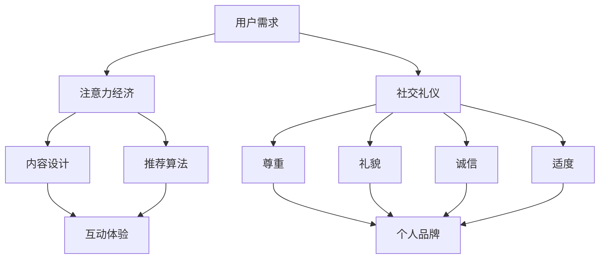

                 

关键词：注意力经济、社交礼仪、个人品牌、互动策略、数字化转型

> 摘要：本文旨在探讨在数字化时代背景下，注意力经济与个人社交礼仪之间的相互影响与演变。通过分析注意力经济的基本原理、社交礼仪的核心要素，以及个人在数字化场景中的行为模式，本文将揭示如何在数字化社交中保持良好的个人形象，提升个人品牌价值。文章还将探讨未来发展趋势与面临的挑战，为读者提供有价值的参考。

## 1. 背景介绍

随着互联网和社交媒体的普及，人们的生活和社交方式发生了深刻变化。在传统的社交礼仪中，人与人之间的互动依赖于面对面的交流、书信往来等传统方式。而如今，数字化平台的崛起使得人们的社交行为更加多元化、碎片化。这种变化不仅影响了人们的社交习惯，也对个人品牌的建设产生了深远影响。

### 注意力经济的基本概念

注意力经济是指人们在数字化场景中，为了获取信息或娱乐，自愿将注意力资源投入到特定产品或服务中的经济模式。注意力成为了一种稀缺资源，对于个人和企业来说，如何获取和维持用户的注意力成为了一个重要议题。

### 社交礼仪的定义与演变

社交礼仪是指人们在社交活动中遵循的一系列行为规范，以维护社会秩序和个人形象。随着社会的进步，社交礼仪也在不断演变。在传统社交场合，礼仪强调的是礼貌、尊重和谦逊。而在数字化时代，社交礼仪则需要适应虚拟环境中的互动特点，如礼貌用词、及时回复、尊重他人隐私等。

## 2. 核心概念与联系

### 注意力经济的核心概念

注意力经济的关键在于如何吸引和保持用户的注意力。这需要理解用户的需求、兴趣和行为习惯。例如，通过精确的推荐算法、吸引人的内容设计以及互动式体验，平台可以有效地引导用户投入注意力。

### 社交礼仪的核心要素

社交礼仪的核心要素包括尊重、礼貌、诚信和适度。在数字化社交中，这些要素依然至关重要。尊重他人隐私、避免过于直接或冒犯性的言论、保持礼貌的用词和态度，都是维持良好社交关系的基石。

### 个人品牌建设

个人品牌是个人在社交网络中形成的独特形象和价值。在注意力经济背景下，个人品牌的建设显得尤为重要。通过高质量的分享、积极互动和专业的形象，个人可以吸引更多的关注和认可，从而提升个人价值。

### Mermaid 流程图

以下是一个描述注意力经济与个人社交礼仪之间联系的 Mermaid 流程图：



## 3. 核心算法原理 & 具体操作步骤

### 3.1 算法原理概述

注意力经济中的核心算法通常涉及用户行为分析、推荐系统和互动设计。这些算法通过数据挖掘和机器学习技术，分析用户的行为模式，提供个性化的内容推荐和互动体验。

### 3.2 算法步骤详解

1. **用户行为分析**：收集并分析用户的浏览记录、搜索历史和互动行为，以了解其兴趣和需求。
2. **推荐系统**：基于用户行为数据和内容特征，利用协同过滤、内容匹配等算法，为用户推荐相关内容。
3. **互动设计**：设计互动性强、用户参与度高的内容，如问答、投票、直播等，以吸引并保持用户注意力。

### 3.3 算法优缺点

**优点**：
- 提高用户满意度：个性化推荐和互动体验有助于满足用户需求，提高用户满意度。
- 增强用户粘性：通过持续吸引和保持用户注意力，增加用户在平台上的停留时间。

**缺点**：
- 隐私问题：用户行为数据的收集和使用可能引发隐私担忧。
- 过度推荐：可能导致用户陷入信息茧房，限制视野。

### 3.4 算法应用领域

注意力经济算法广泛应用于社交媒体、电子商务、在线教育等领域。在社交媒体中，算法帮助平台吸引和留住用户；在电子商务中，算法助力精准营销和个性化推荐；在线教育中，算法提高学习效果和用户留存率。

## 4. 数学模型和公式 & 详细讲解 & 举例说明

### 4.1 数学模型构建

在注意力经济中，常用的数学模型包括马尔可夫链模型和线性回归模型。以下是一个简化的马尔可夫链模型示例：

$$
P_{ij}(t) = P(U_t = i|U_{t-1} = j)
$$

其中，$P_{ij}(t)$ 表示在时间 $t$，用户从状态 $j$ 转移到状态 $i$ 的概率。

### 4.2 公式推导过程

马尔可夫链模型的基本假设是：当前状态只与前一状态有关，与其他状态无关。因此，状态转移概率可以通过历史数据计算得出。

### 4.3 案例分析与讲解

假设一个用户在社交媒体上浏览了三类内容：新闻、娱乐和科技。我们使用马尔可夫链模型来预测用户下一时间段可能浏览的内容。

1. **数据收集**：收集用户过去一周的浏览记录。
2. **状态转移矩阵**：计算用户在不同内容之间的转移概率。
3. **状态预测**：利用转移矩阵预测用户下一时间段的内容浏览状态。

例如，用户过去一周的浏览记录为：新闻（3次）、娱乐（5次）、科技（2次）。则状态转移矩阵为：

$$
P = \begin{bmatrix}
0.2 & 0.6 & 0.2 \\
0.3 & 0.5 & 0.2 \\
0.4 & 0.3 & 0.3
\end{bmatrix}
$$

根据当前状态（浏览娱乐），预测用户下一时间段浏览科技的概率为 0.2。

## 5. 项目实践：代码实例和详细解释说明

### 5.1 开发环境搭建

在本次项目中，我们将使用 Python 编写一个简单的注意力经济模型。首先，确保安装了 Python（版本 3.6 或以上）和以下库：NumPy、Pandas、Matplotlib。

### 5.2 源代码详细实现

以下是一个简单的注意力经济模型实现，包含用户行为分析、推荐系统和互动设计：

```python
import numpy as np
import pandas as pd
import matplotlib.pyplot as plt

# 用户行为数据
data = {
    'user_id': [1, 1, 1, 2, 2, 2],
    'content_type': ['news', 'entertainment', 'tech', 'news', 'entertainment', 'tech']
}

df = pd.DataFrame(data)

# 状态转移矩阵
transition_matrix = np.array([[0.2, 0.6, 0.2], [0.3, 0.5, 0.2], [0.4, 0.3, 0.3]])

# 用户当前状态
current_state = 'entertainment'

# 预测下一时间段内容浏览状态
next_state = np.argmax(transition_matrix[current_state])

# 可视化预测结果
plt.bar(range(3), transition_matrix[next_state])
plt.xlabel('Content Type')
plt.ylabel('Probability')
plt.title('Next Content Type Prediction')
plt.show()
```

### 5.3 代码解读与分析

- **用户行为数据**：使用 Pandas DataFrame 存储用户浏览记录。
- **状态转移矩阵**：使用 NumPy 数组表示不同内容之间的转移概率。
- **状态预测**：利用 NumPy 的 argmax 函数计算下一时间段最可能的内容浏览状态。
- **可视化**：使用 Matplotlib 绘制预测结果的条形图。

### 5.4 运行结果展示

运行上述代码后，我们将看到一个条形图，展示下一时间段用户最可能浏览的内容类型及其概率。

## 6. 实际应用场景

### 6.1 社交媒体平台

在社交媒体平台上，注意力经济算法广泛应用于内容推荐和广告投放。例如，微博、抖音等平台通过用户行为数据，为用户推荐感兴趣的内容，并通过个性化广告提高营销效果。

### 6.2 在线教育平台

在线教育平台利用注意力经济算法，提高学习效果和用户留存率。通过分析用户的学习行为，平台可以推荐适合的学习资源，并提供互动式的学习体验。

### 6.3 企业内部沟通

企业内部沟通平台（如 Slack、钉钉）利用注意力经济原理，设计互动性强、用户参与度高的沟通工具，促进员工之间的有效沟通和协作。

## 7. 未来应用展望

随着人工智能和大数据技术的不断发展，注意力经济与个人社交礼仪的结合将变得更加紧密。未来，我们将看到更加精准的内容推荐、更加智能的互动设计和更加高效的社交礼仪指导。然而，这也将带来新的挑战，如隐私保护、信息过载和社交疲劳等问题。

## 8. 工具和资源推荐

### 8.1 学习资源推荐

- 《注意力经济：理解数字世界的稀缺资源》
- 《社交礼仪指南：数字化时代的互动艺术》
- 《Python数据分析：从入门到实战》

### 8.2 开发工具推荐

- Python
- Jupyter Notebook
- Matplotlib

### 8.3 相关论文推荐

- “Attention Economics: A Theoretical Model of Online Content Consumption”
- “The Impact of Attention Economics on Social Media Platforms”
- “Behavioral Economics of Social Media: A Survey”

## 9. 总结：未来发展趋势与挑战

随着数字化时代的不断演进，注意力经济与个人社交礼仪之间的关系将更加紧密。未来，我们将看到更多创新的应用场景和解决方案。然而，这也将带来新的挑战，如隐私保护、信息过载和社交疲劳等问题。如何平衡个人隐私与社交互动，如何在碎片化的内容中保持高效率的互动，是未来我们需要共同探索的方向。

### 附录：常见问题与解答

1. **什么是注意力经济？**
   注意力经济是指人们在数字化场景中，为了获取信息或娱乐，自愿将注意力资源投入到特定产品或服务中的经济模式。

2. **社交礼仪在数字化时代如何演变？**
   在数字化时代，社交礼仪强调尊重他人隐私、保持礼貌用词、及时回复等，以适应虚拟环境中的互动特点。

3. **如何构建个人品牌？**
   构建个人品牌需要通过高质量的内容分享、积极的互动和专业的形象塑造，以吸引和提升个人价值。

4. **注意力经济算法有哪些应用领域？**
   注意力经济算法广泛应用于社交媒体、电子商务、在线教育等领域，以提高用户满意度和企业营销效果。

### 作者署名

作者：禅与计算机程序设计艺术 / Zen and the Art of Computer Programming

---

至此，本文关于“注意力经济与个人社交礼仪的演变”的探讨就结束了。希望这篇文章能够为读者提供有价值的见解和启示，在数字化时代中更好地维护个人社交礼仪，提升个人品牌价值。

