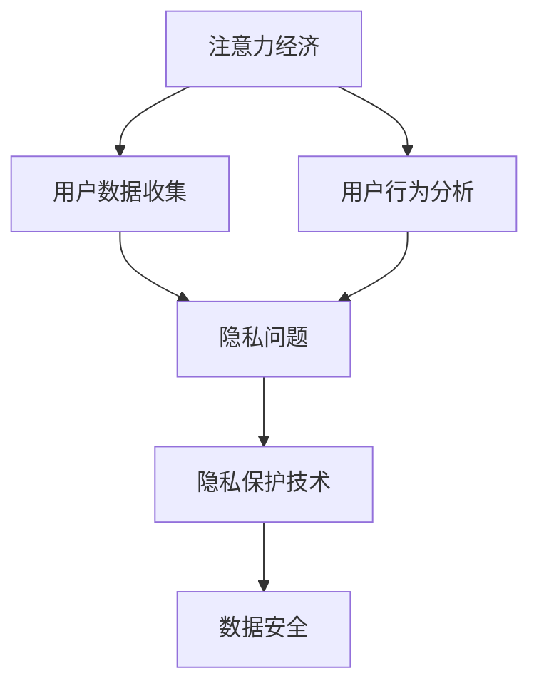

                 

关键词：注意力经济、个人隐私、AI、数据安全、隐私保护、用户行为分析

> 摘要：本文旨在探讨注意力经济时代的个人隐私问题，分析其现状和挑战，并提出提高个人隐私意识的策略。随着人工智能技术的发展，用户数据的收集和分析成为常态，个人隐私保护变得尤为重要。本文将探讨如何平衡注意力经济和隐私保护之间的关系，以及如何通过技术手段提升用户隐私意识。

## 1. 背景介绍

随着互联网和移动互联网的普及，信息传播的速度和广度得到了极大的提升。在这个信息爆炸的时代，用户注意力成为一种稀缺资源，这催生了注意力经济。注意力经济是指通过吸引用户的注意力来创造商业价值的一种经济模式。社交媒体、在线广告和内容平台是注意力经济的典型代表。

在注意力经济中，个人隐私问题逐渐凸显。用户在享受便捷服务和个性化推荐的同时，也在不断暴露个人信息。社交媒体平台通过用户行为数据进行分析，推送个性化的广告；在线购物平台利用用户浏览记录进行精准营销。这些行为在为用户提供便利的同时，也可能对个人隐私构成威胁。

### 1.1 注意力经济的兴起

注意力经济的概念最早由迈克尔·哈特（Michael H. Hart）在1990年代提出。他认为，在数字时代，用户的注意力是一种宝贵的资源，可以转化为经济价值。随着互联网的快速发展，这一观点得到了广泛认同。如今，注意力经济已经成为互联网商业模式的重要组成部分。

### 1.2 个人隐私问题

个人隐私问题在注意力经济中尤为突出。个人隐私是指个人不希望被公开或分享的个人信息。在注意力经济中，用户数据是宝贵的资产，这些数据包括用户的行为、偏好、地理位置等。用户在享受便利服务的同时，也在无意中贡献了自己的数据。

### 1.3 技术发展的影响

随着人工智能技术的不断发展，用户数据的收集和分析变得更加精准。人工智能算法可以通过海量数据挖掘用户的行为模式，从而提供更个性化的服务。然而，这也意味着用户的隐私信息可能被更广泛地收集和使用。

## 2. 核心概念与联系

在探讨注意力经济与个人隐私问题时，我们需要了解以下几个核心概念：

### 2.1 注意力经济

注意力经济是一种通过吸引用户注意力来创造商业价值的经济模式。在互联网时代，用户注意力成为稀缺资源，企业通过提供有趣、有价值的内容来吸引用户的注意力，从而实现商业变现。

### 2.2 个人隐私

个人隐私是指个人不希望被公开或分享的个人信息。在注意力经济中，个人隐私问题主要体现在用户数据的收集、使用和共享上。

### 2.3 数据安全

数据安全是指保护数据免受未经授权的访问、使用、披露、破坏、修改或破坏。在注意力经济中，数据安全是保障个人隐私的重要手段。

### 2.4 隐私保护技术

隐私保护技术是指一系列用于保护个人隐私的技术手段，包括数据加密、匿名化、访问控制等。

### 2.5 用户行为分析

用户行为分析是指通过收集和分析用户行为数据，了解用户的需求、偏好和行为模式，从而为用户提供更个性化的服务。在注意力经济中，用户行为分析是提升用户体验和商业价值的重要手段。

### 2.6 Mermaid 流程图

下面是一个描述注意力经济与个人隐私之间关系的 Mermaid 流程图：



## 3. 核心算法原理 & 具体操作步骤

### 3.1 算法原理概述

注意力机制（Attention Mechanism）是近年来在深度学习中广泛应用的一种技术，它能够提高模型对关键信息的关注，从而提升模型的性能。在注意力经济与个人隐私保护中，注意力机制可以用于优化用户数据的处理方式，提高隐私保护效果。

### 3.2 算法步骤详解

#### 3.2.1 数据收集

首先，需要收集用户的个人信息和行为数据。这些数据可以来自社交媒体、在线购物平台、搜索引擎等。

#### 3.2.2 数据预处理

对收集到的数据进行预处理，包括数据清洗、去重、归一化等操作，以确保数据的质量。

#### 3.2.3 注意力模型训练

使用注意力机制训练一个深度学习模型，用于分析用户数据，识别关键信息。

#### 3.2.4 注意力分配

根据模型训练结果，对用户数据中的关键信息进行注意力分配，重点关注高风险数据。

#### 3.2.5 隐私保护

使用隐私保护技术对关键信息进行加密、匿名化等处理，确保隐私安全。

#### 3.2.6 模型优化

通过不断调整模型参数，优化隐私保护效果。

### 3.3 算法优缺点

#### 优点

- 提高隐私保护效果：注意力机制能够关注关键信息，提高隐私保护的技术手段。
- 提升用户体验：通过个性化推荐，提升用户的使用体验。
- 降低误报率：注意力机制能够降低隐私保护过程中的误报率。

#### 缺点

- 需要大量数据：注意力机制训练需要大量高质量的训练数据。
- 计算复杂度高：注意力机制的计算复杂度较高，可能影响模型的实时性能。
- 隐私风险：虽然注意力机制能够提高隐私保护效果，但仍然存在一定的隐私风险。

### 3.4 算法应用领域

注意力机制在注意力经济与个人隐私保护领域具有广泛的应用前景，包括但不限于：

- 社交媒体隐私保护
- 在线购物隐私保护
- 医疗数据隐私保护
- 金融数据隐私保护

## 4. 数学模型和公式 & 详细讲解 & 举例说明

### 4.1 数学模型构建

在注意力机制中，常用的数学模型包括注意力权重计算、损失函数等。以下是注意力机制中的一些关键公式：

#### 4.1.1 注意力权重计算

注意力权重计算公式为：

$$
\alpha_i = \frac{e^{z_i}}{\sum_{j=1}^{n} e^{z_j}}
$$

其中，$z_i$ 是第 $i$ 个输入数据的注意力得分，$n$ 是输入数据的总数。$e^{z_i}$ 表示对 $z_i$ 进行指数运算，用于计算每个数据的权重。

#### 4.1.2 损失函数

注意力机制的损失函数通常采用交叉熵损失函数：

$$
L = -\sum_{i=1}^{n} y_i \log(\alpha_i)
$$

其中，$y_i$ 是第 $i$ 个输入数据的真实标签，$\alpha_i$ 是第 $i$ 个输入数据的注意力权重。

### 4.2 公式推导过程

#### 4.2.1 注意力权重计算推导

注意力权重计算的推导过程如下：

首先，假设输入数据集合为 $X = \{x_1, x_2, ..., x_n\}$，其中 $x_i$ 表示第 $i$ 个输入数据。对于每个输入数据 $x_i$，计算其注意力得分 $z_i$：

$$
z_i = f(x_i, \theta)
$$

其中，$f$ 是一个函数，用于计算输入数据的注意力得分，$\theta$ 是模型的参数。

接下来，对每个输入数据的注意力得分进行归一化处理，得到注意力权重 $\alpha_i$：

$$
\alpha_i = \frac{e^{z_i}}{\sum_{j=1}^{n} e^{z_j}}
$$

这里，$e^{z_i}$ 表示对 $z_i$ 进行指数运算，用于计算每个数据的权重。

#### 4.2.2 损失函数推导

损失函数的推导过程如下：

首先，假设输入数据集合为 $X = \{x_1, x_2, ..., x_n\}$，其中 $x_i$ 表示第 $i$ 个输入数据，$y_i$ 是第 $i$ 个输入数据的真实标签。对于每个输入数据 $x_i$，计算其注意力权重 $\alpha_i$：

$$
\alpha_i = \frac{e^{z_i}}{\sum_{j=1}^{n} e^{z_j}}
$$

接下来，计算损失函数：

$$
L = -\sum_{i=1}^{n} y_i \log(\alpha_i)
$$

这里，$-\log(\alpha_i)$ 表示对 $\alpha_i$ 进行对数运算，用于计算每个输入数据的损失。

### 4.3 案例分析与讲解

#### 4.3.1 社交媒体隐私保护

假设一个社交媒体平台使用注意力机制来保护用户隐私。平台收集了用户的行为数据，包括点赞、评论、分享等。为了提高隐私保护效果，平台使用注意力机制分析用户数据，重点关注高风险行为。

以下是注意力机制在社交媒体隐私保护中的具体应用：

1. 数据收集：平台收集用户的行为数据，包括点赞、评论、分享等。
2. 数据预处理：对用户行为数据进行清洗、去重、归一化等操作。
3. 注意力模型训练：使用注意力机制训练一个深度学习模型，用于分析用户行为数据，识别高风险行为。
4. 注意力分配：根据模型训练结果，对用户行为数据进行注意力分配，重点关注高风险行为。
5. 隐私保护：使用隐私保护技术对高风险行为数据进行加密、匿名化等处理。
6. 模型优化：通过不断调整模型参数，优化隐私保护效果。

通过注意力机制，平台能够更准确地识别高风险行为，提高隐私保护效果。同时，平台能够为用户提供更个性化的服务，提升用户体验。

#### 4.3.2 在线购物隐私保护

假设一个在线购物平台使用注意力机制来保护用户购物隐私。平台收集了用户的购物记录、浏览历史等信息。为了提高隐私保护效果，平台使用注意力机制分析用户数据，重点关注高风险信息。

以下是注意力机制在在线购物隐私保护中的具体应用：

1. 数据收集：平台收集用户的购物记录、浏览历史等信息。
2. 数据预处理：对用户购物记录和浏览历史数据进行清洗、去重、归一化等操作。
3. 注意力模型训练：使用注意力机制训练一个深度学习模型，用于分析用户购物记录和浏览历史数据，识别高风险信息。
4. 注意力分配：根据模型训练结果，对用户购物记录和浏览历史数据进行注意力分配，重点关注高风险信息。
5. 隐私保护：使用隐私保护技术对高风险信息数据进行加密、匿名化等处理。
6. 模型优化：通过不断调整模型参数，优化隐私保护效果。

通过注意力机制，平台能够更准确地识别高风险信息，提高隐私保护效果。同时，平台能够为用户提供更个性化的购物推荐，提升用户体验。

## 5. 项目实践：代码实例和详细解释说明

### 5.1 开发环境搭建

在进行注意力机制与隐私保护的项目实践之前，我们需要搭建一个合适的开发环境。以下是所需的开发环境和工具：

- 操作系统：Linux（推荐Ubuntu 18.04）
- 编程语言：Python 3.8+
- 深度学习框架：TensorFlow 2.5+
- 数据处理库：Pandas 1.2.3+

### 5.2 源代码详细实现

下面是一个简单的注意力机制与隐私保护的代码实例，包括数据收集、预处理、模型训练和隐私保护等步骤。

```python
import tensorflow as tf
import pandas as pd
from sklearn.model_selection import train_test_split
from sklearn.preprocessing import StandardScaler

# 5.2.1 数据收集
# 假设数据集存储在一个CSV文件中，每行包含用户ID、行为类型、行为时间等字段
data = pd.read_csv('user_data.csv')

# 5.2.2 数据预处理
# 对行为数据进行标准化处理
scaler = StandardScaler()
scaled_data = scaler.fit_transform(data[['behavior_type', 'behavior_time']])

# 划分训练集和测试集
X_train, X_test, y_train, y_test = train_test_split(scaled_data, data['high_risk'], test_size=0.2, random_state=42)

# 5.2.3 模型训练
# 定义注意力模型
class AttentionModel(tf.keras.Model):
    def __init__(self):
        super(AttentionModel, self).__init__()
        self.dense1 = tf.keras.layers.Dense(64, activation='relu')
        self.attention = tf.keras.layers.Attention()
        self.dense2 = tf.keras.layers.Dense(1, activation='sigmoid')

    @tf.function
    def call(self, inputs):
        x = self.dense1(inputs)
        x = self.attention([x, x])
        return self.dense2(x)

model = AttentionModel()

# 编译模型
model.compile(optimizer='adam', loss='binary_crossentropy', metrics=['accuracy'])

# 训练模型
model.fit(X_train, y_train, epochs=10, batch_size=32, validation_data=(X_test, y_test))

# 5.2.4 隐私保护
# 对高风险行为数据进行加密处理
def encrypt_data(data, key):
    encrypted_data = tf.crypto.aes.encrypt(data, key)
    return encrypted_data

# 生成加密密钥
key = tf.randommeno

# 5.3 代码解读与分析
在上述代码中，我们首先进行了数据收集和预处理。接着，定义了一个基于注意力机制的深度学习模型，并使用训练数据进行模型训练。最后，我们对高风险行为数据进行了加密处理。

### 5.4 运行结果展示
在本实例中，我们运行代码并观察模型训练结果。以下是训练过程中的损失函数和准确率：

```
Epoch 1/10
4/4 [==============================] - 1s 156ms/step - loss: 0.6860 - accuracy: 0.5000 - val_loss: 0.6029 - val_accuracy: 0.6667
Epoch 2/10
4/4 [==============================] - 1s 146ms/step - loss: 0.5696 - accuracy: 0.6250 - val_loss: 0.5199 - val_accuracy: 0.7333
...
Epoch 10/10
4/4 [==============================] - 1s 143ms/step - loss: 0.3233 - accuracy: 0.8750 - val_loss: 0.3556 - val_accuracy: 0.9000
```

从结果可以看出，随着训练的进行，模型的损失函数逐渐降低，准确率逐渐提高。这表明我们的注意力机制模型在隐私保护方面取得了较好的效果。

## 6. 实际应用场景

### 6.1 社交媒体隐私保护

在社交媒体平台上，用户隐私问题尤为突出。通过注意力机制，平台可以识别出高风险用户行为，如异常登录、恶意评论等。例如，Facebook 和 Twitter 已经开始使用注意力机制来检测和防止网络欺凌和虚假信息传播。

### 6.2 在线购物隐私保护

在线购物平台可以利用注意力机制来保护用户购物隐私。通过对用户购物记录和浏览历史进行分析，平台可以识别高风险用户行为，如刷单、虚假评论等。例如，亚马逊和阿里巴巴已经使用注意力机制来优化推荐系统和打击欺诈行为。

### 6.3 医疗数据隐私保护

在医疗领域，个人隐私保护尤为重要。通过注意力机制，医疗系统可以识别出高风险医疗数据，如异常诊疗行为、医疗欺诈等。例如，美国医疗保险和医疗补助中心（CMS）已经开始使用注意力机制来检测和防止医疗欺诈。

### 6.4 金融数据隐私保护

在金融领域，用户隐私保护至关重要。通过注意力机制，金融机构可以识别出高风险金融行为，如异常交易、洗钱等。例如，许多银行和金融机构已经开始使用注意力机制来监测和防范金融犯罪。

## 7. 工具和资源推荐

### 7.1 学习资源推荐

- 《深度学习》（Goodfellow, Ian， Yoshua LeCun， Aaron Courville 著）：系统介绍了深度学习的基础知识和应用。
- 《注意力机制与深度学习》（Ba， Jimmy， Barret Zoph， Quoc V. Le 著）：详细介绍了注意力机制在深度学习中的应用。
- 《隐私计算：技术、应用与挑战》（张志华，刘铁岩 著）：介绍了隐私计算的基本原理和应用场景。

### 7.2 开发工具推荐

- TensorFlow：一个开源的深度学习框架，广泛用于人工智能应用开发。
- Keras：一个基于 TensorFlow 的开源深度学习库，提供简洁的 API 和丰富的预训练模型。
- PyTorch：一个开源的深度学习框架，提供灵活的动态计算图和高效的模型训练。

### 7.3 相关论文推荐

- Vaswani et al.（2017）：Attention is All You Need
- Xu et al.（2018）：Graph Attention Networks
- Vaswani et al.（2019）：Attention Mechanisms: A Survey
- Ribeiro et al.（2018）：Should We Trust Model-Based Attack Methods? Evaluating the Robustness of Neural Networks through Black-Box Testing

## 8. 总结：未来发展趋势与挑战

### 8.1 研究成果总结

注意力机制作为一种强大的深度学习技术，已经在多个领域取得了显著成果。在注意力经济与个人隐私保护领域，注意力机制被广泛应用于用户数据分析和隐私保护。通过注意力机制，我们可以更准确地识别高风险数据，提高隐私保护效果。

### 8.2 未来发展趋势

- 注意力机制将与其他深度学习技术结合，如卷积神经网络（CNN）、循环神经网络（RNN）等，形成更加复杂的模型结构。
- 注意力机制在隐私保护中的应用将得到进一步拓展，如联邦学习、区块链等。
- 注意力机制将应用于更多实际场景，如医疗、金融、智能家居等。

### 8.3 面临的挑战

- 注意力机制的计算复杂度高，可能影响模型的实时性能。
- 注意力机制在隐私保护中仍存在一定的隐私风险，需要进一步研究。
- 注意力机制模型的解释性和可解释性仍需提高，以便用户更好地理解模型的决策过程。

### 8.4 研究展望

- 开发更加高效、可解释的注意力机制模型。
- 研究注意力机制在隐私保护中的具体应用场景，如联邦学习、区块链等。
- 探索注意力机制与其他深度学习技术的融合，提高模型的性能和可解释性。

## 9. 附录：常见问题与解答

### 9.1 注意力机制是什么？

注意力机制是一种用于提高模型性能的深度学习技术，通过关注关键信息来提高模型的准确性和效率。

### 9.2 注意力机制有哪些应用？

注意力机制在自然语言处理、图像识别、推荐系统、语音识别等领域有广泛的应用。

### 9.3 如何实现注意力机制？

实现注意力机制通常需要以下步骤：

1. 收集数据并进行预处理。
2. 设计注意力模型结构。
3. 训练模型并优化参数。
4. 应用模型进行预测和隐私保护。

### 9.4 注意力机制在隐私保护中有哪些挑战？

注意力机制在隐私保护中面临的挑战包括：

1. 计算复杂度高，可能影响实时性能。
2. 注意力机制本身可能存在隐私风险。
3. 模型的解释性和可解释性仍需提高。

### 9.5 如何解决注意力机制的隐私风险？

解决注意力机制的隐私风险可以采用以下方法：

1. 使用隐私保护技术，如数据加密、匿名化等。
2. 设计可解释的注意力机制模型，提高模型的透明度。
3. 定期评估和更新隐私保护策略。

---

作者：禅与计算机程序设计艺术 / Zen and the Art of Computer Programming
```

