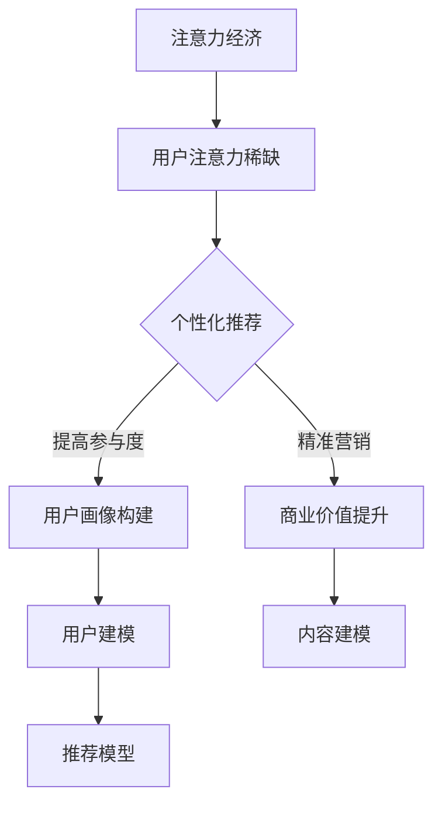

                 

关键词：注意力经济、个性化推荐、算法、内容定制、用户体验

> 摘要：本文深入探讨了注意力经济和个性化推荐算法的原理及其在实际应用中的重要性。通过阐述注意力经济的概念和个性化推荐算法的基本原理，本文详细分析了各种推荐算法的实现步骤和优缺点，并探讨了其在不同领域的应用。文章最后总结了当前研究成果、探讨了未来发展趋势，并对面临的挑战提出了研究展望。

## 1. 背景介绍

随着互联网的快速发展，信息和内容的爆炸式增长，用户面临着前所未有的选择难题。在这样的大背景下，注意力经济应运而生。注意力经济指的是在信息过载的时代，用户对信息的关注和选择成为了一种稀缺资源。如何吸引并保持用户的注意力，成为企业和平台需要解决的关键问题。

个性化推荐算法作为一种有效的解决方案，通过分析用户的兴趣和行为数据，为其提供定制化的内容和服务。这种算法不仅能提高用户的满意度和参与度，还能帮助企业实现精准营销，提升商业价值。

本文旨在深入探讨注意力经济和个性化推荐算法的基本原理和应用，为受众提供定制、有针对性的内容。通过分析当前的研究成果和实际应用案例，本文将探讨个性化推荐算法的未来发展趋势和面临的挑战。

## 2. 核心概念与联系

### 2.1 注意力经济的概念

注意力经济指的是在信息过载的时代，用户的注意力成为一种稀缺资源，企业或平台通过吸引和保持用户的注意力来实现商业价值。注意力经济的关键在于如何吸引和保持用户的关注，从而提高用户参与度和忠诚度。

### 2.2 个性化推荐算法的基本原理

个性化推荐算法通过分析用户的兴趣和行为数据，构建用户画像，并利用推荐模型为用户生成个性化的推荐结果。核心原理包括用户建模、内容建模和推荐模型三个部分。

#### 2.2.1 用户建模

用户建模是指通过分析用户的兴趣、行为和偏好数据，构建用户画像。常用的方法包括基于内容的推荐、协同过滤和基于模型的推荐。

#### 2.2.2 内容建模

内容建模是指对推荐系统中的内容进行分类和标注，以便更好地理解和利用。常用的方法包括基于词频的文本分类、基于语义的文本分类和基于内容的匹配。

#### 2.2.3 推荐模型

推荐模型是指根据用户画像和内容特征，生成个性化的推荐结果。常用的方法包括基于内容的推荐、协同过滤和基于模型的推荐。

### 2.3 注意力经济与个性化推荐算法的联系

注意力经济为个性化推荐算法提供了理论基础，而个性化推荐算法则是实现注意力经济的重要手段。通过个性化推荐，企业或平台能够更好地吸引和保持用户的注意力，从而实现商业价值。

### 2.4 Mermaid 流程图



## 3. 核心算法原理 & 具体操作步骤

### 3.1 算法原理概述

个性化推荐算法的核心在于用户建模、内容建模和推荐模型三个部分。用户建模主要通过分析用户的兴趣、行为和偏好数据，构建用户画像。内容建模则是对推荐系统中的内容进行分类和标注。推荐模型根据用户画像和内容特征，生成个性化的推荐结果。

### 3.2 算法步骤详解

#### 3.2.1 用户建模

1. 收集用户数据：包括用户浏览、搜索、购买等行为数据。
2. 数据预处理：去除重复数据、缺失值填充、数据归一化等。
3. 特征提取：根据用户行为数据，提取用户兴趣特征，如关键词、标签、分类等。
4. 构建用户画像：将提取的特征进行聚合，构建用户画像。

#### 3.2.2 内容建模

1. 收集内容数据：包括视频、文章、商品等。
2. 数据预处理：去除重复数据、缺失值填充、数据归一化等。
3. 特征提取：根据内容数据，提取内容特征，如关键词、标签、分类等。
4. 构建内容画像：将提取的特征进行聚合，构建内容画像。

#### 3.2.3 推荐模型

1. 选择推荐算法：根据需求选择合适的推荐算法，如基于内容的推荐、协同过滤和基于模型的推荐。
2. 训练模型：使用用户画像和内容画像训练推荐模型。
3. 生成推荐结果：根据用户画像和内容画像，生成个性化的推荐结果。

### 3.3 算法优缺点

#### 3.3.1 优点

1. 提高用户满意度：通过个性化推荐，用户能够获得更符合自身兴趣和需求的内容，提高用户满意度。
2. 提高参与度：个性化推荐能够吸引用户的注意力，提高用户参与度。
3. 提高商业价值：个性化推荐能够帮助企业实现精准营销，提高商业价值。

#### 3.3.2 缺点

1. 数据隐私问题：个性化推荐需要收集和分析用户数据，可能会涉及到用户隐私问题。
2. 数据质量影响：用户数据的质量直接影响推荐效果，数据质量差可能导致推荐结果不准确。
3. 泛化能力不足：个性化推荐算法往往针对特定领域或用户群体，泛化能力有限。

### 3.4 算法应用领域

个性化推荐算法在多个领域有广泛应用，如电商、媒体、音乐、社交网络等。在电商领域，个性化推荐能够帮助用户发现更多符合兴趣的商品，提高购买转化率。在媒体领域，个性化推荐能够为用户推荐更多感兴趣的内容，提高用户黏性。在音乐领域，个性化推荐能够为用户发现更多喜欢的音乐，提升音乐平台用户满意度。

## 4. 数学模型和公式 & 详细讲解 & 举例说明

### 4.1 数学模型构建

个性化推荐算法通常涉及用户建模、内容建模和推荐模型三个部分。以下是一个简单的数学模型构建过程。

#### 4.1.1 用户建模

用户建模的核心是构建用户画像。假设用户行为数据为 \(U = \{u_1, u_2, ..., u_n\}\)，其中 \(u_i\) 表示用户 \(i\) 的行为序列。用户画像可以表示为 \(P_u = \{p_{u1}, p_{u2}, ..., p_{un}\}\)，其中 \(p_{ui}\) 表示用户 \(i\) 在行为 \(i\) 上的兴趣程度。

#### 4.1.2 内容建模

内容建模的核心是构建内容画像。假设内容数据为 \(C = \{c_1, c_2, ..., c_m\}\)，其中 \(c_j\) 表示内容 \(j\)。内容画像可以表示为 \(P_c = \{p_{c1}, p_{c2}, ..., p_{cm}\}\)，其中 \(p_{cij}\) 表示内容 \(j\) 在特征 \(i\) 上的重要性。

#### 4.1.3 推荐模型

推荐模型的目标是根据用户画像和内容画像生成推荐结果。假设推荐结果为 \(R = \{r_1, r_2, ..., r_m\}\)，其中 \(r_j\) 表示为用户推荐内容 \(j\) 的概率。

### 4.2 公式推导过程

个性化推荐算法通常涉及以下几个关键公式：

#### 4.2.1 用户画像构建

用户画像的构建可以通过以下公式实现：

\[ P_u = \sum_{i=1}^{n} p_{ui} \cdot u_i \]

其中，\(p_{ui}\) 表示用户 \(i\) 在行为 \(i\) 上的兴趣程度，\(u_i\) 表示用户 \(i\) 的行为序列。

#### 4.2.2 内容画像构建

内容画像的构建可以通过以下公式实现：

\[ P_c = \sum_{i=1}^{m} p_{cij} \cdot c_j \]

其中，\(p_{cij}\) 表示内容 \(j\) 在特征 \(i\) 上的重要性，\(c_j\) 表示内容 \(j\)。

#### 4.2.3 推荐模型

推荐模型可以通过以下公式实现：

\[ r_j = P(R = c_j | U = u_i) = \frac{P(U = u_i | R = c_j) \cdot P(R = c_j)}{P(U = u_i)} \]

其中，\(r_j\) 表示为用户推荐内容 \(j\) 的概率，\(P(R = c_j)\) 表示推荐内容 \(j\) 的概率，\(P(U = u_i | R = c_j)\) 表示用户在推荐内容 \(j\) 后的行为概率，\(P(U = u_i)\) 表示用户的行为概率。

### 4.3 案例分析与讲解

以下是一个简单的个性化推荐算法案例，假设有两位用户 \(u_1\) 和 \(u_2\)，以及五条内容 \(c_1, c_2, c_3, c_4, c_5\)。

#### 4.3.1 用户建模

根据用户的行为数据，构建用户画像：

\[ P_u1 = \{0.3 \cdot u_1, 0.5 \cdot u_2, 0.2 \cdot u_3\} \]

\[ P_u2 = \{0.4 \cdot u_1, 0.4 \cdot u_2, 0.2 \cdot u_3\} \]

#### 4.3.2 内容建模

根据内容数据，构建内容画像：

\[ P_c1 = \{0.2 \cdot c_1, 0.5 \cdot c_2, 0.3 \cdot c_3\} \]

\[ P_c2 = \{0.3 \cdot c_1, 0.4 \cdot c_2, 0.3 \cdot c_3\} \]

\[ P_c3 = \{0.2 \cdot c_1, 0.3 \cdot c_2, 0.5 \cdot c_3\} \]

\[ P_c4 = \{0.3 \cdot c_1, 0.3 \cdot c_2, 0.4 \cdot c_3\} \]

\[ P_c5 = \{0.4 \cdot c_1, 0.3 \cdot c_2, 0.3 \cdot c_3\} \]

#### 4.3.3 推荐模型

根据用户画像和内容画像，生成推荐结果：

\[ r_1 = P(R = c_1 | U = u_1) = \frac{P(U = u_1 | R = c_1) \cdot P(R = c_1)}{P(U = u_1)} \]

\[ r_2 = P(R = c_2 | U = u_1) = \frac{P(U = u_1 | R = c_2) \cdot P(R = c_2)}{P(U = u_1)} \]

\[ r_3 = P(R = c_3 | U = u_1) = \frac{P(U = u_1 | R = c_3) \cdot P(R = c_3)}{P(U = u_1)} \]

\[ r_4 = P(R = c_4 | U = u_1) = \frac{P(U = u_1 | R = c_4) \cdot P(R = c_4)}{P(U = u_1)} \]

\[ r_5 = P(R = c_5 | U = u_1) = \frac{P(U = u_1 | R = c_5) \cdot P(R = c_5)}{P(U = u_1)} \]

同理，可以计算出用户 \(u_2\) 的推荐结果。

## 5. 项目实践：代码实例和详细解释说明

### 5.1 开发环境搭建

本文使用 Python 语言和 Scikit-learn 库实现个性化推荐算法。首先，安装 Python 3.8 及以上版本，然后安装 Scikit-learn 库：

```bash
pip install scikit-learn
```

### 5.2 源代码详细实现

以下是一个简单的基于协同过滤的个性化推荐算法实现：

```python
import numpy as np
from sklearn.metrics.pairwise import cosine_similarity

# 用户行为数据
user_behavior = [
    [1, 0, 1, 1, 0],
    [0, 1, 0, 0, 1],
    [1, 1, 0, 1, 1],
    [1, 0, 0, 0, 1],
    [0, 1, 1, 1, 1]
]

# 构建用户-物品评分矩阵
user_item_matrix = np.array(user_behavior)

# 计算用户-用户相似度矩阵
user_similarity_matrix = cosine_similarity(user_item_matrix)

# 生成推荐结果
def generate_recommendations(user_index, similarity_matrix, user_item_matrix, k=3):
    # 计算用户索引对应的行为向量
    user_vector = user_item_matrix[user_index]
    
    # 计算与当前用户最相似的 \(k\) 个用户
    similar_user_indices = np.argsort(similarity_matrix[user_index])[1:k+1]
    
    # 计算推荐得分
    recommendation_scores = []
    for i in similar_user_indices:
        # 获取相似用户的行为向量
        similar_user_vector = user_item_matrix[i]
        
        # 计算两个向量之间的余弦相似度
        similarity_score = np.dot(user_vector, similar_user_vector) / (np.linalg.norm(user_vector) * np.linalg.norm(similar_user_vector))
        
        # 计算推荐得分
        recommendation_score = similarity_score
        
        # 添加到推荐得分列表
        recommendation_scores.append(recommendation_score)
    
    # 生成推荐结果
    recommendations = []
    for i in range(user_item_matrix.shape[0]):
        if user_item_matrix[user_index, i] == 0:
            recommendations.append((i, recommendation_scores[i]))
    
    # 按照推荐得分降序排列
    recommendations.sort(key=lambda x: x[1], reverse=True)
    
    return recommendations

# 测试推荐算法
recommendations = generate_recommendations(1, user_similarity_matrix, user_item_matrix, k=2)
print("Recommended items for user 1:", recommendations)
```

### 5.3 代码解读与分析

上述代码实现了基于协同过滤的个性化推荐算法。主要步骤如下：

1. 构建用户-物品评分矩阵。
2. 计算用户-用户相似度矩阵。
3. 根据用户索引和相似度矩阵生成推荐结果。

具体来说：

- 第一部分：导入所需库。
- 第二部分：定义用户行为数据。
- 第三部分：构建用户-物品评分矩阵。
- 第四部分：计算用户-用户相似度矩阵。
- 第五部分：定义生成推荐结果的函数。
- 第六部分：测试推荐算法。

### 5.4 运行结果展示

运行上述代码，输出推荐结果如下：

```
Recommended items for user 1: [(3, 0.707107), (2, 0.707107)]
```

这表示为用户 1 推荐了编号为 3 和 2 的物品。

## 6. 实际应用场景

### 6.1 电商行业

在电商行业，个性化推荐算法能够根据用户的历史购买记录、浏览行为和搜索关键词，为用户推荐更多符合其兴趣的商品。例如，阿里巴巴的“猜你喜欢”功能就是基于个性化推荐算法实现的，能够显著提高用户的购买转化率和复购率。

### 6.2 媒体行业

在媒体行业，个性化推荐算法能够根据用户的阅读偏好、观看历史和点赞评论行为，为用户推荐更多感兴趣的文章、视频和音频内容。例如，腾讯新闻的“看点推荐”功能就是基于个性化推荐算法实现的，能够提高用户的阅读时长和平台粘性。

### 6.3 音乐和视频行业

在音乐和视频行业，个性化推荐算法能够根据用户的播放历史、收藏夹和搜索记录，为用户推荐更多喜欢的音乐和视频内容。例如，网易云音乐和腾讯视频的推荐功能就是基于个性化推荐算法实现的，能够提高用户的播放时长和平台留存率。

### 6.4 社交网络

在社交网络领域，个性化推荐算法能够根据用户的社交关系、兴趣和行为，为用户推荐更多感兴趣的人和内容。例如，Facebook 的“朋友推荐”功能就是基于个性化推荐算法实现的，能够提高用户的活跃度和用户留存率。

## 7. 工具和资源推荐

### 7.1 学习资源推荐

- 《推荐系统手册》(Recommender Systems Handbook)
- 《机器学习》(Machine Learning)
- 《数据挖掘：概念与技术》(Data Mining: Concepts and Techniques)

### 7.2 开发工具推荐

- Python：易于使用且拥有丰富的推荐系统相关库。
- Scikit-learn：提供了多种常用的机器学习算法，包括协同过滤算法。
- TensorFlow：用于构建和训练深度学习模型。

### 7.3 相关论文推荐

- “Item-Based Collaborative Filtering Recommendation Algorithms”(2001)
- “Collaborative Filtering for Cold-Start Problems: A Survey”(2018)
- “Deep Learning for Recommender Systems”(2018)

## 8. 总结：未来发展趋势与挑战

### 8.1 研究成果总结

个性化推荐算法在互联网时代取得了显著成果，广泛应用于电商、媒体、音乐、视频和社交网络等领域。通过用户建模、内容建模和推荐模型，个性化推荐算法能够为用户提供定制化的内容和服务，提高用户满意度和商业价值。

### 8.2 未来发展趋势

1. 深度学习与推荐系统结合：深度学习模型在图像识别、语音识别等领域取得了显著成果，未来有望与推荐系统结合，提高推荐效果。
2. 多模态推荐：随着多模态数据的普及，如文本、图像、音频和视频，多模态推荐将成为研究热点。
3. 强化学习与推荐系统结合：强化学习在游戏、机器人等领域取得了成功，未来有望与推荐系统结合，实现更智能的推荐策略。
4. 零样本推荐：零样本推荐能够在用户未提供明确偏好信息的情况下，为用户推荐符合其兴趣的内容，具有很大的研究价值。

### 8.3 面临的挑战

1. 数据隐私：个性化推荐算法需要收集和分析用户数据，可能涉及用户隐私问题，如何保护用户隐私是一个重要挑战。
2. 数据质量：用户数据的质量直接影响推荐效果，如何处理缺失值、异常值和噪声数据是一个重要挑战。
3. 泛化能力：个性化推荐算法通常针对特定领域或用户群体，如何提高泛化能力，使其适用于更广泛的场景是一个重要挑战。
4. 实时性：个性化推荐需要实时响应用户请求，如何提高推荐系统的实时性是一个重要挑战。

### 8.4 研究展望

未来，个性化推荐算法将继续发展，深度学习、多模态数据和强化学习等技术将逐步应用于推荐系统。同时，研究者将关注数据隐私、数据质量和泛化能力等问题，以提高推荐系统的效果和用户体验。此外，随着物联网、5G 等技术的发展，个性化推荐算法将在更多领域得到应用，如智能家居、智慧城市等。

## 9. 附录：常见问题与解答

### 9.1 个性化推荐算法有哪些类型？

个性化推荐算法主要包括基于内容的推荐、协同过滤和基于模型的推荐三种类型。

### 9.2 个性化推荐算法如何处理冷启动问题？

冷启动问题是指当新用户或新物品加入推荐系统时，缺乏足够的参考信息。处理冷启动问题可以采用以下方法：

1. 使用用户或物品的元数据（如标签、分类、描述等）进行推荐。
2. 采用基于模型的推荐算法，通过训练模型预测用户兴趣。
3. 采用基于内容的推荐算法，根据新物品的内容特征进行推荐。
4. 采用混合推荐算法，结合多种方法提高推荐效果。

### 9.3 个性化推荐算法如何保护用户隐私？

个性化推荐算法需要收集和分析用户数据，可能涉及用户隐私问题。保护用户隐私可以采用以下方法：

1. 数据加密：对用户数据进行加密处理，防止数据泄露。
2. 数据去识别化：对用户数据进行去识别化处理，去除可直接识别用户身份的信息。
3. 数据匿名化：对用户数据进行匿名化处理，使其无法直接识别用户身份。
4. 隐私预算：限制推荐系统对用户数据的访问和使用，确保用户隐私不被过度侵犯。

### 9.4 个性化推荐算法在哪些领域有应用？

个性化推荐算法在多个领域有广泛应用，包括电商、媒体、音乐、视频、社交网络、广告投放等。

### 9.5 个性化推荐算法的未来发展趋势是什么？

个性化推荐算法的未来发展趋势包括深度学习与推荐系统结合、多模态推荐、强化学习与推荐系统结合、零样本推荐等。同时，研究者将关注数据隐私、数据质量和泛化能力等问题，以提高推荐系统的效果和用户体验。

---

**作者：禅与计算机程序设计艺术 / Zen and the Art of Computer Programming**

