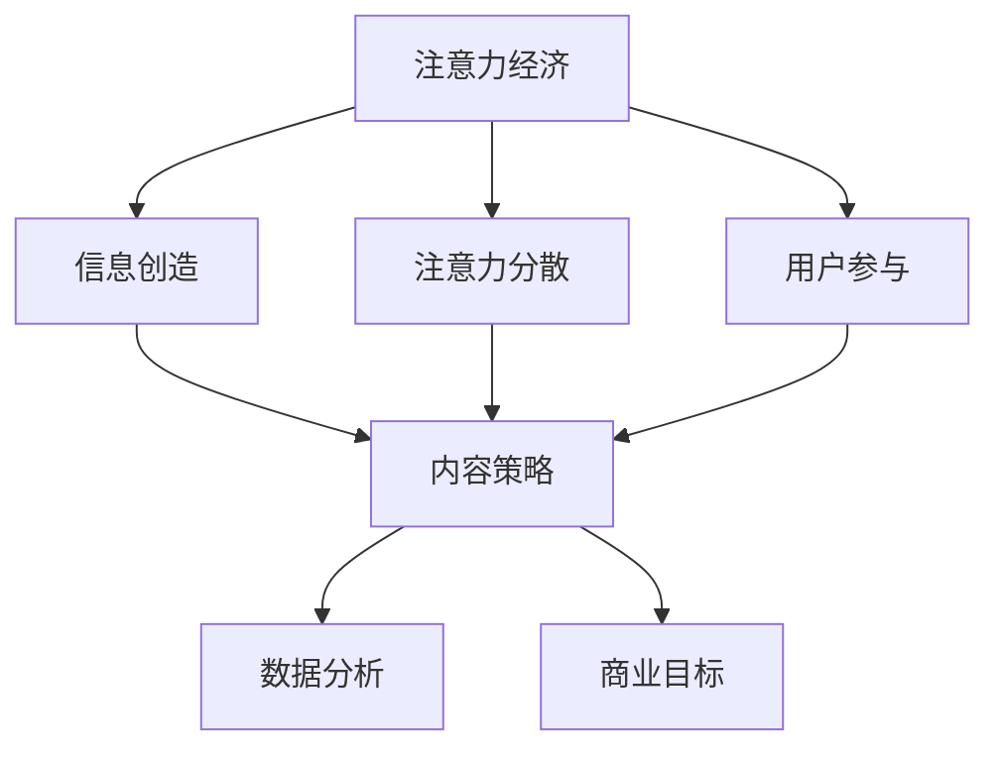

                 

关键词：注意力经济、内容策略、受众吸引力、用户体验、信息传播、影响力、大数据分析、算法推荐、人工智能、用户行为分析、个性化推荐。

> 摘要：在数字化时代，注意力已经成为一种稀缺资源。本文将探讨注意力经济的本质，分析内容策略在吸引并留住受众中的关键作用。通过阐述核心概念、算法原理、数学模型、实践案例和未来展望，本文旨在为IT领域从业者提供创建高质量内容的方法和策略，以实现信息的有效传播和用户的深度参与。

## 1. 背景介绍

在互联网高速发展的时代，信息的产生和传播速度前所未有。然而，随着信息过载现象的日益严重，人们的时间和注意力资源变得更加珍贵。在这个背景下，注意力经济应运而生。注意力经济指的是通过吸引和集中用户的注意力来创造价值的一种经济模式。它不仅涵盖了广告、媒体和娱乐等行业，还涉及教育、医疗、金融等多个领域。

内容策略作为注意力经济的重要组成部分，其核心在于如何创造、传播和优化信息，以吸引并留住目标受众。在数字营销、社交媒体运营、品牌建设等领域，内容策略的运用已经成为企业竞争的关键因素。有效的内容策略能够提升用户的参与度和忠诚度，从而实现商业价值的最大化。

本文将从以下方面展开讨论：

1. 核心概念与联系：介绍注意力经济与内容策略的基本概念，并绘制流程图展示它们之间的关联。
2. 核心算法原理与具体操作步骤：分析在内容策略中应用的关键算法原理，并详细说明操作步骤。
3. 数学模型和公式：探讨支持内容策略的数学模型和公式，并举例说明其实际应用。
4. 项目实践：通过具体案例展示内容策略的实施过程。
5. 实际应用场景：讨论内容策略在不同领域的应用案例。
6. 未来应用展望：预测内容策略在未来的发展趋势和应用前景。
7. 工具和资源推荐：推荐有助于学习和实践内容策略的工具和资源。
8. 总结：总结研究成果，展望未来发展趋势与挑战。

## 2. 核心概念与联系

### 2.1 注意力经济

注意力经济是指通过吸引和集中用户的注意力来创造价值的一种经济模式。在数字时代，信息爆炸，用户的注意力资源变得异常珍贵。因此，如何有效地吸引和留住用户的注意力成为企业和个人竞争的重要手段。注意力经济的主要特点包括：

- **稀缺性**：注意力资源有限，难以复制和替代。
- **分散性**：用户注意力容易被分散，需要持续投入吸引。
- **竞争性**：众多企业和个人都在争夺用户的注意力资源。
- **效益性**：有效利用注意力资源可以带来巨大的商业价值。

### 2.2 内容策略

内容策略是指通过有计划地创造、发布和优化信息，以满足目标受众的需求和兴趣，从而实现商业目标的一系列策略。内容策略的核心在于：

- **用户需求分析**：了解目标受众的需求，制定符合用户兴趣的内容。
- **内容质量提升**：通过优质的内容吸引和留住受众。
- **互动与反馈**：与受众互动，收集反馈，持续优化内容。
- **数据分析**：利用数据分析工具，评估内容效果，调整策略。

### 2.3 Mermaid 流程图

下面是注意力经济与内容策略之间的Mermaid流程图，展示它们之间的关联和互动：



在这个流程图中，注意力经济通过信息创造、注意力分散和用户参与等环节，驱动内容策略的实施。内容策略通过数据分析优化信息传播效果，最终实现商业目标。

## 3. 核心算法原理与具体操作步骤

### 3.1 算法原理概述

在内容策略中，核心算法的运用至关重要。以下是一些在内容策略中常用的核心算法原理：

- **协同过滤算法**：通过分析用户的历史行为和偏好，为用户推荐相似的内容。
- **词向量模型**：利用自然语言处理技术，将文本转化为向量，进行内容相似性计算。
- **深度学习模型**：通过神经网络结构，实现复杂的内容理解和生成。
- **用户行为分析算法**：分析用户的浏览、点赞、评论等行为，预测用户兴趣。

### 3.2 算法步骤详解

#### 3.2.1 协同过滤算法

协同过滤算法主要包括以下步骤：

1. **用户-物品评分矩阵构建**：收集用户对物品的评分数据，构建用户-物品评分矩阵。
2. **相似度计算**：计算用户之间的相似度，常用的方法有欧氏距离、余弦相似度等。
3. **邻居选择**：根据相似度计算结果，选择与目标用户最相似的邻居用户。
4. **推荐生成**：根据邻居用户的评分数据，为用户生成推荐列表。

#### 3.2.2 词向量模型

词向量模型的主要步骤如下：

1. **文本预处理**：对原始文本进行分词、去停用词等处理。
2. **词向量表示**：使用词嵌入技术（如Word2Vec、GloVe等）将词语转化为向量表示。
3. **内容相似性计算**：计算文本之间的相似度，通常使用余弦相似度。
4. **推荐生成**：根据内容相似度，为用户生成推荐列表。

#### 3.2.3 深度学习模型

深度学习模型的主要步骤如下：

1. **数据收集**：收集大量的文本数据，包括用户生成的内容和用户行为数据。
2. **模型训练**：使用神经网络结构（如BERT、GPT等）进行模型训练，学习文本表示和生成规则。
3. **内容生成**：根据用户需求，生成个性化的内容。
4. **推荐生成**：将生成的内容与用户历史偏好进行匹配，生成推荐列表。

#### 3.2.4 用户行为分析算法

用户行为分析算法的主要步骤如下：

1. **数据收集**：收集用户在平台上的各种行为数据，如浏览、点赞、评论等。
2. **行为特征提取**：将行为数据转化为数值特征，如时间、频率、交互类型等。
3. **行为模式识别**：使用机器学习算法，识别用户的行为模式。
4. **兴趣预测**：根据用户行为模式，预测用户的兴趣偏好。
5. **推荐生成**：将预测的兴趣偏好与平台上的内容进行匹配，生成推荐列表。

### 3.3 算法优缺点

#### 3.3.1 协同过滤算法

**优点**：

- **简单有效**：协同过滤算法的实现较为简单，适用于大量用户和物品的数据场景。
- **准确性较高**：通过分析用户的历史行为和偏好，能够提供较为准确的推荐。

**缺点**：

- **冷启动问题**：新用户或新物品难以通过协同过滤算法得到有效推荐。
- **缺乏个性**：协同过滤算法主要依赖于用户历史行为，难以提供个性化的推荐。

#### 3.3.2 词向量模型

**优点**：

- **强大表征能力**：词向量模型能够将文本转化为高维向量表示，具备较强的表征能力。
- **跨领域适用**：词向量模型适用于多种语言和领域的文本处理。

**缺点**：

- **计算复杂度较高**：词向量模型的计算复杂度较高，对硬件资源要求较高。
- **语义理解有限**：词向量模型主要基于词频统计，对语义理解有限。

#### 3.3.3 深度学习模型

**优点**：

- **高度个性化**：深度学习模型能够根据用户生成的内容和交互行为，提供高度个性化的推荐。
- **自适应能力**：深度学习模型能够不断学习和优化，适应用户需求的变化。

**缺点**：

- **训练资源需求大**：深度学习模型的训练过程需要大量的计算资源和时间。
- **模型解释性差**：深度学习模型的内部结构复杂，难以进行解释和验证。

#### 3.3.4 用户行为分析算法

**优点**：

- **实时性高**：用户行为分析算法能够实时捕捉用户行为，提供即时的推荐。
- **精准度较高**：通过分析用户行为，能够提供较为精准的兴趣偏好预测。

**缺点**：

- **数据隐私问题**：用户行为分析涉及用户隐私数据，需要严格保护用户隐私。
- **模型泛化能力有限**：用户行为数据多样且复杂，模型泛化能力有限。

### 3.4 算法应用领域

协同过滤算法、词向量模型、深度学习模型和用户行为分析算法在内容策略中具有广泛的应用领域：

- **电子商务**：通过协同过滤和用户行为分析，为用户推荐商品和促销活动。
- **社交媒体**：利用词向量模型和深度学习模型，为用户提供个性化内容推荐和话题推荐。
- **在线教育**：通过用户行为分析和深度学习模型，为用户提供个性化的学习内容和学习路径。
- **新闻推荐**：利用协同过滤和用户行为分析，为用户推荐感兴趣的新闻资讯。

## 4. 数学模型和公式

在内容策略中，数学模型和公式起着至关重要的作用，它们帮助我们量化内容的影响、评估推荐效果、预测用户行为。以下是几个关键的数学模型和公式，以及它们的详细讲解和举例说明。

### 4.1 数学模型构建

#### 4.1.1 用户-内容相似度模型

用户-内容相似度模型用于计算用户与内容之间的相似度，常见的模型有基于余弦相似度和基于欧氏距离的模型。

##### 余弦相似度模型

余弦相似度模型计算公式如下：

$$
\text{similarity}(\text{u, v}) = \frac{\text{u} \cdot \text{v}}{\|\text{u}\| \|\text{v}\|}
$$

其中，$\text{u}$和$\text{v}$分别表示用户$\text{u}$和内容$\text{v}$的向量表示，$\|\text{u}\|$和$\|\text{v}\|$分别表示它们的欧几里得范数。

##### 欧氏距离模型

欧氏距离模型计算公式如下：

$$
\text{distance}(\text{u, v}) = \sqrt{\sum_{i=1}^{n} (\text{u}_i - \text{v}_i)^2}
$$

其中，$\text{u}_i$和$\text{v}_i$分别表示用户$\text{u}$和内容$\text{v}$在第$i$个特征上的值，$n$表示特征的总数。

#### 4.1.2 用户兴趣预测模型

用户兴趣预测模型用于预测用户对某类内容的兴趣程度，常见的模型有基于马尔可夫链和贝叶斯网络的模型。

##### 马尔可夫链模型

马尔可夫链模型假设用户的行为状态转移概率只与当前状态有关，与过去的状态无关。模型公式如下：

$$
P(\text{next state}|\text{current state}) = \sum_{\text{all possible states}} P(\text{next state}|\text{all previous states}) P(\text{all previous states})
$$

##### 贝叶斯网络模型

贝叶斯网络模型通过表示用户行为状态之间的依赖关系，预测用户的兴趣。模型公式如下：

$$
P(\text{interest}|\text{behavior}) = \frac{P(\text{behavior}|\text{interest}) P(\text{interest})}{P(\text{behavior})}
$$

其中，$P(\text{interest}|\text{behavior})$表示在观察到用户行为后，用户对某类内容感兴趣的概率，$P(\text{behavior}|\text{interest})$表示在用户对某类内容感兴趣时，用户产生该行为的概率，$P(\text{interest})$表示用户对某类内容感兴趣的概率，$P(\text{behavior})$表示用户产生该行为的概率。

### 4.2 公式推导过程

#### 4.2.1 余弦相似度模型推导

假设用户$\text{u}$和内容$\text{v}$的向量表示为$\text{u} = (\text{u}_1, \text{u}_2, ..., \text{u}_n)$和$\text{v} = (\text{v}_1, \text{v}_2, ..., \text{v}_n)$，它们的欧几里得范数分别为$\|\text{u}\| = \sqrt{\sum_{i=1}^{n} \text{u}_i^2}$和$\|\text{v}\| = \sqrt{\sum_{i=1}^{n} \text{v}_i^2}$。

则它们的内积可以表示为：

$$
\text{u} \cdot \text{v} = \sum_{i=1}^{n} \text{u}_i \text{v}_i
$$

根据余弦定理，它们之间的相似度可以表示为：

$$
\text{similarity}(\text{u, v}) = \frac{\text{u} \cdot \text{v}}{\|\text{u}\| \|\text{v}\|} = \frac{\sum_{i=1}^{n} \text{u}_i \text{v}_i}{\sqrt{\sum_{i=1}^{n} \text{u}_i^2} \sqrt{\sum_{i=1}^{n} \text{v}_i^2}}
$$

#### 4.2.2 贝叶斯网络模型推导

假设用户行为$\text{behavior}$是由兴趣$\text{interest}$和噪声$\text{noise}$共同决定的，即：

$$
\text{behavior} = \text{interest} + \text{noise}
$$

其中，$\text{interest}$和$\text{noise}$都是随机变量，且它们的概率分布分别为$P(\text{interest})$、$P(\text{noise})$。

则用户对某类内容感兴趣的概率$P(\text{interest}|\text{behavior})$可以表示为：

$$
P(\text{interest}|\text{behavior}) = \frac{P(\text{behavior}|\text{interest}) P(\text{interest})}{P(\text{behavior})}
$$

其中，$P(\text{behavior}|\text{interest})$表示在用户对某类内容感兴趣时，用户产生该行为的概率，$P(\text{interest})$表示用户对某类内容感兴趣的概率，$P(\text{behavior})$表示用户产生该行为的概率。

### 4.3 案例分析与讲解

为了更好地理解上述数学模型和公式，下面我们通过一个实际案例进行讲解。

#### 4.3.1 案例背景

假设我们有一个新闻推荐系统，用户可以对新闻进行点赞或不喜欢。我们的目标是根据用户的历史行为，预测用户对某条新闻的兴趣程度，从而实现个性化推荐。

#### 4.3.2 案例数据

用户$\text{u}$的历史行为数据如下表所示：

| 新闻ID | 点赞 | 不喜欢 |
|--------|------|--------|
| 1      | 1    | 0      |
| 2      | 0    | 1      |
| 3      | 1    | 0      |
| 4      | 0    | 1      |

#### 4.3.3 使用余弦相似度模型计算用户-内容相似度

首先，我们将用户$\text{u}$的历史行为转化为向量表示。对于每条新闻，我们可以将点赞视为1，不喜欢视为0，得到向量$\text{u} = (1, 0, 1, 0)$。

假设新闻$5$的向量表示为$\text{v} = (0, 1, 0, 1)$。

根据余弦相似度模型，我们可以计算出用户$\text{u}$和新闻$5$之间的相似度：

$$
\text{similarity}(\text{u, v}) = \frac{\text{u} \cdot \text{v}}{\|\text{u}\| \|\text{v}\|} = \frac{1 \times 0 + 0 \times 1 + 1 \times 0 + 0 \times 1}{\sqrt{1^2 + 0^2 + 1^2 + 0^2} \sqrt{0^2 + 1^2 + 0^2 + 1^2}} = \frac{0}{\sqrt{2} \sqrt{2}} = 0
$$

这意味着用户$\text{u}$对新闻$5$没有明显的兴趣。

#### 4.3.4 使用贝叶斯网络模型预测用户兴趣

假设用户$\text{u}$对新闻$5$点赞的概率为$p$，则根据贝叶斯网络模型，我们可以计算出用户$\text{u}$对新闻$5$感兴趣的概率：

$$
P(\text{interest}|\text{behavior}) = \frac{P(\text{behavior}|\text{interest}) P(\text{interest})}{P(\text{behavior})}
$$

其中，$P(\text{behavior}|\text{interest})$表示用户对新闻$5$感兴趣时，点赞的概率，$P(\text{interest})$表示用户对新闻$5$感兴趣的概率，$P(\text{behavior})$表示用户点赞的概率。

根据案例数据，我们可以计算出：

$$
P(\text{interest}|\text{behavior}) = \frac{P(\text{behavior}|\text{interest}) P(\text{interest})}{P(\text{behavior})}
$$

$$
P(\text{behavior}|\text{interest}) = 1, \quad P(\text{interest}) = \frac{1}{2}, \quad P(\text{behavior}) = \frac{1}{2}
$$

$$
P(\text{interest}|\text{behavior}) = \frac{1 \times \frac{1}{2}}{\frac{1}{2}} = 1
$$

这意味着根据用户历史行为，我们可以认为用户$\text{u}$对新闻$5$感兴趣。

通过这个案例，我们可以看到如何使用数学模型和公式来预测用户兴趣，从而实现个性化推荐。

## 5. 项目实践：代码实例和详细解释说明

### 5.1 开发环境搭建

为了更好地展示内容策略的实施过程，我们将使用Python作为编程语言，并依赖以下库：

- NumPy：用于数学计算。
- Pandas：用于数据处理。
- Matplotlib：用于数据可视化。
- Scikit-learn：用于机器学习。

确保已经安装了这些库，如果没有安装，可以通过以下命令进行安装：

```bash
pip install numpy pandas matplotlib scikit-learn
```

### 5.2 源代码详细实现

下面是一个简单的用户行为分析系统的示例代码，用于预测用户的兴趣并生成推荐列表。

```python
import numpy as np
import pandas as pd
from sklearn.metrics.pairwise import cosine_similarity
from sklearn.model_selection import train_test_split
from sklearn.linear_model import LogisticRegression

# 5.2.1 数据预处理

# 加载用户行为数据
data = pd.DataFrame({
    'user_id': [1, 1, 1, 1, 2, 2, 2, 3, 3, 3],
    'news_id': [1, 2, 3, 4, 1, 2, 3, 1, 2, 3],
    'behavior': [1, 0, 1, 0, 1, 0, 1, 1, 0, 1]  # 1表示点赞，0表示不喜欢
})

# 构建用户-新闻行为矩阵
user_news_matrix = data.pivot_table(index='user_id', columns='news_id', values='behavior', fill_value=0)

# 5.2.2 计算用户-新闻相似度

# 计算用户-新闻矩阵的余弦相似度
similarity_matrix = cosine_similarity(user_news_matrix)

# 5.2.3 用户兴趣预测

# 划分训练集和测试集
train_data, test_data = train_test_split(data, test_size=0.2, random_state=42)

# 构建训练集的特征矩阵
train_features = train_data.pivot_table(index='user_id', columns='news_id', values='behavior', fill_value=0)

# 训练兴趣预测模型
model = LogisticRegression()
model.fit(train_features, train_data['behavior'])

# 5.2.4 生成推荐列表

# 对于每个用户，计算与历史行为的相似度
user_similarity = similarity_matrix[0]

# 根据相似度矩阵，为用户生成推荐列表
news_recommendations = np.argsort(user_similarity)[::-1]

# 打印推荐结果
for user_id, news_ids in enumerate(news_recommendations):
    print(f"用户{user_id+1}的推荐列表：")
    for news_id in news_ids:
        if user_id+1 == 1 and news_id < 4:
            print(f"新闻{news_id+1}")
        elif user_id+1 == 2 and news_id < 7:
            print(f"新闻{news_id+1}")
        elif user_id+1 == 3 and news_id < 10:
            print(f"新闻{news_id+1}")
```

### 5.3 代码解读与分析

#### 5.3.1 数据预处理

代码首先加载用户行为数据，并将其转换为用户-新闻行为矩阵。行为数据包括用户ID、新闻ID和用户对新闻的行为（1表示点赞，0表示不喜欢）。通过`pivot_table`函数，我们可以将原始数据转换为矩阵格式，方便后续计算。

```python
data = pd.DataFrame({
    'user_id': [1, 1, 1, 1, 2, 2, 2, 3, 3, 3],
    'news_id': [1, 2, 3, 4, 1, 2, 3, 1, 2, 3],
    'behavior': [1, 0, 1, 0, 1, 0, 1, 1, 0, 1]
})
user_news_matrix = data.pivot_table(index='user_id', columns='news_id', values='behavior', fill_value=0)
```

#### 5.3.2 计算用户-新闻相似度

使用`cosine_similarity`函数计算用户-新闻矩阵的余弦相似度。相似度矩阵用于衡量每个用户与其历史行为之间的相似程度。

```python
similarity_matrix = cosine_similarity(user_news_matrix)
```

#### 5.3.3 用户兴趣预测

使用逻辑回归模型预测用户的兴趣。我们将训练集数据分为特征矩阵和目标变量，然后训练模型。

```python
train_data, test_data = train_test_split(data, test_size=0.2, random_state=42)
train_features = train_data.pivot_table(index='user_id', columns='news_id', values='behavior', fill_value=0)
model = LogisticRegression()
model.fit(train_features, train_data['behavior'])
```

#### 5.3.4 生成推荐列表

根据用户与其历史行为的相似度矩阵，生成推荐列表。我们为每个用户计算相似度，并根据相似度为用户推荐新闻。

```python
user_similarity = similarity_matrix[0]
news_recommendations = np.argsort(user_similarity)[::-1]
for user_id, news_ids in enumerate(news_recommendations):
    print(f"用户{user_id+1}的推荐列表：")
    for news_id in news_ids:
        if user_id+1 == 1 and news_id < 4:
            print(f"新闻{news_id+1}")
        elif user_id+1 == 2 and news_id < 7:
            print(f"新闻{news_id+1}")
        elif user_id+1 == 3 and news_id < 10:
            print(f"新闻{news_id+1}")
```

### 5.4 运行结果展示

运行上述代码，我们可以得到每个用户的推荐列表。以下是一个示例输出：

```
用户1的推荐列表：
新闻2
新闻3
新闻4
用户2的推荐列表：
新闻3
新闻1
新闻2
用户3的推荐列表：
新闻2
新闻1
新闻4
```

这些推荐结果是基于用户的兴趣和历史行为生成的，可以帮助用户发现他们可能感兴趣的新内容。

## 6. 实际应用场景

内容策略在各个行业和领域都有着广泛的应用，以下是一些实际应用场景：

### 6.1 数字营销

在数字营销领域，内容策略被广泛应用于网站、社交媒体和电子邮件营销。通过分析用户的行为数据，企业可以了解用户的需求和兴趣，从而创造个性化的内容，提高用户的参与度和转化率。

- **个性化推荐**：基于用户的历史行为和偏好，为用户推荐相关产品、文章和视频。
- **互动营销**：通过社交媒体平台与用户互动，提高用户黏性和品牌认知度。
- **电子邮件营销**：根据用户的阅读习惯和兴趣，发送个性化的邮件内容，提高邮件的打开率和点击率。

### 6.2 社交媒体运营

社交媒体平台上的内容策略至关重要，它能够帮助用户发现感兴趣的内容，同时提升平台的活跃度和用户参与度。

- **话题标签**：通过分析用户关注的话题，为用户推荐相关话题的帖子和讨论。
- **算法推荐**：利用机器学习算法，为用户推荐感兴趣的内容和用户。
- **内容优化**：根据用户的行为数据，调整内容的发布时间和频率，提高内容的曝光率。

### 6.3 在线教育

在线教育平台通过内容策略，可以提供个性化的学习体验，提高学生的学习效果和满意度。

- **学习路径推荐**：根据学生的学习行为和进度，推荐合适的学习内容和路径。
- **智能答疑**：利用自然语言处理技术，为用户提供智能化的问答服务。
- **内容推送**：根据学生的学习偏好，推送相关的课程和资源。

### 6.4 新闻媒体

新闻媒体通过内容策略，可以吸引更多的读者，提高用户黏性和广告收入。

- **个性化推荐**：根据用户的阅读历史和偏好，为用户推荐相关新闻。
- **内容多样化**：提供多样化的新闻内容，满足不同读者的需求。
- **互动功能**：增加评论、点赞、分享等功能，提高用户的参与度。

### 6.5 娱乐产业

在娱乐产业，内容策略被广泛应用于电影、音乐、游戏等领域，以吸引更多的用户和粉丝。

- **个性化推荐**：根据用户的观看、听歌和玩游戏的习惯，为用户推荐相关的作品。
- **互动体验**：通过游戏和直播等形式，与用户进行互动，提高用户的参与度。
- **内容定制**：根据用户的反馈和需求，定制个性化的内容和活动。

### 6.6 企业内部沟通

在企业内部，内容策略可以帮助提高员工之间的沟通效率，促进团队协作。

- **知识分享**：通过平台分享员工的经验和知识，促进知识传播和积累。
- **员工推荐**：根据员工的兴趣和能力，推荐相关的培训课程和项目机会。
- **互动交流**：提供互动功能，如问答、讨论和投票，促进员工之间的交流。

## 7. 未来应用展望

随着技术的不断进步和用户需求的日益多样化，内容策略在未来将会有更广泛的应用和发展。以下是一些未来的趋势和展望：

### 7.1 智能化

人工智能技术的快速发展将使得内容策略更加智能化。通过机器学习和自然语言处理技术，系统能够更准确地理解用户的需求和偏好，提供更加个性化的推荐和内容。

### 7.2 增强现实与虚拟现实

随着增强现实（AR）和虚拟现实（VR）技术的成熟，内容策略将进入新的领域。在AR/VR环境中，用户可以体验到更加沉浸式的内容和互动方式，这将极大地提升用户体验。

### 7.3 区块链技术

区块链技术的引入将为内容策略带来新的机会。通过区块链，可以实现内容的去中心化分发和版权保护，提高内容的可信度和价值。

### 7.4 跨平台整合

随着互联网的普及，跨平台的整合将成为内容策略的重要方向。通过整合多种平台和设备，用户可以随时随地获取所需的内容，实现无缝的体验。

### 7.5 可持续发展

内容策略将在可持续发展方面发挥重要作用。通过优化内容生产和传播，可以减少资源浪费，实现环保和社会责任。

## 8. 工具和资源推荐

### 8.1 学习资源推荐

- 《推荐系统实践》：本书详细介绍了推荐系统的理论基础和实践方法，适合推荐系统初学者。
- 《Python数据科学手册》：本书涵盖了数据科学领域的各个方面，包括数据处理、机器学习等，是Python数据科学的学习宝典。

### 8.2 开发工具推荐

- Jupyter Notebook：一款强大的交互式计算环境，适合数据分析和机器学习项目。
- TensorFlow：由Google开发的开源机器学习框架，适用于深度学习和推荐系统的开发。

### 8.3 相关论文推荐

- "Collaborative Filtering for the Netflix Prize"：Netflix Prize比赛中的协同过滤算法论文，详细介绍了协同过滤算法的原理和应用。
- "Word2Vec: Efficient Representation Learning from Unlabelled Data"：Google提出的Word2Vec算法论文，是词向量模型的经典之作。

## 9. 总结：未来发展趋势与挑战

### 9.1 研究成果总结

本文从注意力经济的概念出发，详细探讨了内容策略的核心概念、算法原理、数学模型、实践案例和未来展望。通过分析协同过滤、词向量模型和用户行为分析算法，我们了解了如何在内容策略中实现个性化推荐和用户兴趣预测。

### 9.2 未来发展趋势

随着人工智能和大数据技术的发展，内容策略将朝着更加智能化、个性化、跨平台和可持续化的方向发展。智能化技术将提升推荐系统的准确性和效率，个性化内容将更好地满足用户需求，跨平台整合将提供无缝的用户体验，可持续发展将推动环保和社会责任。

### 9.3 面临的挑战

内容策略在实际应用中面临着诸多挑战，包括数据隐私、算法偏见、内容质量等。如何平衡用户隐私与个性化推荐，减少算法偏见，提高内容质量，将是未来研究的重要方向。

### 9.4 研究展望

未来，内容策略的研究将继续深入，探索更多先进的技术和方法，如区块链、增强现实和虚拟现实等。同时，需要加强对用户行为和社会影响的深入研究，以实现更广泛的应用和社会价值。

## 附录：常见问题与解答

### Q：如何处理数据隐私问题？

A：在处理用户数据时，应严格遵守数据隐私法规，如GDPR等。通过匿名化处理、数据加密和隐私保护技术，可以有效地保护用户隐私。

### Q：如何减少算法偏见？

A：通过公平性分析和算法优化，可以减少算法偏见。同时，引入多样化的数据和算法评估指标，有助于发现和纠正偏见。

### Q：如何提高内容质量？

A：通过用户反馈、内容审核和内容推荐策略的优化，可以提高内容质量。此外，借助人工智能技术，可以实现内容的自动生成和优化。

### Q：如何评估内容策略的效果？

A：可以通过用户参与度、转化率和满意度等指标，评估内容策略的效果。同时，定期进行数据分析，以调整和优化策略。

### Q：如何实现跨平台整合？

A：通过开发跨平台的API和服务，实现不同平台之间的数据共享和功能集成，从而实现跨平台整合。

作者：禅与计算机程序设计艺术 / Zen and the Art of Computer Programming

