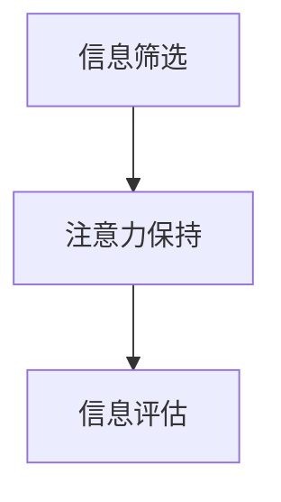

                 

关键词：注意力经济、在线广告、用户体验、受众吸引、算法优化、数学模型、代码实例、实际应用、未来展望

> 摘要：本文深入探讨了注意力经济在在线广告领域的重要性，探讨了如何在保证用户体验的基础上，通过优化算法和数学模型，有效地吸引受众，提高广告效果。文章从背景介绍、核心概念与联系、核心算法原理、数学模型和公式、项目实践、实际应用场景、工具和资源推荐以及总结与展望等方面，全面阐述了注意力经济与在线广告的相关知识。

## 1. 背景介绍

### 注意力经济概念

随着互联网的快速发展，人们的信息获取方式发生了巨大变化。在传统的广告模式中，广告商主要通过投放广告来获取潜在客户，但这种模式在信息过载的时代已显得力不从心。注意力经济（Attention Economy）是一种新的经济模式，它强调受众的注意力是有限的资源，广告商需要通过有效的方式吸引并保持受众的注意力，从而实现商业价值的最大化。

### 在线广告现状

在线广告已经成为互联网经济的重要支柱，随着移动互联网的普及，广告形式也越来越多样化。然而，如何在海量信息中脱颖而出，吸引受众的注意力，成为广告商面临的一大挑战。

### 用户需求与体验

在注意力经济时代，用户体验变得尤为重要。用户对广告的容忍度越来越低，广告如果不能提供价值或者过度干扰用户，很容易被忽视甚至引发反感。因此，如何在不牺牲用户体验的前提下，实现广告效果的最大化，成为广告商和平台共同关注的焦点。

## 2. 核心概念与联系

### 注意力分配模型

为了更好地理解注意力经济，我们可以引入注意力分配模型。该模型描述了用户在信息过载环境中的注意力分配方式，包括以下三个方面：

1. **信息筛选**：用户在接收到大量信息时，会根据自身的需求和兴趣进行筛选，选择关注哪些信息。
2. **注意力保持**：用户在关注某个信息时，需要保持持续的关注，否则容易分心。
3. **信息评估**：用户在接收信息后，会对其价值进行评估，决定是否继续关注。

### Mermaid 流程图

### 注意力分配模型的应用

注意力分配模型可以应用于在线广告的优化，通过分析用户的注意力分配情况，广告商可以更有效地投放广告，提高广告效果。

## 3. 核心算法原理 & 具体操作步骤

### 3.1 算法原理概述

在线广告算法主要分为两类：基于内容的广告投放和基于行为的广告投放。本文主要探讨基于内容的广告投放算法。

基于内容的广告投放算法主要通过分析广告内容和用户兴趣，实现广告与用户的精准匹配。其核心思想是：通过构建用户兴趣模型和广告内容模型，计算广告与用户的相似度，并根据相似度对广告进行排序和推荐。

### 3.2 算法步骤详解

1. **用户兴趣模型构建**：通过用户的历史行为数据，如浏览记录、搜索历史、购买行为等，利用机器学习算法，构建用户兴趣模型。
2. **广告内容模型构建**：通过广告的文本、图片、视频等多媒体内容，提取特征，构建广告内容模型。
3. **相似度计算**：计算用户兴趣模型与广告内容模型的相似度，可以使用余弦相似度、欧氏距离等算法。
4. **广告排序**：根据相似度对广告进行排序，推荐相似度最高的广告给用户。
5. **广告投放**：将排序后的广告推送给用户。

### 3.3 算法优缺点

#### 优点

1. **提高广告效果**：通过精准匹配，提高广告的点击率和转化率。
2. **降低广告投放成本**：减少了无效广告的投放，降低了广告成本。

#### 缺点

1. **用户隐私保护**：在构建用户兴趣模型的过程中，可能涉及到用户隐私问题。
2. **数据质量**：用户行为数据的质量对算法效果有很大影响。

### 3.4 算法应用领域

基于内容的广告投放算法可以应用于电商平台、社交媒体、搜索引擎等多个领域，实现个性化广告推荐。

## 4. 数学模型和公式 & 详细讲解 & 举例说明

### 4.1 数学模型构建

为了实现广告与用户的精准匹配，我们可以引入协同过滤算法（Collaborative Filtering），构建用户兴趣模型和广告内容模型。

#### 用户兴趣模型

用户兴趣模型可以用矩阵表示，其中行表示用户，列表示兴趣点，矩阵元素表示用户对兴趣点的兴趣程度。

$$
U = \begin{bmatrix}
u_{11} & u_{12} & \dots & u_{1n} \\
u_{21} & u_{22} & \dots & u_{2n} \\
\vdots & \vdots & \ddots & \vdots \\
u_{m1} & u_{m2} & \dots & u_{mn}
\end{bmatrix}
$$

#### 广告内容模型

广告内容模型也可以用矩阵表示，其中行表示广告，列表示广告特征，矩阵元素表示广告特征的权重。

$$
C = \begin{bmatrix}
c_{11} & c_{12} & \dots & c_{1n} \\
c_{21} & c_{22} & \dots & c_{2n} \\
\vdots & \vdots & \ddots & \vdots \\
c_{p1} & c_{p2} & \dots & c_{pn}
\end{bmatrix}
$$

### 4.2 公式推导过程

为了计算用户兴趣模型与广告内容模型的相似度，我们可以使用余弦相似度公式。

$$
\cos\theta = \frac{U \cdot C}{\|U\| \cdot \|C\|}
$$

其中，$U \cdot C$表示用户兴趣模型与广告内容模型的点积，$\|U\|$和$\|C\|$表示用户兴趣模型和广告内容模型的欧氏范数。

### 4.3 案例分析与讲解

假设我们有以下用户兴趣矩阵和广告内容矩阵：

$$
U = \begin{bmatrix}
0.5 & 0.3 & 0.2 \\
0.4 & 0.5 & 0.1 \\
0.1 & 0.6 & 0.3
\end{bmatrix}
\quad
C = \begin{bmatrix}
0.3 & 0.2 & 0.1 \\
0.2 & 0.3 & 0.2 \\
0.1 & 0.1 & 0.2
\end{bmatrix}
$$

首先计算用户兴趣矩阵和广告内容矩阵的点积：

$$
U \cdot C = \begin{bmatrix}
0.5 \times 0.3 + 0.3 \times 0.2 + 0.2 \times 0.1 \\
0.4 \times 0.2 + 0.5 \times 0.3 + 0.1 \times 0.2 \\
0.1 \times 0.1 + 0.6 \times 0.1 + 0.3 \times 0.2
\end{bmatrix} = \begin{bmatrix}
0.165 \\
0.205 \\
0.115
\end{bmatrix}
$$

然后计算用户兴趣矩阵和广告内容矩阵的欧氏范数：

$$
\|U\| = \sqrt{0.5^2 + 0.3^2 + 0.2^2} = 0.524
\quad
\C| = \sqrt{0.3^2 + 0.2^2 + 0.1^2} = 0.385
$$

最后，计算余弦相似度：

$$
\cos\theta = \frac{U \cdot C}{\|U\| \cdot \|C\|} = \frac{0.165}{0.524 \times 0.385} \approx 0.544
$$

这意味着用户兴趣矩阵与广告内容矩阵的相似度为 0.544，可以推

