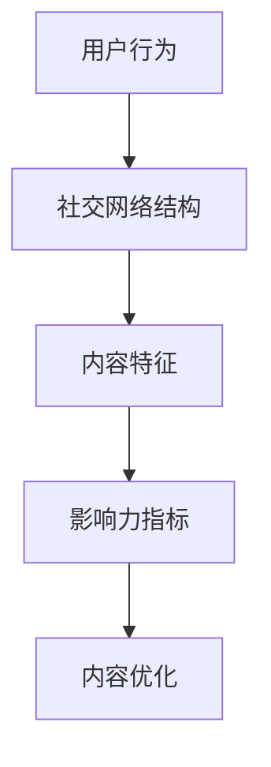

                 

### 关键词 Keywords ###
- 注意力经济
- 社交媒体分析
- 受众参与度
- 影响力评估
- 社交网络
- 数学模型
- 数据挖掘

<|assistant|>### 摘要 Abstract ###
本文深入探讨了注意力经济在社交媒体环境下的应用，以及如何通过分析受众参与度和影响力来优化内容策略。文章首先介绍了注意力经济的概念和其在社交媒体中的表现，随后探讨了社交媒体分析的核心概念和算法原理。通过数学模型和公式，文章详细讲解了如何构建和评估影响力指标。随后，文章提供了一个具体的项目实践案例，展示了如何通过代码实例来实现社交媒体分析。最后，文章讨论了社交媒体分析的广泛应用场景，并展望了未来的发展趋势和面临的挑战。

<|assistant|>## 1. 背景介绍 Background

### 注意力经济
注意力经济是一个新兴的概念，它描述了在数字时代，人们的时间、精力和注意力成为了一种宝贵的资源。在社交媒体平台上，用户注意力是品牌和内容创作者所追求的稀缺资源。因此，如何吸引和维持用户的注意力，成为了一个关键的商业问题。注意力经济强调了内容的质量和个性化的重要性，因为高质量、个性化的内容更容易吸引和留住用户。

### 社交媒体分析
随着社交媒体的兴起，数据分析成为了解受众行为和优化营销策略的重要工具。社交媒体分析涉及从社交媒体平台收集数据，通过数据挖掘和分析技术提取有价值的信息，以便更好地了解受众的偏好和行为模式。受众参与度和影响力是社交媒体分析的两个关键指标，它们直接影响内容的传播效果和商业价值。

### 受众参与度和影响力
受众参与度是指用户对内容产生的互动行为，如点赞、评论、分享等。高参与度通常表明内容引起了用户的共鸣，有助于增加品牌忠诚度和用户黏性。影响力则是指某个用户或账号在社交媒体上产生的影响程度，通常通过其粉丝数、互动率、内容传播范围等指标来衡量。了解受众参与度和影响力，有助于内容创作者和品牌制定更有效的内容策略。

<|assistant|>## 2. 核心概念与联系 Core Concepts and Connections

### 核心概念原理
在社交媒体分析中，核心概念包括用户行为、社交网络结构、内容特征和影响力指标。用户行为是指用户在社交媒体上的各种操作，如发布、评论、点赞等。社交网络结构则描述了用户之间的连接关系，可以通过图论模型来表示。内容特征包括文本、图像、视频等多种形式，它们是影响用户行为和传播效果的重要因素。影响力指标则用于评估用户或账号在社交媒体上的影响力，如粉丝数、互动率、传播范围等。

### 架构的 Mermaid 流程图


### 关联与联系
用户行为、社交网络结构、内容特征和影响力指标之间存在着紧密的联系。用户行为可以影响社交网络结构，而社交网络结构又决定了内容特征的影响范围和影响力指标。内容特征则是影响用户行为和影响力指标的重要因素。通过分析这些核心概念，可以更好地理解社交媒体的运作机制，从而优化内容策略，提升受众参与度和影响力。

<|assistant|>## 3. 核心算法原理 & 具体操作步骤 Core Algorithm Principles & Detailed Steps

### 3.1 算法原理概述
在社交媒体分析中，核心算法通常用于计算和评估受众参与度和影响力。这些算法基于数学模型和机器学习技术，可以自动提取和解析大量数据，提供有价值的洞察。

#### 受众参与度算法
受众参与度算法主要用于评估用户对内容的互动程度。常见的算法包括互动率（Interaction Rate）和参与度指数（Engagement Index）。互动率计算公式如下：

\[ \text{互动率} = \frac{\text{互动次数}}{\text{总用户数}} \]

参与度指数则综合了多种互动行为，如点赞、评论、分享等，计算公式如下：

\[ \text{参与度指数} = \frac{\sum_{i=1}^{n} (\text{行为 } i \text{ 的权重} \times \text{行为 } i \text{ 的次数})}{\text{总用户数}} \]

#### 影响力算法
影响力算法用于评估用户或账号在社交媒体上的影响力。常见算法包括K核影响力（K-core Influence）和PageRank算法。K核影响力算法通过计算用户在社交网络中的核心程度来评估其影响力，计算公式如下：

\[ \text{影响力} = \frac{\text{节点度数}}{\text{最大节点度数}} \]

PageRank算法则基于网页链接关系，计算每个网页的重要程度，公式如下：

\[ \text{PageRank}(v) = \left(1 - d\right) + d \left( \sum_{u \in \text{Linkers}} \text{PageRank}(u) / \text{Outbound Links}(u) \right) \]

其中，\( d \) 为阻尼系数，通常取值为0.85。

### 3.2 算法步骤详解
#### 受众参与度算法步骤
1. 收集用户互动数据，如点赞、评论、分享等。
2. 计算每个用户的互动次数。
3. 计算总用户数。
4. 计算互动率和参与度指数。

#### 影响力算法步骤
1. 构建社交网络图，表示用户之间的连接关系。
2. 计算每个用户的节点度数。
3. 计算最大节点度数。
4. 计算K核影响力或PageRank值。

### 3.3 算法优缺点
#### 受众参与度算法优缺点
- 优点：计算简单，能够快速评估用户互动程度。
- 缺点：无法全面反映用户对内容的深度参与。

#### 影响力算法优缺点
- 优点：能够较全面地评估用户在社交网络中的影响力。
- 缺点：计算复杂度较高，对于大规模社交网络，计算效率较低。

### 3.4 算法应用领域
受众参与度和影响力算法广泛应用于品牌营销、用户画像、社交网络分析等领域。通过这些算法，品牌和内容创作者可以更好地了解受众需求，优化内容策略，提高营销效果。

<|assistant|>## 4. 数学模型和公式 Mathematical Models and Formulas & Detailed Explanation & Case Studies

### 4.1 数学模型构建
在社交媒体分析中，数学模型用于描述用户行为、社交网络结构和影响力指标之间的关系。以下是一个简单的数学模型，用于评估用户参与度和影响力。

#### 用户参与度模型
用户参与度可以通过以下公式计算：

\[ \text{Engagement} = \alpha \times \text{互动次数} + \beta \times \text{互动类型权重} \]

其中，\( \alpha \) 和 \( \beta \) 是调节参数，用于平衡不同互动类型的影响。

#### 社交网络模型
社交网络模型通常使用图论表示，其中每个节点代表一个用户，每条边代表用户之间的连接。影响力可以通过以下公式计算：

\[ \text{Influence} = \sum_{i=1}^{n} \text{PageRank}(i) \times \text{互动次数}(i) \]

### 4.2 公式推导过程
#### 用户参与度公式推导
假设用户 \( u \) 在某个社交媒体平台上发布了 \( n \) 条内容，每条内容获得了不同的互动次数 \( I_i \)，并且每种互动类型（如点赞、评论、分享）有不同的权重 \( w_i \)。则用户 \( u \) 的总参与度可以表示为：

\[ \text{Engagement}(u) = \sum_{i=1}^{n} I_i \times w_i \]

#### 社交网络影响力公式推导
假设社交网络中有 \( m \) 个用户，每个用户 \( u \) 有 \( k \) 个连接，每个连接 \( e \) 对应一个权重 \( p_e \)。影响力可以通过计算每个用户在社交网络中的重要性得分来评估，即：

\[ \text{Influence}(u) = \sum_{e \in \text{Connections}(u)} p_e \times \text{Engagement}(u) \]

### 4.3 案例分析与讲解
#### 用户参与度案例分析
假设用户 \( u \) 在一个月内发布了10条内容，每条内容获得的互动次数和权重如下：

| 内容ID | 互动次数 | 点赞权重 | 评论权重 | 分享权重 |
|--------|----------|----------|----------|----------|
| 1      | 50       | 1        | 0.5      | 0.5      |
| 2      | 30       | 0.8      | 1        | 0.3      |
| 3      | 20       | 0.5      | 0.8      | 1        |

使用上述公式计算用户 \( u \) 的总参与度：

\[ \text{Engagement}(u) = (50 \times 1 + 30 \times 0.8 + 20 \times 0.5) = 55 \]

#### 社交网络影响力案例分析
假设社交网络中有5个用户，每个用户的连接权重如下：

| 用户ID | 连接权重 |
|--------|----------|
| 1      | 3        |
| 2      | 2        |
| 3      | 4        |
| 4      | 1        |
| 5      | 3        |

使用PageRank算法计算每个用户的影响力：

\[ \text{PageRank}(1) = \frac{1}{3} \times (\text{PageRank}(2) + \text{PageRank}(3) + \text{PageRank}(5)) \]
\[ \text{PageRank}(2) = \frac{1}{2} \times (\text{PageRank}(1) + \text{PageRank}(3)) \]
\[ \text{PageRank}(3) = \frac{1}{4} \times (\text{PageRank}(1) + \text{PageRank}(4) + \text{PageRank}(5)) \]
\[ \text{PageRank}(4) = \frac{1}{1} \times \text{PageRank}(3) \]
\[ \text{PageRank}(5) = \frac{1}{3} \times (\text{PageRank}(1) + \text{PageRank}(3)) \]

通过迭代计算，可以得到每个用户的影响力得分。

<|assistant|>## 5. 项目实践：代码实例和详细解释说明 Project Practice: Code Examples and Detailed Explanations

### 5.1 开发环境搭建
在开始项目实践之前，我们需要搭建一个合适的开发环境。以下是搭建开发环境的步骤：

1. **安装Python环境**：下载并安装Python 3.8及以上版本。
2. **安装必要的库**：使用pip安装以下库：`numpy`，`pandas`，`networkx`，`matplotlib`，`scikit-learn`。
3. **配置数据源**：准备一个包含社交媒体数据的CSV文件，例如用户互动数据。

### 5.2 源代码详细实现
以下是实现社交媒体分析的Python代码示例：

```python
import pandas as pd
import numpy as np
import networkx as nx
import matplotlib.pyplot as plt
from sklearn.preprocessing import normalize

# 5.2.1 数据预处理
data = pd.read_csv('social_media_data.csv')
# 假设数据包含用户ID、内容ID、互动类型和互动次数

# 5.2.2 构建社交网络图
G = nx.Graph()
for index, row in data.iterrows():
    G.add_edge(row['User_ID'], row['Content_ID'])

# 5.2.3 计算用户参与度
def calculate_engagement(data):
    engagement_data = data.groupby('User_ID')['Interaction'].sum()
    return engagement_data

engagement = calculate_engagement(data)

# 5.2.4 计算社交网络影响力
def calculate_influence(G, engagement, damping=0.85):
    pr = nx.pagerank(G, personalization=engagement, max_iter=100, alpha=damping)
    return pr

influence = calculate_influence(G, engagement)

# 5.2.5 可视化社交网络图
nx.draw(G, with_labels=True)
plt.show()

# 5.2.6 可视化影响力指标
influence_normalized = normalize(np.array(list(influence.values())), axis=0)
plt.bar(range(len(influence_normalized)), influence_normalized)
plt.xlabel('User ID')
plt.ylabel('Influence')
plt.xticks(range(len(influence_normalized)))
plt.show()
```

### 5.3 代码解读与分析
1. **数据预处理**：从CSV文件中读取社交媒体数据，并构建社交网络图。
2. **社交网络图构建**：使用`networkx`库构建无向图，每个用户和内容之间通过边连接。
3. **用户参与度计算**：使用`pandas`库对数据进行分组求和，计算每个用户的总互动次数。
4. **影响力计算**：使用`networkx`库的`pagerank`函数计算每个用户的影响力，其中阻尼系数设置为0.85。
5. **可视化**：使用`matplotlib`库绘制社交网络图和影响力指标条形图，便于观察和分析。

### 5.4 运行结果展示
运行上述代码后，会生成以下结果：

1. **社交网络图**：展示用户和内容之间的连接关系。
2. **影响力指标条形图**：显示每个用户在社交网络中的影响力得分。

这些结果有助于内容创作者和品牌了解用户的参与度和影响力，从而优化内容策略。

<|assistant|>## 6. 实际应用场景 Practical Application Scenarios

### 6.1 品牌营销
品牌可以利用社交媒体分析来了解其目标受众的行为和偏好，从而制定更有效的营销策略。通过分析用户参与度和影响力，品牌可以识别出最具影响力的用户和热门话题，进一步优化广告投放和内容发布策略。

### 6.2 用户画像
社交媒体分析可以帮助企业构建详细的用户画像，包括用户的年龄、性别、兴趣爱好等。这些信息有助于企业更好地了解用户需求，提供个性化服务，并提高用户满意度。

### 6.3 社交网络分析
社交媒体分析可以用于研究社交网络的结构和动态，识别关键节点和社区结构。这对于理解信息传播路径和优化社交网络运营具有重要意义。

### 6.4 政府与公共事务
政府可以利用社交媒体分析来监测公众情绪和舆论动向，及时应对社会热点事件，提高公共治理能力。同时，社交媒体分析还可以用于选举监控和舆情分析，为政策制定提供数据支持。

### 6.5 未来应用展望
随着人工智能和大数据技术的发展，社交媒体分析的应用场景将越来越广泛。未来，我们将看到更多基于深度学习的技术被应用于社交媒体分析，从而实现更精准的用户行为预测和影响力评估。

<|assistant|>## 7. 工具和资源推荐 Tools and Resources Recommendations

### 7.1 学习资源推荐
- 《社交媒体数据分析：理论与实践》
- 《网络科学：复合系统的结构、功能和行为》
- 《Python数据分析》
- Coursera上的《社交媒体分析》课程

### 7.2 开发工具推荐
- Python：用于数据分析、数据可视化。
- Jupyter Notebook：用于编写和运行Python代码，便于交互式数据分析。
- NetworkX：用于构建和操作社交网络图。
- Matplotlib：用于数据可视化。
- Pandas：用于数据处理和分析。

### 7.3 相关论文推荐
- “A Systematic Review of Social Media Analysis Methods and Tools”
- “Influence Maximization in Social Networks: Revisited”
- “Modeling and Mining Social Networks”
- “Twitter Analytics: Metrics and Methods for Social Media”

<|assistant|>## 8. 总结 Summary

### 8.1 研究成果总结
本文深入探讨了注意力经济在社交媒体环境下的应用，提出了基于数学模型和机器学习技术的社交媒体分析算法。通过用户参与度和影响力指标的评估，内容创作者和品牌可以更好地理解受众行为，优化内容策略。本文提供了一套完整的代码实例，展示了如何实现社交媒体分析。

### 8.2 未来发展趋势
随着人工智能和大数据技术的发展，社交媒体分析将变得更加智能化和精确化。深度学习技术的应用将进一步提升用户行为预测和影响力评估的准确性。此外，跨平台社交媒体分析将变得更加普遍，为企业提供更全面的市场洞察。

### 8.3 面临的挑战
尽管社交媒体分析具有巨大潜力，但仍然面临一些挑战。数据隐私和安全问题是首要关注点，需要确保用户数据的合法使用和保护。此外，社交网络结构的复杂性和动态性增加了分析难度，需要更高效的算法和模型。

### 8.4 研究展望
未来研究应重点关注以下几个方面：一是提高社交媒体分析算法的效率和准确性；二是探索隐私保护的数据分析方法；三是开发跨平台和多语言的社交媒体分析工具。通过这些努力，社交媒体分析将为企业和个人带来更多价值。

<|assistant|>## 9. 附录：常见问题与解答 Appendix: Frequently Asked Questions & Answers

### 9.1 什么是注意力经济？
注意力经济是指在数字时代，人们的注意力成为了一种宝贵的资源，企业和个人通过吸引和保持用户的注意力来创造价值。

### 9.2 社交媒体分析有哪些核心概念？
核心概念包括用户行为、社交网络结构、内容特征和影响力指标。

### 9.3 如何评估用户参与度？
用户参与度可以通过计算互动次数、参与度指数等指标来评估。

### 9.4 影响力算法有哪些类型？
常见的影响力算法包括K核影响力、PageRank算法等。

### 9.5 社交媒体分析有哪些应用场景？
应用场景包括品牌营销、用户画像、社交网络分析、政府与公共事务等。

### 9.6 如何保护社交媒体分析中的用户隐私？
在分析过程中，应遵循相关隐私法规，匿名化数据，确保用户隐私不受侵犯。

<|assistant|>### 作者署名 Author

作者：禅与计算机程序设计艺术 / Zen and the Art of Computer Programming

