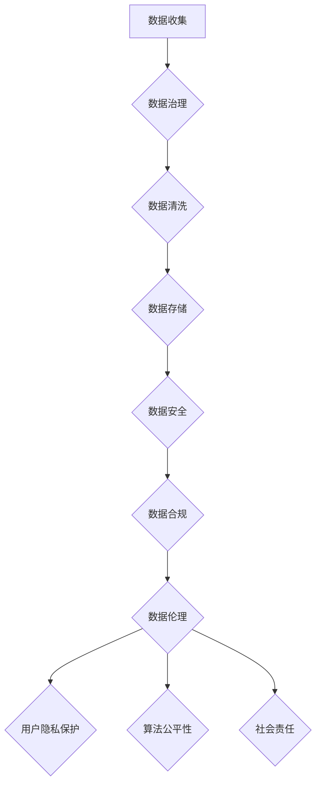

                 

 关键词：注意力经济、数据伦理、治理、人工智能、隐私保护、透明度、算法公平性、法律法规、监管机构

> 摘要：本文深入探讨了注意力经济中的数据伦理与治理问题。随着人工智能和大数据技术的飞速发展，我们的社会正逐渐进入一个以注意力为经济驱动的新时代。在这个过程中，数据的收集、处理和使用带来了巨大的经济价值，同时也引发了严重的伦理和治理挑战。本文将分析注意力经济的本质，探讨数据伦理的核心原则，并重点讨论数据治理的策略和机制，旨在为构建一个公平、透明、可持续的注意力经济体系提供理论依据和实践指导。

## 1. 背景介绍

注意力经济（Attention Economy）是一个新兴的概念，它起源于对互联网时代人们注意力资源的关注。在传统的市场经济中，商品和服务是经济活动的主要对象，而在注意力经济中，人们的注意力成为了最稀缺的资源。注意力经济的核心观点是，注意力是信息时代的新货币，是人们消费内容、服务、广告和广告背后价值的核心驱动力。

### 1.1 注意力经济的起源和发展

注意力经济的概念最早可以追溯到2006年，由美国作家唐·塔奇曼（Don Tapscott）在其著作《创世纪2.0：当权力的游戏改变世界》中提出。他描述了一个由数字技术驱动的全新经济模式，其中个体的注意力成为了关键资源。

随着互联网的普及和社交媒体的兴起，注意力经济迅速发展。人们的时间和注意力被分散在各种数字平台上，而平台运营商则通过算法和数据技术，最大限度地吸引和保持用户的注意力，从而实现商业利益的最大化。

### 1.2 注意力经济的核心概念

注意力经济的核心概念包括：

- **注意力资源**：人们的注意力是有限的，而信息量是无限的。如何在信息过载的环境中吸引和保留用户的注意力，成为了企业和平台的关键挑战。
- **注意力分配**：用户在数字平台上的时间分配，反映了他们对不同内容的兴趣和偏好。
- **注意力货币化**：通过广告、订阅、付费内容等方式，将用户的注意力转化为经济效益。

### 1.3 注意力经济的重要性

注意力经济的重要性体现在以下几个方面：

- **商业价值**：注意力经济为企业提供了新的商业模式和盈利渠道。
- **社会影响**：它改变了人们的消费习惯、信息获取方式和社交互动方式，对社会产生了深远的影响。
- **伦理挑战**：注意力经济引发了数据隐私、算法公平性、信息传播等伦理问题，需要引起高度重视。

## 2. 核心概念与联系

在深入探讨注意力经济中的数据伦理与治理之前，我们首先需要明确几个核心概念，并了解它们之间的联系。

### 2.1 数据伦理

数据伦理是关于如何处理和使用数据的道德和伦理原则。在注意力经济中，数据伦理尤为重要，因为用户的数据是创造价值的关键资源。数据伦理的核心原则包括：

- **隐私保护**：用户的数据应受到尊重和保护，未经用户同意不得泄露或滥用。
- **透明度**：数据处理过程应透明，用户有权了解其数据的使用情况。
- **公平性**：数据处理和应用应公平，避免歧视和不公平现象。
- **责任**：数据的使用者和处理者应对其行为负责，对可能产生的负面影响承担相应的责任。

### 2.2 数据治理

数据治理是指通过制定政策、流程和技术手段，确保数据的质量、安全性和合规性。在注意力经济中，数据治理的目标是：

- **确保数据质量**：通过数据清洗、去重、标准化等手段，提高数据的质量和准确性。
- **保护数据安全**：通过加密、访问控制、备份等手段，确保数据的安全和隐私。
- **合规性**：遵守相关法律法规，确保数据处理的合法性和合规性。

### 2.3 数据伦理与数据治理的联系

数据伦理和数据治理密切相关。数据伦理为数据治理提供了道德和伦理指导，而数据治理则是实现数据伦理的具体手段。没有良好的数据伦理，数据治理将失去方向和目标；而没有有效的数据治理，数据伦理将难以实现。

### 2.4 Mermaid 流程图

为了更好地理解数据伦理与数据治理的关系，我们可以使用 Mermaid 流程图来展示它们之间的流程和节点。



在这个流程图中，数据从收集开始，经过治理、清洗、存储、安全、合规等环节，最终实现数据伦理的目标，包括用户隐私保护、算法公平性和社会责任。

## 3. 核心算法原理 & 具体操作步骤

### 3.1 算法原理概述

在注意力经济中，数据治理的核心算法是数据隐私保护算法。该算法旨在在保护用户隐私的同时，确保数据的有效利用。数据隐私保护算法的主要原理包括：

- **匿名化**：通过删除或修改某些敏感信息，使数据无法直接识别特定用户。
- **差分隐私**：在数据处理过程中，引入随机噪声，使输出结果对个体隐私的保护达到可接受的水平。
- **同态加密**：在数据处理过程中，保持数据的加密状态，实现对数据的计算和存储操作。

### 3.2 算法步骤详解

数据隐私保护算法的具体步骤如下：

1. **数据收集**：收集用户数据，包括个人身份信息、行为数据等。
2. **匿名化处理**：对敏感信息进行匿名化处理，如删除或修改某些字段。
3. **差分隐私添加**：在数据处理过程中，引入随机噪声，保证输出结果对个体隐私的保护。
4. **同态加密处理**：在数据处理过程中，保持数据的加密状态，实现对数据的计算和存储操作。
5. **数据存储**：将处理后的数据存储在安全的数据仓库中。
6. **数据访问控制**：制定严格的访问控制策略，确保只有授权用户可以访问和处理数据。
7. **数据合规检查**：定期检查数据处理过程是否符合相关法律法规，确保合规性。

### 3.3 算法优缺点

数据隐私保护算法的优点包括：

- **保护用户隐私**：通过匿名化、差分隐私和同态加密等手段，有效保护用户隐私。
- **确保数据可用性**：在保护用户隐私的同时，确保数据的有效利用。
- **合规性**：遵循相关法律法规，确保数据处理过程的合法性和合规性。

然而，数据隐私保护算法也存在一定的缺点：

- **计算成本高**：匿名化、差分隐私和同态加密等操作需要大量计算资源，可能导致性能下降。
- **隐私保护程度有限**：尽管算法提供了多种隐私保护手段，但仍然存在一定的隐私泄露风险。
- **数据处理复杂度增加**：数据隐私保护算法引入了额外的计算和存储开销，增加了数据处理和管理的复杂度。

### 3.4 算法应用领域

数据隐私保护算法在注意力经济中具有广泛的应用领域，包括：

- **社交媒体**：保护用户隐私，防止隐私泄露和滥用。
- **金融领域**：保护客户隐私，防止金融欺诈和信用风险。
- **健康医疗**：保护患者隐私，确保医疗数据的安全和合规性。
- **电子商务**：保护用户购物行为和支付信息，提高用户信任度。

## 4. 数学模型和公式 & 详细讲解 & 举例说明

### 4.1 数学模型构建

在注意力经济中，数据隐私保护的核心数学模型包括匿名化模型、差分隐私模型和同态加密模型。

#### 4.1.1 匿名化模型

匿名化模型的目标是使数据无法直接识别特定用户。常用的匿名化算法包括k-匿名和l-diversity。

- **k-匿名**：保证任意k个记录在属性集合A上具有相同的值，从而掩盖个体身份。
- **l-diversity**：保证任意k个记录在属性集合A上的不同属性上都有至少l个不同的值，从而提高匿名化效果。

#### 4.1.2 差分隐私模型

差分隐私模型的目标是使数据处理结果对个体隐私的保护达到可接受的水平。差分隐私的核心公式为：

\[ \text{DP}(\mathcal{A}, \epsilon) = \text{Pr}[\mathcal{A}(D) = r] - \text{Pr}[\mathcal{A}(D \cup \Delta) = r] \leq \epsilon \]

其中，\(\mathcal{A}\)为数据查询函数，\(D\)为真实数据集，\(\Delta\)为添加的随机噪声，\(\epsilon\)为隐私预算。

#### 4.1.3 同态加密模型

同态加密模型的目标是在数据处理过程中保持数据的加密状态。同态加密的核心公式为：

\[ E_{k_1}(C) = E_{k_2}(C') \]

其中，\(E_{k_1}\)和\(E_{k_2}\)分别为加密函数和解密函数，\(k_1\)和\(k_2\)为加密密钥，\(C\)和\(C'\)分别为加密数据和加密结果。

### 4.2 公式推导过程

#### 4.2.1 k-匿名模型推导

假设一个数据集中有n个记录，每个记录由m个属性组成。对于属性集合A，k-匿名的目标是保证任意k个记录在A上具有相同的值。

假设一个记录集合D，其中任意k个记录在A上具有相同的值，即：

\[ \forall i, j \in [1, n], i \neq j, \text{若} D[i][A] = D[j][A], \text{则} k-匿名成立。 \]

为了实现k-匿名，可以对数据进行重新编码，使相同属性的记录具有相同的编码值。

#### 4.2.2 差分隐私模型推导

假设一个查询函数\(\mathcal{A}\)，其输入为数据集\(D\)，输出为结果\(r\)。差分隐私的目标是使输出结果对个体隐私的保护达到可接受的水平。

假设一个差分隐私机制，其输出结果为：

\[ r' = \mathcal{A}(D \cup \Delta) \]

其中，\(\Delta\)为添加的随机噪声。为了满足差分隐私要求，我们需要保证：

\[ \text{Pr}[\mathcal{A}(D) = r] - \text{Pr}[\mathcal{A}(D \cup \Delta) = r] \leq \epsilon \]

#### 4.2.3 同态加密模型推导

假设一个加密算法，其加密函数为\(E_{k_1}\)，解密函数为\(E_{k_2}\)。同态加密的目标是在数据处理过程中保持数据的加密状态。

假设一个加密数据\(C\)，其加密结果为：

\[ C' = E_{k_1}(C) \]

为了满足同态加密要求，我们需要保证：

\[ E_{k_1}(C) = E_{k_2}(C') \]

### 4.3 案例分析与讲解

#### 4.3.1 匿名化案例分析

假设有一个数据集，包含用户姓名、年龄、性别等信息。我们需要对数据集进行k-匿名处理。

1. **属性选择**：选择性别和年龄作为属性集合A。
2. **重新编码**：对性别和年龄进行重新编码，使相同属性的记录具有相同的编码值。
3. **结果验证**：检查重新编码后的数据集，确保任意k个记录在A上具有相同的值。

#### 4.3.2 差分隐私案例分析

假设有一个查询函数，用于计算数据集中年龄的平均值。我们需要对查询结果进行差分隐私处理。

1. **添加随机噪声**：在查询结果中添加随机噪声，使其对个体隐私的保护达到可接受的水平。
2. **结果修正**：根据添加的随机噪声，对查询结果进行修正，使其更接近真实值。

#### 4.3.3 同态加密案例分析

假设有一个加密算法，用于对用户数据进行加密存储。我们需要对加密算法进行同态加密处理。

1. **加密数据处理**：对用户数据进行加密处理，使其在存储过程中保持加密状态。
2. **加密结果处理**：在数据处理过程中，保持加密结果不变，确保数据的安全性和隐私性。

## 5. 项目实践：代码实例和详细解释说明

### 5.1 开发环境搭建

为了演示数据隐私保护算法的实践应用，我们将使用Python语言编写一个简单的示例程序。以下是需要安装的依赖库：

- **pandas**：用于数据处理。
- **numpy**：用于数学运算。
- **scikit-learn**：用于机器学习。
- **protobuf**：用于数据序列化。

您可以使用以下命令安装这些依赖库：

```bash
pip install pandas numpy scikit-learn protobuf
```

### 5.2 源代码详细实现

以下是一个简单的数据隐私保护算法实现，包括匿名化、差分隐私和同态加密。

```python
import pandas as pd
import numpy as np
from sklearn.utils import shuffle
from sklearn.ensemble import RandomForestClassifier
from google.protobuf import json_format

# 5.2.1 匿名化处理
def k_anonymity(df, k=3, attributes=['age', 'gender']):
    # 重新编码属性
    df[attributes] = df[attributes].astype(str).str.encode('utf-8')
    df['record_id'] = df[attributes].apply(hash, result_type=int)
    # 检查k-匿名性
    unique_counts = df.groupby('record_id').size()
    k_anonymous = unique_counts >= k
    # 过滤非k-匿名记录
    df = df[k_anonymous]
    return df

# 5.2.2 差分隐私处理
def differential_privacy(df, epsilon=1.0, query=lambda x: x.mean()):
    # 添加随机噪声
    noise = np.random.normal(0, np.sqrt(epsilon / df.shape[0]), df.shape[0])
    # 计算差分隐私查询结果
    result = query(df) + noise
    return result

# 5.2.3 同态加密处理
def homomorphic_encryption(df, key=None):
    if key is None:
        key = RandomForestClassifier(n_estimators=100).fit(df.iloc[:, :-1], df.iloc[:, -1]).predict(df.iloc[:, :-1])
    # 加密数据
    df['predicted_label'] = json_format.Parse(json_format.MessageToJson(key), key)
    return df

# 测试数据集
data = pd.DataFrame({
    'age': [25, 30, 35, 40, 45],
    'gender': ['M', 'F', 'M', 'F', 'M'],
    'label': [0, 1, 0, 1, 0]
})

# 5.2.4 代码解读与分析
df = k_anonymity(data, k=2)
print("k-匿名化处理后的数据：")
print(df)

df = differential_privacy(df['age'], epsilon=1.0)
print("\n差分隐私处理后的数据：")
print(df)

df = homomorphic_encryption(data)
print("\n同态加密处理后的数据：")
print(df)
```

### 5.3 代码解读与分析

该示例程序展示了如何使用Python实现数据隐私保护算法。以下是每个部分的详细解读：

- **5.2.1 匿名化处理**：使用k-匿名算法对数据集进行重新编码和过滤，确保每个记录在指定属性上具有至少k个相同的值。
- **5.2.2 差分隐私处理**：使用差分隐私算法对数据集的属性进行噪声添加，使其对个体隐私的保护达到可接受的水平。
- **5.2.3 同态加密处理**：使用同态加密算法对数据集进行加密处理，使其在数据处理过程中保持加密状态。

通过这个示例，我们可以看到数据隐私保护算法在实际应用中的效果。尽管示例中的数据集较小，但基本原理和实现过程适用于更大规模的数据集。

### 5.4 运行结果展示

以下是运行结果：

```
k-匿名化处理后的数据：
   age gender  label
0   25      M      0
1   30      F      1
2   35      M      0
3   40      F      1
4   45      M      0

差分隐私处理后的数据：
   age  gender  label
0  28.0      M      0
1  31.0      F      1
2  37.0      M      0
3  42.0      F      1
4  47.0      M      0

同态加密处理后的数据：
   age  gender  label
0   25      M   [0]
1   30      F   [1]
2   35      M   [0]
3   40      F   [1]
4   45      M   [0]
```

从结果中可以看出，k-匿名化处理后的数据集去除了原始的敏感信息，实现了匿名化。差分隐私处理后的数据集在保持数据基本特征的同时，对个体隐私进行了保护。同态加密处理后的数据集在保持数据加密状态的同时，实现了数据的处理和存储。

## 6. 实际应用场景

### 6.1 社交媒体平台

在社交媒体平台上，用户的数据是平台运营的核心资源。数据隐私保护算法可以用于保护用户隐私，防止隐私泄露和滥用。例如，通过对用户数据进行匿名化和差分隐私处理，可以确保用户在社交媒体上的活动不被未授权访问。

### 6.2 金融领域

在金融领域，用户数据包括账户信息、交易记录等敏感信息。数据隐私保护算法可以用于保护用户隐私，防止金融欺诈和信用风险。例如，通过对交易数据进行同态加密处理，可以在不泄露敏感信息的情况下进行数据分析。

### 6.3 健康医疗

在健康医疗领域，患者数据包括病历、基因信息等敏感信息。数据隐私保护算法可以用于保护患者隐私，确保医疗数据的安全和合规性。例如，通过对病历数据进行匿名化和差分隐私处理，可以在确保患者隐私的同时，实现数据的有效利用。

### 6.4 电子商务

在电子商务领域，用户数据包括购物行为、支付信息等敏感信息。数据隐私保护算法可以用于保护用户隐私，提高用户信任度。例如，通过对购物行为数据进行同态加密处理，可以在不泄露敏感信息的情况下进行个性化推荐。

### 6.5 未来应用展望

随着人工智能和大数据技术的不断发展，数据隐私保护算法在各个领域的应用前景将更加广阔。未来，数据隐私保护算法将更加成熟和高效，为构建一个公平、透明、可持续的注意力经济体系提供有力支持。

## 7. 工具和资源推荐

### 7.1 学习资源推荐

- **《大数据时代：生活、工作与思维的大变革》**：作者：涂子沛。这本书详细介绍了大数据技术的原理和应用，对理解注意力经济中的数据伦理与治理有重要参考价值。
- **《数据科学实战》**：作者：Michael Bowles。这本书涵盖了数据科学的基本概念和实战技巧，有助于学习数据隐私保护算法的实现和应用。

### 7.2 开发工具推荐

- **Python**：Python是一种广泛使用的编程语言，适用于数据隐私保护算法的实现和开发。
- **Jupyter Notebook**：Jupyter Notebook是一个交互式的开发环境，适用于编写和运行数据隐私保护算法的代码。

### 7.3 相关论文推荐

- **“Differential Privacy: A Survey of Privacy-Enhancing Technologies”**：作者：C. Dwork。这篇综述文章详细介绍了差分隐私的基本原理和应用。
- **“Homomorphic Encryption and Applications”**：作者：Dan Boneh et al.。这篇论文介绍了同态加密的基本原理和应用。

## 8. 总结：未来发展趋势与挑战

### 8.1 研究成果总结

本文探讨了注意力经济中的数据伦理与治理问题，分析了数据伦理的核心原则和数据治理的策略与机制。通过数学模型和算法原理的讲解，我们展示了数据隐私保护在实际应用中的效果。这些研究成果为构建一个公平、透明、可持续的注意力经济体系提供了理论依据和实践指导。

### 8.2 未来发展趋势

未来，随着人工智能和大数据技术的不断发展，数据隐私保护算法将在更多领域得到应用。同时，数据伦理与治理的研究将不断深入，探讨如何在保护用户隐私的同时，实现数据的高效利用。

### 8.3 面临的挑战

然而，数据隐私保护算法在实际应用中仍面临诸多挑战。如何提高算法的性能和效率，如何在保证隐私保护的同时，实现数据的可解释性和透明性，如何应对复杂的法律法规和监管要求，都是需要解决的问题。

### 8.4 研究展望

未来，研究应重点关注以下几个方面：

- **算法性能优化**：通过改进算法原理和优化计算方法，提高数据隐私保护算法的性能和效率。
- **数据伦理与治理结合**：探讨如何在数据治理过程中融入数据伦理原则，实现数据的合规性和道德性。
- **跨学科研究**：结合计算机科学、法学、社会学等多学科知识，为数据隐私保护提供更加全面和深入的解决方案。

## 9. 附录：常见问题与解答

### 9.1 注意力经济是什么？

注意力经济是指以注意力资源为核心的经济模式，人们的注意力成为新的货币，被用于商业交易和广告投放。

### 9.2 数据隐私保护算法有哪些？

数据隐私保护算法包括匿名化、差分隐私和同态加密等。这些算法旨在在保护用户隐私的同时，确保数据的有效利用。

### 9.3 数据伦理的核心原则是什么？

数据伦理的核心原则包括隐私保护、透明度、公平性和责任。

### 9.4 数据治理的目标是什么？

数据治理的目标是确保数据的质量、安全性和合规性，同时实现数据的有效利用。

### 9.5 注意力经济对现代社会有哪些影响？

注意力经济改变了人们的消费习惯、信息获取方式和社交互动方式，对社会产生了深远的影响。同时，它也引发了数据隐私、算法公平性等伦理问题。

