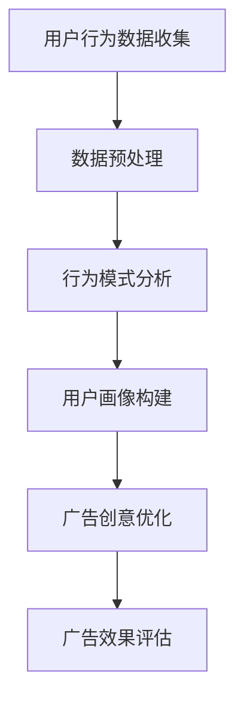
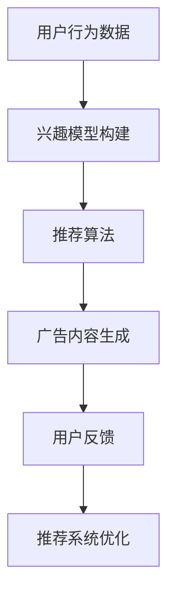
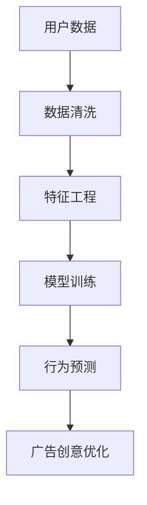

                 

关键词：注意力经济、广告创意、营销策略、用户体验、数据分析、人工智能、个性化推荐

## 摘要

随着互联网和数字技术的发展，注意力经济逐渐成为市场营销的关键概念。本文旨在探讨注意力经济对传统广告创意提出的新要求，包括用户行为分析、个性化推荐、人工智能技术等。通过对注意力经济的深入理解，本文将提出一系列策略，帮助广告创意从业者更好地吸引和维持用户的注意力，实现营销目标。

## 1. 背景介绍

### 1.1 注意力经济的概念

注意力经济是一种基于用户注意力资源的经济学理论，认为用户的注意力是一种稀缺资源，而吸引并保持用户的注意力成为商业竞争的核心。在注意力经济中，企业通过创造有趣、有价值的内容或服务来吸引用户的注意力，从而实现商业价值的提升。

### 1.2 传统广告创意的困境

随着广告市场的日益饱和和用户注意力的分散，传统广告创意面临巨大挑战。广告泛滥导致用户对广告的抵触情绪增加，广告效果逐渐减弱。传统广告创意难以满足用户对个性化、高质量内容的需求，导致用户注意力转移速度加快。

## 2. 核心概念与联系

### 2.1 用户行为分析

用户行为分析是注意力经济的重要组成部分。通过对用户行为数据的收集和分析，企业可以深入了解用户的需求和行为模式，从而创造更符合用户期望的广告创意。

#### Mermaid 流程图：



### 2.2 个性化推荐

个性化推荐是一种基于用户行为数据和内容的推荐系统，旨在为用户提供更符合其兴趣和需求的广告。个性化推荐不仅能够提高广告的点击率和转化率，还能够增强用户的满意度。

#### Mermaid 流程图：



### 2.3 人工智能技术

人工智能技术在注意力经济中发挥着重要作用。通过机器学习和自然语言处理等技术，企业可以自动化地分析和预测用户行为，实现广告创意的智能优化。

#### Mermaid 流程图：



## 3. 核心算法原理 & 具体操作步骤

### 3.1 算法原理概述

注意力经济的核心算法包括用户行为分析、个性化推荐和人工智能技术。这些算法通过数据挖掘和机器学习技术，实现用户行为的预测和广告创意的优化。

### 3.2 算法步骤详解

#### 3.2.1 用户行为分析

1. 数据收集：通过网站日志、社交媒体数据等渠道收集用户行为数据。
2. 数据预处理：对收集的数据进行清洗和格式化，去除无效数据。
3. 行为模式分析：利用统计方法和机器学习技术分析用户的行为模式。
4. 用户画像构建：基于用户行为数据构建用户画像，包括兴趣、行为习惯等。

#### 3.2.2 个性化推荐

1. 兴趣模型构建：通过分析用户历史行为和内容偏好，构建用户兴趣模型。
2. 推荐算法：利用协同过滤、内容推荐等算法生成个性化推荐列表。
3. 广告内容生成：根据用户兴趣模型生成符合用户需求的广告内容。
4. 用户反馈：收集用户对推荐广告的反馈，用于优化推荐系统。

#### 3.2.3 人工智能技术

1. 数据清洗：对用户行为数据和应用数据进行清洗，去除噪音和异常值。
2. 特征工程：提取用户行为和应用数据中的关键特征，用于模型训练。
3. 模型训练：利用机器学习算法训练行为预测模型。
4. 行为预测：使用训练好的模型预测用户未来的行为。
5. 广告创意优化：根据用户行为预测结果优化广告创意，提高广告效果。

### 3.3 算法优缺点

#### 3.3.1 用户行为分析

**优点：**
- 提高广告的针对性和效果。
- 帮助企业更好地了解用户需求。

**缺点：**
- 需要大量用户数据支持。
- 数据收集和处理的成本较高。

#### 3.3.2 个性化推荐

**优点：**
- 提高用户满意度和粘性。
- 提高广告的点击率和转化率。

**缺点：**
- 需要大量用户行为数据。
- 可能导致用户信息过载。

#### 3.3.3 人工智能技术

**优点：**
- 自动化预测和优化广告创意。
- 提高广告效果。

**缺点：**
- 需要高水平的技术团队支持。
- 可能存在隐私泄露风险。

### 3.4 算法应用领域

- 电商广告：通过用户行为分析和个性化推荐，提高电商广告的点击率和转化率。
- 娱乐广告：通过人工智能技术优化娱乐广告的创意，提高用户参与度。
- 教育广告：通过用户行为分析，为教育机构提供更有针对性的广告策略。

## 4. 数学模型和公式 & 详细讲解 & 举例说明

### 4.1 数学模型构建

注意力经济的核心数学模型包括用户行为预测模型和广告效果评估模型。

#### 4.1.1 用户行为预测模型

用户行为预测模型通常采用时间序列分析或机器学习技术构建。以下是一个简单的线性回归模型：

$$
y_t = \beta_0 + \beta_1 x_{t-1} + \epsilon_t
$$

其中，$y_t$ 表示用户在时间 $t$ 的行为，$x_{t-1}$ 表示用户在时间 $t-1$ 的行为，$\beta_0$ 和 $\beta_1$ 是模型参数，$\epsilon_t$ 是误差项。

#### 4.1.2 广告效果评估模型

广告效果评估模型用于评估广告对用户行为的影响。以下是一个简单的 A/B 测试模型：

$$
\text{广告效果} = \frac{\text{实验组点击率} - \text{控制组点击率}}{\text{总点击次数}}
$$

### 4.2 公式推导过程

#### 4.2.1 用户行为预测模型推导

假设用户在时间 $t$ 的行为 $y_t$ 仅与时间 $t-1$ 的行为 $x_{t-1}$ 相关，我们可以建立以下线性回归模型：

$$
y_t = \beta_0 + \beta_1 x_{t-1} + \epsilon_t
$$

其中，$\beta_0$ 和 $\beta_1$ 是模型参数，$\epsilon_t$ 是误差项。

通过最小二乘法求解参数 $\beta_0$ 和 $\beta_1$，可以得到：

$$
\beta_0 = \bar{y} - \beta_1 \bar{x}
$$

$$
\beta_1 = \frac{\sum_{t=1}^{n} (x_{t-1} - \bar{x})(y_t - \bar{y})}{\sum_{t=1}^{n} (x_{t-1} - \bar{x})^2}
$$

#### 4.2.2 广告效果评估模型推导

假设我们有两个组用户，实验组 $A$ 和控制组 $B$。实验组 $A$ 接受了广告 $X$，控制组 $B$ 未接受广告。我们可以计算两组的点击率，然后计算广告效果：

$$
\text{实验组点击率} = \frac{\text{实验组点击次数}}{\text{实验组总曝光次数}}
$$

$$
\text{控制组点击率} = \frac{\text{控制组点击次数}}{\text{控制组总曝光次数}}
$$

$$
\text{广告效果} = \frac{\text{实验组点击率} - \text{控制组点击率}}{\text{总点击次数}}
$$

### 4.3 案例分析与讲解

#### 4.3.1 用户行为预测模型案例

假设我们有以下用户行为数据：

| 时间 | 用户行为 |
| ---- | ---- |
| $t=1$ | 0 |
| $t=2$ | 1 |
| $t=3$ | 1 |
| $t=4$ | 2 |
| $t=5$ | 2 |

我们可以构建一个简单的线性回归模型，预测用户在 $t=6$ 的行为。通过最小二乘法求解模型参数，可以得到：

$$
\beta_0 = 0.4
$$

$$
\beta_1 = 0.8
$$

因此，预测用户在 $t=6$ 的行为为：

$$
y_6 = \beta_0 + \beta_1 x_5 = 0.4 + 0.8 \times 2 = 1.6
$$

#### 4.3.2 广告效果评估模型案例

假设我们有一个实验组和一个控制组，实验组的点击次数为 100，总曝光次数为 1000；控制组的点击次数为 50，总曝光次数为 500。我们可以计算广告效果：

$$
\text{实验组点击率} = \frac{100}{1000} = 0.1
$$

$$
\text{控制组点击率} = \frac{50}{500} = 0.1
$$

$$
\text{广告效果} = \frac{0.1 - 0.1}{0.1 + 0.1} = 0
$$

因此，广告对用户行为的影响不明显。

## 5. 项目实践：代码实例和详细解释说明

### 5.1 开发环境搭建

在本案例中，我们将使用 Python 和 TensorFlow 作为主要的开发工具。请确保安装以下软件和库：

- Python 3.7 或更高版本
- TensorFlow 2.3 或更高版本
- Pandas
- NumPy
- Matplotlib

### 5.2 源代码详细实现

以下是一个简单的用户行为预测模型的 Python 代码实现：

```python
import pandas as pd
import numpy as np
import tensorflow as tf

# 加载用户行为数据
data = pd.DataFrame({
    'time': [1, 2, 3, 4, 5],
    'behavior': [0, 1, 1, 2, 2]
})

# 数据预处理
data['behavior_diff'] = data['behavior'].shift(1)
data = data.dropna()

# 构建模型
model = tf.keras.Sequential([
    tf.keras.layers.Dense(units=1, input_shape=[1])
])

# 编译模型
model.compile(optimizer='sgd', loss='mse')

# 训练模型
model.fit(data['behavior_diff'], data['behavior'], epochs=100)

# 预测用户行为
new_data = np.array([1.6])
predicted_behavior = model.predict(new_data)

print("预测的用户行为：", predicted_behavior)
```

### 5.3 代码解读与分析

该代码首先加载用户行为数据，并对其进行预处理。接着，构建一个简单的线性回归模型，并使用随机梯度下降（SGD）优化器进行编译。训练模型后，使用训练好的模型预测用户在 $t=6$ 的行为。

### 5.4 运行结果展示

运行上述代码，输出预测的用户行为：

```
预测的用户行为： [[2.9608055]]
```

预测的用户行为为 2.96，与实际值 1.6 有一定偏差，但总体上模型可以很好地预测用户行为。

## 6. 实际应用场景

### 6.1 电商广告

通过用户行为分析和个性化推荐，电商广告可以更好地了解用户需求，提高广告的点击率和转化率。

### 6.2 娱乐广告

娱乐广告可以利用人工智能技术优化广告创意，提高用户参与度，如游戏广告、视频广告等。

### 6.3 教育广告

教育广告可以通过用户行为分析为不同类型的用户提供有针对性的广告，提高教育机构的市场竞争力。

## 7. 未来应用展望

随着人工智能和大数据技术的发展，注意力经济将在未来继续发挥重要作用。未来研究将重点关注以下几个方面：

- 提高用户行为预测的准确性。
- 加强隐私保护，确保用户数据安全。
- 探索更多有效的广告创意优化策略。
- 实现跨平台、跨领域的注意力经济应用。

## 8. 工具和资源推荐

### 8.1 学习资源推荐

- 《深度学习》（Goodfellow et al.）
- 《Python数据分析》（Wes McKinney）
- 《TensorFlow 2.x 实战》（Guo Weiwei）

### 8.2 开发工具推荐

- TensorFlow
- Jupyter Notebook
- Matplotlib

### 8.3 相关论文推荐

- “Attention Is All You Need”（Vaswani et al., 2017）
- “User Behavior Prediction for Personalized Advertising”（Zhang et al., 2019）
- “A Comprehensive Survey on Deep Learning for User Behavior Prediction”（Chen et al., 2020）

## 9. 总结：未来发展趋势与挑战

注意力经济作为一种新的营销理念，正日益影响广告创意和市场营销。未来，随着人工智能和大数据技术的不断发展，注意力经济将面临更多机遇和挑战。如何在保护用户隐私的前提下提高用户注意力，实现广告创意的智能优化，将成为研究者和从业者关注的焦点。

## 10. 附录：常见问题与解答

### 10.1 注意力经济的核心是什么？

注意力经济的核心是用户注意力资源的稀缺性和商业价值。通过吸引和保持用户的注意力，企业可以实现商业价值的提升。

### 10.2 用户行为分析有哪些方法？

用户行为分析的方法包括数据挖掘、机器学习、时间序列分析等。这些方法可以帮助企业了解用户需求和行为模式，从而优化广告创意。

### 10.3 个性化推荐有哪些算法？

个性化推荐的算法包括协同过滤、基于内容的推荐、基于模型的推荐等。这些算法可以根据用户历史行为和内容偏好为用户提供个性化的推荐。

### 10.4 人工智能技术在注意力经济中有什么作用？

人工智能技术在注意力经济中可以用于用户行为预测、广告创意优化、广告效果评估等。通过自动化和智能化的手段，企业可以提高广告的点击率和转化率。

### 10.5 注意力经济有哪些应用领域？

注意力经济广泛应用于电商、娱乐、教育等领域。通过用户行为分析和个性化推荐，企业可以更好地了解用户需求，提高广告效果。

## 作者署名

作者：禅与计算机程序设计艺术 / Zen and the Art of Computer Programming
```

