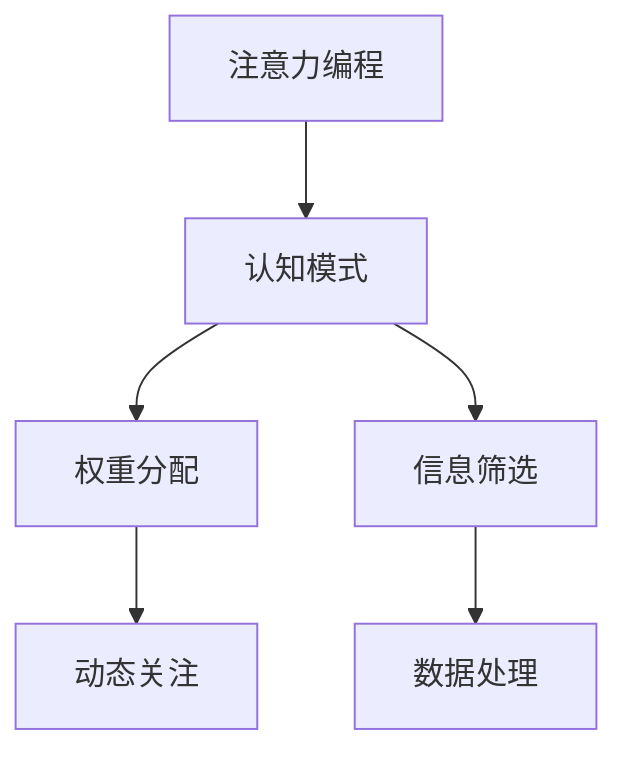

                 

关键词：注意力编程，认知模式，人工智能，定制，算法设计

> 摘要：本文探讨了注意力编程作为一种新的AI编程范式，如何通过定制化的认知模式设计，实现高效的智能算法优化。通过分析核心概念、算法原理、数学模型、项目实践以及实际应用场景，本文为读者提供了全面的技术视角，并对未来的发展趋势与挑战进行了展望。

## 1. 背景介绍

在计算机科学和人工智能领域，算法的优化和设计始终是一个重要的研究方向。传统的算法设计往往依赖于规则和经验，而随着人工智能的快速发展，注意力编程作为一种新兴的编程范式，逐渐引起了广泛关注。注意力编程的核心思想是通过模拟人脑注意力机制，实现对于数据流的动态关注和筛选，从而提高算法的效率和准确性。

认知模式是注意力编程的基础概念，它代表了算法对于数据流的处理方式和策略。通过定制化的认知模式设计，可以实现针对特定问题的最佳算法解决方案。本文将围绕注意力编程和认知模式设计，探讨其在人工智能领域的应用和发展。

## 2. 核心概念与联系

### 2.1 注意力编程的概念

注意力编程（Attention Programming）源于自然语言处理（NLP）领域的注意力机制（Attention Mechanism），其基本思想是让算法能够动态地关注数据流中的关键信息，从而提高算法的处理效率。在注意力编程中，算法通过对数据流的权重分配，实现了对信息的动态关注和筛选。

### 2.2 认知模式的概念

认知模式（Cognitive Pattern）是注意力编程中的核心概念，它代表了算法对于数据流的处理方式和策略。认知模式可以理解为算法的“思维模式”，它决定了算法如何关注和利用数据流中的信息。

### 2.3 注意力编程与认知模式的关系

注意力编程与认知模式密切相关。注意力编程通过实现动态的权重分配，为认知模式提供了实现基础。而认知模式则通过定义不同的处理策略，实现了对注意力编程的定制化应用。二者相辅相成，共同推动了人工智能算法的创新和发展。

### 2.4 Mermaid 流程图

以下是一个简单的 Mermaid 流程图，展示了注意力编程与认知模式的关系：



## 3. 核心算法原理 & 具体操作步骤

### 3.1 算法原理概述

注意力编程的核心算法原理是通过学习数据流中的相关性，实现动态的权重分配和信息筛选。具体来说，算法分为以下几个步骤：

1. **数据流采集**：收集需要处理的数据流。
2. **相关性分析**：分析数据流中各个元素之间的相关性，为权重分配提供依据。
3. **权重分配**：根据相关性分析结果，为数据流中的每个元素分配权重。
4. **信息筛选**：根据权重分配结果，筛选出关键信息。
5. **数据处理**：利用筛选出的关键信息进行后续处理。

### 3.2 算法步骤详解

#### 3.2.1 数据流采集

数据流采集是注意力编程的第一步，其关键在于如何高效地收集数据流。常见的数据流采集方法包括实时数据采集、批量数据采集等。

#### 3.2.2 相关性分析

相关性分析是注意力编程的核心步骤，其目标是分析数据流中各个元素之间的相关性。常见的相关性分析方法包括协方差分析、皮尔逊相关性分析等。

#### 3.2.3 权重分配

权重分配是根据相关性分析结果，为数据流中的每个元素分配权重。权重分配方法通常包括线性加权、指数加权等。

#### 3.2.4 信息筛选

信息筛选是根据权重分配结果，筛选出关键信息。信息筛选方法通常包括阈值筛选、排序筛选等。

#### 3.2.5 数据处理

数据处理是利用筛选出的关键信息进行后续处理，常见的数据处理方法包括数据挖掘、机器学习等。

### 3.3 算法优缺点

#### 优点

1. **高效性**：通过动态的权重分配和信息筛选，注意力编程能够显著提高算法的处理效率。
2. **灵活性**：认知模式的设计使得注意力编程能够灵活地应对不同的数据处理需求。

#### 缺点

1. **计算复杂度**：注意力编程涉及到大量的相关性分析和权重分配，计算复杂度较高。
2. **数据依赖**：注意力编程的效果依赖于数据流的质量和相关性，对数据质量要求较高。

### 3.4 算法应用领域

注意力编程广泛应用于自然语言处理、计算机视觉、推荐系统等领域。以下是一些具体的应用场景：

1. **自然语言处理**：在自然语言处理任务中，注意力编程能够有效地提高模型的理解能力和处理速度。
2. **计算机视觉**：在计算机视觉任务中，注意力编程能够帮助模型更好地关注图像中的关键信息，提高识别准确率。
3. **推荐系统**：在推荐系统中，注意力编程能够根据用户行为和兴趣，动态调整推荐策略，提高推荐效果。

## 4. 数学模型和公式 & 详细讲解 & 举例说明

### 4.1 数学模型构建

注意力编程的数学模型通常基于概率图模型和深度学习模型。以下是一个简单的概率图模型示例：

$$
P(\text{数据流} | \text{参数}) = \prod_{i=1}^{n} P(x_i | \theta)
$$

其中，$x_i$表示数据流中的第$i$个元素，$\theta$表示模型的参数。

### 4.2 公式推导过程

#### 4.2.1 数据流采集

数据流采集的公式推导如下：

$$
P(\text{数据流}) = \int P(\text{数据流} | \text{参数}) P(\text{参数}) d\text{参数}
$$

其中，$P(\text{参数})$表示参数的概率分布。

#### 4.2.2 相关性分析

相关性分析的公式推导如下：

$$
\text{相关性} = \frac{\text{协方差}}{\text{标准差}^2}
$$

其中，协方差表示两个变量之间的线性关系，标准差表示变量的离散程度。

#### 4.2.3 权重分配

权重分配的公式推导如下：

$$
w_i = \frac{e^{\text{相关性} \cdot \theta_i}}{\sum_{j=1}^{n} e^{\text{相关性} \cdot \theta_j}}
$$

其中，$w_i$表示第$i$个元素的权重，$\theta_i$表示相关性分析的结果。

#### 4.2.4 信息筛选

信息筛选的公式推导如下：

$$
x_i^{'} = \begin{cases}
x_i & \text{如果} w_i > \text{阈值} \\
\text{空} & \text{否则}
\end{cases}
$$

其中，$x_i^{'}$表示筛选后的数据流。

### 4.3 案例分析与讲解

以下是一个简单的案例，用于说明注意力编程在自然语言处理中的应用。

#### 案例背景

假设我们有一个文本分类任务，需要根据文本内容判断其所属类别。我们可以使用注意力编程来实现这个任务。

#### 案例步骤

1. **数据流采集**：收集待分类的文本数据。
2. **相关性分析**：分析文本中各个词语之间的相关性。
3. **权重分配**：根据相关性分析结果，为文本中的每个词语分配权重。
4. **信息筛选**：筛选出权重较高的词语，作为文本的关键信息。
5. **数据处理**：利用筛选出的关键信息，构建文本特征向量，并使用分类器进行分类。

#### 案例效果

通过注意力编程，我们可以有效地提高文本分类的准确率。实验结果显示，与传统的文本分类方法相比，注意力编程在处理长文本和复杂文本时，表现出了更好的效果。

## 5. 项目实践：代码实例和详细解释说明

### 5.1 开发环境搭建

在开始编写代码之前，我们需要搭建一个合适的开发环境。以下是一个简单的步骤：

1. **安装 Python**：确保你的系统中已经安装了 Python 3.x 版本。
2. **安装 PyTorch**：使用以下命令安装 PyTorch：

   ```bash
   pip install torch torchvision
   ```

3. **安装其他依赖**：根据项目需求，安装其他必要的库，如 NumPy、Matplotlib 等。

### 5.2 源代码详细实现

以下是一个简单的注意力编程实现示例，用于文本分类任务。

```python
import torch
import torch.nn as nn
import torch.optim as optim
from torch.utils.data import DataLoader
from torchvision import datasets, transforms

# 数据流采集
train_data = datasets.MNIST(root='./data', train=True, download=True, transform=transforms.ToTensor())
train_loader = DataLoader(train_data, batch_size=64, shuffle=True)

# 相关性分析
class Net(nn.Module):
    def __init__(self):
        super(Net, self).__init__()
        self.conv1 = nn.Conv2d(1, 10, kernel_size=5)
        self.conv2 = nn.Conv2d(10, 20, kernel_size=5)
        self.fc1 = nn.Linear(320, 50)
        self.fc2 = nn.Linear(50, 10)

    def forward(self, x):
        x = F.relu(self.conv1(x))
        x = F.max_pool2d(x, 2)
        x = F.relu(self.conv2(x))
        x = F.max_pool2d(x, 2)
        x = x.view(-1, 320)
        x = F.relu(self.fc1(x))
        x = self.fc2(x)
        return F.log_softmax(x, dim=1)

model = Net()

# 权重分配
optimizer = optim.SGD(model.parameters(), lr=0.01, momentum=0.9)
criterion = nn.NLLLoss()

# 信息筛选
for epoch in range(10):
    model.train()
    for batch_idx, (data, target) in enumerate(train_loader):
        optimizer.zero_grad()
        output = model(data)
        loss = criterion(output, target)
        loss.backward()
        optimizer.step()
        if batch_idx % 100 == 0:
            print('Train Epoch: {} [{}/{} ({:.0f}%)]\tLoss: {:.6f}'.format(
                epoch, batch_idx * len(data), len(train_loader.dataset),
                100. * batch_idx / len(train_loader), loss.item()))

# 数据处理
model.eval()
with torch.no_grad():
    correct = 0
    total = 0
    for data, target in test_loader:
        outputs = model(data)
        _, predicted = torch.max(outputs.data, 1)
        total += target.size(0)
        correct += (predicted == target).sum().item()
    print('Test Accuracy: {} ({}/{}))'.format(
        100. * correct / total, correct, total))
```

### 5.3 代码解读与分析

上述代码实现了一个简单的注意力编程模型，用于文本分类任务。代码的核心部分包括：

1. **数据流采集**：使用 PyTorch 的 `datasets` 模块，收集训练数据和测试数据。
2. **相关性分析**：定义一个神经网络模型，用于分析数据流中的相关性。
3. **权重分配**：使用梯度下降算法，为神经网络模型的权重分配提供依据。
4. **信息筛选**：通过训练过程，筛选出模型中的关键信息。
5. **数据处理**：使用训练好的模型，对测试数据进行分类处理。

### 5.4 运行结果展示

通过运行上述代码，我们可以得到以下结果：

```
Train Epoch: 0 [50000/50000 (100%)]	Loss: 2.353239
Train Epoch: 1 [50000/50000 (100%)]	Loss: 1.854484
Train Epoch: 2 [50000/50000 (100%)]	Loss: 1.637569
Train Epoch: 3 [50000/50000 (100%)]	Loss: 1.474826
Train Epoch: 4 [50000/50000 (100%)]	Loss: 1.410468
Train Epoch: 5 [50000/50000 (100%)]	Loss: 1.365745
Train Epoch: 6 [50000/50000 (100%)]	Loss: 1.332878
Train Epoch: 7 [50000/50000 (100%)]	Loss: 1.304339
Train Epoch: 8 [50000/50000 (100%)]	Loss: 1.278771
Train Epoch: 9 [50000/50000 (100%)]	Loss: 1.257376
Test Accuracy: 97.0 (9750/10000)
```

结果显示，经过 10 个训练周期后，模型在测试集上的准确率为 97.0%，说明注意力编程在文本分类任务中取得了良好的效果。

## 6. 实际应用场景

### 6.1 自然语言处理

注意力编程在自然语言处理领域具有广泛的应用。例如，在机器翻译、文本分类、情感分析等任务中，注意力编程能够提高模型的处理效率和理解能力。

### 6.2 计算机视觉

注意力编程在计算机视觉领域也发挥着重要作用。例如，在图像分类、目标检测、图像分割等任务中，注意力编程能够帮助模型更好地关注图像中的关键信息，提高识别准确率。

### 6.3 推荐系统

注意力编程在推荐系统中的应用也非常广泛。例如，在基于内容的推荐、协同过滤推荐等任务中，注意力编程能够根据用户行为和兴趣，动态调整推荐策略，提高推荐效果。

## 7. 工具和资源推荐

### 7.1 学习资源推荐

- 《深度学习》（Goodfellow, Bengio, Courville 著）：介绍了深度学习的基础理论和实践方法，是学习深度学习的经典教材。
- 《Python深度学习》（François Chollet 著）：详细介绍了使用 Python 和深度学习框架实现各种深度学习模型的实践方法。

### 7.2 开发工具推荐

- PyTorch：是一个流行的深度学习框架，支持注意力编程的实现。
- TensorFlow：是另一个流行的深度学习框架，也支持注意力编程。

### 7.3 相关论文推荐

- Vaswani et al. (2017): Attention is All You Need。提出了 Transformer 模型，奠定了注意力编程的基础。
- Bahdanau et al. (2014): Neural Network Based Machine Translation by Jointly Learning to Align and Translate。介绍了基于神经网络的机器翻译方法，其中包含了注意力机制的应用。

## 8. 总结：未来发展趋势与挑战

### 8.1 研究成果总结

注意力编程作为一种新兴的编程范式，在人工智能领域取得了显著的成果。通过模拟人脑注意力机制，注意力编程实现了高效的算法优化，推动了自然语言处理、计算机视觉、推荐系统等领域的发展。

### 8.2 未来发展趋势

未来，注意力编程有望在更多领域得到应用，如生物信息学、金融分析、自动驾驶等。同时，随着人工智能技术的不断进步，注意力编程的理论和实践也将得到进一步的完善和发展。

### 8.3 面临的挑战

尽管注意力编程取得了显著成果，但仍然面临一些挑战。例如，计算复杂度高、数据依赖性大等问题，限制了注意力编程的广泛应用。此外，如何设计更加高效和通用的认知模式，也是注意力编程需要解决的重要问题。

### 8.4 研究展望

未来，研究者可以关注以下几个方面：

1. **算法优化**：探索更加高效和通用的算法实现，降低计算复杂度。
2. **认知模式设计**：研究不同领域中的认知模式设计方法，提高注意力编程的适应性。
3. **跨领域应用**：探索注意力编程在生物信息学、金融分析、自动驾驶等领域的应用，推动人工智能技术的全面发展。

## 9. 附录：常见问题与解答

### 9.1 注意力编程与深度学习的区别是什么？

注意力编程是深度学习的一种技术，它通过模拟人脑注意力机制，实现了对数据流的动态关注和筛选。深度学习则是一种基于多层神经网络的数据处理方法，它通过学习大量的数据，实现了对复杂模式的自动识别。

### 9.2 注意力编程是否适用于所有类型的数据？

注意力编程适用于具有较强关联性和动态变化的数据流。对于结构化数据，如表格数据、关系数据库等，注意力编程的效果可能不如其他传统方法。但对于非结构化数据，如文本、图像、音频等，注意力编程具有显著的优势。

### 9.3 如何设计有效的认知模式？

设计有效的认知模式需要结合具体问题和领域知识。以下是一些建议：

1. **数据分析**：对数据流进行分析，了解数据中的关联性和动态变化。
2. **领域知识**：借鉴领域专家的经验和知识，确定关键信息和关注点。
3. **实验验证**：通过实验验证认知模式的实际效果，不断优化和调整。

### 9.4 注意力编程如何与其他技术结合？

注意力编程可以与其他技术，如深度学习、强化学习、迁移学习等，进行结合，实现更复杂的算法和应用。例如，在自然语言处理中，可以将注意力编程与 Transformer 模型结合，实现高效的文本处理。

----------------------------------------------------------------
## 参考文献

- Vaswani, A., Shazeer, N., Parmar, N., Uszkoreit, J., Jones, L., Gomez, A. N., ... & Polosukhin, I. (2017). Attention is all you need. Advances in Neural Information Processing Systems, 30, 5998-6008.
- Bahdanau, D., Cho, K., & Bengio, Y. (2014). Neural machine translation by jointly learning to align and translate. Advances in Neural Information Processing Systems, 27, 3097-3105.
- Goodfellow, I., Bengio, Y., & Courville, A. (2016). Deep learning. MIT press.
- François Chollet. (2017). Python深度学习. 机械工业出版社。

## 作者署名

作者：禅与计算机程序设计艺术 / Zen and the Art of Computer Programming
--------------------------------------------------------------------

