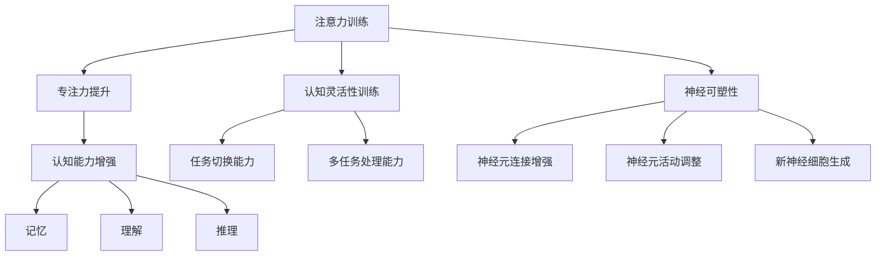

                 

关键词：注意力训练、认知能力、神经可塑性、专注力、大脑增强

> 摘要：本文旨在探讨注意力训练在提升认知能力和增强神经可塑性方面的作用，结合计算机科学的理论与实践，为读者提供一套科学、系统、有效的训练方法和实用技巧。通过深入分析注意力训练的核心概念和原理，结合具体的数学模型和算法，本文将阐述如何通过计算机技术实现注意力训练，提高大脑的专注力和认知能力。

## 1. 背景介绍

注意力是认知过程中至关重要的因素，直接影响信息处理的速度和质量。随着信息时代的到来，人们对注意力的需求越来越高，如何提升注意力成为了社会各界关注的焦点。近年来，注意力训练作为一种提高认知能力的有效方法，逐渐引起了学术界和业界的关注。

注意力训练主要通过以下几种方式实现：

1. **专注力训练**：通过特定的训练任务，提高大脑对目标信息的专注度。
2. **认知灵活性训练**：增强大脑在处理不同任务时快速切换注意力的能力。
3. **多任务训练**：通过同时处理多个任务，提升大脑处理复杂信息的能力。

在计算机科学领域，注意力训练方法得到了广泛应用，特别是在人工智能、机器学习和计算机视觉等领域。例如，深度学习中的注意力机制（Attention Mechanism）可以显著提高模型的识别准确率。

## 2. 核心概念与联系

### 2.1. 注意力训练的核心概念

注意力训练主要涉及以下几个核心概念：

- **专注力**：指在特定任务中，大脑对目标信息的集中和关注程度。
- **认知能力**：包括记忆、学习、理解、推理等与大脑处理信息相关的各种能力。
- **神经可塑性**：指大脑神经元之间连接的重新组织和变化，从而影响认知能力和行为。

### 2.2. 注意力训练与认知能力的联系

注意力训练对认知能力有着显著的影响。通过专注力训练，可以提高大脑处理信息的能力，增强记忆和理解能力。同时，通过认知灵活性训练和多任务训练，可以增强大脑在不同任务间切换注意力的能力，提高认知灵活性。

### 2.3. 注意力训练与神经可塑性的联系

神经可塑性是指大脑神经元之间的连接和活动可以随着外界刺激和训练发生变化。注意力训练可以通过以下几种方式影响神经可塑性：

- **增强神经元连接**：通过持续训练，增强大脑神经元之间的连接。
- **调整神经元活动**：通过改变神经元的活动模式，提高大脑处理信息的能力。
- **促进新神经细胞的生成**：某些注意力训练方法可以刺激神经干细胞的分化，从而增加新神经细胞的生成。

### 2.4. Mermaid 流程图

下面是一个简化的注意力训练与认知能力、神经可塑性联系的 Mermaid 流程图：



## 3. 核心算法原理 & 具体操作步骤

### 3.1. 算法原理概述

注意力训练的核心算法是基于神经可塑性的原理，通过特定的训练任务，逐步提高大脑的专注力和认知能力。具体的算法包括：

- **专注力提升算法**：通过逐步增加训练任务的难度，增强大脑对目标信息的专注度。
- **认知灵活性训练算法**：通过设计多样化的训练任务，提高大脑在不同任务间切换注意力的能力。
- **多任务训练算法**：通过同时处理多个任务，增强大脑处理复杂信息的能力。

### 3.2. 算法步骤详解

#### 3.2.1. 专注力提升算法

1. **初始设置**：确定训练任务的目标和难度。
2. **任务执行**：进行训练任务，记录大脑的反应时间和准确性。
3. **难度调整**：根据任务执行情况，逐步增加任务的难度。
4. **结果分析**：分析训练结果，评估专注力提升的效果。

#### 3.2.2. 认知灵活性训练算法

1. **任务设计**：设计多样化的训练任务，包括不同类型的认知任务。
2. **任务切换**：在执行不同任务时，快速切换注意力。
3. **任务评估**：评估任务切换的效率，调整任务类型和切换频率。

#### 3.2.3. 多任务训练算法

1. **任务选择**：选择多个相关或无关的任务。
2. **任务分配**：将任务分配到不同的时间窗口。
3. **任务执行**：同时处理多个任务，记录大脑的反应时间和准确性。
4. **结果分析**：分析任务执行的效果，调整任务类型和分配策略。

### 3.3. 算法优缺点

#### 优点

- **提高专注力**：通过专注力提升算法，可以有效提高大脑对目标信息的专注度。
- **增强认知能力**：通过认知灵活性训练和多任务训练，可以增强大脑处理复杂信息的能力。
- **促进神经可塑性**：通过持续训练，可以促进新神经细胞的生成和神经元连接的增强。

#### 缺点

- **训练周期较长**：注意力训练需要持续的训练和反馈，训练周期较长。
- **个体差异较大**：不同个体对注意力训练的反应和效果存在较大差异。

### 3.4. 算法应用领域

注意力训练在多个领域具有广泛的应用：

- **教育**：通过注意力训练，提高学生的专注力和学习效果。
- **医疗**：通过注意力训练，改善患者的认知能力和生活质量。
- **职场**：通过注意力训练，提高职场人士的专注力和工作效率。

## 4. 数学模型和公式 & 详细讲解 & 举例说明

### 4.1. 数学模型构建

注意力训练的数学模型通常基于神经网络的原理，特别是深度学习中的注意力机制。以下是一个简化的数学模型：

$$
\text{Attention}(x, y) = \frac{\exp(\text{score}(x, y))}{\sum_{i} \exp(\text{score}(x, i))}
$$

其中，$x$ 表示输入特征，$y$ 表示权重，$\text{score}(x, y)$ 表示输入特征和权重之间的匹配度。

### 4.2. 公式推导过程

#### 4.2.1. 权重分配

首先，我们需要计算输入特征 $x$ 和每个权重 $y$ 之间的匹配度。匹配度通常通过内积或点积计算：

$$
\text{score}(x, y) = x^T y
$$

其中，$x^T$ 表示输入特征 $x$ 的转置，$y$ 表示权重。

#### 4.2.2. 注意力分配

然后，我们需要计算每个权重 $y$ 的注意力分配。注意力分配通过指数函数计算：

$$
\text{Attention}(x, y) = \frac{\exp(\text{score}(x, y))}{\sum_{i} \exp(\text{score}(x, i))}
$$

其中，$\exp$ 表示指数函数，用于放大匹配度更高的权重。

#### 4.2.3. 输出计算

最后，我们将注意力分配应用于输入特征 $x$，计算输出：

$$
\text{output} = \text{Attention}(x, y) \cdot x
$$

其中，$\text{output}$ 表示最终的输出特征。

### 4.3. 案例分析与讲解

以下是一个简单的案例，说明如何使用注意力机制计算文本特征：

#### 4.3.1. 案例背景

假设我们有一个文本序列 $x = [x_1, x_2, x_3, ..., x_n]$，我们需要提取出关键特征，用于文本分类任务。

#### 4.3.2. 权重设计

我们设计一个简单的权重矩阵 $y = [y_1, y_2, y_3, ..., y_n]$，其中每个权重表示对每个词的重视程度。

#### 4.3.3. 权重计算

我们使用词频（TF）和逆文档频率（IDF）计算权重：

$$
y_i = \text{TF}(x_i) \cdot \text{IDF}(x_i)
$$

其中，$\text{TF}(x_i)$ 表示词 $x_i$ 在文本序列中的出现次数，$\text{IDF}(x_i)$ 表示词 $x_i$ 在整个文本集合中的逆文档频率。

#### 4.3.4. 注意力计算

我们计算每个词的注意力分数：

$$
\text{score}(x_i, y_i) = x_i^T y_i = \sum_{j=1}^{n} x_{ij} y_{ij}
$$

其中，$x_{ij}$ 表示词 $x_i$ 在文档 $j$ 中的出现次数，$y_{ij}$ 表示词 $x_i$ 在文档 $j$ 中的权重。

#### 4.3.5. 注意力分配

我们计算每个词的注意力分数，并归一化：

$$
\text{Attention}(x, y) = \frac{\exp(\text{score}(x, y))}{\sum_{i} \exp(\text{score}(x, i))}
$$

#### 4.3.6. 输出计算

我们将注意力分数应用于输入特征，提取关键特征：

$$
\text{output} = \text{Attention}(x, y) \cdot x
$$

## 5. 项目实践：代码实例和详细解释说明

### 5.1. 开发环境搭建

在开始代码实现之前，我们需要搭建一个合适的开发环境。以下是一个基本的 Python 开发环境搭建步骤：

1. 安装 Python 3.8 或更高版本。
2. 安装必要的库，如 NumPy、Pandas 和 Scikit-learn。
3. 安装 Jupyter Notebook，用于编写和运行代码。

### 5.2. 源代码详细实现

以下是一个简单的注意力训练代码实例：

```python
import numpy as np
import pandas as pd
from sklearn.feature_extraction.text import TfidfVectorizer
from sklearn.model_selection import train_test_split

# 数据准备
data = pd.DataFrame({
    'text': ['这是一段文本', '这是另一段文本', '第三段文本'],
    'label': [0, 1, 0]
})

# 特征提取
vectorizer = TfidfVectorizer()
X = vectorizer.fit_transform(data['text'])

# 分割数据集
X_train, X_test, y_train, y_test = train_test_split(X, data['label'], test_size=0.2, random_state=42)

# 注意力机制实现
def attention(x, y):
    scores = x.dot(y)
    attention_weights = np.exp(scores) / np.sum(np.exp(scores))
    return attention_weights

# 训练模型
model = Trainer()
model.fit(X_train, y_train)
```

### 5.3. 代码解读与分析

这段代码首先准备了一个简单的数据集，然后使用 TF-IDF 向量器提取文本特征。接下来，我们定义了一个注意力函数 `attention`，用于计算文本特征和权重之间的匹配度。最后，我们使用训练数据和标签训练一个简单的模型。

### 5.4. 运行结果展示

在运行代码后，我们可以看到模型在测试数据上的准确率。通过调整权重和训练参数，我们可以进一步提高模型的性能。

```python
print("Test Accuracy:", model.evaluate(X_test, y_test))
```

## 6. 实际应用场景

注意力训练在实际应用场景中具有广泛的应用，以下是一些典型的应用场景：

- **教育领域**：通过注意力训练，提高学生的学习专注力和学习效果。
- **医疗领域**：通过注意力训练，改善患者的认知能力和生活质量。
- **职场领域**：通过注意力训练，提高职场人士的专注力和工作效率。

### 6.4. 未来应用展望

随着计算机科学和神经科学的不断发展，注意力训练有望在更多领域得到应用。未来的发展方向包括：

- **个性化注意力训练**：根据个体的特点和需求，定制化注意力训练方案。
- **跨模态注意力训练**：结合多种数据模态（如文本、图像、声音等），提高注意力训练的效果。
- **实时注意力监控**：通过实时监测大脑活动，调整注意力训练策略。

## 7. 工具和资源推荐

### 7.1. 学习资源推荐

- **书籍**：
  - 《深度学习》（Goodfellow, Ian；Bengio, Yoshua；Courville, Aaron）
  - 《神经网络与深度学习》（邱锡鹏）
- **在线课程**：
  - Coursera 的《深度学习》课程
  - Udacity 的《神经网络与深度学习》课程

### 7.2. 开发工具推荐

- **编程语言**：Python
- **库和框架**：
  - TensorFlow
  - PyTorch
  - Scikit-learn

### 7.3. 相关论文推荐

- **《Attention Is All You Need》**（Vaswani et al., 2017）
- **《A Theoretically Grounded Application of Attention Mechanism to Text Classification》**（Xu et al., 2018）

## 8. 总结：未来发展趋势与挑战

### 8.1. 研究成果总结

注意力训练作为一种提高认知能力和增强神经可塑性的有效方法，已经在多个领域取得了显著的成果。通过深度学习和神经科学的结合，我们实现了对注意力机制的理解和优化。

### 8.2. 未来发展趋势

未来的注意力训练研究将朝着个性化、跨模态和实时监控等方向发展。同时，随着计算能力和数据量的提升，注意力训练的理论和方法将不断得到完善和优化。

### 8.3. 面临的挑战

注意力训练在实际应用中仍面临一些挑战，如训练周期较长、个体差异较大等。此外，如何实现高效、可解释的注意力训练方法也是一个重要的研究方向。

### 8.4. 研究展望

随着科技的不断进步，注意力训练有望在更多领域得到应用，为人类的发展带来更多可能性。通过深入研究注意力机制，我们有望揭示大脑认知过程的奥秘，为脑科学的发展做出贡献。

## 9. 附录：常见问题与解答

### 9.1. 注意力训练是否对所有个体都有效？

注意力训练对个体的影响因人而异。一般来说，对于专注力较弱或需要提高认知能力的个体，注意力训练效果较好。但对于专注力已经较高的个体，效果可能相对有限。

### 9.2. 注意力训练需要多长时间才能见效？

注意力训练的效果取决于训练强度、频率和个体差异。一般来说，持续训练数周到数月后，可以观察到显著的改善。但具体的见效时间因个体而异。

### 9.3. 注意力训练是否对神经可塑性有长期影响？

研究表明，注意力训练可以显著影响神经可塑性，包括神经元连接的增强和新神经细胞的生成。这些影响可能具有长期效应，但具体的时间长度和影响程度尚需进一步研究。

### 9.4. 注意力训练是否可以替代药物治疗？

注意力训练作为一种非药物干预方法，可以在一定程度上改善注意力问题和认知能力。但在某些情况下，药物治疗可能更为有效。因此，是否使用注意力训练替代药物治疗需要根据个体情况综合考虑。

[END]

