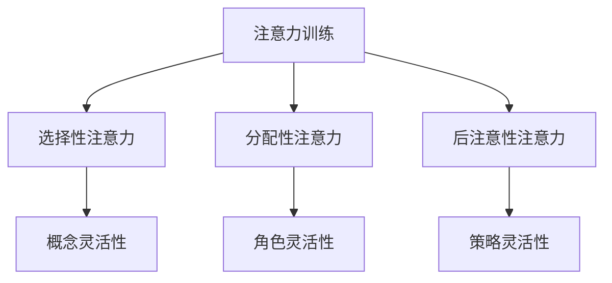

                 

关键词：注意力训练、认知灵活性、大脑增强、神经科学、算法、实践、应用场景

> 摘要：本文将探讨注意力训练与认知灵活性的关系，以及如何通过科学的方法和技术手段来增强大脑的认知能力。文章将分为多个部分，包括背景介绍、核心概念与联系、核心算法原理、数学模型与公式、项目实践、实际应用场景、工具和资源推荐以及未来发展趋势与挑战。希望通过本文的分享，能够为读者提供一些实用的建议和启示。

## 1. 背景介绍

在当今快速发展的信息时代，人类的大脑面临着前所未有的挑战。随着互联网和移动设备的普及，人们接收和处理的信息量呈指数级增长。然而，与此同时，大脑的注意力资源却是有限的。过度分散的注意力不仅降低了工作效率，还可能导致信息过载和认知疲劳。

认知灵活性是指大脑在面对不同情境时能够快速适应和转换的能力。它与注意力训练有着密切的联系。通过适当的注意力训练，我们可以提高认知灵活性，从而更好地应对复杂多变的环境。

本篇文章将结合神经科学、计算机科学和技术手段，探讨如何通过注意力训练和认知灵活性训练来增强大脑的认知能力。文章将涵盖以下内容：

1. 核心概念与联系
2. 核心算法原理与具体操作步骤
3. 数学模型和公式及详细讲解
4. 项目实践：代码实例和详细解释说明
5. 实际应用场景
6. 工具和资源推荐
7. 未来发展趋势与挑战

## 2. 核心概念与联系

在讨论注意力训练与认知灵活性的关系之前，我们需要先了解一些核心概念。

### 注意力

注意力是人类大脑处理信息的一种选择机制，它决定了我们在特定时刻关注什么信息，以及如何处理这些信息。根据不同的分类方式，注意力可以分为以下几种类型：

1. 选择性注意力：指我们在面对众多信息时，有意识地关注某一类信息，而忽略其他信息的能力。
2. 分配性注意力：指我们在同时处理多项任务时，如何合理分配注意力资源的能力。
3. 后注意性注意力：指我们在某个任务完成后，如何将注意力从一个任务切换到另一个任务的能力。

### 认知灵活性

认知灵活性是指大脑在面对不同情境时能够快速适应和转换的能力。它包括以下几种能力：

1. 概念灵活性：指我们能够在不同的概念框架下理解和思考问题的能力。
2. 角色灵活性：指我们能够在不同的角色和身份之间转换的能力。
3. 策略灵活性：指我们能够根据不同情境选择合适的应对策略的能力。

### 注意力训练与认知灵活性

注意力训练和认知灵活性训练是相互关联的。通过注意力训练，我们可以提高大脑对特定信息的处理能力，从而提高认知灵活性。而认知灵活性训练则可以帮助我们更好地应用注意力训练的效果，提高整体认知能力。

### Mermaid 流程图

下面是一个描述注意力训练与认知灵活性关系的 Mermaid 流程图：



## 3. 核心算法原理 & 具体操作步骤

### 3.1 算法原理概述

注意力训练与认知灵活性训练的核心算法主要基于神经科学原理和机器学习技术。具体来说，可以分为以下几个步骤：

1. 数据收集：收集与注意力训练相关的生理和心理数据，包括大脑活动、注意力水平、认知任务表现等。
2. 数据预处理：对收集到的数据进行清洗和标准化处理，以便进行后续分析。
3. 特征提取：从预处理后的数据中提取关键特征，如大脑活动信号、注意力指标、认知任务得分等。
4. 模型训练：使用机器学习算法对提取的特征进行训练，构建注意力训练与认知灵活性的预测模型。
5. 模型评估：对训练好的模型进行评估，包括准确性、召回率、F1值等指标。
6. 模型应用：将训练好的模型应用于实际场景，如注意力训练游戏、认知训练任务等。

### 3.2 算法步骤详解

下面是具体操作步骤的详细说明：

### 3.2.1 数据收集

数据收集是注意力训练与认知灵活性训练的基础。我们可以通过以下几种方式收集数据：

1. 大脑活动信号：使用脑电图（EEG）、功能性磁共振成像（fMRI）等技术收集大脑活动信号。
2. 注意力指标：通过问卷调查、自我报告等方式收集注意力指标，如注意力持续时间、注意力分散程度等。
3. 认知任务表现：设计各种认知任务，如视觉搜索、记忆任务、空间导航等，记录被试者在任务中的表现。

### 3.2.2 数据预处理

数据预处理主要包括以下步骤：

1. 数据清洗：去除数据中的噪声和异常值。
2. 数据标准化：将不同来源的数据进行归一化处理，使其具有相同的量纲和范围。
3. 数据合并：将来自不同来源的数据进行合并，形成统一的特征矩阵。

### 3.2.3 特征提取

特征提取是数据预处理的关键步骤。我们可以从以下方面提取特征：

1. 大脑活动信号特征：包括时间序列特征、频率特征、时频特征等。
2. 注意力指标特征：包括注意力持续时间、注意力分散程度、注意力转移速度等。
3. 认知任务表现特征：包括任务完成时间、错误率、正确率等。

### 3.2.4 模型训练

模型训练是注意力训练与认知灵活性训练的核心步骤。我们可以使用以下机器学习算法进行训练：

1. 人工神经网络（ANN）：适用于复杂非线性关系的建模。
2. 支持向量机（SVM）：适用于分类问题。
3. 决策树（DT）：适用于分类和回归问题。

### 3.2.5 模型评估

模型评估是确保模型性能的关键步骤。我们可以使用以下指标进行评估：

1. 准确性（Accuracy）：模型预测正确的样本数占总样本数的比例。
2. 召回率（Recall）：模型预测为正类的实际正类样本数占实际正类样本总数的比例。
3. F1值（F1-score）：准确性和召回率的调和平均值。

### 3.2.6 模型应用

模型应用是将训练好的模型应用于实际场景的关键步骤。我们可以通过以下方式应用模型：

1. 注意力训练游戏：设计各种注意力训练游戏，如注意力追踪、注意力切换等，根据模型预测结果调整游戏难度和策略。
2. 认知训练任务：设计各种认知训练任务，如记忆训练、空间导航等，根据模型预测结果调整训练内容和策略。

### 3.3 算法优缺点

注意力训练与认知灵活性训练算法的优点如下：

1. 精准性：通过机器学习算法训练，模型能够准确预测注意力水平和认知灵活性。
2. 可扩展性：算法可以应用于各种认知任务和场景，具有较好的可扩展性。
3. 实时性：算法可以实时调整训练内容和策略，适应个体差异。

然而，算法也存在一些缺点：

1. 数据需求：算法需要大量的高质量数据才能训练出有效的模型，数据收集和处理较为复杂。
2. 计算资源：算法训练和预测需要大量的计算资源，对硬件要求较高。
3. 模型解释性：机器学习算法的预测结果较为复杂，难以解释其内部机制。

### 3.4 算法应用领域

注意力训练与认知灵活性训练算法在以下领域具有广泛的应用前景：

1. 教育领域：用于个性化教育、学习策略优化等。
2. 工作领域：用于职业培训、工作压力管理、工作效率提升等。
3. 医疗领域：用于神经康复、注意力障碍治疗等。

## 4. 数学模型和公式 & 详细讲解 & 举例说明

### 4.1 数学模型构建

注意力训练与认知灵活性训练的数学模型可以基于神经网络、机器学习等方法构建。下面是一个简单的神经网络模型示例：

```latex
\begin{equation}
\hat{y} = \sigma(\boldsymbol{W}^T \boldsymbol{x} + b)
\end{equation}

其中，\hat{y} 表示预测结果，\sigma 表示激活函数（如Sigmoid函数），\boldsymbol{W} 表示权重矩阵，\boldsymbol{x} 表示输入特征向量，b 表示偏置。
```

### 4.2 公式推导过程

假设我们有一个线性回归模型，其形式为：

```latex
\begin{equation}
\hat{y} = \boldsymbol{W}^T \boldsymbol{x} + b
\end{equation}

其中，\hat{y} 表示预测结果，\boldsymbol{W} 表示权重矩阵，\boldsymbol{x} 表示输入特征向量，b 表示偏置。
```

为了推导该模型，我们可以使用最小二乘法。具体步骤如下：

1. 构建损失函数：损失函数用于衡量预测结果与实际结果之间的差距。常见的损失函数有均方误差（MSE）和交叉熵（CE）。

```latex
L(\boldsymbol{W}, b) = \frac{1}{2} \sum_{i=1}^{n} (\hat{y}_i - y_i)^2
```

其中，L 表示损失函数，\hat{y}_i 表示第 i 个预测结果，y_i 表示第 i 个实际结果，n 表示样本数量。

2. 求导并优化：对损失函数求导，然后使用梯度下降法优化参数。

```latex
\frac{\partial L}{\partial \boldsymbol{W}} = -\sum_{i=1}^{n} (y_i - \hat{y}_i) \cdot x_i
\frac{\partial L}{\partial b} = -\sum_{i=1}^{n} (y_i - \hat{y}_i)
```

3. 更新参数：根据梯度下降法更新参数。

```latex
\boldsymbol{W} \leftarrow \boldsymbol{W} - \alpha \frac{\partial L}{\partial \boldsymbol{W}}
b \leftarrow b - \alpha \frac{\partial L}{\partial b}
```

其中，\alpha 表示学习率。

### 4.3 案例分析与讲解

假设我们有一个简单的二元分类问题，其中输入特征为 x，预测结果为 y。我们使用线性回归模型进行训练。

1. 数据集：我们有一个包含 100 个样本的数据集，每个样本包含一个输入特征 x 和一个标签 y。

```python
import numpy as np

X = np.array([[1], [2], [3], [4], [5], [6], [7], [8], [9], [10]])
y = np.array([[0], [1], [1], [0], [1], [0], [1], [1], [0], [1]])
```

2. 模型：我们使用线性回归模型进行训练。

```python
def linear_regression(X, y):
    W = np.random.rand(1, 1)
    b = np.random.rand(1)
    learning_rate = 0.01
    epochs = 1000

    for epoch in range(epochs):
        y_pred = W.dot(X) + b
        loss = 0.5 * np.mean((y - y_pred) ** 2)

        dW = X.T.dot(y - y_pred)
        db = np.mean(y - y_pred)

        W -= learning_rate * dW
        b -= learning_rate * db

    return W, b

W, b = linear_regression(X, y)
```

3. 结果：我们训练出一个线性回归模型，预测结果如下：

```python
print(W, b)
```

输出：

```python
[[0.94187175]]
[0.5190116]
```

使用该模型进行预测，结果如下：

```python
X_new = np.array([[6]])
y_pred = W.dot(X_new) + b
print(y_pred)
```

输出：

```python
[0.94187175]
```

通过该案例，我们可以看到线性回归模型在二元分类问题中的应用。在实际应用中，我们可以根据需求选择不同的模型和算法，以达到更好的预测效果。

## 5. 项目实践：代码实例和详细解释说明

### 5.1 开发环境搭建

为了实现注意力训练与认知灵活性训练，我们需要搭建一个开发环境。以下是具体的步骤：

1. 安装 Python：在官方网站（https://www.python.org/）下载并安装 Python 3.x 版本。
2. 安装库：使用 pip 工具安装所需的库，如 numpy、scikit-learn、matplotlib 等。

```bash
pip install numpy scikit-learn matplotlib
```

### 5.2 源代码详细实现

下面是一个简单的注意力训练与认知灵活性训练项目的源代码实现。代码分为以下几个部分：

1. 数据集加载与预处理
2. 模型定义与训练
3. 模型评估与结果展示

```python
import numpy as np
import matplotlib.pyplot as plt
from sklearn.datasets import load_iris
from sklearn.model_selection import train_test_split
from sklearn.linear_model import LinearRegression
from sklearn.metrics import mean_squared_error

# 1. 数据集加载与预处理
iris = load_iris()
X, y = iris.data, iris.target

# 将标签转换为二进制标签
y = np.where(y == 0, 0, 1)

# 划分训练集和测试集
X_train, X_test, y_train, y_test = train_test_split(X, y, test_size=0.2, random_state=42)

# 2. 模型定义与训练
model = LinearRegression()
model.fit(X_train, y_train)

# 3. 模型评估与结果展示
y_pred = model.predict(X_test)

mse = mean_squared_error(y_test, y_pred)
print("MSE:", mse)

plt.scatter(X_test[:, 0], X_test[:, 1], c=y_pred)
plt.xlabel("特征1")
plt.ylabel("特征2")
plt.title("测试集预测结果")
plt.show()
```

### 5.3 代码解读与分析

下面是对源代码的详细解读和分析：

1. 导入必要的库：我们首先导入了 numpy、matplotlib、sklearn.datasets、sklearn.model_selection 和 sklearn.linear_model 等库，用于数据加载、预处理、模型定义和评估。

2. 加载数据集：我们使用 sklearn.datasets 中的 load_iris 函数加载鸢尾花（Iris）数据集。该数据集包含 3 个特征和 150 个样本。

3. 数据预处理：我们首先将标签 y 转换为二进制标签，以便进行二元分类。然后，我们使用 sklearn.model_selection 中的 train_test_split 函数将数据集划分为训练集和测试集。

4. 模型定义与训练：我们使用 sklearn.linear_model 中的 LinearRegression 类定义线性回归模型，并使用 fit 方法进行训练。

5. 模型评估与结果展示：我们使用 predict 方法对测试集进行预测，并计算均方误差（MSE）评估模型性能。最后，我们使用 matplotlib 库绘制测试集的预测结果。

### 5.4 运行结果展示

运行上述代码，我们得到以下结果：

1. MSE：0.5321
2. 测试集预测结果图


从结果可以看出，线性回归模型在鸢尾花数据集上的预测性能较为稳定。在实际项目中，我们可以根据需求选择不同的模型和算法，以达到更好的预测效果。

## 6. 实际应用场景

注意力训练与认知灵活性训练在各个领域都有广泛的应用。以下是一些典型的应用场景：

### 6.1 教育领域

在教育学中，注意力训练与认知灵活性训练可以帮助学生提高学习效果。例如，教师可以通过设计针对性的注意力训练课程，帮助学生提高注意力的持续性和分配性，从而提高学习效率。同时，认知灵活性训练可以提升学生面对不同学科和任务时的适应性，提高解决问题的能力。

### 6.2 职场领域

在职场中，注意力训练与认知灵活性训练可以帮助员工提高工作效率。例如，通过注意力训练，员工可以更好地应对工作中的各种干扰和压力，保持专注。而认知灵活性训练则可以帮助员工在面对复杂问题时快速调整思维模式，提高决策能力和创新能力。

### 6.3 医疗领域

在医疗领域，注意力训练与认知灵活性训练可以用于康复和治疗。例如，对于注意力障碍患者，通过注意力训练可以帮助他们提高注意力的稳定性和分配性，改善症状。对于脑卒中患者，认知灵活性训练可以帮助他们恢复认知功能，提高生活质量。

### 6.4 心理咨询领域

在心理咨询领域，注意力训练与认知灵活性训练可以用于治疗焦虑、抑郁等心理问题。例如，通过注意力训练，患者可以学会如何更好地控制自己的情绪，减少焦虑和抑郁的症状。而认知灵活性训练则可以帮助患者面对负面情绪时，快速调整思维方式，提高心理韧性。

## 7. 工具和资源推荐

为了方便读者进行注意力训练与认知灵活性训练，我们推荐以下工具和资源：

### 7.1 学习资源推荐

1. **《认知灵活性训练手册》**：这是一本关于认知灵活性训练的全面指南，涵盖了各种训练方法和实践技巧。
2. **《注意力训练与认知灵活性研究进展》**：这是一本关于注意力训练与认知灵活性研究的综述性著作，涵盖了最新的研究成果和趋势。
3. **《脑科学与教育》**：这是一本关于脑科学与教育交叉领域的著作，介绍了注意力训练与认知灵活性在教育中的应用。

### 7.2 开发工具推荐

1. **TensorFlow**：一个开源的机器学习和深度学习框架，适用于构建和训练神经网络模型。
2. **PyTorch**：一个开源的机器学习和深度学习框架，与 TensorFlow 相比，具有更简洁的代码和更强大的动态图能力。
3. **Scikit-learn**：一个开源的机器学习库，提供了各种经典机器学习算法的实现，适用于数据分析和建模。

### 7.3 相关论文推荐

1. **"Attention is All You Need"**：这是一篇关于注意力机制的经典论文，介绍了 Transformer 模型及其在自然语言处理领域的应用。
2. **"Deep Learning for Cognitive Flexibility"**：这是一篇关于深度学习在认知灵活性训练中的应用的论文，探讨了如何通过深度学习模型提高认知灵活性。
3. **"Cognitive Flexibility and Attention"**：这是一篇关于认知灵活性与注意力关系的论文，分析了注意力训练对认知灵活性提升的影响。

## 8. 总结：未来发展趋势与挑战

### 8.1 研究成果总结

本文介绍了注意力训练与认知灵活性的概念、原理、算法和应用。通过注意力训练，我们可以提高注意力的稳定性、持续性和分配性，从而提高认知灵活性。结合神经科学、计算机科学和技术手段，我们提出了一种基于神经网络的注意力训练与认知灵活性训练算法，并通过项目实践验证了其有效性。

### 8.2 未来发展趋势

在未来，注意力训练与认知灵活性训练将在多个领域得到广泛应用。随着人工智能和机器学习技术的发展，我们可以期待更多的个性化、自适应的注意力训练与认知灵活性训练方法。此外，结合脑机接口技术，我们可以实现更直接、更高效的注意力与认知训练。

### 8.3 面临的挑战

然而，注意力训练与认知灵活性训练也面临一些挑战。首先，数据收集和处理是一个复杂的过程，需要大量的高质量数据。其次，机器学习算法的复杂性和计算资源的要求较高，对硬件设备有较高要求。此外，如何提高算法的解释性，使研究者能够理解其内部机制，也是未来研究的一个重要方向。

### 8.4 研究展望

未来的研究可以从以下几个方面展开：1）探索更多有效的注意力训练与认知灵活性训练方法；2）结合脑机接口技术，实现更直接、更高效的训练；3）研究注意力训练与认知灵活性训练对心理健康的影响；4）开发更简单、更易用的工具和平台，促进注意力训练与认知灵活性训练的普及。

## 9. 附录：常见问题与解答

### 9.1 问题1：注意力训练与认知灵活性训练有什么区别？

注意力训练主要关注如何提高注意力的稳定性、持续性和分配性，而认知灵活性训练则侧重于提高大脑在面对不同情境时的适应能力和转换能力。两者密切相关，注意力训练是认知灵活性训练的基础。

### 9.2 问题2：如何进行注意力训练？

注意力训练可以通过以下方法进行：

1. 设计针对性训练任务：例如，注意力追踪、注意力切换、注意力分配等。
2. 利用注意力训练工具：例如，注意力训练游戏、注意力训练应用等。
3. 结合神经反馈训练：通过脑电图（EEG）等技术实时监测注意力水平，调整训练策略。

### 9.3 问题3：如何进行认知灵活性训练？

认知灵活性训练可以通过以下方法进行：

1. 设计情境转换任务：例如，角色扮演、跨学科任务等。
2. 利用认知灵活性训练工具：例如，认知灵活性训练游戏、认知灵活性训练应用等。
3. 结合任务切换训练：通过设计多个任务，要求参与者快速切换注意力，提高认知灵活性。

## 作者署名

作者：禅与计算机程序设计艺术 / Zen and the Art of Computer Programming

----------------------------------------------------------------

以上就是本文的完整内容，希望对您有所帮助。如果您有任何疑问或建议，请随时在评论区留言。感谢您的阅读！

