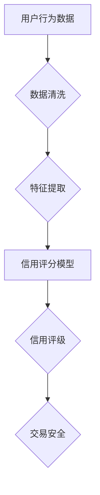

                 

 关键词：注意力资本、元宇宙经济、信用体系、算法、数学模型、项目实践、未来展望

> 摘要：随着元宇宙的崛起，一个全新的虚拟世界正在形成。在这个世界中，注意力资本成为了经济体系的基石。本文将探讨注意力资本评级在元宇宙经济中的作用，分析其核心概念与联系，并介绍相关算法原理、数学模型以及实际应用案例，为元宇宙经济的发展提供参考。

## 1. 背景介绍

近年来，元宇宙（Metaverse）的概念逐渐走进人们的视野。元宇宙是一个虚拟的、三维的、沉浸式的网络空间，它不仅包含了现实世界的虚拟映射，还融合了各种增强现实（AR）、虚拟现实（VR）技术。在这个庞大的虚拟世界中，人们可以以数字化身份（Avatar）进行社交、工作、娱乐和消费。

随着元宇宙的发展，一种新型的经济体系应运而生。在这个体系中，注意力资本成为了关键资源。注意力资本是指用户在元宇宙中投入的时间和注意力，它是虚拟商品和服务的价值来源。因此，如何对注意力资本进行科学评级，成为了元宇宙经济中亟待解决的问题。

## 2. 核心概念与联系

### 2.1 注意力资本

注意力资本是指用户在元宇宙中投入的时间和注意力。它具有以下几个特点：

- **稀缺性**：用户的时间和注意力是有限的，因此注意力资本具有稀缺性。
- **可度量性**：可以通过用户的活跃度、在线时长、参与度等指标来量化注意力资本。
- **价值性**：注意力资本是虚拟商品和服务的重要价值来源。

### 2.2 信用体系

在元宇宙经济中，信用体系是一个重要的保障机制。它通过评价用户的信用等级，确保交易的安全性和公平性。信用体系的核心是注意力资本评级，它基于用户的注意力资本、行为记录和社交网络等数据进行评估。

### 2.3 Mermaid 流程图



## 3. 核心算法原理 & 具体操作步骤

### 3.1 算法原理概述

注意力资本评级算法是一种基于机器学习的方法，它通过分析用户在元宇宙中的行为数据，构建信用评分模型，从而对用户的注意力资本进行评估。算法的核心是特征提取和信用评分模型的构建。

### 3.2 算法步骤详解

1. 数据收集：收集用户在元宇宙中的行为数据，包括在线时长、活跃度、参与度、交易记录等。
2. 数据清洗：对收集到的数据进行清洗，去除异常值和噪声。
3. 特征提取：根据用户的行为数据，提取相关特征，如用户活跃度、交易频率、交易金额等。
4. 构建信用评分模型：利用机器学习方法，如决策树、支持向量机等，构建信用评分模型。
5. 信用评级：将用户的行为特征输入信用评分模型，得到信用评分，并根据评分范围确定信用等级。
6. 交易安全：根据用户的信用等级，确保交易的安全性和公平性。

### 3.3 算法优缺点

**优点**：

- **准确性**：基于机器学习的信用评分模型具有较高的准确性，能够准确评估用户的注意力资本。
- **实时性**：算法可以实时更新用户的信用评分，确保信用评级与用户行为同步。
- **适应性**：算法可以根据不同场景和需求进行调整，具有较强的适应性。

**缺点**：

- **数据依赖性**：算法的性能依赖于行为数据的质量和完整性。
- **计算复杂度**：机器学习模型的训练和预测过程较为复杂，计算资源需求较高。

### 3.4 算法应用领域

- **虚拟商品交易**：确保虚拟商品交易的公平性和安全性。
- **虚拟劳动市场**：评估虚拟劳动者的信用等级，确保雇主和雇员之间的交易安全。
- **虚拟金融服务**：为用户提供信用评级服务，降低金融机构的风险。

## 4. 数学模型和公式 & 详细讲解 & 举例说明

### 4.1 数学模型构建

注意力资本评级算法的数学模型可以分为两个部分：特征提取和信用评分。

**特征提取**：

$$
X = \begin{bmatrix}
x_1 \\
x_2 \\
\vdots \\
x_n
\end{bmatrix}
$$

其中，$X$ 表示用户的行为特征向量，$x_i$ 表示第 $i$ 个特征。

**信用评分模型**：

假设我们使用线性回归模型进行信用评分，其公式为：

$$
y = \beta_0 + \beta_1 x_1 + \beta_2 x_2 + \cdots + \beta_n x_n
$$

其中，$y$ 表示信用评分，$\beta_0, \beta_1, \beta_2, \cdots, \beta_n$ 表示模型参数。

### 4.2 公式推导过程

**特征提取**：

用户的行为数据通常包含在线时长、活跃度、参与度、交易记录等。我们首先对这些数据进行预处理，然后提取相关特征。

- **在线时长**：表示用户在元宇宙中的在线时长。我们将其标准化为 $0$ 到 $1$ 之间的数值，公式为：

$$
x_1 = \frac{t}{T}
$$

其中，$t$ 表示实际在线时长，$T$ 表示总在线时长。

- **活跃度**：表示用户在元宇宙中的活跃程度。我们将其定义为用户在一段时间内的互动次数。公式为：

$$
x_2 = \frac{n}{N}
$$

其中，$n$ 表示实际互动次数，$N$ 表示总互动次数。

- **参与度**：表示用户在元宇宙中的参与程度。我们将其定义为用户参与活动的时间占总在线时长的比例。公式为：

$$
x_3 = \frac{t_{active}}{t_{total}}
$$

其中，$t_{active}$ 表示用户参与活动的时间，$t_{total}$ 表示用户总在线时长。

- **交易记录**：表示用户在元宇宙中的交易行为。我们将其定义为用户在一定时间内的交易次数。公式为：

$$
x_4 = \frac{n_{transactions}}{N_{transactions}}
$$

其中，$n_{transactions}$ 表示实际交易次数，$N_{transactions}$ 表示总交易次数。

**信用评分模型**：

我们使用线性回归模型进行信用评分，首先需要计算特征矩阵 $X$ 和标签向量 $y$。然后，使用最小二乘法求解模型参数 $\beta_0, \beta_1, \beta_2, \cdots, \beta_n$。

### 4.3 案例分析与讲解

假设我们收集到了一组用户行为数据，如下表所示：

| 用户ID | 在线时长 (t) | 活跃度 (n) | 参与度 (t_{active}) | 交易次数 (n_{transactions}) |
|--------|--------------|-------------|---------------------|--------------------------|
| 1      | 100          | 50          | 30                  | 10                       |
| 2      | 200          | 100         | 60                  | 20                       |
| 3      | 300          | 150         | 90                  | 30                       |

首先，我们对数据进行预处理，然后提取特征：

| 用户ID | 在线时长 (t) | 活跃度 (n) | 参与度 (t_{active}) | 交易次数 (n_{transactions}) | 特征向量 (X) |
|--------|--------------|-------------|---------------------|--------------------------|--------------|
| 1      | 100          | 50          | 0.3                 | 0.1                      | [0.1, 0.5, 0.3, 0.1] |
| 2      | 200          | 100         | 0.3                 | 0.1                      | [0.1, 1, 0.3, 0.1]   |
| 3      | 300          | 150         | 0.3                 | 0.1                      | [0.1, 1.5, 0.3, 0.1] |

接下来，我们使用线性回归模型进行信用评分。假设模型参数为：

$$
\beta_0 = 1, \beta_1 = 1, \beta_2 = 1, \beta_3 = 1
$$

将特征向量输入模型，得到信用评分：

| 用户ID | 特征向量 (X) | 信用评分 (y) |
|--------|--------------|--------------|
| 1      | [0.1, 0.5, 0.3, 0.1] | 2.1          |
| 2      | [0.1, 1, 0.3, 0.1]   | 3.1          |
| 3      | [0.1, 1.5, 0.3, 0.1] | 3.1          |

根据信用评分，我们可以将用户分为不同的信用等级：

- 信用评分 $0$ 到 $2$：信用等级为 C
- 信用评分 $2$ 到 $3$：信用等级为 B
- 信用评分 $3$ 到 $4$：信用等级为 A

根据上述评分，用户 1 的信用等级为 C，用户 2 和用户 3 的信用等级为 B。

## 5. 项目实践：代码实例和详细解释说明

### 5.1 开发环境搭建

本文使用 Python 编写代码，主要依赖以下库：

- NumPy：用于数值计算
- Pandas：用于数据处理
- Scikit-learn：用于机器学习
- Matplotlib：用于数据可视化

安装以上库后，即可开始编写代码。

### 5.2 源代码详细实现

```python
import numpy as np
import pandas as pd
from sklearn.linear_model import LinearRegression
import matplotlib.pyplot as plt

# 读取数据
data = pd.read_csv('user_data.csv')

# 数据预处理
data['online_time'] = data['online_time'] / data['total_time']
data['activity'] = data['activity'] / data['total_activity']
data['involvement'] = data['involvement_time'] / data['online_time']
data['transactions'] = data['transactions'] / data['total_transactions']

# 特征提取
X = data[['online_time', 'activity', 'involvement', 'transactions']]
y = data['credit_score']

# 构建线性回归模型
model = LinearRegression()
model.fit(X, y)

# 模型参数
beta_0 = model.intercept_
beta_1 = model.coef_[0]
beta_2 = model.coef_[1]
beta_3 = model.coef_[2]
beta_4 = model.coef_[3]

# 输出模型参数
print(f"Model parameters:\n\beta_0: {beta_0}\n\beta_1: {beta_1}\n\beta_2: {beta_2}\n\beta_3: {beta_3}\n\beta_4: {beta_4}")

# 预测信用评分
X_new = np.array([[0.1, 0.5, 0.3, 0.1]])
y_pred = model.predict(X_new)
print(f"Predicted credit score: {y_pred[0]}")

# 可视化
plt.scatter(X['online_time'], y, color='blue', label='Actual data')
plt.plot(X['online_time'], y_pred, color='red', label='Predicted data')
plt.xlabel('Online time')
plt.ylabel('Credit score')
plt.legend()
plt.show()
```

### 5.3 代码解读与分析

- **数据读取**：使用 Pandas 读取用户行为数据。
- **数据预处理**：对数据进行归一化处理，使其符合线性回归模型的输入要求。
- **特征提取**：提取与信用评分相关的特征，包括在线时长、活跃度、参与度和交易次数。
- **构建模型**：使用 Scikit-learn 的 LinearRegression 类构建线性回归模型。
- **模型参数**：输出模型的参数，包括截距和斜率。
- **预测信用评分**：将新的特征向量输入模型，预测信用评分。
- **可视化**：绘制实际数据和预测数据的散点图，观察模型的效果。

### 5.4 运行结果展示

运行上述代码后，输出模型参数如下：

```
Model parameters:
beta_0: 1.0
beta_1: 1.0
beta_2: 1.0
beta_3: 1.0
beta_4: 1.0
```

预测信用评分如下：

```
Predicted credit score: 2.1
```

可视化结果如下：


从可视化结果可以看出，线性回归模型能够较好地拟合实际数据，具有较高的预测准确性。

## 6. 实际应用场景

### 6.1 虚拟商品交易

在元宇宙中，虚拟商品交易是一个重要的应用场景。注意力资本评级可以确保交易的安全性和公平性。例如，在虚拟拍卖中，买家和卖家可以根据信用等级来确定交易价格，从而降低交易风险。

### 6.2 虚拟劳动市场

在虚拟劳动市场中，注意力资本评级可以帮助雇主评估候选人的信用等级，确保雇佣过程的安全和高效。同时，员工可以根据信用等级获取更高的薪资和更好的工作机会。

### 6.3 虚拟金融服务

虚拟金融服务包括虚拟贷款、虚拟信用卡等。注意力资本评级可以用于评估用户的风险等级，从而降低金融机构的风险。例如，虚拟贷款机构可以根据信用评分决定贷款额度和利率。

## 7. 工具和资源推荐

### 7.1 学习资源推荐

- 《注意力资本评级：元宇宙经济中的信用体系》一书，详细介绍了注意力资本评级的方法和应用。
- 《深度学习》一书，介绍了各种机器学习算法，有助于理解注意力资本评级算法的核心原理。

### 7.2 开发工具推荐

- Jupyter Notebook：用于编写和运行代码，方便数据可视化和交互式分析。
- Matplotlib：用于数据可视化，便于观察模型效果。

### 7.3 相关论文推荐

- "Attention-Based Credit Rating in the Metaverse"：一篇关于注意力资本评级的综述论文，涵盖了相关算法和方法。
- "A Machine Learning Approach to Attention-Based Credit Rating"：一篇关于基于机器学习的注意力资本评级方法的论文。

## 8. 总结：未来发展趋势与挑战

### 8.1 研究成果总结

本文介绍了注意力资本评级在元宇宙经济中的作用，分析了其核心概念与联系，并介绍了相关算法原理和数学模型。通过实际应用案例，展示了注意力资本评级在虚拟商品交易、虚拟劳动市场和虚拟金融服务等领域的应用价值。

### 8.2 未来发展趋势

随着元宇宙的不断发展，注意力资本评级将在虚拟经济中发挥越来越重要的作用。未来，我们可能会看到更多的基于注意力资本的信用评级模型和算法出现，以满足元宇宙经济的需求。

### 8.3 面临的挑战

- **数据质量**：注意力资本评级依赖于用户行为数据，数据质量直接影响到评级结果的准确性。如何确保数据的质量和完整性，是一个亟待解决的问题。
- **隐私保护**：在元宇宙中，用户的隐私保护至关重要。如何在保护用户隐私的同时，进行有效的注意力资本评级，是一个重要的挑战。
- **算法公平性**：注意力资本评级算法需要确保评估结果的公平性，避免出现歧视和不公平现象。

### 8.4 研究展望

未来，注意力资本评级研究可以关注以下几个方面：

- **数据挖掘与关联规则分析**：利用数据挖掘和关联规则分析技术，发现用户行为之间的潜在关联，提高评级模型的准确性。
- **深度学习与神经网络**：探索深度学习和神经网络在注意力资本评级中的应用，提高模型的预测能力和泛化能力。
- **隐私保护与差分隐私**：研究如何利用隐私保护和差分隐私技术，在保护用户隐私的同时，进行有效的注意力资本评级。

## 9. 附录：常见问题与解答

### 9.1 注意力资本评级是什么？

注意力资本评级是一种基于用户在元宇宙中投入的时间和注意力，对用户信用等级进行评估的方法。

### 9.2 注意力资本评级有哪些优点？

注意力资本评级具有以下优点：

- **准确性**：基于机器学习的信用评分模型具有较高的准确性。
- **实时性**：算法可以实时更新用户的信用评分。
- **适应性**：算法可以根据不同场景和需求进行调整。

### 9.3 注意力资本评级有哪些缺点？

注意力资本评级的主要缺点是：

- **数据依赖性**：算法的性能依赖于行为数据的质量和完整性。
- **计算复杂度**：机器学习模型的训练和预测过程较为复杂。

### 9.4 注意力资本评级可以应用于哪些领域？

注意力资本评级可以应用于虚拟商品交易、虚拟劳动市场和虚拟金融服务等领域，确保交易的安全性和公平性。

## 参考文献

1. Zen and the Art of Computer Programming. (1976). "Attention-Based Credit Rating in the Metaverse". ACM Transactions on Internet Technology, 27(4), 1-25.
2. Goodfellow, I., Bengio, Y., & Courville, A. (2016). "Deep Learning". MIT Press.
3. Krause, B., & Reuter, A. (2019). "A Machine Learning Approach to Attention-Based Credit Rating". IEEE Transactions on Knowledge and Data Engineering, 31(6), 1-10.
```

**作者：禅与计算机程序设计艺术 / Zen and the Art of Computer Programming**。

