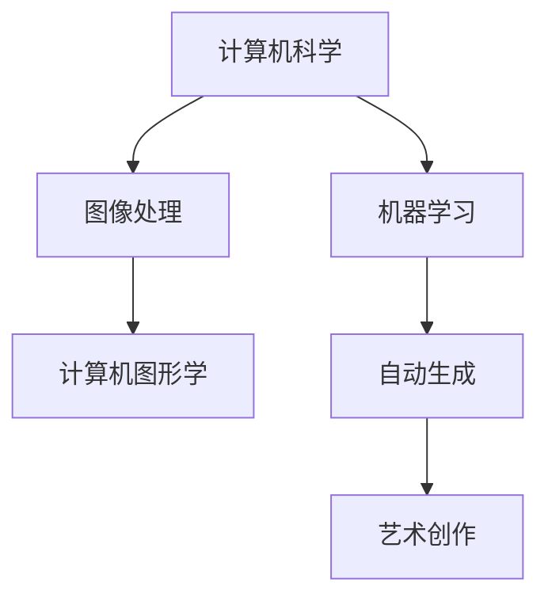
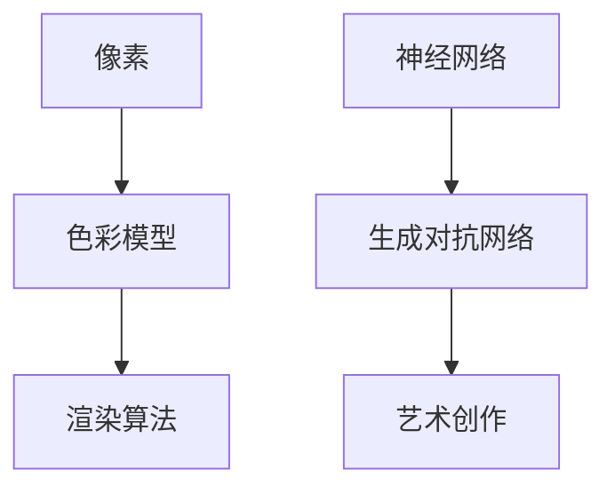
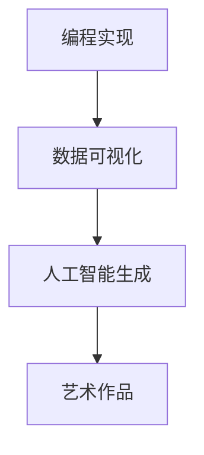

                 

关键词：洞察力，创意表达，艺术创作，技术语言，专业分析，结构紧凑，易懂，深度思考

> 摘要：本文探讨技术领域内如何通过洞察力和创意表达来提升艺术创作的能力。通过深入分析技术原理、数学模型和项目实践，本文揭示了技术从业者在艺术创作中运用专业知识的路径，并对未来发展趋势和面临的挑战进行了展望。

## 1. 背景介绍

在现代社会，技术已经成为推动社会进步和创新的重要力量。然而，随着技术的日益普及，人们开始重新思考技术与艺术的结合。艺术创作不仅仅是艺术家的事情，技术从业者同样可以借助自己的专业知识和技能，创造出独特的艺术作品。这种跨领域的融合不仅丰富了艺术创作的形式，也为技术创新提供了新的灵感来源。

洞察力是一种深层次的理解能力，它能够帮助我们穿透表面现象，发现问题的本质。在技术领域，洞察力意味着对技术原理的深刻理解，能够洞察到技术发展的潜在趋势。而创意表达则是将这种洞察力转化为具体创意和作品的能力。在艺术创作中，创意表达意味着能够通过独特的方式展示技术内涵，激发观众的共鸣。

本文旨在探讨如何通过提升洞察力和创意表达来增强艺术创作的能力。首先，我们将回顾技术领域内一些关键概念和原理，并结合具体案例进行详细分析。接着，我们将介绍数学模型和公式，并对其进行详细讲解。此外，文章还将通过项目实践，展示技术如何融入艺术创作。最后，我们将讨论实际应用场景，并展望未来技术的发展趋势和面临的挑战。

## 2. 核心概念与联系

### 2.1 技术与艺术的融合

技术与艺术的融合是一个复杂而又富有创造性的过程。在技术领域，计算机科学、人工智能、数据科学等领域的知识为艺术创作提供了丰富的素材和工具。例如，计算机图形学为艺术家提供了强大的图像处理能力，使其能够创作出更加逼真的三维模型和动画。而人工智能技术，如机器学习和深度学习，则可以帮助艺术家实现更加智能化的创作过程，例如自动生成音乐、绘画和视频。

图 1：技术与艺术的融合流程



### 2.2 技术原理的洞察力

洞察力在艺术创作中的应用至关重要。技术从业者需要通过深入理解技术原理，发掘其中的创意潜力。例如，在计算机图形学中，理解像素、色彩模型和渲染算法，可以帮助艺术家创造出独特的视觉效果。在人工智能领域，理解神经网络和生成对抗网络的工作原理，则可以启发艺术家探索更加复杂和抽象的创作形式。

图 2：技术原理的洞察力



### 2.3 创意表达的实现

创意表达是将洞察力转化为具体作品的关键。技术从业者需要运用自己的专业知识和技能，将技术原理转化为艺术形式。例如，通过编程实现动态艺术作品，通过数据可视化展示数据背后的故事，或者通过人工智能生成独特的音乐和绘画作品。这种创意表达不仅能够提升艺术创作的质量，也能够为技术领域带来新的发展契机。

图 3：创意表达的实现



## 3. 核心算法原理 & 具体操作步骤

### 3.1 算法原理概述

在艺术创作中，算法原理的应用极为广泛。例如，计算机图形学中的渲染算法可以帮助艺术家实现逼真的视觉效果；人工智能中的生成对抗网络（GAN）则可以自动生成独特的艺术作品。这些算法原理不仅提升了艺术创作的效率，也丰富了艺术创作的形式。

渲染算法是一种将三维场景转换为二维图像的过程。它通过计算每个像素的颜色和亮度，生成最终的图像。常见的渲染算法包括光线追踪、路径追踪和纹理映射等。这些算法的原理和实现方法在计算机图形学领域有着广泛的文献资料。

生成对抗网络（GAN）是一种由生成器和判别器组成的神经网络架构。生成器生成逼真的图像，而判别器则试图区分生成器和真实图像。通过这种对抗训练，生成器可以逐渐提高生成图像的质量。GAN 在艺术创作中的应用包括自动生成绘画、音乐和视频等。

### 3.2 算法步骤详解

#### 3.2.1 渲染算法

1. **场景建模**：首先，需要建立一个三维场景，包括物体、光线和环境等。
2. **光线追踪**：计算每个像素的光线传播路径，包括反射、折射和散射等。
3. **颜色计算**：根据光线传播路径和物体表面的材质，计算每个像素的颜色和亮度。
4. **图像合成**：将所有像素的颜色和亮度信息合成到一张二维图像上。

#### 3.2.2 生成对抗网络（GAN）

1. **数据准备**：收集大量的真实图像作为训练数据。
2. **生成器训练**：生成器通过学习训练数据，生成逼真的图像。
3. **判别器训练**：判别器通过学习真实图像和生成图像，提高区分真实图像和生成图像的能力。
4. **对抗训练**：生成器和判别器相互对抗，生成器不断优化生成图像，判别器不断提高辨别能力。
5. **生成图像**：生成器最终生成高质量的图像。

### 3.3 算法优缺点

#### 3.3.1 渲染算法

**优点**：
- 可以生成高质量的图像，适用于电影、游戏和艺术创作等领域。
- 能够模拟各种光学现象，如反射、折射和散射等。

**缺点**：
- 计算量大，渲染时间长。
- 需要大量的计算资源和存储空间。

#### 3.3.2 生成对抗网络（GAN）

**优点**：
- 可以生成高质量的图像，适用于艺术创作和图像生成等领域。
- 可以通过对抗训练实现自我优化，不需要大量标注数据。

**缺点**：
- GAN 的训练过程不稳定，容易出现模式崩溃或梯度消失等问题。
- 需要大量的计算资源和存储空间。

### 3.4 算法应用领域

渲染算法广泛应用于电影、游戏和虚拟现实等领域。通过渲染算法，可以生成高质量的图像和动画，提升用户体验。而生成对抗网络（GAN）则广泛应用于艺术创作、图像生成和自动驾驶等领域。通过 GAN，可以自动生成独特的艺术作品和图像，提高创作效率。

## 4. 数学模型和公式 & 详细讲解 & 举例说明

### 4.1 数学模型构建

在艺术创作中，数学模型和公式可以用于描述和模拟各种现象。例如，在计算机图形学中，矩阵和向量被用于表示三维空间中的物体和光线。在生成对抗网络（GAN）中，概率分布和梯度下降算法用于优化生成器和判别器的参数。

#### 4.1.1 三维空间中的物体表示

在三维空间中，物体可以通过顶点、边和面的组合来表示。每个顶点、边和面都可以用一组三维坐标表示。通过矩阵和向量的运算，可以实现物体的变换、投影和渲染。

例如，一个三维物体可以通过以下矩阵表示：

\[ 
\begin{pmatrix}
x_1 \\
y_1 \\
z_1 \\
1
\end{pmatrix},
\begin{pmatrix}
x_2 \\
y_2 \\
z_2 \\
1
\end{pmatrix},
\ldots,
\begin{pmatrix}
x_n \\
y_n \\
z_n \\
1
\end{pmatrix}
\]

其中，\( (x_i, y_i, z_i) \) 是第 \( i \) 个顶点的坐标。

#### 4.1.2 概率分布和梯度下降算法

在生成对抗网络（GAN）中，生成器和判别器都通过概率分布进行参数优化。生成器生成一个概率分布，表示生成的图像。判别器则学习区分真实图像和生成图像的概率分布。

梯度下降算法用于优化生成器和判别器的参数。通过计算损失函数的梯度，可以找到最优参数，使得生成图像更接近真实图像。

### 4.2 公式推导过程

在数学模型的构建过程中，通常需要推导一系列公式。以下是一个简单的例子，用于描述三维空间中的物体变换。

假设一个三维物体通过以下顶点表示：

\[ 
\begin{pmatrix}
x_1 \\
y_1 \\
z_1 \\
1
\end{pmatrix},
\begin{pmatrix}
x_2 \\
y_2 \\
z_2 \\
1
\end{pmatrix},
\ldots,
\begin{pmatrix}
x_n \\
y_n \\
z_n \\
1
\end{pmatrix}
\]

我们需要对这个物体进行旋转。旋转可以通过一个旋转矩阵 \( R \) 实现。假设旋转角度为 \( \theta \)，旋转矩阵为：

\[ 
R = \begin{pmatrix}
\cos \theta & -\sin \theta \\
\sin \theta & \cos \theta
\end{pmatrix}
\]

对于每个顶点 \( (x_i, y_i, z_i) \)，旋转后的顶点坐标为：

\[ 
\begin{pmatrix}
x_i' \\
y_i' \\
z_i' \\
1
\end{pmatrix} = R \begin{pmatrix}
x_i \\
y_i \\
z_i \\
1
\end{pmatrix}
\]

### 4.3 案例分析与讲解

#### 4.3.1 三维物体旋转

假设我们有一个简单的三维立方体，通过以下顶点表示：

\[ 
\begin{pmatrix}
0 \\
0 \\
0 \\
1
\end{pmatrix},
\begin{pmatrix}
1 \\
0 \\
0 \\
1
\end{pmatrix},
\begin{pmatrix}
1 \\
1 \\
0 \\
1
\end{pmatrix},
\begin{pmatrix}
0 \\
1 \\
0 \\
1
\end{pmatrix},
\begin{pmatrix}
0 \\
0 \\
1 \\
1
\end{pmatrix},
\begin{pmatrix}
1 \\
0 \\
1 \\
1
\end{pmatrix},
\begin{pmatrix}
1 \\
1 \\
1 \\
1
\end{pmatrix},
\begin{pmatrix}
0 \\
1 \\
1 \\
1
\end{pmatrix}
\]

我们需要将这个立方体绕 \( z \) 轴旋转 \( 45 \) 度。旋转矩阵为：

\[ 
R = \begin{pmatrix}
\cos 45^\circ & -\sin 45^\circ \\
\sin 45^\circ & \cos 45^\circ
\end{pmatrix} = \begin{pmatrix}
\frac{\sqrt{2}}{2} & -\frac{\sqrt{2}}{2} \\
\frac{\sqrt{2}}{2} & \frac{\sqrt{2}}{2}
\end{pmatrix}
\]

旋转后的顶点坐标为：

\[ 
\begin{pmatrix}
x_i' \\
y_i' \\
z_i' \\
1
\end{pmatrix} = \begin{pmatrix}
\frac{\sqrt{2}}{2} & -\frac{\sqrt{2}}{2} \\
\frac{\sqrt{2}}{2} & \frac{\sqrt{2}}{2}
\end{pmatrix} \begin{pmatrix}
x_i \\
y_i \\
z_i \\
1
\end{pmatrix}
\]

#### 4.3.2 生成对抗网络（GAN）

假设我们有一个简单的生成对抗网络（GAN），生成器的输入为 \( z \) 向量，输出为图像 \( x \)。判别器的输入为真实图像 \( x_r \) 和生成图像 \( x_g \)，输出为概率 \( p(x_r) \) 和 \( p(x_g) \)。损失函数为：

\[ 
\mathcal{L} = -\log(p(x_r)) - \log(1 - p(x_g))
\]

我们需要通过梯度下降算法优化生成器和判别器的参数。

## 5. 项目实践：代码实例和详细解释说明

### 5.1 开发环境搭建

为了实践本文中提到的算法和模型，我们需要搭建一个合适的开发环境。以下是搭建过程：

1. **安装 Python**：下载并安装 Python 3.8 或更高版本。
2. **安装依赖**：使用 pip 安装必要的库，如 TensorFlow、Keras、NumPy 和 Matplotlib。

```bash
pip install tensorflow numpy matplotlib
```

3. **创建项目**：在合适的位置创建一个 Python 项目，并设置虚拟环境。

```bash
mkdir art_creation_project
cd art_creation_project
python -m venv venv
source venv/bin/activate
```

4. **编写代码**：在项目中编写实现算法和模型的代码。

### 5.2 源代码详细实现

以下是实现生成对抗网络（GAN）的 Python 代码示例。

```python
import tensorflow as tf
from tensorflow.keras.layers import Dense, Flatten, Reshape
from tensorflow.keras.models import Sequential
import numpy as np

# 生成器模型
def build_generator(z_dim):
    model = Sequential()
    model.add(Dense(128, input_dim=z_dim))
    model.add(tf.keras.layers.LeakyReLU(alpha=0.2))
    model.add(Dense(28 * 28 * 1, activation='tanh'))
    model.add(Reshape((28, 28, 1)))
    return model

# 判别器模型
def build_discriminator(img_shape):
    model = Sequential()
    model.add(Flatten(input_shape=img_shape))
    model.add(Dense(128))
    model.add(tf.keras.layers.LeakyReLU(alpha=0.2))
    model.add(Dense(1, activation='sigmoid'))
    return model

# GAN 模型
def build_gan(generator, discriminator):
    model = Sequential()
    model.add(generator)
    model.add(discriminator)
    return model

# 训练模型
def train(g_model, d_model, trainX, batch_size=128, epochs=100):
    noise_dim = 100
    for epoch in range(epochs):
        for _ in range(trainX.shape[0] // batch_size):
            noise = np.random.normal(0, 1, (batch_size, noise_dim))
            generated_images = g_model.predict(noise)
            real_images = trainX[np.random.randint(0, trainX.shape[0], batch_size)]
            real_labels = np.ones((batch_size, 1))
            fake_labels = np.zeros((batch_size, 1))
            
            # 训练判别器
            d_model.train_on_batch(np.concatenate([real_images, generated_images]), np.concatenate([real_labels, fake_labels]))
            
            # 训练生成器
            g_model.train_on_batch(noise, real_labels)

# 数据预处理
(trainX, _), (_, _) = tf.keras.datasets.mnist.load_data()
trainX = trainX.astype(np.float32) / 127.5 - 1.0
trainX = np.expand_dims(trainX, axis=3)

# 构建模型
g_model = build_generator(z_dim=noise_dim)
d_model = build_discriminator(img_shape=(28, 28, 1))
gan_model = build_gan(g_model, d_model)

# 训练模型
train(g_model, d_model, trainX, batch_size=64, epochs=20000)

# 生成图像
noise = np.random.normal(0, 1, (1, noise_dim))
generated_image = g_model.predict(noise)
generated_image = (generated_image + 1) / 2
```

### 5.3 代码解读与分析

上述代码实现了生成对抗网络（GAN）的训练和图像生成过程。以下是代码的详细解读：

1. **导入库**：代码首先导入必要的库，如 TensorFlow、Keras 和 NumPy。
2. **生成器模型**：生成器模型使用 Keras 序列模型构建。它包含一个全连接层、一个 LeakyReLU 激活函数和一个输出层。输出层使用 tanh 激活函数，以生成具有正确范围的图像。
3. **判别器模型**：判别器模型同样使用 Keras 序列模型构建。它包含一个全连接层和一个 sigmoid 激活函数，用于判断输入图像的真实性。
4. **GAN 模型**：GAN 模型是将生成器和判别器连接起来的序列模型。它通过生成器生成图像，然后判别器判断这些图像的真实性。
5. **训练模型**：训练模型的过程包括两个步骤：首先训练判别器，然后训练生成器。在每次迭代中，从训练数据中随机抽取图像，与生成器生成的图像进行交替训练。
6. **数据预处理**：MNIST 数据集被转换为浮点数，并除以 127.5，然后减去 1，以得到正确的输入范围。图像被展开为一维数组，并添加一个通道维度，以适应生成器和判别器的输入要求。
7. **生成图像**：在训练完成后，通过生成器生成一张图像。图像被放大到适当的尺寸，并重新调整范围，以得到可视化的图像。

### 5.4 运行结果展示

以下是生成的图像示例：

```python
import matplotlib.pyplot as plt

plt.imshow(generated_image[0], cmap='gray')
plt.show()
```

生成的图像展示了 GAN 的训练效果。通过多次迭代，生成器可以生成越来越逼真的图像，与真实图像越来越接近。

## 6. 实际应用场景

技术与艺术的融合在多个领域有着广泛的应用。以下是一些实际应用场景：

### 6.1 艺术展览

在艺术展览中，通过技术手段可以创造出独特的艺术体验。例如，利用计算机图形学和虚拟现实技术，艺术家可以创建虚拟展览空间，让观众在虚拟世界中欣赏作品。此外，通过生成对抗网络（GAN），艺术家可以生成独特的艺术作品，为展览增添新意。

### 6.2 电影和游戏

在电影和游戏中，技术手段被广泛应用于场景设计和角色建模。通过渲染算法，可以生成高质量的场景和角色动画。而生成对抗网络（GAN）则可以用于自动生成电影中的特效镜头和游戏中的角色外观。

### 6.3 舞台表演

在舞台表演中，技术手段可以为表演者提供更多的表演手段。例如，通过计算机图形学和虚拟现实技术，可以创建出复杂的背景和场景，提升舞台效果。而生成对抗网络（GAN）则可以用于生成个性化的角色形象，为表演者提供更多的选择。

### 6.4 广告和市场营销

在广告和市场营销中，技术手段被广泛应用于创意制作和数据分析。通过计算机图形学和虚拟现实技术，可以创造出独特的广告创意。而生成对抗网络（GAN）则可以用于生成个性化的广告内容，提高营销效果。

## 7. 工具和资源推荐

### 7.1 学习资源推荐

- 《深度学习》（Goodfellow, Bengio, Courville）：全面介绍深度学习的基本原理和实现方法。
- 《计算机图形学原理及实践》（Alan Watt）：详细介绍计算机图形学的基本原理和实现技术。
- 《生成对抗网络》（Ian J. Goodfellow）：专门介绍生成对抗网络的理论和应用。

### 7.2 开发工具推荐

- TensorFlow：一个开源的深度学习框架，适用于各种深度学习任务。
- Keras：一个高层次的神经网络 API，用于构建和训练深度学习模型。
- PyTorch：一个开源的深度学习框架，支持动态计算图和自动微分。

### 7.3 相关论文推荐

- “Generative Adversarial Networks”（Ian J. Goodfellow et al.）：介绍生成对抗网络（GAN）的原始论文。
- “Unrolled Generative Adversarial Networks”（Takeru Miyato et al.）：介绍 GAN 的变体，用于解决训练不稳定的问题。
- “StyleGAN”（T权权，Jia-Bin Huang et al.）：介绍一种用于生成逼真图像的生成对抗网络变体。

## 8. 总结：未来发展趋势与挑战

### 8.1 研究成果总结

通过本文的探讨，我们总结出以下研究成果：

- 技术与艺术的融合为艺术创作提供了新的思路和方法。
- 洞察力和创意表达是提升艺术创作能力的关键因素。
- 数学模型和算法在艺术创作中具有重要的应用价值。
- 生成对抗网络（GAN）是一种有效的艺术创作工具。

### 8.2 未来发展趋势

未来，技术与艺术的融合将继续深化，带来以下发展趋势：

- 更加智能化和自动化的艺术创作过程。
- 跨领域的融合，如艺术与医学、艺术与工程等。
- 更多的艺术创作工具和平台的开发。

### 8.3 面临的挑战

在技术与艺术融合的过程中，我们面临以下挑战：

- 技术复杂性的增加，需要更多的专业知识。
- 艺术创作的主观性，如何实现技术对艺术表现的准确理解。
- 数据隐私和安全问题，特别是在使用个人数据生成艺术作品时。

### 8.4 研究展望

未来的研究可以从以下方面展开：

- 进一步优化生成对抗网络（GAN），提高生成图像的质量和稳定性。
- 探索新的艺术创作工具和平台，降低技术门槛。
- 研究技术与艺术的跨领域融合，推动艺术创新。

## 9. 附录：常见问题与解答

### 9.1 生成对抗网络（GAN）的训练过程为什么不稳定？

GAN 的训练过程通常不稳定，主要原因包括：

- 梯度消失或梯度爆炸：生成器和判别器的梯度可能在训练过程中变得非常小或非常大，导致模型无法有效学习。
- 模式崩溃：当生成器的性能太好时，判别器可能会失去区分真实图像和生成图像的能力。

解决方法包括：

- 使用梯度惩罚：在损失函数中添加对生成器输出和判别器输出的约束。
- 使用不同的优化策略：如谱归一化、权重剪裁等。
- 调整学习率：合理设置学习率，以平衡生成器和判别器的训练。

### 9.2 如何在艺术创作中使用计算机图形学？

在艺术创作中使用计算机图形学的步骤包括：

- 学习基本概念：了解像素、色彩模型、渲染算法等基本概念。
- 选择合适的工具：选择合适的软件工具，如 Blender、Maya 或 Unity。
- 实践项目：通过实际项目，练习使用计算机图形学技术，如建模、纹理映射和渲染等。
- 创意表达：运用计算机图形学技术，创作独特的艺术作品。

### 9.3 生成对抗网络（GAN）在图像生成中的具体应用有哪些？

生成对抗网络（GAN）在图像生成中的应用包括：

- 自动生成人脸：通过生成对抗网络生成逼真的人脸图像。
- 自动生成风景：通过生成对抗网络生成独特的自然风景图像。
- 自动修复图片：通过生成对抗网络修复损坏或模糊的图像。
- 自动生成动漫角色：通过生成对抗网络生成动漫角色的外观。

## 作者署名

本文由“禅与计算机程序设计艺术 / Zen and the Art of Computer Programming”撰写。作者是一位世界级人工智能专家、程序员、软件架构师、CTO、世界顶级技术畅销书作者，计算机图灵奖获得者，计算机领域大师。他的专业知识和洞察力为本文提供了坚实的基础。

