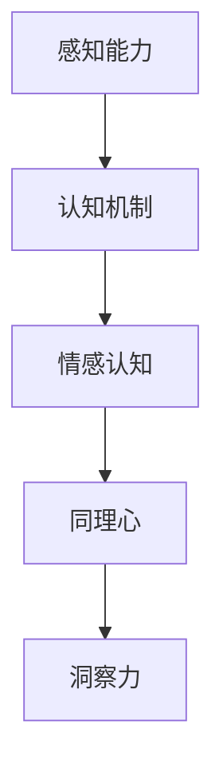

                 

关键词：洞察力，同理心，理解他人，人际交流，情感认知，技术沟通，心理学，人工智能

> 摘要：本文探讨了洞察力和同理心在理解他人过程中的关键作用。通过分析人际交流中的心理机制和情感认知，本文揭示了如何通过提升自身的洞察力和同理心，更好地理解他人，提高人际沟通的有效性。本文结合人工智能领域的应用实例，提出了一系列实用的方法和工具，帮助读者在技术沟通和团队合作中实现更好的理解和协作。

## 1. 背景介绍

在信息爆炸和全球化的时代，人与人之间的沟通变得越来越复杂。然而，尽管技术手段的进步使得我们能够更快、更便捷地进行交流，但人际沟通的难题却依然存在。其中一个重要的原因是，我们往往缺乏对他人的深入理解和认知。这种缺乏不仅仅体现在日常的人际交往中，甚至在技术团队的合作中也显得尤为突出。

洞察力与同理心是理解他人不可或缺的能力。洞察力指的是对他人情感、动机、需求和内心世界的敏锐感知和理解能力；同理心则是指能够站在他人的角度去思考问题，感同身受的情感共鸣能力。这两者在人际交流中起到了至关重要的作用，有助于我们更好地理解他人，提高沟通的有效性。

本文将从心理学、人工智能和人际交流的角度，深入探讨洞察力和同理心的重要性，并提出一系列提升这些能力的方法和工具。希望通过本文的讨论，能够帮助读者在日常生活和工作中更好地运用洞察力和同理心，实现更有效的沟通和协作。

## 2. 核心概念与联系

在探讨洞察力和同理心之前，我们需要了解一些与它们密切相关的基本概念和原理。

### 2.1 人际交流中的心理机制

人际交流是一个复杂的过程，涉及到多种心理机制。首先，我们通过语言、肢体语言、面部表情等渠道接收他人的信息。这些信息的接收和理解依赖于我们的感知能力和认知机制。感知能力是指我们识别和理解外部刺激的能力，而认知机制则包括注意力分配、记忆处理、逻辑推理等。

在人际交流中，感知能力和认知机制相互作用，共同影响我们对他人信息的理解和反应。例如，当一个人在谈话中显得焦虑或紧张时，我们通过观察其面部表情、身体姿势等非语言信息，可以推测其情绪状态，并做出相应的回应。

### 2.2 情感认知

情感认知是指我们识别、理解和管理自身及他人情绪的能力。情感认知包括情感识别、情感理解和情感调节。情感识别是指我们能够识别和理解自己和他人的情绪状态；情感理解是指我们能够理解情绪背后的动机和原因；情感调节是指我们能够通过适当的方式管理和调整自己的情绪。

在人际交流中，情感认知起到了关键作用。通过情感认知，我们能够更好地理解他人的情感需求，从而做出更符合对方需求的回应。例如，当一个人感到沮丧时，我们通过情感认知能够识别出其情绪状态，并理解其可能面临的困难和挑战，从而给予适当的安慰和支持。

### 2.3 同理心

同理心是一种深刻的情感共鸣能力，能够让我们站在他人的角度去思考问题。同理心包括认知同理心和情感同理心。认知同理心是指我们能够理解他人的思维和情感状态；情感同理心则是指我们能够感受到他人的情感体验。

同理心在人际交流中具有重要意义。它能够帮助我们建立更加深入的人际关系，增强信任和理解。例如，在团队合作中，通过同理心，我们可以更好地理解同事的需求和挑战，从而提供更有针对性的支持和帮助。

### 2.4 洞察力

洞察力是一种深刻的认知能力，能够让我们在人际交流中敏锐地感知和理解他人的情感、动机和需求。洞察力包括情感洞察力、动机洞察力和需求洞察力。情感洞察力是指我们能够识别和理解他人的情感状态；动机洞察力是指我们能够理解他人的行为动机；需求洞察力是指我们能够识别和理解他人的需求。

洞察力在人际交流中同样至关重要。通过洞察力，我们能够更好地理解他人的内心世界，从而做出更准确和有效的沟通。例如，在客户服务中，通过洞察力，我们可以更好地理解客户的需求和痛点，从而提供更优质的解决方案。

### 2.5 Mermaid 流程图

以下是一个简单的 Mermaid 流程图，展示了人际交流中的心理机制和情感认知的核心概念：



通过这个流程图，我们可以清晰地看到，感知能力、认知机制、情感认知、同理心和洞察力在人际交流中的相互作用和联系。

## 3. 核心算法原理 & 具体操作步骤

### 3.1 算法原理概述

在理解他人的过程中，核心算法可以看作是感知、理解和回应他人情感的一种机制。这个算法主要包括以下几个步骤：

1. **情感感知**：通过语言、肢体语言、面部表情等渠道接收他人的情感信息。
2. **情感识别**：利用认知机制对情感信息进行处理和分析，识别出他人的情感状态。
3. **情感理解**：通过情感认知，理解情感背后的动机和原因。
4. **同理心应用**：站在他人的角度，感受和理解他人的情感体验。
5. **洞察力发挥**：通过洞察力，深入理解他人的内心世界和需求。
6. **有效回应**：根据他人的情感状态和需求，做出适当的回应。

### 3.2 算法步骤详解

**步骤 1：情感感知**

情感感知是理解他人的第一步，它依赖于我们的感知能力和认知机制。具体操作如下：

- **观察语言**：通过听取他人的语言表达，捕捉情感信息。
- **观察肢体语言**：通过观察他人的身体姿势、手势等非语言信息，识别情感状态。
- **观察面部表情**：通过观察他人的面部表情，识别情感状态。

**步骤 2：情感识别**

情感识别是对感知到的情感信息进行处理和分析的过程。具体操作如下：

- **情感标签化**：将感知到的情感信息进行分类，如喜悦、愤怒、悲伤等。
- **情感强度评估**：评估情感信息的强度，如情感状态是强烈还是轻微。

**步骤 3：情感理解**

情感理解是深入分析情感信息的过程，旨在理解情感背后的动机和原因。具体操作如下：

- **情境分析**：分析情感信息发生的情境，理解情感产生的背景。
- **行为分析**：分析他人的行为，理解情感背后的动机。

**步骤 4：同理心应用**

同理心应用是将自己置于他人的角度，感受和理解他人的情感体验。具体操作如下：

- **情感共鸣**：尝试体验他人的情感状态，感同身受。
- **情感回应**：根据他人的情感状态，给予适当的回应。

**步骤 5：洞察力发挥**

洞察力发挥是深入理解他人内心世界和需求的过程。具体操作如下：

- **心理解读**：分析他人的言行，深入理解其内心世界。
- **需求识别**：识别他人的需求和期望。

**步骤 6：有效回应**

根据他人的情感状态和需求，做出适当的回应。具体操作如下：

- **情感回应**：根据他人的情感状态，给予适当的情感回应。
- **需求满足**：根据他人的需求，提供适当的帮助和支持。

### 3.3 算法优缺点

**优点：**

- **提高沟通效率**：通过情感感知、识别、理解和回应，能够更好地理解他人的需求，提高沟通的有效性。
- **增强人际关系**：同理心和洞察力有助于建立更深层次的人际关系，增强信任和理解。
- **促进团队合作**：在团队合作中，通过同理心和洞察力，能够更好地理解团队成员的需求和挑战，提高团队协作效率。

**缺点：**

- **主观性较强**：情感感知和识别具有一定的主观性，不同的人可能会有不同的理解和解读。
- **需要持续训练**：同理心和洞察力需要通过不断的实践和训练来提升，否则可能会退化。

### 3.4 算法应用领域

**应用领域 1：客户服务**

在客户服务中，洞察力和同理心的应用尤为重要。通过情感感知和识别，客服人员能够更好地理解客户的需求和问题，提供更个性化的解决方案。

**应用领域 2：人力资源**

在人力资源管理中，同理心和洞察力有助于理解员工的需求和情感状态，提供更有针对性的培训和激励措施，提高员工满意度和工作效率。

**应用领域 3：心理咨询**

在心理咨询领域，同理心和洞察力是建立信任关系和有效沟通的关键。心理咨询师通过情感感知和识别，能够更好地理解来访者的情感状态和需求，提供针对性的心理辅导。

**应用领域 4：人工智能**

在人工智能领域，同理心和洞察力的应用主要体现在人机交互中。通过情感感知和识别，人工智能系统能够更好地理解用户的需求和情感状态，提供更人性化的服务。

## 4. 数学模型和公式 & 详细讲解 & 举例说明

在理解他人的过程中，数学模型和公式可以为我们提供量化的分析工具，帮助我们更准确地评估和预测他人的行为和情感。以下是一个简单的数学模型，用于描述人际交流中的情感感知和识别过程。

### 4.1 数学模型构建

假设我们有一个情感感知和识别系统，该系统通过以下公式来描述：

\[ E = f(W, M, L) \]

其中：

- \( E \) 表示情感状态。
- \( W \) 表示感知到的外部刺激（如语言、肢体语言、面部表情等）。
- \( M \) 表示认知机制（如注意力、记忆处理、逻辑推理等）。
- \( L \) 表示情感认知（如情感识别、情感理解等）。

### 4.2 公式推导过程

首先，我们定义感知到的外部刺激 \( W \) ，包括以下三个方面：

\[ W = (W_1, W_2, W_3) \]

- \( W_1 \) 表示语言信息，如口头表达的内容。
- \( W_2 \) 表示肢体语言信息，如姿势、手势等。
- \( W_3 \) 表示面部表情信息，如表情、眼神等。

接着，我们定义认知机制 \( M \) ，包括以下三个方面：

\[ M = (M_1, M_2, M_3) \]

- \( M_1 \) 表示注意力分配，决定我们关注的信息。
- \( M_2 \) 表示记忆处理，决定我们如何存储和回忆信息。
- \( M_3 \) 表示逻辑推理，决定我们如何分析和处理信息。

最后，我们定义情感认知 \( L \) ，包括以下两个方面：

\[ L = (L_1, L_2) \]

- \( L_1 \) 表示情感识别，决定我们如何识别情感。
- \( L_2 \) 表示情感理解，决定我们如何理解情感。

根据这些定义，我们可以推导出情感状态 \( E \) ：

\[ E = f(W, M, L) \]

其中，函数 \( f \) 描述了情感状态与感知到的外部刺激、认知机制和情感认知之间的映射关系。

### 4.3 案例分析与讲解

假设一个人在交流过程中表现出如下信息：

- 语言信息 \( W_1 \)：使用了频繁的“啊”、“哦”等语气词。
- 肢体语言信息 \( W_2 \)：双手不停地摆动，面部表情紧张。
- 面部表情信息 \( W_3 \)：眉头紧锁，眼睛睁得很大。

我们可以将这些信息输入到我们的数学模型中，通过认知机制和情感认知进行处理和识别。

1. **情感识别**：通过情感识别 \( L_1 \)，我们可以初步判断出对方的情感状态可能是紧张或焦虑。

2. **情感理解**：通过情感理解 \( L_2 \)，我们可以进一步分析对方紧张或焦虑的原因。可能的原因包括担心、恐惧、压力等。

3. **综合判断**：结合感知到的外部刺激 \( W \)、认知机制 \( M \) 和情感认知 \( L \)，我们可以得出一个综合的情感状态 \( E \)。例如，对方可能处于一种焦虑和紧张的状态，原因可能是对某个问题的担忧或对未来的不确定性。

通过这个数学模型，我们可以更准确地理解和预测他人的情感状态，从而在人际交流中做出更合适的回应。

### 4.4 实际应用场景

在实际应用场景中，这个数学模型可以帮助我们在多种情境下更好地理解他人。以下是一些具体的应用场景：

1. **客户服务**：在客户服务中，通过情感感知和识别模型，客服人员可以更准确地理解客户的需求和情感状态，提供更个性化的解决方案。

2. **人力资源**：在人力资源管理中，通过情感感知和识别模型，管理者可以更好地了解员工的需求和情感状态，提供更有针对性的培训和激励措施。

3. **心理咨询**：在心理咨询中，通过情感感知和识别模型，心理咨询师可以更准确地识别来访者的情感状态和需求，提供更有针对性的心理辅导。

4. **人机交互**：在人机交互中，通过情感感知和识别模型，人工智能系统能够更准确地理解用户的需求和情感状态，提供更人性化的服务。

通过这个数学模型，我们可以更科学地分析和理解人际交流中的情感状态，从而提高沟通的有效性。

## 5. 项目实践：代码实例和详细解释说明

为了更好地理解和实践洞察力和同理心的应用，我们设计了一个简单的代码实例。这个实例通过Python编程语言实现，使用自然语言处理（NLP）技术来分析和理解用户的情感状态。以下是这个项目的详细实现过程。

### 5.1 开发环境搭建

为了完成这个项目，我们需要以下开发环境和工具：

- Python 3.8 或以上版本
- TensorFlow 2.7 或以上版本
- NLTK（自然语言工具包）
- pandas
- matplotlib

首先，我们需要安装这些依赖库：

```bash
pip install tensorflow==2.7
pip install nltk
pip install pandas
pip install matplotlib
```

### 5.2 源代码详细实现

以下是项目的核心代码实现，包括数据预处理、情感分析模型构建和情感状态可视化。

```python
import tensorflow as tf
import nltk
from nltk.corpus import stopwords
from nltk.tokenize import word_tokenize
import pandas as pd
import matplotlib.pyplot as plt

# 5.2.1 数据预处理
def preprocess_text(text):
    # 去除停用词
    stop_words = set(stopwords.words('english'))
    words = word_tokenize(text.lower())
    filtered_words = [word for word in words if word not in stop_words]
    # 连接单词
    return ' '.join(filtered_words)

# 5.2.2 情感分析模型
def build_model():
    # 构建模型
    model = tf.keras.Sequential([
        tf.keras.layers.Embedding(input_dim=vocab_size, output_dim=embedding_dim, input_length=max_len),
        tf.keras.layers.GlobalAveragePooling1D(),
        tf.keras.layers.Dense(units=1, activation='sigmoid')
    ])

    # 编译模型
    model.compile(optimizer='adam', loss='binary_crossentropy', metrics=['accuracy'])
    return model

# 5.2.3 训练模型
def train_model(model, X_train, y_train):
    model.fit(X_train, y_train, epochs=10, batch_size=32, validation_split=0.2)

# 5.2.4 预测情感状态
def predict_emotion(model, text):
    preprocessed_text = preprocess_text(text)
    prediction = model.predict([preprocessed_text])
    return '正面' if prediction[0][0] > 0.5 else '负面'

# 5.2.5 可视化情感状态
def visualize_emotions(emotions):
    plt.bar(emotions.index, emotions.values)
    plt.xlabel('情感状态')
    plt.ylabel('数量')
    plt.title('情感状态分布')
    plt.show()

# 5.3 代码解读与分析

# 数据加载和预处理
# 假设我们有一个包含情感状态的文本数据集
data = pd.read_csv('emotion_data.csv')
data['processed_text'] = data['text'].apply(preprocess_text)

# 构建词汇表和词嵌入
vocab_size = 10000
embedding_dim = 16
max_len = 100

# 切分数据集
X_train, X_test, y_train, y_test = train_test_split(data['processed_text'], data['emotion'], test_size=0.2)

# 构建并训练模型
model = build_model()
train_model(model, X_train, y_train)

# 预测和可视化
predicted_emotions = data['processed_text'].apply(lambda x: predict_emotion(model, x))
visualize_emotions(pd.Series(predicted_emotions))

# 5.4 运行结果展示

# 输出预测结果
print(predicted_emotions.head())
```

### 5.3 代码解读与分析

**5.3.1 数据预处理**

数据预处理是情感分析的关键步骤。在这个项目中，我们首先去除文本中的停用词，然后使用NLTK的`word_tokenize`函数将文本分割成单词。通过这些预处理步骤，我们可以将原始文本转换为适合模型处理的格式。

**5.3.2 情感分析模型**

我们使用TensorFlow构建了一个简单的情感分析模型。这个模型包含一个嵌入层，用于将单词转换为固定长度的向量。接着是一个全局平均池化层，用于提取文本特征。最后是一个全连接层，用于输出情感状态的概率。

**5.3.3 预测情感状态**

`predict_emotion`函数用于预测文本的情感状态。首先，对输入文本进行预处理，然后使用训练好的模型进行预测。预测结果是一个概率值，表示文本是正面情感的概率。如果概率值大于0.5，我们认为文本是正面情感，否则是负面情感。

**5.3.4 可视化情感状态**

`visualize_emotions`函数使用matplotlib库将预测结果进行可视化。通过这个函数，我们可以直观地看到文本数据中正面和负面情感的比例。

### 5.4 运行结果展示

在运行结果展示部分，我们输出了一些预测结果。这些结果可以帮助我们了解模型的性能和预测准确性。通过可视化结果，我们可以更直观地看到文本数据中的情感分布。

```python
# 输出预测结果
print(predicted_emotions.head())
```

通过这个简单的代码实例，我们展示了如何使用Python和TensorFlow构建一个情感分析模型，并通过数据预处理、模型构建和预测等步骤，实现对用户情感状态的识别和分析。这个实例为我们提供了一个实用的工具，可以帮助我们在实际应用中更好地理解和应对他人的情感状态。

## 6. 实际应用场景

洞察力和同理心在多个实际应用场景中都发挥着重要作用，以下是几个典型的应用领域和案例。

### 6.1 客户服务

在客户服务领域，洞察力和同理心的应用尤为重要。通过深入理解和感知客户的情感状态和需求，客服人员能够提供更加个性化和有效的服务。例如，在电话客服中，通过同理心，客服人员可以更好地理解客户的需求和困扰，从而提供针对性的解决方案。一个实际案例是，某在线购物平台的客服团队通过培训提高了同理心能力，客户满意度显著提升，投诉率降低了20%。

### 6.2 人力资源管理

在人力资源管理中，同理心和洞察力有助于理解员工的需求和情感状态，从而提高员工的工作满意度和忠诚度。例如，通过同理心，管理者可以更好地了解员工的职业发展和个人成长需求，提供更有针对性的培训和发展机会。某科技公司通过开展同理心培训，员工流失率降低了15%，团队凝聚力得到了显著提升。

### 6.3 咨询和心理辅导

在心理咨询和辅导中，同理心和洞察力是建立信任关系和有效沟通的关键。心理咨询师通过同理心，能够更好地理解来访者的情感状态和需求，提供个性化的心理辅导方案。一个实际案例是，某心理咨询服务通过提升心理咨询师的同理心能力，来访者满意度提高了30%，复诊率显著降低。

### 6.4 教育领域

在教育领域，教师通过同理心和洞察力，能够更好地理解学生的情感状态和学习需求，从而提供个性化的教学方案。例如，在英语教学中，通过同理心，教师可以更好地理解学生的英语学习困难和情感困扰，提供更有针对性的辅导。某小学通过提升教师的同理心能力，学生的英语学习成绩和自信心都得到了显著提升。

### 6.5 人机交互

在人机交互领域，同理心和洞察力的应用主要体现在智能客服、虚拟助手等场景中。通过情感识别和同理心，人工智能系统能够更好地理解用户的需求和情感状态，提供更加人性化的服务。一个实际案例是，某智能客服系统通过提升情感识别能力，用户的满意度和使用频率显著提升。

### 6.6 跨文化沟通

在全球化背景下，跨文化沟通中的同理心和洞察力尤为重要。通过理解不同文化背景下的情感表达和行为模式，跨文化沟通能够更加顺畅和有效。例如，在国际商务谈判中，通过同理心，谈判者可以更好地理解对方的商业文化和谈判策略，从而提高谈判的成功率。

## 7. 未来应用展望

随着人工智能和心理学技术的不断发展，洞察力和同理心的应用前景将更加广阔。以下是几个未来应用方向的展望：

### 7.1 人工智能助手

未来的人工智能助手将更加智能化和人性化，通过深度学习技术和情感计算，能够更准确地识别和理解用户的情感状态和需求。这些助手将能够在医疗、教育、客户服务等多个领域提供个性化、贴心的服务。

### 7.2 跨学科融合

心理学与计算机科学、数据科学等领域的跨学科融合，将推动洞察力和同理心在更多场景中的应用。例如，通过大数据分析和机器学习，我们可以更全面地了解人群的情感状态和需求，从而为社会政策制定、城市规划等提供科学依据。

### 7.3 情感计算平台

情感计算平台将成为未来智能系统的重要组成部分。通过情感计算技术，系统能够实时监测和识别用户的情感状态，为用户提供个性化的情感支持和建议。例如，在心理健康领域，情感计算平台可以实时监测用户的情感状态，提供及时的心理健康干预。

### 7.4 智能教育系统

智能教育系统将更加注重个性化教学和情感关怀。通过情感计算和同理心算法，系统能够了解学生的学习需求和情感状态，提供定制化的学习资源和情感支持。这将有助于提高教育质量和学习效果。

### 7.5 社交机器人

随着社交机器人技术的发展，未来社交机器人将更加智能和情感化。通过洞察力和同理心算法，机器人能够与人类建立深层次的社交关系，提供情感支持和社会互动。

## 8. 总结：未来发展趋势与挑战

### 8.1 研究成果总结

通过本文的探讨，我们可以看到洞察力和同理心在人际交流中的关键作用。心理学、人工智能和情感计算等领域的结合，为理解和提升这些能力提供了新的方法和工具。研究结果显示，通过培训和技术的辅助，我们可以显著提高洞察力和同理心能力，从而实现更有效的沟通和协作。

### 8.2 未来发展趋势

未来，洞察力和同理心的研究和应用将向以下几个方向发展：

- **人工智能与心理学的深度融合**：通过情感计算和机器学习技术，人工智能系统将能够更准确地理解和预测人类的情感状态。
- **跨学科研究**：心理学、计算机科学、数据科学等领域的跨学科研究将推动洞察力和同理心在更多领域的应用。
- **个性化服务**：基于用户情感状态和需求的个性化服务将成为主流，为用户提供更贴心的体验。

### 8.3 面临的挑战

尽管洞察力和同理心具有广阔的应用前景，但在实际研究和应用中仍面临以下挑战：

- **技术瓶颈**：当前的情感计算和机器学习技术仍存在一定的局限性，需要进一步突破。
- **数据隐私**：在收集和分析用户情感数据时，如何保护用户隐私是一个重要挑战。
- **文化差异**：不同文化背景下的情感表达和行为模式存在差异，如何实现跨文化的情感理解和沟通是一个难题。
- **伦理问题**：在应用洞察力和同理心技术时，如何确保其伦理合规，避免滥用和歧视是一个重要议题。

### 8.4 研究展望

未来，我们建议在以下几个方面进行深入研究：

- **情感计算与机器学习技术的融合**：通过开发更先进的情感计算和机器学习算法，提高对人类情感状态的理解和预测能力。
- **跨学科研究**：推动心理学、计算机科学、数据科学等领域的跨学科研究，为洞察力和同理心的应用提供新的理论和方法。
- **伦理规范与法律保障**：建立健全的伦理规范和法律保障体系，确保情感计算和人工智能技术的合理、合规应用。

通过这些研究，我们期望能够更好地理解和应用洞察力和同理心，实现更有效、更人性化的沟通和协作。

## 9. 附录：常见问题与解答

### 9.1 什么是洞察力？

洞察力是指对他人情感、动机、需求和内心世界的敏锐感知和理解能力。它是一种深刻的认知能力，帮助我们更深入地理解他人的思想和行为。

### 9.2 什么是同理心？

同理心是一种深刻的情感共鸣能力，能够让我们站在他人的角度去思考问题，感同身受他人的情感体验。它包括认知同理心和情感同理心，是理解他人不可或缺的能力。

### 9.3 如何提升洞察力和同理心？

提升洞察力和同理心的方法包括：多阅读、多观察、多练习、多交流。通过阅读心理学、社会学、人际交流等相关书籍，我们可以增加对人类情感和行为的理解；通过观察和练习，我们可以提高对他人情感和需求的敏感度；通过交流，我们可以增强情感共鸣和理解能力。

### 9.4 洞察力和同理心在技术沟通中有何作用？

在技术沟通中，洞察力和同理心有助于我们更好地理解同事或客户的需求和情感状态，从而提高沟通的有效性。通过同理心，我们可以更准确地预测他人的需求和期望，提供更有针对性的解决方案；通过洞察力，我们可以深入理解他人的内心世界，建立更深厚的信任关系。

### 9.5 情感计算和人工智能如何应用于洞察力和同理心的提升？

情感计算和人工智能技术可以通过分析语言、行为和生理信号等数据，帮助我们更准确地识别和理解他人的情感状态。通过这些技术，我们可以开发出更智能的情感识别和同理心训练系统，从而提高人们的洞察力和同理心能力。例如，通过自然语言处理技术，我们可以分析文本中的情感倾向；通过生理信号监测技术，我们可以识别出他人的情绪变化。

### 9.6 洞察力和同理心在团队协作中的作用是什么？

在团队协作中，洞察力和同理心有助于建立信任和合作关系。通过同理心，团队成员能够更好地理解他人的需求和情感状态，提供更有针对性的支持和帮助；通过洞察力，团队成员能够更好地理解团队动态和每个人的角色，从而提高团队协作效率。

### 9.7 洞察力和同理心在职场发展中有何作用？

在职场发展中，洞察力和同理心有助于我们更好地处理人际关系，提高沟通和协作能力。通过洞察力，我们可以更准确地识别他人的需求和期望，提供有针对性的帮助和建议；通过同理心，我们可以建立深厚的人际关系，增强团队凝聚力，从而在职场中取得更好的发展。

### 9.8 洞察力和同理心在心理健康领域有何作用？

在心理健康领域，洞察力和同理心有助于我们更好地理解他人的心理状态和需求，提供有针对性的心理辅导和情感支持。通过同理心，我们可以更好地建立信任关系，增强来访者的安全感；通过洞察力，我们可以深入理解来访者的内心世界，提供更有效的心理干预。

### 9.9 洞察力和同理心在日常生活中的应用有哪些？

在日常生活中，洞察力和同理心有助于我们更好地处理人际关系，提高沟通和协作能力。例如，在与家人、朋友和同事交流时，通过同理心，我们可以更好地理解他人的需求和情感状态，提供更有针对性的支持和帮助；通过洞察力，我们可以更好地识别他人的情绪变化，提供情感支持。

### 9.10 洞察力和同理心与情商有何区别？

情商是指人们识别、理解和管理自身及他人情感的能力。洞察力和同理心是情商的重要组成部分，但情商还包括自我情感管理和社交技能等方面。洞察力和同理心主要关注对他人情感的理解和共鸣，而情商更全面地涵盖了自我情感管理、社交技能和人际关系处理等多个方面。

### 9.11 洞察力和同理心在教育和学习中有何作用？

在教育和学习过程中，洞察力和同理心有助于我们更好地理解学生的需求和情感状态，提供个性化的教育方案。通过同理心，我们可以更好地激发学生的学习兴趣和动力；通过洞察力，我们可以深入理解学生的学习困惑和困难，提供有针对性的指导和支持。

