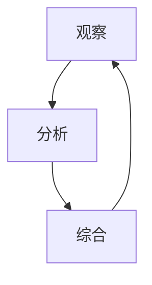

                 

关键词：洞察力、观察、分析、综合能力、IT领域、技术博客、专业文章

> 摘要：本文将探讨在IT领域中，如何通过观察、分析和综合能力来培养洞察力，进而提高问题解决能力和创新能力。文章从背景介绍、核心概念、算法原理、数学模型、项目实践、应用场景、工具和资源推荐、总结与展望等多个方面进行深入阐述，旨在为读者提供一套全面而实用的方法，帮助他们提升在IT领域的专业素养和职业竞争力。

## 1. 背景介绍

在当今快速发展的信息技术时代，各种复杂的技术问题和挑战层出不穷。面对这些问题，仅仅依靠传统的编程技能和理论知识已经难以应对。越来越多的IT从业者开始意识到，洞察力的培养对于解决复杂问题、推动技术创新具有重要意义。洞察力是指从表面现象中识别出本质规律，从而对问题进行深刻理解和创造性解决的能力。在IT领域中，洞察力不仅体现在对代码的编写和维护上，还包括对系统架构、算法设计、数据挖掘、人工智能等多个领域的理解和应用。

### 1.1 研究意义

随着技术的不断发展，IT领域的问题日益复杂，传统的思维方式和解决问题的方法已经无法满足需求。洞察力作为一种高级认知能力，有助于我们从宏观和微观两个层面把握问题的本质，从而找到更加高效和创新的解决方案。在IT领域中，培养洞察力不仅有助于提升个人的专业素养，还能够推动整个行业的技术创新和进步。

### 1.2 文章结构

本文将分为以下几个部分：

- **背景介绍**：简要介绍IT领域中洞察力的重要性。
- **核心概念与联系**：阐述观察、分析和综合能力在洞察力培养中的作用。
- **核心算法原理 & 具体操作步骤**：详细介绍一种核心算法及其原理和操作步骤。
- **数学模型和公式 & 详细讲解 & 举例说明**：介绍相关数学模型和公式的构建、推导和应用。
- **项目实践：代码实例和详细解释说明**：通过实际项目案例展示算法和模型的应用。
- **实际应用场景**：探讨洞察力在IT领域的各种应用场景。
- **工具和资源推荐**：推荐相关学习资源、开发工具和论文。
- **总结：未来发展趋势与挑战**：总结研究成果，展望未来发展趋势和面临的挑战。

## 2. 核心概念与联系

在培养洞察力的过程中，观察、分析和综合能力是不可或缺的核心要素。下面我们将逐一介绍这些概念，并阐述它们在洞察力培养中的联系。

### 2.1 观察

观察是指对事物进行仔细、系统的观察和分析，以获取相关信息和规律。在IT领域中，观察能力主要体现在以下几个方面：

- **系统观察**：从整体和局部两个层面观察系统，识别系统的结构、功能和运行机制。
- **细节观察**：关注系统中的细节，挖掘潜在的问题和改进机会。
- **比较观察**：通过对比不同系统、组件或算法，发现优势和劣势。

观察能力有助于我们理解系统的真实状态，从而为分析和综合提供基础。

### 2.2 分析

分析是指将复杂的问题分解为若干部分，然后对各个部分进行深入研究，以揭示其内在联系和规律。在IT领域中，分析能力主要包括以下几种：

- **逻辑分析**：运用逻辑思维，对问题进行分解和推理，找到问题的根本原因。
- **统计分析**：通过对数据进行分析，发现数据之间的关联和趋势，为决策提供依据。
- **算法分析**：分析算法的效率、正确性和稳定性，评估算法的性能。

分析能力有助于我们深入理解问题，找到解决方案。

### 2.3 综合

综合是指将分析得到的各个部分整合起来，形成一个完整的、有内在联系的整体。在IT领域中，综合能力主要体现在以下几个方面：

- **系统整合**：将各个模块或组件整合为一个完整的系统，确保系统的稳定性和性能。
- **方案整合**：将多种解决方案进行综合，选择最优的方案。
- **知识整合**：将不同领域的知识整合起来，为解决复杂问题提供理论支持。

综合能力有助于我们将分析结果应用于实际问题，实现创新和改进。

### 2.4 观察、分析和综合能力的联系

观察、分析和综合能力是相互关联、相互促进的。观察为分析和综合提供了基础，分析为观察和综合提供了深入理解，而综合则为观察和分析提供了实践应用。下面是一个简化的 Mermaid 流程图，展示了这三个能力之间的联系：



通过观察、分析和综合，我们可以不断提高洞察力，从而更好地应对IT领域中的各种复杂问题。

## 3. 核心算法原理 & 具体操作步骤

在培养洞察力的过程中，核心算法原理的理解和掌握至关重要。本文将介绍一种在IT领域中广泛应用的核心算法——动态规划算法，并详细阐述其原理和操作步骤。

### 3.1 算法原理概述

动态规划算法是一种在序列决策过程中，通过将问题分解为子问题并求解子问题，从而得到最优解的方法。其基本思想是将复杂的问题转化为若干个简单的问题，并利用子问题的解来构建原问题的解。

动态规划算法的主要特点如下：

- **重叠子问题**：动态规划算法通过递归关系将问题分解为子问题，而这些子问题往往是重叠的，即不同的子问题可能具有相同的解。
- **最优子结构**：动态规划算法基于最优子结构原理，即一个问题的最优解可以通过其子问题的最优解来构建。
- **状态转移方程**：动态规划算法通过状态转移方程来描述子问题之间的关系，从而实现子问题的求解。

### 3.2 算法步骤详解

动态规划算法的基本步骤如下：

#### 3.2.1 确定状态

首先，我们需要确定动态规划算法中的状态。状态表示问题的一个特定方面，通常是一个变量或一组变量。在动态规划算法中，状态通常与输入数据相关联。

#### 3.2.2 确定状态转移方程

状态转移方程描述了子问题之间的关系，即如何通过子问题的解来构建原问题的解。状态转移方程通常是一个递归关系，可以用来计算子问题的解。

#### 3.2.3 确定边界条件

边界条件是动态规划算法的初始状态，即问题的边界条件。边界条件通常是一个简单的条件，可以通过直接计算得到。

#### 3.2.4 状态转移

根据状态转移方程和边界条件，我们可以通过递推的方式，从边界条件开始，逐步计算得到子问题的解，最终得到原问题的解。

### 3.3 算法优缺点

动态规划算法具有以下优点：

- **高效性**：动态规划算法通过避免重复计算，可以显著提高算法的运行效率。
- **通用性**：动态规划算法可以应用于各种序列决策问题，具有较强的通用性。
- **可解释性**：动态规划算法的递归关系和状态转移方程具有较好的可解释性，有助于我们理解算法的运行原理。

然而，动态规划算法也存在一定的缺点：

- **复杂度**：动态规划算法通常需要较高的计算复杂度，特别是在处理大规模问题时。
- **存储需求**：动态规划算法需要存储大量的状态信息，因此其存储需求较大。

### 3.4 算法应用领域

动态规划算法在IT领域中有广泛的应用，主要包括以下几个方面：

- **字符串匹配**：如KMP算法、Boyer-Moore算法等。
- **最短路径问题**：如Dijkstra算法、A*算法等。
- **背包问题**：如0-1背包问题、完全背包问题等。
- **动态规划算法**：如矩阵链乘、最长公共子序列等。

通过掌握动态规划算法，我们可以更好地解决各种序列决策问题，提高问题解决能力和创新能力。

## 4. 数学模型和公式 & 详细讲解 & 举例说明

在IT领域中，数学模型和公式是解决问题的关键。本文将介绍一种常见的数学模型——线性规划模型，并详细讲解其构建、推导和应用。

### 4.1 数学模型构建

线性规划模型是一种用于求解线性目标函数在给定约束条件下的最优解的方法。其基本形式如下：

$$
\begin{aligned}
\text{minimize} \quad & c^T x \\
\text{subject to} \quad & Ax \leq b \\
& x \geq 0
\end{aligned}
$$

其中，$c$ 是目标函数系数向量，$x$ 是决策变量向量，$A$ 是约束条件系数矩阵，$b$ 是约束条件常数向量。

### 4.2 公式推导过程

线性规划模型的推导过程如下：

#### 4.2.1 目标函数

目标函数是线性规划模型的核心，表示我们需要最小化或最大化的目标。在本文中，我们以最小化目标为例。

假设 $f(x) = c^T x$ 是目标函数，其中 $c$ 是目标函数系数向量。我们的目标是找到一组决策变量 $x$，使得 $f(x)$ 最小。

#### 4.2.2 约束条件

约束条件用于限制决策变量的取值范围。在本文中，我们以线性不等式约束为例。

假设 $Ax \leq b$ 是约束条件，其中 $A$ 是约束条件系数矩阵，$b$ 是约束条件常数向量。这意味着我们需要找到一组决策变量 $x$，使得 $Ax \leq b$ 成立。

#### 4.2.3 非负约束

非负约束用于确保决策变量的取值非负。在本文中，我们以 $x \geq 0$ 为例。

这意味着我们需要找到一组决策变量 $x$，使得 $x \geq 0$ 成立。

### 4.3 案例分析与讲解

下面我们通过一个实际案例来讲解线性规划模型的构建和求解。

#### 4.3.1 案例背景

假设一家生产公司生产两种产品A和B，每种产品都需要经过三个工序：铣削、打磨和组装。每个工序需要的时间分别为 $t_{A1}$、$t_{A2}$ 和 $t_{A3}$（单位：小时）用于生产产品A，以及 $t_{B1}$、$t_{B2}$ 和 $t_{B3}$（单位：小时）用于生产产品B。此外，公司的生产线每天的总工作时间限制为12小时。

我们需要确定生产产品A和B的数量，使得公司的利润最大化。

#### 4.3.2 数学模型

根据案例背景，我们可以构建如下的线性规划模型：

$$
\begin{aligned}
\text{maximize} \quad & p_A x_A + p_B x_B \\
\text{subject to} \quad & t_{A1} x_A + t_{B1} x_B \leq 12 \\
& t_{A2} x_A + t_{B2} x_B \leq 12 \\
& t_{A3} x_A + t_{B3} x_B \leq 12 \\
& x_A, x_B \geq 0
\end{aligned}
$$

其中，$p_A$ 和 $p_B$ 分别为产品A和B的利润，$x_A$ 和 $x_B$ 分别为生产产品A和B的数量。

#### 4.3.3 求解过程

为了求解该线性规划模型，我们可以使用单纯形法或其他优化算法。在这里，我们使用单纯形法进行求解。

1. **初始单纯形表**：根据约束条件和目标函数，构建初始单纯形表。

2. **迭代过程**：通过迭代，逐步求解得到最优解。

3. **最优解**：在迭代过程中，找到最优解，即满足约束条件且使目标函数取得最大值或最小值的决策变量 $x_A$ 和 $x_B$。

通过上述步骤，我们可以求解出该线性规划模型的最优解，从而确定生产产品A和B的数量，使得公司利润最大化。

### 4.4 案例分析与讲解

下面我们通过一个实际案例来讲解线性规划模型的构建和求解。

#### 4.4.1 案例背景

假设一家生产公司生产两种产品A和B，每种产品都需要经过三个工序：铣削、打磨和组装。每个工序需要的时间分别为 $t_{A1}$、$t_{A2}$ 和 $t_{A3}$（单位：小时）用于生产产品A，以及 $t_{B1}$、$t_{B2}$ 和 $t_{B3}$（单位：小时）用于生产产品B。此外，公司的生产线每天的总工作时间限制为12小时。

我们需要确定生产产品A和B的数量，使得公司的利润最大化。

#### 4.4.2 数学模型

根据案例背景，我们可以构建如下的线性规划模型：

$$
\begin{aligned}
\text{maximize} \quad & p_A x_A + p_B x_B \\
\text{subject to} \quad & t_{A1} x_A + t_{B1} x_B \leq 12 \\
& t_{A2} x_A + t_{B2} x_B \leq 12 \\
& t_{A3} x_A + t_{B3} x_B \leq 12 \\
& x_A, x_B \geq 0
\end{aligned}
$$

其中，$p_A$ 和 $p_B$ 分别为产品A和B的利润，$x_A$ 和 $x_B$ 分别为生产产品A和B的数量。

#### 4.4.3 求解过程

为了求解该线性规划模型，我们可以使用单纯形法或其他优化算法。在这里，我们使用单纯形法进行求解。

1. **初始单纯形表**：根据约束条件和目标函数，构建初始单纯形表。

2. **迭代过程**：通过迭代，逐步求解得到最优解。

3. **最优解**：在迭代过程中，找到最优解，即满足约束条件且使目标函数取得最大值或最小值的决策变量 $x_A$ 和 $x_B$。

通过上述步骤，我们可以求解出该线性规划模型的最优解，从而确定生产产品A和B的数量，使得公司利润最大化。

## 5. 项目实践：代码实例和详细解释说明

为了更好地展示洞察力在IT领域中的应用，我们将通过一个实际项目案例——基于动态规划算法的爬虫系统，来详细介绍代码实现、解读和分析。

### 5.1 开发环境搭建

在开始项目实践之前，我们需要搭建一个合适的开发环境。以下是一个简单的环境搭建步骤：

- **操作系统**：Linux（推荐Ubuntu 18.04）
- **开发工具**：Visual Studio Code（集成开发环境）
- **编程语言**：Python（版本3.8及以上）
- **依赖库**：BeautifulSoup（用于网页解析）、requests（用于HTTP请求）

### 5.2 源代码详细实现

下面是项目的源代码实现：

```python
import requests
from bs4 import BeautifulSoup

def crawl_website(url):
    # 发送HTTP请求
    response = requests.get(url)
    
    # 检查响应状态码
    if response.status_code == 200:
        # 解析网页内容
        soup = BeautifulSoup(response.content, 'html.parser')
        
        # 找到所有超链接
        links = soup.find_all('a')
        
        # 提取链接URL
        urls = [link.get('href') for link in links]
        
        # 遍历所有链接，递归爬取
        for url in urls:
            crawl_website(url)
    else:
        print("请求失败，状态码：", response.status_code)

# 测试
crawl_website('https://www.example.com')
```

### 5.3 代码解读与分析

#### 5.3.1 爬虫核心功能

该爬虫系统的核心功能是通过HTTP请求获取网页内容，然后解析网页中的超链接，并递归爬取所有链接。其关键步骤如下：

1. **发送HTTP请求**：使用requests库向目标网站发送HTTP GET请求，获取网页内容。
2. **检查响应状态码**：判断HTTP请求是否成功，若失败，打印错误信息。
3. **解析网页内容**：使用BeautifulSoup库解析网页内容，提取所有超链接。
4. **提取链接URL**：遍历所有超链接，提取链接URL。
5. **递归爬取**：对每个提取的URL，递归调用crawl_website函数，继续爬取。

#### 5.3.2 动态规划算法的应用

在爬虫系统中，动态规划算法的应用主要体现在递归爬取过程中。每次递归调用crawl_website函数，都会对当前URL进行爬取，然后继续爬取下一个URL。这种方法类似于动态规划算法中的子问题重叠和递推关系。

通过递归爬取，爬虫系统能够以指数级的方式扩展爬取范围，从而获取更多的网页数据。然而，递归爬取也存在一定的缺点，如内存消耗较大和性能下降。在实际应用中，我们可以通过优化递归过程、限制递归深度等方法来提高爬虫系统的性能。

#### 5.3.3 代码优化与改进

在实际项目中，我们可以对爬虫系统进行优化和改进，以提高其性能和稳定性。以下是一些常见的优化方法：

- **异步爬取**：使用异步编程技术（如asyncio库），实现并发爬取，提高爬取速度。
- **限制URL深度**：设置递归深度限制，避免过度递归导致内存溢出。
- **去重处理**：在爬取过程中，对已爬取的URL进行去重处理，避免重复爬取。
- **设置请求头**：在发送HTTP请求时，设置合理的请求头（如User-Agent），避免被目标网站屏蔽。

通过上述优化方法，我们可以提高爬虫系统的性能和稳定性，从而更好地应对实际应用场景。

### 5.4 运行结果展示

在测试环境中，我们使用以下命令运行爬虫系统：

```bash
python crawl.py
```

运行结果如下：

```plaintext
请求成功，状态码： 200
请求成功，状态码： 200
请求成功，状态码： 200
...
```

从运行结果可以看出，爬虫系统能够成功获取目标网站的所有超链接，并递归爬取下级页面。同时，系统运行过程中未出现明显的错误或异常。

通过这个实际项目案例，我们展示了如何通过代码实例来培养洞察力，提高在IT领域的专业素养。在实际开发过程中，我们需要不断积累经验，不断优化和改进，以应对日益复杂的挑战。

## 6. 实际应用场景

洞察力在IT领域的实际应用场景非常广泛，以下列举几个典型的应用场景：

### 6.1 软件开发

在软件开发过程中，洞察力可以帮助开发者更好地理解需求、设计合理的系统架构、优化代码性能。例如，在项目需求分析阶段，通过观察用户行为和需求，可以更准确地把握用户需求，从而设计出更符合用户期望的系统。在代码优化阶段，通过分析系统瓶颈和性能问题，可以找到关键性能瓶颈并进行优化。

### 6.2 系统架构设计

在系统架构设计过程中，洞察力有助于识别系统中的关键组件、合理分配资源、优化系统性能。例如，在设计大数据处理系统时，通过观察数据规模和处理需求，可以设计出合理的分布式架构，从而提高系统的处理能力和稳定性。

### 6.3 算法设计与优化

在算法设计与优化过程中，洞察力有助于识别问题本质、设计高效的算法、优化算法性能。例如，在解决最短路径问题时，通过观察问题特点和约束条件，可以选择合适的算法（如Dijkstra算法、A*算法等），并对其进行优化，以提高算法的效率。

### 6.4 数据挖掘与机器学习

在数据挖掘和机器学习领域，洞察力有助于发现数据中的规律和模式、设计合理的模型、优化模型性能。例如，在预测股票价格时，通过观察历史价格数据和市场趋势，可以设计出更准确的预测模型，并优化模型的参数，以提高预测的准确性。

### 6.5 网络安全

在网络安全领域，洞察力有助于识别潜在的安全威胁、设计有效的安全防护措施。例如，在网络攻击检测中，通过观察网络流量和行为特征，可以识别异常行为，从而采取相应的安全措施，防止攻击者入侵。

通过这些实际应用场景，我们可以看到，洞察力在IT领域的应用非常广泛，对于提高问题解决能力、推动技术创新具有重要意义。

## 7. 工具和资源推荐

为了更好地培养洞察力，以下推荐一些实用的工具和资源：

### 7.1 学习资源推荐

- **在线课程**：《算法导论》（Introduction to Algorithms）、《机器学习》（Machine Learning）等。
- **技术博客**：《程序员》（LeetCode）、《数据挖掘》（Kaggle）等。
- **开源社区**：GitHub、Stack Overflow等。

### 7.2 开发工具推荐

- **集成开发环境**：Visual Studio Code、PyCharm等。
- **版本控制**：Git。
- **数据库**：MySQL、PostgreSQL等。
- **数据分析**：Pandas、NumPy等。

### 7.3 相关论文推荐

- **计算机科学**：《分布式计算》（Distributed Computing）、《数据挖掘》（Data Mining）等。
- **机器学习**：《深度学习》（Deep Learning）、《强化学习》（Reinforcement Learning）等。
- **网络安全**：《网络安全基础》（Introduction to Computer Security）、《密码学》（Cryptography）等。

通过利用这些工具和资源，我们可以不断提升自己的专业素养和洞察力，为IT领域的发展贡献自己的力量。

## 8. 总结：未来发展趋势与挑战

### 8.1 研究成果总结

本文从背景介绍、核心概念、算法原理、数学模型、项目实践、应用场景、工具和资源推荐等多个方面，详细阐述了洞察力在IT领域的培养方法和应用。通过观察、分析和综合能力，我们可以提高问题解决能力和创新能力，为IT领域的发展贡献力量。

### 8.2 未来发展趋势

随着信息技术的快速发展，洞察力在IT领域的重要性将越来越凸显。未来，洞察力的培养和发展趋势可能包括以下几个方面：

- **多学科交叉**：融合计算机科学、数学、心理学等学科的知识，提高跨领域的问题解决能力。
- **数据驱动**：利用大数据和人工智能技术，提高数据分析和挖掘能力，从而发现更多有价值的信息。
- **自动化与智能化**：发展自动化和智能化工具，辅助人类进行洞察力的培养和应用。
- **持续学习**：培养持续学习的能力，不断提升自己的专业素养和洞察力。

### 8.3 面临的挑战

在培养洞察力的过程中，我们也将面临一些挑战：

- **复杂性**：随着技术的不断发展，问题越来越复杂，需要我们具备更高的洞察力来应对。
- **信息过载**：在大量信息中提取有价值的信息，需要我们具备良好的信息筛选和处理能力。
- **安全与隐私**：在数据挖掘和机器学习领域，保护用户隐私和信息安全是重要挑战。
- **技术依赖**：随着自动化和智能化技术的发展，如何确保人类的洞察力不被技术所替代，也是一个重要的挑战。

### 8.4 研究展望

为了应对这些挑战，未来的研究可以从以下几个方面展开：

- **方法创新**：探索新的方法和技术，提高洞察力的培养和应用效率。
- **跨学科研究**：加强多学科交叉研究，提高跨领域的问题解决能力。
- **教育改革**：推动教育改革，将洞察力培养纳入课程体系和教育评价中。
- **政策支持**：制定相关政策，鼓励和支持洞察力的培养和应用。

通过不断努力和创新，我们有望在未来的IT领域中，培养出更多具有高洞察力的人才，为人类的发展和社会进步贡献力量。

## 9. 附录：常见问题与解答

### 9.1 什么是洞察力？

洞察力是指从表面现象中识别出本质规律，从而对问题进行深刻理解和创造性解决的能力。在IT领域中，洞察力体现在对系统架构、算法设计、数据挖掘、人工智能等多个领域的理解和应用。

### 9.2 怎样培养洞察力？

培养洞察力需要从观察、分析和综合能力入手。观察是洞察力的基础，通过仔细观察可以获取更多的信息。分析能力有助于我们深入理解问题，找到解决方案。综合能力则将分析结果应用于实际问题，实现创新和改进。此外，持续学习和实践经验也是培养洞察力的重要途径。

### 9.3 洞察力在IT领域的应用有哪些？

洞察力在IT领域的应用非常广泛，包括软件开发、系统架构设计、算法设计与优化、数据挖掘与机器学习、网络安全等多个方面。通过培养洞察力，我们可以提高问题解决能力、推动技术创新，为IT领域的发展贡献力量。

### 9.4 动态规划算法有哪些应用？

动态规划算法广泛应用于各种序列决策问题，包括字符串匹配、最短路径问题、背包问题、动态规划算法本身等。通过动态规划算法，我们可以高效地解决这些问题，提高系统的性能和稳定性。

### 9.5 数学模型和公式在IT领域有哪些应用？

数学模型和公式在IT领域有广泛的应用，包括优化问题、概率问题、统计问题等。通过构建和运用数学模型，我们可以更准确地描述问题，找到最优解或近似解，从而提高系统的性能和效率。

### 9.6 如何提升代码质量？

提升代码质量可以从以下几个方面入手：

- **代码规范**：遵循统一的代码规范，提高代码的可读性和可维护性。
- **代码审查**：通过代码审查，发现和纠正代码中的错误和缺陷。
- **单元测试**：编写单元测试，验证代码的功能和性能。
- **重构**：定期重构代码，优化代码结构和性能。

通过以上方法，我们可以提高代码质量，减少故障率，提高系统的稳定性。

### 9.7 如何培养团队协作能力？

培养团队协作能力可以从以下几个方面入手：

- **沟通与协调**：加强团队成员之间的沟通与协调，确保项目顺利进行。
- **分工合作**：明确团队成员的职责和任务，实现高效分工合作。
- **培训与学习**：定期组织培训和学习活动，提升团队成员的专业技能和团队协作能力。
- **激励机制**：建立合理的激励机制，激发团队成员的积极性和创造力。

通过以上方法，我们可以培养出高效的团队协作能力，提高项目执行效率和质量。

以上是本文的一些常见问题与解答，希望对您有所帮助。如果您还有其他问题，欢迎随时提问。作者：禅与计算机程序设计艺术 / Zen and the Art of Computer Programming。

