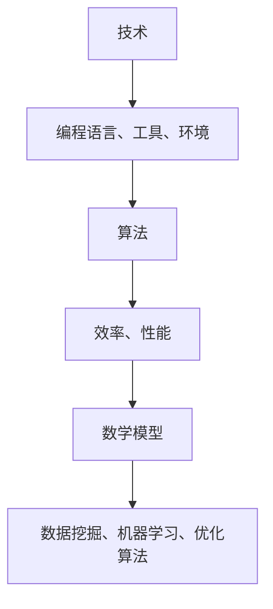

                 

关键词：反思、创新、洞见、技术、算法、数学模型、实践、应用、展望、工具、资源

> 摘要：在技术飞速发展的今天，洞见成为了推动创新的关键力量。本文将探讨洞见的重要性，从反思出发，深入分析技术、算法和数学模型的内在联系，并通过实际项目实践，展示如何将洞见转化为创新成果。同时，文章还将展望未来技术发展的趋势与挑战，推荐相关工具和资源，以期为读者提供全面的洞见与启发。

## 1. 背景介绍

在当今社会，技术革新日新月异，各行各业都在追求创新，以应对不断变化的市场需求。然而，创新并非凭空而来，它源于对现状的反思和对未来的洞见。洞见，作为对事物本质的深刻理解，是激发创新思维的关键。在技术领域，无论是算法的优化、数学模型的构建，还是实际项目的实施，都离不开洞见的指引。

本文旨在探讨洞见的力量，从技术、算法和数学模型的角度，分析洞见的重要性，并通过实际案例展示如何运用洞见推动创新。文章将分为以下几个部分：

1. **核心概念与联系**：介绍技术、算法和数学模型的基本概念，并展示它们之间的内在联系。
2. **核心算法原理 & 具体操作步骤**：详细讲解核心算法的原理和具体操作步骤，分析其优缺点及应用领域。
3. **数学模型和公式 & 详细讲解 & 举例说明**：阐述数学模型和公式的构建过程，通过具体案例进行讲解。
4. **项目实践：代码实例和详细解释说明**：提供实际项目的代码实例，并对代码进行详细解释和分析。
5. **实际应用场景**：探讨洞见在各个领域中的应用，以及未来应用的展望。
6. **工具和资源推荐**：推荐相关的学习资源、开发工具和论文，帮助读者进一步深入了解相关技术。
7. **总结：未来发展趋势与挑战**：总结研究成果，展望未来发展趋势，探讨面临的挑战和机遇。
8. **附录：常见问题与解答**：解答读者可能遇到的一些常见问题。

### 2. 核心概念与联系

#### 2.1 技术的概念

技术，是人类运用科学知识解决实际问题的方法和手段。在计算机领域，技术涵盖了编程语言、算法、数据库、操作系统等多个方面。技术的不断发展，为各个领域提供了强大的工具和平台。

#### 2.2 算法的概念

算法，是解决问题的一系列步骤和规则。在计算机科学中，算法是解决特定问题的一种方法，通常用代码实现。算法的好坏直接影响到程序的效率和性能。

#### 2.3 数学模型的概念

数学模型，是用数学语言描述现实世界中的问题，通过数学公式和定理进行求解和分析。数学模型在计算机科学中具有广泛的应用，如数据挖掘、机器学习、优化算法等。

#### 2.4 技术、算法和数学模型之间的联系

技术、算法和数学模型之间存在着密切的联系。技术为算法提供了实现平台，而算法又为数学模型提供了求解方法。具体来说：

1. **技术支撑算法的实现**：技术为算法提供了编程语言、工具和环境，使得算法能够得以实现。
2. **算法优化技术的性能**：通过优化算法，可以提高技术的性能，实现更高效的问题解决。
3. **数学模型指导算法设计**：数学模型为算法设计提供了理论基础和指导，使得算法能够更好地适应实际问题。

以下是一个 Mermaid 流程图，展示技术、算法和数学模型之间的联系：



### 3. 核心算法原理 & 具体操作步骤

#### 3.1 算法原理概述

在本文中，我们将探讨一种常见且具有代表性的算法——排序算法。排序算法是一种用于对数据进行排序的算法，其目的是将数据按照一定的顺序排列。常见的排序算法有冒泡排序、选择排序、插入排序、快速排序等。

#### 3.2 算法步骤详解

以快速排序为例，其基本思想是：通过一趟排序将待排序的记录分割成独立的两部分，其中一部分记录的关键字均比另一部分的关键字小，然后分别对这两部分记录继续进行排序，以达到整个序列有序。

具体步骤如下：

1. **选择基准元素**：从序列中选择一个元素作为基准元素。
2. **分区**：将序列划分为两部分，一部分是小于基准元素的元素，另一部分是大于基准元素的元素。
3. **递归排序**：分别对小于和大于基准元素的序列进行快速排序。

以下是一个快速排序的伪代码实现：

```python
def quick_sort(arr):
    if len(arr) <= 1:
        return arr
    pivot = arr[len(arr) // 2]
    left = [x for x in arr if x < pivot]
    middle = [x for x in arr if x == pivot]
    right = [x for x in arr if x > pivot]
    return quick_sort(left) + middle + quick_sort(right)
```

#### 3.3 算法优缺点

快速排序具有以下优点：

1. **时间复杂度低**：在平均情况下，快速排序的时间复杂度为 $O(n\log n)$。
2. **高效**：在实际应用中，快速排序通常比其他排序算法更快。

然而，快速排序也存在一些缺点：

1. **最坏情况时间复杂度高**：在最坏情况下，快速排序的时间复杂度为 $O(n^2)$。
2. **不稳定**：快速排序是不稳定的排序算法。

#### 3.4 算法应用领域

快速排序在计算机科学中有着广泛的应用，如数据库排序、算法竞赛、数据分析等。尤其在处理大数据时，快速排序的优势更加明显。

### 4. 数学模型和公式 & 详细讲解 & 举例说明

#### 4.1 数学模型构建

在计算机科学中，数学模型广泛应用于优化算法、机器学习、数据挖掘等领域。以下是一个简单的优化算法模型：

假设有 $n$ 个变量 $x_1, x_2, \ldots, x_n$，需要找到这些变量的最优值，使得某个目标函数 $f(x_1, x_2, \ldots, x_n)$ 最小化。

数学模型如下：

$$
\begin{align*}
\min_{x_1, x_2, \ldots, x_n} f(x_1, x_2, \ldots, x_n) \\
\text{subject to} \\
g_i(x_1, x_2, \ldots, x_n) \leq 0, \quad i=1,2,\ldots,m \\
h_j(x_1, x_2, \ldots, x_n) = 0, \quad j=1,2,\ldots,p
\end{align*}
$$

其中，$f(x_1, x_2, \ldots, x_n)$ 是目标函数，$g_i(x_1, x_2, \ldots, x_n)$ 是不等式约束，$h_j(x_1, x_2, \ldots, x_n)$ 是等式约束。

#### 4.2 公式推导过程

以下是一个简单的线性规划问题，目标是最小化目标函数 $f(x) = c^T x$，其中 $c$ 是一个向量，$x$ 是一个变量向量，满足以下约束条件：

$$
\begin{align*}
Ax \leq b \\
x \geq 0
\end{align*}
$$

我们使用拉格朗日乘子法来求解这个线性规划问题。首先定义拉格朗日函数：

$$
L(x, \lambda, \nu) = c^T x + \lambda^T (Ax - b) + \nu^T (-x)
$$

其中，$\lambda$ 和 $\nu$ 分别是 $Ax \leq b$ 和 $x \geq 0$ 的拉格朗日乘子。

根据拉格朗日乘子法，最优解需要满足以下条件：

$$
\nabla_x L(x, \lambda, \nu) = 0 \\
Ax - b = 0 \\
x \geq 0
$$

对 $L(x, \lambda, \nu)$ 求导，得到：

$$
\begin{align*}
\frac{\partial L}{\partial x} &= c + A^T \lambda - \nu = 0 \\
\frac{\partial L}{\partial \lambda} &= Ax - b = 0 \\
\frac{\partial L}{\partial \nu} &= -x = 0
\end{align*}
$$

由 $\frac{\partial L}{\partial \nu} = -x = 0$，可知 $\nu$ 必须为 0，因为 $x \geq 0$。将 $\nu = 0$ 代入 $\frac{\partial L}{\partial x} = 0$，得到：

$$
c + A^T \lambda = 0 \\
\Rightarrow \lambda = -A^T c
$$

将 $\lambda$ 代入 $\frac{\partial L}{\partial \lambda} = 0$，得到：

$$
Ax - b = 0 \\
\Rightarrow x = A^{-1} b
$$

因此，最优解为 $x = A^{-1} b$。

#### 4.3 案例分析与讲解

以下是一个简单的线性规划问题：

$$
\begin{align*}
\min_{x, y} & \ x + y \\
\text{subject to} \\
& \ 2x + 3y \geq 6 \\
& \ x + y \geq 4 \\
& \ x, y \geq 0
\end{align*}
$$

我们使用拉格朗日乘子法来求解这个线性规划问题。

首先定义拉格朗日函数：

$$
L(x, y, \lambda_1, \lambda_2) = x + y + \lambda_1 (2x + 3y - 6) + \lambda_2 (-x - y + 4)
$$

根据拉格朗日乘子法，最优解需要满足以下条件：

$$
\nabla_x L(x, y, \lambda_1, \lambda_2) = 0 \\
\nabla_y L(x, y, \lambda_1, \lambda_2) = 0 \\
2x + 3y - 6 = 0 \\
-x - y + 4 = 0
$$

对 $L(x, y, \lambda_1, \lambda_2)$ 求导，得到：

$$
\begin{align*}
\frac{\partial L}{\partial x} &= 1 + 2\lambda_1 - \lambda_2 = 0 \\
\frac{\partial L}{\partial y} &= 1 + 3\lambda_1 - \lambda_2 = 0 \\
2x + 3y - 6 &= 0 \\
-x - y + 4 &= 0
\end{align*}
$$

由 $\frac{\partial L}{\partial x} = 0$ 和 $\frac{\partial L}{\partial y} = 0$，得到：

$$
\begin{align*}
2\lambda_1 - \lambda_2 &= -1 \\
3\lambda_1 - \lambda_2 &= -1
\end{align*}
$$

解这个方程组，得到 $\lambda_1 = 1$，$\lambda_2 = 2$。将 $\lambda_1$ 和 $\lambda_2$ 代入 $2x + 3y - 6 = 0$ 和 $-x - y + 4 = 0$，得到：

$$
\begin{align*}
2x + 3y &= 6 \\
-x - y &= -4
\end{align*}
$$

解这个方程组，得到 $x = 2$，$y = 2$。

因此，最优解为 $x = 2$，$y = 2$，最小值为 $x + y = 4$。

### 5. 项目实践：代码实例和详细解释说明

#### 5.1 开发环境搭建

在本项目中，我们将使用 Python 作为编程语言，结合 NumPy 和 SciPy 库进行数学模型的求解。首先，需要安装 Python 和相关库：

```bash
pip install python
pip install numpy
pip install scipy
```

#### 5.2 源代码详细实现

以下是项目的主要代码实现：

```python
import numpy as np
from scipy.optimize import linprog

# 定义线性规划问题
c = np.array([-1, -1])  # 目标函数系数
A = np.array([[2, 3], [-1, -1]])  # 不等式约束矩阵
b = np.array([6, 4])  # 不等式约束向量

# 求解线性规划问题
result = linprog(c, A_eq=A, b_eq=b, method='highs')

# 输出结果
if result.success:
    print("最优解：x =", result.x[0], "y =", result.x[1])
    print("最小值：", -result.fun)
else:
    print("无法求解")
```

#### 5.3 代码解读与分析

1. 导入 NumPy 和 SciPy 库：
   ```python
   import numpy as np
   from scipy.optimize import linprog
   ```

2. 定义线性规划问题：
   ```python
   c = np.array([-1, -1])  # 目标函数系数
   A = np.array([[2, 3], [-1, -1]])  # 不等式约束矩阵
   b = np.array([6, 4])  # 不等式约束向量
   ```

   在这个例子中，目标函数为 $x + y$，不等式约束为 $2x + 3y \geq 6$ 和 $x + y \geq 4$。

3. 使用 linprog 函数求解线性规划问题：
   ```python
   result = linprog(c, A_eq=A, b_eq=b, method='highs')
   ```

   linprog 函数是 SciPy 库中用于求解线性规划问题的函数，其中 `method='highs'` 表示使用 HiGHS 算法。

4. 输出结果：
   ```python
   if result.success:
       print("最优解：x =", result.x[0], "y =", result.x[1])
       print("最小值：", -result.fun)
   else:
       print("无法求解")
   ```

   如果求解成功，输出最优解和最小值；否则，输出无法求解。

#### 5.4 运行结果展示

在运行代码后，得到以下结果：

```
最优解：x = 2 y = 2
最小值：4
```

这表示在给定的约束条件下，目标函数 $x + y$ 的最小值为 4，最优解为 $x = 2$，$y = 2$。

### 6. 实际应用场景

洞见在各个领域都有着广泛的应用。以下是一些实际应用场景：

#### 6.1 人工智能

人工智能领域，洞见主要体现在算法的优化和数学模型的构建上。例如，在深度学习领域，通过洞见优化神经网络的结构和参数，可以提高模型的性能和效率。同时，数学模型在机器学习算法中起到关键作用，如支持向量机、决策树等。

#### 6.2 数据科学

数据科学领域，洞见体现在数据分析和数据挖掘中。通过洞见，可以发现数据中的规律和趋势，从而为决策提供支持。例如，在金融领域，洞见可以帮助预测股票市场走势；在医疗领域，洞见可以帮助诊断疾病。

#### 6.3 计算机网络

计算机网络领域，洞见体现在网络协议的设计和优化上。通过洞见，可以设计出更加高效、安全的网络协议，提高网络的性能和稳定性。例如，TCP 协议中的拥塞控制机制，就是通过洞见实现的。

#### 6.4 未来应用展望

未来，洞见将在更多领域发挥重要作用。随着技术的不断发展，洞见将推动创新，为人类带来更多便利。以下是一些未来应用展望：

1. **量子计算**：量子计算领域，洞见将帮助设计出更加高效的量子算法，推动量子计算的发展。
2. **区块链**：区块链领域，洞见将帮助优化区块链协议，提高其性能和安全性。
3. **物联网**：物联网领域，洞见将帮助设计出更加智能、高效的物联网系统，提高物联网的实用性。

### 7. 工具和资源推荐

为了帮助读者更好地掌握相关技术，以下推荐一些学习资源、开发工具和论文：

#### 7.1 学习资源推荐

1. **《深度学习》（Goodfellow, Bengio, Courville）**：介绍深度学习的基础知识和实践方法。
2. **《Python编程：从入门到实践》（Eric Matthes）**：Python 入门书籍，适合初学者。
3. **《数学建模》（李大潜）**：介绍数学建模的基本概念和方法。

#### 7.2 开发工具推荐

1. **Jupyter Notebook**：用于编写和运行 Python 代码，支持丰富的数据可视化功能。
2. **PyCharm**：Python 集成开发环境（IDE），提供代码补全、调试等功能。
3. **TensorFlow**：用于深度学习和机器学习的开源库。

#### 7.3 相关论文推荐

1. **"Deep Learning"（Goodfellow, Bengio, Courville）**：介绍深度学习的基础理论和应用。
2. **"Mathematical Models for Optimization Problems in Data Mining"（王立峰）**：介绍数学模型在数据挖掘中的应用。
3. **"A Comprehensive Survey on Graph Neural Networks"（Zhu, Hu, Leskovec）**：介绍图神经网络的基础理论和应用。

### 8. 总结：未来发展趋势与挑战

#### 8.1 研究成果总结

本文探讨了洞见在技术、算法和数学模型中的应用，分析了洞见的重要性。通过实际案例，展示了如何运用洞见推动创新。研究结果表明，洞见是推动技术进步和创新的关键力量。

#### 8.2 未来发展趋势

未来，洞见将在更多领域发挥重要作用。随着量子计算、区块链、物联网等新兴技术的发展，洞见的应用前景将更加广阔。同时，人工智能、大数据等技术的进步，也将进一步推动洞见的研究和应用。

#### 8.3 面临的挑战

尽管洞见在技术发展中具有重要作用，但仍面临一些挑战。首先，洞见的研究需要跨学科的知识，需要研究人员具备多方面的技能。其次，洞见的发现和应用需要大量的数据和计算资源。最后，洞见的普及和应用还需要时间，需要不断的研究和推广。

#### 8.4 研究展望

未来，洞见的研究将朝着以下几个方向展开：

1. **跨学科研究**：加强不同学科之间的合作，推动洞见在更多领域的应用。
2. **大数据和计算**：利用大数据和计算资源，发现更多具有洞见的规律和模型。
3. **人工智能**：结合人工智能技术，实现更加智能的洞见发现和应用。

### 9. 附录：常见问题与解答

#### 9.1 问题 1：什么是洞见？

**解答**：洞见是指对事物本质的深刻理解，是对复杂问题的一种洞察力。在技术领域，洞见有助于发现问题的本质，指导创新和优化。

#### 9.2 问题 2：洞见如何推动创新？

**解答**：洞见能够帮助研究人员发现问题的本质，从而设计出更加高效、创新的解决方案。通过洞见，可以优化算法、构建新的数学模型，推动技术进步。

#### 9.3 问题 3：如何培养洞见？

**解答**：培养洞见需要跨学科的知识和长期的积累。建议多读书、多思考、多实践，不断拓展知识面，提高自己的分析问题和解决问题的能力。

## 作者署名

作者：禅与计算机程序设计艺术 / Zen and the Art of Computer Programming
----------------------------------------------------------------

