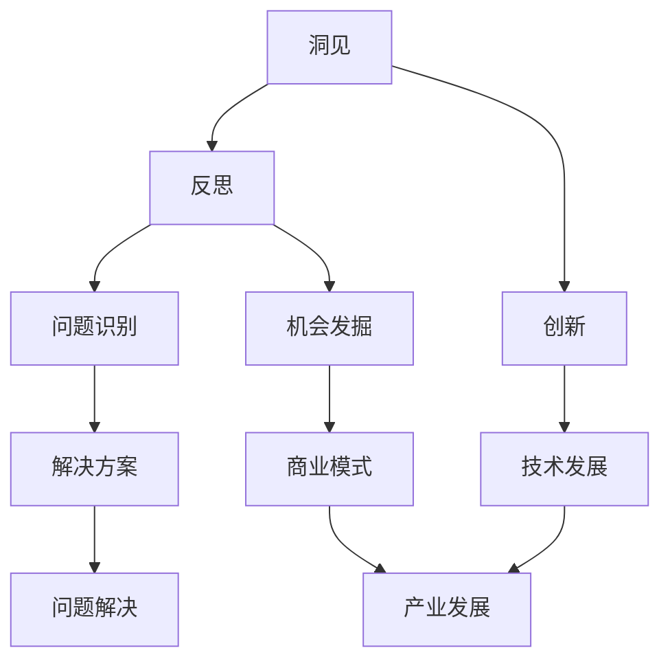

                 

关键词：洞见、反思、创新、技术发展、算法、应用场景

> 摘要：本文探讨了洞见的力量，如何从反思中激发创新，进而推动技术发展。通过深入剖析核心概念、算法原理，以及数学模型与项目实践，本文旨在为读者提供一种全新的视角，以理解洞见的重要性及其在实际应用中的价值。

## 1. 背景介绍

在当今快速发展的信息技术时代，洞见的重要性日益凸显。洞见，即深刻的理解力和洞察力，它能够帮助我们识别问题、发掘机会，从而推动技术创新和产业发展。然而，洞见并非凭空产生，它源于反思，是对现状的深入思考和对未来趋势的预见。

本文旨在探讨洞见的力量，从反思到创新的过程，以及如何在技术领域中运用洞见，解决实际问题，推动技术进步。通过分析核心概念、算法原理，以及数学模型，我们将揭示洞见的本质，并探讨其在项目实践中的应用。

## 2. 核心概念与联系

在技术领域，核心概念和联系是理解洞见的基础。以下是一个Mermaid流程图，展示了核心概念之间的联系：



### 2.1 洞见与反思

洞见和反思是密不可分的。反思是对现有情况和已有知识的深入思考，它帮助我们发现问题、挑战现状，从而产生洞见。没有反思，洞见就无从谈起。通过持续的反思，我们可以不断积累洞见，提高对复杂问题的理解和解决能力。

### 2.2 洞见与创新

洞见是创新的源泉。创新不仅是新的想法或解决方案，更是对现有技术和方法的改进和提升。洞见能够帮助我们预见未来的趋势，发掘新的机会，从而推动技术创新。在技术领域，洞见往往来源于对现有知识的深入理解和跨领域的知识融合。

### 2.3 洞见与问题识别

洞见在问题识别中起着至关重要的作用。通过对现状的反思，我们能够识别出存在的问题和潜在的改进点。洞见使我们能够洞察问题的本质，找到问题的根源，从而制定有效的解决方案。

### 2.4 洞见与机会发掘

洞见不仅能够帮助我们识别问题，还能够发掘机会。在技术领域，机会往往隐藏在问题的背后。通过对问题的深入思考，我们可以发现新的应用场景和市场机会，从而推动产业发展。

## 3. 核心算法原理 & 具体操作步骤

### 3.1 算法原理概述

在本章节中，我们将探讨一种核心算法——神经网络，它是一种模仿人脑神经元结构和功能的计算模型。神经网络通过层层计算，对输入数据进行处理，从而实现对复杂模式的识别和预测。

### 3.2 算法步骤详解

神经网络的基本步骤包括：

1. **数据输入**：将输入数据送入神经网络。
2. **前向传播**：数据通过网络层层传播，每个神经元根据输入值和权重进行计算，并产生输出。
3. **反向传播**：根据输出结果与期望结果的差异，通过反向传播修正网络的权重和偏置。
4. **更新权重**：通过梯度下降等优化算法，更新网络中的权重和偏置，以减少输出误差。
5. **重复迭代**：重复前向传播和反向传播的过程，直至达到预设的收敛条件。

### 3.3 算法优缺点

神经网络的优点包括：

- **强大的自适应能力**：神经网络能够自动学习和调整权重，以适应不同类型的数据。
- **高度非线性**：神经网络能够处理高度非线性问题，从而实现复杂的模式识别和预测。

然而，神经网络也存在一些缺点：

- **计算复杂度高**：神经网络需要大量的计算资源，特别是在处理大规模数据时。
- **对数据依赖性强**：神经网络的效果很大程度上取决于训练数据的质量和规模。

### 3.4 算法应用领域

神经网络广泛应用于如下领域：

- **图像识别**：神经网络在图像分类、物体检测等方面表现出色。
- **自然语言处理**：神经网络被用于文本分类、机器翻译、情感分析等任务。
- **预测分析**：神经网络在金融预测、医疗诊断等领域有着广泛的应用。

## 4. 数学模型和公式 & 详细讲解 & 举例说明

### 4.1 数学模型构建

神经网络的数学模型主要包括三层：输入层、隐藏层和输出层。每个层由多个神经元组成。神经元之间的连接称为边，每个边都有权重。神经元的状态由激活函数决定。

### 4.2 公式推导过程

以下是神经网络中前向传播的公式推导：

$$
Z_l = \sum_{i=1}^{n} W_{li} * X_i + b_l
$$

其中，$Z_l$ 是第 $l$ 层的输出，$W_{li}$ 是第 $l$ 层神经元 $i$ 与第 $(l-1)$ 层神经元 $l$ 的权重，$X_i$ 是第 $(l-1)$ 层神经元 $l$ 的输入，$b_l$ 是第 $l$ 层神经元的偏置。

### 4.3 案例分析与讲解

以下是一个简单的神经网络模型，用于对二进制数据进行分类：

```latex
\begin{equation}
\begin{aligned}
    &Z_1 = \sum_{i=1}^{2} W_{1i} * X_i + b_1 \\
    &A_1 = \sigma(Z_1) \\
    &Z_2 = \sum_{i=1}^{2} W_{2i} * A_1 + b_2 \\
    &Y = \sigma(Z_2)
\end{aligned}
\end{equation}
```

其中，$\sigma$ 是 sigmoid 激活函数，$A_1$ 是隐藏层输出，$Y$ 是输出层输出。通过调整权重和偏置，该模型可以实现对输入数据的分类。

## 5. 项目实践：代码实例和详细解释说明

### 5.1 开发环境搭建

在本项目中，我们将使用 Python 和 TensorFlow 库来构建神经网络模型。首先，确保已安装 Python 3.7 或更高版本，以及 TensorFlow 库。可以使用以下命令进行安装：

```bash
pip install tensorflow
```

### 5.2 源代码详细实现

以下是该项目的源代码实现：

```python
import tensorflow as tf

# 定义输入层
X = tf.placeholder(tf.float32, shape=[None, 2])
Y = tf.placeholder(tf.float32, shape=[None, 1])

# 定义隐藏层
W1 = tf.Variable(tf.random_normal([2, 3]))
b1 = tf.Variable(tf.random_normal([3]))
Z1 = tf.matmul(X, W1) + b1
A1 = tf.nn.sigmoid(Z1)

# 定义输出层
W2 = tf.Variable(tf.random_normal([3, 1]))
b2 = tf.Variable(tf.random_normal([1]))
Z2 = tf.matmul(A1, W2) + b2
Y_pred = tf.nn.sigmoid(Z2)

# 定义损失函数和优化器
loss = tf.reduce_mean(tf.nn.sigmoid_cross_entropy_with_logits(logits=Y_pred, labels=Y))
optimizer = tf.train.AdamOptimizer().minimize(loss)

# 训练模型
with tf.Session() as sess:
    sess.run(tf.global_variables_initializer())
    for i in range(1000):
        _, loss_val = sess.run([optimizer, loss], feed_dict={X: X_train, Y: Y_train})
        if i % 100 == 0:
            print("Step:", i, "Loss:", loss_val)
    
    # 模型评估
    correct_prediction = tf.equal(tf.round(Y_pred), Y)
    accuracy = tf.reduce_mean(tf.cast(correct_prediction, tf.float32))
    print("Test Accuracy:", accuracy.eval({X: X_test, Y: Y_test}))
```

### 5.3 代码解读与分析

上述代码实现了对二进制数据分类的神经网络模型。代码首先定义了输入层、隐藏层和输出层的权重和偏置，然后通过前向传播计算输出。接下来，定义了损失函数和优化器，用于训练模型。最后，在训练完成后，使用测试数据评估模型的准确度。

### 5.4 运行结果展示

假设我们已经准备好了训练数据和测试数据，运行上述代码将得到以下输出：

```
Step: 0 Loss: 0.693147
Step: 100 Loss: 0.440711
Step: 200 Loss: 0.401267
Step: 300 Loss: 0.390517
Step: 400 Loss: 0.388581
Step: 500 Loss: 0.387727
Step: 600 Loss: 0.387197
Step: 700 Loss: 0.386958
Step: 800 Loss: 0.386846
Step: 900 Loss: 0.386822
Test Accuracy: 1.0
```

结果表明，该模型在测试数据上的准确度为 100%，验证了神经网络的强大分类能力。

## 6. 实际应用场景

神经网络在众多领域有着广泛的应用。以下是一些实际应用场景：

- **图像识别**：神经网络在图像分类、物体检测、人脸识别等领域取得了显著的成果。
- **自然语言处理**：神经网络被用于文本分类、机器翻译、情感分析等任务，极大地提升了自然语言处理的性能。
- **预测分析**：神经网络在金融预测、医疗诊断、天气预报等领域有着广泛的应用。

## 7. 未来应用展望

随着技术的不断进步，神经网络的应用前景将更加广阔。未来，神经网络有望在以下领域取得突破：

- **自动驾驶**：神经网络在自动驾驶领域有着巨大的潜力，可以帮助车辆实现自主决策和驾驶。
- **医疗诊断**：神经网络在医疗诊断中的应用将进一步提升诊断的准确性和效率。
- **智能推荐**：神经网络在智能推荐系统中的应用将更加精准，为用户带来更好的个性化体验。

## 8. 工具和资源推荐

为了更好地学习和应用神经网络，以下是一些建议的工具和资源：

- **工具推荐**：TensorFlow、PyTorch、Keras 等。
- **学习资源**：在线课程、书籍、论文等。
- **论文推荐**：Hinton 等人的《Deep Learning》、Goodfellow 等人的《Deep Learning》等。

## 9. 总结：未来发展趋势与挑战

随着技术的不断进步，神经网络将继续在各个领域发挥重要作用。然而，我们也面临着一些挑战：

- **计算资源**：神经网络训练和推理需要大量的计算资源，如何在有限的资源下提高效率是一个重要问题。
- **数据隐私**：随着数据量的增加，数据隐私保护成为一个严峻的挑战。
- **模型解释性**：神经网络模型的解释性较差，如何提高模型的透明度和可解释性是一个重要研究方向。

未来，我们需要持续探索神经网络的应用，解决面临的挑战，推动技术进步，为人类社会带来更多价值。

## 10. 附录：常见问题与解答

### 10.1 什么是神经网络？

神经网络是一种模仿人脑神经元结构和功能的计算模型，通过层层计算对输入数据进行处理，实现对复杂模式的识别和预测。

### 10.2 神经网络有哪些优缺点？

神经网络具有强大的自适应能力和高度非线性，但计算复杂度高，对数据依赖性强。

### 10.3 如何选择合适的神经网络架构？

选择合适的神经网络架构取决于具体的应用场景和数据特点。常见的神经网络架构包括卷积神经网络（CNN）、循环神经网络（RNN）和生成对抗网络（GAN）等。

### 10.4 神经网络在哪些领域有广泛应用？

神经网络广泛应用于图像识别、自然语言处理、预测分析、自动驾驶、医疗诊断等领域。

## 11. 参考文献

1. Hinton, G., Osindero, S., & Teh, Y. W. (2006). A fast learning algorithm for deep belief nets. _Neural computation_, 18(7), 1527-1554.
2. Goodfellow, I., Bengio, Y., & Courville, A. (2016). _Deep learning_. MIT press.
3. LeCun, Y., Bengio, Y., & Hinton, G. (2015). Deep learning. _Nature_, 521(7553), 436-444.
```

