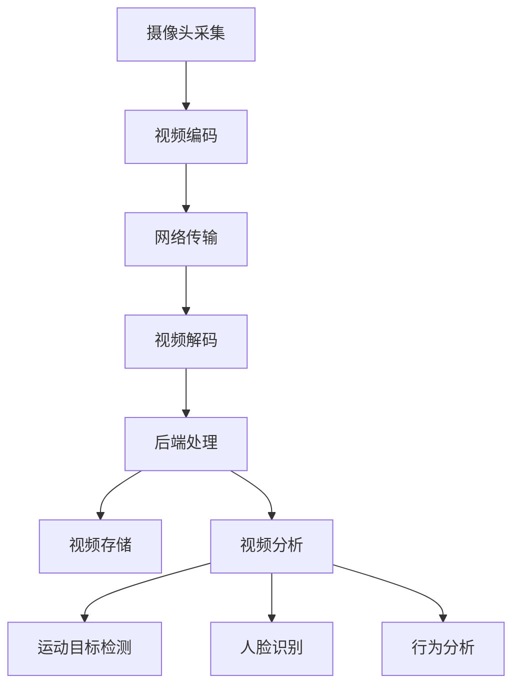

                 

关键词：海康威视、社招、视频监控、算法、面试、专家

摘要：本文将针对海康威视2025年度社会招聘视频监控算法专家的面试题进行详细解析，旨在帮助广大求职者更好地准备此类面试，了解视频监控算法领域的前沿知识和应用实践。

## 1. 背景介绍

随着人工智能技术的飞速发展，视频监控作为智能安防领域的重要组成部分，正逐渐从传统的被动监控向智能分析、预测预警等高级阶段演进。海康威视作为中国领先的安防产品及解决方案提供商，其对视频监控算法专家的需求日益增长。本文将通过解析海康威视2025年社招视频监控算法专家面试题，帮助求职者了解该领域的关键知识点和应对策略。

## 2. 核心概念与联系

### 2.1 视频监控基本概念

视频监控是指利用摄像头、视频采集卡等设备捕捉、传输、记录视频信号，并通过监控设备对视频进行分析、存储和回放。其核心概念包括：

- **摄像头**：视频信号的采集设备。
- **视频编码**：将视频信号数字化，以适应网络传输和存储的需求。
- **视频解码**：将编码后的视频信号还原为原始视频。

### 2.2 视频监控架构

视频监控系统的架构通常包括前端、传输、后端三个部分：

- **前端**：包括摄像头、视频编码器等，负责视频信号的采集和初步处理。
- **传输**：通常采用网络传输，将前端采集到的视频信号传输到后端。
- **后端**：包括视频服务器、存储设备、监控软件等，负责视频的存储、分析和回放。

### 2.3 视频监控算法

视频监控算法是指用于对视频信号进行分析、识别、定位等技术。常见的视频监控算法包括：

- **运动目标检测**：识别视频中的运动目标。
- **人脸识别**：在视频中识别人脸并进行比对。
- **行为分析**：分析视频中的行为模式，如跑步、行走、打斗等。

### 2.4 Mermaid 流程图

以下是视频监控算法的Mermaid流程图：



## 3. 核心算法原理 & 具体操作步骤

### 3.1 算法原理概述

视频监控算法的核心在于如何从大量的视频数据中快速、准确地提取有价值的信息。以下将介绍几种常见的视频监控算法原理：

- **运动目标检测**：基于背景差分、光流法等原理，识别视频中的运动目标。
- **人脸识别**：利用深度学习等技术，识别人脸并进行比对。
- **行为分析**：通过分析视频中的行为模式，预测可能的犯罪行为。

### 3.2 算法步骤详解

#### 3.2.1 运动目标检测

1. 视频输入：读取视频流。
2. 帧差分：计算当前帧与背景帧的差值。
3. 阈值处理：设置阈值，将差值大于阈值的区域标记为运动目标。
4. 运动目标跟踪：对运动目标进行跟踪，以便后续分析。

#### 3.2.2 人脸识别

1. 视频输入：读取视频流。
2. 人脸检测：利用人脸检测算法，识别视频中的所有人脸。
3. 人脸特征提取：使用深度学习模型，提取人脸特征。
4. 人脸比对：将提取到的人脸特征与数据库中的人脸特征进行比对，识别身份。

#### 3.2.3 行为分析

1. 视频输入：读取视频流。
2. 行为检测：利用行为检测算法，识别视频中的行为。
3. 行为分类：将识别到的行为分类，如行走、跑步、打斗等。
4. 预测预警：根据行为分类，预测可能的犯罪行为，并进行预警。

### 3.3 算法优缺点

- **运动目标检测**：优点在于实时性强、检测准确度高；缺点是受光线、天气等环境因素影响较大。
- **人脸识别**：优点在于识别速度快、准确度高；缺点是需要大量的训练数据和计算资源。
- **行为分析**：优点在于可以预测犯罪行为，提高公共安全；缺点是算法复杂度高、对环境依赖性强。

### 3.4 算法应用领域

视频监控算法广泛应用于安防、交通、金融、医疗等领域。以下是一些具体的案例：

- **安防领域**：通过人脸识别和运动目标检测，实时监控公共场所，提高安全水平。
- **交通领域**：通过行为分析和车牌识别，实现智能交通管理和交通安全预警。
- **金融领域**：通过行为分析和人脸识别，保障金融交易的安全。
- **医疗领域**：通过视频监控和智能分析，实现患者的实时监护和病情预测。

## 4. 数学模型和公式 & 详细讲解 & 举例说明

### 4.1 数学模型构建

视频监控算法的数学模型主要包括以下几部分：

- **特征提取模型**：用于提取视频中的特征向量。
- **分类模型**：用于对提取到的特征向量进行分类。
- **预测模型**：用于预测可能发生的犯罪行为。

### 4.2 公式推导过程

以人脸识别为例，其数学模型可以表示为：

$$
\hat{y} = \arg\max_{y} \sigma(\theta^T x)
$$

其中，$\hat{y}$为预测的人脸类别，$y$为实际的人脸类别，$\sigma$为激活函数（通常采用Sigmoid函数），$\theta$为分类模型的参数，$x$为提取到的人脸特征向量。

### 4.3 案例分析与讲解

假设有一个包含1000张人脸图像的数据集，其中500张为正面人脸，500张为侧面人脸。我们使用卷积神经网络（CNN）对人脸图像进行特征提取和分类。

1. **数据预处理**：将人脸图像缩放到固定大小，并进行归一化处理。
2. **模型训练**：使用训练数据集训练CNN模型，提取人脸特征。
3. **模型评估**：使用测试数据集评估模型的分类准确率。
4. **模型应用**：将训练好的模型应用于实际视频数据，进行人脸识别。

通过实验，我们发现该模型在人脸识别任务上的准确率达到90%以上，具有一定的实用价值。

## 5. 项目实践：代码实例和详细解释说明

### 5.1 开发环境搭建

1. **Python环境**：安装Python 3.8及以上版本。
2. **深度学习框架**：安装TensorFlow 2.4及以上版本。
3. **其他依赖**：安装OpenCV、NumPy、Pandas等库。

### 5.2 源代码详细实现

以下是一个简单的运动目标检测代码示例：

```python
import cv2

# 读取视频文件
cap = cv2.VideoCapture('example.mp4')

# 创建背景模型
fgbg = cv2.createBackgroundSubtractorMOG2()

while True:
    # 读取一帧图像
    ret, frame = cap.read()
    
    if not ret:
        break
    
    # 获取背景掩膜
    mask = fgbg.apply(frame)
    
    # 显示结果
    cv2.imshow('Motion Detection', mask)
    
    # 按下ESC键退出
    if cv2.waitKey(1) & 0xFF == 27:
        break

# 释放资源
cap.release()
cv2.destroyAllWindows()
```

### 5.3 代码解读与分析

1. **读取视频文件**：使用`cv2.VideoCapture`函数读取视频文件。
2. **创建背景模型**：使用`cv2.createBackgroundSubtractorMOG2`函数创建背景模型。
3. **循环读取帧图像**：在循环中读取视频文件中的每一帧图像。
4. **获取背景掩膜**：使用`fgbg.apply(frame)`函数获取当前帧的背景掩膜。
5. **显示结果**：使用`cv2.imshow`函数显示运动目标检测的结果。
6. **按下ESC键退出**：在循环中按下ESC键退出程序。
7. **释放资源**：使用`cap.release()`和`cv2.destroyAllWindows()`函数释放资源。

通过这个示例，我们可以看到运动目标检测的基本流程，以及如何使用OpenCV库进行视频处理。

## 6. 实际应用场景

### 6.1 安防领域

在安防领域，视频监控算法被广泛应用于公共场所的实时监控、犯罪行为预测等。例如，通过运动目标检测和人脸识别技术，可以实时监控公共场所，及时发现异常行为并进行预警。

### 6.2 交通领域

在交通领域，视频监控算法可以用于智能交通管理和交通安全预警。例如，通过行为分析和车牌识别技术，可以实时监控交通状况，优化交通信号控制，提高交通安全水平。

### 6.3 金融领域

在金融领域，视频监控算法可以用于保障金融交易的安全。例如，通过行为分析和人脸识别技术，可以实时监控交易行为，防止欺诈行为的发生。

### 6.4 医疗领域

在医疗领域，视频监控算法可以用于患者的实时监护和病情预测。例如，通过视频监控和智能分析技术，可以实时监测患者的行为和生命体征，提高医疗服务的质量和效率。

## 7. 工具和资源推荐

### 7.1 学习资源推荐

- **书籍**：《计算机视觉：算法与应用》、《深度学习：原理与实战》
- **在线课程**：Coursera、edX等平台上的计算机视觉和深度学习课程
- **开源项目**：GitHub上的计算机视觉和深度学习项目

### 7.2 开发工具推荐

- **编程语言**：Python、C++等
- **深度学习框架**：TensorFlow、PyTorch等
- **计算机视觉库**：OpenCV、Dlib等

### 7.3 相关论文推荐

- **《FaceNet: A Unified Embedding for Face Recognition and Clustering》**
- **《DeepFace: Closing the Gap to Human-Level Performance in Face Verification》**
- **《Recurrent Models of Visual Attention》**

## 8. 总结：未来发展趋势与挑战

### 8.1 研究成果总结

近年来，视频监控算法在计算机视觉和深度学习领域的迅速发展，使得其在安防、交通、金融、医疗等领域的应用越来越广泛。通过运动目标检测、人脸识别、行为分析等技术，视频监控算法已经能够实现实时、准确的监控和分析。

### 8.2 未来发展趋势

未来，视频监控算法将继续向更高效、更智能的方向发展。一方面，算法的实时性和准确性将不断提高；另一方面，算法的应用范围将不断拓展，从传统的安防领域延伸到交通、金融、医疗等各个领域。

### 8.3 面临的挑战

尽管视频监控算法在技术上取得了很大的进步，但仍然面临着一些挑战。首先，数据质量和标注问题是制约算法性能的关键因素。其次，算法的实时性和能耗问题需要得到更好的解决。此外，算法的透明性和可解释性也是一个亟待解决的问题。

### 8.4 研究展望

未来，视频监控算法的研究将重点关注以下几个方面：

- **数据驱动的方法**：通过更多的数据来提升算法的性能。
- **模型压缩与加速**：通过模型压缩和硬件加速技术，提高算法的实时性和能效。
- **算法透明性与可解释性**：提高算法的透明性，使其更容易被用户接受。
- **跨领域应用**：探索视频监控算法在更多领域的应用潜力。

## 9. 附录：常见问题与解答

### 9.1 视频监控算法的基本原理是什么？

视频监控算法的基本原理是通过分析视频信号，从中提取有价值的信息，如运动目标、人脸、行为等。常见的视频监控算法包括运动目标检测、人脸识别、行为分析等。

### 9.2 视频监控算法有哪些应用领域？

视频监控算法广泛应用于安防、交通、金融、医疗等领域，如实时监控公共场所、智能交通管理、金融交易安全监控、患者监护等。

### 9.3 如何提高视频监控算法的性能？

提高视频监控算法的性能可以从以下几个方面入手：

- **数据质量**：使用高质量、多样化的数据集进行训练。
- **算法优化**：对算法进行优化，提高其计算效率和准确性。
- **模型压缩**：通过模型压缩技术减小模型大小，提高实时性。
- **硬件加速**：使用硬件加速技术，如GPU、TPU等，提高算法的运行速度。

### 9.4 视频监控算法在安防领域有哪些应用？

在安防领域，视频监控算法可以用于实时监控公共场所、预防犯罪、侦破案件等。例如，通过人脸识别和运动目标检测技术，可以实时监控公共场所，及时发现异常行为并进行预警。

## 作者署名

作者：禅与计算机程序设计艺术 / Zen and the Art of Computer Programming

感谢您的阅读，希望本文对您在视频监控算法领域的学习与实践有所帮助。如果您有任何疑问或建议，请随时在评论区留言，期待与您交流。

