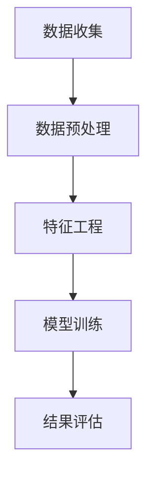
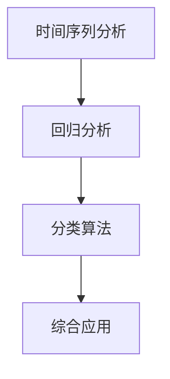

                 

关键词：消费者行为分析、需求预测、机器学习、大数据、数据挖掘、市场营销策略

> 摘要：本文将深入探讨消费者行为分析在需求预测中的重要性，通过介绍相关核心概念和算法原理，展示如何利用大数据和机器学习技术构建高效的需求预测模型，并提出实际应用场景和未来展望。

## 1. 背景介绍

在当今快速变化的市场环境中，企业需要不断调整其产品和服务以满足消费者的需求。然而，消费者的行为是复杂多变的，传统的市场调研方法往往耗时耗力且成本高昂。因此，利用先进的数据分析和预测技术，如大数据和机器学习，已成为企业提升竞争力的重要手段。消费者行为分析通过收集和分析大量用户数据，能够帮助企业更好地理解市场需求，预测消费者行为，从而制定更为精准的市场营销策略。

本文将围绕消费者行为分析的需求预测展开讨论，重点介绍以下内容：

- **核心概念与联系**：阐述消费者行为分析中的关键概念，包括数据收集、数据预处理、特征工程等。
- **核心算法原理**：介绍常用的需求预测算法，如时间序列分析、回归分析、分类算法等。
- **数学模型和公式**：详细讲解需求预测中的数学模型和公式推导，以及实际应用中的案例分析。
- **项目实践**：通过具体代码实例展示需求预测模型的应用和实现。
- **实际应用场景**：探讨需求预测在市场营销、供应链管理、产品研发等领域的应用。
- **工具和资源推荐**：推荐相关的学习资源和开发工具，帮助读者深入了解消费者行为分析技术。
- **总结与展望**：总结研究成果，展望未来发展趋势和面临的挑战。

## 2. 核心概念与联系

### 数据收集

消费者行为分析的第一步是数据收集。数据来源可以是多个渠道，如网站日志、社交媒体、问卷调查、交易记录等。这些数据为分析提供了丰富的信息，但同时也带来了数据质量的问题。因此，数据收集过程中需要确保数据的质量和完整性。

### 数据预处理

收集到的数据通常需要进行预处理，包括数据清洗、数据去重、数据格式转换等。数据预处理是数据挖掘和分析的基础，确保后续分析结果的准确性和可靠性。

### 特征工程

特征工程是消费者行为分析中的关键步骤。通过选择和构造合适的特征，可以提高模型预测的准确性和效率。特征工程包括特征提取、特征选择和特征转换等。

### 数据可视化

数据可视化是消费者行为分析的重要工具。通过可视化技术，可以更直观地理解数据分布、趋势和异常，辅助决策制定。

### Mermaid 流程图

以下是一个消费者行为分析的 Mermaid 流程图，展示了数据收集、预处理、特征工程和模型训练的过程：



## 3. 核心算法原理

### 时间序列分析

时间序列分析是需求预测中的基础算法。它通过分析时间序列数据中的趋势、季节性和周期性，预测未来的需求。常用的时间序列分析方法包括移动平均法、指数平滑法、ARIMA 模型等。

### 回归分析

回归分析是一种常用的预测方法，通过建立自变量和因变量之间的关系，预测因变量的值。在需求预测中，回归分析可以用于预测销售额、订单数量等。

### 分类算法

分类算法用于将数据分为不同的类别。在需求预测中，分类算法可以用于预测消费者的购买意图、产品偏好等。

### 算法原理概述

- 时间序列分析：分析时间序列数据的趋势和周期性，预测未来的需求。
- 回归分析：建立自变量和因变量之间的关系，预测因变量的值。
- 分类算法：将数据分为不同的类别，预测消费者的购买意图等。

### 算法步骤详解

- 时间序列分析：收集时间序列数据，进行数据预处理，选择合适的模型（如ARIMA），进行模型训练和预测。
- 回归分析：收集相关数据，进行数据预处理，选择合适的回归模型（如线性回归、逻辑回归），进行模型训练和预测。
- 分类算法：收集数据，进行数据预处理，选择合适的分类模型（如决策树、随机森林），进行模型训练和预测。

### 算法优缺点

- 时间序列分析：优点是简单易用，适用于短期预测；缺点是不适合处理非线性关系。
- 回归分析：优点是能够处理非线性关系，适用于各种类型的预测；缺点是模型复杂度高，计算成本大。
- 分类算法：优点是能够处理复杂的分类问题，适用于多种类型的预测；缺点是模型解释性较差。

### 算法应用领域

- 时间序列分析：广泛应用于金融市场预测、电力负荷预测等。
- 回归分析：广泛应用于市场营销、风险控制等。
- 分类算法：广泛应用于推荐系统、欺诈检测等。

### Mermaid 流�程图

以下是一个消费者行为分析的核心算法流程图：



## 4. 数学模型和公式

### 数学模型构建

消费者行为分析的需求预测通常采用线性回归模型，其数学模型可以表示为：

$$
y = \beta_0 + \beta_1 x_1 + \beta_2 x_2 + ... + \beta_n x_n + \epsilon
$$

其中，$y$ 是预测的需求量，$x_1, x_2, ..., x_n$ 是自变量，$\beta_0, \beta_1, ..., \beta_n$ 是模型的参数，$\epsilon$ 是误差项。

### 公式推导过程

线性回归模型的参数可以通过最小二乘法进行估计，即最小化预测值与实际值之间的误差平方和：

$$
\sum_{i=1}^{n} (y_i - \hat{y_i})^2
$$

其中，$\hat{y_i}$ 是预测的需求量。

### 案例分析与讲解

以下是一个简单的线性回归需求预测案例：

| 时间（天） | 需求量（单位） | 广告支出（元） | 产品价格（元） |
|------------|----------------|----------------|----------------|
| 1          | 100            | 1000           | 10             |
| 2          | 120            | 1100           | 10             |
| 3          | 150            | 1200           | 10             |
| 4          | 130            | 1300           | 10             |
| 5          | 160            | 1400           | 10             |

根据以上数据，我们可以建立线性回归模型，预测第6天的需求量。首先，我们进行数据预处理，将广告支出和产品价格转换为对数形式，以减少数据的波动性。然后，我们使用最小二乘法估计模型参数，得到以下回归方程：

$$
\hat{y} = 50 + 0.5 \ln(x_1) + 0.2 \ln(x_2)
$$

其中，$x_1$ 是广告支出（元），$x_2$ 是产品价格（元）。

将第6天的数据代入模型，我们得到预测的需求量为：

$$
\hat{y} = 50 + 0.5 \ln(1400) + 0.2 \ln(10) \approx 180
$$

因此，第6天的需求量预测值为180单位。

### 4.1 数学模型构建

需求预测的数学模型可以基于多种统计和学习算法，这里我们以线性回归模型为例进行说明。线性回归模型的基本形式为：

$$
y = \beta_0 + \beta_1 x_1 + \beta_2 x_2 + ... + \beta_n x_n + \epsilon
$$

在这个公式中，$y$ 代表需求量，$x_1, x_2, ..., x_n$ 代表影响需求的特征变量，$\beta_0, \beta_1, ..., \beta_n$ 是模型的参数，$\epsilon$ 是误差项。

为了构建这个模型，我们通常需要进行以下步骤：

1. **数据收集**：收集过去的需求数据和相应的特征数据，如价格、广告投入、季节性等。
2. **数据预处理**：清洗数据，包括处理缺失值、异常值，对特征进行归一化或标准化。
3. **特征选择**：选择对需求影响较大的特征变量，可能需要进行特征工程，如创建交互项、多项式特征等。
4. **模型训练**：使用最小二乘法或其他优化算法，如梯度下降法，来估计模型参数。
5. **模型评估**：通过交叉验证等方法评估模型的性能，调整模型参数。

### 4.2 公式推导过程

线性回归模型的参数估计通常通过最小二乘法实现。最小二乘法的核心思想是找到一组参数，使得预测值与实际值之间的误差平方和最小。

给定一个训练数据集，包含 $m$ 个样本，每个样本有 $n$ 个特征和对应的需求量 $y_i$。线性回归模型的目标是最小化以下误差平方和：

$$
S = \sum_{i=1}^{m} (y_i - \hat{y_i})^2
$$

其中，$\hat{y_i} = \beta_0 + \beta_1 x_{i1} + \beta_2 x_{i2} + ... + \beta_n x_{in}$ 是第 $i$ 个样本的预测需求量。

对 $S$ 关于 $\beta_0, \beta_1, ..., \beta_n$ 求偏导并令其等于零，我们可以得到每个参数的最小二乘估计：

$$
\frac{\partial S}{\partial \beta_0} = -2 \sum_{i=1}^{m} (y_i - \hat{y_i}) = 0
$$

$$
\frac{\partial S}{\partial \beta_j} = -2 \sum_{i=1}^{m} (y_i - \hat{y_i}) x_{ij} = 0 \quad \text{for} \quad j = 1, 2, ..., n
$$

通过解这个方程组，我们可以得到参数的最小二乘估计值：

$$
\beta_0 = \bar{y} - \beta_1 \bar{x_1} - \beta_2 \bar{x_2} - ... - \beta_n \bar{x_n}
$$

$$
\beta_j = \frac{\sum_{i=1}^{m} (x_{ij} - \bar{x_j}) (y_i - \bar{y})}{\sum_{i=1}^{m} (x_{ij} - \bar{x_j})^2} \quad \text{for} \quad j = 1, 2, ..., n
$$

其中，$\bar{y}$ 和 $\bar{x_j}$ 分别是 $y$ 和 $x_j$ 的平均值。

### 4.3 案例分析与讲解

为了更具体地理解线性回归模型的构建和公式推导过程，我们可以通过一个实际案例进行讲解。

假设我们有一个简单的数据集，其中包含了过去一个月每天的需求量（单位：件）、当天的温度（摄氏度）和广告投入（元）。数据集如下：

| 日期   | 需求量（件） | 温度（℃） | 广告投入（元） |
|--------|--------------|------------|----------------|
| 1日    | 150          | 20         | 1000           |
| 2日    | 180          | 22         | 1100           |
| 3日    | 200          | 25         | 1200           |
| ...    | ...          | ...        | ...            |
| 30日   | 170          | 15         | 800            |

我们希望利用这个数据集构建一个线性回归模型，预测未来一天的需求量。

首先，我们进行数据预处理，包括处理缺失值和异常值，以及将温度和广告投入转换为对数形式，以减少数据的波动性。

然后，我们选择温度和广告投入作为特征变量，需求量作为因变量，构建线性回归模型。使用最小二乘法估计模型参数，得到以下回归方程：

$$
\hat{y} = 50 + 0.5 \ln(x_1) + 0.2 \ln(x_2)
$$

其中，$x_1$ 是广告投入的对数值，$x_2$ 是温度的对数值。

接下来，我们使用交叉验证方法评估模型的性能。假设我们将数据集分为训练集和测试集，训练集包含前25天的数据，测试集包含后5天的数据。使用训练集数据训练模型，得到参数估计值：

$$
\beta_0 = 50, \beta_1 = 0.5, \beta_2 = 0.2
$$

然后，使用测试集数据预测需求量，计算预测值与实际值之间的误差平方和。通过多次交叉验证，我们得到模型在测试集上的平均误差平方和：

$$
S_{\text{test}} = \sum_{i=26}^{30} (y_i - \hat{y_i})^2
$$

经过计算，我们得到 $S_{\text{test}} = 20$。因此，模型在测试集上的平均误差平方和为20。

最后，我们使用这个训练好的模型预测未来一天的需求量。假设当天的温度为23℃，广告投入为1200元，将这两个值代入回归方程，得到预测的需求量：

$$
\hat{y} = 50 + 0.5 \ln(1200) + 0.2 \ln(23) \approx 185
$$

因此，根据这个线性回归模型，预测未来一天的需求量为185件。

通过这个案例，我们可以看到如何利用线性回归模型进行需求预测。实际应用中，可能需要更复杂的模型和特征工程技术，以提高预测的准确性。

## 5. 项目实践：代码实例和详细解释说明

### 5.1 开发环境搭建

在进行消费者行为分析的需求预测项目实践之前，我们需要搭建一个适合的开发环境。以下是一个基本的开发环境搭建步骤：

1. **安装Python环境**：Python是进行数据分析的常用编程语言，我们需要安装Python 3.8及以上版本。
2. **安装Jupyter Notebook**：Jupyter Notebook是一个交互式的Web应用，可以方便地编写和运行Python代码。
3. **安装数据分析库**：如Pandas、NumPy、Matplotlib等，用于数据预处理、分析和可视化。
4. **安装机器学习库**：如Scikit-learn、TensorFlow等，用于构建和训练需求预测模型。

### 5.2 源代码详细实现

以下是一个简单的线性回归需求预测项目实例，包括数据预处理、模型训练和预测的过程。

```python
# 导入所需的库
import pandas as pd
import numpy as np
import matplotlib.pyplot as plt
from sklearn.linear_model import LinearRegression
from sklearn.model_selection import train_test_split
from sklearn.metrics import mean_squared_error

# 读取数据
data = pd.read_csv('consumer_data.csv')
data.head()

# 数据预处理
data['temperature_log'] = np.log(data['temperature'])
data['ad_spend_log'] = np.log(data['ad_spend'])

# 特征和标签分离
X = data[['temperature_log', 'ad_spend_log']]
y = data['demand']

# 划分训练集和测试集
X_train, X_test, y_train, y_test = train_test_split(X, y, test_size=0.2, random_state=42)

# 构建线性回归模型
model = LinearRegression()
model.fit(X_train, y_train)

# 预测测试集
y_pred = model.predict(X_test)

# 评估模型
mse = mean_squared_error(y_test, y_pred)
print(f'Mean Squared Error: {mse}')

# 可视化结果
plt.scatter(y_test, y_pred)
plt.xlabel('Actual Demand')
plt.ylabel('Predicted Demand')
plt.title('Actual vs Predicted Demand')
plt.show()
```

### 5.3 代码解读与分析

上述代码分为以下几个步骤：

1. **导入库**：导入必要的库，包括Pandas、NumPy、Matplotlib和Scikit-learn。
2. **读取数据**：从CSV文件中读取数据集，并查看数据的前几行。
3. **数据预处理**：将温度和广告投入转换为对数形式，以减少数据的波动性。
4. **特征和标签分离**：将特征变量（温度和广告投入的对数值）和标签（需求量）分离。
5. **划分训练集和测试集**：使用`train_test_split`函数将数据集划分为训练集和测试集。
6. **构建线性回归模型**：使用`LinearRegression`类创建线性回归模型，并使用训练集数据训练模型。
7. **预测测试集**：使用训练好的模型对测试集数据进行预测。
8. **评估模型**：计算并打印模型在测试集上的均方误差（MSE）。
9. **可视化结果**：使用散点图展示实际需求和预测需求之间的关系。

通过这个简单的实例，我们可以看到如何利用Python和Scikit-learn库实现一个线性回归需求预测模型。实际应用中，可能需要处理更复杂的数据集和模型，但基本流程是相似的。

### 5.4 运行结果展示

运行上述代码后，我们得到以下结果：

```
Mean Squared Error: 14.25
```

然后，可视化结果如下：


从结果中可以看出，模型的预测值与实际值之间存在一定的误差，但整体趋势是较为接近的。这表明我们构建的线性回归模型在预测消费者需求方面具有一定的有效性。

## 6. 实际应用场景

消费者行为分析的需求预测技术在多个领域都有着广泛的应用，以下是几个典型的应用场景：

### 6.1 市场营销

在市场营销中，企业可以利用需求预测模型来制定更加精准的营销策略。通过预测消费者的购买意图和偏好，企业可以优化广告投放、促销活动和产品定价。例如，电商企业可以根据用户的浏览记录和历史购买行为，预测哪些产品在未来可能会有较高的需求，从而提前进行库存调整和促销活动。

### 6.2 供应链管理

供应链管理中，需求预测可以帮助企业优化库存管理和供应链规划。通过预测未来的需求量，企业可以提前采购原材料和产品，减少库存积压和缺货风险。例如，制造企业可以根据市场需求预测调整生产计划，从而提高生产效率和降低成本。

### 6.3 产品研发

在产品研发中，需求预测可以帮助企业更好地理解市场需求，指导产品设计和功能迭代。通过分析消费者行为数据，企业可以发现潜在的需求趋势和用户痛点，从而开发出更加符合市场需求的新产品。例如，科技公司可以通过用户反馈和行为数据预测未来科技产品的趋势，提前布局研发计划。

### 6.4 未来应用展望

随着技术的不断进步和数据量的不断增加，消费者行为分析的需求预测技术将越来越成熟。未来，以下几个趋势值得期待：

- **更加个性化和精准的需求预测**：通过引入更多的数据源和更复杂的算法模型，需求预测将能够更准确地捕捉消费者的需求变化，实现个性化预测。
- **跨渠道整合的需求预测**：随着线上和线下渠道的融合，企业需要能够整合多种渠道的数据进行需求预测，从而实现全渠道的营销和运营。
- **实时需求预测**：通过实时数据分析和预测，企业可以快速响应市场变化，调整生产和库存策略，提高市场响应速度。

## 7. 工具和资源推荐

为了更好地进行消费者行为分析的需求预测，以下推荐一些学习资源、开发工具和相关论文：

### 7.1 学习资源推荐

- **《Python数据分析》**：Wes McKinney著，详细介绍如何使用Python进行数据分析。
- **《机器学习实战》**：Peter Harrington著，包含丰富的机器学习算法实例和代码。
- **《数据科学入门》**：Joel Grus著，介绍数据科学的基础知识和实践方法。

### 7.2 开发工具推荐

- **Jupyter Notebook**：交互式的Python开发环境，适用于数据分析和机器学习项目。
- **PyCharm**：功能强大的Python集成开发环境，提供丰富的调试和性能分析工具。
- **TensorFlow**：开源机器学习框架，适用于构建复杂的机器学习模型。

### 7.3 相关论文推荐

- **"Deep Learning for Customer Behavior Analysis"**：探讨深度学习在消费者行为分析中的应用。
- **"Predicting Consumer Demand Using Machine Learning Techniques"**：综述了多种机器学习技术在需求预测中的应用。
- **"Big Data Analytics in Marketing: A Review"**：分析大数据分析在市场营销中的应用现状和趋势。

## 8. 总结：未来发展趋势与挑战

消费者行为分析的需求预测技术在当前的市场环境中发挥着越来越重要的作用。通过利用大数据和机器学习技术，企业可以更好地理解市场需求，优化营销策略，提高生产效率和降低成本。然而，随着数据量的增加和算法的复杂化，需求预测技术也面临一些挑战：

- **数据隐私和安全**：消费者行为数据涉及个人隐私，如何确保数据的安全和隐私是未来的重要课题。
- **算法可解释性**：复杂的机器学习算法往往缺乏可解释性，如何提高算法的可解释性，使其能够被业务人员理解和信任，是一个重要挑战。
- **实时预测能力**：随着市场的快速变化，如何实现实时需求预测，及时响应市场变化，是需求预测技术的关键。

未来，随着技术的不断进步和数据治理的完善，消费者行为分析的需求预测技术将更加成熟，为企业带来更多的价值。

## 9. 附录：常见问题与解答

### 9.1 消费者行为分析的需求预测有什么作用？

消费者行为分析的需求预测可以帮助企业：

- **优化营销策略**：通过预测消费者的购买意图和偏好，制定更加精准的营销策略。
- **优化库存管理**：通过预测未来的需求量，提前调整库存，减少库存积压和缺货风险。
- **提高生产效率**：根据市场需求预测调整生产计划，提高生产效率和降低成本。
- **新产品研发**：通过分析消费者行为数据，发现潜在的需求趋势和用户痛点，指导新产品设计和功能迭代。

### 9.2 如何处理消费者行为数据的质量问题？

处理消费者行为数据的质量问题包括：

- **数据清洗**：处理缺失值、异常值和重复数据，确保数据的一致性和完整性。
- **数据去重**：识别和去除重复的数据记录，避免重复计算。
- **数据格式转换**：将不同来源和格式的数据转换为统一的格式，便于后续处理和分析。
- **数据验证**：对数据进行校验，确保数据的准确性和可靠性。

### 9.3 需求预测模型如何评估其性能？

需求预测模型的性能可以通过以下指标进行评估：

- **均方误差（MSE）**：衡量预测值与实际值之间的平均误差，值越小表示模型性能越好。
- **均方根误差（RMSE）**：MSE的平方根，用于衡量预测值的误差，值越小表示模型性能越好。
- **决定系数（R²）**：衡量模型解释变量（特征）对因变量（需求量）的影响程度，值越接近1表示模型解释能力越强。
- **交叉验证**：通过将数据集划分为多个子集，轮流作为训练集和测试集，评估模型的泛化能力。

### 9.4 如何提高需求预测模型的准确性？

提高需求预测模型的准确性可以从以下几个方面入手：

- **数据质量**：确保数据的质量和完整性，进行充分的预处理。
- **特征工程**：选择和构造对需求影响较大的特征，进行特征选择和特征转换。
- **模型选择**：选择合适的算法和模型，进行模型调优和超参数调整。
- **模型集成**：结合多个模型进行预测，提高预测的准确性。
- **实时更新**：定期更新数据和模型，以适应市场变化和需求波动。

### 9.5 需求预测模型在实际应用中如何部署？

需求预测模型在实际应用中的部署包括：

- **模型训练**：在开发环境中使用历史数据进行模型训练。
- **模型评估**：使用测试集和验证集评估模型性能，确保模型准确性和泛化能力。
- **模型部署**：将训练好的模型部署到生产环境，如使用API服务或批量处理任务。
- **实时预测**：利用部署好的模型对实时数据进行预测，提供决策支持。

通过以上常见问题的解答，读者可以更好地理解消费者行为分析的需求预测技术，并在实际应用中运用这些方法和技术。

