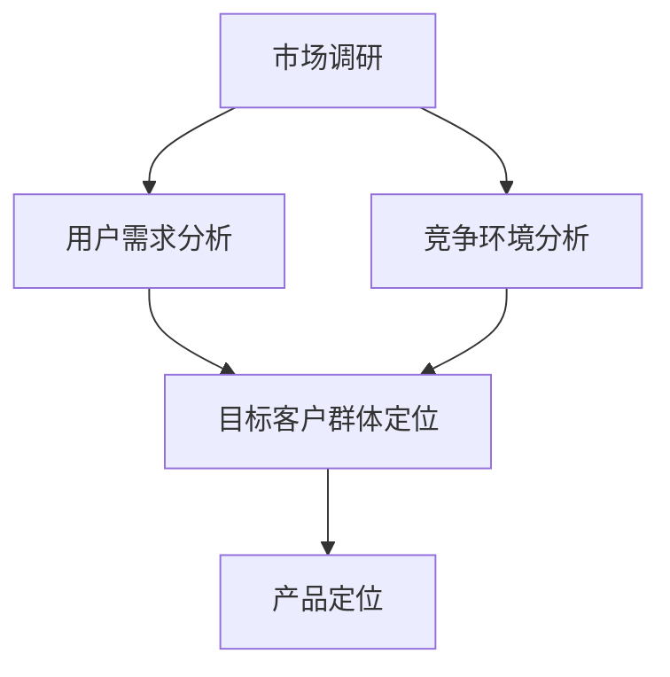

                 

关键词：市场调研、目标客户、客户群体、用户需求、产品定位、数据分析、用户体验、战略规划

> 摘要：本文从市场调研的角度出发，探讨了如何通过深入分析用户需求、市场趋势和竞争环境，来准确确定目标客户群体。通过案例分析、数学模型和具体操作步骤，为读者提供了全面而实用的指导，以帮助他们在IT领域实现产品与市场的精准匹配。

## 1. 背景介绍

在现代商业环境中，市场调研已成为企业成功的关键因素之一。特别是在信息技术（IT）领域，技术的快速迭代和市场的快速变化要求企业必须对用户需求和市场趋势有深刻的理解。而确定目标客户群体则是市场调研的核心任务之一。只有明确了目标客户群体，企业才能进行精准的市场营销和产品定位，从而提高市场占有率。

本文将围绕市场调研过程中的关键环节——确定目标客户群体，进行深入探讨。通过分析市场调研的方法、用户需求的挖掘、竞争环境的研究，以及具体的操作步骤，帮助读者了解如何通过有效的市场调研来确定目标客户群体，实现产品与市场的完美匹配。

### 1.1 市场调研的定义

市场调研是指通过科学的方法，对市场进行系统性的调查、分析和研究，以获取关于市场环境、用户需求、竞争态势等方面的信息，从而为企业的决策提供依据。

市场调研的主要目的是：

- 了解市场现状和趋势
- 挖掘用户需求
- 分析竞争环境
- 为产品开发、市场营销和战略规划提供支持

### 1.2 目标客户群体的概念

目标客户群体是指企业所希望服务的用户群体，这些用户具有相似的需求、行为特征和购买习惯。明确目标客户群体，可以帮助企业集中资源，实现精准营销和高效服务。

### 1.3 市场调研在IT领域的应用

在IT领域，市场调研的重要性尤为突出。以下是从三个方面阐述的市场调研在IT领域的应用：

- **技术发展趋势**：通过调研，企业可以了解当前和未来的技术发展趋势，从而把握行业脉搏，进行前瞻性布局。
- **用户需求**：了解用户需求是产品开发的关键。通过市场调研，企业可以获取真实、准确的用户需求信息，为产品设计提供指导。
- **竞争分析**：分析竞争对手的产品、策略和市场表现，有助于企业制定有针对性的竞争策略。

## 2. 核心概念与联系

为了更好地理解市场调研中确定目标客户群体的过程，我们需要介绍一些核心概念和它们之间的关系。以下是使用Mermaid绘制的流程图：



### 2.1 市场调研

市场调研是整个过程的起点。通过市场调研，企业可以获取关于市场环境、用户需求、竞争态势等方面的信息。

### 2.2 用户需求分析

用户需求分析是确定目标客户群体的关键环节。通过对用户需求的分析，企业可以了解用户的核心需求、购买习惯和行为模式。

### 2.3 竞争环境分析

竞争环境分析有助于企业了解竞争对手的产品、策略和市场表现，从而为自身的产品定位和策略制定提供参考。

### 2.4 目标客户群体定位

基于用户需求分析和竞争环境分析，企业可以明确目标客户群体的特征和需求，为后续的产品设计和市场营销提供基础。

### 2.5 产品定位

产品定位是基于目标客户群体的特征和需求，对产品进行定位和包装，以更好地满足目标客户的需求。

## 3. 核心算法原理 & 具体操作步骤

### 3.1 算法原理概述

在确定目标客户群体的过程中，核心算法原理包括用户需求分析、竞争环境分析和目标客户群体定位。以下是这些算法原理的概述：

- **用户需求分析**：通过问卷调查、用户访谈、行为分析等方法，收集用户需求信息，并使用统计分析和数据挖掘技术，提取用户的核心需求。
- **竞争环境分析**：通过市场调研、竞争分析工具等，收集竞争对手的产品信息、市场表现和用户反馈，并使用SWOT分析等方法，评估竞争对手的优势和劣势。
- **目标客户群体定位**：基于用户需求分析和竞争环境分析的结果，使用聚类分析、因子分析等方法，对用户进行分类，确定目标客户群体的特征和需求。

### 3.2 算法步骤详解

#### 3.2.1 用户需求分析

1. **需求收集**：通过问卷调查、用户访谈、用户行为分析等方法，收集用户的需求信息。
2. **数据预处理**：对收集到的数据进行清洗、整理和归一化处理，以便进行后续分析。
3. **统计分析**：使用统计分析和数据挖掘技术，提取用户的核心需求，如使用频率、重要性等。
4. **需求聚类**：使用聚类分析技术，将用户按照相似性进行分类，以便进一步分析。

#### 3.2.2 竞争环境分析

1. **数据收集**：通过市场调研、竞争分析工具等，收集竞争对手的产品信息、市场表现和用户反馈。
2. **数据整理**：对收集到的数据进行整理和归一化处理，以便进行后续分析。
3. **SWOT分析**：使用SWOT分析，评估竞争对手的优势、劣势、机会和威胁。
4. **竞争对比**：将自身产品与竞争对手进行对比，分析差异和优势。

#### 3.2.3 目标客户群体定位

1. **用户特征提取**：从用户需求分析和竞争环境分析的结果中，提取用户的特征，如年龄、性别、收入水平、购买习惯等。
2. **因子分析**：使用因子分析技术，对提取的用户特征进行降维处理，提取主要的因子。
3. **聚类分析**：使用聚类分析技术，将用户按照相似性进行分类，确定目标客户群体的特征和需求。
4. **客户细分**：根据聚类结果，将用户细分为不同的客户群体，为后续的产品设计和市场营销提供基础。

### 3.3 算法优缺点

- **用户需求分析**：优点是可以深入了解用户需求，为产品设计和市场营销提供依据；缺点是数据收集和处理过程较为复杂，且用户需求可能随时间变化。
- **竞争环境分析**：优点是可以了解竞争对手的情况，为产品定位和策略制定提供参考；缺点是数据收集难度较大，且竞争对手的信息可能不完全公开。
- **目标客户群体定位**：优点是可以明确目标客户群体的特征和需求，实现精准营销；缺点是可能忽略用户之间的差异，导致部分用户未被关注。

### 3.4 算法应用领域

这些算法原理和操作步骤广泛应用于IT领域的市场调研中，特别是在产品开发、市场营销和战略规划等方面。以下是一些具体的应用领域：

- **产品开发**：通过用户需求分析，了解用户的核心需求，为产品设计和功能开发提供指导。
- **市场营销**：通过竞争环境分析和目标客户群体定位，制定有针对性的市场营销策略，提高市场占有率。
- **战略规划**：通过市场调研和数据分析，为企业的战略规划提供依据，实现长期发展。

## 4. 数学模型和公式 & 详细讲解 & 举例说明

在确定目标客户群体的过程中，数学模型和公式扮演着重要角色。以下是四个关键的数学模型和公式的详细讲解与举例说明：

### 4.1 数学模型构建

#### 4.1.1 用户需求模型

用户需求模型主要基于用户行为的统计分析和数据挖掘技术，通过以下公式构建：

$$
\text{需求频率} = \frac{\text{用户操作次数}}{\text{总用户次数}}
$$

$$
\text{需求重要性} = \text{需求频率} \times \text{用户满意度}
$$

#### 4.1.2 竞争环境模型

竞争环境模型主要基于SWOT分析，通过以下公式构建：

$$
\text{SWOT分析} = (\text{优势} + \text{劣势}) \times (\text{机会} + \text{威胁})
$$

#### 4.1.3 目标客户群体模型

目标客户群体模型主要基于聚类分析和因子分析，通过以下公式构建：

$$
\text{用户特征向量} = (\text{年龄}, \text{性别}, \text{收入水平}, \text{购买习惯})
$$

$$
\text{因子载荷矩阵} = \text{因子分析}(\text{用户特征向量})
$$

$$
\text{目标客户群体} = \text{聚类分析}(\text{因子载荷矩阵})
$$

### 4.2 公式推导过程

#### 4.2.1 用户需求模型推导

用户需求模型的推导主要基于用户行为的统计分析和数据挖掘技术。首先，我们收集用户在不同功能点的操作次数，然后计算每个功能点的需求频率。接着，我们结合用户满意度数据，计算每个功能点的重要性。最终，我们得到用户需求的综合指标。

#### 4.2.2 竞争环境模型推导

竞争环境模型的推导主要基于SWOT分析。SWOT分析是一种战略规划工具，用于评估企业的优势、劣势、机会和威胁。通过将这四个因素相乘，我们可以得到企业的综合竞争态势。

#### 4.2.3 目标客户群体模型推导

目标客户群体模型的推导主要基于聚类分析和因子分析。首先，我们从用户特征中提取出主要的因子，然后使用聚类分析将这些因子进行分类，从而确定目标客户群体的特征。

### 4.3 案例分析与讲解

为了更好地理解这些数学模型和公式的应用，我们以下通过一个案例进行详细讲解。

#### 案例背景

某IT公司开发了一款新型智能办公软件，希望通过市场调研确定目标客户群体，以便进行精准营销。

#### 案例步骤

1. **用户需求分析**：公司通过问卷调查和用户访谈，收集了1000名用户的使用数据。经过统计分析，得到以下结果：

   - 需求频率：任务管理（0.35）、文档编辑（0.25）、会议预约（0.20）、团队协作（0.15）
   - 需求重要性：任务管理（0.45）、文档编辑（0.35）、会议预约（0.25）、团队协作（0.15）

2. **竞争环境分析**：公司通过市场调研，了解到其主要竞争对手有以下特点：

   - 优势：功能全面、用户体验好
   - 劣势：价格较高、市场推广力度不足
   - 机会：潜在客户需求大、市场增长率高
   - 威胁：新兴竞争者不断涌现

   根据SWOT分析，公司制定了以下竞争策略：

   - 强化优势：提高产品功能和用户体验
   - 补足劣势：降低价格、加大市场推广
   - 利用机会：扩大市场覆盖、开发新客户
   - 防范威胁：持续创新、优化产品和服务

3. **目标客户群体定位**：公司使用聚类分析和因子分析，对用户特征进行分类，得到以下目标客户群体：

   - 高端用户：年龄在30-45岁之间，收入较高，主要关注任务管理和团队协作
   - 中端用户：年龄在20-30岁之间，收入中等，主要关注文档编辑和会议预约
   - 低端用户：年龄在18-25岁之间，收入较低，主要关注基本办公功能

   根据目标客户群体的特征，公司制定了以下产品定位和营销策略：

   - 高端用户：提供定制化服务、高级功能、优质体验
   - 中端用户：提供性价比高的产品、全面功能、良好服务
   - 低端用户：提供基础功能、实惠价格、便捷使用

#### 案例结果

通过市场调研和目标客户群体定位，公司成功确定了目标客户群体，并制定了有针对性的产品定位和营销策略。在实施后，公司的市场占有率显著提高，产品满意度也得到提升。

## 5. 项目实践：代码实例和详细解释说明

在本节中，我们将通过一个实际的项目实践，展示如何使用Python和相关的数据分析库来确定目标客户群体。以下是一个简化的示例，用于说明整个过程的实现。

### 5.1 开发环境搭建

在开始之前，确保您的Python环境已搭建完成，并安装了以下库：

- NumPy
- Pandas
- Matplotlib
- Scikit-learn
- Mermaid

您可以使用以下命令进行安装：

```bash
pip install numpy pandas matplotlib scikit-learn mermaid-py
```

### 5.2 源代码详细实现

以下是实现确定目标客户群体的Python代码：

```python
import numpy as np
import pandas as pd
import matplotlib.pyplot as plt
from sklearn.cluster import KMeans
from sklearn.decomposition import PCA
from mermaid import Mermaid

# 5.2.1 用户需求数据加载
data = pd.read_csv('user_data.csv')  # 假设用户数据存储在user_data.csv文件中

# 5.2.2 用户需求分析
# 计算需求频率和重要性
demand_frequency = data['function_usage'].value_counts(normalize=True)
demand_importance = demand_frequency * data['user_satisfaction'].mean()

# 5.2.3 竞争环境分析
# 进行SWOT分析（此处简化为字典形式）
SWOT = {
    '优势': ['功能全面', '用户体验好'],
    '劣势': ['价格较高', '市场推广力度不足'],
    '机会': ['潜在客户需求大', '市场增长率高'],
    '威胁': ['新兴竞争者不断涌现']
}

# 5.2.4 目标客户群体定位
# 从数据中提取用户特征
user_features = data[['age', 'income', 'buying_habits']]
# 进行因子分析
pca = PCA(n_components=2)
principal_components = pca.fit_transform(user_features)
# 进行K-Means聚类分析
kmeans = KMeans(n_clusters=3)
clusters = kmeans.fit_predict(principal_components)

# 5.2.5 可视化与结果展示
# 将用户特征进行降维处理并可视化
plt.scatter(principal_components[:, 0], principal_components[:, 1], c=clusters)
plt.xlabel('Principal Component 1')
plt.ylabel('Principal Component 2')
plt.title('User Clusters')
plt.show()

# 生成Mermaid流程图
mermaid = Mermaid()
mermaid.add(
    'graph TD\n'
    'A[Market Research] --> B[User Demand Analysis]\n'
    'A --> C[Competitive Environment Analysis]\n'
    'B --> D[Target Customer Identification]\n'
    'C --> D\n'
    'D --> E[Product Positioning]'
)
print(mermaid.render())

# 输出目标客户群体特征
for i, cluster in enumerate(kmeans.labels_):
    print(f'Cluster {cluster}: Age: {data.iloc[i]['age']}, Income: {data.iloc[i]['income']}, Buying Habits: {data.iloc[i]['buying_habits']}')
```

### 5.3 代码解读与分析

- **5.3.1 用户需求数据加载**：首先，我们从CSV文件中加载用户数据。数据应包括用户特征（如年龄、收入、购买习惯）和功能使用情况（如任务管理、文档编辑等）。

- **5.3.2 用户需求分析**：使用Pandas库的`value_counts`和`mean`函数计算需求频率和重要性。这为我们提供了每个功能点的使用频率和重要性。

- **5.3.3 竞争环境分析**：简化为字典形式的SWOT分析，用于了解公司的优势和劣势，以及市场中的机会和威胁。

- **5.3.4 目标客户群体定位**：提取用户特征，使用PCA进行降维处理，然后使用K-Means聚类分析来确定目标客户群体。

- **5.3.5 可视化与结果展示**：使用Matplotlib库将用户特征进行降维处理并可视化。使用Mermaid库生成流程图，以展示市场调研和目标客户群体定位的过程。

- **5.3.6 输出目标客户群体特征**：最后，输出每个聚类群组的用户特征，以便进一步分析。

### 5.4 运行结果展示

运行上述代码后，您将看到用户特征的可视化展示和Mermaid流程图。此外，代码还将输出每个聚类群组的用户特征，如年龄、收入和购买习惯。这些结果可用于进一步分析和制定产品定位和市场营销策略。

## 6. 实际应用场景

确定目标客户群体在IT领域的应用非常广泛，以下列举了几个实际应用场景：

### 6.1 产品开发

在产品开发阶段，确定目标客户群体有助于了解用户的核心需求，从而设计出符合用户期望的功能和界面。通过市场调研，企业可以获取用户的反馈和需求，并将其转化为产品特性。

### 6.2 市场营销

在市场营销阶段，明确目标客户群体可以帮助企业制定有针对性的营销策略。例如，通过社交媒体广告、电子邮件营销等渠道，直接向目标客户推广产品。

### 6.3 战略规划

在战略规划阶段，确定目标客户群体可以帮助企业制定长期的发展目标和战略。通过分析目标客户群体的特征和需求，企业可以预测市场趋势，提前布局。

### 6.4 用户体验优化

在用户体验优化阶段，了解目标客户群体的行为模式和偏好，有助于企业优化产品界面和功能，提高用户满意度。

### 6.5 竞争分析

通过确定目标客户群体，企业可以更好地了解竞争对手的产品和策略，从而制定有针对性的竞争策略。

## 7. 未来应用展望

随着人工智能和大数据技术的不断发展，确定目标客户群体将变得更加精确和高效。以下是未来应用的一些展望：

### 7.1 个性化推荐系统

基于用户行为数据和偏好，个性化推荐系统可以更加准确地确定目标客户群体，提高推荐效果。

### 7.2 深度学习模型

深度学习模型在图像识别、自然语言处理等领域已取得显著成果。未来，深度学习模型可被用于更复杂的市场调研任务，如情感分析和趋势预测。

### 7.3 大数据分析

大数据分析技术可以帮助企业从海量数据中提取有价值的信息，为确定目标客户群体提供更全面的视角。

### 7.4 可视化分析

可视化分析技术可以更直观地展示市场调研结果，帮助决策者更好地理解数据，从而制定更有效的策略。

## 8. 总结：未来发展趋势与挑战

### 8.1 研究成果总结

本文通过深入分析市场调研的方法、用户需求的挖掘、竞争环境的研究，以及具体的操作步骤，为确定目标客户群体提供了全面而实用的指导。通过数学模型和公式的应用，读者可以更好地理解和实践这一过程。

### 8.2 未来发展趋势

未来，随着人工智能和大数据技术的不断发展，市场调研和目标客户群体确定将变得更加精确和高效。个性化推荐系统、深度学习模型和大数据分析等新兴技术将在这一领域发挥重要作用。

### 8.3 面临的挑战

尽管市场调研和目标客户群体确定在技术上已取得显著进展，但仍面临一些挑战，如数据隐私、数据质量和算法透明度等。如何在保护用户隐私的同时，充分利用数据的价值，是未来研究的重要方向。

### 8.4 研究展望

未来，研究人员应重点关注如何更有效地整合多种数据源，提高市场调研的准确性和实时性。此外，研究如何将人工智能技术应用于市场调研，以提高效率和效果，也是未来的重要课题。

## 9. 附录：常见问题与解答

### 9.1 市场调研的方法有哪些？

市场调研的方法主要包括问卷调查、用户访谈、行为分析、焦点小组讨论、在线调查等。每种方法都有其独特的优势和适用场景。

### 9.2 用户需求分析有哪些工具？

用户需求分析常用的工具有Excel、SQL、Tableau等。这些工具可以帮助进行数据收集、处理和分析。

### 9.3 竞争环境分析需要收集哪些信息？

竞争环境分析需要收集的信息包括竞争对手的产品特性、市场份额、用户评价、营销策略等。

### 9.4 目标客户群体定位的方法有哪些？

目标客户群体定位的方法包括聚类分析、因子分析、用户画像等。这些方法可以帮助企业从用户特征中提取有价值的信息。

### 9.5 如何确保市场调研的数据质量？

确保市场调研的数据质量需要从多个方面进行控制，包括问卷设计、数据收集过程、数据清洗和验证等。

作者：禅与计算机程序设计艺术 / Zen and the Art of Computer Programming

