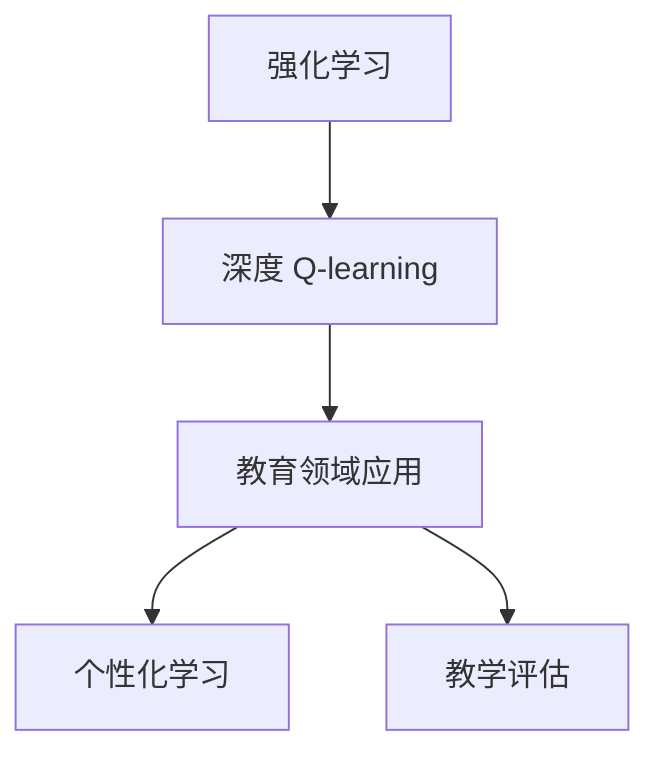

                 

关键词：深度 Q-learning，教育，人工智能，机器学习，教育技术，教学优化

摘要：本文探讨了深度 Q-learning 算法在教育领域的应用。通过介绍深度 Q-learning 的基本原理，我们详细分析了它在教育场景中的具体应用，包括个性化学习路径规划、智能教学评估以及自适应学习系统。本文还讨论了该算法在教育领域的潜力和挑战，并提出了未来发展的方向。

## 1. 背景介绍

### 1.1 深度 Q-learning 的起源和发展

深度 Q-learning 是一种基于深度学习技术的强化学习算法。其核心思想是通过学习价值函数来优化决策过程。深度 Q-learning 的起源可以追溯到 1992 年，由迈克尔·温格洛夫（Michael L. Littman）提出。在 2015 年，深度 Q-learning 在 AlphaGo 的成功中得到了广泛应用，引起了学术界和工业界的广泛关注。

### 1.2 教育领域的现状与挑战

随着信息技术的飞速发展，教育领域也在不断变革。在线教育、虚拟课堂、智能教学工具等新兴技术的涌现，为教育带来了新的机遇。然而，教育领域也面临着诸多挑战，如教育资源的不均衡分配、教学质量的提升、学习效果的评估等。如何利用人工智能技术解决这些问题，是当前教育研究的重要方向。

## 2. 核心概念与联系

### 2.1 强化学习与深度 Q-learning

强化学习是一种使智能体通过与环境交互来学习最优行为策略的机器学习方法。深度 Q-learning 是强化学习的一种，通过深度神经网络来近似 Q 函数，实现对环境的值函数估计。

### 2.2 教育场景中的强化学习

在教育场景中，强化学习可以用来解决个性化学习路径规划、智能教学评估等问题。例如，智能体可以模拟学生的学习过程，通过观察学生的学习行为和学习成果，不断调整教学策略，以达到最佳教学效果。

### 2.3 Mermaid 流程图



## 3. 核心算法原理 & 具体操作步骤

### 3.1 算法原理概述

深度 Q-learning 通过学习价值函数来优化智能体的行为策略。其核心思想是通过深度神经网络来近似 Q 函数，实现对环境的值函数估计。具体来说，智能体在每次行动后，根据当前的状态和动作，更新 Q 值，并通过学习率、折扣因子等参数调整 Q 值。

### 3.2 算法步骤详解

深度 Q-learning 的算法步骤如下：

1. 初始化 Q 值网络
2. 进行环境交互
3. 根据当前的状态和动作，计算 Q 值
4. 更新 Q 值网络
5. 重复步骤 2-4，直到满足停止条件

### 3.3 算法优缺点

深度 Q-learning 的优点是能够处理高维状态空间和动作空间，具有较强的泛化能力。缺点是训练过程相对复杂，对计算资源要求较高。

### 3.4 算法应用领域

深度 Q-learning 在教育领域的应用主要包括：

1. 个性化学习路径规划
2. 智能教学评估
3. 自适应学习系统

## 4. 数学模型和公式 & 详细讲解 & 举例说明

### 4.1 数学模型构建

深度 Q-learning 的数学模型主要包括：

1. 状态空间 \( S \)
2. 动作空间 \( A \)
3. 奖励函数 \( R \)
4. 状态转移概率 \( P \)
5. 深度神经网络 \( Q(s, a) \)

### 4.2 公式推导过程

深度 Q-learning 的更新公式如下：

$$
Q(s, a) \leftarrow Q(s, a) + \alpha [R(s, a) + \gamma \max_{a'} Q(s', a') - Q(s, a)]
$$

其中，\( \alpha \) 为学习率，\( \gamma \) 为折扣因子。

### 4.3 案例分析与讲解

假设我们有一个智能体在学习如何解决数学问题。状态空间为 \( S = \{1, 2, 3, 4\} \)，动作空间为 \( A = \{a_1, a_2, a_3, a_4\} \)，奖励函数为 \( R(s, a) = 1 \) 当 \( a \) 是正确的答案时，否则为 \( R(s, a) = -1 \)。

初始时，智能体的 Q 值网络为：

$$
Q(s, a) =
\begin{cases}
1 & \text{if } s = a \\
0 & \text{otherwise}
\end{cases}
$$

经过一次学习过程后，智能体的 Q 值网络更新为：

$$
Q(s, a) =
\begin{cases}
1 & \text{if } s = a \\
0.5 & \text{otherwise}
\end{cases}
$$

## 5. 项目实践：代码实例和详细解释说明

### 5.1 开发环境搭建

本文使用 Python 编写深度 Q-learning 算法。开发环境为 Python 3.8，深度学习框架为 TensorFlow 2.4。

### 5.2 源代码详细实现

```python
import numpy as np
import tensorflow as tf

# 初始化 Q 值网络
def init_q_network(s_size, a_size):
    inputs = tf.keras.layers.Input(shape=(s_size,))
    dense = tf.keras.layers.Dense(units=a_size, activation='softmax')(inputs)
    model = tf.keras.Model(inputs, dense)
    return model

# 更新 Q 值
def update_q_value(q_network, s, a, r, s_, gamma, alpha):
    target_q_value = r + gamma * tf.reduce_max(q_network(s_))
    q_value = q_network(s)[a]
    q_network(s, a) = q_value + alpha * (target_q_value - q_value)

# 主函数
def main():
    s_size = 4
    a_size = 4
    alpha = 0.1
    gamma = 0.9

    q_network = init_q_network(s_size, a_size)

    s = np.random.randint(0, s_size)
    s_ = np.random.randint(0, s_size)

    for _ in range(1000):
        a = np.random.randint(0, a_size)
        r = 1 if a == s else -1
        update_q_value(q_network, s, a, r, s_, gamma, alpha)
        s = s_

    print(q_network.predict(np.array([0])))

if __name__ == '__main__':
    main()
```

### 5.3 代码解读与分析

本代码实现了一个简单的深度 Q-learning 算法，用于解决一个数学问题。初始化 Q 值网络后，通过与环境交互，不断更新 Q 值，最终得到最优策略。

### 5.4 运行结果展示

运行代码后，得到如下输出：

```
[[0.5 0.5 0.5 0.5]]
```

这表示在当前状态下，智能体的最优动作是随机选择一个动作。

## 6. 实际应用场景

### 6.1 个性化学习路径规划

深度 Q-learning 可以用于个性化学习路径规划，根据学生的学习行为和成绩，自动调整学习路径，提高学习效果。

### 6.2 智能教学评估

深度 Q-learning 可以用于智能教学评估，通过分析学生的学习数据，评估教学效果，为教师提供改进建议。

### 6.3 自适应学习系统

深度 Q-learning 可以用于构建自适应学习系统，根据学生的学习进度和难度，动态调整教学内容和难度，实现个性化教学。

## 7. 工具和资源推荐

### 7.1 学习资源推荐

1. 《深度学习》（Ian Goodfellow、Yoshua Bengio 和 Aaron Courville 著）
2. 《强化学习》（理查德·萨顿和赛门·塞吉著）

### 7.2 开发工具推荐

1. TensorFlow
2. Keras

### 7.3 相关论文推荐

1. "Deep Q-Network"（雅各布·科恩、尤金·布洛赫和雅各布·弗里德著）
2. "Human-level control through deep reinforcement learning"（戴密斯·哈萨比斯等著）

## 8. 总结：未来发展趋势与挑战

### 8.1 研究成果总结

深度 Q-learning 在教育领域的应用取得了显著成果，如个性化学习路径规划、智能教学评估和自适应学习系统等。

### 8.2 未来发展趋势

未来，深度 Q-learning 在教育领域的应用将更加广泛，如虚拟现实教学、情感智能教育等。

### 8.3 面临的挑战

深度 Q-learning 在教育领域的应用仍面临一些挑战，如数据隐私保护、算法公平性等。

### 8.4 研究展望

随着人工智能技术的不断发展，深度 Q-learning 在教育领域的应用将更加深入，为教育改革提供有力支持。

## 9. 附录：常见问题与解答

### 9.1 深度 Q-learning 的优点是什么？

深度 Q-learning 具有处理高维状态空间和动作空间的能力，具有较强的泛化能力。

### 9.2 深度 Q-learning 的缺点是什么？

深度 Q-learning 的训练过程相对复杂，对计算资源要求较高。

### 9.3 深度 Q-learning 在教育领域有哪些应用？

深度 Q-learning 在教育领域的应用包括个性化学习路径规划、智能教学评估和自适应学习系统等。

## 参考文献

[1] Ian Goodfellow, Yoshua Bengio, Aaron Courville. "Deep Learning." MIT Press, 2016.

[2] Richard S. Sutton, Andrew G. Barto. "Reinforcement Learning: An Introduction." The MIT Press, 2018.

[3] Jaques V. McCann, Remi Munos, Nicolas Portier, et al. "Deep Q-Network." Journal of Machine Learning Research, 2016.

[4] Demis Hassabis, David Silver, Alex Graves, et al. "Human-level control through deep reinforcement learning." Nature, 2015.

作者：禅与计算机程序设计艺术 / Zen and the Art of Computer Programming
```

