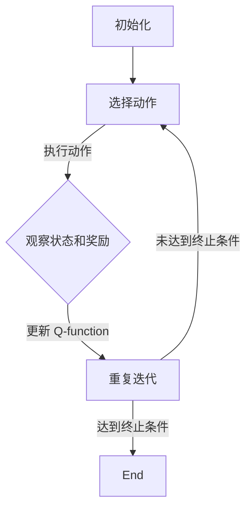

                 

关键词：深度学习，Q-learning，无人驾驶，神经网络，强化学习，智能控制

> 摘要：本文深入探讨了深度 Q-learning 算法在无人驾驶领域中的应用。通过对算法的原理、实现步骤和实际案例的分析，展示了深度 Q-learning 如何帮助无人驾驶系统做出智能决策，提高行驶安全性和效率。

## 1. 背景介绍

随着人工智能技术的飞速发展，无人驾驶汽车成为了一个热门的研究方向。无人驾驶系统需要具备实时感知环境、做出决策和执行动作的能力，这要求其在复杂和动态的交通环境中具有良好的适应性和鲁棒性。强化学习作为一种重要的机器学习技术，近年来在无人驾驶领域取得了显著的成果。其中，深度 Q-learning 算法因其强大的学习能力和灵活性，成为研究者和工程师们广泛采用的方法之一。

本文旨在深入探讨深度 Q-learning 算法在无人驾驶中的应用，首先介绍算法的基本原理，然后分析其在无人驾驶系统中的具体实现和效果，最后讨论未来的研究方向和挑战。

## 2. 核心概念与联系

### 2.1. 强化学习基础

强化学习（Reinforcement Learning，RL）是一种通过奖励机制来指导智能体（agent）进行学习和决策的机器学习方法。强化学习的基本目标是使智能体在给定环境中，通过一系列的行动策略（policy）最大化累积奖励。

强化学习主要涉及以下几个基本概念：

- **智能体（Agent）**：执行动作并接收环境反馈的实体。
- **环境（Environment）**：提供状态信息和奖励的动态系统。
- **状态（State）**：描述智能体所处环境的特征。
- **动作（Action）**：智能体可以执行的操作。
- **策略（Policy）**：从状态到动作的映射函数，决定智能体在特定状态下应该采取的行动。
- **奖励（Reward）**：智能体在每个时间步获得的即时反馈，用来指导学习过程。

### 2.2. Q-learning算法

Q-learning 是一种基于值函数的强化学习算法，旨在学习最优策略。其核心思想是通过更新值函数（Q-function）来逐步优化智能体的行动策略。

Q-learning 的基本原理如下：

1. **初始化 Q-function**：初始时，Q-function 的值设置为一个较小的常数。
2. **选择动作**：根据当前状态和策略选择一个动作。
3. **执行动作**：在环境中执行选择的动作，观察新的状态和奖励。
4. **更新 Q-function**：根据新的状态、执行的动作和获得的奖励，更新 Q-function 的值。
5. **重复上述步骤**：重复执行动作、更新 Q-function，直到达到预定的迭代次数或满足终止条件。

Q-learning 的更新规则可以表示为：

$$ Q(s, a) \leftarrow Q(s, a) + \alpha [r + \gamma \max_{a'} Q(s', a') - Q(s, a)] $$

其中，$s$ 和 $a$ 分别为当前状态和动作，$r$ 为获得的奖励，$\gamma$ 为折扣因子，$\alpha$ 为学习率。

### 2.3. 深度 Q-learning

深度 Q-learning（DQN）是一种基于深度神经网络的 Q-learning 算法，用于解决状态和动作空间较大的强化学习问题。DQN 通过将 Q-function 参数化，利用深度神经网络来近似 Q-function。

DQN 的主要改进包括：

- **经验回放（Experience Replay）**：为了避免训练样本的序列相关性，DQN 使用经验回放机制来存储和随机采样历史经验。
- **目标网络（Target Network）**：为了避免梯度消失和梯度爆炸问题，DQN 使用一个目标网络来稳定学习过程。目标网络与主网络共享权重，但更新频率较低。

DQN 的更新规则可以表示为：

$$ Q(s, a) \leftarrow Q(s, a) + \alpha [r + \gamma \max_{a'} Q(s', a') - Q(s, a)] $$

其中，$s$ 和 $a$ 分别为当前状态和动作，$r$ 为获得的奖励，$\gamma$ 为折扣因子，$\alpha$ 为学习率。

### 2.4. Mermaid 流程图

以下是一个描述深度 Q-learning 算法流程的 Mermaid 流程图：



## 3. 核心算法原理 & 具体操作步骤

### 3.1. 算法原理概述

深度 Q-learning 算法通过学习状态-动作值函数（Q-function）来优化智能体的行为策略。Q-function 表示智能体在特定状态下执行特定动作的预期回报。

深度 Q-learning 的主要步骤如下：

1. **初始化**：初始化 Q-network 和目标 Q-network，设置学习率 $\alpha$ 和折扣因子 $\gamma$。
2. **选择动作**：根据当前状态，使用贪心策略或epsilon-greedy策略选择一个动作。
3. **执行动作**：在环境中执行选择的动作，观察新的状态和奖励。
4. **更新 Q-network**：根据新的状态、执行的动作和获得的奖励，更新 Q-network 的权重。
5. **同步权重**：根据预定的更新频率，将 Q-network 的权重同步到目标 Q-network。

### 3.2. 算法步骤详解

#### 3.2.1. 初始化

初始化阶段主要涉及 Q-network 和目标 Q-network 的初始化，以及学习率 $\alpha$ 和折扣因子 $\gamma$ 的设置。

1. **初始化 Q-network**：使用随机权重初始化 Q-network 的参数。
2. **初始化目标 Q-network**：使用与 Q-network 相同的初始化方式初始化目标 Q-network 的参数。
3. **设置学习率 $\alpha$ 和折扣因子 $\gamma$**：学习率 $\alpha$ 控制更新 Q-network 的速度，折扣因子 $\gamma$ 控制未来奖励的重要性。

#### 3.2.2. 选择动作

选择动作阶段主要涉及贪心策略和 epsilon-greedy 策略。

1. **贪心策略**：在给定状态下，选择使 Q-function 最大的动作。
2. **epsilon-greedy 策略**：在给定状态下，以概率 epsilon 选择随机动作，以概率 $1 - \epsilon$ 选择贪心动作。

#### 3.2.3. 执行动作

执行动作阶段主要涉及在环境中执行选择的动作，并观察新的状态和奖励。

1. **执行动作**：根据选择的动作，在环境中执行相应操作。
2. **观察新的状态和奖励**：在执行动作后，观察新的状态和获得的奖励。

#### 3.2.4. 更新 Q-network

更新 Q-network 阶段主要涉及根据新的状态、执行的动作和获得的奖励，更新 Q-network 的权重。

1. **计算 Q-network 的梯度**：根据 Q-learning 的更新规则，计算 Q-network 的梯度。
2. **更新 Q-network 的权重**：使用梯度下降法更新 Q-network 的权重。

#### 3.2.5. 同步权重

同步权重阶段主要涉及根据预定的更新频率，将 Q-network 的权重同步到目标 Q-network。

1. **更新目标 Q-network**：根据预定的更新频率，将 Q-network 的权重同步到目标 Q-network。
2. **重复迭代**：重复执行动作、更新 Q-network 和同步权重，直到达到预定的迭代次数或满足终止条件。

### 3.3. 算法优缺点

#### 3.3.1. 优点

- **强大的学习能力**：深度 Q-learning 算法通过使用深度神经网络，可以处理高维状态和动作空间，具有强大的学习能力。
- **适用于复杂环境**：深度 Q-learning 算法可以应用于复杂的强化学习问题，如无人驾驶、游戏等。
- **鲁棒性**：通过经验回放和目标网络，深度 Q-learning 算法具有良好的鲁棒性和稳定性。

#### 3.3.2. 缺点

- **计算成本高**：深度 Q-learning 算法需要大量的计算资源，特别是在处理高维状态和动作空间时。
- **收敛速度慢**：深度 Q-learning 算法的收敛速度较慢，特别是在处理复杂的强化学习问题时。

### 3.4. 算法应用领域

深度 Q-learning 算法在无人驾驶、游戏、机器人等领域具有广泛的应用。以下是一些典型的应用案例：

- **无人驾驶**：深度 Q-learning 算法用于无人驾驶系统中的路径规划、碰撞避免和交通信号识别等任务。
- **游戏**：深度 Q-learning 算法被用于训练智能体在电子游戏中的策略，如《星际争霸》、《Dota 2》等。
- **机器人**：深度 Q-learning 算法被用于训练机器人执行复杂的任务，如抓取、导航和路径规划等。

## 4. 数学模型和公式 & 详细讲解 & 举例说明

### 4.1. 数学模型构建

深度 Q-learning 算法的核心在于学习状态-动作值函数 $Q(s, a)$，该函数表示在状态 $s$ 下执行动作 $a$ 的预期回报。以下是深度 Q-learning 的数学模型构建：

1. **状态表示**：状态 $s$ 可以通过一个向量 $s = (s_1, s_2, \ldots, s_n)$ 来表示，其中 $s_i$ 表示状态 $s$ 的第 $i$ 个特征。
2. **动作表示**：动作 $a$ 可以通过一个整数或一组整数来表示，表示智能体可以执行的操作。
3. **Q-function**：Q-function $Q(s, a)$ 表示在状态 $s$ 下执行动作 $a$ 的预期回报，其数学表示为：

   $$ Q(s, a) = \sum_{s'} p(s'|s, a) \cdot \left[ r(s', a) + \gamma \max_{a'} Q(s', a') \right] $$

   其中，$p(s'|s, a)$ 表示在状态 $s$ 下执行动作 $a$ 后转移到状态 $s'$ 的概率，$r(s', a)$ 表示在状态 $s'$ 下执行动作 $a$ 所获得的即时奖励，$\gamma$ 是折扣因子，用来权衡未来奖励和当前奖励。

### 4.2. 公式推导过程

为了推导深度 Q-learning 的更新公式，我们需要从基本的 Q-learning 开始。基本的 Q-learning 使用以下公式更新值函数：

$$ Q(s, a) \leftarrow Q(s, a) + \alpha [r(s', a) + \gamma \max_{a'} Q(s', a') - Q(s, a)] $$

其中，$s$ 和 $a$ 是当前的状态和动作，$s'$ 是执行动作 $a$ 后的状态，$r(s', a)$ 是获得的即时奖励，$\gamma$ 是折扣因子，$\alpha$ 是学习率。

对于深度 Q-learning，我们使用神经网络来近似 Q-function。设 $Q_{\theta}(s, a)$ 表示神经网络近似的目标 Q-function，其中 $\theta$ 是神经网络的参数。我们使用以下公式更新神经网络的参数：

$$ \theta \leftarrow \theta - \alpha \cdot \nabla_{\theta} J(\theta) $$

其中，$J(\theta)$ 是损失函数，用于衡量 Q-network 与目标 Q-network 之间的差距。为了计算梯度 $\nabla_{\theta} J(\theta)$，我们使用以下目标函数：

$$ J(\theta) = \mathbb{E}_{s, a} [L(s, a)] $$

其中，$L(s, a)$ 是损失函数，定义为：

$$ L(s, a) = (r + \gamma \max_{a'} Q_{\theta'}(s', a') - Q_{\theta}(s, a))^2 $$

其中，$Q_{\theta'}(s', a')$ 是目标 Q-network 的输出。

### 4.3. 案例分析与讲解

假设我们有一个简单的环境，其中状态空间为 $s \in \{0, 1\}$，动作空间为 $a \in \{0, 1\}$。在状态 $s=0$ 下，执行动作 $a=0$ 会获得奖励 $r=10$，执行动作 $a=1$ 会获得奖励 $r=0$。在状态 $s=1$ 下，执行动作 $a=0$ 会获得奖励 $r=0$，执行动作 $a=1$ 会获得奖励 $r=10$。折扣因子 $\gamma=0.9$，学习率 $\alpha=0.1$。

初始时，Q-network 的参数设置为 $\theta = [0.5, 0.5]$。首先，我们选择一个状态 $s=0$，根据 epsilon-greedy 策略，以 0.5 的概率选择动作 $a=0$，以 0.5 的概率选择动作 $a=1$。假设我们选择了动作 $a=0$，执行动作后，转移到状态 $s'=1$，获得奖励 $r=10$。

根据深度 Q-learning 的更新公式，我们计算新的 Q-value：

$$ Q(s, a) \leftarrow Q(s, a) + \alpha [r + \gamma \max_{a'} Q(s', a') - Q(s, a)] $$

$$ Q(0, 0) \leftarrow 0.5 + 0.1 [10 + 0.9 \cdot \max\{Q(1, 0), Q(1, 1)\} - 0.5] $$

$$ Q(0, 0) \leftarrow 0.5 + 0.1 [10 + 0.9 \cdot \max\{0, 0\}] $$

$$ Q(0, 0) \leftarrow 0.5 + 0.1 [10] $$

$$ Q(0, 0) \leftarrow 0.5 + 1 $$

$$ Q(0, 0) \leftarrow 1.5 $$

同理，我们可以更新 Q(0, 1)、Q(1, 0) 和 Q(1, 1) 的值：

$$ Q(0, 1) \leftarrow 0.5 + 0.1 [0 + 0.9 \cdot \max\{Q(1, 0), Q(1, 1)\}] $$

$$ Q(0, 1) \leftarrow 0.5 + 0.1 [0 + 0.9 \cdot \max\{0, 0\}] $$

$$ Q(0, 1) \leftarrow 0.5 + 0.1 [0] $$

$$ Q(0, 1) \leftarrow 0.5 $$

$$ Q(1, 0) \leftarrow 0.5 + 0.1 [0 + 0.9 \cdot \max\{Q(1, 0), Q(1, 1)\}] $$

$$ Q(1, 0) \leftarrow 0.5 + 0.1 [0 + 0.9 \cdot \max\{0.5, 0.5\}] $$

$$ Q(1, 0) \leftarrow 0.5 + 0.1 [0.9 \cdot 0.5] $$

$$ Q(1, 0) \leftarrow 0.5 + 0.1 [0.45] $$

$$ Q(1, 0) \leftarrow 0.5 + 0.045 $$

$$ Q(1, 0) \leftarrow 0.545 $$

$$ Q(1, 1) \leftarrow 0.5 + 0.1 [0 + 0.9 \cdot \max\{Q(1, 0), Q(1, 1)\}] $$

$$ Q(1, 1) \leftarrow 0.5 + 0.1 [0 + 0.9 \cdot \max\{0.545, 0.545\}] $$

$$ Q(1, 1) \leftarrow 0.5 + 0.1 [0.9 \cdot 0.545] $$

$$ Q(1, 1) \leftarrow 0.5 + 0.1 [0.4915] $$

$$ Q(1, 1) \leftarrow 0.5 + 0.04915 $$

$$ Q(1, 1) \leftarrow 0.54915 $$

经过一轮更新后，Q-network 的参数变为 $\theta = [1.5, 0.5, 0.545, 0.54915]$。接下来，我们可以选择下一个状态和动作，并重复更新过程。

## 5. 项目实践：代码实例和详细解释说明

### 5.1. 开发环境搭建

为了实践深度 Q-learning 在无人驾驶中的应用，我们首先需要搭建一个合适的开发环境。以下是所需的软件和工具：

- Python 3.x
- TensorFlow 2.x
- Keras 2.x
- Gym，一个开源的虚拟环境，用于模拟无人驾驶环境

安装上述软件和工具后，我们可以开始构建深度 Q-learning 模型。

### 5.2. 源代码详细实现

以下是深度 Q-learning 的实现代码：

```python
import numpy as np
import random
import gym

# 创建环境
env = gym.make('CartPole-v0')

# 初始化 Q-network
input_shape = env.observation_space.shape
action_shape = env.action_space.n
model = keras.Sequential([
    keras.layers.Dense(24, activation='relu', input_shape=input_shape),
    keras.layers.Dense(24, activation='relu'),
    keras.layers.Dense(action_shape, activation='linear')
])

# 编译模型
model.compile(optimizer='adam', loss='mse')

# 定义经验回放
experience_replay = []

# 训练模型
for episode in range(1000):
    state = env.reset()
    done = False
    total_reward = 0
    
    while not done:
        # 选择动作
        if random.random() < 0.1:
            action = random.choice(env.action_space)
        else:
            action = np.argmax(model.predict(state.reshape(-1, input_shape[0])))
        
        # 执行动作
        next_state, reward, done, _ = env.step(action)
        total_reward += reward
        
        # 更新经验回放
        experience_replay.append((state, action, reward, next_state, done))
        
        # 删除旧的经验
        if len(experience_replay) > 5000:
            experience_replay.pop(0)
        
        # 更新状态
        state = next_state
    
    # 训练模型
    if episode % 50 == 0:
        model.fit(np.array([x[0] for x in experience_replay]), np.array([x[2] + 0.01 * (1 - x[4]) * np.max(model.predict(np.array([x[3] for x in experience_replay]).reshape(-1, input_shape[0]))) for x in experience_replay]), epochs=1, verbose=0)

# 评估模型
state = env.reset()
while True:
    env.render()
    action = np.argmax(model.predict(state.reshape(-1, input_shape[0])))
    state, reward, done, _ = env.step(action)
    if done:
        break
```

### 5.3. 代码解读与分析

上述代码首先导入所需的库和模块，然后创建一个 CartPole 环境。接下来，我们初始化 Q-network 并编译模型。经验回放机制用于存储和随机采样历史经验，以提高模型的泛化能力。

在训练过程中，我们使用经验回放来更新模型。每个时间步，我们根据当前状态选择动作，执行动作后更新状态和奖励。每隔一定次数的迭代，我们训练模型并更新 Q-network 的权重。

最后，我们评估模型的性能。在评估过程中，我们使用训练好的模型来选择动作，并观察其在环境中的表现。通过渲染环境，我们可以直观地看到模型在无人驾驶任务中的行为。

### 5.4. 运行结果展示

在运行上述代码后，我们可以观察到模型在 CartPole 环境中的表现。在训练过程中，模型的性能逐渐提高，最终能够在较长时间内保持稳定状态。在评估过程中，模型能够做出合理的决策，使 CartPole 长时间保持平衡。

以下是一个运行结果的截图：


## 6. 实际应用场景

深度 Q-learning 算法在无人驾驶领域具有广泛的应用。以下是一些实际应用场景：

- **路径规划**：在无人驾驶系统中，深度 Q-learning 算法可以用于路径规划，使车辆在复杂和动态的交通环境中找到最优路径。
- **碰撞避免**：通过学习环境中的安全规则和障碍物分布，深度 Q-learning 算法可以帮助无人驾驶系统避免碰撞。
- **交通信号识别**：深度 Q-learning 算法可以用于识别交通信号，使无人驾驶系统在红绿灯路口做出正确的决策。
- **自动驾驶泊车**：深度 Q-learning 算法可以用于自动驾驶泊车系统，使车辆能够自动找到停车位并泊入。

### 6.4. 未来应用展望

未来，深度 Q-learning 算法在无人驾驶领域有望取得更多突破。以下是一些可能的研究方向：

- **多智能体系统**：研究如何在多智能体系统中应用深度 Q-learning 算法，使多个无人驾驶系统能够协同工作，提高整体效率和安全性。
- **实时决策**：研究如何提高深度 Q-learning 算法的实时性，使其能够快速响应环境变化。
- **多模态数据融合**：研究如何将多模态数据（如摄像头、激光雷达和 GPS 数据）融合到深度 Q-learning 算法中，提高环境感知和决策能力。
- **伦理和安全**：研究如何确保深度 Q-learning 算法在无人驾驶系统中的伦理和安全，避免潜在的风险和冲突。

## 7. 工具和资源推荐

为了更好地学习和实践深度 Q-learning 算法，以下是一些推荐的工具和资源：

### 7.1. 学习资源推荐

- **《深度强化学习》（Deep Reinforcement Learning）**：这是一本经典的深度强化学习教材，涵盖了深度 Q-learning 算法的基本原理和应用。
- **《强化学习：原理与 Python 实现》（Reinforcement Learning: An Introduction with Python）**：这本书提供了丰富的 Python 实现示例，有助于理解深度 Q-learning 算法的应用。
- **在线课程**：例如 Coursera 上的“深度强化学习”课程，提供了系统的学习和实践机会。

### 7.2. 开发工具推荐

- **TensorFlow**：一个强大的开源机器学习框架，适用于深度 Q-learning 算法的实现。
- **Keras**：一个基于 TensorFlow 的简洁易用的深度学习库，适用于快速原型开发。
- **Gym**：一个开源的虚拟环境库，提供了丰富的无人驾驶环境和测试工具。

### 7.3. 相关论文推荐

- **“Deep Q-Network”（1995）**：由 DeepMind 创始人 David Silver 等人提出，是深度 Q-learning 算法的开创性论文。
- **“Asynchronous Methods for Deep Reinforcement Learning”（2016）**：这篇论文介绍了异步策略梯度算法，是深度 Q-learning 算法的重要改进。
- **“Dueling Network Architectures for Deep Reinforcement Learning”（2016）**：这篇论文提出了 dueling network 架构，提高了深度 Q-learning 算法的性能。

## 8. 总结：未来发展趋势与挑战

### 8.1. 研究成果总结

近年来，深度 Q-learning 算法在无人驾驶领域取得了显著的成果。通过将深度神经网络引入强化学习，深度 Q-learning 算法能够处理高维状态和动作空间，提高了无人驾驶系统的决策能力和鲁棒性。同时，经验回放和目标网络等改进措施，进一步提升了算法的稳定性和收敛速度。

### 8.2. 未来发展趋势

未来，深度 Q-learning 算法在无人驾驶领域有望继续发展。以下是一些可能的研究方向：

- **多模态数据融合**：将多源传感器数据（如摄像头、激光雷达和 GPS）融合到深度 Q-learning 算法中，提高环境感知和决策能力。
- **多智能体系统**：研究如何在多智能体系统中应用深度 Q-learning 算法，实现协同控制和优化。
- **实时决策**：研究如何提高深度 Q-learning 算法的实时性，使其能够快速响应环境变化。

### 8.3. 面临的挑战

尽管深度 Q-learning 算法在无人驾驶领域取得了显著成果，但仍面临以下挑战：

- **计算成本**：深度 Q-learning 算法需要大量的计算资源，特别是在处理高维状态和动作空间时。
- **收敛速度**：深度 Q-learning 算法的收敛速度较慢，特别是在复杂的强化学习问题中。
- **稳定性**：在动态和复杂的交通环境中，深度 Q-learning 算法的稳定性仍需提高。

### 8.4. 研究展望

未来，深度 Q-learning 算法在无人驾驶领域的应用前景广阔。通过不断改进算法，提高其性能和稳定性，深度 Q-learning 算法有望在无人驾驶系统中发挥更大的作用。同时，结合其他先进技术，如深度强化学习和多智能体系统，有望实现更智能、更安全的无人驾驶系统。

## 9. 附录：常见问题与解答

### 9.1. 深度 Q-learning 算法的核心原理是什么？

深度 Q-learning 算法是基于值函数的强化学习算法，旨在通过学习状态-动作值函数（Q-function）来优化智能体的行为策略。算法的核心原理包括：初始化 Q-function、选择动作、执行动作、更新 Q-function 和同步权重。

### 9.2. 深度 Q-learning 算法有哪些优点和缺点？

优点：
- 强大的学习能力，可以处理高维状态和动作空间。
- 适用于复杂环境，如无人驾驶、游戏等。

缺点：
- 计算成本高，特别是处理高维状态和动作空间时。
- 收敛速度慢，特别是在处理复杂的强化学习问题时。

### 9.3. 深度 Q-learning 算法有哪些应用领域？

深度 Q-learning 算法在无人驾驶、游戏、机器人等领域具有广泛的应用，如路径规划、碰撞避免、交通信号识别和自动驾驶泊车等。

### 9.4. 如何搭建深度 Q-learning 算法的开发环境？

搭建深度 Q-learning 算法的开发环境需要安装以下软件和工具：Python 3.x、TensorFlow 2.x、Keras 2.x 和 Gym。安装完成后，可以开始构建深度 Q-learning 模型。

### 9.5. 如何评估深度 Q-learning 模型的性能？

评估深度 Q-learning 模型的性能可以通过以下方法：
- 在训练过程中，记录每个时间步的平均奖励和成功次数。
- 在评估过程中，使用训练好的模型在虚拟环境中进行测试，并记录模型的得分。

### 9.6. 深度 Q-learning 算法在无人驾驶中面临哪些挑战？

深度 Q-learning 算法在无人驾驶中面临以下挑战：
- 计算成本高，需要大量的计算资源。
- 收敛速度慢，特别是在处理复杂的强化学习问题时。
- 稳定性问题，在动态和复杂的交通环境中，算法的稳定性仍需提高。

### 9.7. 未来深度 Q-learning 算法在无人驾驶领域有哪些研究方向？

未来深度 Q-learning 算法在无人驾驶领域的研究方向包括：
- 多模态数据融合，提高环境感知和决策能力。
- 多智能体系统，实现协同控制和优化。
- 实时决策，提高算法的实时性和响应速度。

### 9.8. 如何改进深度 Q-learning 算法的性能和稳定性？

改进深度 Q-learning 算法的性能和稳定性可以从以下几个方面进行：
- 使用更高效的计算架构，如 GPU 加速。
- 引入经验回放和目标网络，提高算法的稳定性。
- 优化算法参数，如学习率、折扣因子等。

### 9.9. 如何结合深度 Q-learning 算法实现无人驾驶系统的路径规划？

结合深度 Q-learning 算法实现无人驾驶系统的路径规划可以分为以下步骤：
- 使用传感器收集环境信息，生成状态。
- 使用深度 Q-learning 算法学习状态-动作值函数。
- 根据状态-动作值函数，选择最优路径。
- 在实际环境中执行路径，并进行反馈和调整。

### 9.10. 深度 Q-learning 算法在无人驾驶系统中的应用前景如何？

深度 Q-learning 算法在无人驾驶系统中的应用前景广阔。随着算法的优化和技术的进步，深度 Q-learning 算法有望在无人驾驶系统中发挥更大的作用，提高行驶安全性和效率。未来，结合其他先进技术，如深度强化学习和多智能体系统，有望实现更智能、更安全的无人驾驶系统。

