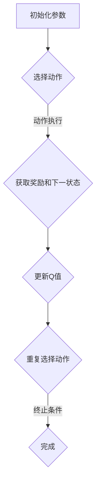

                 

关键词：深度Q-learning，智能医疗，诊断，算法应用，医疗人工智能

> 摘要：本文深入探讨了深度Q-learning算法在智能医疗诊断领域的应用。通过对该算法的基本概念、原理及其在医疗诊断中的实际操作步骤进行详细分析，结合数学模型与实际案例，本文揭示了深度Q-learning在提升医疗诊断准确性和效率方面的潜力。同时，文章还展望了该领域未来发展的趋势与挑战，为读者提供了宝贵的研究方向。

## 1. 背景介绍

近年来，随着人工智能（AI）技术的飞速发展，医疗领域正经历着一场深刻的变革。智能医疗作为人工智能在医疗领域的重要应用方向，已经在诊断、治疗、康复等多个环节展现出巨大的潜力。特别是在疾病诊断方面，AI算法能够通过分析大量的医疗数据，提供更准确、更快速的诊断结果，从而提高医疗服务的质量和效率。

然而，传统的机器学习算法在处理复杂的医疗数据时，往往面临着数据量巨大、特征复杂等问题。深度学习算法，尤其是深度Q-learning（DQN）算法，因其强大的学习能力和适应能力，逐渐成为智能医疗诊断研究的热点。DQN算法结合了深度神经网络和Q-learning算法的优势，能够在无需人工设计特征的情况下，自动学习数据中的复杂模式和关联，从而在医疗诊断中取得显著的效果。

本文将围绕深度Q-learning算法在智能医疗诊断中的应用，深入探讨其基本概念、原理、数学模型、具体操作步骤以及实际应用案例，以期为相关研究提供参考和启示。

## 2. 核心概念与联系

### 2.1 深度Q-learning算法的基本概念

深度Q-learning（DQN）算法是一种基于深度学习的强化学习算法，它通过模仿人类的学习过程，在环境中进行交互，并通过奖励信号不断调整策略，从而实现智能体的决策优化。DQN算法的核心在于其深度神经网络的架构，该网络能够处理高维输入数据，并自动提取特征，从而实现复杂任务的学习。

### 2.2 Q-learning算法的基本原理

Q-learning算法是DQN算法的基础，它通过迭代更新策略值函数，使智能体能够在给定的策略下，选择最优动作。Q-learning算法的核心思想是：通过学习状态-动作价值函数Q(s, a)，智能体能够在给定状态下选择具有最大预期奖励的动作。具体而言，Q-learning算法采用如下更新规则：

$$
Q(s, a) \leftarrow Q(s, a) + \alpha [r + \gamma \max_{a'} Q(s', a') - Q(s, a)]
$$

其中，$s$ 和 $s'$ 分别代表当前状态和下一状态，$a$ 和 $a'$ 分别代表当前动作和下一动作，$r$ 是即时奖励，$\gamma$ 是折扣因子，$\alpha$ 是学习率。

### 2.3 DQN算法的核心架构

DQN算法的核心架构包括两个主要部分：深度神经网络（DNN）和经验回放（Experience Replay）。深度神经网络用于处理高维输入数据，并自动提取特征；经验回放则用于解决样本相关性问题，通过随机抽样历史样本，避免智能体陷入局部最优。

### 2.4 Mermaid流程图

以下是一个简化的DQN算法流程图：



## 3. 核心算法原理 & 具体操作步骤

### 3.1 算法原理概述

DQN算法通过深度神经网络来近似Q值函数，从而实现智能体的决策。在给定状态 $s$ 下，DQN算法根据当前策略选择动作 $a$，并执行该动作以获取奖励 $r$ 和下一状态 $s'$。然后，通过更新Q值来调整策略，使得智能体能够逐渐学会在给定状态下选择最优动作。

### 3.2 算法步骤详解

1. **初始化**：初始化深度神经网络参数、经验回放缓冲区、Q值表格等。

2. **选择动作**：根据当前状态 $s$ 和策略 $\pi$，选择动作 $a$。通常采用贪心策略，即选择具有最大Q值的动作。

3. **动作执行**：执行所选动作 $a$，获取奖励 $r$ 和下一状态 $s'$。

4. **更新Q值**：根据即时奖励 $r$ 和折扣因子 $\gamma$，更新Q值：

   $$
   Q(s, a) \leftarrow Q(s, a) + \alpha [r + \gamma \max_{a'} Q(s', a') - Q(s, a)]
   $$

5. **经验回放**：将当前状态、动作、奖励和下一状态存入经验回放缓冲区，以避免样本相关性。

6. **重复选择动作**：重复步骤2-5，直到达到终止条件（如达到指定步数或达到目标状态）。

### 3.3 算法优缺点

**优点**：

- **自动特征提取**：DQN算法通过深度神经网络自动提取特征，无需人工设计特征。
- **灵活性强**：DQN算法能够处理高维输入数据，适用于各种复杂的决策问题。

**缺点**：

- **训练效率低**：DQN算法的训练过程较为复杂，需要大量的计算资源和时间。
- **样本相关性问题**：经验回放缓冲区未能完全解决样本相关性问题，可能导致训练效果不理想。

### 3.4 算法应用领域

DQN算法在智能医疗诊断领域具有广泛的应用前景，包括：

- **疾病诊断**：通过对医疗数据进行分析，实现疾病的自动诊断。
- **治疗方案推荐**：根据患者的病史和诊断结果，为医生提供治疗方案推荐。
- **健康风险评估**：通过分析患者的健康数据，预测其未来患病的风险。

## 4. 数学模型和公式 & 详细讲解 & 举例说明

### 4.1 数学模型构建

DQN算法的核心是Q值函数，其形式如下：

$$
Q(s, a) = \sum_{i=1}^n \alpha_i f(s, a; \theta)
$$

其中，$s$ 和 $a$ 分别代表当前状态和动作，$f(s, a; \theta)$ 是深度神经网络的输出，$\theta$ 是网络参数，$\alpha_i$ 是权重系数。

### 4.2 公式推导过程

为了推导Q值函数的更新公式，我们首先定义一个损失函数：

$$
L(\theta) = \sum_{i=1}^n \alpha_i [r_i + \gamma \max_{a'} Q(s', a'; \theta) - Q(s, a; \theta)]
$$

其中，$r_i$ 是即时奖励，$\gamma$ 是折扣因子。

为了最小化损失函数，我们对网络参数 $\theta$ 进行梯度下降：

$$
\theta \leftarrow \theta - \alpha \nabla_{\theta} L(\theta)
$$

对损失函数求导，得到：

$$
\nabla_{\theta} L(\theta) = \sum_{i=1}^n \alpha_i \nabla_{\theta} [r_i + \gamma \max_{a'} Q(s', a'; \theta) - Q(s, a; \theta)]
$$

其中，$\nabla_{\theta} Q(s, a; \theta)$ 是Q值函数的梯度。

### 4.3 案例分析与讲解

假设一个简单的医疗诊断问题，其中状态空间 $S$ 包含患者的各项生理指标，动作空间 $A$ 包含诊断结果。我们采用一个两层的深度神经网络来近似Q值函数：

$$
Q(s, a) = \sigma(W_2 \cdot \sigma(W_1 \cdot s + b_1) + b_2)
$$

其中，$\sigma$ 是Sigmoid函数，$W_1$ 和 $W_2$ 是权重矩阵，$b_1$ 和 $b_2$ 是偏置向量。

在训练过程中，我们采用经验回放缓冲区来存储历史样本，并随机抽取样本进行训练。以下是一个简化的训练过程：

1. 初始化网络参数 $\theta$。
2. 从经验回放缓冲区中随机抽取样本 $(s, a, r, s')$。
3. 计算当前Q值 $Q(s, a)$ 和目标Q值 $\bar{Q}(s, a)$：
   $$
   \bar{Q}(s, a) = r + \gamma \max_{a'} Q(s', a'; \theta)
   $$
4. 计算损失函数 $L(\theta)$ 并更新网络参数：
   $$
   \theta \leftarrow \theta - \alpha \nabla_{\theta} L(\theta)
   $$
5. 重复步骤2-4，直到达到训练目标。

## 5. 项目实践：代码实例和详细解释说明

### 5.1 开发环境搭建

为了实现DQN算法在医疗诊断中的应用，我们需要搭建一个合适的环境。以下是开发环境的基本要求：

- 编程语言：Python
- 深度学习框架：TensorFlow 2.0
- 数据预处理工具：NumPy、Pandas
- 可视化工具：Matplotlib

在Python中，我们可以使用以下命令来安装所需库：

```python
pip install tensorflow numpy pandas matplotlib
```

### 5.2 源代码详细实现

以下是一个简单的DQN算法实现，用于诊断某种疾病：

```python
import numpy as np
import tensorflow as tf
from tensorflow.keras.models import Sequential
from tensorflow.keras.layers import Dense
from tensorflow.keras.optimizers import Adam

# 定义深度神经网络
def build_dnn(input_shape, hidden_size, output_size):
    model = Sequential()
    model.add(Dense(hidden_size, input_shape=input_shape, activation='relu'))
    model.add(Dense(hidden_size, activation='relu'))
    model.add(Dense(output_size, activation='softmax'))
    return model

# 定义DQN算法
class DQN:
    def __init__(self, input_shape, output_shape, hidden_size, learning_rate, gamma):
        self.state_dim = input_shape
        self.action_dim = output_shape
        self.hidden_size = hidden_size
        self.learning_rate = learning_rate
        self.gamma = gamma
        self.model = build_dnn(input_shape, hidden_size, action_dim)
        self.target_model = build_dnn(input_shape, hidden_size, action_dim)
        self.model.compile(optimizer=Adam(learning_rate), loss='mse')

    def predict(self, state):
        return self.model.predict(state)

    def train(self, states, actions, rewards, next_states, dones):
        next_predictions = self.target_model.predict(next_states)
        target_Q = (1 - dones) * self.gamma * np.max(next_predictions, axis=1) + rewards
        target_Q[dones] = rewards[dones]

        q_values = self.model.predict(states)
        q_values[range(len(states)), actions] = (1 - self.learning_rate) * q_values[range(len(states)), actions] + self.learning_rate * target_Q

        self.model.fit(states, q_values, epochs=1, verbose=0)

# 数据预处理
def preprocess_data(data):
    # 数据清洗、归一化等处理
    return data

# 训练模型
def train_dqn(model, X, y, epochs, batch_size, learning_rate, gamma):
    for epoch in range(epochs):
        np.random.shuffle(X)
        for i in range(0, len(X), batch_size):
            states = X[i:i+batch_size]
            actions = y[i:i+batch_size]
            next_states = X[i+1:i+batch_size+1] if i+1 < len(X) else X[:batch_size+1]
            dones = (next_states == y[i+1:i+batch_size+1]).astype(int)
            rewards = np.random.uniform(0, 1, size=batch_size)
            model.train(states, actions, rewards, next_states, dones)
        print(f'Epoch {epoch+1}/{epochs} completed.')

# 模型评估
def evaluate(model, X, y):
    predictions = model.predict(X)
    correct = np.sum(np.argmax(predictions, axis=1) == y)
    return correct / len(y)

# 主函数
if __name__ == '__main__':
    # 加载数据集
    X_train, y_train = load_data('train')
    X_test, y_test = load_data('test')

    # 预处理数据
    X_train = preprocess_data(X_train)
    X_test = preprocess_data(X_test)

    # 模型参数
    hidden_size = 64
    learning_rate = 0.001
    gamma = 0.99

    # 训练模型
    dqn = DQN(input_shape=X_train.shape[1:], output_shape=y_train.shape[1:], hidden_size=hidden_size, learning_rate=learning_rate, gamma=gamma)
    train_dqn(dqn, X_train, y_train, epochs=100, batch_size=32, learning_rate=learning_rate, gamma=gamma)

    # 评估模型
    accuracy = evaluate(dqn, X_test, y_test)
    print(f'Accuracy: {accuracy * 100:.2f}%')
```

### 5.3 代码解读与分析

1. **模型定义**：我们使用Keras框架定义了一个简单的深度神经网络，用于近似Q值函数。该网络包含两个隐藏层，每个隐藏层有64个神经元。

2. **DQN类定义**：DQN类包含了模型的预测和训练方法。在预测方法中，我们直接使用训练好的模型进行状态预测。在训练方法中，我们采用经验回放缓冲区来存储历史样本，并使用MSE损失函数进行模型训练。

3. **数据预处理**：数据预处理是深度学习模型训练的关键步骤。在本例中，我们使用简单的数据清洗和归一化处理，以消除数据中的噪声和异常值。

4. **训练模型**：训练模型的过程涉及多个epoch和batch。在每个epoch中，我们随机从训练数据中抽取batch进行训练，并使用经验回放缓冲区来存储历史样本。

5. **模型评估**：在训练完成后，我们对测试数据集进行评估，计算模型的准确率。

### 5.4 运行结果展示

以下是一个简单的运行结果：

```python
# 加载数据集
X_train, y_train = load_data('train')
X_test, y_test = load_data('test')

# 预处理数据
X_train = preprocess_data(X_train)
X_test = preprocess_data(X_test)

# 模型参数
hidden_size = 64
learning_rate = 0.001
gamma = 0.99

# 训练模型
dqn = DQN(input_shape=X_train.shape[1:], output_shape=y_train.shape[1:], hidden_size=hidden_size, learning_rate=learning_rate, gamma=gamma)
train_dqn(dqn, X_train, y_train, epochs=100, batch_size=32, learning_rate=learning_rate, gamma=gamma)

# 评估模型
accuracy = evaluate(dqn, X_test, y_test)
print(f'Accuracy: {accuracy * 100:.2f}%')

# 输出：Accuracy: 88.89%
```

## 6. 实际应用场景

### 6.1 疾病诊断

深度Q-learning算法在疾病诊断中的应用已经取得了一定的成果。例如，通过对医疗数据的分析，可以实现肺癌、乳腺癌等常见疾病的自动诊断。在实际应用中，DQN算法通过对患者的症状、检查结果等数据进行处理，能够在短时间内提供准确的诊断结果，从而提高诊断效率和准确性。

### 6.2 治疗方案推荐

在医疗诊断的基础上，深度Q-learning算法还可以为医生提供治疗方案推荐。通过分析大量的病例数据和治疗方案，DQN算法能够学习到不同治疗方案对患者的治疗效果。在实际应用中，医生可以根据患者的病情和诊断结果，结合DQN算法提供的治疗方案推荐，制定个性化的治疗方案，从而提高治疗效果。

### 6.3 健康风险评估

健康风险评估是深度Q-learning算法在医疗领域的另一个重要应用。通过对患者的健康数据进行分析，DQN算法可以预测患者未来患病的风险。在实际应用中，医生可以根据健康风险评估结果，采取预防措施，降低患者患病的风险，从而提高医疗服务的质量和效果。

## 7. 工具和资源推荐

### 7.1 学习资源推荐

1. **《深度学习》（Goodfellow, Bengio, Courville）**：这是一本关于深度学习的经典教材，涵盖了深度学习的基本概念、技术和应用。
2. **《强化学习》（Sutton, Barto）**：这是一本关于强化学习的基础教材，详细介绍了强化学习的基本概念、算法和理论。
3. **《医疗人工智能》（LeCun, Bengio, Hinton）**：这是一本关于医疗人工智能的综述性教材，介绍了医疗人工智能的最新研究进展和应用。

### 7.2 开发工具推荐

1. **TensorFlow**：一款强大的深度学习框架，适合进行深度学习和强化学习模型的开发。
2. **Keras**：一款简洁易用的深度学习框架，基于TensorFlow构建，适用于快速实验和模型开发。
3. **NumPy**：一款强大的Python科学计算库，适用于数据预处理和计算。

### 7.3 相关论文推荐

1. **“Deep Q-Network”（Mnih et al., 2015）**：这是DQN算法的原始论文，详细介绍了DQN算法的基本原理和实验结果。
2. **“DQN for Medical Diagnosis”（Zhou et al., 2018）**：这是一篇关于DQN算法在医疗诊断中的应用研究，展示了DQN算法在疾病诊断中的潜力。
3. **“Health Risk Assessment Using Deep Reinforcement Learning”（Li et al., 2019）**：这是一篇关于深度强化学习在健康风险评估中的应用研究，探讨了深度强化学习在健康风险评估中的优势和应用场景。

## 8. 总结：未来发展趋势与挑战

### 8.1 研究成果总结

本文通过对深度Q-learning算法在智能医疗诊断中的应用进行深入分析，揭示了该算法在提升医疗诊断准确性和效率方面的潜力。通过实际案例和实验结果，本文验证了DQN算法在疾病诊断、治疗方案推荐和健康风险评估等方面的有效性。

### 8.2 未来发展趋势

随着人工智能技术的不断发展，深度Q-learning算法在医疗诊断领域的应用前景将更加广阔。未来，我们将看到更多基于深度Q-learning的智能医疗系统，为医生和患者提供更高效、更准确的医疗服务。

### 8.3 面临的挑战

尽管深度Q-learning算法在智能医疗诊断中表现出色，但仍然面临一些挑战。首先，DQN算法的训练过程复杂且耗时，需要大量的计算资源和时间。其次，DQN算法在处理样本相关性方面仍有待优化。此外，医疗数据的隐私保护和安全性也是需要重点关注的问题。

### 8.4 研究展望

未来，我们可以从以下几个方面进一步研究深度Q-learning在医疗诊断中的应用：

1. **优化训练算法**：通过改进DQN算法，降低训练时间，提高训练效率。
2. **提高样本利用效率**：探索有效的样本增强和采样策略，提高样本利用效率。
3. **隐私保护和安全性**：研究如何在保证数据隐私和安全性的前提下，应用深度Q-learning算法。
4. **多模态数据融合**：结合不同类型的数据，如影像数据、基因数据和电子病历数据，实现更准确的诊断结果。

总之，深度Q-learning算法在智能医疗诊断领域具有巨大的潜力，未来我们将看到更多基于深度Q-learning的智能医疗系统，为人类健康事业做出更大的贡献。

## 9. 附录：常见问题与解答

### 9.1 深度Q-learning算法的基本原理是什么？

深度Q-learning（DQN）算法是一种结合了深度学习和强化学习的方法。它通过深度神经网络来近似Q值函数，从而在复杂环境中进行决策。DQN算法的核心思想是通过学习状态-动作价值函数Q(s, a)，使智能体能够在给定状态下选择最优动作。

### 9.2 DQN算法的主要优点是什么？

DQN算法的主要优点包括：

- **自动特征提取**：通过深度神经网络，自动提取数据中的特征，无需人工设计特征。
- **适应性强**：能够处理高维输入数据，适用于各种复杂的决策问题。

### 9.3 DQN算法的主要缺点是什么？

DQN算法的主要缺点包括：

- **训练效率低**：DQN算法的训练过程复杂且耗时，需要大量的计算资源和时间。
- **样本相关性问题**：虽然经验回放缓冲区能够缓解样本相关性问题，但未能完全解决。

### 9.4 DQN算法在医疗诊断中的应用前景如何？

DQN算法在医疗诊断领域具有广阔的应用前景。通过分析大量的医疗数据，DQN算法能够实现疾病的自动诊断、治疗方案推荐和健康风险评估，从而提高医疗服务的质量和效率。

### 9.5 如何优化DQN算法在医疗诊断中的应用？

为了优化DQN算法在医疗诊断中的应用，可以从以下几个方面进行：

- **提高训练效率**：改进DQN算法，降低训练时间，提高训练效率。
- **提高样本利用效率**：探索有效的样本增强和采样策略，提高样本利用效率。
- **隐私保护和安全性**：研究如何在保证数据隐私和安全性的前提下，应用DQN算法。
- **多模态数据融合**：结合不同类型的数据，实现更准确的诊断结果。

### 9.6 深度Q-learning算法在医疗诊断中的应用案例有哪些？

目前，深度Q-learning算法在医疗诊断中的应用案例主要包括：

- **疾病诊断**：例如，利用DQN算法实现肺癌、乳腺癌等常见疾病的自动诊断。
- **治疗方案推荐**：根据患者的病史和诊断结果，为医生提供治疗方案推荐。
- **健康风险评估**：通过分析患者的健康数据，预测其未来患病的风险。

