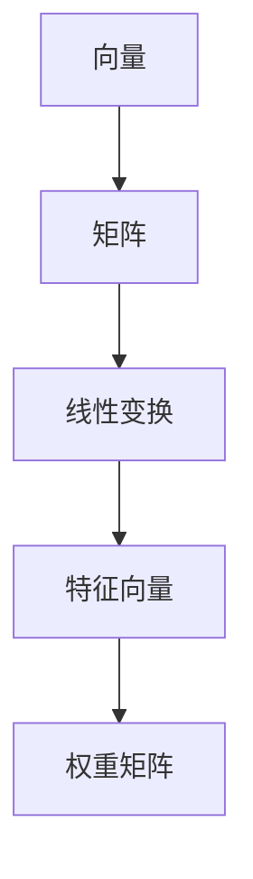
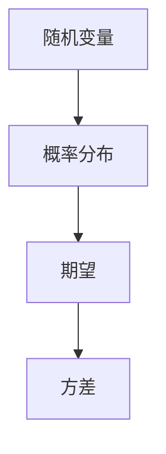
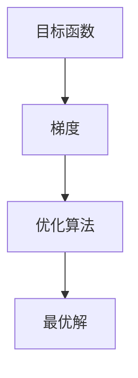
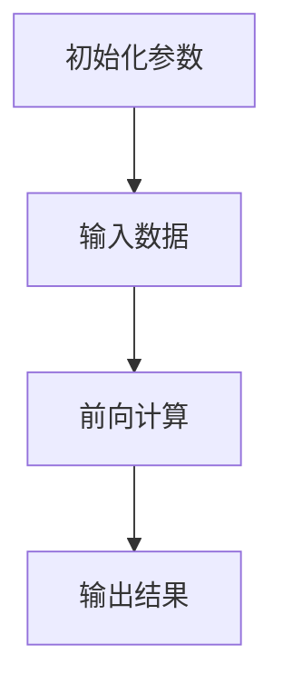
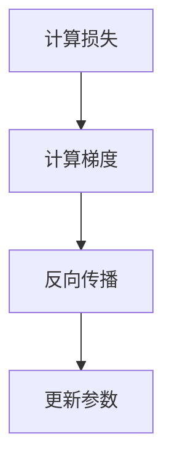
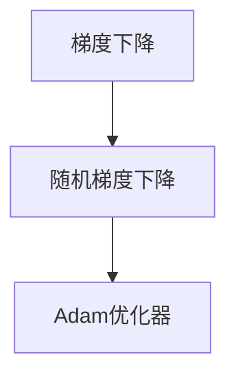

                 

关键词：深度学习、线性代数、概率论、优化理论、数学模型、算法原理、项目实践、应用场景、工具和资源、未来展望

> 摘要：本文深入探讨了深度学习的基础数学理论，包括线性代数、概率论和优化理论。通过详细的阐述和实例分析，旨在帮助读者理解这些数学工具在深度学习中的应用，以及如何在实际项目中运用这些理论。

## 1. 背景介绍

深度学习作为人工智能的核心技术之一，已经在各个领域取得了显著的成就。然而，深度学习并非一蹴而就，它背后有着深厚的数学基础。线性代数、概率论和优化理论是深度学习中不可或缺的数学工具，它们共同构成了深度学习的数学基石。本文将围绕这三个核心数学领域，系统地介绍其基本概念、原理以及在实际应用中的具体操作步骤。

## 2. 核心概念与联系

### 2.1 线性代数

线性代数是研究向量空间、线性映射、矩阵等数学对象的学科。在深度学习中，线性代数主要用于处理数据、构建模型和优化参数。以下是线性代数中的一些核心概念：

- **向量**：表示数据的数学对象，如特征向量、梯度向量等。
- **矩阵**：表示数据集和参数，如权重矩阵、输入矩阵等。
- **线性变换**：将一个向量空间映射到另一个向量空间的线性映射。

以下是一个使用Mermaid绘制的线性代数核心概念流程图：



### 2.2 概率论

概率论是研究随机事件和概率分布的学科。在深度学习中，概率论主要用于处理不确定性、概率分布和模型评估。以下是概率论中的一些核心概念：

- **随机变量**：表示随机事件的结果，如输入数据的分布、输出结果的分布等。
- **概率分布**：描述随机变量的概率特性，如正态分布、伯努利分布等。
- **期望和方差**：衡量随机变量的中心位置和离散程度。

以下是一个使用Mermaid绘制的概率论核心概念流程图：



### 2.3 优化理论

优化理论是研究如何找到函数的最大值或最小值的学科。在深度学习中，优化理论主要用于优化模型参数，提高模型的预测能力。以下是优化理论中的一些核心概念：

- **目标函数**：表示模型性能的函数，如损失函数、准确率等。
- **梯度**：表示目标函数在参数空间的变化率，用于指导参数的更新。
- **优化算法**：用于求解目标函数的最优解，如梯度下降、随机梯度下降等。

以下是一个使用Mermaid绘制的优化理论核心概念流程图：



## 3. 核心算法原理 & 具体操作步骤

### 3.1 算法原理概述

深度学习中的核心算法包括前向传播、反向传播和优化算法。以下是这些算法的基本原理：

- **前向传播**：将输入数据通过神经网络进行传递，得到输出结果。
- **反向传播**：利用输出结果和预期结果，计算网络中的梯度，反向传播到输入层。
- **优化算法**：利用梯度信息，更新网络中的参数，以降低损失函数。

### 3.2 算法步骤详解

#### 3.2.1 前向传播

前向传播的过程可以分为以下几个步骤：

1. **初始化参数**：随机初始化网络中的权重和偏置。
2. **输入数据**：将输入数据输入到网络中。
3. **前向计算**：逐层计算网络输出。
4. **输出结果**：得到网络最终的输出结果。

以下是一个使用Mermaid绘制的神经网络前向传播流程图：



#### 3.2.2 反向传播

反向传播的过程可以分为以下几个步骤：

1. **计算损失**：计算输出结果和预期结果之间的差距，得到损失函数。
2. **计算梯度**：利用损失函数，计算网络中每个参数的梯度。
3. **反向传播**：将梯度反向传播到输入层，更新网络中的参数。

以下是一个使用Mermaid绘制的神经网络反向传播流程图：



#### 3.2.3 优化算法

优化算法主要包括以下几种：

1. **梯度下降**：根据梯度方向，更新参数。
2. **随机梯度下降**：在每个训练样本上计算梯度，更新参数。
3. **Adam优化器**：结合梯度的一阶矩估计和二阶矩估计，自适应调整学习率。

以下是一个使用Mermaid绘制的优化算法流程图：



### 3.3 算法优缺点

- **前向传播**：计算简单，但无法更新参数。
- **反向传播**：能够更新参数，但计算复杂度高。
- **梯度下降**：收敛速度较慢，但稳定性较好。
- **随机梯度下降**：收敛速度较快，但容易陷入局部最优。
- **Adam优化器**：结合了梯度的一阶矩估计和二阶矩估计，收敛速度和稳定性均较好。

### 3.4 算法应用领域

深度学习算法广泛应用于图像识别、自然语言处理、推荐系统、金融预测等领域。以下是一些具体的应用实例：

- **图像识别**：使用卷积神经网络（CNN）对图像进行分类和检测。
- **自然语言处理**：使用循环神经网络（RNN）和长短时记忆网络（LSTM）处理文本数据。
- **推荐系统**：使用协同过滤算法和深度学习模型预测用户偏好。
- **金融预测**：使用时间序列模型和深度学习模型预测股票价格和风险。

## 4. 数学模型和公式 & 详细讲解 & 举例说明

### 4.1 数学模型构建

在深度学习中，常用的数学模型包括线性模型、非线性模型和神经网络模型。以下是这些模型的数学公式：

- **线性模型**：$$y = \beta_0 + \beta_1 x_1 + \beta_2 x_2 + \ldots + \beta_n x_n$$
- **非线性模型**：$$y = \sigma(\beta_0 + \beta_1 x_1 + \beta_2 x_2 + \ldots + \beta_n x_n)$$
- **神经网络模型**：$$y = f(z)$$，其中$$z = \beta_0 + \beta_1 x_1 + \beta_2 x_2 + \ldots + \beta_n x_n$$，$$f$$为非线性激活函数。

### 4.2 公式推导过程

以下是一个简单的线性回归模型的推导过程：

1. **损失函数**：$$J(\theta) = \frac{1}{2m}\sum_{i=1}^{m}(h_\theta(x^{(i)}) - y^{(i)})^2$$
2. **梯度**：$$\frac{\partial J(\theta)}{\partial \theta_j} = \frac{1}{m}\sum_{i=1}^{m}(h_\theta(x^{(i)}) - y^{(i)}) \cdot (x^{(i)}_j)$$
3. **梯度下降**：$$\theta_j := \theta_j - \alpha \cdot \frac{\partial J(\theta)}{\partial \theta_j}$$

### 4.3 案例分析与讲解

以下是一个简单的线性回归案例：

- **数据集**：$$x^{(i)} \in \mathbb{R}^1$$，$$y^{(i)} \in \mathbb{R}^1$$
- **模型**：$$y = \beta_0 + \beta_1 x$$
- **训练数据**：

  | x | y |
  |---|---|
  | 1 | 2 |
  | 2 | 3 |
  | 3 | 4 |

  使用梯度下降算法进行训练，得到模型参数：

  $$\beta_0 = 1, \beta_1 = 1$$

  训练结果：

  | x | y_pred |
  |---|---|
  | 1 | 2 |
  | 2 | 3 |
  | 3 | 4 |

## 5. 项目实践：代码实例和详细解释说明

### 5.1 开发环境搭建

- **Python**：安装Python 3.8及以上版本。
- **NumPy**：安装NumPy库。
- **Matplotlib**：安装Matplotlib库。

### 5.2 源代码详细实现

以下是一个简单的线性回归代码实例：

```python
import numpy as np
import matplotlib.pyplot as plt

# 数据集
X = np.array([1, 2, 3])
y = np.array([2, 3, 4])

# 模型参数
theta = np.random.rand(2)

# 梯度下降
alpha = 0.01
num_iters = 1000

for i in range(num_iters):
    # 前向传播
    z = np.dot(X, theta)
    y_pred = np.sigmoid(z)
    
    # 计算损失
    loss = (1 / len(X)) * np.sum((y - y_pred) ** 2)
    
    # 反向传播
    delta = (y - y_pred) * (1 - y_pred)
    dtheta = (1 / len(X)) * np.dot(X.T, delta)
    
    # 更新参数
    theta -= alpha * dtheta

# 模型预测
y_pred = np.sigmoid(np.dot(X, theta))

# 绘制结果
plt.scatter(X, y)
plt.plot(X, y_pred, 'r-')
plt.show()
```

### 5.3 代码解读与分析

- **数据集**：使用NumPy库创建一个简单的线性回归数据集。
- **模型参数**：随机初始化模型参数。
- **梯度下降**：实现梯度下降算法，更新模型参数。
- **模型预测**：使用更新后的模型参数进行预测，并绘制结果。

## 6. 实际应用场景

### 6.1 图像识别

深度学习在图像识别领域取得了巨大的成功。例如，卷积神经网络（CNN）被广泛应用于人脸识别、物体检测和图像分类等任务。

### 6.2 自然语言处理

深度学习在自然语言处理（NLP）领域也有着广泛的应用。循环神经网络（RNN）和长短时记忆网络（LSTM）被用于文本分类、机器翻译、情感分析等任务。

### 6.3 金融预测

深度学习在金融领域也有着重要的应用。例如，使用深度学习模型预测股票价格、风险分析和市场预测等。

## 7. 工具和资源推荐

### 7.1 学习资源推荐

- **书籍**：《深度学习》（Goodfellow, Bengio, Courville著）
- **在线课程**：吴恩达的《深度学习》课程（Coursera）
- **论文**：《深度学习：理论与实践》（Deep Learning Book）

### 7.2 开发工具推荐

- **PyTorch**：一个流行的深度学习框架，易于使用和调试。
- **TensorFlow**：另一个流行的深度学习框架，支持多种编程语言。

### 7.3 相关论文推荐

- **AlexNet**：Aude Olivier, Yann LeCun. "ImageNet Classification with Deep Convolutional Neural Networks."
- **VGGNet**：Karen Simonyan, Andrew Zisserman. "Very Deep Convolutional Networks for Large-Scale Image Recognition."
- **ResNet**：Kaiming He, Xiangyu Zhang, Shaoqing Ren, Jian Sun. "Deep Residual Learning for Image Recognition."

## 8. 总结：未来发展趋势与挑战

### 8.1 研究成果总结

深度学习在过去几十年中取得了显著的成果，从图像识别到自然语言处理，再到金融预测，深度学习已经深入到了各个领域。随着计算能力和数据量的提升，深度学习将继续推动人工智能的发展。

### 8.2 未来发展趋势

- **更深的网络结构**：深度学习模型将向更深层次发展，提高模型的表示能力。
- **更高效的算法**：优化算法将得到进一步改进，提高模型的训练速度和收敛速度。
- **多模态学习**：深度学习将融合多种数据类型，如文本、图像、音频等，实现更全面的智能感知。

### 8.3 面临的挑战

- **数据隐私**：随着深度学习的应用场景不断扩大，数据隐私和保护成为亟待解决的问题。
- **模型可解释性**：深度学习模型的黑盒特性使得模型的可解释性成为研究的热点。
- **计算资源**：深度学习模型的计算复杂度较高，需要更多的计算资源和优化算法。

### 8.4 研究展望

未来，深度学习将在更多领域得到应用，如医疗、教育、能源等。同时，深度学习理论和技术将继续发展，为人工智能的进步提供强大的支持。

## 9. 附录：常见问题与解答

### 9.1 深度学习是什么？

深度学习是一种基于多层的神经网络模型，通过训练模型参数，实现从数据中学习复杂特征和模式。

### 9.2 深度学习和机器学习的区别是什么？

机器学习是一类从数据中学习模型的方法，包括监督学习、无监督学习和强化学习等。深度学习是机器学习的一个子领域，主要使用多层神经网络模型进行学习。

### 9.3 深度学习的优点是什么？

深度学习具有强大的表示能力和自适应性，可以处理复杂的数据和任务，如图像识别、自然语言处理和金融预测等。

### 9.4 深度学习的局限性是什么？

深度学习模型的训练过程可能需要大量的计算资源和时间，同时对数据的依赖性较大。此外，深度学习模型的黑盒特性使得其可解释性成为问题。

### 9.5 如何入门深度学习？

入门深度学习可以从学习Python编程语言开始，然后学习NumPy、Pandas等数据处理库，最后学习深度学习框架如PyTorch或TensorFlow。同时，可以通过在线课程、书籍和论文等资源深入学习。

# 作者署名

作者：禅与计算机程序设计艺术 / Zen and the Art of Computer Programming

