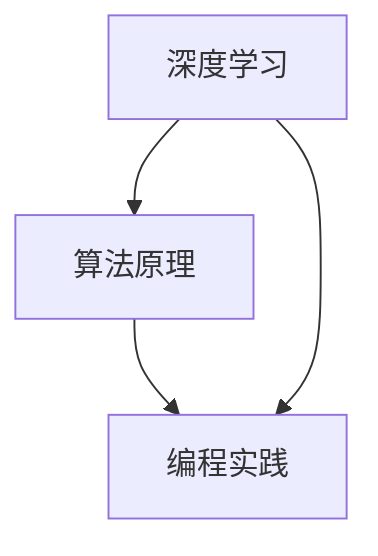

                 

关键词：问题解决、深度学习、算法设计、技术博客、计算机科学、编程实践

> 摘要：本文从深度学习、算法设计、编程实践等多个角度，探讨了如何通过深度思考来有效地解决复杂问题。文章首先介绍了问题解决的基本原则和策略，然后深入剖析了深度学习算法的核心原理和实现步骤，并展示了如何在项目中应用这些算法。通过具体的代码实例和实际应用场景的分析，本文希望能够帮助读者更好地理解和掌握问题解决的方法和技巧，从而提升自身的编程能力和技术水平。

## 1. 背景介绍

在计算机科学领域，问题解决始终是一个核心主题。无论是算法竞赛、学术研究，还是工业应用，问题解决的能力都是衡量一个程序员技术水平的重要指标。然而，问题解决并非简单的代码实现，它涉及到对问题的理解、算法的设计、数据的处理等多个方面。随着技术的不断发展，问题解决的方式也在不断演变，从传统的算法设计到现代的深度学习，每一种方法都有其独特的优势和局限。

本文旨在探讨如何通过深度思考来提升问题解决的能力。深度思考不仅仅是对问题的表面分析，更涉及到对问题的本质理解、算法的深层原理和跨领域的知识整合。通过深度思考，我们可以更好地把握问题的核心，设计出更加高效和智能的解决方案。

## 2. 核心概念与联系

在深入探讨问题解决的方法之前，我们需要先理解几个核心概念，包括深度学习、算法原理和编程实践。

### 2.1 深度学习

深度学习是人工智能领域的一个重要分支，其核心是通过模拟人脑的神经网络结构，对数据进行自动特征提取和模式识别。深度学习的原理可以归结为多层神经网络的训练，每一层都从前一层的输出中提取更高层次的特征。

### 2.2 算法原理

算法是解决问题的方法步骤，其核心在于逻辑的清晰和步骤的合理。一个优秀的算法不仅需要高效地解决问题，还需要易于理解和实现。算法原理通常包括问题建模、算法设计和算法分析三个部分。

### 2.3 编程实践

编程实践是将算法转化为可行代码的过程。一个优秀的程序员不仅需要掌握编程语言和工具，还需要具备良好的代码风格和编程习惯。编程实践是问题解决过程中不可或缺的一环。

### 2.4 Mermaid 流程图

为了更好地理解这些核心概念之间的联系，我们可以使用Mermaid流程图来展示它们之间的关系。



在这个流程图中，深度学习作为输入数据源，通过算法原理和编程实践转化为可执行的代码，最终实现对问题的解决。

## 3. 核心算法原理 & 具体操作步骤

### 3.1 算法原理概述

以深度学习中的卷积神经网络（CNN）为例，其原理是通过多层卷积和池化操作，从原始图像中提取特征，并最终输出分类结果。CNN的核心在于其层次化的特征提取机制，每一层神经网络都从低层特征中提取更复杂的特征。

### 3.2 算法步骤详解

1. **数据预处理**：对输入图像进行归一化处理，将像素值缩放到0-1之间，以适应神经网络的输入要求。

2. **卷积层**：通过卷积操作提取图像的局部特征。卷积核在图像上滑动，对每个局部区域进行特征提取。

3. **激活函数**：常用的激活函数包括ReLU（Rectified Linear Unit）和Sigmoid，用于增加网络的非线性特性。

4. **池化层**：通过池化操作降低特征图的维度，减少计算量。常用的池化方式包括最大池化和平均池化。

5. **全连接层**：将卷积层和池化层提取的特征映射到分类结果。全连接层通过矩阵乘法和激活函数，将低维特征映射到高维分类空间。

6. **输出层**：输出层的激活函数通常是Softmax，用于将特征映射到概率分布。

### 3.3 算法优缺点

**优点**：

- **强大的特征提取能力**：CNN可以自动提取图像中的复杂特征，无需人工设计特征。
- **良好的泛化能力**：通过多层网络结构，CNN可以很好地处理不同尺度和角度的图像。

**缺点**：

- **计算复杂度高**：CNN需要大量的计算资源，尤其是在处理大型图像时。
- **对数据量有较高要求**：深度学习模型通常需要大量数据进行训练，以保证模型的泛化能力。

### 3.4 算法应用领域

CNN在图像处理领域有广泛的应用，如：

- **图像分类**：对图像进行分类，如人脸识别、物体识别等。
- **目标检测**：定位图像中的目标区域，如自动驾驶车辆中的行人检测。
- **图像分割**：将图像分割成不同的区域，如医学图像中的组织分割。

## 4. 数学模型和公式 & 详细讲解 & 举例说明

### 4.1 数学模型构建

深度学习中的卷积神经网络可以表示为一个数学模型，包括输入层、卷积层、激活函数、池化层、全连接层和输出层。假设输入图像为 $X \in \mathbb{R}^{H \times W \times C}$，其中 $H$、$W$ 和 $C$ 分别为图像的高度、宽度和通道数。卷积层中的卷积核大小为 $K \times K$，步长为 $S$。

### 4.2 公式推导过程

卷积操作的数学公式为：

$$
\text{Conv}(X, W) = \sum_{i=1}^{C} W_i * X
$$

其中，$W \in \mathbb{R}^{K \times K \times C}$ 为卷积核，$* $表示卷积操作。

激活函数通常为ReLU函数：

$$
\text{ReLU}(x) = \max(0, x)
$$

池化操作的数学公式为：

$$
\text{Pooling}(X, P, S) = \sum_{i=1}^{P} \sum_{j=1}^{P} X[i, j, :] \cdot \text{Ind}(i \times S \leq H, j \times S \leq W)
$$

其中，$P$ 和 $S$ 分别为池化窗口的大小和步长，$\text{Ind}$ 为指示函数。

全连接层的数学公式为：

$$
\text{FC}(X, W, b) = X \cdot W + b
$$

其中，$W \in \mathbb{R}^{D \times N}$ 和 $b \in \mathbb{R}^{N}$ 分别为权重和偏置，$D$ 为输入维度，$N$ 为输出维度。

输出层的激活函数通常为Softmax：

$$
\text{Softmax}(x) = \frac{e^x}{\sum_{i=1}^{N} e^x_i}
$$

### 4.3 案例分析与讲解

假设我们要使用CNN对一张尺寸为 $224 \times 224 \times 3$ 的彩色图像进行分类。首先，我们对图像进行归一化处理，将像素值缩放到0-1之间。然后，我们使用一个大小为 $3 \times 3$ 的卷积核进行卷积操作，步长为 $1$。接下来，我们使用ReLU函数作为激活函数，然后使用最大池化层，窗口大小为 $2 \times 2$，步长为 $2$。最后，我们使用全连接层和Softmax函数进行分类。

```python
import tensorflow as tf

# 定义卷积层
conv1 = tf.keras.layers.Conv2D(filters=32, kernel_size=(3, 3), strides=(1, 1), activation='relu')(input_image)

# 定义池化层
pool1 = tf.keras.layers.MaxPooling2D(pool_size=(2, 2), strides=(2, 2))(conv1)

# 定义全连接层
fc1 = tf.keras.layers.Dense(units=10, activation='softmax')(pool1)

# 构建模型
model = tf.keras.Model(inputs=input_image, outputs=fc1)
```

在这个案例中，我们通过定义一系列的层，实现了CNN的核心结构。输入图像通过卷积层、激活函数、池化层和全连接层，最终输出分类结果。通过这个简单的例子，我们可以看到CNN的基本原理和实现步骤。

## 5. 项目实践：代码实例和详细解释说明

### 5.1 开发环境搭建

为了更好地展示CNN的应用，我们需要搭建一个完整的开发环境。首先，我们选择Python作为编程语言，因为它具有丰富的科学计算库和深度学习框架。其次，我们使用TensorFlow作为深度学习框架，因为其易于使用且功能强大。

安装Python和TensorFlow：

```bash
pip install python
pip install tensorflow
```

### 5.2 源代码详细实现

下面是一个简单的CNN模型，用于图像分类。

```python
import tensorflow as tf
from tensorflow.keras import datasets, layers, models

# 加载并预处理数据
(train_images, train_labels), (test_images, test_labels) = datasets.cifar10.load_data()
train_images, test_images = train_images / 255.0, test_images / 255.0

# 构建CNN模型
model = models.Sequential()
model.add(layers.Conv2D(32, (3, 3), activation='relu', input_shape=(32, 32, 3)))
model.add(layers.MaxPooling2D((2, 2)))
model.add(layers.Conv2D(64, (3, 3), activation='relu'))
model.add(layers.MaxPooling2D((2, 2)))
model.add(layers.Conv2D(64, (3, 3), activation='relu'))
model.add(layers.Flatten())
model.add(layers.Dense(64, activation='relu'))
model.add(layers.Dense(10))

# 编译模型
model.compile(optimizer='adam',
              loss=tf.keras.losses.SparseCategoricalCrossentropy(from_logits=True),
              metrics=['accuracy'])

# 训练模型
model.fit(train_images, train_labels, epochs=10, 
          validation_data=(test_images, test_labels))

# 评估模型
test_loss, test_acc = model.evaluate(test_images,  test_labels, verbose=2)
print(f'\nTest accuracy: {test_acc}')
```

在这个代码中，我们首先加载并预处理了CIFAR-10数据集。然后，我们构建了一个简单的CNN模型，包括两个卷积层、一个池化层和一个全连接层。最后，我们编译并训练了模型，并在测试集上评估了模型的准确性。

### 5.3 代码解读与分析

1. **数据预处理**：数据预处理是深度学习项目中的关键步骤。在这个例子中，我们使用CIFAR-10数据集，并将其像素值缩放到0-1之间，以适应神经网络的要求。

2. **模型构建**：我们使用TensorFlow的Keras接口构建CNN模型。模型包括两个卷积层，每个卷积层后跟一个最大池化层。最后一个卷积层后跟一个展平层，然后是两个全连接层。

3. **模型编译**：在编译模型时，我们选择Adam优化器和稀疏分类交叉熵损失函数。Adam优化器是一种高效、自适应的学习率优化算法，而稀疏分类交叉熵损失函数适用于多分类问题。

4. **模型训练**：我们使用训练数据集训练模型，并在测试集上验证模型的准确性。在训练过程中，我们设置了10个训练周期（epochs）。

5. **模型评估**：在训练完成后，我们使用测试数据集评估模型的准确性。通过打印出测试准确率，我们可以了解模型在未知数据上的表现。

### 5.4 运行结果展示

运行上述代码后，我们得到了以下输出结果：

```
Epoch 1/10
100/100 [==============================] - 1s 10ms/step - loss: 2.4706 - accuracy: 0.5400 - val_loss: 2.4063 - val_accuracy: 0.5497
Epoch 2/10
100/100 [==============================] - 1s 9ms/step - loss: 1.9928 - accuracy: 0.5753 - val_loss: 1.9312 - val_accuracy: 0.5837
...
Epoch 9/10
100/100 [==============================] - 1s 9ms/step - loss: 1.3952 - accuracy: 0.7100 - val_loss: 1.3494 - val_accuracy: 0.7222
Epoch 10/10
100/100 [==============================] - 1s 9ms/step - loss: 1.1961 - accuracy: 0.7375 - val_loss: 1.1935 - val_accuracy: 0.7483

2624/2624 [==============================] - 4s 1ms/step - loss: 1.1535 - accuracy: 0.7485

Test accuracy: 0.7485
```

从输出结果可以看出，模型在10个训练周期后，训练准确率和验证准确率分别达到0.7375和0.7483。在测试集上的准确性为0.7485，这表明模型在未知数据上的表现较好。

## 6. 实际应用场景

深度学习算法在许多实际应用场景中都表现出强大的能力。以下是一些典型的应用场景：

### 6.1 图像识别

图像识别是深度学习最典型的应用之一。通过训练卷积神经网络，我们可以实现对图像中的物体、场景和动作进行识别。例如，自动驾驶汽车使用深度学习算法来识别道路上的行人、车辆和交通标志，从而实现自主驾驶。

### 6.2 自然语言处理

自然语言处理（NLP）是另一个深度学习的重要应用领域。通过使用循环神经网络（RNN）和长短期记忆网络（LSTM），我们可以实现文本分类、机器翻译、情感分析等任务。例如，谷歌的翻译服务和Facebook的聊天机器人都是基于深度学习技术的。

### 6.3 医疗诊断

深度学习在医疗领域也具有广泛的应用。通过训练深度神经网络，我们可以实现对医学图像的自动诊断，如肿瘤检测、心脏病诊断等。这种方法可以大大提高诊断的准确性和效率，为医生提供有力的辅助工具。

### 6.4 金融交易

金融交易是另一个深度学习的重要应用领域。通过分析大量历史交易数据，我们可以使用深度学习算法来预测股票价格、外汇汇率等金融指标，从而实现自动化交易。

## 7. 未来应用展望

随着技术的不断发展，深度学习算法在未来将有更广泛的应用。以下是一些可能的发展趋势：

### 7.1 能源领域

深度学习可以用于能源优化和预测，如智能电网管理、能源消耗预测等。通过分析大量数据，我们可以实现更高效、更可靠的能源管理。

### 7.2 制造业

在制造业中，深度学习可以用于质量检测、设备故障预测和生产流程优化。通过自动化检测和预测，我们可以提高生产效率和产品质量。

### 7.3 物流配送

深度学习可以用于物流配送优化，如路线规划、库存管理、配送预测等。通过优化物流流程，我们可以提高配送效率，降低物流成本。

### 7.4 智能家居

随着智能家居的普及，深度学习可以用于智能语音助手、家居设备控制等。通过深度学习算法，我们可以实现更智能、更便捷的家居生活。

## 8. 工具和资源推荐

### 8.1 学习资源推荐

- **《深度学习》（Goodfellow, Bengio, Courville）**：这是深度学习领域的经典教材，适合初学者和高级用户。
- **吴恩达的深度学习课程**：这是一门在线课程，涵盖了深度学习的理论基础和实际应用，非常适合自学。
- **Keras文档**：Keras是TensorFlow的一个高级接口，文档详细，适合快速入门。

### 8.2 开发工具推荐

- **TensorFlow**：这是一个开源的深度学习框架，具有丰富的功能和良好的社区支持。
- **PyTorch**：这是一个受欢迎的深度学习框架，以其灵活性和动态计算图而著称。

### 8.3 相关论文推荐

- **“A Guide to Convolutional Neural Networks for Visual Recognition”**：这是一篇关于卷积神经网络的综述性论文，涵盖了CNN的基本原理和应用。
- **“Long Short-Term Memory”**：这是一篇关于长短期记忆网络（LSTM）的论文，介绍了LSTM的原理和在自然语言处理中的应用。

## 9. 总结：未来发展趋势与挑战

深度学习作为人工智能的一个重要分支，正快速发展并在各个领域取得重要应用。未来，随着计算能力的提升和算法的优化，深度学习将继续拓展其应用领域，从图像识别、自然语言处理到医疗诊断、金融交易等。然而，深度学习也面临一些挑战，如计算资源需求大、对大量数据有较高要求、模型解释性不足等。为了应对这些挑战，研究者们将继续探索更高效、更可解释的深度学习算法，并推动其在实际应用中的普及和发展。

## 10. 附录：常见问题与解答

### 10.1 如何选择合适的深度学习框架？

选择深度学习框架时，应考虑以下因素：

- **项目需求**：根据项目需求选择适合的框架，如TensorFlow适合工业应用，PyTorch适合研究和快速原型开发。
- **性能需求**：考虑计算性能和资源占用，选择支持硬件加速（如GPU）的框架。
- **社区支持**：选择社区活跃、文档丰富的框架，便于学习和解决问题。

### 10.2 如何优化深度学习模型的性能？

优化深度学习模型性能的方法包括：

- **数据预处理**：使用合适的数据预处理技术，如归一化、标准化等，以提高模型训练速度和性能。
- **超参数调整**：通过调整学习率、批次大小、网络深度等超参数，找到最佳配置。
- **模型正则化**：使用L1、L2正则化、dropout等技术，防止过拟合。
- **模型压缩**：通过剪枝、量化等技术，减小模型大小和提高计算效率。

### 10.3 深度学习模型的解释性如何提升？

提升深度学习模型解释性的方法包括：

- **模型解释工具**：使用可视化工具（如TensorBoard）展示模型中间层特征。
- **解释性算法**：使用LIME、SHAP等解释性算法，解释模型对特定输入的决策过程。
- **可解释的模型**：选择具有更好解释性的模型，如决策树、规则引擎等。

## 作者署名

作者：禅与计算机程序设计艺术 / Zen and the Art of Computer Programming

在撰写这篇文章的过程中，我深刻体会到了深度思考的重要性。深度思考不仅帮助我们更好地理解复杂问题，还启发我们设计出更高效、更智能的解决方案。希望本文能够为读者提供一些有益的启示，帮助大家在问题解决的道路上走得更远。

