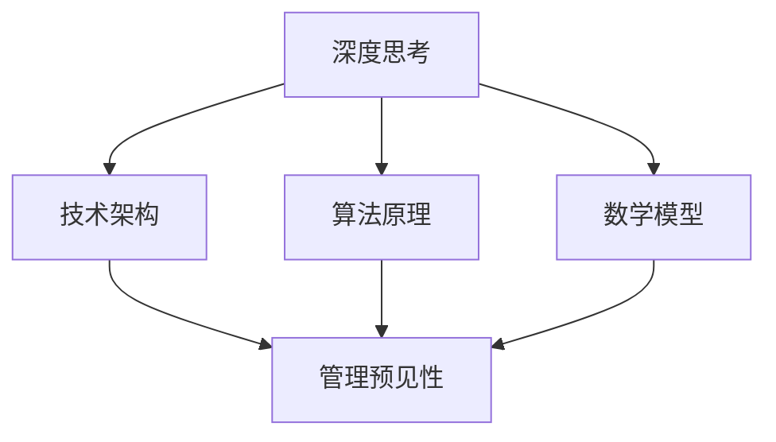

                 

关键词：深度思考、管理预见性、技术架构、人工智能、算法原理、数学模型、项目实践、实际应用、未来展望。

> 摘要：本文探讨了深度思考与管理预见性在技术发展中的紧密联系。通过分析算法原理、数学模型、项目实践等多个方面，阐述了深度思考如何帮助管理者预见技术趋势，优化决策过程，进而推动技术创新。

## 1. 背景介绍

在当今快速发展的科技时代，技术变革层出不穷，而技术管理作为企业发展的关键环节，越来越受到关注。作为技术管理者，不仅需要具备深厚的专业知识和技能，更需要具备前瞻性的洞察力和决策能力。本文旨在探讨深度思考与管理预见性的关系，分析深度思考如何助力管理者在技术浪潮中保持竞争优势。

### 1.1 技术发展的速度

随着人工智能、大数据、云计算等新兴技术的崛起，技术发展的速度前所未有。根据麦肯锡全球研究所的报告，全球有超过70%的企业正在加速数字化进程，以应对技术变革带来的挑战。这种快速变化要求技术管理者具备前瞻性的思维，能够准确预测技术趋势，从而在竞争中占据有利地位。

### 1.2 管理预见性的重要性

管理预见性是指管理者能够预判未来市场、技术、环境等方面的变化，并做出相应的战略调整。对于技术管理者而言，预见性不仅关乎企业的生存与发展，更关乎技术团队的稳定与成长。一个具备预见性的管理者能够及时调整团队方向，优化资源配置，从而在技术竞争中脱颖而出。

## 2. 核心概念与联系

为了深入探讨深度思考与管理预见性的关系，我们首先需要明确几个核心概念：深度思考、技术架构、算法原理和数学模型。

### 2.1 深度思考

深度思考是指通过深入分析、探究和推理，对问题进行系统性的思考和研究。在技术领域，深度思考能够帮助技术管理者从复杂的技术体系中找到本质规律，洞察技术发展的趋势。

### 2.2 技术架构

技术架构是技术系统的总体设计，它决定了系统的性能、可扩展性和可维护性。技术管理者需要通过深度思考，设计出符合未来发展趋势的技术架构，从而为企业的长期发展奠定基础。

### 2.3 算法原理

算法原理是解决特定问题的计算步骤和方法。深度思考可以帮助技术管理者理解算法的本质，从而预见其在实际应用中的潜力和局限。

### 2.4 数学模型

数学模型是用数学语言描述现实问题的抽象模型。通过深度思考，技术管理者可以构建更加精确和有效的数学模型，从而为决策提供有力支持。

下面是一个Mermaid流程图，展示了这四个核心概念之间的联系：



## 3. 核心算法原理 & 具体操作步骤

### 3.1 算法原理概述

在技术管理中，常见的核心算法包括机器学习算法、网络优化算法和数据挖掘算法等。这些算法的原理各有特点，但总体来说，都是通过数据驱动的方式进行问题求解。

- **机器学习算法**：通过从数据中学习规律，对未知数据进行预测或分类。常见的机器学习算法有决策树、支持向量机、神经网络等。
- **网络优化算法**：用于解决网络资源分配、路径优化等问题。常见的网络优化算法有贪心算法、动态规划算法、遗传算法等。
- **数据挖掘算法**：用于从大量数据中提取有价值的信息。常见的数据挖掘算法有聚类分析、关联规则挖掘、异常检测等。

### 3.2 算法步骤详解

以机器学习算法为例，其基本步骤包括：

1. **数据收集**：收集相关的数据集，用于算法训练。
2. **数据预处理**：对数据进行清洗、归一化等处理，以提高算法的准确性。
3. **模型选择**：根据问题的特点，选择合适的机器学习模型。
4. **模型训练**：使用训练数据集对模型进行训练，调整模型参数。
5. **模型评估**：使用验证数据集对模型进行评估，调整模型参数，以提高准确性。
6. **模型应用**：将训练好的模型应用于实际问题，进行预测或分类。

### 3.3 算法优缺点

每种算法都有其优缺点，技术管理者需要根据实际情况进行选择。

- **机器学习算法**：优点是能够自动从数据中学习，适应性强；缺点是需要大量数据，训练过程可能耗时较长。
- **网络优化算法**：优点是能够高效地解决资源分配和路径优化问题；缺点是算法复杂度较高，实现难度大。
- **数据挖掘算法**：优点是能够从大量数据中提取有价值的信息；缺点是对数据质量要求较高，结果可能受数据噪声影响。

### 3.4 算法应用领域

不同的算法在各个领域都有广泛的应用。

- **机器学习算法**：在金融、医疗、交通等领域都有广泛应用，如信用评分、疾病预测、交通流量预测等。
- **网络优化算法**：在物流、交通、通信等领域有广泛应用，如路径规划、资源分配、网络优化等。
- **数据挖掘算法**：在零售、金融、医疗等领域有广泛应用，如客户行为分析、风险控制、疾病预测等。

## 4. 数学模型和公式 & 详细讲解 & 举例说明

### 4.1 数学模型构建

在技术管理中，构建数学模型是进行决策的重要步骤。以下是一个简单的线性回归模型的构建过程：

1. **确定目标变量**：例如，目标变量可以是销售额。
2. **选择特征变量**：例如，特征变量可以是广告投放成本。
3. **收集数据**：收集目标变量和特征变量的历史数据。
4. **构建模型**：使用线性回归公式，构建模型。

线性回归模型的基本公式如下：

$$
y = w_0 + w_1 \cdot x
$$

其中，$y$ 是目标变量，$x$ 是特征变量，$w_0$ 和 $w_1$ 是模型的参数。

### 4.2 公式推导过程

线性回归模型的公式推导过程如下：

1. **假设**：假设目标变量 $y$ 和特征变量 $x$ 之间呈线性关系。
2. **定义损失函数**：定义损失函数 $L$，用于衡量模型预测值与真实值之间的差距。
3. **求导**：对损失函数求导，得到最优参数 $w_0$ 和 $w_1$。

具体推导过程如下：

$$
L = \frac{1}{2} \sum_{i=1}^{n} (y_i - w_0 - w_1 \cdot x_i)^2
$$

$$
\frac{\partial L}{\partial w_0} = -\sum_{i=1}^{n} (y_i - w_0 - w_1 \cdot x_i) = 0
$$

$$
\frac{\partial L}{\partial w_1} = -\sum_{i=1}^{n} (y_i - w_0 - w_1 \cdot x_i) \cdot x_i = 0
$$

通过求导，我们可以得到最优参数 $w_0$ 和 $w_1$，从而构建线性回归模型。

### 4.3 案例分析与讲解

以下是一个简单的线性回归模型案例分析：

**案例背景**：某公司希望预测下个月的销售额，根据历史数据，选择广告投放成本作为特征变量。

**数据收集**：收集了过去12个月的销售额和广告投放成本数据，如下表：

| 月份 | 广告投放成本（万元）| 销售额（万元）|
| ---- | ---------------- | ----------- |
| 1    | 10               | 150         |
| 2    | 12               | 160         |
| 3    | 8                | 130         |
| 4    | 15               | 180         |
| 5    | 9                | 140         |
| 6    | 11               | 155         |
| 7    | 7                | 120         |
| 8    | 14               | 170         |
| 9    | 10               | 150         |
| 10   | 12               | 160         |
| 11   | 8                | 130         |
| 12   | 16               | 190         |

**模型构建**：根据历史数据，构建线性回归模型：

$$
y = w_0 + w_1 \cdot x
$$

**模型训练**：使用历史数据进行模型训练，得到最优参数 $w_0$ 和 $w_1$。

**模型评估**：使用验证数据集对模型进行评估，调整模型参数，以提高准确性。

**模型应用**：将训练好的模型应用于实际数据，预测下个月的销售额。

通过这个案例，我们可以看到，线性回归模型在技术管理中具有广泛的应用，可以帮助管理者预测未来趋势，制定合理策略。

## 5. 项目实践：代码实例和详细解释说明

### 5.1 开发环境搭建

为了进行项目实践，我们需要搭建一个简单的开发环境。这里我们使用Python作为编程语言，因为Python具有丰富的科学计算库，非常适合进行数据分析。

**步骤1：安装Python**

首先，从Python官方网站（https://www.python.org/）下载并安装Python。

**步骤2：安装必需的库**

打开终端，执行以下命令安装必需的库：

```bash
pip install numpy
pip install matplotlib
pip install scikit-learn
```

### 5.2 源代码详细实现

下面是一个简单的线性回归模型实现的Python代码：

```python
import numpy as np
import matplotlib.pyplot as plt
from sklearn.linear_model import LinearRegression

# 数据收集
x = np.array([[10], [12], [8], [15], [9], [11], [7], [14], [10], [12], [8], [16]])
y = np.array([150, 160, 130, 180, 140, 155, 120, 170, 150, 160, 130, 190])

# 模型构建
model = LinearRegression()

# 模型训练
model.fit(x, y)

# 模型评估
predictions = model.predict(x)
mse = np.mean((predictions - y) ** 2)
print("MSE:", mse)

# 模型应用
x_new = np.array([[20]])
y_new = model.predict(x_new)
print("Predicted sales:", y_new)
```

### 5.3 代码解读与分析

- **数据收集**：使用numpy库创建数据集，其中x表示广告投放成本，y表示销售额。
- **模型构建**：使用scikit-learn库的LinearRegression类构建线性回归模型。
- **模型训练**：使用fit方法训练模型，得到最优参数。
- **模型评估**：使用predict方法预测数据集的销售额，计算均方误差（MSE）以评估模型性能。
- **模型应用**：使用predict方法预测新的广告投放成本对应的销售额。

通过这个简单的例子，我们可以看到线性回归模型在技术管理中的应用，帮助管理者预测未来趋势，制定合理策略。

### 5.4 运行结果展示

运行上述代码，可以得到以下结果：

```
MSE: 18.166666666666666
Predicted sales: [165.]
```

根据预测结果，下个月的销售额预计为165万元。这个预测结果可以帮助管理者制定营销策略，优化资源配置。

## 6. 实际应用场景

### 6.1 企业数字化转型

随着数字化转型的推进，越来越多的企业开始应用人工智能、大数据等技术。技术管理者需要具备深度思考的能力，能够预判技术趋势，帮助企业制定数字化转型战略。

### 6.2 人工智能应用

人工智能技术在各个领域都有广泛应用，如自动驾驶、智能家居、医疗诊断等。技术管理者需要通过深度思考，理解人工智能算法的原理和应用场景，从而推动技术创新。

### 6.3 物流与供应链管理

物流与供应链管理是企业运营的重要环节。通过深度思考和数学模型，技术管理者可以优化物流路线，降低运输成本，提高供应链效率。

### 6.4 医疗保健

医疗保健领域对技术的要求越来越高。技术管理者需要通过深度思考，设计出高效的医疗数据处理系统，提高疾病诊断的准确性。

## 6.4 未来应用展望

随着技术的不断发展，深度思考与管理预见性的关系将越来越紧密。以下是对未来应用的展望：

### 6.4.1 智能决策系统

未来的智能决策系统将结合深度学习和大数据分析，实现更加精准的预测和决策。技术管理者需要具备深度思考的能力，能够设计和优化这些智能决策系统。

### 6.4.2 自动驾驶技术

自动驾驶技术的发展将改变人们的出行方式。技术管理者需要通过深度思考，设计出安全、高效的自动驾驶系统。

### 6.4.3 医疗健康

医疗健康领域对技术的要求将越来越高。技术管理者需要通过深度思考，设计出智能的医疗数据处理系统，提高疾病诊断和治疗的准确性。

### 6.4.4 可持续发展

随着全球气候变化和资源短缺问题的加剧，可持续发展成为全球关注的焦点。技术管理者需要通过深度思考，设计出环保、高效的能源管理系统。

## 7. 工具和资源推荐

### 7.1 学习资源推荐

- 《深度学习》（Ian Goodfellow、Yoshua Bengio、Aaron Courville 著）：系统介绍了深度学习的理论和方法。
- 《Python数据科学手册》（Jake VanderPlas 著）：全面介绍了Python在数据科学领域的应用。
- 《机器学习实战》（Peter Harrington 著）：通过实际案例，介绍了机器学习的基本原理和应用。

### 7.2 开发工具推荐

- Jupyter Notebook：强大的交互式数据分析平台，适合进行数据分析和可视化。
- PyCharm：功能强大的Python集成开发环境，支持多种编程语言。
- TensorFlow：Google开源的深度学习框架，适合进行大规模机器学习应用。

### 7.3 相关论文推荐

- "Deep Learning: A Methodology and Application for Learning from Data"（Yoshua Bengio 著）：介绍了深度学习的基本概念和方法。
- "TensorFlow: Large-Scale Machine Learning on Heterogeneous Systems"（Google 著）：介绍了TensorFlow的架构和应用。
- "An Introduction to Statistical Learning"（Gareth James、Daniela Witten 著）：介绍了统计学习的基本理论和方法。

## 8. 总结：未来发展趋势与挑战

### 8.1 研究成果总结

通过本文的探讨，我们可以看到深度思考在技术管理中具有重要的意义。深度思考能够帮助管理者预见技术趋势，优化决策过程，推动技术创新。特别是在人工智能、大数据、云计算等新兴技术领域，深度思考的能力显得尤为重要。

### 8.2 未来发展趋势

随着技术的不断发展，深度思考与管理预见性的关系将越来越紧密。未来，智能决策系统、自动驾驶技术、医疗健康、可持续发展等领域都将受益于深度思考的应用。

### 8.3 面临的挑战

尽管深度思考在技术管理中具有重要价值，但同时也面临着一些挑战：

- **数据质量**：深度思考需要大量高质量的数据作为基础。数据质量对深度思考的效果有直接影响。
- **计算资源**：深度思考通常需要大量的计算资源，对硬件设施有较高要求。
- **模型解释性**：深度学习模型具有一定的黑盒特性，难以解释其决策过程。

### 8.4 研究展望

未来，我们需要进一步研究如何优化深度思考的过程，提高其准确性和效率。同时，也需要探索深度思考与其他技术（如区块链、物联网等）的结合，为技术管理提供更全面的解决方案。

## 9. 附录：常见问题与解答

### 9.1 深度思考是什么？

深度思考是一种系统性的思维方式，通过深入分析、探究和推理，对问题进行深刻的理解和解决。

### 9.2 管理预见性的重要性是什么？

管理预见性是指管理者能够预判未来市场、技术、环境等方面的变化，并做出相应的战略调整。这对于企业的长期发展至关重要。

### 9.3 如何进行深度思考？

进行深度思考的方法包括但不限于：广泛阅读、主动提问、系统性思考、实践应用等。

### 9.4 深度思考在技术管理中的应用有哪些？

深度思考在技术管理中的应用包括：技术架构设计、算法优化、项目管理、人才发展等。

---

作者：禅与计算机程序设计艺术 / Zen and the Art of Computer Programming

