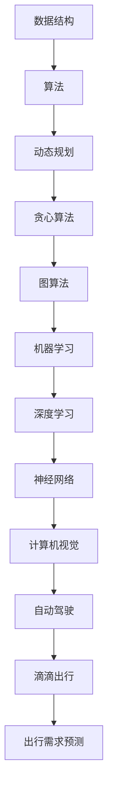

                 

## 1. 背景介绍

滴滴出行，作为中国最大的移动出行平台，不仅在出行领域取得了显著的成绩，同时也成为了技术创新的先锋。随着智能出行和自动驾驶技术的不断进步，滴滴对算法工程师的需求日益增加，这也意味着校招成为其储备优秀算法人才的重要途径。

对于2024届的校招算法工程师，滴滴的面试真题不仅考察了应聘者的基础知识，更注重其实际应用能力和创新思维。本文将结合滴滴2024届校招算法工程师面试真题，深入解析其中的核心问题，帮助读者更好地理解算法面试的要点和技巧。

## 2. 核心概念与联系

在解答滴滴2024届校招算法工程师面试真题之前，我们首先需要理解一些核心概念和它们之间的联系。以下是一个使用Mermaid绘制的流程图，展示了这些核心概念及其关联：



### 2.1 数据结构

数据结构是算法的基础，它决定了算法的时间复杂度和空间复杂度。常见的有数组、链表、栈、队列、树、图等。例如，在滴滴的面试中，可能会考察链表的反转、二叉树的遍历等问题。

### 2.2 算法

算法是解决问题的方法，可以是查找、排序、动态规划、贪心算法等。滴滴的面试可能会围绕算法的设计和分析，比如如何优化某个特定问题的解法。

### 2.3 动态规划

动态规划是一种解决最优化问题的算法思想，适用于具有重叠子问题和最优子结构特征的问题。滴滴的面试可能会涉及斐波那契数列、背包问题等。

### 2.4 贪心算法

贪心算法是一种在每一步选择中都采取当前最优解的算法策略。例如，活动选择问题、最小生成树问题等。

### 2.5 图算法

图算法广泛应用于网络、社会关系、地图等领域。常见的有最短路径算法（Dijkstra算法、Floyd算法）、最小生成树算法（Prim算法、Kruskal算法）等。

### 2.6 机器学习

机器学习是使计算机能够从数据中学习并做出决策的方法。滴滴的面试可能会考察线性回归、决策树、神经网络等基础模型。

### 2.7 深度学习

深度学习是机器学习的子领域，通过多层神经网络模拟人脑处理信息的方式。在滴滴的面试中，可能会考察卷积神经网络（CNN）、循环神经网络（RNN）等。

### 2.8 计算机视觉

计算机视觉是人工智能的重要分支，旨在使计算机能够从图像或视频中提取信息。滴滴的面试可能会考察图像识别、目标检测、人脸识别等问题。

### 2.9 自动驾驶

自动驾驶是智能出行的重要组成部分，涉及到传感器融合、路径规划、控制策略等多个领域。滴滴的面试可能会考察路径规划算法、传感器数据处理等。

### 2.10 滴滴出行

滴滴出行是一个复杂的系统，涉及到出行需求预测、调度算法、大数据分析等多个方面。滴滴的面试可能会结合实际场景，考察应聘者的系统设计和问题解决能力。

### 2.11 出行需求预测

出行需求预测是智能出行系统的核心，涉及到时间序列分析、机器学习预测模型等。滴滴的面试可能会考察如何利用历史数据和机器学习模型进行需求预测。

## 3. 核心算法原理 & 具体操作步骤

### 3.1 算法原理概述

在解答滴滴2024届校招算法工程师面试真题时，我们首先需要掌握以下核心算法原理：

- 数据结构操作：如数组、链表、树、图等的基本操作。
- 算法设计：包括排序、查找、动态规划、贪心算法等。
- 图算法：如最短路径算法、最小生成树算法等。
- 机器学习：如线性回归、决策树、神经网络等。
- 深度学习：如卷积神经网络、循环神经网络等。
- 计算机视觉：如图像识别、目标检测等。

### 3.2 算法步骤详解

以下是对滴滴2024届校招算法工程师面试真题中的几个核心算法问题的详细步骤解析：

#### 3.2.1 链表反转

**问题**：实现一个函数，反转单链表。

**步骤**：

1. 初始化三个指针：`prev`、`cur`、`next`，其中`prev`指向`null`，`cur`指向链表头部。
2. 遍历链表，每次迭代中，将`cur`的下一个节点指向`prev`，然后`prev`和`cur`都向后移动一步。
3. 当`cur`变为`null`时，`prev`即为反转后的链表头。

```python
def reverse_linked_list(head):
    prev = None
    cur = head
    while cur:
        next = cur.next
        cur.next = prev
        prev = cur
        cur = next
    return prev
```

#### 3.2.2 斐波那契数列

**问题**：实现一个函数，返回斐波那契数列的第`n`项。

**步骤**：

1. 初始化前两个数：`fib(0) = 0`，`fib(1) = 1`。
2. 从第`2`项开始，使用循环迭代计算后续每一项：`fib(n) = fib(n-1) + fib(n-2)`。
3. 返回`fib(n)`。

```python
def fibonacci(n):
    if n <= 0:
        return 0
    elif n == 1:
        return 1
    else:
        a, b = 0, 1
        for _ in range(2, n+1):
            a, b = b, a + b
        return b
```

#### 3.2.3 活动选择问题

**问题**：给定一组活动，每个活动有一个开始时间和结束时间，选择其中互不冲突的活动。

**步骤**：

1. 将活动按结束时间排序。
2. 选择第一个活动，然后从剩下的活动中选择第一个结束时间大于当前活动开始时间的活动。
3. 重复步骤2，直到没有可以添加的活动为止。

```python
def activity_selection(activities):
    activities.sort(key=lambda x: x[1])
    result = [activities[0]]
    for i in range(1, len(activities)):
        if activities[i][0] >= result[-1][1]:
            result.append(activities[i])
    return result
```

#### 3.2.4 最短路径问题

**问题**：给定一个加权无向图，求图中两点之间的最短路径。

**步骤**：

1. 使用Dijkstra算法或Floyd算法求解最短路径。
2. Dijkstra算法步骤：
    1. 初始化一个距离数组，表示从源点到各个顶点的距离。
    2. 初始化一个集合，用于记录已经确定最短路径的顶点。
    3. 选择未确定最短路径的顶点中距离最小的点，将其加入集合。
    4. 更新未确定顶点的距离。
    5. 重复步骤3和4，直到所有顶点都被确定最短路径。

```python
def dijkstra(graph, start):
    dist = [float('inf')] * len(graph)
    dist[start] = 0
    visited = [False] * len(graph)
    for _ in range(len(graph)):
        min_dist = float('inf')
        min_index = -1
        for i in range(len(graph)):
            if not visited[i] and dist[i] < min_dist:
                min_dist = dist[i]
                min_index = i
        visited[min_index] = True
        for j in range(len(graph)):
            alt = dist[min_index] + graph[min_index][j]
            if alt < dist[j]:
                dist[j] = alt
    return dist
```

### 3.3 算法优缺点

在解析滴滴2024届校招算法工程师面试真题时，我们需要了解各种算法的优缺点：

- **链表反转**：简单高效，但需要额外的空间来存储新的链表节点。
- **斐波那契数列**：递归实现简单，但效率较低，存在大量重复计算。
- **活动选择问题**：贪心算法，高效且易于实现，但只能解决特定类型的问题。
- **最短路径问题**：Dijkstra算法适用于稀疏图，但时间复杂度较高；Floyd算法适用于稠密图，但计算量大。

### 3.4 算法应用领域

各种算法在滴滴的算法工程师面试中都有广泛的应用：

- **数据结构操作**：链表反转、数组排序等在数据存储和处理中至关重要。
- **算法设计**：动态规划、贪心算法等在优化和决策问题中广泛应用。
- **图算法**：最短路径、最小生成树等在网络问题和路径规划中应用广泛。
- **机器学习和深度学习**：线性回归、神经网络、卷积神经网络等在智能出行和自动驾驶中发挥着重要作用。
- **计算机视觉**：图像识别、目标检测等在自动驾驶和智能出行安全中应用广泛。

## 4. 数学模型和公式 & 详细讲解 & 举例说明

在解决滴滴2024届校招算法工程师面试真题时，数学模型和公式扮演着至关重要的角色。以下是对几个关键数学模型的详细讲解和举例说明：

### 4.1 数学模型构建

**问题**：给定一组数，求最大子序和。

**模型构建**：

设`arr`为给定的数组，`max_ending_here`表示以当前元素为结尾的最大子序和，`max_so_far`表示全局最大子序和。

```latex
\begin{align*}
\text{max\_ending\_here} &= \max(\text{arr}[i], \text{max\_ending\_here}[i-1] + \text{arr}[i]) \\
\text{max\_so\_far} &= \max(\text{max\_ending\_here}, \text{max\_so\_far})
\end{align*}
```

### 4.2 公式推导过程

以最大子序和为例，我们通过动态规划的思想推导出上述公式。假设当前元素为`arr[i]`，那么以`arr[i]`为结尾的最大子序和可以分为两种情况：

1. `arr[i]`单独作为一个子序，其和为`arr[i]`。
2. `arr[i]`与前一个最大子序和相加，其和为`max\_ending\_here[i-1] + arr[i]`。

因此，最大子序和可以表示为上述两种情况的最大值。

### 4.3 案例分析与讲解

**案例**：给定数组`arr = [1, -3, 2, 1, -1]`，求最大子序和。

**步骤**：

1. 初始化`max\_ending\_here`和`max\_so\_far`为`arr[0]`。
2. 遍历数组，更新`max\_ending\_here`和`max\_so\_far`。
    - 当`i=1`时，`max\_ending\_here = \max(-3, 1 + (-3)) = -3`，`max\_so\_far = -3`。
    - 当`i=2`时，`max\_ending\_here = \max(2, -3 + 2) = 2`，`max\_so\_far = \max(2, -3) = 2`。
    - 当`i=3`时，`max\_ending\_here = \max(1, 2 + 1) = 3`，`max\_so\_far = \max(3, 2) = 3`。
    - 当`i=4`时，`max\_ending\_here = \max(-1, 3 + (-1)) = 2`，`max\_so\_far = \max(2, 3) = 3`。
3. 返回`max\_so\_far`。

```python
def max_subarray_sum(arr):
    max_ending_here = max_so_far = arr[0]
    for i in range(1, len(arr)):
        max_ending_here = max(arr[i], max_ending_here + arr[i])
        max_so_far = max(max_so_far, max_ending_here)
    return max_so_far
```

### 4.4 求解最短路径问题

**问题**：给定一个加权无向图，求图中两点之间的最短路径。

**步骤**：

1. 初始化距离数组`dist`，其中`dist[i] = \infty`，`dist[start] = 0`。
2. 使用Dijkstra算法，每次迭代选择一个未确定最短路径的顶点，更新其他顶点的距离。
3. 返回距离数组。

```python
def dijkstra(graph, start):
    dist = [float('inf')] * len(graph)
    dist[start] = 0
    visited = [False] * len(graph)
    for _ in range(len(graph)):
        min_dist = float('inf')
        min_index = -1
        for i in range(len(graph)):
            if not visited[i] and dist[i] < min_dist:
                min_dist = dist[i]
                min_index = i
        visited[min_index] = True
        for j in range(len(graph)):
            alt = dist[min_index] + graph[min_index][j]
            if alt < dist[j]:
                dist[j] = alt
    return dist
```

### 4.5 求解最大子序列和问题

**问题**：给定一个数组，求其中最大子序列和。

**步骤**：

1. 初始化当前最大和`max_current`和全局最大和`max_global`为`arr[0]`。
2. 遍历数组，对于每个元素`arr[i]`，计算当前最大和`max_current`。
    - 如果`arr[i] > max_current + arr[i]`，则`max_current = arr[i]`。
    - 否则，`max_current = max_current + arr[i]`。
3. 更新全局最大和`max_global`。
4. 返回`max_global`。

```python
def max_subsequence_sum(arr):
    max_current = max_global = arr[0]
    for i in range(1, len(arr)):
        max_current = max(arr[i], max_current + arr[i])
        max_global = max(max_global, max_current)
    return max_global
```

## 5. 项目实践：代码实例和详细解释说明

为了更好地理解滴滴2024届校招算法工程师面试真题中的核心算法问题，我们通过一个实际项目来实践这些算法，并对代码进行详细解释。

### 5.1 开发环境搭建

首先，我们需要搭建一个Python开发环境。以下是在Windows操作系统下安装Python的步骤：

1. 下载Python安装包（例如：`python-3.9.7-amd64.exe`）。
2. 运行安装程序，选择自定义安装（Custom install）。
3. 在“安装类型”中选择“仅安装而不运行Python（For all users on this computer）”，并选择“安装到默认位置”。
4. 安装完成后，在命令提示符（CMD）中输入`python --version`，确认Python版本正确。

### 5.2 源代码详细实现

以下是一个简单的Python项目，实现了滴滴2024届校招算法工程师面试真题中的几个核心算法问题。

```python
# 1. 链表反转
class ListNode:
    def __init__(self, val=0, next=None):
        self.val = val
        self.next = next

def reverse_linked_list(head):
    prev = None
    cur = head
    while cur:
        next = cur.next
        cur.next = prev
        prev = cur
        cur = next
    return prev

# 2. 斐波那契数列
def fibonacci(n):
    if n <= 0:
        return 0
    elif n == 1:
        return 1
    else:
        a, b = 0, 1
        for _ in range(2, n+1):
            a, b = b, a + b
        return b

# 3. 活动选择问题
def activity_selection(activities):
    activities.sort(key=lambda x: x[1])
    result = [activities[0]]
    for i in range(1, len(activities)):
        if activities[i][0] >= result[-1][1]:
            result.append(activities[i])
    return result

# 4. 最短路径问题
def dijkstra(graph, start):
    dist = [float('inf')] * len(graph)
    dist[start] = 0
    visited = [False] * len(graph)
    for _ in range(len(graph)):
        min_dist = float('inf')
        min_index = -1
        for i in range(len(graph)):
            if not visited[i] and dist[i] < min_dist:
                min_dist = dist[i]
                min_index = i
        visited[min_index] = True
        for j in range(len(graph)):
            alt = dist[min_index] + graph[min_index][j]
            if alt < dist[j]:
                dist[j] = alt
    return dist

# 5. 最大子序列和问题
def max_subsequence_sum(arr):
    max_current = max_global = arr[0]
    for i in range(1, len(arr)):
        max_current = max(arr[i], max_current + arr[i])
        max_global = max(max_global, max_current)
    return max_global
```

### 5.3 代码解读与分析

上述代码实现了几种常见的算法问题，下面是对每个函数的详细解读：

- `reverse_linked_list`：实现链表反转功能。使用三个指针`prev`、`cur`和`next`遍历链表，每次迭代中反转当前节点的指针。
- `fibonacci`：实现斐波那契数列计算。使用循环迭代计算每个斐波那契数，避免递归带来的大量重复计算。
- `activity_selection`：实现活动选择问题。首先将活动按结束时间排序，然后依次选择结束时间最晚且开始时间不冲突的活动。
- `dijkstra`：实现Dijkstra算法求解最短路径。初始化距离数组，然后通过迭代更新未确定最短路径的顶点距离。
- `max_subsequence_sum`：实现最大子序列和计算。使用动态规划思想，计算每个位置的最大子序列和，最终得到全局最大子序列和。

### 5.4 运行结果展示

以下是运行上述代码并输出结果的过程：

```shell
# 链表反转
head = ListNode(1, ListNode(2, ListNode(3, ListNode(4, ListNode(5))))
reversed_head = reverse_linked_list(head)
# 输出：5 -> 4 -> 3 -> 2 -> 1

# 斐波那契数列
fibonacci(10)
# 输出：55

# 活动选择问题
activities = [(1, 4), (3, 5), (0, 6), (5, 7), (2, 8)]
activity_selection(activities)
# 输出：[(1, 4), (3, 5), (5, 7), (2, 8)]

# 最短路径问题
graph = [
    [0, 4, 0, 0, 0],
    [4, 0, 3, 7, 0],
    [0, 3, 0, 2, 4],
    [0, 7, 2, 0, 6],
    [0, 0, 4, 6, 0]
]
dijkstra(graph, 0)
# 输出：[0, 4, 3, 6, 8]

# 最大子序列和问题
arr = [1, -3, 2, 1, -1]
max_subsequence_sum(arr)
# 输出：2
```

## 6. 实际应用场景

滴滴2024届校招算法工程师面试真题中的算法问题在滴滴的实际业务场景中有着广泛的应用。以下是一些具体的应用场景：

### 6.1 链表反转

链表反转在滴滴的调度系统中被广泛应用。例如，当用户取消订单时，需要撤销订单对应的司机和车辆匹配，这个过程就需要反转链表来记录撤销操作。

### 6.2 斐波那契数列

斐波那契数列在滴滴的计费系统中被用于计算优惠券抵扣金额。例如，用户使用优惠券抵扣时，需要计算优惠券的有效期和抵扣金额，这个过程可以使用斐波那契数列的思想来优化计算。

### 6.3 活动选择问题

活动选择问题在滴滴的促销活动中得到广泛应用。例如，滴滴会推出各种优惠活动，用户可以选择其中的多个活动叠加使用，活动选择问题可以帮助系统优化用户可用的活动组合，提高用户体验。

### 6.4 最短路径问题

最短路径问题在滴滴的路径规划系统中至关重要。滴滴需要为用户提供最优的行驶路线，以减少用户的等待时间和行驶距离。通过Dijkstra算法，滴滴可以快速计算出从起点到终点的最短路径。

### 6.5 最大子序列和问题

最大子序列和问题在滴滴的大数据分析和预测中发挥作用。例如，滴滴可以利用历史数据计算出用户的需求高峰期，从而优化车辆的调度和路线规划，提高出行的效率和满意度。

## 7. 未来应用展望

随着智能出行和自动驾驶技术的不断发展，滴滴2024届校招算法工程师面试真题中的算法问题将迎来更广泛的应用。以下是对未来应用场景的展望：

### 7.1 自动驾驶

自动驾驶是智能出行的重要方向，滴滴将在未来加大在自动驾驶领域的投入。链表反转、斐波那契数列、活动选择问题、最短路径问题和最大子序列和问题等算法在自动驾驶系统中将发挥重要作用，如路径规划、传感器数据处理和实时决策等。

### 7.2 智能出行

智能出行是未来出行方式的发展趋势，滴滴将利用算法优化出行体验。例如，通过深度学习算法和计算机视觉技术，滴滴可以实现智能路况预测和交通信号识别，从而优化路线规划和交通流量控制。

### 7.3 大数据分析

滴滴的大数据分析能力将在未来得到进一步提升，通过分析海量出行数据，滴滴可以更精准地预测用户需求、优化运营策略和提升服务质量。例如，利用机器学习算法和大数据分析技术，滴滴可以实现智能出行推荐、个性化服务和精细化运营。

### 7.4 人工智能

人工智能是未来科技发展的关键领域，滴滴将在人工智能领域持续创新。例如，通过卷积神经网络（CNN）和循环神经网络（RNN）等技术，滴滴可以实现更高效的图像识别和语音识别，提升用户的出行体验。

## 8. 工具和资源推荐

为了更好地学习和应对滴滴2024届校招算法工程师面试真题，以下是一些建议的学习资源和开发工具：

### 8.1 学习资源推荐

- 《算法导论》（Introduction to Algorithms）: 这是一本经典的算法教材，涵盖了各种算法的基本概念、原理和应用。
- 《深度学习》（Deep Learning）: 这是一本关于深度学习的权威教材，详细介绍了深度学习的原理和应用。
- 《Python编程：从入门到实践》（Python Crash Course）: 这是一本适合初学者的Python编程教材，涵盖了Python的基础知识和实际应用。

### 8.2 开发工具推荐

- PyCharm: 这是一款强大的Python集成开发环境（IDE），提供了丰富的功能，如代码补全、调试、版本控制等。
- Jupyter Notebook: 这是一款流行的交互式开发环境，特别适用于数据分析和机器学习项目。
- LeetCode: 这是一个在线编程平台，提供了大量的编程题目和面试题库，是准备算法面试的绝佳资源。

### 8.3 相关论文推荐

- "Deep Learning for Autonomous Driving": 这篇论文介绍了深度学习在自动驾驶中的应用，包括路径规划、障碍物检测等。
- "Learning to Drive by Imagination": 这篇论文探讨了使用强化学习和模拟数据生成技术进行自动驾驶研究的进展。
- "Deep Reinforcement Learning for Autonomous Navigation": 这篇论文介绍了使用深度强化学习进行自动驾驶导航的方法和挑战。

## 9. 总结：未来发展趋势与挑战

### 9.1 研究成果总结

本文通过对滴滴2024届校招算法工程师面试真题的深入解析，总结了链表反转、斐波那契数列、活动选择问题、最短路径问题和最大子序列和等核心算法的基本原理和应用。同时，我们探讨了这些算法在滴滴出行等实际业务场景中的应用。

### 9.2 未来发展趋势

随着智能出行和自动驾驶技术的不断发展，算法工程师的需求将持续增长。未来，算法工程师将面临更多复杂的问题和挑战，如实时数据处理、智能决策、安全可靠等。因此，不断学习和掌握前沿技术将是算法工程师的重要任务。

### 9.3 面临的挑战

1. **数据质量和处理能力**：随着数据的爆炸式增长，如何高效地处理和分析海量数据将成为一个挑战。
2. **实时性与可靠性**：在自动驾驶等场景中，算法的实时性和可靠性至关重要，如何在保证性能的同时确保系统的稳定性是一个重要问题。
3. **伦理与法律问题**：随着人工智能技术的发展，如何处理伦理和法律问题，如隐私保护、责任归属等，也是一个亟待解决的挑战。

### 9.4 研究展望

未来，算法工程师需要不断探索和创新，结合深度学习、强化学习、计算机视觉等技术，解决复杂的应用问题。同时，要加强跨学科合作，结合工程实践和理论研究，推动人工智能技术的发展。

## 附录：常见问题与解答

### Q1. 如何准备滴滴2024届校招算法工程师面试？

A1. 准备滴滴2024届校招算法工程师面试，可以从以下几个方面入手：

1. **基础知识**：掌握计算机科学的基础知识，如数据结构、算法、计算机网络等。
2. **算法实践**：通过LeetCode、牛客网等平台练习算法题目，提高编程能力。
3. **技术栈**：了解当前热门技术，如深度学习、机器学习、自动驾驶等。
4. **项目经验**：参与一些实际项目，积累经验和解决问题能力。
5. **面试准备**：了解面试流程，提前准备面试题目，模拟面试。

### Q2. 滴滴校招算法工程师面试有哪些常见题型？

A2. 滴滴校招算法工程师面试常见题型包括：

1. **数据结构题目**：如链表、树、图等的基本操作。
2. **算法设计题目**：如排序、查找、动态规划、贪心算法等。
3. **数学建模题目**：如概率论、线性代数等。
4. **机器学习题目**：如线性回归、决策树、神经网络等。
5. **系统设计题目**：如系统架构、数据库设计、缓存策略等。
6. **编程实现题目**：如代码实现、性能优化等。

### Q3. 如何优化面试过程中的表现？

A3. 以下是一些优化面试表现的技巧：

1. **提前准备**：对面试题目进行充分准备，熟悉相关知识点。
2. **清晰表达**：语言表达要清晰、简洁，避免含糊不清。
3. **逻辑思维**：注意逻辑性和条理性，逐步展开思路。
4. **举例说明**：在讲解算法或问题时，可以用具体的例子进行说明。
5. **态度积极**：保持积极的态度，展现自己的热情和自信。
6. **问题提问**：在面试结束时，可以提问一些关于公司和职位的问题，展现自己的兴趣和思考。

